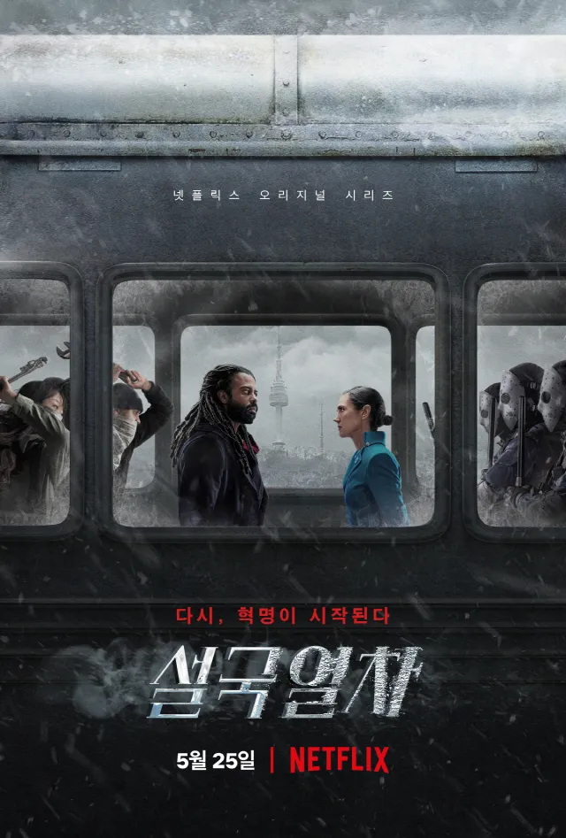

설국열차 시즌 4는 TNT에서 AMC로 채널을 옮긴 뒤 2024년 7월부터 9월까지 방영된 **시리즈 최종 시즌**이다. 시즌 3 피날레 이후 설국열차와 빅 앨리스가 갈라지고, 일부 생존자는 아프리카 뿔 일대 **뉴에덴(New Eden)**에 정착하며 멜라니 캐빌은 열차 쪽 과학·엔진 축을 잇는다. 본 시즌은 **플래시백·플래시포워드가 섞인 비선형 서사**로, "약 9개월 후" 뉴에덴 일상과 점령 직후 사일로·지부티 벙커 시점을 오간다. 국제평화유지군(IPF)의 **Anton Milius(안톤 밀리어스)**와 애니멀 스쿼드가 열차를 장악하고, 멜라니의 옛 동료 **Dr. Nima Rousseau(니마 루소)**는 대기에 **제미니(Gemini)**를 살포해 CW-7을 중화하겠다고 주장하지만, 데이터상으로는 **산소를 파괴해 인류를 멸절**시킬 루트로 읽힌다. 레이턴 일행은 리아나 납치·빅 앨리스 거래·사일로 실험의 진실을 거쳐 **로켓 발사를 막고** 열차를 되찾은 뒤 뉴에덴에 **영구 거점**을 두는 쪽으로 피날레를 맞춘다.

## 시즌 개요

### 시리즈 정보
* **제목**: Snowpiercer / 설국열차
* **시즌**: 시즌 4 (총 10 에피소드, 시리즈 피날레)
* **쇼러너**: Paul Zbyszewski (폴 지비셰프스키) — 시즌 4 전담; 시즌 1–3는 Graeme Manson 등이 맡음
* **감독**: Christoph Schrewe, Leslie Hope, Joe Menendez
* **주연**: Jennifer Connelly (Melanie Cavill), Daveed Diggs (Andre Layton), Sean Bean (Joseph Wilford), Rowan Blanchard (Alexandra "Alex" Cavill), Alison Wright (Ruth Wardell), Mickey Sumner (Bess Till), Katie McGuinness (Josie Wellstead), Iddo Goldberg (Bennett Knox), Lena Hall (Miss Audrey), Mike O'Malley (Sam Roche), Roberto Urbina (Javier "Javi" de la Torre), Sheila Vand (Zarah Ferami)
* **시즌 4 신규 출연**: Clark Gregg (Admiral Anton Milius), Michael Aronov (Dr. Nima Rousseau)
* **음악**: Bear McCreary (시리즈)
* **장르**: Science Fiction, Drama, Thriller, Post-Apocalyptic
* **에피소드 러닝타임**: 평균 45–50분
* **방영 기간**: 2024.07.21 – 2024.09.22
* **방영 채널/플랫폼**: AMC, AMC+ (미국); TNT에서 2023년 시즌4 취소 후 AMC가 인수하여 방영
* **제작사**: Tomorrow Studios, CJ Entertainment, Studio T
* **원작**: Jacques Lob, Jean-Marc Rochette (그래픽 노블); Bong Joon-ho 영화(2013)와 동일 세계관
* **평점**: Rotten Tomatoes 시즌4 페이지 있음, IGN 등 매체 리뷰 다수

### 시즌 주제

시즌 4는 **분리된 인류의 재통합**과 **과거 실수(대동결·제미니)의 반복 방지**를 축으로 한다. 멜라니는 열차의 과학·엔지니어링 책임자로, 레이턴은 뉴에덴의 정치적 리더로 각자 역할을 하다가, Milius·Wilford·Nima의 위협 앞에서 다시 한 번 협력한다. 니마는 자신이 일으킨 대동결을 되돌리려 제미니 로켓을 발사하려 하나, 실제로는 대기를 오염시켜 인류를 멸절시키는 계획임이 드러나고, 알렉스의 사보타주로 로켓이 실패한다. 조시는 Dr. Headwood에 대한 복수 대신 용서를 선택하며 구원과 성장을 완성한다.

### 추천 대상
* **설국열차 시즌 1–3 시청자**: 시리즈 결말을 반드시 봐야 하는 대상
* **포스트아포칼립스·계급 알레고리 좋아하는 시청자**: 열차=계급 구조, 뉴에덴=새 시작의 상징이 피날레까지 유지됨
* **Jennifer Connelly·Daveed Diggs 팬**: 멜라니와 레이턴의 리더십과 관계가 마지막까지 중심에 있음

### 시점·타임라인(비선형 서사)

에피소드 초반은 **로켓 목격 → 9개월 후 뉴에덴**처럼 시간을 크게 점프하고, 이어서 **밀리어스 점령 직후**(틸 부상·멜라니 항복·지부티 벙커 도킹)가 **플래시백**으로 삽입된다. 팬덤·보도에서는 시즌 3 종료 후 **약 3~12개월**에 걸친 시점이 혼재한다고 정리하는 경우도 있어, "9개월" 고지 하나에만 고정하지 않고 **회차마다 제시되는 시간 표지**(○개월 전, 점령 당일, 뉴에덴 현재)를 기준으로 읽는 것이 안전하다.

## 구조 분석 (Act-first 보조 도식)

## 에피소드 가이드

| 회차 | 제목 | 방영일 | 한 줄 요약 |
|------|------|--------|-----------|
| E01 | "Snakes in the Garden" | 2024.07.21 | IPF 설국열차 점령, 오즈 은둔/LJ 환청, 오드리 부상 도착, 리아나 납치·자라 사망 |
| E02 | "The Sting of Survival" | 2024.07.28 | 점령 플래시백(틸 총상·멜라니 항복·100명 동결 인질), 지부티 벙커·니마 제미니 제안, 오드리 발사차량 경고 |
| E03 | "Life Source" | 2024.08.04 | 빅앨리스를 겨냥한 화학무기 함정이 드러나고, 뉴에덴은 주민 투표로 제한 추격을 결정한다 |
| E04 | "North Star" | 2024.08.11 | 뉴에덴 혹한·절단된 손, 레이턴-조시 열차 점프, 애니멀 스쿼드 실험 피해자 정체, 리아나 거래 제안 |
| E05 | "The Engineer" | 2024.08.18 | 윌포드 납치 배후, 베넷 수동 분리 희생 동사, 알렉스 사일로 잔류, 마일스 빅앨리스 운전 |
| E06 | "Bell the Cat" | 2024.08.25 | 윌포드 구조 플래시백, 레벨3 실험 폭로, 베넷 추모 비문, 스튜 정체·산사면 폭약 발견 |
| E07 | "A Moth to a Flame" | 2024.09.01 | 밀리어스 쿠데타 플래시백, 제미니 대기침식 경고, 윌포드가 극저온 트랩으로 밀리어스 살해 후 독담배 자살, 니마 CW-7 창시자 폭로, 가족칸 절단·다리 폭발 |
| E08 | "By Weeping Cross" | 2024.09.08 | 자비 폭탄 생존, 뉴에덴 엔진 이동, 로슈의 레이턴 가족 구조, 저격수 사격으로 전투 시작 |
| E09 | "Dominant Traits" | 2024.09.15 | 알렉스 선로전환 파괴, 버팔로=오즈 라디오 목소리, 틸 저격수+라트 제거, 니마=알렉스 생부, 자비 재밍으로 폭약 기폭 실패 |
| E10 | "Last Stop" | 2024.09.22 | 루스-Z-렉-사이크스 반란, 조시의 헤드우드 용서, 해양·발사대 돌파, 알렉스 사보타주로 로켓 실패·니마 종말, 뉴에덴 정착·꽃 엔딩 |

### 에피소드별 핵심 사건 요약

- **E01 "Snakes in the Garden"**: 베넷과 틸이 로켓 잔해를 조사하다 밀리어스의 애니멀 스쿼드에게 습격당하고 설국열차가 장악된다. 화면은 **9개월 뒤 뉴에덴**으로 넘어가 레이턴·조시의 관계와 타운 카운실, 알렉스의 지진·코피, 오즈의 붕괴가 동시에 깔린다. 부상한 오드리가 경고를 전하자마자 리아나가 납치되고 자라가 낙사해 사망한다.

- **E02 "The Sting of Survival"**: 점령 직후 플래시백에서 틸이 총상을 입고 멜라니는 베넷 목숨을 지키려 엔진을 넘기지만 둘이 탈출한다. 밀리어스는 100명을 동결 칸에 가두고 열차를 **지부티 지하 벙커**에 붙인 뒤, 니마가 **제미니 대기 살포** 계획을 제시한다. 마일스가 매복을 엿듣자 베넷·틸이 오드리를 궤도 차량으로 뉴에덴에 보내고, 그 결과 빅앨리스를 겨냥한 함정이 촉발된다.

- **E03 "Life Source"**: 베넷·틸은 마지막 칸의 **화학무기** 배선 임무에서 진짜 목적이 빅앨리스 제거임을 깨친다. 뉴에덴에서는 루스가 엔진 반출을 꺼리다가 자비의 **3주 전력** 약속과 주민 투표로 레이턴의 추격이 허용된다. 알렉스는 뉴에덴 기후가 불안정할 수 있다는 데이터를 남긴다.

- **E04 "North Star"**: 빅앨리스 출발 후 뉴에덴은 추위에 시달리고, 절단된 손에서 설국열차 접근 칩이 나와 **내부 침투**가 확인된다. 레이턴과 조시가 달리는 열차 사이를 뛰어 설국열차에 올라타고, 조시는 틸·마일스를 풀어주다 잡힌다. 니마는 애니멀 스쿼드가 **실험 피해자**임을 폭로하고 밀리어스는 **리아나 vs 빅앨리스** 맞교환을 제안한다.

- **E05 "The Engineer"**: 레이턴이 딸과 통화한 뒤 빅앨리스를 넘기지만, 사일로에서 **윌포드가 납치의 배후**임이 드러난다. 헤드우드는 조시 혈액을 뽑고 알렉스는 사일로에 남는다. 루스·베넷·틸의 탈출 작전에서 베넷이 **수동 디커플링**을 맡아 극저온에 노출되어 사망하고, 빅앨리스는 마일스 조종으로 뉴에덴을 향한다.

- **E06 "Bell the Cat"**: 윌포드가 밀리어스에게 구출된 뒤 헤드우드의 **내한 치료**로 버티는 과거가 겹친다. 레이턴·윌포드는 레벨3에서 흉터 생존자들과 만나 동맹하고, 니마는 **제미니 독성**과 인체 실험을 고백한다. 뉴에덴에서는 스튜 위긴스가 자신의 손과 밀리어스 측 임무를 고백하고, 오즈가 산사면 **원격 폭약**을 찾는다.

- **E07 "A Moth to a Flame"**: 콜드 오프닝에서 밀리어스가 **창 제독 일행을 가스로 제거**하고 권력을 잡은 과거가 나온다. 멜라니는 제미니가 **대기·산소를 파괴**할 수 있다는 데이터로 니마를 막으려 하지만 니마는 가스로 멜라니를 제압하고 열차를 빼앗는다. 윌포드는 밀리어스를 **치명 저온으로 유지된 층**으로 유인해 눈복으로 버티게 한 뒤, **조시 수혈로 얻은 내한**으로 살아남아 밀리어스의 **호흡 튜브를 뜯고 헬멧을 벗겨** 밀리어스를 얼려 죽인다. 이어 윌포드는 **독이 묻은 시가**로 자살하며 니마가 **CW-7의 창시자**임을 폭로하고, 니마는 레이턴 가족 칸을 끊고 뉴에덴 다리에서 자비 쪽 **폭발**이 일어난다.

- **E08 "By Weeping Cross"**: 자비는 폭발에서 살아남고 빅앨리스가 뉴에덴에 도착한다. 끊긴 칸에서 얼어 가던 레이턴 가족은 로슈에게 구조된다. 니마는 발사 시기를 놓치면 **5년 대기**를 각오하며 뉴에덴을 포위하고, 마을은 엔진을 안으로 끌어 들여 산악 폭약만으로는 못 박아 못 쓰게 만든다. 저격수가 쏘며 전투가 개시되고 알렉스는 선로 전환 명령에 휘말린다.

- **E09 "Dominant Traits"**: 알렉스가 선로 전환 장치를 **사보타주**하고 레이턴과 탈출한다. 오즈는 라디오로 저격수를 흔들고 **버팔로**의 정체를 밝히며, 틸이 에이스 오브 스페이드와 **라트**를 제거한다. 멜라니는 알렉스에게 **니마가 생물학적 아버지(정자 기증)**임을 고백하고, 마취가스 연기 끝에 열차 탈환이 진행된다. 니마의 산악 기폭은 자비의 **재밍**으로 막힌다.

- **E10 "Last Stop" (시리즈 피날레)**: 니마가 빅앨리스 조타를 망가뜨린 채 도주하고 루스는 포로가 되지만 **Z-렉·사이크스**와 합세해 승객을 규합한다. 헤드우드가 부활시킨 라트는 레이턴에게 최종 처리되고, 조시는 헤드우드를 **죽이지 않고** 용서한다. 설국열차는 **캐터필러 트랙**으로 얼어붙은 바다를 건너 발사대에 도달하고, 알렉스가 **페이로드 해치 볼트**를 빼 둔 탓에 로켓은 상승 후 **탄두가 얼어 바다로 추락**한다. 니마는 발사실에서 **동사**하고, 멜라니의 **PA 방송**과 뉴에덴 **꽃** 샷으로 시리즈가 막는다.

## 시즌의 전체 내용 (스포일러 포함)

시즌 4는 **IPF 점령과 뉴에덴 정착(E01-E02) → 화학무기 함정과 빅앨리스 반격(E03-E04) → 윌포드 배후·베넷 희생(E05-E06) → 제미니 대기침식 경고·밀리어스 사망·윌포드 자살·뉴에덴 공방전(E07-E08) → 열차 탈환·로켓 사보타주·뉴에덴 영구 정착(E09-E10)** 구조로 전개된다. 핵심 축은 리아나 납치, 애니멀 스쿼드의 정체, 제미니가 만들 **생태적 재앙** 가능성, 니마가 대동결의 원인 제공자라는 반전, 그리고 **조시의 혈액을 이용한 윌포드의 내한**이 밀리어스의 죽음을 어떻게 뒤집는지이다.

### Act 1 (Setup): 점령과 경고 — [E01-E02]

#### [E01] "Snakes in the Garden" (정원의 뱀) — 상세 장면 분석

**[E01-S01] 설국열차 점령과 9개월의 간극**: **Bennett Knox(베넷 녹스)**와 **Bess Till(베스 틸)**이 눈 덮인 지상에서 **로켓 잔해**를 조사하다가, 수풀에서 기다리던 **IPF** 보병과 **Animal Squad(애니멀 스쿼드)**에게 **매복**당한다. **Admiral Milius(밀리어스)** 지휘하에 부대가 갑판·객차로 돌입하고, 엔진실 방향 압박이 이어지며 열차는 **사실상 군 점령**으로 전환된다. 화면이 끊겼다가 **“9개월 후” 뉴에덴**으로 점프하면, **Andre Layton(레이턴)**과 **Josie Wellstead(조시)**는 연인으로 같은 공동체에 살고 **Ruth Wardell(루스)**·**Sam Roche(로슈)**·**Javier de la Torre(자비)**·**Alexandra Cavill(알렉스)**가 **타운 카운실**을 돌린다. 알렉스는 회의보다 **지진 데이터**와 반복되는 **코피(nosebleed)** 원인에 매달리고, **Lights(라이츠)** 등의 기술 지원을 받아 기록을 쌓는다. **Oz(오즈)**는 은둔하며 **LJ**에 대한 **환청**과 “설국열차 승객 전원 사망”이라는 **왜곡된 확신**에 묶여 있다.

**[E01-S02] 긴장의 불씨**: 레이턴은 **다리·외곽 인프라 복구**를 주도하지만, 주민 일부는 **열차 쪽과 다시 맞닿는 것**을 두려워한다. 설국열차에서 온 **짧은 메시지**와, 레이턴이 **사보타주**로 읽을 만한 **연쇄 이상 징후**(장비·통신·전력)가 뉴에덴 안에서 **동시다발**로 터지며, 곧 올 **침공 전조**로 해석될 여지를 남긴다.

**[E01-S03] 오드리의 경고·리아나 납치·자라의 죽음**: **Miss Audrey(미스 오드리)**가 **궤도(orbital) 차량**으로 도착할 때 이미 **중상**이며, “그들이 온다”는 식의 **경고**만 겨우 전한다. 거의 같은 시각 **Dr. Headwood(헤드우드)** 쪽 연줄을 탄 밀리어스 측 인물이 **Liana Layton(리아나 레이턴)**을 납치하고 로슈를 **기절**시킨다. **Zarah Ferami(자라 페라미)**가 막아서자 가해자는 **절벽 가장자리에서 밀쳐** 자라를 추락시키고, 자라는 낙하 직전 **조시·Boki(보키)**에게 **적의 접근**을 알린 뒤 사망한다. 이로써 레이턴의 동기는 **딸 회수 + 복수**로 고정되고, 뉴에덴 방어선은 **전시 체제**로 넘어갈 촉매가 된다.

#### [E02] "The Sting of Survival" (생존의 쏘임) — 상세 장면 분석

**[E02-S01] 점령 당시 플래시백**: 밀리어스 부대가 **엔진실**로 밀고 들어오는 순간, 틸이 **Melanie Cavill(멜라니)**·**Miles(마일스)**에게 **경보**를 외치려다 **총탄**에 맞아 쓰러진다. 오드리가 **패닉 버튼**을 누르고, 멜라니는 마일스를 **안전 구역**으로 보낸 뒤 **엔진 앞 바리케이드**를 친다. 밀리어스가 **Bennett(베넷)** 목에 총을 겨누며 **항복**을 강요하자 멜라니는 일단 **엔진 통제권을 넘기는 척**하지만, 근접한 병사를 **베넷과 함께 제압·살해**하고 **혈로를 뚫어 탈출**한다.

**[E02-S02] 지부티 벙커와 니마의 제안**: 밀리어스는 **약 100명**을 **Drawers(드로어, 동결 보관함)**에 가두어 **인질·노동력**으로 쓴다. 멜라니가 **몰래 엔진 구역**으로 잠입해 이들을 **해동·이동**시키는 동안, 열차는 **지부티 산악 지하 벙커**에 **도킹**된다. 벙커에서 **Dr. Nima Rousseau(니마 루소)**가 나타나, 대동결 직후 **엘리트 과학자**들이 피신해 **CW-7을 대기 중에서 분해**할 **Gemini(제미니)** 합성 경로를 찾았다고 주장한다. 그는 **설국열차를 이동 살포 플랫폼**으로 쓰자고 제안하고, 멜라니는 **데이터 검증·승객 생존** 등을 조건으로 **조건부 협력**을 맺으며 밀리어스와 **군사적 공존**을 잠정 수용한다.

**[E02-S03] 오드리의 뉴에덴 도착 경위**: 다시 **뉴에덴 현재 시점**으로 돌아오면, 마일스가 **밀리어스의 매복·오드리 제거 계획**을 **엿듣는다**. 베넷과 틸은 오드리를 **궤도 발사 차량**에 태워 **뉴에덴으로 보내 경고**를 전하게 하고, 그 결과 밀리어스 측은 **시간표를 앞당길 수밖에 없어진다**. 열차 안에서는 그 **가속된 일정**에 맞춰 **마지막 칸 화학무기 배선** 같은 **빅 앨리스(Big Alice) 겨냥 함정**이 급조되며, E03의 **독가스/화학탄** 떡밥으로 직결된다.

### Act 2 (Inciting & Rising): 반격의 출발 — [E03-E04]

#### [E03] "Life Source" (생명의 원천) — 상세 장면 분석

**[E03-S01] 화학무기 함정 확인**: 점령된 설국열차는 **강제 노동·감시**가 깔린 **사실상 수용소 열차**이고, 베넷·틸은 **꼬리 쪽 마지막 칸**에서 **“비료”** 명목의 **배선·적재** 임무를 받는다. 연결 과정에서 **독성·분무 메커니즘**을 알아채 **화학무기(빅 앨리스 승객을 노리는 독가스 계열)**로 판단한다. 밀리어스에게 **역이용·교섭**을 시도하지만 **봉쇄**당하고, 틸은 니마 경유로 **오드리 무사 도착**을 확인한다. 함정의 **전술**이 드러난다 — 오드리를 보낸 뒤 IPF는 **빅 앨리스 접촉 시점을 앞당길 수밖에 없었고**, 그 일정에 맞춰 **독칸 연결이 급조**된 것이다.

**[E03-S02] 뉴에덴의 민주적 결단**: 레이턴은 **빅 앨리스 엔진 + 최소 편성**으로 설국열차를 **추격**하려 하고, 루스는 **마을 전력·방어 공백**을 이유로 **엔진 반출**을 거부한다. 자비는 **빅 앨리스를 떼어낸 뒤에도** 저장·보조 회로로 **약 3주 전력**을 유지할 수 있다고 **기술적 보증**을 서고, 로슈가 둘 사이를 중재해 **주민 투표**에 부친다. 결과는 **엔진 + 4칸**·**3주 내 복귀**가 붙은 **제한적 원정**이며, **Tail** 전투원·알렉스에 **루스까지 자원**해 **정치적 정당성**을 확보한다.

**[E03-S03] 알렉스의 불길한 데이터**: 출발 직전 알렉스는 자비에게 **뉴에덴 “온난 포켓”**이 **지질·대기 역학상 일시적**일 수 있다는 **시뮬레이션·관측 요약**을 넘긴다. 이 자료는 이후 **제미니 노출**과 **새·고도 실험** 데이터가 맞물려 **“구원 명목 살포 = 대기·산소 파괴”** 논증의 **과학적 밑받침**이 되고, 알렉스의 **코피**도 같은 **독성 축**으로 **회수**된다.

#### [E04] "North Star" (북극성) — 상세 장면 분석

**[E04-S01] 뉴에덴 혹한과 내부 침투**: **빅 앨리스**가 떠난 지 **약 1주**, 뉴에덴은 **한파**로 들어가 **전력·난방 여유**가 바닥난다. **Oz(오즈)**가 순찰 중 **절단된 손**을 발견하고 **Roche(로슈)**와 현장을 덮친 **눈보라** 속에서 잠시 **이탈**한다. 오즈는 **라디오**로 **여성 목소리**(이후 **버팔로** 축으로 연결)를 듣고, 로슈는 **정찰병/장비**의 흔적을 목격한다. **Javi(자비)**는 **Sykes(사이크스)**에게 손을 넘겨 **부검·전자 분석**을 시키고, 손 안에 **설국열차 접근용 칩**이 박혀 있음이 드러나 **뉴에덴 내부 협력자 또는 침투 경로**가 열려 있음이 **물리 증거**로 확정된다.

**[E04-S02] 열차 점프 탑승과 구출**: 빅 앨리스가 **병렬 속도**를 맞춰 설국열차를 **따라잡자**, 레이턴·조시가 **객차 간 갭**을 **달리며 뛰어넘는 coupler 점프**로 설국열차에 **강제 탑승**한다. 칸 안 **동조 승객**이 문을 열고 시선을 돌리는 사이 조시는 **틸·마일스**를 **구속에서 풀어주지만**, 역으로 **밀리어스 병력**에게 **조시가 포박**된다. 레이턴은 **혼란 속 탈출**에 성공해 **사일로·거래선** 쪽 서사로 이어진다.

**[E04-S03] 애니멀 스쿼드의 정체와 리아나 거래**: 니마는 **스쿼드원 한 명을 살해**한 뒤, **탈출한 레이턴** 앞에서 **사일로 연구의 실체**를 **데모**처럼 펼친다. **Animal Squad**는 **군복 아래**에서 **제미니·냉기 실험**을 당한 **피해자·병사**들이며, 밀리어스는 이들을 **원격 통제·인간 방패**로 쓴다. 밀리어스는 **빅 앨리스를 설국열차에 물리·전기적으로 종속(couple)**시킨 뒤 **“Liana ↔ Big Alice”** **맞교환**을 제안해, 레이턴의 **아버지 역할**을 **전략적 지렛대**로 삼는다.

### Act 3 (Complications): 희생과 폭로 — [E05-E06]

#### [E05] "The Engineer" (엔지니어) — 상세 장면 분석

**[E05-S01] 윌포드의 배후 확인**: 밀리어스가 **리아나와의 짧은 통화**를 **미끼**로 허용하자 레이턴은 **감정적 압박** 아래 **빅 앨리스 인도**를 수락한다. **Silo(사일로)**에서 **Joseph Wilford(조지프 윌포드)**가 **납치 시나리오의 설계자**임이 드러난다 — 그는 밀리어스에게 **구조된 뒤**에도 **엔진 신화·심리전**으로 **리아나 거래**를 밀어붙였다. **Mrs. Headwood(헤드우드 부인)**는 조시에게서 **내한·혈장 샘플**을 **채혈**하고, **Alex(알렉스)**는 **윌포드의 서사**(과거 엔진·멜라니)를 **검증**하려 **일부러 사일로에 잔류**한다.

**[E05-S02] 베넷의 희생**: **Ruth(루스)**·**Bennett(베넷)**·**Till(틸)**이 **동시 타격**으로 **빅 앨리스 엔진·조타실**을 탈환하고 **Pelton(펠턴)**·**Tristan(트리스탄)**·**Miles(마일스)** 등 동조 승객을 **끌어올린다**. 마일스가 **뉴에덴 회항 코스**를 맡는 동안, 베넷은 **수동 디커플 링(lever/hydraulics)** 옆에 **고정**되어 **inter-car gasket** 밖 **극저온(-밖 공기)**에 **직접 노출**된다. **manual override**를 **당겨 연결 핀을 해제**한 직후 그는 **동결 사망**하고, 빅 앨리스만 **관성·추진**으로 **설국열차에서 분리**되어 **뉴에덴 방향 가속**이 가능해진다.

**[E05-S03] 사일로의 알렉스**: 밀리어스는 **Layton(레이턴)**을 끌고 **윌포드가 감금·돌보는 리아나**가 있는 칸으로 이동시킨다. **Nima(니마)**는 알렉스의 **반복 코피**를 **제미니 노출 지표**로 읽으며, **뉴에덴 기후 포켓이 ‘가짜 낙원’**일 수 있다는 말로 **심리적 압박**을 가한다 — 이는 이후 **새 실험 데이터**와 맞물려 **대기 파괴 시나리오**의 **정당화 시도**로 이어진다.

#### [E06] "Bell the Cat" (고양이에게 방울 달기) — 상세 장면 분석

**[E06-S01] 윌포드 구조 플래시백과 레벨3 실험**: **플래시백**에서 **약 11개월 전**, 얼어 죽기 직전 **윌포드**가 밀리어스군에게 **발견**되고 **Headwood**가 **조시 유래 혈액**으로 **내한 치료**를 **몰래 주입**한다. **현재** 윌포드와 레이턴은 **Level 3(하층 독가스 실험 구역)**에 **같이 버려져** 서로를 **죽이게 만들려는** 밀리어스의 **엔터테인먼트형 처형**에 놓인다. 둘은 **가스 화상·절단 흔적**이 있는 **모록스 계열 생존자**와 합류해 **총·문**을 **연쇄적으로 뚫고** 상층으로 **탈출 루트**를 연다. **Nima**는 **Alex**에게 **코피 = 제미니(CW-7 분해 중간체) 독성**이며, **사고·유출 뒤 정제 공정**에서 **레벨3 거주민을 인체 필터**로 썼다고 **자백**한다.

**[E06-S02] 베넷 추모와 산사면 폭약**: 빅 앨리스 **조타실 상단**에 루스·틸이 **베넷의 이름·날짜**를 **각인**해 **전력 부족** 속 **사기**를 붙잡는다. 뉴에덴에서는 **실종된 Roche**를 찾던 **Oz**가 **전 잭부트 Stu Wiggins(스튜 위긴스)**와 마주치고, 스튜는 **절단 손의 본주**임을 인정한다. 그는 **밀리어스**가 **Zarah·Headwood 식별**을 **강제**했고, **자라 사망 소식** 후 **탈출하다 손을 잃었다**고 고백한다. 오즈는 그의 **지도·발자국**을 따라 **산등성이 매설형 IED/원격 기폭 장치**를 찾아내고, **기폭 시 눈사태로 마을 매몰**이라는 **지형학적 살상 메커니즘**이 드러난다.

### Act 4 (Climax): 전면전의 점화 — [E07-E08]

#### [E07] "A Moth to a Flame" (불꽃에 달려드는 나방) — 상세 장면 분석

**[E07-S01] 밀리어스 쿠데타 플래시백**: **콜드 오프닝**에서 **약 3년 전**, **대위 시절 Milius**가 **Level 3**에 갇힌 **Admiral Kari Chang(창 제독)** 일행과 **자신의 아내**까지 포함한 주민들에게 **제미니 혼합 독가스**를 **주입·봉쇄**해 **집단 실험·학살**을 자행한다. 그는 **내부 고발**을 **반역**으로 돌려 **사일로 지휘권**을 **찬탈**하고, 이후 **Wilford·Nima 연합**의 **군사 팔**로 자리한다.

**[E07-S02] 제미니 대기침식 경고**: **Melanie**이 **필드 데이터**를 들고 **사일로**로 복귀해 **Layton·Wilford**와 합류하고, Layton은 **Headwood**에게서 **Josie·Liana**를 **협상·물력**으로 건져 낸다. Melanie·Alex가 **재회**하며 Alex는 **Bennett 사망**을 **엔지니어 관점**으로 전한다. **새·고도 관측**과 **방사능·독성 지표**가 합쳐져 **Gemini 살포 시 오존·산소 고갈** 륨의 **대기 침식**이 **재현 실험 수준**에서 입증되지만, **Nima**는 **15년 R&D** 담론으로 **Melanie를 기각**하고 **knockout gas**로 **제압**한 뒤 **Snowpiercer 엔진·발사 준비선**을 **강탈**한다.

**[E07-S03] 밀리어스의 죽음·윌포드의 최후·니마의 정체**: 밀리어스가 컨트롤룸에서 윌포드를 제압한 뒤, **사일로의 폐쇄·극저온으로 내려간 층**으로 끌고 간다. 밀리어스는 **눈복(snowsuit)**을 입고 윌포드는 맨몸에 가깝게 두어 **동사**시키려 하지만, 윌포드는 앞선 화에서 헤드우드가 **조시 혈액을 이용해 만든 내한(냉기 저항) 처치**를 받은 탓에 겉으로는 얼다가도 다시 움직인다. 윌포드는 밀리어스의 **호흡 튜브(breathing tube)를 찢고 헬멧을 벗겨** 공기 접촉면을 열어, 방호복 안의 밀리어스를 **역으로 극저온에 노출**시킨다. 밀리어스는 그 자리에서 **얼어 죽고**, 윌포드는 그 과정을 지켜본다. 이후 레이턴과 맞선 윌포드는 **독이 묻은 시가(블런트)**로 자살하며, 숨 넘어가며 **니마가 CW-7의 창시자이자 대동결의 근원**임을 폭로한다. (장면 순서·내한 반전은 [TVLine 시즌4 7화](https://tvline.com/recaps/snowpiercer-season-4-episode-7-wilford-milius-dies-nima-caused-freeze-1235325508/)·[Vulture E7](https://www.vulture.com/article/snowpiercer-recap-season-4-episode-7.html)와 대조 가능.)

**[E07-S04] 가족칸 절단과 빅앨리스 함정**: Nima 측이 **Layton 가족이 탄 tail 쪽 객차**를 **coupler에서 분리**해 **냉기·정전**으로 **서서히 동사**시키려 한다. 병행하여 뉴에덴 접근 **궤도(bridge approach)**에 깔린 **압력/원격 부비트랩**이 **Big Alice**를 **강제 정지**시키고, **Javi**가 **기폭 장치**를 **얼려 무력화**하려다 **연쇄 폭발**에 휘말려 **부상**한다 — **전력 고갈 + 다리 봉쇄**로 **E08 포위전**의 **지리 조건**이 완성된다.

#### [E08] "By Weeping Cross" (눈물의 십자가) — 상세 장면 분석

**[E08-S01] 구출과 빅앨리스 도착**: **Javi**는 **폭풍·폭발**로 **뇌진탕(concussion)**을 입지만 **생존**하고, **Big Alice**는 **배터리 한계**까지 깎인 **전력**으로 **뉴에덴 정거장**에 **도킹**한다. **절단된 객차** 안에서 **저체온증 직전**이던 **Layton** 일행은 **Roche**가 **조난 비콘**을 잡고 **스노모빌/지상 구조**로 끌어낸다. Roche는 **밀리어스 포로**였다가 **Nima 편 병력 재배치** 틈에 **탈주**했다고 설명해, **뉴에덴-사일로 정보 비대칭**을 메운다.

**[E08-S02] 뉴에덴 공방전 준비**: **Nima**는 **발사 윈도**를 놓치면 **궤도·기상 조건**상 **수년 대기**라며 **Big Alice 탈환 + 마을 제압**을 **동시에** 밀어붙인다. **Alex**는 **친구 생존**을 담보로 **잠입 경로**를 **어쩔 수 없이** 넘겼다가 **발각**되어 **도덕적 오명**과 **전술적 인질** 사이에 선다. 뉴에덴은 **엔진 모듈을 town hall 인근**으로 **견인**해 **산사면 폭약 단독 기폭**만으로는 **건물·시민 전멸**이 어렵게 **지형·구조물**을 재배치한다. **Javi**는 **RF 재밍·냉각** 아이디어를 굴리고, **Till**은 **PTSD·우울**에 빠진 **Audrey**를 **안정화**시켜 **저격 방어 인력**을 유지한다.

**[E08-S03] 전투 시작**: **Ace of Spades(에이스 오브 스페이드)** 저격수가 **첫 사격**으로 **뉴에덴 방어진**을 깨며 **개전**한다. **Alex**는 **총구**가 겨눠진 채 **Big Alice 선로 전환 스위치**를 **즉시 당기라**는 **Nima 측 명령**과 **마을 측 생존** 사이에서 **지연**을 벌여 **E09 사보타주**의 **시간**을 산다.

### Act 5 (Resolution): 탈환과 정착 — [E09-E10]

#### [E09] "Dominant Traits" (우성 형질) — 상세 장면 분석

**[E09-S01] 선로전환 파괴와 반격**: **Alex**가 **switchyard 서버/릴레이**를 **물리 파괴**해 **원격 선로 강제**를 끊고, **Layton**이 **교전 화력**으로 **그녀의 퇴로**를 연다. **Oz**는 **포획한 IPF 라디오**로 **허위 명령·잡음**을 넣어 **저격 탄착**을 흐리고, 산중 **여성 목소리**의 정체가 **아일랜드 출신 Animal Squad 기술자 Buffalo(버팔로)**임이 **주파수 로그**로 확정된다. **Till**은 **고지 매복**으로 **Ace of Spades**와 **Rat(자라를 밀어 죽인 병사)**를 **연쇄 제거**해 **사격 거점**을 **무력화**한다.

**[E09-S02] 니마의 정체와 최후의 기만**: **Nima**는 **CW-7 프로젝트 책임**을 **인정**하되 **윤리적 실패**는 **외부 탓**으로 돌린다. **Melanie**은 **정면 돌파 대신 마취 가스**를 쓰게 **허위 전술 정보**를 흘려 **Nima의 경계**를 **낮추고**, **Alex·Layton**과 **동시에 엔진·객차 방향**에서 **탈환 타이밍**을 맞춘다. Melanie는 **Alex**에게 **Nima가 생물학적 아버지(정자 기증)**임을 **고백**해 **감정적 레버리지**와 **윤리적 딜레마**를 **한 번에** 드러낸다.

**[E09-S03] 열차 돌입과 폭약 무력화**: **Nima**가 **Big Alice 조타권**을 **되찾자**, **Layton**과 **뉴에덴 연합 전투원**이 **객차·브리지**로 **분할 침투**한다 — 다수 **병사**는 **탄약 부족·사기 붕괴**로 **항복**한다. **Nima**가 **산악 폭약 RF 기폭**을 **누르지만**, **Javi**의 **jammer·냉각 간섭**이 **신호 대역**을 **무력화**해 **눈사태 트리거**가 **실패**한다. **Melanie·Alex**는 **혼란**을 타고 **로켓 칸 방향**으로 **침투 루트**를 연다.

#### [E10] "Last Stop" (마지막 정거장) — 상세 장면 분석 **(시리즈 피날레)**

**[E10-S01] 루스의 반란**: **Nima**가 **Big Alice**에서 **throttle·콘솔**을 **해체**해 **glorified server rack**만 남기고 **도주**하자, **Melanie·Alex**는 **엔진 브리지**를 **직접 못 쓰는** 상태에 빠진다. **Layton** 측이 **uptrain 혁명**으로 **객차를 연쇄 점거**하는 동안 **Ruth**는 **Nima**에게 **포로**로 잡히나, **“발사 뒤 빅 앨리스 반환”** 같은 **허위 질서 약속**을 **거절**한다. 그녀는 **Sykes**·**Z-Wreck(Z-렉)**과 합류해 **작업 객차**의 **원래 승객**을 **깨워 downtrain 핀서 작전**으로 **양면 혁명**을 조직한다.

**[E10-S02] 최후의 전투와 용서**: **Headwood**가 **Rat**을 **의학적으로 재부팅**하듯 **살려내지만**, **Layton**이 **Boki**의 **화력·백업**으로 **Rat**을 **최종 사살**한다. **Josie**는 **Headwood**와 **1:1 대면**에서 **칼/총**을 **쥔 채 멈추고**, 상대가 **죽은 남편의 신발**과 **대화하는 트라우마 장면**을 보여 **가해자의 인간 잔재**를 확인한다. 그 **공감**이 **복수 루프**를 끊고 **용서(살해 포기)**로 **정리**된다.

**[E10-S03] 발사 실패와 니마의 종말**: 설국열차는 **캐터필라 트랙(궤도식 주행 장치)**으로 **얼어붙은 바다**를 가로질러 발사 지점까지 간다. 뉴에덴 측은 객실을 타고 **업트레인 혁명**으로 니마 저지에 나서고, 멜라니·알렉스는 **로켓 탑재 화합물(바이알)**을 건드리며 막는다. 니마가 카운트다운을 돌리고 총으로 둘을 압박해 바이알을 되돌리게 한 뒤 발사를 강행한다. 직전 니마는 CW-7이 **실패할 줄 알았다**고 털어놓는 등 동요하고, 마지막 순간 **알렉스와 멜라니를 보내준 뒤** 폭발 방호문이 열리며 **로켓이 상승하는 가운데 발사실에서 동사**한다. 알렉스가 **페이로드 해치를 고정하던 볼트를 제거**해 두어, 성층권에 이르기 전 **탄두(폭발물) 쪽이 얼고 로켓은 바다로 추락**한다는 식으로 [Vulture 10화 리캡](https://www.vulture.com/article/snowpiercer-recap-season-4-episode-10.html)이 정리한다. 이후 병력이 항복하고 멜라니는 **PA 아침 방송**으로 시리즈 초반을 오마주하며 뉴에덴으로 귀환한다.

**[E10-S04] 뉴에덴 정착과 꽃의 엔딩**: 생존자 다수는 **열차 의존**을 넘어 **뉴에덴 토지**에 **장기 거주**를 선택한다 — **열 포켓 지속 기간**은 **통계적으로 미정**이라 **“오늘이 마지막일 수도”**라는 **불안**을 **전제**로 한다. **Snowpiercer**는 **발전·순환 노선**으로 **당분간** 돌리고 **마을 그리드**와 **병행**한다. **Town hall 파티**에서 **Audrey**가 **노래**를 되찾고 **Oz**가 **피아노**를 치는 등 **문화**가 **재가동**되며, **줌아웃**으로 **눈밭 한가운데 핀 꽃**이 비춰 **자연의 자생적 회복**을 **시각적 은유**로 닫는다.

## 핵심 대사 인덱스

"He knows it will fail." — Melanie, [E10-S01]; 니마가 제미니 실패를 스스로 인정하고 있음을 꿰뚫는 말, 알렉스 사보타주의 배경

"Love over revenge." — Josie, [E10-S02] 근거; 헤드우드를 죽이지 않고 복수 대신 용서·연민을 택한 피날레 성장의 요약(해설용 캡션)

"New Eden is home." — Layton 및 생존자들, [E10-S03]; 열차가 아닌 땅에서의 새 시작에 대한 결단

## 캐릭터 분석

### Melanie Cavill (멜라니 캐빌) / Jennifer Connelly

**개요**: 설국열차의 창설자이자 영원 엔진의 핵심 과학자·엔지니어. 시즌 4에서 열차가 Milius·Wilford에게 넘어간 뒤에도 기술적 리더로서 엔진 탈환과 제미니 저지에 기여한다. 딸 알렉스와의 관계가 시즌 내내 중요하다.

**성장 곡선**: 시즌 3에서 레이턴과 갈라선 뒤 열차만 이끌다가, 시즌 4에서 다시 위협에 맞서 열차와 뉴에덴 생존자들을 구하는 쪽에 선다. 벤을 구하기 위해 엔진을 내주는 선택은 리더로서의 희생을 보여주고, 피날레에서 니마를 말로 압도하며 알렉스의 사보타주를 가능하게 한다.

**동기와 욕망**: 인류 생존과 열차·과학의 올바른 사용. 개인적 영광보다는 딸과 동료들의 안전과 '다시 데우기'가 아닌 '살아남기'를 우선한다.

**갈등 구조**: Wilford·Milius·니마와의 외적 갈등, 그리고 엔진을 내줄지 말지(벤 vs 열차 통제)의 내적 갈등.

**상징적 의미**: 이성·과학·희생을 갖춘 리더. '열차'가 계급 구조라면, 멜라니는 그 구조를 넘어 생존 자체를 지키려는 인물이다.

### Andre Layton (앤드레 레이턴) / Daveed Diggs

**개요**: 전 꼬리칸 탐정이자 뉴에덴의 정치·군사 리더. 자라와의 딸 리아나가 유괴되며 시즌 내내 구출과 공동체 방어에 몰입한다.

**성장 곡선**: 뉴에덴 건설과 리더십에서 때로 과격해 보이는 결정을 내리지만, 니마·Milius와의 최종 대결에서 멜라니·루스·Javi 등과 협력해 '한 편'이 된다. 조시와의 관계는 그녀가 복수를 포기하고 용서하는 것을 받아들이며 정리된다.

**동기와 욕망**: 리아나·자라·뉴에덴 시민의 안전, 그리고 꼬리칸에서 시작한 '정의'를 뉴에덴에서도 실현하는 것.

**갈등 구조**: 리더로서의 과잉 대응 vs 동료 신뢰(E04), 그리고 조시와의 과거·현재 관계.

**상징적 의미**: 혁명가에서 건국자로. 꼬리칸의 불평등에 맞서던 인물이 뉴에덴이라는 새 공간의 질서를 만드는 인물로 완성된다.

### Alexandra "Alex" Cavill (알렉스 캐빌) / Rowan Blanchard

**개요**: 멜라니의 딸로, 설국열차·빅 앨리스에서 자란 젊은 엔지니어. 니마가 그녀의 재능을 높이 평가하며 접근한다.

**성장 곡선**: 시즌 4에서 니마의 제미니 계획을 기술적으로 이해하고, 어머니와 함께 발사체를 무력화한다. 피날레에서 부품을 제거해 로켓이 실패하도록 한 것은 시리즈 최후의 '구원' 행동으로, 멜라니의 과학적 유산을 이어받는 인물로 위치한다.

**동기와 욕망**: 엄마와 열차 동료를 지키고, '잘못된 구원'(제미니)을 막는 것.

**갈등 구조**: 니마에게 인정받는 재능과 그가 추진하는 위험한 계획 사이의 도덕적 선택.

**상징적 의미**: 다음 세대의 과학·윤리. 니마의 '천재' 담론을 이용해 오히려 그의 계획을 무너뜨리는 아이러니를 담당한다.

### Ruth Wardell (루스 워델) / Alison Wright

**개요**: 설국열차 1등급 담당·호칭 담당자에서 시즌을 거치며 민주적 질서의 상징이 된 인물. 시즌 4에서 니마에게 인질로 잡히지만 협상을 거절하고, "니마 자신도 제미니를 믿지 않는다"는 연설로 생존자들을 하나로 묶는다.

**성장 곡선**: 계급주의적 설국열차 질서의 얼굴에서, 뉴에덴·열차 연합의 도덕적 중심으로 자리한다. 피날레에서 멜라니·레이턴과 함께 열차를 복구하는 장면은 세 리더의 동등한 협력을 보여준다.

**동기와 욕망**: 공정한 질서와 '함께 살기'. 호칭과 규칙을 넘어 신뢰와 연대를 선택한다.

**갈등 구조**: 니마의 협박(인질) vs 저항 세력에 대한 신뢰 선언.

**상징적 의미**: 설국열차의 '형식적 질서'에서 '실질적 연대'로의 전환을 몸으로 보여주는 인물.

### Admiral Anton Milius (안톤 밀리어스) / Clark Gregg

**개요**: IPF 장교로 애니멀 스쿼드를 이끌고 설국열차를 **물리력으로 장악**한다. 사일로에서는 니마의 제미니 계획을 집행하는 군사 축이자, 윌포드와 거래하며 **리아나 납치** 같은 더러운 일을 밀어붙인다.

**성장 곡선**: 권위와 통제에 의존하다가, 콜드 오프닝에서 드러나는 과거처럼 **창 제독(Kari Chang) 일행을 가스로 제거**하고 권력을 쥔 인물임이 밝혀진다. 7화에서는 윌포드를 죽이려 **극저온 트랩**을 쓰지만, **조시 수혈 내한**을 받은 윌포드에게 역이용당해 **호흡 튜브·헬멧이 제거된 뒤 동사**한다.

**동기와 욕망**: 질서, 임무 완수, 니마 프로젝트의 군사적 통제. 그러나 수단이 실험·납치·가스 살해까지 이르러 도덕적 정당성이 붕괴된다.

**갈등 구조**: 니마·멜라니의 과학 논쟁과 별개로, **윌포드와의 권력·생존 싸움**에서 패배한다.

**상징적 의미**: "평화유지" 이름 뒤의 **폭력적 통제**와, 과학 재앙을 **군사적으로 밀어붙이는** 구조의 얼굴.

### Dr. Nima Rousseau (니마 루소) / Michael Aronov

**개요**: 시즌 4의 메인 악역. 과거 대동결(CW-7/제미니 계열 실험)을 초래한 과학자로, 제미니 로켓으로 지구를 다시 데우겠다고 주장하지만 실제로는 대기를 오염시켜 인류를 멸절시키는 결과를 낳을 계획이다.

**성장 곡선**: 구원자 신화에 집착하다 멜라니·알렉스에게 데이터가 이미 실패를 가리킨다는 사실을 직면한다. 그럼에도 나르시시즘으로 발사를 강행하고, 발사 후 발사실에서 동사하며 '실패한 구원자'로 끝난다.

**동기와 욕망**: 과거 실수의 만회, 역사에 '지구를 구한 자'로 남기. 그러나 그 욕망이 오히려 재앙을 반복하려 한다.

**갈등 구조**: 과학적 진실(제미니 실패) vs 자기 정당화. 내적 갈등이 외적 폭력(발사 강행)으로 표출된다.

**상징적 의미**: '잘못된 구원'과 과학자의 오만. 계급·권력이 아닌 '과학 구원 신화'의 폭력성을 보여준다.

## 드라마에 숨겨진 내용 분석

### 서브텍스트·암시

- **니마의 자살적 발사**: 니마는 제미니가 실패할 것을 알고도 발사한다. 멜라니의 "당신도 알아"라는 말에 묵인하는 것은, 살아서 실패를 인정하는 것보다 '구원을 시도한 자'로 죽는 것을 택한 나르시시즘이다.
- **조시의 용서**: Headwood를 죽이지 않는 선택은 단순한 선의가 아니라, 복수가 자신을 해방시키지 못한다는 깨달음이다. 부츠 소품이 Headwood의 인간성(사랑하는 이에 대한 애착)을 보여주며 조시로 하여금 '복수 대신 사랑'을 선택하게 한다.

### 상징·소품·배경

- **열차 vs 뉴에덴**: 열차는 계급·폐쇄·인공 질서, 뉴에덴은 땅·열린 미래·불확실한 희망이다. 피날레에서 생존자들이 뉴에덴으로 향하는 것은 '열차 사회'를 넘어선 새 시작을 의미한다.
- **꽃**: 마지막 샷의 산꼭대기 꽃은 추운 세계에서도 생명이 가능하다는 희망과, 뉴에덴의 온난화 가능성을 동시에 암시한다.
- **제미니**: 이름 자체가 '쌍둥이'를 연상시키며, '대동결을 되돌리는 쌍둥이 해법'처럼 보이지만 실제로는 또 다른 파국을 낳는 '거울 이미지'이다.

### 복선·회수

- **니마와 대동결**: 시즌 4에서 니마가 과거 대동결의 원인 제공자로 밝혀지며, '구원자' 담론이 '가해자' 담론으로 뒤집힌다.
- **Wilford**: 시즌 1–3의 독재자 상징이 Milius와 손을 잡았다가 사망하며, 설국열차의 '과거 권위'가 완전히 제거된다.

### 이스터에그·오마주

- **원작 그래픽 노블·봉준호 영화**: 열차의 계급 구조, 꼬리칸·1등급, '영원 엔진' 등은 원작과 영화의 세계관을 이어받는다. TV 시리즈는 뉴에덴과 '열차 밖'으로의 탈출을 추가해 서사를 확장했다.
- **Bear McCreary 음악**: 시리즈 전반의 포스트아포칼립스·서스펜스 톤을 유지하며 피날레의 감정적 무게를 보조한다.

### 제작진 의도·해석

- TNT에서 시즌 4가 취소된 뒤 AMC가 인수해 방영한 만큼, '마지막 정거장'은 제작진이 의도한 시리즈 결말이다. 뉴에덴의 불확실한 미래는 '완전한 해피엔딩'을 거부하고, 생존과 희망의 가능성만 남기는 열린 엔딩으로 해석된다.

## 종합 평가

### 최종 평점: ★★★★☆ (4.0/5.0)

**장점**:
- **완결성**: 시즌 1–3의 갈등(Wilford, 계급, 열차 vs 땅)을 정리하고, 니마·제미니라는 최종 위협을 통해 한 편의 피날레를 완성했다.
- **캐릭터 결말**: 멜라니·레이턴·알렉스·루스·조시 등 주요 인물의 성장과 선택이 명확히 마무리된다.
- **알렉스의 사보타주**: 제미니 실패를 기술적·캐릭터적으로 잘 연결한 클라이맥스.
- **상징 일관성**: 열차=계급·폐쇄, 뉴에덴=새 시작, 꽃=희망이라는 구조가 피날레까지 유지된다.

**단점**:
- **에피소드 수**: 10화로 압축되면서 일부 갈등(예: Milius·애니멀 스쿼드)의 해소가 다소 빠르게 느껴질 수 있다.
- **니마의 동기**: '나르시시즘'과 '구원자 콤플렉스'에 대한 설명이 에피소드 내 대사에 다소 의존한다.
- **뉴에덴의 미래**: 의도된 열린 엔딩이지만, 시청자에 따라 '애매한 끝'으로 받아들여질 수 있다.

### 한 줄 평

열차를 되찾고, 잘못된 구원(제미니)을 막고, 뉴에덴으로 돌아가는 설국열차의 마지막 한 편이 잘 마무리된 피날레 시즌이다.

### 추천 작품

- 《Snowpiercer》(2013, 봉준호): 동일 원작·영화로, 열차 계급 알레고리의 원형.
- 《The 100》(2014–2020): 포스트아포칼립스, 생존 공동체, 리더십과 도덕적 선택.
- 《Station Eleven》(2021–2022): 팬데믹 후 문명 붕괴와 예술·공동체로의 재시작.

### 시청 전 체크리스트

- 사전 지식이 필요한가? **예** (시즌 1–3 시청을 강력 권장. 인물 관계·Wilford·뉴에덴 유래를 모르면 이해가 어렵다)
- 어린이와 함께 볼 수 있는가? **아니오** (폭력·죽음·성인 주제 포함, 15세 이상 권장)
- 몰아보기 vs 천천히? **몰아보기** (10화 피날레 시즌이라 연속 시청이 몰입에 유리하다)
- 특정 요소를 기대해도 되는가? **완결감, 멜라니·레이턴·알렉스·루스·조시의 결말, 제미니 클라이맥스**
- 다음 시즌 예정은? **없음** (시즌 4가 시리즈 최종 시즌이며, AMC에서 정식 종영)

## 결론

설국열차 시즌 4는 TNT 취소 후 AMC로 이전되어 방영된 **시리즈 피날레**로, Paul Zbyszewski 쇼러너 체제 아래 **비선형 서사**와 점령·뉴에덴 양지를 오가며 Milius·Wilford·Dr. Nima Rousseau의 위협을 그린다. 멜라니·레이턴·루스의 리더십, 알렉스의 로켓 사보타주(페이로드 볼트), 조시의 용서가 각각 캐릭터 아크를 마무리하고, 캐터필러 트랙·PA 방송·꽃 엔딩으로 '불확실하지만 희망적인 재시작'을 남긴다. 10화라는 제한 안에서 일부 갈등은 빠르게 정리되지만, Act 구조·에피소드 가이드·화별 요약·외부 리캡 인용까지 갖춘 본 글은 추후 복기용으로도 쓸 만한 밀도를 목표로 한다.

---

## 외부 리캡 인용 (장면·사실 확인용)

치명 장면은 방송 직후 리캡 기사와 대조하면 순서·원인(특히 **내한 반전**, **환기 분리·동사**, **페이로드 볼트·해상 추락**)을 빠르게 복기할 수 있다. 아래는 본문 서술과 교차 검증에 쓴 예시다.

> Wilford "thawed" and ripped away Milius' breathing tube, and then removed the admiral's helmet so that he instead would be left exposed.

> It was later confirmed that Wilford used a transfusion from Josie, glimpsed last week, to make himself also impervious to cold.

— Matt Webb Mitovich, [Snowpiercer Recap: Season 4 Episode 7 — TVLine](https://tvline.com/recaps/snowpiercer-season-4-episode-7-wilford-milius-dies-nima-caused-freeze-1235325508/) (2024)

## 참고 문헌 및 출처

- [Snowpiercer Season 4 Episode 7 Recap — TVLine (Milius death, Josie transfusion, Nima reveal)](https://tvline.com/recaps/snowpiercer-season-4-episode-7-wilford-milius-dies-nima-caused-freeze-1235325508/)
- [Snowpiercer Season 4 Ending Explained & Finale Recap — Coming Soon](https://www.comingsoon.net/guides/news/1852820-snowpiercer-season-4-finale-recap-ending-spoilers-die-death)
- [Snowpiercer Series Finale Recap and Ending, Explained — The Cinemaholic](https://thecinemaholic.com/snowpiercer-series-finale/)
- [Snowpiercer Season 4 — Rotten Tomatoes](https://www.rottentomatoes.com/tv/snowpiercer/s04)
- [Snowpiercer Season 4 Review — IGN](https://www.ign.com/articles/snowpiercer-season-4-review-amc)
- [Snowpiercer's Series Finale, Explained — CBR](https://www.cbr.com/snowpiercer-season-4-ending-explained/)
- [Snowpiercer Season 4, Episode 4 Review — CBR](https://www.cbr.com/snowpiercer-tv-season4-episode4-review/)
- [Snowpiercer Recap Season 4 Episode 7 — Vulture (ventilation disconnect, Milius freeze)](https://www.vulture.com/article/snowpiercer-recap-season-4-episode-7.html)
- [Snowpiercer Series-Finale Recap Season 4 Episode 10 — Vulture (payload bolt, ocean crash, Nima freeze)](https://www.vulture.com/article/snowpiercer-recap-season-4-episode-10.html)
- [Snowpiercer Season 4 Episode Guide — TV Guide](https://www.tvguide.com/tvshows/snowpiercer/episodes-season-4/1030720475/)
- [Snowpiercer Episodes Season 4 — IMDb](https://www.imdb.com/title/tt6156584/episodes/?season=4)
- [Snowpiercer Season 4 — TVmaze Episode Guide](https://www.tvmaze.com/seasons/148754/snowpiercer-season-4/episodeguide)
- [Snowpiercer Season 4 Moves to AMC — Variety](https://variety.com/2024/tv/news/snowpiercer-season-4-amc-premiere-date-tnt-1235942045/)
- [Snowpiercer Final Season Scrapped at TNT — EW](https://ew.com/tv/snowpiercer-final-season-scrapped-at-tnt/)
- [Snowpiercer Season 4 Cast — Just Jared](https://www.justjared.com/2024/04/30/snowpiercer-season-4-14-stars-returning-2-joining-for-final-season/2/)
- [Snowpiercer Season 4 Animal Squad — Precinct TV](https://precincttv.com/posts/snowpiercer-season-4-episode-4-reveals-secrets-animal-squad-01j4s9q7tcm6)
- [Gemini — Snowpiercer Fandom](https://snowpiercer.fandom.com/wiki/Gemini)
- [Season 4 — Snowpiercer Fandom](https://snowpiercer.fandom.com/wiki/Season_4)
- [Snowpiercer (TV series) — Wikipedia](https://en.wikipedia.org/wiki/Snowpiercer_(TV_series))
- [Class Warfare on a Train: Snowpiercer Allegory — Indigo Music](https://indigomusic.com/feature/class-warfare-on-a-train-analysing-the-socioeconomic-allegory-in-snowpiercer)
- [Snowpiercer: Scarcity, Class, and Survival — Medium](https://medium.com/@adhvikvak/snowpiercer-scarcity-class-and-the-brutal-logic-of-survival-f86ee062822a)
