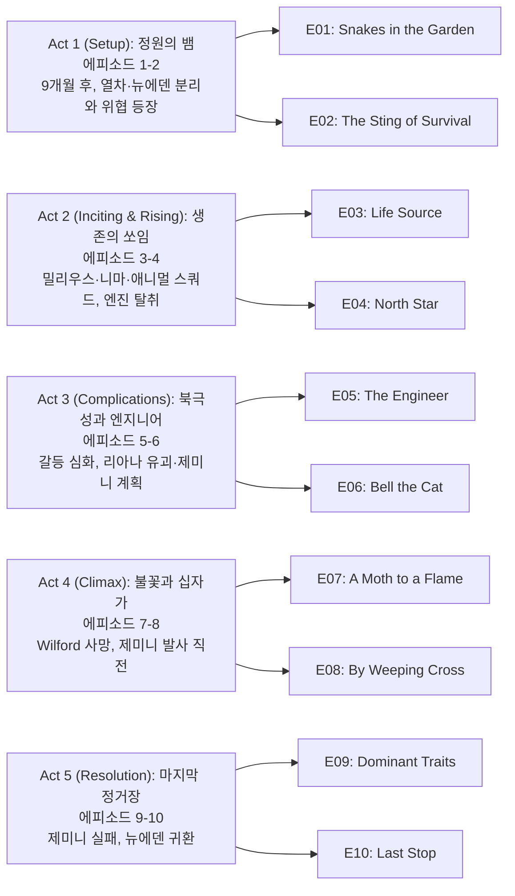

설국열차 시즌 4는 TNT에서 AMC로 채널을 옮긴 뒤 2024년 7월부터 9월까지 방영된 **시리즈 최종 시즌**이다. 시즌 3 엔딩에서 설국열차와 빅 앨리스가 갈라져 일부는 뉴에덴(New Eden)에 정착하고, 멜라니 캐빌은 영원 엔진 호위 열차를 이끌며 지구를 순환한다. 시즌 4는 9개월 후, 국제평화유지군(IPF)의 Anton Milius와 '애니멀 스쿼드', 그리고 대동결의 진짜 원인을 만든 Dr. Nima Rousseau의 등장으로 양쪽 공동체가 위협받는 가운데 열차 탈환과 제미니(Gemini) 로켓 저지라는 한 편의 피날레를 그린다.

## 시즌 개요

### 시리즈 정보
* **제목**: Snowpiercer / 설국열차
* **시즌**: 시즌 4 (총 10 에피소드, 시리즈 피날레)
* **쇼러너**: Graeme Manson
* **감독**: 에피소드별 상이 (Sam Miller, Christoph Schrewe 등)
* **주연**: Jennifer Connelly (Melanie Cavill), Daveed Diggs (Andre Layton), Sean Bean (Joseph Wilford), Rowan Blanchard (Alexandra "Alex" Cavill), Alison Wright (Ruth Wardle), Mickey Sumner (Bess Till), Katie McGuinness (Josie Wellstead), Iddo Goldberg (Bennett Knox), Lena Hall (Miss Audrey), Mike O'Malley (Sam Roche), Roberto Urbina (Javier "Javi" de la Torre), Sheila Vand (Zarah Ferami)
* **시즌 4 신규 출연**: Clark Gregg (Admiral Anton Milius), Michael Aronov (Dr. Nima Rousseau)
* **음악**: Bear McCreary (시리즈)
* **장르**: Science Fiction, Drama, Thriller, Post-Apocalyptic
* **에피소드 러닝타임**: 평균 45–50분
* **방영 기간**: 2024.07.21 – 2024.09.22
* **방영 채널/플랫폼**: AMC, AMC+ (미국); TNT에서 2023년 시즌4 취소 후 AMC가 인수하여 방영
* **제작사**: Tomorrow Studios, CJ Entertainment, Studio T
* **원작**: Jacques Lob, Jean-Marc Rochette (그래픽 노블); Bong Joon-ho 영화(2013)와 동일 세계관
* **평점**: Rotten Tomatoes 시즌4 페이지 있음, IGN 등 매체 리뷰 다수

### 시즌 주제

시즌 4는 **분리된 인류의 재통합**과 **과거 실수(대동결·제미니)의 반복 방지**를 축으로 한다. 멜라니는 열차의 과학·엔지니어링 책임자로, 레이턴은 뉴에덴의 정치적 리더로 각자 역할을 하다가, Milius·Wilford·Nima의 위협 앞에서 다시 한 번 협력한다. 니마는 자신이 일으킨 대동결을 되돌리려 제미니 로켓을 발사하려 하나, 실제로는 대기를 오염시켜 인류를 멸절시키는 계획임이 드러나고, 알렉스의 사보타주로 로켓이 실패한다. 조시는 Dr. Headwood에 대한 복수 대신 용서를 선택하며 구원과 성장을 완성한다.

### 추천 대상
* **설국열차 시즌 1–3 시청자**: 시리즈 결말을 반드시 봐야 하는 대상
* **포스트아포칼립스·계급 알레고리 좋아하는 시청자**: 열차=계급 구조, 뉴에덴=새 시작의 상징이 피날레까지 유지됨
* **Jennifer Connelly·Daveed Diggs 팬**: 멜라니와 레이턴의 리더십과 관계가 마지막까지 중심에 있음

## 구조 분석 (Act-first 보조 도식)

## 시즌의 전체 내용 (스포일러 포함)

시즌 4는 시즌 3 종료로부터 9개월이 지난 시점에서 시작한다. 설국열차(멜라니·알렉스·벤 등)는 여전히 궤도를 돌며, 뉴에덴에는 레이턴·루스·조시·베스 등이 정착해 공동체를 이끌고 있다. Admiral Milius가 이끄는 IPF와 검은 가스에 의존하는 '애니멀 스쿼드'가 열차를 습격하고, Wilford가 Milius와 손을 잡으며 엔진을 넘겨받는다. 한편 대동결을 초래한 과학자 Dr. Nima Rousseau는 제미니 화학물질로 지구를 다시 데우겠다는 로켓 계획을 추진하는데, 실제로는 대기를 독으로 뒤덮는 결과를 낳는다. 멜라니는 벤을 구하기 위해 엔진을 내주고, 레이턴의 아기 리아나는 유괴당하는 등 인물들이 극한 선택을 하며, 피날레에서 알렉스가 제미니 발사체를 조작해 로켓이 폭발·실패하게 하고, 니마는 발사실에서 동사한다. 열차는 결빙한 바다에서 탈선했다가 멜라니·레이턴·루스에 의해 복구되고, 생존자들은 뉴에덴으로 향하며 시리즈는 끝난다.

### Act 1 (Setup): 정원의 뱀 — [E01–E02]

#### [E01] "Snakes in the Garden" (정원의 뱀) — 상세 장면 분석

**[E01-S01] 9개월 후의 세계**: 설국열차는 멜라니와 알렉스가 이끄는 영원 엔진 호위 열차로 궤도를 돌고, 뉴에덴에서는 레이턴과 자라가 딸 리아나와 함께 새 삶을 꾸린다. 뉴에덴은 따뜻한 구역이지만 자원과 안전은 여전히 불확실하다.

**[E01-S02] 위협의 등장**: Admiral Anton Milius가 이끄는 국제평화유지군(IPF)과 얼굴을 가린 '애니멀 스쿼드'가 등장한다. 이들은 화학 burns와 호흡기 손상으로 검은 가스에 의존하며, Dr. Nima Rousseau의 실험으로 만들어진 존재로 이후 밝혀진다.

**[E01-S03] 열차에 대한 공격**: Milius 일당이 설국열차를 습격해 엔진과 열차의 통제권을 노린다. 멜라니는 벤의 목숨을 지키기 위해 엔진 통제를 내주는 극단적 선택을 한다.

#### [E02] "The Sting of Survival" (생존의 쏘임) — 상세 장면 분석

**[E02-S01] Wilford와 Milius의 동맹**: Joseph Wilford가 Milius와 손을 잡아 열차 내 권력을 다시 노린다. 설국열차 세계관에서 계급과 독재를 상징하던 인물이 마지막 시즌의 적과 결탁하는 구도가 확정된다.

**[E02-S02] 뉴에덴과 열차의 이중 서사**: 레이턴은 뉴에덴에서 정치·안보를, 멜라니는 열차 위에서 과학·기술과 생존 전략을 맡는다. 두 그룹의 협력 필요성이 점차 부각된다.

**[E02-S03] 리아나 유괴**: 레이턴과 자라의 갓난 딸 리아나가 납치된다. 이는 레이턴의 행동 동기와 시즌 내 긴장감을 높이는 핵심 사건이 된다.

### Act 2 (Inciting & Rising): 생존의 쏘임과 북극성 — [E03–E04]

#### [E03] "Life Source" (생명의 원천) — 상세 장면 분석

**[E03-S01] 애니멀 스쿼드의 정체**: 실루엣 수트와 검은 가스로 유지되는 이들이 니마의 제미니 관련 실험에서 만들어진 인체 실험 산물임이 드러난다. 실패한 '구원'이 또 다른 폭력을 낳는 구조가 강조된다.

**[E03-S02] 제미니 프로젝트의 복선**: 니마가 대동결을 되돌리기 위해 개발한 화학물질 '제미니'가 실제로는 대기를 파괴할 수 있는 위험한 물질임이 서서히 암시된다.

#### [E04] "North Star" (북극성) — 상세 장면 분석

**[E04-S01] 레이턴의 과잉 대응**: 뉴에덴 방어와 리아나 구출을 위해 레이턴이 취하는 조치가 동료들에게는 너무 과격해 보인다. 리더십과 독단의 경계가 논의된다.

**[E04-S02] 엔진 탈환 시도**: 멜라니·알렉스·동료들이 설국열차 엔진을 되찾기 위한 작전을 준비한다. 루스 워들도 열차 내 권위와 신뢰를 이용해 내부 저항에 기여한다.

### Act 3 (Complications): 엔지니어와 고양이에게 방울 — [E05–E06]

#### [E05] "The Engineer" (엔지니어) — 상세 장면 분석

**[E05-S01] 멜라니의 역할**: 멜라니는 열차의 엔지니어이자 과학자로서 제미니의 위험성을 분석하고, 니마의 데이터가 이미 실패를 가리킨다는 결론에 도달한다.

**[E05-S02] 니마의 집착**: 니마는 자신이 과거에 대동결을 초래한 책임을 떨치고 '구원자'로 기억되길 원한다. 제미니 발사는 그에게서 자기 정당화이자 자기 파괴적 결말로 이어진다.

#### [E06] "Bell the Cat" (고양이에게 방울 달기) — 상세 장면 분석

**[E06-S01] 제미니 발사 준비**: 니마와 Milius가 제미니 로켓 발사를 위한 설국열차 특수 칸과 경로를 확보한다. 열차가 결빙한 바다로 향하는 것은 발사 조건과 연관된다.

**[E06-S02] 내부 저항**: Javi, 베스, Oz 등이 니마 측 병사로 위장하거나 시스템을 차단하는 등 열차 내부에서 저항을 조직한다. 루스는 인질이 되었을 때도 니마의 제안을 거절하고 생존자들의 단결을 이끈다.

### Act 4 (Climax): 불꽃과 십자가 — [E07–E08]

#### [E07] "A Moth to a Flame" (불꽃에 달려드는 나방) — 상세 장면 분석

**[E07-S01] Wilford의 최후**: Joseph Wilford가 시즌 4 펜ultimate 에피소드에서 사망한다. 멜라니와 열차 역사에 남던 독재자 상징이 제거되며, 새로운 질서로의 전환이 고정된다.

**[E07-S02] 조시와 Dr. Headwood**: 조시는 자신에게 실험을 강요한 Dr. Headwood를 추적해 복수할 기회를 잡지만, Headwood의 남편 유품(부츠)을 붙잡은 그녀의 모습에서 '복수보다 사랑'을 선택하고 Headwood를 살려준다. 이 선택은 레이턴과의 재결합으로 이어지는 성장의 정점이다.

#### [E08] "By Weeping Cross" (눈물의 십자가) — 상세 장면 분석

**[E08-S01] 발사 직전**: 니마가 제미니 로켓 발사를 강행하려 하고, 멜라니와 알렉스는 엔진실과 발사 장치를 되찾거나 무력화하려 한다. 열차는 니마에 의해 결빙한 바다로 유도되어 탈선한다.

**[E08-S02] 루스의 거절**: 니마가 루스를 인질로 삼아 협상을 제안하지만, 루스는 니마 자신도 제미니 성공을 믿지 않는다고 꿰뚫어 보며 제미니 발사를 허용하지 않기로 한 쪽에 설 것을 선언한다. 이 연설이 내부 동요를 멈추고 저항 세력을 굳히는 계기가 된다.

### Act 5 (Resolution): 우성 형질과 마지막 정거장 — [E09–E10]

#### [E09] "Dominant Traits" (우성 형질) — 상세 장면 분석

**[E09-S01] Dr. Headwood의 '부활' 병사**: Dr. Headwood가 실험으로 '부활'시킨 병사가 레이턴·Boki 등을 공격한다. 초인적 힘을 가진 이 인물은 뉴에덴/설국열차 연합과의 최종 전투에서 레이턴에게 제압된다.

**[E09-S02] 제미니 발사 카운트다운**: 니마가 발사실에서 제미니를 발사하기 직전까지 상황이 진행되고, 멜라니와 알렉스는 비료(화학 바이얼) 제거나 발사체 조작을 시도한다.

#### [E10] "Last Stop" (마지막 정거장) — 상세 장면 분석 **(시리즈 피날레)**

**[E10-S01] 알렉스의 사보타주**: 멜라니가 니마와 대면해 "당신도 제미니가 실패할 걸 안다"고 말하며 그의 자존심을 건드리는 사이, 알렉스는 발사체에서 냉기를 막는 부품을 제거한다. 발사 후 로켓은 냉기에 노출되어 고장하고 지상으로 추락·폭발한다. 제미니 화학물질이 대기로 퍼지는 것은 막힌다.

**[E10-S02] 니마의 죽음**: 니마는 발사 후 발사실에 남아 추위에 노출되어 동사한다. 자신의 프로젝트 실패와 '구원자' 신화의 붕괴를 받아들이지 못한 나르시시즘적 결말로 해석된다.

**[E10-S03] 열차 복구와 뉴에덴 행**: 탈선한 설국열차를 멜라니·레이턴·루스가 다시 궤도에 올리고, 생존자들은 뉴에덴으로 향한다. 뉴에덴의 장기적 안정성은 불확실하지만, 캐릭터들은 그곳에서의 새 삶을 선택한다.

**[E10-S04] 꽃과 희망**: 피날레는 뉴에덴 산꼭대기에 피어 있는 꽃의 이미지로 끝난다. 추운 환경에서도 식물이 자란다는 것은 해당 지역의 온난화 가능성을 암시하며, 시리즈를 '불확실하지만 희망적인 재시작'으로 마무리한다.

## 에피소드 가이드

| 회차 | 제목 | 방영일 | 한 줄 요약 |
|------|------|--------|-----------|
| E01 | "Snakes in the Garden" | 2024.07.21 | 9개월 후, IPF·애니멀 스쿼드 등장, 멜라니가 벤을 구하기 위해 엔진 내줌 |
| E02 | "The Sting of Survival" | 2024.07.28 | Wilford–Milius 동맹, 뉴에덴·열차 이중 서사, 리아나 유괴 |
| E03 | "Life Source" | 2024.08.04 | 애니멀 스쿼드의 정체와 제미니 실험, 니마의 과거 복선 |
| E04 | "North Star" | 2024.08.11 | 레이턴의 과잉 대응 논란, 엔진 탈환 작전 준비 |
| E05 | "The Engineer" | 2024.08.18 | 멜라니의 제미니 분석, 니마의 구원자 콤플렉스 (미드포인트) |
| E06 | "Bell the Cat" | 2024.08.25 | 제미니 발사 준비, Javi·베스·루스의 저항 |
| E07 | "A Moth to a Flame" | 2024.09.01 | Wilford 사망, 조시의 Headwood 용서 (성장 완성) |
| E08 | "By Weeping Cross" | 2024.09.08 | 니마의 발사 강행, 열차 탈선, 루스의 거절 연설 |
| E09 | "Dominant Traits" | 2024.09.15 | Headwood '부활' 병사와 전투, 제미니 발사 직전 (클라이맥스) |
| E10 | "Last Stop" | 2024.09.22 | 알렉스 사보타주·제미니 실패, 니마 동사, 열차 복구·뉴에덴 귀환, 꽃 엔딩 |

## 핵심 대사 인덱스

"He knows it will fail." — Melanie, [E10-S01]; 니마가 제미니 실패를 스스로 인정하고 있음을 꿰뚫는 말, 알렉스 사보타주의 배경

"Love over revenge." — Josie의 선택, [E07-S02]; Headwood를 살려주며 복수 대신 용서를 택한 성장의 요약

"New Eden is home." — Layton 및 생존자들, [E10-S03]; 열차가 아닌 땅에서의 새 시작에 대한 결단

## 캐릭터 분석

### Melanie Cavill (멜라니 캐빌) / Jennifer Connelly

**개요**: 설국열차의 창설자이자 영원 엔진의 핵심 과학자·엔지니어. 시즌 4에서 열차가 Milius·Wilford에게 넘어간 뒤에도 기술적 리더로서 엔진 탈환과 제미니 저지에 기여한다. 딸 알렉스와의 관계가 시즌 내내 중요하다.

**성장 곡선**: 시즌 3에서 레이턴과 갈라선 뒤 열차만 이끌다가, 시즌 4에서 다시 위협에 맞서 열차와 뉴에덴 생존자들을 구하는 쪽에 선다. 벤을 구하기 위해 엔진을 내주는 선택은 리더로서의 희생을 보여주고, 피날레에서 니마를 말로 압도하며 알렉스의 사보타주를 가능하게 한다.

**동기와 욕망**: 인류 생존과 열차·과학의 올바른 사용. 개인적 영광보다는 딸과 동료들의 안전과 '다시 데우기'가 아닌 '살아남기'를 우선한다.

**갈등 구조**: Wilford·Milius·니마와의 외적 갈등, 그리고 엔진을 내줄지 말지(벤 vs 열차 통제)의 내적 갈등.

**상징적 의미**: 이성·과학·희생을 갖춘 리더. '열차'가 계급 구조라면, 멜라니는 그 구조를 넘어 생존 자체를 지키려는 인물이다.

### Andre Layton (앤드레 레이턴) / Daveed Diggs

**개요**: 전 꼬리칸 탐정이자 뉴에덴의 정치·군사 리더. 자라와의 딸 리아나가 유괴되며 시즌 내내 구출과 공동체 방어에 몰입한다.

**성장 곡선**: 뉴에덴 건설과 리더십에서 때로 과격해 보이는 결정을 내리지만, 니마·Milius와의 최종 대결에서 멜라니·루스·Javi 등과 협력해 '한 편'이 된다. 조시와의 관계는 그녀가 복수를 포기하고 용서하는 것을 받아들이며 정리된다.

**동기와 욕망**: 리아나·자라·뉴에덴 시민의 안전, 그리고 꼬리칸에서 시작한 '정의'를 뉴에덴에서도 실현하는 것.

**갈등 구조**: 리더로서의 과잉 대응 vs 동료 신뢰(E04), 그리고 조시와의 과거·현재 관계.

**상징적 의미**: 혁명가에서 건국자로. 꼬리칸의 불평등에 맞서던 인물이 뉴에덴이라는 새 공간의 질서를 만드는 인물로 완성된다.

### Alexandra "Alex" Cavill (알렉스 캐빌) / Rowan Blanchard

**개요**: 멜라니의 딸로, 설국열차·빅 앨리스에서 자란 젊은 엔지니어. 니마가 그녀의 재능을 높이 평가하며 접근한다.

**성장 곡선**: 시즌 4에서 니마의 제미니 계획을 기술적으로 이해하고, 어머니와 함께 발사체를 무력화한다. 피날레에서 부품을 제거해 로켓이 실패하도록 한 것은 시리즈 최후의 '구원' 행동으로, 멜라니의 과학적 유산을 이어받는 인물로 위치한다.

**동기와 욕망**: 엄마와 열차 동료를 지키고, '잘못된 구원'(제미니)을 막는 것.

**갈등 구조**: 니마에게 인정받는 재능과 그가 추진하는 위험한 계획 사이의 도덕적 선택.

**상징적 의미**: 다음 세대의 과학·윤리. 니마의 '천재' 담론을 이용해 오히려 그의 계획을 무너뜨리는 아이러니를 담당한다.

### Ruth Wardle (루스 워들) / Alison Wright

**개요**: 설국열차 1등급 담당·호칭 담당자에서 시즌을 거치며 민주적 질서의 상징이 된 인물. 시즌 4에서 니마에게 인질로 잡히지만 협상을 거절하고, "니마 자신도 제미니를 믿지 않는다"는 연설로 생존자들을 하나로 묶는다.

**성장 곡선**: 계급주의적 설국열차 질서의 얼굴에서, 뉴에덴·열차 연합의 도덕적 중심으로 자리한다. 피날레에서 멜라니·레이턴과 함께 열차를 복구하는 장면은 세 리더의 동등한 협력을 보여준다.

**동기와 욕망**: 공정한 질서와 '함께 살기'. 호칭과 규칙을 넘어 신뢰와 연대를 선택한다.

**갈등 구조**: 니마의 협박(인질) vs 저항 세력에 대한 신뢰 선언.

**상징적 의미**: 설국열차의 '형식적 질서'에서 '실질적 연대'로의 전환을 몸으로 보여주는 인물.

### Dr. Nima Rousseau (니마 루소) / Michael Aronov

**개요**: 시즌 4의 메인 악역. 과거 대동결(CW-7/제미니 계열 실험)을 초래한 과학자로, 제미니 로켓으로 지구를 다시 데우겠다고 주장하지만 실제로는 대기를 오염시켜 인류를 멸절시키는 결과를 낳을 계획이다.

**성장 곡선**: 구원자 신화에 집착하다 멜라니·알렉스에게 데이터가 이미 실패를 가리킨다는 사실을 직면한다. 그럼에도 나르시시즘으로 발사를 강행하고, 발사 후 발사실에서 동사하며 '실패한 구원자'로 끝난다.

**동기와 욕망**: 과거 실수의 만회, 역사에 '지구를 구한 자'로 남기. 그러나 그 욕망이 오히려 재앙을 반복하려 한다.

**갈등 구조**: 과학적 진실(제미니 실패) vs 자기 정당화. 내적 갈등이 외적 폭력(발사 강행)으로 표출된다.

**상징적 의미**: '잘못된 구원'과 과학자의 오만. 계급·권력이 아닌 '과학 구원 신화'의 폭력성을 보여준다.

## 드라마에 숨겨진 내용 분석

### 서브텍스트·암시

- **니마의 자살적 발사**: 니마는 제미니가 실패할 것을 알고도 발사한다. 멜라니의 "당신도 알아"라는 말에 묵인하는 것은, 살아서 실패를 인정하는 것보다 '구원을 시도한 자'로 죽는 것을 택한 나르시시즘이다.
- **조시의 용서**: Headwood를 죽이지 않는 선택은 단순한 선의가 아니라, 복수가 자신을 해방시키지 못한다는 깨달음이다. 부츠 소품이 Headwood의 인간성(사랑하는 이에 대한 애착)을 보여주며 조시로 하여금 '복수 대신 사랑'을 선택하게 한다.

### 상징·소품·배경

- **열차 vs 뉴에덴**: 열차는 계급·폐쇄·인공 질서, 뉴에덴은 땅·열린 미래·불확실한 희망이다. 피날레에서 생존자들이 뉴에덴으로 향하는 것은 '열차 사회'를 넘어선 새 시작을 의미한다.
- **꽃**: 마지막 샷의 산꼭대기 꽃은 추운 세계에서도 생명이 가능하다는 희망과, 뉴에덴의 온난화 가능성을 동시에 암시한다.
- **제미니**: 이름 자체가 '쌍둥이'를 연상시키며, '대동결을 되돌리는 쌍둥이 해법'처럼 보이지만 실제로는 또 다른 파국을 낳는 '거울 이미지'이다.

### 복선·회수

- **니마와 대동결**: 시즌 4에서 니마가 과거 대동결의 원인 제공자로 밝혀지며, '구원자' 담론이 '가해자' 담론으로 뒤집힌다.
- **Wilford**: 시즌 1–3의 독재자 상징이 Milius와 손을 잡았다가 사망하며, 설국열차의 '과거 권위'가 완전히 제거된다.

### 이스터에그·오마주

- **원작 그래픽 노블·봉준호 영화**: 열차의 계급 구조, 꼬리칸·1등급, '영원 엔진' 등은 원작과 영화의 세계관을 이어받는다. TV 시리즈는 뉴에덴과 '열차 밖'으로의 탈출을 추가해 서사를 확장했다.
- **Bear McCreary 음악**: 시리즈 전반의 포스트아포칼립스·서스펜스 톤을 유지하며 피날레의 감정적 무게를 보조한다.

### 제작진 의도·해석

- TNT에서 시즌 4가 취소된 뒤 AMC가 인수해 방영한 만큼, '마지막 정거장'은 제작진이 의도한 시리즈 결말이다. 뉴에덴의 불확실한 미래는 '완전한 해피엔딩'을 거부하고, 생존과 희망의 가능성만 남기는 열린 엔딩으로 해석된다.

## 종합 평가

### 최종 평점: ★★★★☆ (4.0/5.0)

**장점**:
- **완결성**: 시즌 1–3의 갈등(Wilford, 계급, 열차 vs 땅)을 정리하고, 니마·제미니라는 최종 위협을 통해 한 편의 피날레를 완성했다.
- **캐릭터 결말**: 멜라니·레이턴·알렉스·루스·조시 등 주요 인물의 성장과 선택이 명확히 마무리된다.
- **알렉스의 사보타주**: 제미니 실패를 기술적·캐릭터적으로 잘 연결한 클라이맥스.
- **상징 일관성**: 열차=계급·폐쇄, 뉴에덴=새 시작, 꽃=희망이라는 구조가 피날레까지 유지된다.

**단점**:
- **에피소드 수**: 10화로 압축되면서 일부 갈등(예: Milius·애니멀 스쿼드)의 해소가 다소 빠르게 느껴질 수 있다.
- **니마의 동기**: '나르시시즘'과 '구원자 콤플렉스'에 대한 설명이 에피소드 내 대사에 다소 의존한다.
- **뉴에덴의 미래**: 의도된 열린 엔딩이지만, 시청자에 따라 '애매한 끝'으로 받아들여질 수 있다.

### 한 줄 평

열차를 되찾고, 잘못된 구원(제미니)을 막고, 뉴에덴으로 돌아가는 설국열차의 마지막 한 편이 잘 마무리된 피날레 시즌이다.

### 추천 작품

- 《Snowpiercer》(2013, 봉준호): 동일 원작·영화로, 열차 계급 알레고리의 원형.
- 《The 100》(2014–2020): 포스트아포칼립스, 생존 공동체, 리더십과 도덕적 선택.
- 《Station Eleven》(2021–2022): 팬데믹 후 문명 붕괴와 예술·공동체로의 재시작.

### 시청 전 체크리스트

- 사전 지식이 필요한가? **예** (시즌 1–3 시청을 강력 권장. 인물 관계·Wilford·뉴에덴 유래를 모르면 이해가 어렵다)
- 어린이와 함께 볼 수 있는가? **아니오** (폭력·죽음·성인 주제 포함, 15세 이상 권장)
- 몰아보기 vs 천천히? **몰아보기** (10화 피날레 시즌이라 연속 시청이 몰입에 유리하다)
- 특정 요소를 기대해도 되는가? **완결감, 멜라니·레이턴·알렉스·루스·조시의 결말, 제미니 클라이맥스**
- 다음 시즌 예정은? **없음** (시즌 4가 시리즈 최종 시즌이며, AMC에서 정식 종영)

## 결론

설국열차 시즌 4는 TNT 취소 후 AMC로 이전되어 방영된 **시리즈 피날레**로, 9개월 후의 설국열차와 뉴에덴을 배경으로 Milius·Wilford·Dr. Nima Rousseau의 위협을 그린다. 멜라니·레이턴·루스의 리더십, 알렉스의 제미니 사보타주, 조시의 용서가 각각 캐릭터 아크를 마무리하고, 열차 복구와 뉴에덴 귀환·꽃 엔딩으로 '불확실하지만 희망적인 재시작'을 남긴다. 10화라는 제한 안에서 일부 갈등은 빠르게 정리되지만, Act 구조와 에피소드 가이드에 맞춘 서사와 캐릭터 결말은 설국열차 팬에게 만족스러운 마지막 시즌이 된다.

---

## 참고 문헌 및 출처

- [Snowpiercer Season 4 Ending Explained & Finale Recap — Coming Soon](https://www.comingsoon.net/guides/news/1852820-snowpiercer-season-4-finale-recap-ending-spoilers-die-death)
- [Snowpiercer Series Finale Recap and Ending, Explained — The Cinemaholic](https://thecinemaholic.com/snowpiercer-series-finale/)
- [Snowpiercer Season 4 — Rotten Tomatoes](https://www.rottentomatoes.com/tv/snowpiercer/s04)
- [Snowpiercer Season 4 Review — IGN](https://www.ign.com/articles/snowpiercer-season-4-review-amc)
- [Snowpiercer's Series Finale, Explained — CBR](https://www.cbr.com/snowpiercer-season-4-ending-explained/)
- [Snowpiercer Season 4, Episode 4 Review — CBR](https://www.cbr.com/snowpiercer-tv-season4-episode4-review/)
- [Snowpiercer Recap Season 4 Episode 7 — Vulture](https://vulture.com/article/snowpiercer-recap-season-4-episode-7.html)
- [Snowpiercer Season 4 Episode Guide — TV Guide](https://www.tvguide.com/tvshows/snowpiercer/episodes-season-4/1030720475/)
- [Snowpiercer Episodes Season 4 — IMDb](https://www.imdb.com/title/tt6156584/episodes/?season=4)
- [Snowpiercer Season 4 — TVmaze Episode Guide](https://www.tvmaze.com/seasons/148754/snowpiercer-season-4/episodeguide)
- [Snowpiercer Season 4 Moves to AMC — Variety](https://variety.com/2024/tv/news/snowpiercer-season-4-amc-premiere-date-tnt-1235942045/)
- [Snowpiercer Final Season Scrapped at TNT — EW](https://ew.com/tv/snowpiercer-final-season-scrapped-at-tnt/)
- [Snowpiercer Season 4 Cast — Just Jared](https://www.justjared.com/2024/04/30/snowpiercer-season-4-14-stars-returning-2-joining-for-final-season/2/)
- [Snowpiercer Season 4 Animal Squad — Precinct TV](https://precincttv.com/posts/snowpiercer-season-4-episode-4-reveals-secrets-animal-squad-01j4s9q7tcm6)
- [Gemini — Snowpiercer Fandom](https://snowpiercer.fandom.com/wiki/Gemini)
- [Season 4 — Snowpiercer Fandom](https://snowpiercer.fandom.com/wiki/Season_4)
- [Snowpiercer (TV series) — Wikipedia](https://en.wikipedia.org/wiki/Snowpiercer_(TV_series))
- [Class Warfare on a Train: Snowpiercer Allegory — Indigo Music](https://indigomusic.com/feature/class-warfare-on-a-train-analysing-the-socioeconomic-allegory-in-snowpiercer)
- [Snowpiercer: Scarcity, Class, and Survival — Medium](https://medium.com/@adhvikvak/snowpiercer-scarcity-class-and-the-brutal-logic-of-survival-f86ee062822a)
