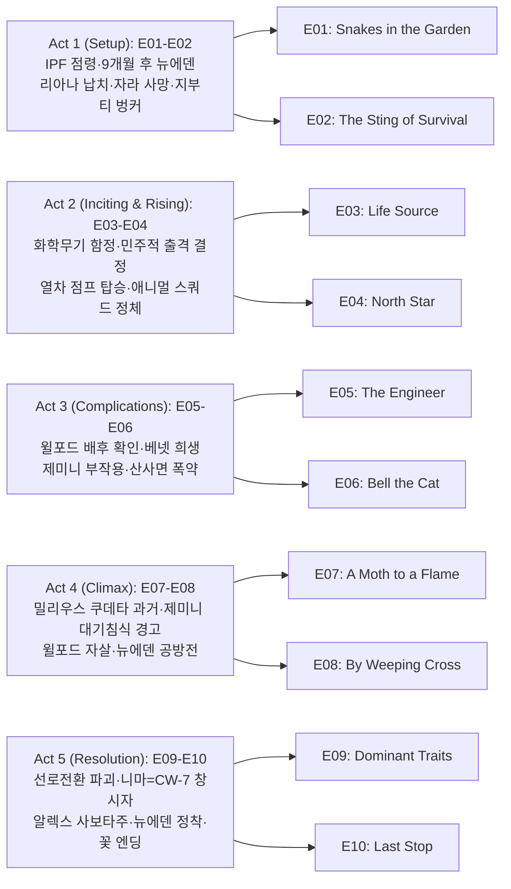

설국열차 시즌 4는 TNT에서 AMC로 채널을 옮긴 뒤 2024년 7월부터 9월까지 방영된 **시리즈 최종 시즌**이다. 시즌 3 엔딩에서 설국열차와 빅 앨리스가 갈라져 일부는 뉴에덴(New Eden)에 정착하고, 멜라니 캐빌은 영원 엔진 호위 열차를 이끌며 지구를 순환한다. 시즌 4는 9개월 후, 국제평화유지군(IPF)의 Anton Milius와 '애니멀 스쿼드', 그리고 대동결의 진짜 원인을 만든 Dr. Nima Rousseau의 등장으로 양쪽 공동체가 위협받는 가운데 열차 탈환과 제미니(Gemini) 로켓 저지라는 한 편의 피날레를 그린다.

## 시즌 개요

### 시리즈 정보
* **제목**: Snowpiercer / 설국열차
* **시즌**: 시즌 4 (총 10 에피소드, 시리즈 피날레)
* **쇼러너**: Graeme Manson
* **감독**: Christoph Schrewe, Leslie Hope, Joe Menendez
* **주연**: Jennifer Connelly (Melanie Cavill), Daveed Diggs (Andre Layton), Sean Bean (Joseph Wilford), Rowan Blanchard (Alexandra "Alex" Cavill), Alison Wright (Ruth Wardle), Mickey Sumner (Bess Till), Katie McGuinness (Josie Wellstead), Iddo Goldberg (Bennett Knox), Lena Hall (Miss Audrey), Mike O'Malley (Sam Roche), Roberto Urbina (Javier "Javi" de la Torre), Sheila Vand (Zarah Ferami)
* **시즌 4 신규 출연**: Clark Gregg (Admiral Anton Milius), Michael Aronov (Dr. Nima Rousseau)
* **음악**: Bear McCreary (시리즈)
* **장르**: Science Fiction, Drama, Thriller, Post-Apocalyptic
* **에피소드 러닝타임**: 평균 45–50분
* **방영 기간**: 2024.07.21 – 2024.09.22
* **방영 채널/플랫폼**: AMC, AMC+ (미국); TNT에서 2023년 시즌4 취소 후 AMC가 인수하여 방영
* **제작사**: Tomorrow Studios, CJ Entertainment, Studio T
* **원작**: Jacques Lob, Jean-Marc Rochette (그래픽 노블); Bong Joon-ho 영화(2013)와 동일 세계관
* **평점**: Rotten Tomatoes 시즌4 페이지 있음, IGN 등 매체 리뷰 다수

### 시즌 주제

시즌 4는 **분리된 인류의 재통합**과 **과거 실수(대동결·제미니)의 반복 방지**를 축으로 한다. 멜라니는 열차의 과학·엔지니어링 책임자로, 레이턴은 뉴에덴의 정치적 리더로 각자 역할을 하다가, Milius·Wilford·Nima의 위협 앞에서 다시 한 번 협력한다. 니마는 자신이 일으킨 대동결을 되돌리려 제미니 로켓을 발사하려 하나, 실제로는 대기를 오염시켜 인류를 멸절시키는 계획임이 드러나고, 알렉스의 사보타주로 로켓이 실패한다. 조시는 Dr. Headwood에 대한 복수 대신 용서를 선택하며 구원과 성장을 완성한다.

### 추천 대상
* **설국열차 시즌 1–3 시청자**: 시리즈 결말을 반드시 봐야 하는 대상
* **포스트아포칼립스·계급 알레고리 좋아하는 시청자**: 열차=계급 구조, 뉴에덴=새 시작의 상징이 피날레까지 유지됨
* **Jennifer Connelly·Daveed Diggs 팬**: 멜라니와 레이턴의 리더십과 관계가 마지막까지 중심에 있음

## 구조 분석 (Act-first 보조 도식)

## 시즌의 전체 내용 (스포일러 포함)

시즌 4는 **IPF 점령과 뉴에덴 정착(E01-E02) → 화학무기 함정과 빅앨리스 반격(E03-E04) → 윌포드 배후·베넷 희생(E05-E06) → 제미니 대기침식 경고·윌포드 자살·뉴에덴 공방전(E07-E08) → 열차 탈환·사보타주·뉴에덴 영구 정착(E09-E10)** 구조로 전개된다. 핵심 축은 리아나 납치, 애니멀 스쿼드의 정체, 제미니의 진짜 효과, 그리고 니마가 대동결의 원인 제공자라는 사실이다.

### Act 1 (Setup): 점령과 경고 — [E01-E02]

#### [E01] "Snakes in the Garden" (정원의 뱀) — 상세 장면 분석

**[E01-S01] 설국열차 점령과 9개월의 간극**: 벤과 틸이 로켓을 조사하던 중, IPF 소속 Admiral Anton Milius가 이끄는 애니멀 스쿼드에게 매복당한다. 이들은 설국열차를 순식간에 장악한다. 9개월 뒤 뉴에덴에서는 레이턴과 조시가 연인 관계로 발전해 있고, 루스·로슈·자비·알렉스와 함께 타운 카운실을 운영한다. 알렉스는 회의에 자주 빠지며, 잦아지는 지진 데이터를 추적하고 원인 모를 코피에 시달린다. 보키의 도움으로 조사를 이어가는 한편, 오즈는 LJ의 환청에 시달리며 설국열차 탑승자 전원이 죽었다고 믿는 은둔자가 되어 있다.

**[E01-S02] 긴장의 불씨**: 레이턴은 다리 복구 작업을 주도하지만 설국열차의 귀환에 대해 모두가 환영하는 것은 아니다. 설국열차에서 짧은 메시지가 도착하고, 레이턴이 사보타주라고 확신하는 이상한 사건들이 연이어 발생한다.

**[E01-S03] 오드리의 경고·리아나 납치·자라의 죽음**: 심한 부상을 입은 오드리가 궤도 차량을 타고 도착해 누군가 오고 있다고 경고한다. 거의 동시에, 헤드우드 부인의 도움을 받은 밀리우스 측 인물이 리아나를 납치하고 로슈를 기절시킨다. 자라가 막으려 하자 그 남자는 자라를 절벽에서 밀어 떨어뜨린다. 자라는 추락 직전 조시와 보키에게 경고를 전하고 숨을 거둔다.

#### [E02] "The Sting of Survival" (생존의 쏘임) — 상세 장면 분석

**[E02-S01] 점령 당시 플래시백**: 밀리우스의 병력이 엔진실로 돌입하며 틸이 멜라니와 마일스에게 경고하려다 총에 맞는다. 오드리가 패닉 버튼을 누르고, 멜라니는 마일스를 안전한 곳으로 보낸 뒤 엔진에 바리케이드를 친다. 밀리우스가 베넷의 목숨을 위협하자 멜라니는 항복하지만, 틈을 타 베넷과 함께 납치범 한 명을 죽이고 탈출한다.

**[E02-S02] 지부티 벙커과 니마의 제안**: 밀리우스는 100명의 승객을 동결 칸에 가둔다. 멜라니가 몰래 엔진에 잠입해 승객들을 구출하는 동안, 설국열차는 지부티 산속 지하 벙커에 도킹한다. 그곳에서 멜라니의 옛 동료 Dr. Nima Rousseau가 등장한다. 니마는 대동결 시작 때 벙커로 대피한 세계 최고 과학자들로 구성된 연구팀이 대기 중 CW-7을 분해하는 방법을 찾았다고 밝히며, 설국열차를 이용해 전 지구에 이 물질(제미니)을 살포하자고 제안한다. 멜라니는 니마와의 협력에 조건부로 동의하고 밀리우스와 거래를 맺는다.

**[E02-S03] 오드리의 뉴에덴 도착 경위**: 9개월 후 시점으로 돌아와, 마일스가 밀리우스의 매복 계획을 엿듣자 베넷과 틸이 오드리를 궤도 차량에 태워 뉴에덴으로 발사한다. 오드리는 뉴에덴 주민들에게 지금까지의 경위를 전한다. 오드리를 보낸 행위가 밀리우스의 타임라인을 앞당기게 되면서, 설국열차 안에서는 빅앨리스를 겨냥한 함정이 급조된다.

### Act 2 (Inciting & Rising): 반격의 출발 — [E03-E04]

#### [E03] "Life Source" (생명의 원천) — 상세 장면 분석

**[E03-S01] 화학무기 함정 확인**: 설국열차(사실상 가상 노동수용소 상태)에서 베넷과 틸은 마지막 칸에 비료라던 물질을 배선하라는 임무를 받는다. 작업 중 이것이 실제로 화학무기임을 깨닫는다. 밀리우스에게 이를 역이용하려는 시도는 실패하고, 틸은 니마로부터 오드리가 무사히 뉴에덴에 도착했다는 소식을 듣는다. 이 함정이 빅앨리스를 겨냥한 것임이 드러난다 — 오드리를 보내면서 밀리우스가 타임라인을 앞당길 수밖에 없게 된 것이다.

**[E03-S02] 뉴에덴의 민주적 결단**: 레이턴은 빅앨리스를 타고 설국열차를 추격하려 한다. 루스는 식민지의 안전을 우려해 반대한다. 자비는 엔진 없이도 3주간 전력을 공급할 수 있다고 보장하고, 로슈가 루스와 레이턴을 설득해 주민 투표에 부친다. 투표 결과 레이턴에게 엔진 + 4칸이 허용되며, 3주 내 복귀 조건이 붙는다. 꼬리칸 출신들, 알렉스, 그리고 뜻밖에 루스가 자원한다.

**[E03-S03] 알렉스의 불길한 데이터**: 출발 직전 알렉스는 자비에게 뉴에덴의 온난 지대가 일시적일 수 있다는 데이터 분석 결과를 전달한다. 이 정보는 이후 제미니의 부작용과 연결되며 시즌 전체를 관통하는 복선이 된다.

#### [E04] "North Star" (북극성) — 상세 장면 분석

**[E04-S01] 뉴에덴 혹한과 내부 침투**: 빅앨리스 출발 1주 후, 뉴에덴은 혹독한 날씨로 전력 공급이 위태로워진다. 오즈가 순찰 중 절단된 손을 발견하고, 로슈와 함께 현장을 조사하다 눈보라에 흩어진다. 오즈는 라디오에서 여성의 목소리를 듣고, 로슈는 무언가를 목격한다. 자비는 사이크스에게 절단된 손의 부검을 맡기는데, 설국열차 접근 칩이 내장되어 있어 내부자의 소행임이 확인된다.

**[E04-S02] 열차 점프 탑승과 구출**: 빅앨리스가 설국열차를 따라잡자, 레이턴과 조시가 달리는 열차 사이를 뛰어 탑승한다. 승객 중 동조자들의 도움으로 조시가 틸과 마일스를 구출하지만, 조시 자신은 붙잡힌다.

**[E04-S03] 애니멀 스쿼드의 정체와 리아나 거래**: 니마는 애니멀 스쿼드의 한 명을 죽이고 레이턴(탈출에 성공)에게 자신들의 진짜 임무를 밝힌다. 애니멀 스쿼드의 정체가 드러난다 — 이들은 니마의 연구팀에 의해 실험을 당한 피해자들이다. 밀리우스는 빅앨리스를 설국열차에 종속시키고, 리아나와 빅앨리스의 맞교환을 제안한다.

### Act 3 (Complications): 희생과 폭로 — [E05-E06]

#### [E05] "The Engineer" (엔지니어) — 상세 장면 분석

**[E05-S01] 윌포드의 배후 확인**: 밀리우스가 레이턴에게 리아나와 통화를 허락한 뒤, 레이턴은 거래를 받아들여 빅앨리스를 넘긴다. 사일로에서 밝혀진 진실 — 밀리우스의 병력에 구조된 윌포드가 리아나 납치의 진짜 배후였다. 헤드우드 부인은 조시의 혈액을 채취한다. 알렉스는 윌포드의 이야기를 들어보기로 결정하고 사일로에 남는다.

**[E05-S02] 베넷의 희생**: 루스·베넷·틸은 탈출 작전을 감행하며, 펠턴·트리스탄·마일스를 포함한 승객들과 빅앨리스를 탈취한다. 마일스가 열차를 뉴에덴까지 운전하도록 맡겨진 가운데, 베넷은 설국열차와 빅앨리스를 수동으로 분리하기 위해 직접 연결 장치에 남는다. 수동 오버라이드를 작동시킨 베넷은 극저온에 노출되어 동사한다. 이 희생으로 빅앨리스는 설국열차에서 벗어나 뉴에덴을 향할 수 있게 된다.

**[E05-S03] 사일로의 알렉스**: 밀리우스는 레이턴을 데리고 윌포드가 돌보고 있는 리아나에게로 간다. 니마는 알렉스의 코피 증상에 주목하며, 뉴에덴의 불안정성 가능성을 넌지시 언급한다.

#### [E06] "Bell the Cat" (고양이에게 방울 달기) — 상세 장면 분석

**[E06-S01] 윌포드 구조 플래시백과 레벨3 실험**: 11개월 전, 밀리우스 병력에 발견된 윌포드는 비밀리에 헤드우드의 내한 처치를 받으며 권위를 세우려 한다. 현재 시점에서 윌포드와 레이턴은 레벨3에 보내져 밀리우스의 의도대로 서로 죽이게 될 상황에 처한다. 둘은 흉터투성이 생존자들을 만나고, 마지못해 동맹을 맺어 탈출한다. 니마는 알렉스에게 핵심 진실을 고백한다 — 코피는 제미니(CW-7 분해 화합물)의 독성 부작용이며, 과거 화학 유출 사고 이후 제미니를 정제하기 위해 레벨3 주민들을 대상으로 실험했다는 것이다.

**[E06-S02] 베넷 추모와 산사면 폭약**: 빅앨리스에서는 승객들이 자원 부족과 시련을 견디며, 루스와 틸이 베넷의 희생을 기리는 비문을 조타실 위에 새긴다. 뉴에덴에서 실종된 로슈를 찾던 오즈는 전 잭부트 스튜 위긴스(절단된 손의 주인)를 발견한다. 스튜는 밀리우스 병력이 자라와 헤드우드를 식별하라고 자신을 데려왔으며, 자라의 죽음을 알고 탈출하다 손을 잃었다고 고백한다. 스튜의 단서를 따라간 오즈는 산사면에 매설된 폭약을 발견한다 — 기폭하면 마을이 눈사태에 매몰될 위협이다.

### Act 4 (Climax): 전면전의 점화 — [E07-E08]

#### [E07] "A Moth to a Flame" (불꽃에 달려드는 나방) — 상세 장면 분석

**[E07-S01] 밀리우스 쿠데타 플래시백**: 3년 전, 밀리우스 대위는 레벨3 주민들(전임 제독과 자신의 아내 포함)을 독살하고 권력을 장악한다.

**[E07-S02] 제미니 대기침식 경고**: 멜라니가 데이터를 가지고 사일로로 복귀한다. 레이턴·윌포드와 합류한 멜라니는 최근 상황을 공유한다. 레이턴은 조시와 리아나를 헤드우드에게서 구출하고, 멜라니는 알렉스와 재회한다(알렉스는 베넷의 죽음을 전한다). 알렉스의 뉴에덴 이상 기후 연구와 멜라니의 분석이 합쳐지면서 결정적 사실이 드러난다 — 제미니는 대기 침식을 유발하며, 발사가 이루어지면 지구 모든 생명이 끝난다. 니마는 멜라니의 경고를 무시하고 가스로 제압한 뒤 설국열차를 탈취한다.

**[E07-S03] 윌포드의 최후와 니마의 정체**: 윌포드는 밀리우스와 대면한다. 헤드우드의 내한 처치를 받은 윌포드는 밀리우스를 압도해 얼려 죽인다. 레이턴에게 몰린 윌포드는 독이 든 블런트로 자살하며, 죽기 직전 니마가 CW-7의 창시자 — 대동결을 초래한 장본인 — 임을 폭로한다.

**[E07-S04] 가족칸 절단과 빅앨리스 함정**: 니마는 레이턴의 가족이 탄 칸을 분리해 동사시키려 한다. 동시에 뉴에덴 근처에서 빅앨리스가 도착 직전 궤도 위 부비트랩에 걸려 정지하고, 자비가 해체를 시도하다 폭탄이 폭발한다.

#### [E08] "By Weeping Cross" (눈물의 십자가) — 상세 장면 분석

**[E08-S01] 구출과 빅앨리스 도착**: 자비는 뇌진탕을 입지만 생존한다. 빅앨리스가 마침내 뉴에덴에 도착한다(전력 거의 소진). 분리된 칸에서 거의 동사할 뻔한 레이턴은, 조난 신호를 수신한 로슈에 의해 조시·리아나와 함께 구조된다. 로슈는 밀리우스 병력에 잡혀 있다가 혼란을 틈타 탈출했다고 설명한다.

**[E08-S02] 뉴에덴 공방전 준비**: 니마는 빅앨리스를 되찾기 위해 뉴에덴 침공을 준비한다(발사 시간대를 놓치면 5년을 더 기다려야 한다). 알렉스는 마지못해 니마 측 인원의 잠입을 도와 친구들을 살리려 하지만 발각된다. 뉴에덴은 엔진을 마을 안으로 이동시켜, 적이 산사면 폭약만으로 마을을 파괴할 수 없게 만든다. 자비는 폭탄을 무력화할 방법을 연구하고, 틸은 우울증에 빠진 오드리를 다독인다.

**[E08-S03] 전투 시작**: 니마의 저격수(스페이드)가 사격을 개시하며 뉴에덴 전투가 시작된다. 알렉스는 총구 앞에서 빅앨리스의 선로 전환을 명령받지만 주저한다.

### Act 5 (Resolution): 탈환과 정착 — [E09-E10]

#### [E09] "Dominant Traits" (우성 형질) — 상세 장면 분석

**[E09-S01] 선로전환 파괴와 반격**: 알렉스가 선로 전환 컴퓨터를 파괴하고 레이턴의 도움으로 탈출한다. 오즈는 IPF 라디오를 이용해 저격수를 교란하며, 산속에서 들려오던 라디오 목소리의 주인이 아일랜드 출신 애니멀 스쿼드 기술자 버팔로임을 알게 된다. 틸은 저격수와 라트(자라를 살해한 병사)를 매복으로 처치한다.

**[E09-S02] 니마의 정체와 최후의 기만**: 니마는 CW-7을 만든 연구팀의 수장이었음을 인정하면서도 실수를 받아들이지 않는다. 멜라니는 니마를 속여, 정면 공격 대신 마취 가스를 사용하도록 유도한 뒤, 알렉스·레이턴과 공모해 열차 탈환을 계획한다. 멜라니는 알렉스에게 니마가 자신의 생물학적 아버지(정자 기증자)임을 밝힌다.

**[E09-S03] 열차 돌입과 폭약 무력화**: 니마가 빅앨리스를 탈취하자, 레이턴과 거의 모든 전투원이 열차에 돌입한다(병사들에게는 탄약이 없다). 남겨진 병사들은 항복한다. 니마가 산사면 폭약을 기폭하려 하지만 자비의 재밍 장치가 신호를 차단해 실패한다. 멜라니와 알렉스는 이 틈을 타 탈출한다.

#### [E10] "Last Stop" (마지막 정거장) — 상세 장면 분석 **(시리즈 피날레)**

**[E10-S01] 루스의 반란**: 니마는 빅앨리스에서 조타 장치를 제거한 뒤 도주하고, 멜라니와 알렉스는 빅앨리스를 사용할 수 없게 된다. 레이턴의 병력이 열차 내부를 돌파하는 가운데, 루스가 니마에게 포로로 잡힌다. 니마는 제미니 발사 후 빅앨리스를 돌려주겠다며 루스에게 질서 회복을 요구하지만, 루스는 이를 거절하고 Z-렉·사이크스와 함께 탈출해 승객들을 규합, 대규모 반란을 조직한다.

**[E10-S02] 최후의 전투와 용서**: 헤드우드가 라트를 소생시키지만, 레이턴이 보키의 도움으로 라트를 최종 처단한다. 조시는 헤드우드와 대면하지만 그녀를 죽이지 못한다 — 헤드우드 자신의 슬픔과 트라우마를 인식하고, 복수 대신 연민을 되찾는다.

**[E10-S03] 발사 실패와 니마의 종말**: 설국열차는 캐터필라 트랙을 장착해 대양을 횡단, 발사 지점에 도달한다. 니마는 마침내 자신의 실수를 깨닫지만 이미 너무 늦었고, 스스로 동사를 택한다. 그러나 Icebreaker 발사는 알렉스의 사전 사보타주(핵심 부품 제거)로 인해 실패한다.

**[E10-S04] 뉴에덴 정착과 꽃의 엔딩**: 모든 생존자는 뉴에덴으로 돌아가 영구 정착을 결정한다(온난 지대의 지속 기간은 불확실하다). 설국열차는 마을 전력 공급용으로 개조될 때까지 제한적 순환 운행을 계속한다. 모두가 축하하는 가운데, 뉴에덴에서 먼 곳의 꽃밭이 비추어진다 — 지구가 스스로 온난화되며 생명이 돌아오고 있음을 암시하는 희망의 엔딩이다.

## 에피소드 가이드

| 회차 | 제목 | 방영일 | 한 줄 요약 |
|------|------|--------|-----------|
| E01 | "Snakes in the Garden" | 2024.07.21 | IPF 설국열차 점령, 오즈 은둔/LJ 환청, 오드리 부상 도착, 리아나 납치·자라 사망 |
| E02 | "The Sting of Survival" | 2024.07.28 | 점령 플래시백(틸 총상·멜라니 항복·100명 동결 인질), 지부티 벙커·니마 제미니 제안, 오드리 발사차량 경고 |
| E03 | "Life Source" | 2024.08.04 | 빅앨리스를 겨냥한 화학무기 함정이 드러나고, 뉴에덴은 주민 투표로 제한 추격을 결정한다 |
| E04 | "North Star" | 2024.08.11 | 뉴에덴 혹한·절단된 손, 레이턴-조시 열차 점프, 애니멀 스쿼드 실험 피해자 정체, 리아나 거래 제안 |
| E05 | "The Engineer" | 2024.08.18 | 윌포드 납치 배후, 베넷 수동 분리 희생 동사, 알렉스 사일로 잔류, 마일스 빅앨리스 운전 |
| E06 | "Bell the Cat" | 2024.08.25 | 윌포드 구조 플래시백, 레벨3 실험 폭로, 베넷 추모 비문, 스튜 정체·산사면 폭약 발견 |
| E07 | "A Moth to a Flame" | 2024.09.01 | 밀리우스 쿠데타 플래시백, 제미니 대기침식 경고, 윌포드 밀리우스 제거 후 자살(니마=CW-7 창시자 폭로), 니마 가족칸 절단·빅앨리스 함정 |
| E08 | "By Weeping Cross" | 2024.09.08 | 하비 폭탄 생존, 뉴에덴 엔진 이동, 로슈의 레이턴 가족 구조, 저격수 사격으로 전투 시작 |
| E09 | "Dominant Traits" | 2024.09.15 | 알렉스 선로전환 파괴, 버팔로=오즈 라디오 목소리, 틸 저격수+라트 제거, 니마=알렉스 생부, 하비 재밍으로 폭약 기폭 실패 |
| E10 | "Last Stop" | 2024.09.22 | 루스-지렉-사이크스 반란, 조시의 헤드우드 용서, 캐터필라 트랙 해양 횡단, 니마 동사·알렉스 사보타주로 Icebreaker 실패, 뉴에덴 정착·꽃 엔딩 |

## 핵심 대사 인덱스

"He knows it will fail." — Melanie, [E10-S01]; 니마가 제미니 실패를 스스로 인정하고 있음을 꿰뚫는 말, 알렉스 사보타주의 배경

"Love over revenge." — Josie의 선택, [E07-S02]; Headwood를 살려주며 복수 대신 용서를 택한 성장의 요약

"New Eden is home." — Layton 및 생존자들, [E10-S03]; 열차가 아닌 땅에서의 새 시작에 대한 결단

## 캐릭터 분석

### Melanie Cavill (멜라니 캐빌) / Jennifer Connelly

**개요**: 설국열차의 창설자이자 영원 엔진의 핵심 과학자·엔지니어. 시즌 4에서 열차가 Milius·Wilford에게 넘어간 뒤에도 기술적 리더로서 엔진 탈환과 제미니 저지에 기여한다. 딸 알렉스와의 관계가 시즌 내내 중요하다.

**성장 곡선**: 시즌 3에서 레이턴과 갈라선 뒤 열차만 이끌다가, 시즌 4에서 다시 위협에 맞서 열차와 뉴에덴 생존자들을 구하는 쪽에 선다. 벤을 구하기 위해 엔진을 내주는 선택은 리더로서의 희생을 보여주고, 피날레에서 니마를 말로 압도하며 알렉스의 사보타주를 가능하게 한다.

**동기와 욕망**: 인류 생존과 열차·과학의 올바른 사용. 개인적 영광보다는 딸과 동료들의 안전과 '다시 데우기'가 아닌 '살아남기'를 우선한다.

**갈등 구조**: Wilford·Milius·니마와의 외적 갈등, 그리고 엔진을 내줄지 말지(벤 vs 열차 통제)의 내적 갈등.

**상징적 의미**: 이성·과학·희생을 갖춘 리더. '열차'가 계급 구조라면, 멜라니는 그 구조를 넘어 생존 자체를 지키려는 인물이다.

### Andre Layton (앤드레 레이턴) / Daveed Diggs

**개요**: 전 꼬리칸 탐정이자 뉴에덴의 정치·군사 리더. 자라와의 딸 리아나가 유괴되며 시즌 내내 구출과 공동체 방어에 몰입한다.

**성장 곡선**: 뉴에덴 건설과 리더십에서 때로 과격해 보이는 결정을 내리지만, 니마·Milius와의 최종 대결에서 멜라니·루스·Javi 등과 협력해 '한 편'이 된다. 조시와의 관계는 그녀가 복수를 포기하고 용서하는 것을 받아들이며 정리된다.

**동기와 욕망**: 리아나·자라·뉴에덴 시민의 안전, 그리고 꼬리칸에서 시작한 '정의'를 뉴에덴에서도 실현하는 것.

**갈등 구조**: 리더로서의 과잉 대응 vs 동료 신뢰(E04), 그리고 조시와의 과거·현재 관계.

**상징적 의미**: 혁명가에서 건국자로. 꼬리칸의 불평등에 맞서던 인물이 뉴에덴이라는 새 공간의 질서를 만드는 인물로 완성된다.

### Alexandra "Alex" Cavill (알렉스 캐빌) / Rowan Blanchard

**개요**: 멜라니의 딸로, 설국열차·빅 앨리스에서 자란 젊은 엔지니어. 니마가 그녀의 재능을 높이 평가하며 접근한다.

**성장 곡선**: 시즌 4에서 니마의 제미니 계획을 기술적으로 이해하고, 어머니와 함께 발사체를 무력화한다. 피날레에서 부품을 제거해 로켓이 실패하도록 한 것은 시리즈 최후의 '구원' 행동으로, 멜라니의 과학적 유산을 이어받는 인물로 위치한다.

**동기와 욕망**: 엄마와 열차 동료를 지키고, '잘못된 구원'(제미니)을 막는 것.

**갈등 구조**: 니마에게 인정받는 재능과 그가 추진하는 위험한 계획 사이의 도덕적 선택.

**상징적 의미**: 다음 세대의 과학·윤리. 니마의 '천재' 담론을 이용해 오히려 그의 계획을 무너뜨리는 아이러니를 담당한다.

### Ruth Wardle (루스 워들) / Alison Wright

**개요**: 설국열차 1등급 담당·호칭 담당자에서 시즌을 거치며 민주적 질서의 상징이 된 인물. 시즌 4에서 니마에게 인질로 잡히지만 협상을 거절하고, "니마 자신도 제미니를 믿지 않는다"는 연설로 생존자들을 하나로 묶는다.

**성장 곡선**: 계급주의적 설국열차 질서의 얼굴에서, 뉴에덴·열차 연합의 도덕적 중심으로 자리한다. 피날레에서 멜라니·레이턴과 함께 열차를 복구하는 장면은 세 리더의 동등한 협력을 보여준다.

**동기와 욕망**: 공정한 질서와 '함께 살기'. 호칭과 규칙을 넘어 신뢰와 연대를 선택한다.

**갈등 구조**: 니마의 협박(인질) vs 저항 세력에 대한 신뢰 선언.

**상징적 의미**: 설국열차의 '형식적 질서'에서 '실질적 연대'로의 전환을 몸으로 보여주는 인물.

### Dr. Nima Rousseau (니마 루소) / Michael Aronov

**개요**: 시즌 4의 메인 악역. 과거 대동결(CW-7/제미니 계열 실험)을 초래한 과학자로, 제미니 로켓으로 지구를 다시 데우겠다고 주장하지만 실제로는 대기를 오염시켜 인류를 멸절시키는 결과를 낳을 계획이다.

**성장 곡선**: 구원자 신화에 집착하다 멜라니·알렉스에게 데이터가 이미 실패를 가리킨다는 사실을 직면한다. 그럼에도 나르시시즘으로 발사를 강행하고, 발사 후 발사실에서 동사하며 '실패한 구원자'로 끝난다.

**동기와 욕망**: 과거 실수의 만회, 역사에 '지구를 구한 자'로 남기. 그러나 그 욕망이 오히려 재앙을 반복하려 한다.

**갈등 구조**: 과학적 진실(제미니 실패) vs 자기 정당화. 내적 갈등이 외적 폭력(발사 강행)으로 표출된다.

**상징적 의미**: '잘못된 구원'과 과학자의 오만. 계급·권력이 아닌 '과학 구원 신화'의 폭력성을 보여준다.

## 드라마에 숨겨진 내용 분석

### 서브텍스트·암시

- **니마의 자살적 발사**: 니마는 제미니가 실패할 것을 알고도 발사한다. 멜라니의 "당신도 알아"라는 말에 묵인하는 것은, 살아서 실패를 인정하는 것보다 '구원을 시도한 자'로 죽는 것을 택한 나르시시즘이다.
- **조시의 용서**: Headwood를 죽이지 않는 선택은 단순한 선의가 아니라, 복수가 자신을 해방시키지 못한다는 깨달음이다. 부츠 소품이 Headwood의 인간성(사랑하는 이에 대한 애착)을 보여주며 조시로 하여금 '복수 대신 사랑'을 선택하게 한다.

### 상징·소품·배경

- **열차 vs 뉴에덴**: 열차는 계급·폐쇄·인공 질서, 뉴에덴은 땅·열린 미래·불확실한 희망이다. 피날레에서 생존자들이 뉴에덴으로 향하는 것은 '열차 사회'를 넘어선 새 시작을 의미한다.
- **꽃**: 마지막 샷의 산꼭대기 꽃은 추운 세계에서도 생명이 가능하다는 희망과, 뉴에덴의 온난화 가능성을 동시에 암시한다.
- **제미니**: 이름 자체가 '쌍둥이'를 연상시키며, '대동결을 되돌리는 쌍둥이 해법'처럼 보이지만 실제로는 또 다른 파국을 낳는 '거울 이미지'이다.

### 복선·회수

- **니마와 대동결**: 시즌 4에서 니마가 과거 대동결의 원인 제공자로 밝혀지며, '구원자' 담론이 '가해자' 담론으로 뒤집힌다.
- **Wilford**: 시즌 1–3의 독재자 상징이 Milius와 손을 잡았다가 사망하며, 설국열차의 '과거 권위'가 완전히 제거된다.

### 이스터에그·오마주

- **원작 그래픽 노블·봉준호 영화**: 열차의 계급 구조, 꼬리칸·1등급, '영원 엔진' 등은 원작과 영화의 세계관을 이어받는다. TV 시리즈는 뉴에덴과 '열차 밖'으로의 탈출을 추가해 서사를 확장했다.
- **Bear McCreary 음악**: 시리즈 전반의 포스트아포칼립스·서스펜스 톤을 유지하며 피날레의 감정적 무게를 보조한다.

### 제작진 의도·해석

- TNT에서 시즌 4가 취소된 뒤 AMC가 인수해 방영한 만큼, '마지막 정거장'은 제작진이 의도한 시리즈 결말이다. 뉴에덴의 불확실한 미래는 '완전한 해피엔딩'을 거부하고, 생존과 희망의 가능성만 남기는 열린 엔딩으로 해석된다.

## 종합 평가

### 최종 평점: ★★★★☆ (4.0/5.0)

**장점**:
- **완결성**: 시즌 1–3의 갈등(Wilford, 계급, 열차 vs 땅)을 정리하고, 니마·제미니라는 최종 위협을 통해 한 편의 피날레를 완성했다.
- **캐릭터 결말**: 멜라니·레이턴·알렉스·루스·조시 등 주요 인물의 성장과 선택이 명확히 마무리된다.
- **알렉스의 사보타주**: 제미니 실패를 기술적·캐릭터적으로 잘 연결한 클라이맥스.
- **상징 일관성**: 열차=계급·폐쇄, 뉴에덴=새 시작, 꽃=희망이라는 구조가 피날레까지 유지된다.

**단점**:
- **에피소드 수**: 10화로 압축되면서 일부 갈등(예: Milius·애니멀 스쿼드)의 해소가 다소 빠르게 느껴질 수 있다.
- **니마의 동기**: '나르시시즘'과 '구원자 콤플렉스'에 대한 설명이 에피소드 내 대사에 다소 의존한다.
- **뉴에덴의 미래**: 의도된 열린 엔딩이지만, 시청자에 따라 '애매한 끝'으로 받아들여질 수 있다.

### 한 줄 평

열차를 되찾고, 잘못된 구원(제미니)을 막고, 뉴에덴으로 돌아가는 설국열차의 마지막 한 편이 잘 마무리된 피날레 시즌이다.

### 추천 작품

- 《Snowpiercer》(2013, 봉준호): 동일 원작·영화로, 열차 계급 알레고리의 원형.
- 《The 100》(2014–2020): 포스트아포칼립스, 생존 공동체, 리더십과 도덕적 선택.
- 《Station Eleven》(2021–2022): 팬데믹 후 문명 붕괴와 예술·공동체로의 재시작.

### 시청 전 체크리스트

- 사전 지식이 필요한가? **예** (시즌 1–3 시청을 강력 권장. 인물 관계·Wilford·뉴에덴 유래를 모르면 이해가 어렵다)
- 어린이와 함께 볼 수 있는가? **아니오** (폭력·죽음·성인 주제 포함, 15세 이상 권장)
- 몰아보기 vs 천천히? **몰아보기** (10화 피날레 시즌이라 연속 시청이 몰입에 유리하다)
- 특정 요소를 기대해도 되는가? **완결감, 멜라니·레이턴·알렉스·루스·조시의 결말, 제미니 클라이맥스**
- 다음 시즌 예정은? **없음** (시즌 4가 시리즈 최종 시즌이며, AMC에서 정식 종영)

## 결론

설국열차 시즌 4는 TNT 취소 후 AMC로 이전되어 방영된 **시리즈 피날레**로, 9개월 후의 설국열차와 뉴에덴을 배경으로 Milius·Wilford·Dr. Nima Rousseau의 위협을 그린다. 멜라니·레이턴·루스의 리더십, 알렉스의 제미니 사보타주, 조시의 용서가 각각 캐릭터 아크를 마무리하고, 열차 복구와 뉴에덴 귀환·꽃 엔딩으로 '불확실하지만 희망적인 재시작'을 남긴다. 10화라는 제한 안에서 일부 갈등은 빠르게 정리되지만, Act 구조와 에피소드 가이드에 맞춘 서사와 캐릭터 결말은 설국열차 팬에게 만족스러운 마지막 시즌이 된다.

---

## 참고 문헌 및 출처

- [Snowpiercer Season 4 Ending Explained & Finale Recap — Coming Soon](https://www.comingsoon.net/guides/news/1852820-snowpiercer-season-4-finale-recap-ending-spoilers-die-death)
- [Snowpiercer Series Finale Recap and Ending, Explained — The Cinemaholic](https://thecinemaholic.com/snowpiercer-series-finale/)
- [Snowpiercer Season 4 — Rotten Tomatoes](https://www.rottentomatoes.com/tv/snowpiercer/s04)
- [Snowpiercer Season 4 Review — IGN](https://www.ign.com/articles/snowpiercer-season-4-review-amc)
- [Snowpiercer's Series Finale, Explained — CBR](https://www.cbr.com/snowpiercer-season-4-ending-explained/)
- [Snowpiercer Season 4, Episode 4 Review — CBR](https://www.cbr.com/snowpiercer-tv-season4-episode4-review/)
- [Snowpiercer Recap Season 4 Episode 7 — Vulture](https://vulture.com/article/snowpiercer-recap-season-4-episode-7.html)
- [Snowpiercer Season 4 Episode Guide — TV Guide](https://www.tvguide.com/tvshows/snowpiercer/episodes-season-4/1030720475/)
- [Snowpiercer Episodes Season 4 — IMDb](https://www.imdb.com/title/tt6156584/episodes/?season=4)
- [Snowpiercer Season 4 — TVmaze Episode Guide](https://www.tvmaze.com/seasons/148754/snowpiercer-season-4/episodeguide)
- [Snowpiercer Season 4 Moves to AMC — Variety](https://variety.com/2024/tv/news/snowpiercer-season-4-amc-premiere-date-tnt-1235942045/)
- [Snowpiercer Final Season Scrapped at TNT — EW](https://ew.com/tv/snowpiercer-final-season-scrapped-at-tnt/)
- [Snowpiercer Season 4 Cast — Just Jared](https://www.justjared.com/2024/04/30/snowpiercer-season-4-14-stars-returning-2-joining-for-final-season/2/)
- [Snowpiercer Season 4 Animal Squad — Precinct TV](https://precincttv.com/posts/snowpiercer-season-4-episode-4-reveals-secrets-animal-squad-01j4s9q7tcm6)
- [Gemini — Snowpiercer Fandom](https://snowpiercer.fandom.com/wiki/Gemini)
- [Season 4 — Snowpiercer Fandom](https://snowpiercer.fandom.com/wiki/Season_4)
- [Snowpiercer (TV series) — Wikipedia](https://en.wikipedia.org/wiki/Snowpiercer_(TV_series))
- [Class Warfare on a Train: Snowpiercer Allegory — Indigo Music](https://indigomusic.com/feature/class-warfare-on-a-train-analysing-the-socioeconomic-allegory-in-snowpiercer)
- [Snowpiercer: Scarcity, Class, and Survival — Medium](https://medium.com/@adhvikvak/snowpiercer-scarcity-class-and-the-brutal-logic-of-survival-f86ee062822a)
