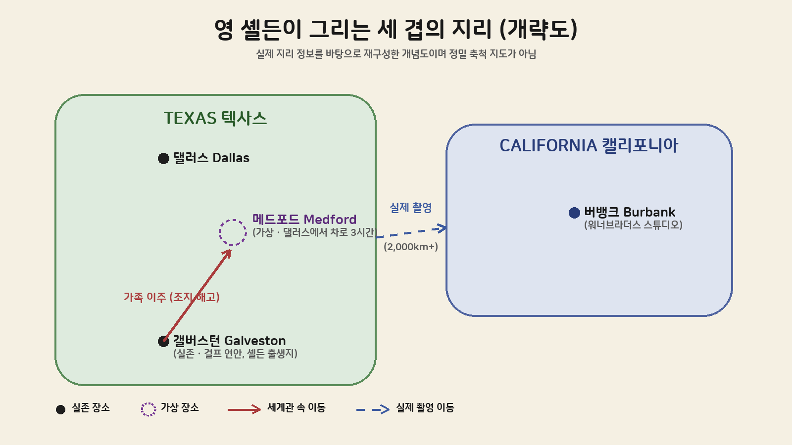

"영 셸든이 실제로 어디를 배경으로 하는 드라마인지" 검색해서 들어왔다면, 결론부터 말해 두 개의 답이 동시에 맞다. 극중 배경은 텍사스 동부의 <strong>메드포드(Medford)</strong>라는 마을이지만, 이 마을은 지도에 없는 완전한 가상 도시다. 그리고 카메라가 실제로 돌아간 곳은 텍사스에서 2,000km 넘게 떨어진 캘리포니아 버뱅크의 워너브라더스 스튜디오다. 이 글은 극중 설정(메드포드가 어떤 곳으로 그려지는지), 실제 촬영지(어디서 어떻게 찍었는지), 그리고 원작 <빅뱅이론>과의 지리적 연결고리(셸든 쿠퍼는 왜 갤버스턴에서 태어나 메드포드에서 자랐다고 설정됐는지)까지 세 층위를 순서대로 정리한다.

## 시리즈 개요

### 시리즈 정보

* **제목**: Young Sheldon / 영 셸든
* **방영**: 2017–2024 (미국 CBS, 총 7시즌 141화)
* **장르**: 시트콤, 가족 드라마, 청소년 성장물
* **원작 관계**: <빅뱅이론(The Big Bang Theory)>(2007–2019)의 프리퀄 스핀오프
* **주연**: 이언 아미티지(어린 셸든 쿠퍼), 조이 페리(메리 쿠퍼), 랜스 바버(조지 쿠퍼 시니어), 몬태나 조던(조지 쿠퍼 주니어), 레이건 레벨(미시 쿠퍼), 애니 팟츠(미미)
* **내레이션**: 짐 파슨스(성인 셸든 쿠퍼, <빅뱅이론> 배우)
* **제작**: Chuck Lorre Productions, Warner Bros. Television
* **배경 시대**: 1989년(시즌 1)부터 1990년대 중반(시즌 7)까지

이 글이 다루는 범위는 시즌별 줄거리나 에피소드 분석이 아니라, "영 셸든이 그리는 세계가 실제로는 어디이고 어떻게 만들어졌는가"라는 단일 질문이다. 극중 지리(메드포드), 촬영 지리(버뱅크), 세계관 지리(갤버스턴)를 하나씩 나눠서 본다.

## 구조 분석: 세 겹의 지리

메드포드를 이해하려면 세 개의 서로 다른 "장소"를 구분해야 한다. 극중 인물이 사는 곳, 카메라가 실제로 서 있던 곳, 그리고 그 인물의 출생지로 설정된 곳이다. 세 곳은 지리적으로 전혀 겹치지 않는다.

메드포드는 텍사스 동부(East Texas)의 가상 마을로, 댈러스에서 차로 3시간 거리에 있다는 설정이다. 갤버스턴은 실존하는 텍사스 남부 걸프 연안 도시로 메드포드와는 다른 지역이다. 그리고 이 둘을 잇는 실제 촬영은 텍사스가 아니라 캘리포니아에서 이뤄졌다.

## 메드포드, 텍사스: 지도에 없는 마을

<Young Sheldon>은 텍사스 동부의 가상 소도시 메드포드를 배경으로 한다. 위키피디아에 따르면 셸든 쿠퍼는 "텍사스 동부에 있는 가상의 소도시 메드포드"에서 성장한 것으로 그려지며, 이 마을은 댈러스에서 자동차로 3시간 거리라는 설정을 갖는다. 실제 텍사스에는 메드포드라는 이름의 지자체가 존재하지 않는다.

극중 세부 설정도 허구다. 팬덤이 정리한 시리즈 위키에 따르면 쿠퍼 가족의 집 주소는 "5501 Grant Ave, Medford, Texas, 88597"로 등장하는데, 우편번호 88597은 텍사스가 아니라 뉴멕시코주에 배정된 대역(8로 시작하는 우편번호)이어서 애초에 실재할 수 없는 번호다. 텍사스 우편번호는 7로 시작한다. 이런 디테일은 제작진이 메드포드를 "그럴듯하지만 결코 실존 도시와 혼동되지 않도록" 의도적으로 설계했음을 보여준다. 같은 위키는 마을이 체로키 카운티(Cherokee County)에 속한 것으로 정리하는데, 실제 텍사스에도 동일한 이름의 카운티(주도 러프킨)가 존재하지만 메드포드라는 마을 자체는 그 카운티 안에 없다. 다만 이 설정이 모든 회차에서 완전히 통일된 것은 아니다 — 한 에피소드는 메드포드 인근을 앤젤리나 카운티(Angelina County)로 언급한 것으로도 알려져 있어, 팬 커뮤니티 사이에서도 두 카운티 표기가 혼재한다. 공식 제작 문서가 아니라 팬 위키·시청자 정리에 의존하는 지명 디테일인 만큼, 이 정도의 사소한 불일치는 감안하고 볼 필요가 있다.

가상이라고 해서 아무렇게나 그려진 것은 아니다. 쇼러너 척 로리(Chuck Lorre)는 텔레비전 비평가 협회(TCA) 투어 인터뷰에서 "스티브(스티븐 몰라로)와 나는 작년 12월에 동부 텍사스와 휴스턴에 가서 시간을 보냈다"며 "그 지역의 영향이 쇼에 반영되도록 하고 싶었다"고 밝혔다(Wide Open Country 인터뷰 인용). 이 답사를 바탕으로 극중에는 닥터페퍼를 마시는 메리 쿠퍼, 복음주의 개신교 문화, 텍사스 오일러스(현재는 사라진 옛 NFL 휴스턴 프랜차이즈) 티셔츠 같은 시대·지역 고증이 곳곳에 들어갔다. 즉 메드포드는 "존재하지 않는 지명" 위에 "실재하는 동부 텍사스의 질감"을 입힌 합성 도시에 가깝다.

## 실제 촬영지: 텍사스가 아니라 캘리포니아

메드포드의 거리와 집, 학교, 교회 장면은 전부 캘리포니아에서 촬영됐다. 실내 세트는 버뱅크의 워너브라더스 스튜디오 사운드스테이지에서 만들어졌고, 매체마다 12번과 23번 스테이지를 지목한다. 시리즈 피날레의 성인 셸든 재회 장면과 이후 스핀오프 <조지 & 맨디의 첫 결혼(Georgie & Mandy's First Marriage)>은 <빅뱅이론>이 촬영됐던 25번 스테이지를 그대로 이어받아 사용한다.

외부 로케이션은 워너브라더스 스튜디오 인근의 산페르난도 밸리(San Fernando Valley) 일대에 흩어져 있다.

| 장소 | 실제 위치 | 용도 |
|------|-----------|------|
| 쿠퍼 가족 집 외경 | 노스할리우드(North Hollywood), 5501 Morella Avenue | 목장풍 단독주택, 스튜디오에서 약 3–4km 거리 |
| 학교 | 로스앤젤레스 반나이스 고등학교(Van Nuys High School) | 외경·실내 일부 촬영 |
| 가족 교회 | 노스할리우드 First Christian Church, 4390 Colfax Avenue | 메드포드 제일교회 장면 |
| 미미네 집 | 워너브라더스 스튜디오 부지 내 "Blondie Street" 백로트 | 스튜디오 자체 오픈세트 |

즉 텍사스 동부 소도시처럼 보이는 장면들은 사실 로스앤젤레스 교외의 기존 주택가·학교·교회를 텍사스풍으로 다듬어 촬영한 결과다. 텍사스 현지 촬영은 이뤄지지 않았다.

## 빅뱅이론과의 연결: 갤버스턴에서 메드포드로

<빅뱅이론>은 셸든 쿠퍼가 텍사스 갤버스턴(Galveston)의 한 Kmart 매장에서 이란성 쌍둥이 누이 미시와 함께 태어났다고 설정해 왔다. 갤버스턴은 텍사스 남부 걸프 연안의 실존 항구도시로, 동부 내륙에 위치한 가상의 메드포드와는 지리적으로 다른 지역이다. <영 셸든>은 이 설정을 그대로 이어받아 셸든의 출생지를 갤버스턴으로 유지하되, 가족이 왜 갤버스턴을 떠나 메드포드에 정착했는지에 대한 서사를 새로 채워 넣었다.

<빅뱅이론>에서는 아버지 조지 쿠퍼가 상점 주인에게 절도 사실을 알린 어린 셸든 때문에 일자리를 잃었다고 언급된 적이 있다. <영 셸든>은 이 배경을 다르게 고쳐 쓴다. 극중에서 조지는 갤버스턴에서 미식축구 코치로 일하다가, 다른 코치들의 불법 선수 스카우트 관행을 폭로한 일로 해고당하고, 그 여파로 가족 전체가 메드포드로 이주하게 된다. 두 시리즈 모두 "갤버스턴 출생 → 동부 텍사스 이주"라는 지리적 골격 자체는 그대로 유지하면서, 이주 사유만 새 시리즈에 맞게 다시 쓴 셈이다.

## 스핀오프로 이어지는 메드포드

메드포드라는 가상 공간은 <영 셸든> 종영 이후에도 사라지지 않았다. 2024년 방영을 시작한 스핀오프 <조지 & 맨디의 첫 결혼>은 셸든의 형 조지 쿠퍼 주니어(몬태나 조던)와 그의 아내 맨디(에밀리 오스먼트)가 1990년대 메드포드에 계속 거주하는 이야기를 그린다. 이 시리즈 역시 극중 배경은 여전히 메드포드지만, 실제 촬영은 앞서 언급한 워너브라더스 스튜디오 25번 스테이지에서 관객 앞 라이브 촬영 방식으로 진행된다. 극중에서는 메드포드 곳곳에 흩어진 것으로 그려지는 타이어 정비소, 다이너, 맨디 부모님 집 세트가 실제로는 전부 같은 스테이지 안에 들어차 있다.

## 다른 시트콤의 가상 도시와 비교하면

메드포드 같은 "답사 기반 가상 도시" 설계가 시트콤에서 드문 방식은 아니다. <심슨 가족>의 스프링필드는 어느 주에도 속하지 않도록 제작진이 의도적으로 모호하게 남겨둔 대표 사례이고, <길모어 걸스>의 스타즈 할로우 역시 실존하지 않는 코네티컷 소도시라는 점에서 메드포드와 같은 "가상 지명" 계열에 속한다. 다만 두 도시가 지리적 모호함 자체를 설정 장치나 개그로 활용하는 것과 달리, 메드포드는 반대 전략을 쓴다. 지명은 완전히 지어내면서도 그 위에 답사로 확보한 방언·음식·종교 문화를 최대한 사실적으로 얹어, "가짜 지명이지만 진짜처럼 느껴지는" 효과를 노린다. 판단 기준을 하나로 요약하면, "이 드라마가 실제로 어디를 배경으로 하는가"라는 질문에는 항상 극중 설정·촬영지·세계관 연결지 세 층위를 구분해서 답해야 한다는 것이다. 한 층위만 보고 "촬영을 텍사스에서 하지 않았으니 텍사스물이 아니다"처럼 결론 내리면, 답사에 기반한 지역 고증까지 부정하는 왜곡된 판단이 된다.

## 이 글을 읽고 확인할 것

* 극중 배경(메드포드)·실제 촬영지(캘리포니아 버뱅크·노스할리우드)·세계관 연결지(갤버스턴)를 혼동 없이 구분해 설명할 수 있다.
* "가상 마을 = 근거 없는 창작"이 아니라, 실제 답사(척 로리·스티븐 몰라로의 동부 텍사스·휴스턴 방문)에 기반한 디테일이 섞여 있음을 사례(닥터페퍼, 오일러스 티셔츠 등)를 들어 설명할 수 있다.
* <빅뱅이론>과 <영 셸든>이 공유하는 지리적 골격(갤버스턴 출생 → 메드포드 이주)과, 이주 사유가 시리즈별로 다르게 각색된 지점을 구분할 수 있다.
* 팬 위키·기사에 의존하는 지명 디테일(우편번호, 카운티 설정 등)은 공식 자료가 아니므로 사소한 불일치가 있을 수 있다는 점을 감안해 읽을 수 있다.

## 정리: 메드포드를 검색했다면 알아야 할 것

* **메드포드는 실존하지 않는다.** 텍사스 동부 체로키 카운티에 있다는 설정의 완전한 가상 마을이며, 극중 우편번호(88597)조차 텍사스 대역이 아니다.
* **실제 촬영은 캘리포니아다.** 실내는 버뱅크 워너브라더스 스튜디오(주로 12·23번 스테이지, 이후 작품은 25번 스테이지), 실외는 노스할리우드·반나이스 일대에서 촬영됐다.
* **메드포드에는 실제 취재가 반영돼 있다.** 제작진이 텍사스 동부·휴스턴을 답사한 뒤 방언, 음식, 종교 문화 같은 디테일을 극에 이식했다.
* **셸든의 출생지는 메드포드가 아니라 갤버스턴이다.** <빅뱅이론> 때부터 이어진 설정으로, <영 셸든>은 가족이 갤버스턴에서 메드포드로 이주한 사유(아버지의 해고)를 새로 만들어 붙였다.
* **메드포드는 스핀오프에서도 계속된다.** <조지 & 맨디의 첫 결혼>이 같은 가상 마을, 같은 스튜디오 스테이지를 물려받았다.

## 참고 문헌 및 출처

- [Young Sheldon — Wikipedia](https://en.wikipedia.org/wiki/Young_Sheldon)
- [Sheldon Cooper — Wikipedia](https://en.wikipedia.org/wiki/Sheldon_Cooper)
- [Georgie & Mandy's First Marriage — Wikipedia](https://en.wikipedia.org/wiki/Georgie_%26_Mandy%27s_First_Marriage)
- [Young Sheldon: Where Was the TV Show Filmed? — The Cinemaholic](https://thecinemaholic.com/where-is-young-sheldon-filmed/)
- [Where is Young Sheldon filmed? All filming locations — Dexerto](https://www.dexerto.com/tv-movies/where-is-young-sheldon-filmed-filming-locations-2403926/)
- [Where Was Young Sheldon Filmed — GrahmsGuide](https://grahmsguide.com/where-was-young-sheldon-filmed/)
- [Both 'Young Sheldon' and 'Big Bang Theory' Star Jim Parsons Got Their Start in Texas — Wide Open Country](https://www.wideopencountry.com/medford-texas/)
- [Where Is Georgie & Mandy's First Marriage Filmed? — Looper](https://www.looper.com/1789885/where-is-georgie-and-mandys-first-marriage-filmed/)
- [Georgie & Mandy's First Marriage — CBS](https://www.cbs.com/shows/georgie-and-mandys-first-marriage/)
- [Sheldon Cooper — The Big Bang Theory official character page](https://the-big-bang-theory.com/characters.Sheldon/)
- ["Young Sheldon" Carbon Dating and a Stuffed Raccoon — IMDb Trivia](https://www.imdb.com/title/tt9125864/trivia/?item=tr5348615)
- [Medford — The Big Bang Theory Wiki (Fandom)](https://bigbangtheory.fandom.com/wiki/Medford)
- [Where does the Cooper family live in Young Sheldon? — SoapCentral](https://www.soapcentral.com/shows/where-cooper-family-live-young-sheldon-details-cbs-sitcom-explored)
