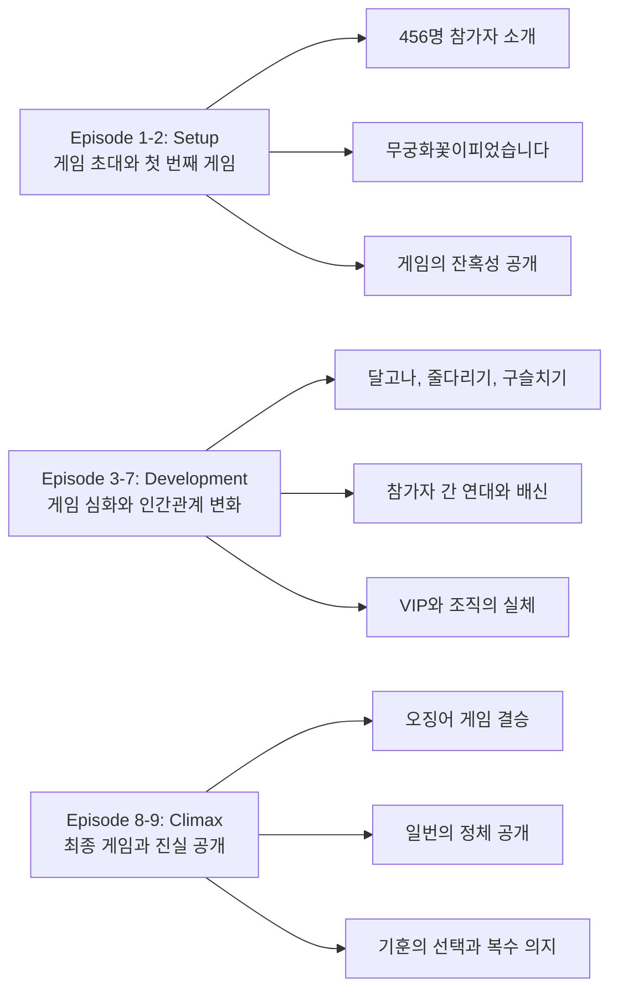
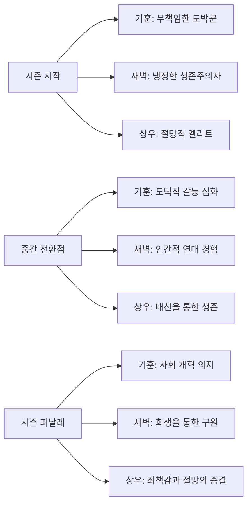
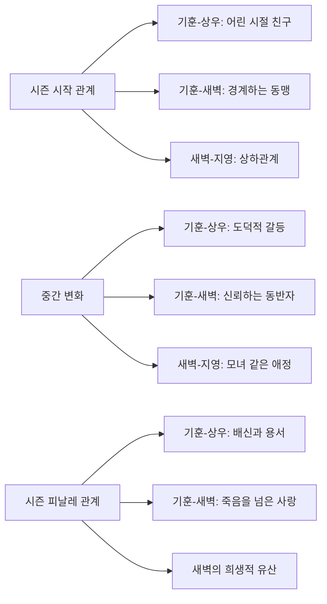

글로벌 문화의 패러다임을 바꾼 작품, 오징어 게임 시즌 1은 단순한 생존 드라마를 넘어 현대 자본주의 사회의 가장 어두운 면을 적나라하게 드러낸 완벽한 걸작이다.

||
|:---:|
||

## 시즌 개요

### 드라마 정보
* 제목: Squid Game / 오징어 게임
* 시즌: Season 1
* 총 에피소드: 9화
* 방영 기간: 2021.09.17 ~ 2021.09.17 (전화 동시 공개)
* 에피소드 평균 길이: 50분
* 감독: 황동혁
* 주연: 이정재(성기훈), 정호연(강새벽), 박해수(조상우), 오영수(일번), 위하준(황준호), 아누팜 트리파티(알리), 김주령(한미녀)
* 장르: 스릴러, 드라마, 심리 스릴러

### 시즌 위치와 연속성
* **전체 시리즈에서의 위치**: 첫 번째 시즌 (완결형 구조)
* **독립적 완성도**: 단일 시즌으로 완벽한 서사 구조
* **다음 시즌을 위한 복선**: 기훈의 복수 의지와 게임의 연속성

### 시청률과 반응
* **전 세계 동시 공개**: Netflix 글로벌 1위 (94개국)
* **누적 시청 시간**: 16억 5천만 시간 (Netflix 역대 1위)
* **시청자 반응**: 전 세계적 사회 현상, 달고나 게임 유행
* **시즌 갱신 여부**: 시즌 2 제작 확정 (2024년 공개 예정)

### 추천 대상
* **사회 비판 드라마 선호자**: 자본주의와 불평등에 대한 날카로운 통찰
* **심리 스릴러 애호가**: 인간 본성의 극한 상황에서의 선택
* **한국 문화 관심자**: 전통 놀이와 현대 사회의 대비

## 시즌 전체 서사 아크

**🎬 스포일러 전체 공개 - 이미 시즌을 모두 본 독자를 위한 완전한 서사 분석**

### 시즌 메인 아크 구조

### 에피소드별 핵심 포인트

**Episode 1: "무궁화 꽃이 피던 날"**
성기훈을 비롯한 456명의 참가자들이 각자의 절망적인 상황에서 의문의 게임에 초대된다. 첫 번째 게임 '무궁화꽃이피었습니다'에서 255명이 총에 맞아 죽으면서 게임의 잔혹한 본질이 드러난다. "여러분이 여기 온 이유는 모두 같습니다. 돈이 절실히 필요하기 때문입니다"라는 진행자의 말은 전체 시즌의 핵심 테마를 제시한다.

어린 시절의 순수한 놀이가 생과 사를 가르는 도구로 변질된 충격적 전환은 자본주의 사회에서 상실된 순수함을 상징한다. 거대한 인형의 기계적인 시선과 참가자들의 공포는 시즌 전체의 톤앤매너를 확립한다.

**Episode 2: "지옥"**
게임을 포기한 참가자들이 현실로 돌아가지만 여전히 절망적인 상황에 처해 있음을 깨닫는다. 93%가 게임으로 돌아오기를 선택하는 장면은 자본주의 사회에서 개인이 직면한 구조적 한계를 보여준다.

기훈과 새벽의 재회, 상우의 내적 갈등이 본격적으로 시작되며, 참가자들의 배경이 더욱 구체화된다. 게임 복귀 투표 장면에서 "우리는 공정한 세상에서 공정한 게임을 합니다"라는 말은 극도의 아이러니를 보여준다.

**Episode 3-4: "우산을 든 남자" & "함께하는 팀"**
달고나 게임에서 참가자들의 운명이 갈리고, 줄다리기를 위한 팀 구성 과정에서 인간관계의 복잡함이 드러난다. 일번 오일남이 보여주는 지혜와 리더십은 후에 밝혀질 그의 정체에 대한 복선이 된다.

새벽과 지영의 관계, 알리와 상우의 관계가 발전하며 게임 내에서도 인간적 연대가 가능함을 보여준다. 하지만 동시에 생존을 위한 잔혹한 선택의 필연성도 암시한다.

**Episode 5-6: "공정한 세상" & "깐부"**
야간 폭동을 통해 참가자들 간의 계급 갈등과 생존 본능이 극대화된다. 의사와 관리자의 장기매매 부정행위가 발각되며 게임의 "공정성"이라는 허상이 무너진다.

구슬치기 게임에서 깐부들이 서로를 배신하거나 희생하는 장면은 시즌의 감정적 클라이맥스를 형성한다. 특히 기훈과 일번의 게임, 상우와 알리의 배신, 새벽과 지영의 희생은 인간성의 복잡한 면모를 보여준다.

**Episode 7-8: "VIPS" & "프론트 맨"**
VIP들의 등장으로 게임의 진정한 배후와 목적이 드러난다. 부유한 권력자들의 오락거리로 전락한 인간의 생명은 극도의 계급사회를 상징한다. 황준호의 잠입을 통해 게임 조직의 실체가 공개되고, 프론트 맨의 정체가 그의 형 인호임이 밝혀지는 충격적 반전이 일어난다.

징검다리 유리게임에서 새벽의 생존과 미녀의 희생은 운명의 잔혹함과 연대의 의미를 동시에 보여준다.

**Episode 9: "운수 좋은 날"**
최종 오징어 게임에서 기훈과 상우의 대결은 단순한 승부를 넘어 인간성과 우정에 대한 마지막 시험이 된다. 상우의 자살로 기훈이 우승하지만 승리의 공허함을 느끼며, 일 년 후 일번 오일남이 게임의 창시자였음이 밝혀진다.

"사람들은 아무도 신경 쓰지 않아. 길거리에서 얼어 죽어가는 사람한테"라는 일번의 마지막 도박은 인간성에 대한 절망적 도전이었다. 기훈이 노숙자를 도우며 일번의 가설을 반박하는 장면은 인간성에 대한 희망을 제시한다.

시즌 피날레에서 기훈이 비행기에 오르지 않고 게임 조직에 맞서기로 결심하는 장면은 개인의 각성을 넘어 시스템에 대한 저항 의지를 보여준다.

### 핵심 대사 모음

**"사람은 뭐가 가장 소중한지 정말 절박한 순간이 되어야 알게 됩니다"** - 진행자
**"깐부는 목숨을 나눠 갖는 거야"** - 일번
**"이게 공정한 게임이야?"** - 기훈
**"여기서는 모든 플레이어가 평등합니다"** - 진행자
**"돈이 사람보다 중요해?"** - 새벽

### 상징적 장면 분석

**무궁화꽃이피었습니다의 거대 인형**: 순수한 놀이의 왜곡과 감시사회를 상징
**달고나의 네 가지 모양**: 운명의 잔혹함과 계급의 무작위성
**줄다리기의 전략**: 지혜와 연대의 힘, 세대 간의 협력
**구슬치기의 배신**: 생존을 위한 인간성 포기의 순간들
**VIP 마스크**: 권력자들의 익명성과 비인간화
**오징어 게임 경기장**: 어린 시절과 현재의 대비, 잃어버린 순수함

## 캐릭터 성장 아크 (시즌 전체)

### 시즌별 캐릭터 변화도

### **성기훈 (이정재) - 시즌 전체 성장**

**시즌 시작점**
* 상황: 도박 빚에 시달리는 무능한 아버지
* 목표: 딸의 생일선물과 어머니 수술비 마련
* 갈등: 현실 도피와 책임감 사이의 괴리
* 관계: 이혼한 아내와 딸, 병든 어머니와의 죄책감

**시즌 중간 전환점**
* 변화: 게임의 잔혹성을 깨달으며 도덕적 기준점 형성
* 성장: 다른 참가자들에 대한 연민과 보호 의식 발현
* 관계 변화: 새벽과의 동반자 관계, 상우와의 우정 재확인
* 갈등 심화: 생존과 인간성 사이의 선택 강요

**시즌 피날레 완성**
* 최종 상태: 생존자로서의 죄책감과 사회 개혁 의지
* 성장 완성: 개인적 욕망에서 사회적 책임감으로 전환
* 관계 완성: 죽은 친구들에 대한 의무감, 딸과의 관계 회복
* 미래 전망: 게임 조직에 맞선 적극적 저항자로 변화

**캐릭터 아크의 의미**
기훈의 성장은 현대인의 무력감에서 사회적 행동주의로의 전환을 보여준다. 개인의 생존에서 시작해 타인을 위한 희생, 최종적으로는 시스템 변화를 위한 의지까지 이르는 완벽한 성장 아크다.

### **강새벽 (정호연) - 시즌 전체 성장**

**시즌 시작점**
* 상황: 북한 탈출민으로서의 생존 전문가
* 목표: 가족의 안전과 재결합
* 갈등: 신뢰에 대한 거부감과 고립
* 관계: 타인에 대한 경계와 불신

**시즌 중간 전환점**
* 변화: 기훈과 알리를 통한 인간적 연대 경험
* 성장: 타인을 위한 희생과 보호 본능 발현
* 관계 변화: 지영과의 모성적 관계, 기훈과의 동반자 의식
* 갈등 해소: 생존과 인간성이 공존할 수 있음을 증명

**시즌 피날레 완성**
* 최종 상태: 기훈에 대한 신뢰와 희생적 사랑
* 성장 완성: 개인 생존에서 타인을 위한 희생으로
* 관계 완성: 기훈에게 가족과 신뢰의 의미 전달
* 미래 영향: 기훈의 성장에 결정적 동기 제공

**캐릭터 아크의 의미**
새벽의 여정은 극한 상황에서도 인간적 연대가 가능함을 보여주는 희망의 상징이다. 생존을 위해 모든 것을 포기한 인물이 결국 사랑을 위해 모든 것을 희생하는 역전의 아름다움을 완성한다.

### **조상우 (박해수) - 시즌 전체 성장**

**시즌 시작점**
* 상황: 증권사 임원으로서 횡령으로 인한 절망
* 목표: 생존을 통한 명예 회복과 가족 보호
* 갈등: 엘리트 의식과 현실의 몰락 사이의 괴리
* 관계: 기훈과의 어린 시절 우정, 계층 우월감

**시즌 중간 전환점**
* 변화: 생존을 위한 점진적 도덕성 포기
* 타락: 알리 배신을 통한 완전한 이기주의로 전환
* 관계 변화: 기훈과의 우정에서 경쟁 관계로
* 갈등 심화: 양심과 생존 욕구의 극한 대립

**시즌 피날레 완성**
* 최종 상태: 죄책감에 압도된 절망적 인간
* 성장(퇴행) 완성: 고귀한 인간에서 생존만 남은 동물로
* 관계 완성: 기훈과의 우정을 통한 마지막 인간성 회복
* 종결: 자살을 통한 죄책감으로부터의 해방

**캐릭터 아크의 의미**
상우는 경쟁 사회에서 승리하기 위해 인간성을 포기한 현대인의 비극을 체현한다. 그의 몰락은 도덕성 없는 성공의 허상과 진정한 승리의 의미를 되묻게 한다.

## 관계도 변화 역학

### 시즌별 관계 변화도

### 주요 관계 변화 분석

**기훈-상우 관계의 시즌 변화**

**시즌 시작**
* 관계 상태: 어린 시절 친구에서 계층으로 갈라진 성인
* 갈등 요소: 사회적 지위 차이와 상호 실망감
* 발전 가능성: 위기 상황에서의 우정 회복
* 상호작용: 기훈의 의존과 상우의 우월감

**시즌 중간**
* 변화 과정: 생존 게임을 통한 평등한 조건에서의 재회
* 갈등 변화: 사회적 갈등에서 도덕적 갈등으로 전환
* 새로운 요소: 알리 배신 사건을 통한 결정적 균열
* 상호작용 변화: 동등한 경쟁자에서 적대적 관계로

**시즌 피날레**
* 최종 상태: 우정과 배신이 공존하는 복합적 관계
* 해결/미해결: 상우의 자살을 통한 비극적 해결
* 관계의 의미: 현대 사회에서 우정의 한계와 가능성
* 기훈에의 영향: 생존자 죄책감과 사회 개혁 의지의 동력

**관계 변화의 드라마적 효과**
두 인물의 관계는 계급 사회에서 개인적 관계의 한계를 보여주며, 구조적 불평등이 어떻게 인간관계를 파괴하는지를 극명하게 드러낸다.

**기훈-새벽 관계의 시즌 변화**

**시즌 시작**
* 관계 상태: 서로를 경계하는 임시 동맹
* 갈등 요소: 새벽의 불신과 기훈의 무책임함
* 발전 가능성: 상호 보완적 성격을 통한 성장
* 상호작용: 실용적 협력 관계

**시즌 중간**
* 변화 과정: 위기 상황을 통한 점진적 신뢰 구축
* 갈등 해소: 서로의 약점을 이해하고 받아들임
* 새로운 요소: 보호 본능과 애정의 발현
* 상호작용 변화: 생존 동맹에서 정서적 의존으로

**시즌 피날레**
* 최종 상태: 죽음을 넘어선 사랑과 신뢰
* 완성도: 새벽의 희생을 통한 관계의 승화
* 관계의 의미: 절망적 상황에서 피어난 순수한 사랑
* 미래 영향: 기훈의 변화를 이끄는 영적 동력

**관계 변화의 드라마적 효과**
이들의 관계는 극한 상황에서도 인간적 사랑이 가능함을 보여주며, 시청자에게 희망과 감동을 제공하는 시즌의 감정적 코어다.

## 숨겨진 레이어

### 상징적 의미

**전통 놀이의 왜곡**: 순수했던 어린 시절의 상실과 자본주의에 의한 모든 가치의 상품화를 상징한다. 각 게임은 인생의 단계별 선택과 운명을 메타포로 제시한다.

**456억원의 상금**: 참가자 수와 정확히 일치하는 금액으로, 한 명당 1억원씩 생명의 가격을 매긴 자본주의의 잔혹한 등가교환을 보여준다.

**빨간색과 초록색**: 게임의 시작과 정지를 알리는 색상이자, 생명과 죽음, 희망과 절망의 이분법적 세계관을 시각화한다.

**계단과 위계구조**: 참가자, 관리자, VIP로 이어지는 공간적 위계는 현실 사회의 계급구조를 건축물로 형상화한다.

### 사회적/문화적 맥락

**한국의 경제위기와 불평등**: 외환위기 이후 심화된 계층 분화와 청년실업, 가계부채 문제가 작품의 현실적 배경을 이룬다.

**신자유주의의 모순**: 공정한 경쟁을 표방하지만 실제로는 구조적 불평등이 지배하는 현대 사회의 이중성을 게임 규칙을 통해 폭로한다.

**전통과 현대의 충돌**: 한국 전통 놀이가 첨단 기술과 결합된 죽음의 게임으로 변질되는 과정은 급속한 근대화가 가져온 문화적 단절을 상징한다.

### 현대적 메시지

**승자독식 사회의 비판**: 극소수의 승리자를 위해 다수가 희생되는 현대 경쟁 사회의 구조적 폭력성을 극단적으로 형상화한다.

**인간성 회복의 가능성**: 절망적 상황에서도 연대와 희생을 통해 인간성을 지킬 수 있다는 희망의 메시지를 전달한다.

**개인과 시스템의 대결**: 개인의 각성과 저항을 통해 부조리한 시스템에 맞설 수 있다는 사회 변화의 가능성을 제시한다.

### 시즌 테마의 심화

**자본주의와 인간성의 대립**: 돈과 생명을 등가교환하는 게임의 논리는 자본주의가 인간을 상품화하는 메커니즘을 적나라하게 보여준다.

**공정성이라는 환상**: 모든 참가자가 "평등한" 조건에서 게임에 참여하지만, 실제로는 각자의 사회적 배경과 능력 차이가 결정적 변수가 되는 현실을 통해 진정한 공정성에 대해 질문한다.

**생존과 존재의 의미**: 단순히 살아남는 것과 인간답게 사는 것의 차이를 통해 현대인의 실존적 고민을 탐구한다.

## 제작 비하인드

### 시즌 제작 과정의 특별함

황동혁 감독이 10년간 구상하고 2년간 제작한 이 작품은 초기 투자자 유치에 어려움을 겪었으나, Netflix의 글로벌 플랫폼을 통해 전 세계적 성공을 거둔 K-콘텐츠의 대표작이 되었다.

### 캐스팅 스토리

이정재, 박해수 등 중견 배우들과 정호연, 김주령 등 신예 배우들의 조화로운 캐스팅이 작품의 완성도를 높였다. 특히 오영수의 일번 역할은 시즌 최고의 캐스팅으로 평가받는다.

### 기술적 혁신

실제 크기의 거대한 세트와 실용적 특수효과를 중심으로 한 제작 방식은 CG에 의존하지 않는 현실감 있는 영상미를 구현했다. 특히 게임 공간의 건축학적 설계는 작품의 상징성을 시각적으로 완성했다.

### 시청자 반응과 제작진의 대응

전 세계적 열풍에 대한 제작진의 놀라움과 함께, 달고나 게임 등 작품 속 요소들이 실제 사회 현상으로 번지면서 문화적 영향력을 입증했다.

## 시즌 종합 평가

### 시즌 완성도 평가
**최종 평점: ★★★★★ (5/5)**

### 한 줄 평
인간성과 자본주의의 대립을 통해 현대 사회의 모순을 완벽하게 형상화한 21세기 드라마의 새로운 고전.

### 추천 작품
- **배틀로얄**: 생존 게임의 원조격 작품
- **기생충**: 계급 갈등을 다룬 봉준호의 걸작
- **블랙 미러**: 현대 사회에 대한 디스토피아적 성찰
- **더 플랫폼**: 계급 사회를 은유한 스페인 스릴러
- **허슬**: 경제적 절망을 다룬 미국 드라마

### 관람 전 체크리스트
- 폭력적 장면에 대한 심리적 준비 필요
- 한국 전통 놀이에 대한 기본 지식이 있으면 더욱 흥미로움
- 사회 경제적 불평등 문제에 대한 관심이 있으면 깊이 있는 감상 가능
- 9화 완주 후 여운을 충분히 음미할 시간적 여유 권장