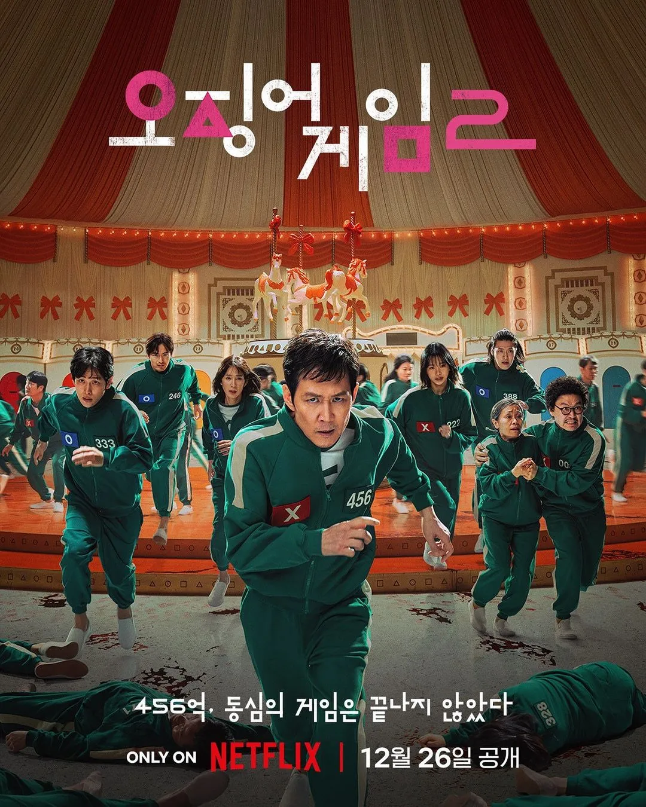
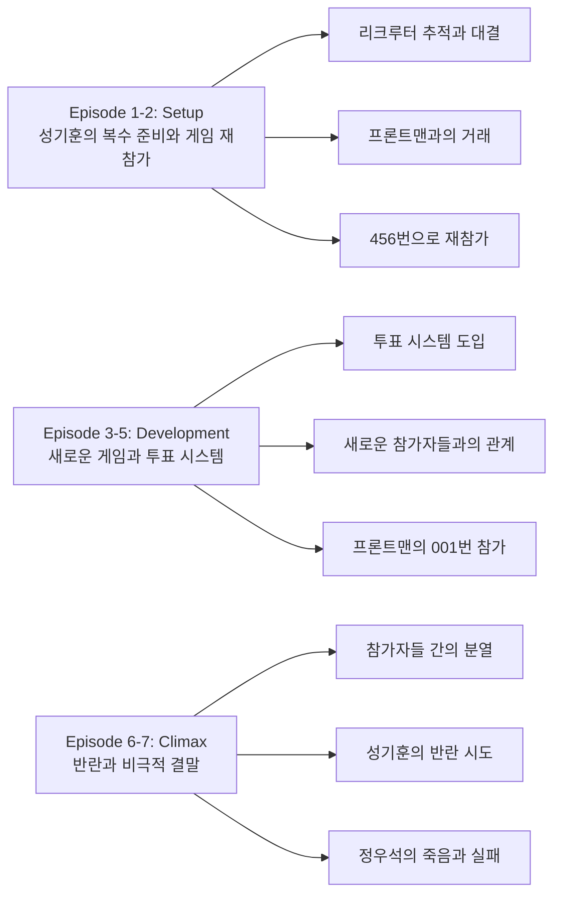
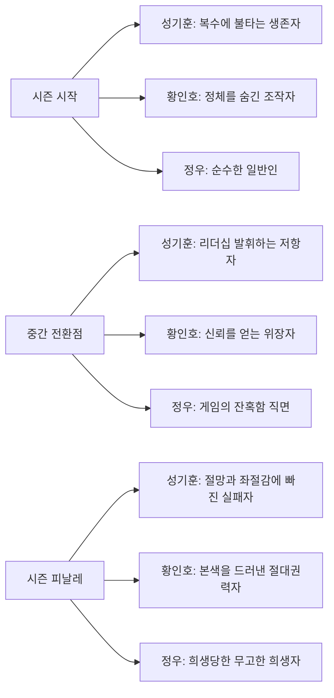
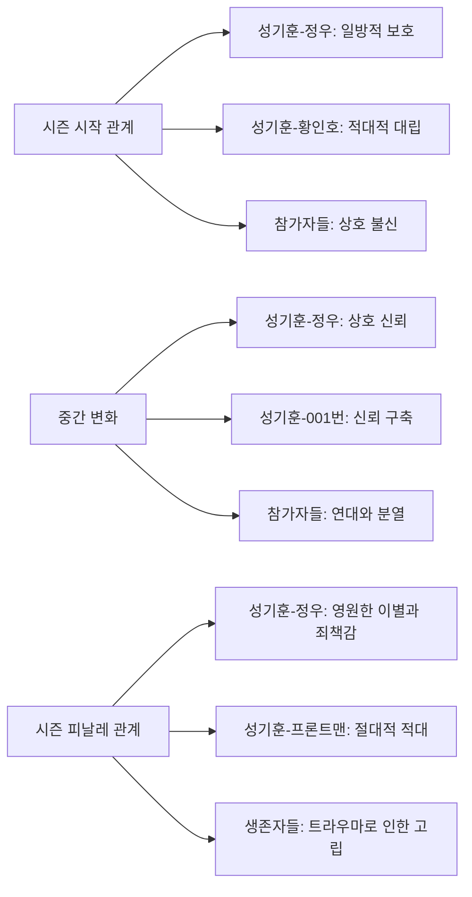

전 세계를 강타한 오징어 게임이 3년 만에 돌아왔다. 이번엔 생존자 성기훈이 게임을 파괴하기 위해 다시 456번으로 돌아온다는 설정으로, 복수와 저항의 서사가 새롭게 펼쳐진다.

||
|:---:|
||

## 시즌 개요

### 드라마 정보
* 제목: Squid Game / 오징어 게임
* 시즌: Season 2
* 총 에피소드: 7화
* 방영 기간: 2024.12.26 ~ 2024.12.26 (동시 공개)
* 에피소드 평균 길이: 60분
* 감독: 황동혁
* 주연: 이정재, 이병헌, 위하준, 임시완, 강하늘, 박규영, 이진욱, 박성훈
* 장르: 스릴러, 드라마, 서바이벌

### 시즌 위치와 연속성
* **전체 시리즈에서의 위치**: 2번째 시즌 (중간 브릿지 역할)
* **이전 시즌과의 연결점**: 성기훈의 게임 승리 후 3년 뒤 시점, 프론트맨과의 대결 구조
* **다음 시즌을 위한 복선**: 성기훈의 실패와 정우석의 구출 작전, 최종 대결 예고

### 시청률과 반응
* **넷플릭스 기록**: 공개 4일 만에 6,800만 뷰 달성 (넷플릭스 역대 최고 기록)
* **글로벌 1위**: 92개국에서 동시 1위 달성
* **시청자 반응**: 시즌 1 대비 더 잔혹하고 복잡한 스토리에 대한 엇갈린 평가
* **시즌 갱신 여부**: 시즌 3 제작 확정 (2025년 6월 공개 예정)

### 추천 대상
* **시즌 1 시청자**: 성기훈의 변화된 모습과 새로운 게임 방식에 대한 궁금증
* **심리 스릴러 애호가**: 투표 시스템과 프론트맨의 직접 참가로 인한 복잡한 심리전
* **사회 비판 드라마 선호자**: 계급 갈등과 인간 본성에 대한 더욱 심화된 탐구

## 시즌 전체 서사 아크

**🎬 스포일러 전체 공개 - 이미 시즌을 모두 본 독자를 위한 완전한 서사 분석**

### 시즌 메인 아크 구조

### 에피소드별 핵심 포인트

**Episode 1: "빵과 복권" (Bread and Lottery)**
성기훈은 3년간의 준비 끝에 리크루터를 추적한다. 김씨와 최우석의 도움으로 리크루터를 찾아내지만, 러시안 룰렛 게임에서 리크루터가 자살하며 첫 번째 계획이 무산된다. 황준호는 절벽에서 살아남아 성기훈을 찾고 있다. 

리크루터는 자신이 과거 게임의 병사였으며 자신의 아버지를 죽였다고 고백한다. "너 같은 쓰레기가 세상을 바꿀 수 있다고 생각하나?"라는 대사는 시즌 전체의 테마를 암시한다.

**Episode 2: "할로윈 파티" (Halloween Party)**
성기훈, 준호, 우석이 할로윈 파티를 통해 프론트맨을 찾으려 하지만 실패한다. 성기훈은 자신의 이빨에 추적기를 심고 게임에 참가하겠다고 선언한다. 프론트맨은 이를 받아들이며 "네가 원하는 대로 게임에 들어가라"고 응답한다.

한편 강노을이 북한 이탈주민으로 소개되며, 그녀의 복잡한 과거가 암시된다. 게임 조직의 내부 구조와 새로운 캐릭터들의 배경이 구체적으로 드러나기 시작한다.

**Episode 3: "001" (001)**
성기훈이 다시 456번으로 게임에 참가하며, 새로운 참가자들을 만난다. 박정우(390번), 이명기(333번), 김준희(222번), 강대호(388번) 등 다양한 배경의 인물들이 등장한다. 가장 중요한 것은 황인호(프론트맨)가 001번으로 위장 참가한다는 점이다.

무궁화 꽃이 피었습니다에서 성기훈은 다른 참가자들에게 게임의 위험성을 경고하지만, 대부분이 믿지 않는다. 첫 번째 사망자가 나온 후에야 모든 참가자들이 게임의 진실을 깨닫는다.

**Episode 4: "다리 여섯 개" (Six Legs)**
새로운 게임인 6인 5각 이어달리기가 시작된다. 성기훈의 팀은 자신, 정우, 대호, 준희, 그리고 001번(황인호)으로 구성된다. 각자 딱지치기, 비석치기, 공기놀이, 팽이치기, 제기차기를 담당한다.

황인호는 001번으로서 성기훈의 신뢰를 얻기 위해 노력하며, 동시에 게임을 조종한다. 투표에서 게임 계속 진행이 결정되면서 참가자들 사이의 갈등이 심화된다.

**Episode 5: "한 번 더" (One More Game)**
세 번째 게임인 '동동동' (Mingle)이 진행된다. 지정된 숫자만큼 그룹을 만들어야 하는 게임으로, 소외된 자는 죽음을 맞는다. 이 게임을 통해 참가자들 간의 인간관계와 배신의 심리가 적나라하게 드러난다.

타노스(230번)의 과격한 행동과 명기의 도덕적 갈등, 준희의 임신 사실 등이 복합적으로 얽히면서 다음 투표를 위한 긴장감이 고조된다.

**Episode 6: "O X" (O X)**
게임 계속 여부를 결정하는 투표에서 동점이 나오며, 밤사이 참가자들 간의 유혈 사태가 벌어진다. 타노스가 죽고, 성기훈은 이것이 게임 운영진의 의도된 계획임을 깨닫는다.

성기훈은 동료들에게 반란을 제안하며, 병사들의 무기를 탈취하여 게임을 종료시키려 한다. 황인호는 이 과정에서 자신의 정체를 숨기며 성기훈의 계획에 협력하는 척한다.

**Episode 7: "친구냐 적이냐" (Friend or Foe)**
성기훈의 반란이 본격적으로 시작되지만, 황인호의 배신으로 모든 계획이 무너진다. 황인호는 동행한 두 명의 참가자를 죽이고 자신의 죽음을 조작한 뒤, 프론트맨으로 돌아와 성기훈 일행을 진압한다.

가장 충격적인 순간은 프론트맨이 성기훈의 절친한 친구 정우를 눈앞에서 총살하는 장면이다. "친구를 구하려다 친구를 죽였구나"라는 프론트맨의 말은 성기훈의 절망과 죄책감을 극대화한다.

### 핵심 대사 모음

**"너 같은 쓰레기가 세상을 바꿀 수 있다고 생각하나?"** - 리크루터 (에피소드 1)
시즌 전체를 관통하는 성기훈의 정체성과 능력에 대한 의문을 제기

**"네가 원하는 대로 게임에 들어가라"** - 프론트맨 (에피소드 2)
성기훈의 계획을 이미 꿰뚫고 있음을 암시하는 여유로운 대응

**"이건 게임이 아니야. 우리는 말이야"** - 성기훈 (에피소드 6)
참가자들을 동물 취급하는 시스템에 대한 분노와 인간 존엄성 선언

**"친구를 구하려다 친구를 죽였구나"** - 프론트맨 (에피소드 7)
성기훈의 선의와 행동이 가져온 역설적 결과에 대한 잔혹한 지적

### 상징적 장면 분석

**투표 장면의 상징성**
매 게임 후 진행되는 O/X 투표는 민주주의의 한계와 다수결의 폭력성을 보여준다. 개인의 생존 욕구와 집단의 결정 사이의 갈등을 극명하게 드러낸다.

**001번의 이중성**
황인호가 001번으로 참가하는 설정은 시즌 1의 오일남과 대비되는 구조다. 하지만 이번엔 단순한 관찰자가 아닌 적극적 조작자로서 더욱 교묘하고 위험한 존재감을 보여준다.

**정우의 죽음**
성기훈의 가장 소중한 친구의 죽음은 선의의 행동이 가져올 수 있는 최악의 결과를 상징한다. 영웅적 저항의 한계와 시스템의 잔혹함을 동시에 보여주는 결정적 장면이다.

## 캐릭터 성장 아크 (시즌 전체)

### 시즌별 캐릭터 변화도

### **성기훈 (이정재) - 시즌 전체 성장**

**시즌 시작점**
* 상황: 3년간 복수를 계획해온 변화된 남자
* 목표: 게임 시스템 파괴와 운영진 처벌
* 갈등: 과거의 트라우마와 책임감 사이의 모순
* 관계: 고립된 복수자로서 타인을 도구시하는 경향

**시즌 중간 전환점**
* 변화: 새로운 참가자들에 대한 보호 욕구 발현
* 성장: 개인적 복수에서 집단적 저항으로 목표 확장
* 관계 변화: 정우, 대호 등과 진정한 동료애 형성
* 갈등 심화: 목적을 위한 수단 선택의 도덕적 딜레마

**시즌 피날레 완성**
* 최종 상태: 모든 계획이 실패하고 소중한 친구를 잃은 절망적 상황
* 성장 완성: 영웅적 저항의 한계와 시스템의 강고함 깨달음
* 관계 완성: 정우의 죽음으로 인한 극단적 죄책감과 고립
* 미래 전망: 더욱 격렬하고 절망적인 복수를 위한 준비

**캐릭터 아크의 의미**
성기훈의 변화는 개인의 선의와 의지만으로는 거대한 시스템을 바꿀 수 없다는 현실적 한계를 보여준다. 동시에 그의 실패가 더 큰 변화의 씨앗이 될 수 있음을 암시한다.

### **황인호/프론트맨 (이병헌) - 이중 정체성의 완벽한 연기**

**시즌 시작점**
* 상황: 성기훈의 복수를 예측하고 대비하는 절대권력자
* 목표: 게임 시스템 보호와 성기훈의 완전한 굴복
* 갈등: 동생 준호에 대한 복잡한 감정
* 관계: 모든 것을 조종하는 숨겨진 조작자

**시즌 중간 전환점**
* 변화: 001번으로 위장하여 직접 게임에 참가
* 성장: 성기훈의 심리와 약점을 더 정확히 파악
* 관계 변화: 성기훈의 신뢰를 얻으며 내부에서 조종
* 갈등 심화: 인간적 감정과 시스템 수호자 역할 사이의 긴장

**시즌 피날레 완성**
* 최종 상태: 모든 가면을 벗고 절대권력자로 복귀
* 성장 완성: 성기훈을 완전히 굴복시킨 완벽한 승리자
* 관계 완성: 성기훈에게 절망과 무력감을 선사한 잔혹한 지배자
* 미래 전망: 더욱 정교해진 게임 시스템과 성기훈과의 최종 대결

**캐릭터 아크의 의미**
황인호는 시스템의 화신이자 성기훈의 정반대편에 서 있는 존재다. 그의 완벽한 승리는 개인의 의지로는 극복할 수 없는 구조적 권력의 강고함을 상징한다.

### **박정우 (이서환) - 순수함이 희생되는 비극**

**시즌 시작점**
* 상황: 경제적 어려움으로 게임에 참가한 평범한 시민
* 목표: 가족의 생계를 위한 상금 획득
* 갈등: 게임의 잔혹함과 자신의 도덕성 사이의 갈등
* 관계: 성기훈에 대한 무조건적 신뢰와 의존

**시즌 중간 전환점**
* 변화: 게임의 진실을 깨달으며 성기훈의 계획에 동참
* 성장: 단순한 생존자에서 저항의 동참자로 발전
* 관계 변화: 성기훈과의 우정이 진정한 동지애로 발전
* 갈등 심화: 가족에 대한 책임과 동료들에 대한 의리 사이의 딜레마

**시즌 피날레 완성**
* 최종 상태: 성기훈의 복수 계획 때문에 무고하게 희생
* 성장 완성: 순수한 희생자로서 성기훈에게 영원한 죄책감 남김
* 관계 완성: 성기훈과의 우정이 그에게 가장 큰 상처로 전환
* 미래 전망: 성기훈의 더욱 격렬한 복수 의지의 동력이 됨

**캐릭터 아크의 의미**
정우의 죽음은 성기훈의 선의가 낳은 가장 잔혹한 결과다. 순수한 희생자로서 그의 죽음은 시스템의 잔혹함과 개인적 복수의 한계를 동시에 보여준다.

## 관계도 변화 역학

### 시즌별 관계 변화도

### 주요 관계 변화 분석

**성기훈과 정우의 우정**

**시즌 시작**
* 관계 상태: 성기훈의 일방적 보호 의식
* 갈등 요소: 정우의 게임 참가에 대한 성기훈의 죄책감
* 발전 가능성: 진정한 우정으로의 발전 가능성
* 상호작용: 성기훈의 보호 vs 정우의 자립 의지

**시즌 중간**
* 변화 과정: 게임을 통해 서로를 더 깊이 이해
* 갈등 심화/해소: 상호 신뢰와 의존 관계로 발전
* 새로운 요소: 공동의 위기 상황에서 진정한 동지애 형성
* 상호작용 변화: 상호 보완적이고 대등한 관계로 발전

**시즌 피날레**
* 최종 상태: 정우의 죽음으로 관계가 영원히 단절
* 해결/미해결: 해결될 수 없는 영원한 상실과 죄책감
* 관계의 의미: 성기훈에게 가장 큰 상처와 복수 동기 제공
* 미래 전망: 성기훈의 트라우마와 분노의 핵심 요소

**관계 변화의 드라마적 효과**
정우와의 관계는 성기훈의 인간성을 보여주는 동시에, 그의 복수가 얼마나 큰 대가를 치르는지를 극명하게 드러낸다.

**성기훈과 황인호(001번/프론트맨)의 대립**

**시즌 시작**
* 관계 상태: 성기훈의 일방적 적대감
* 갈등 요소: 과거 게임의 트라우마와 복수 의지
* 발전 가능성: 직접 대결의 불가피성
* 상호작용: 성기훈의 추적 vs 프론트맨의 회피

**시즌 중간**
* 변화 과정: 001번으로 위장한 황인호와 신뢰 관계 형성
* 갈등 심화/해소: 표면적 신뢰 vs 숨겨진 적대감
* 새로운 요소: 황인호의 직접 관찰과 심리 조작
* 상호작용 변화: 성기훈의 신뢰 vs 황인호의 기만

**시즌 피날레**
* 최종 상태: 완전한 적대 관계로 돌아가며 더욱 격렬해진 대립
* 해결/미해결: 미해결된 근본적 대립 구조
* 관계의 의미: 개인 vs 시스템의 대립을 상징
* 미래 전망: 시즌 3에서의 최종 대결 예고

**관계 변화의 드라마적 효과**
두 인물의 관계는 전체 시리즈의 핵심 갈등 구조를 이루며, 개인의 의지와 시스템의 권력 사이의 근본적 대립을 상징한다.

## 숨겨진 레이어

### 상징적 의미

**투표 시스템의 도입**
매 게임 후 실시되는 O/X 투표는 민주주의의 양면성을 보여준다. 다수결이라는 민주적 절차가 개인의 생사를 결정하는 잔혹한 도구로 변질되는 과정을 통해, 현대 사회의 다수의 폭력과 민주주의의 한계를 날카롭게 지적한다.

**001번의 상징성**
황인호가 001번으로 참가하는 설정은 권력의 위장과 침투를 상징한다. 시즌 1에서 오일남이 관찰자로서의 001번이었다면, 시즌 2의 황인호는 적극적 조작자로서 더욱 교묘하고 위험한 권력의 모습을 보여준다.

**빵과 복권의 선택**
에피소드 1의 제목이자 핵심 소재인 '빵과 복권'은 생존과 욕망 사이의 선택을 상징한다. 대부분의 사람들이 당장의 배고픔보다 일확천금의 꿈을 택하는 현실은 자본주의 사회의 욕망 구조를 적나라하게 드러낸다.

### 사회적/문화적 맥락

**한국 사회의 세대 갈등**
새로운 참가자들은 다양한 세대와 계층을 대표한다. 2030 청년층의 취업난, 4050 중장년층의 경제적 압박, 노년층의 소외 등 한국 사회의 전 세대가 겪는 경제적 어려움을 포괄적으로 다룬다.

**젠더와 성소수자 이슈**
조현주(120번) 캐릭터의 등장은 한국 사회의 성소수자에 대한 인식과 편견을 정면으로 다룬다. 게임이라는 극한 상황에서도 지속되는 차별과 편견은 한국 사회의 다양성 수용 문제를 제기한다.

**북한 이탈주민 문제**
강노을의 설정을 통해 분단 현실과 북한 이탈주민의 정착 과정에서 겪는 어려움을 조명한다. 게임 조직에 흡수된 그녀의 상황은 사회적 약자가 범죄 조직에 이용당하는 현실을 반영한다.

### 현대적 메시지

**소셜미디어와 가짜 뉴스**
타노스(230번) 캐릭터를 통해 소셜미디어의 허상과 인플루언서 문화의 문제점을 지적한다. 가상의 성공과 현실의 절망 사이의 괴리는 현대 사회의 디지털 격차 문제를 상징한다.

**민주주의의 위기**
투표 시스템을 통해 다수결 민주주의의 한계와 위험성을 경고한다. 생사가 걸린 상황에서 이루어지는 투표는 현실 정치에서 벌어지는 포퓰리즘과 다수의 폭력을 은유한다.

**개인 영웅주의의 한계**
성기훈의 실패는 개인의 선의와 의지만으로는 구조적 문제를 해결할 수 없음을 보여준다. 시스템 체인지를 위해서는 개인적 차원을 넘어선 집단적 행동과 사회적 변화가 필요함을 시사한다.

### 시즌 테마의 심화

**복수의 대가**
시즌 1이 생존과 자본주의를 다뤘다면, 시즌 2는 복수와 그 대가에 집중한다. 성기훈의 복수는 오히려 더 많은 무고한 희생자를 낳으며, 복수의 순환 고리가 얼마나 파괴적인지를 보여준다.

**권력의 교묘함**
프론트맨의 직접 참가는 권력이 얼마나 교묘하게 저항을 무력화시키는지를 보여준다. 저항 세력 내부에 침투하여 조종하는 방식은 현실 정치에서 벌어지는 권력의 작동 방식을 은유한다.

**연대의 가능성과 한계**
참가자들 간의 연대와 분열을 통해 집단 행동의 가능성과 한계를 동시에 보여준다. 공동의 위기 앞에서도 개인의 이익을 우선시하는 인간의 본성과, 그럼에도 불구하고 나타나는 연대의 가능성을 균형 있게 다룬다.

## 제작 비하인드

### 시즌 제작 과정의 특별함

**대규모 제작비 투입**
시즌 2와 3를 동시 촬영하는 백투백(back-to-back) 방식으로 대규모 제작비가 투입되어 넷플릭스 한국 오리지널 시리즈 중 최대 규모를 기록했다. 이는 글로벌 수준의 제작 환경과 더욱 정교한 세트, 특수효과를 가능하게 했다.

**실제 촬영 로케이션**
인천국제공항, 대전엑스포과학공원, 성갑도 등 한국의 상징적 장소들에서 촬영이 이루어졌다. 특히 게임장의 세트는 시즌 1보다 더욱 거대하고 정교하게 제작되어 몰입감을 극대화했다.

**동시 촬영 시스템**
시즌 2와 3을 동시에 촬영하는 백투백(back-to-back) 방식을 채택했다. 이를 통해 스토리의 연속성을 유지하고 배우들의 캐릭터 몰입도를 높였다.

### 캐스팅 스토리

**이병헌의 이중 역할**
프론트맨이자 001번으로 이중 역할을 맡은 이병헌은 가면을 쓴 절대권력자와 평범한 참가자를 오가며 연기해야 했다. 그는 "한 장면에서 세 가지 페르소나를 모두 보여줘야 하는 순간이 있었다"고 밝혔다.

**최승현(T.O.P)의 컴백**
2017년 대마초 사건 이후 7년 만에 복귀한 최승현(T.O.P)은 타노스(230번) 역할로 강렬한 인상을 남겼다. 황동혁 감독은 "자신과 비슷한 부정적 면을 가진 캐릭터를 연기하는 데 큰 용기가 필요했을 것"이라고 평가했다.

**트랜스젠더 캐릭터의 캐스팅**
조현주 역을 맡은 박성훈의 캐스팅은 트랜스젠더 당사자가 아닌 배우의 캐스팅에 대한 논란을 불러일으켰다. 황동혁 감독은 "한국 사회에서 소외받는 성소수자를 대변하는 캐릭터를 통해 인식 개선을 도모하고 싶었다"고 캐스팅 의도를 설명했다.

### 기술적 혁신

**향상된 특수효과**
시즌 1보다 더욱 정교해진 총격 장면과 폭발 효과, 그리고 더욱 사실적인 피 묻은 장면들이 구현되었다. 특히 마지막 반란 시퀀스에서는 액션 영화 수준의 총격전이 펼쳐진다.

**몰입형 사운드 디자인**
게임 효과음과 배경음악이 더욱 정교해졌으며, 특히 투표 시 나오는 효과음과 게임 진행 중의 긴장감 조성에서 기술적 발전을 보여준다.

**세트 디자인의 확장**
기존의 분홍색과 녹색 중심의 색상 팔레트를 유지하면서도, 새로운 게임을 위한 더욱 복잡하고 거대한 세트가 제작되었다. 6인 5각 달리기를 위한 운동장 세트는 시즌 1의 어떤 게임장보다도 규모가 크다.

### 시청자 반응과 제작진의 대응

**글로벌 팬덤의 기대**
시즌 1의 성공으로 전 세계적 관심이 집중된 상황에서, 제작진은 더욱 신중하고 정교한 접근을 택했다. 특히 문화적 차이를 고려한 번역과 더빙에 각별한 신경을 썼다.

**비판적 시각에 대한 대응**
일부에서 제기된 "너무 잔혹하다"는 비판에 대해 황동혁 감독은 "현실이 더 잔혹해졌기 때문에 드라마도 그를 반영할 수밖에 없다"고 답했다.

**시즌 3 제작 완료**
시즌 2와 3는 백투백 방식으로 동시 촬영되었으며, 시즌 3는 2025년 6월 27일 공개되었다. 황동혁 감독은 시즌 3가 성기훈 스토리의 완결편이며 오징어 게임 시리즈의 마지막 시즌이라고 밝혔다.

## 시즌 종합 평가

### 시즌 완성도 평가
**최종 평점: ★★★★☆ (4.2/5)**

### 강점
* **더욱 복잡해진 심리전**: 투표 시스템과 프론트맨의 직접 참가로 인한 정교한 심리 게임
* **캐릭터 심화**: 성기훈의 변화된 모습과 새로운 캐릭터들의 깊이 있는 배경
* **사회적 메시지**: 민주주의, 다양성, 권력 구조에 대한 더욱 날카로운 비판
* **기술적 완성도**: 향상된 제작비로 인한 세트, 특수효과, 사운드의 진보

### 아쉬운 점
* **예측 가능한 전개**: 일부 반전이 예상 범위 내에서 머무름
* **캐릭터 분량**: 7화라는 제한된 분량으로 인한 일부 캐릭터의 깊이 부족
* **열린 결말**: 많은 갈등이 해결되지 않은 채 시즌 3로 이어짐
* **잔혹성 논란**: 시즌 1보다 더욱 잔혹해진 장면들에 대한 거부감

### 한 줄 평
"복수의 대가와 시스템의 교묘함을 통해 개인적 영웅주의의 한계와 집단적 저항의 필요성을 날카롭게 제기하는 수작"

### 추천 작품
* **앨리스 인 보더랜드**: 생존 게임과 심리전이 결합된 서사 구조
* **킹덤**: 한국적 소재와 글로벌 어필을 성공적으로 결합한 넷플릭스 오리지널
* **배틀로얄**: 극한 생존 상황에서의 인간 본성 탐구
* **헝거게임**: 체제에 대한 개인의 저항과 그 한계
* **블랙 미러**: 현대 사회의 문제점을 디스토피아적 상상력으로 비판

### 관람 전 체크리스트
* **시즌 1 복습**: 성기훈, 프론트맨, 준호의 관계와 시즌 1 결말 상황 숙지
* **잔혹성 주의**: 시즌 1보다 더욱 강화된 폭력적 장면들 대비
* **열린 결말 각오**: 많은 갈등이 시즌 3로 이어지는 구조임을 인지
* **사회적 맥락 이해**: 한국 사회의 계층 갈등, 성소수자 문제, 민주주의 이슈에 대한 기본적 이해
* **캐릭터 관계 파악**: 다수의 새로운 인물들과 복잡한 관계도 정리 필요