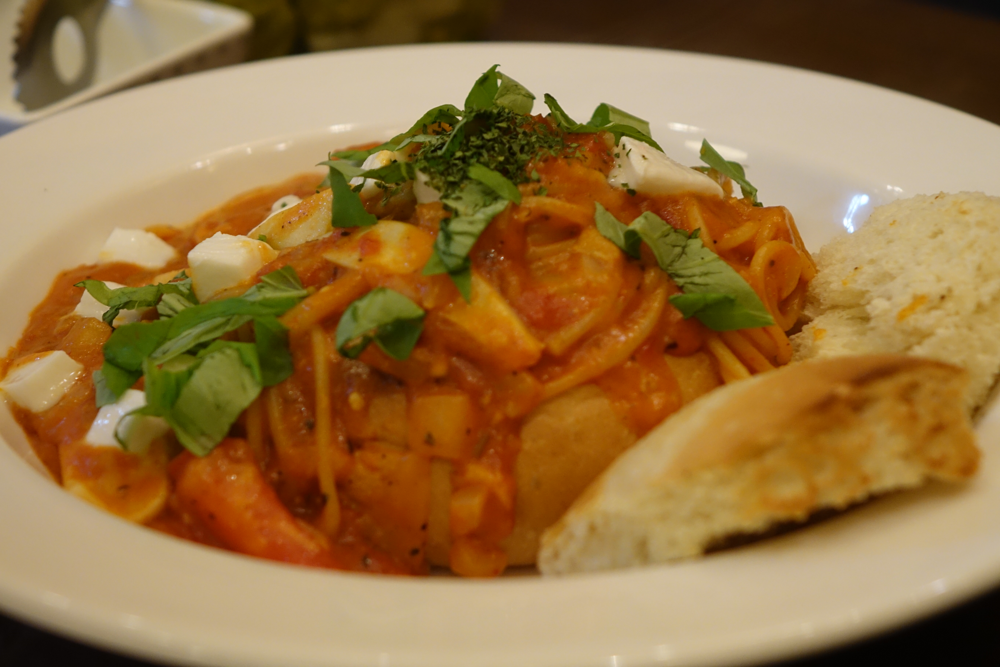
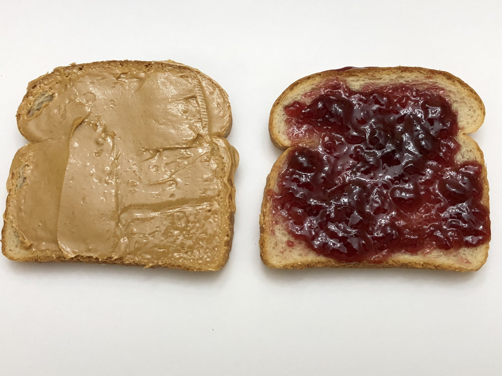
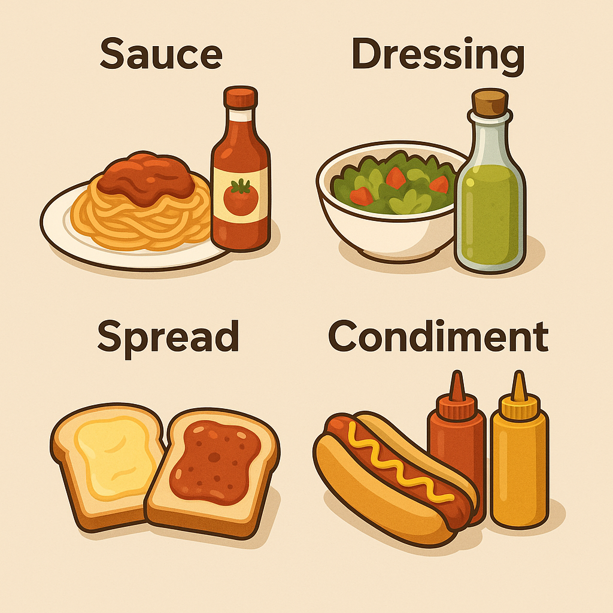

요리를 하다 보면 미국식 레시피나 음식 이야기를 읽을 때 "Sauce", "Dressing", "Spread", "Condiment" 같은 영어 용어를 볼 수 있다. 이 네 가지는 모두 음식에 풍미를 더해주는 역할을 하지만, 사용되는 방식이나 형태가 조금씩 다르다. 이 글에서는 각 용어의 뜻과 쓰임새를 쉽게 설명하고, 케첩(ketchup), 마요네즈(mayonnaise), 딸기잼(strawberry jam), 버터(butter), 랜치 드레싱(ranch dressing), 토마토 소스(tomato sauce) 같은 친숙한 예시를 통해 차이점을 알아보고자 한다.

## Sauce (소스)

||
|:---:|
|토마토 소스로 버무린 스파게티|

Sauce(소스)는 이런 식으로 음식에 곁들여 맛을 더하는 액체 또는 걸쭉한 양념이다. 소스는 요리 과정에서 재료와 함께 조리되거나 완성된 음식 위에 뿌려서 내며, 따뜻하게 제공되는 경우가 많다. 예를 들어 파스타에는 진한 토마토 소스를 사용하고, 스테이크 위에는 고기 육즙으로 만든 그레이비 소스를 끼얹을 수 있다. 구운 고기에는 달콤짭짤한 BBQ 소스를 발라 풍미를 더하기도 한다.

* 예시: 토마토 소스, 크림 소스(white sauce), 간장(soy sauce), 칠리 소스(chili sauce) 등이 있다. 케첩(ketchup)도 토마토로 만든 소스의 일종이지만, 주로 완성된 음식에 추가로 곁들이는 용도로 쓰이므로 콘디멘트(condiment)로 분류되곤 한다.

* 다른 것들과의 차이: 소스는 Spread처럼 빵에 펴 바르는 형태가 아니고, Dressing처럼 샐러드에만 국한되지 않는다. 또한 테이블에서 첨가하는 Condiment와 겹치는 부분이 있지만, 소스가 요리의 핵심 부분으로 사용될 때는 (예: 파스타의 토마토 소스) 일반적으로 콘디멘트라고 부르지 않는다.

## Dressing (드레싱)

||
|:---:|
|신선한 상추와 병에 든 초록빛 샐러드 드레싱.|

Dressing(드레싱)은 주로 샐러드에 뿌려 맛을 더하는 차가운 소스이다. 식초와 올리브유에 허브나 향신료를 섞은 비네그레트(vinaigrette) 드레싱이나, 마요네즈를 기반으로 한 시저 드레싱(Caesar dressing)처럼 조리하지 않고 섞어서 만든다. 보통 생채소나 과일 샐러드에 버무리거나 뿌려 먹으며, 샐러드의 풍미를 결정짓는 중요한 요소이다.

* 예시: 랜치 드레싱(ranch dressing), 시저 드레싱, 발사믹 비네그레트(balsamic vinaigrette), 블루 치즈 드레싱(blue cheese dressing) 등이 있다. 랜치 드레싱은 미국에서 가장 인기 있는 드레싱 중 하나로, 샐러드에 뿌리는 것 외에 채소 스틱이나 치킨 윙을 찍어 먹는 디핑 소스로도 자주 활용된다.

* 다른 것들과의 차이: 드레싱은 기본적으로 소스(sauce)의 한 종류이지만 특히 샐러드용 소스로 특화되어 있다는 점이 다르다. 일반적인 소스가 따뜻한 메인 요리에 쓰이기도 하는 반면, 드레싱은 거의 항상 차가운 상태로 샐러드에 사용된다. 또한 드레싱은 샐러드의 일부로 간주되어 보통 콘디멘트(condiment)로 분류되지 않는데, 이는 드레싱이 선택적인 곁들이기보다는 샐러드 레시피의 필수 요소이기 때문이다.

## Spread (스프레드)

||
|:---:|
|식빵 두 조각에 각각 피넛 버터(땅콩버터)와 포도 잼을 바른 모습입니다.|

Spread(스프레드)는 빵, 크래커 등에 펴 발라 먹는 식품이다. 잼이나 버터처럼 되직한 질감이라서 빵에 얇게 발라도 흘러내리지 않고, 보통 나이프로 떠서 바른다. 아침 식사로 토스트에 버터나 딸기잼을 바르는 것이 대표적인 예이며, 샌드위치를 만들 때 식빵 한 쪽 면에 마요네즈나 머스타드 등을 발라 촉촉하게 하는 것도 스프레드의 활용이다.

* 예시: 버터(butter), 마가린(margarine), 딸기잼(strawberry jam), 포도 젤리(grape jelly), 땅콩버터(peanut butter), 초콜릿 스프레드(예: 누텔라), 크림치즈(cream cheese) 등이 대표적인 스프레드이다. 달콤한 잼 종류부터 짭짤한 치즈 스프레드까지 종류가 다양하며, 주로 빵과 함께 간편한 한 끼나 간식으로 즐긴다.

* 다른 것들과의 차이: 스프레드는 소스(sauce)나 드레싱(dressing)처럼 묽게 흘러내리는 액체 형태가 아니고, 주로 빵류에만 발라 먹는다는 점에서 용도가 한정적이다. 또한 콘디멘트(condiment)에 속하는 경우도 있으나, 대개 스프레드는 음식의 부재료라기보다는 빵과 함께 먹는 주재료에 가까운 역할을 한다. 예를 들어 땅콩버터 잼 샌드위치에서는 땅콩버터와 잼이 그 샌드위치의 주된 맛을 이룬다.

## Condiment (콘디멘트, 테이블 양념)

||
|:---:|
|핫도그에 케첩과 머스타드를 뿌린 모습|

이렇게 음식을 먹을 때 취향에 따라 추가로 곁들여 먹는 것이 Condiment(콘디멘트)이다. 콘디멘트는 음식의 맛을 높이기 위해 조리 완료 후에 첨가하는 각종 양념이나 소스를 통칭하는 말이며, 형태는 소스부터 가루, 절임 등 다양할 수 있다. 보통 식탁 위에 놓고 필요에 따라 조금씩 덜어 먹으며, 음식의 풍미를 개인 취향에 맞게 조절하는 데 사용한다.

* 예시: 케첩(ketchup), 머스타드(mustard), 마요네즈(mayonnaise), 핫소스(hot sauce), 렐리시(relish), 간장(soy sauce), 식초(vinegar), 소금·후추 등 다양하다. 예를 들어 감자튀김을 먹을 때 케첩을 찍어 먹거나, 핫도그에 머스타드를 뿌리는 행위, 피자에 핫소스를 더하는 것, 햄버거에 피클을 넣는 것 등이 모두 콘디멘트를 사용하는 경우이다.

* 다른 것들과의 차이: 콘디멘트는 범위가 아주 넓은 용어로, 소스나 스프레드 같은 것도 그 용도에 따라 콘디멘트로 분류될 수 있다. 다만 콘디멘트라고 부를 때는 그것이 음식의 주요 부분이라기보다 곁들임 요소임을 의미한다. 예를 들어 스파게티의 토마토 소스는 요리의 일부이기 때문에 콘디멘트로 부르지 않지만, 감자튀김에 곁들이는 케첩은 전형적인 콘디멘트이다. 마찬가지로 마요네즈를 샐러드에 넣어 소스로 쓰면 드레싱이지만, 샌드위치나 프라이에 곁들이면 콘디멘트 역할을 하는 식이다.

## 마무리: 알아두면 유용한 구분

요약하면 다음과 같다:

||
|:---:|
|차이점|

* Sauce (소스): 액체나 걸쭉한 형태로 요리의 풍미를 더하는 소스 자체이다. 주로 요리 중간이나 완성 후 음식 위에 곁들여지며, 예를 들어 파스타의 토마토 소스, 스테이크의 그레이비 소스 등이 있다.
* Dressing (드레싱): 샐러드용 소스이다. 보통 올리브유와 식초, 허브 등으로 차갑게 만들어 샐러드에 버무리거나 뿌려 먹으며, 랜치 드레싱이나 시저 드레싱처럼 샐러드에 특화된 소스이다.
* Spread (스프레드): 빵이나 크래커 등에 발라 먹는 식품이다. 버터, 잼, 땅콩버터처럼 되직한 질감으로 빵에 골고루 펴 바르는 형태이며, 주로 아침 식사나 간식으로 쓰인다.
* Condiment (콘디멘트): 테이블에서 첨가하는 양념류의 총칭이다. 소스나 가루 등 형태는 다양하며, 음식 취향을 조절하기 위해 먹기 직전에 추가한다. 케첩, 머스타드, 소금, 후추 등 우리가 식탁에서 자주 사용하는 것들이 모두 콘디멘트에 속한다.

이 네 가지 개념을 알아두면 요리 레시피를 읽거나 식당에서 음식을 먹을 때 도움이 된다. 예를 들어 "이 요리에 어울리는 소스는 뭘까?", "샐러드에는 어떤 드레싱을 쓸까?" 혹은 "테이블에 놓인 콘디멘트를 취향껏 사용하세요" 같은 말의 의미를 정확히 이해할 수 있다. 전문 셰프가 아니어도, 일상 요리에서 소스, 드레싱, 스프레드, 콘디멘트를 구분해 쓰면 더욱 맛있고 알찬 요리를 즐길 수 있다.
