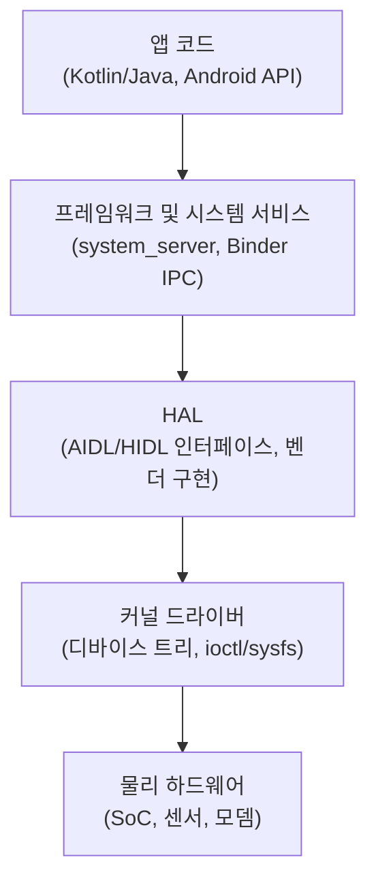

## 이 장을 읽기 전에

이 챕터는 "안드로이드 하드웨어 개발 전문가 과정" 시리즈의 첫 챕터이므로 선행 챕터가 없다. 필요한 선수 지식은 이 장의 "선수 지식" 절에서 별도로 정리한다.

난이도는 입문(왜 이 분야가 존재하는가를 이해하는 수준)에서 중급(커리큘럼 구조와 각 Phase의 기술적 근거를 판단할 수 있는 수준) 사이를 오간다. 코드나 커널 소스를 직접 수정하는 실습은 다루지 않는다. 이 장은 지도(map)이지 실습서가 아니다.

이 장이 다루지 않는 것은 다음과 같다. 커널 소스를 받아 실제로 빌드하고 디바이스 트리를 수정하는 절차는 [01장: 하드웨어 기초](/post/android-hardware-development/hardware-fundamentals/) 이후 3장(커널 개발)에서 다룬다. HAL 모듈을 AIDL로 작성해 프레임워크에 연결하는 구체적인 코드는 4장(HAL 개발)에서, SELinux 정책 작성과 위반 진단은 10장(보안 구현)에서, CDD/CTS 기반 인증 체크리스트는 11장(인증 및 컴플라이언스)에서 각각 별도로 다룬다. 이 장에서는 "왜 이런 순서로 배워야 하는가"와 "각 단계가 최종 역량에 어떻게 기여하는가"만 설명한다.

## 당신의 수준에 맞는 경로

| 수준 | 읽을 부분 | 핵심 목표 |
|---|---|---|
| 앱 개발 경험만 있는 입문자 | 전체를 순서대로 | 왜 앱 개발과 하드웨어 개발이 요구하는 사고방식이 다른지 이해한다 |
| 임베디드/커널 백그라운드 보유자 | 핵심 개념, 비교/트레이드오프, 목차 표 | 이미 아는 리눅스·커널 지식이 안드로이드 스택 어디에 연결되는지 파악한다 |
| 다른 언어/플랫폼에서 전환하는 개발자 | 도입, 실전 적용, 목차 표, 선수 지식 | 자신에게 부족한 선수 지식을 정확히 식별하고 Phase 1부터 시작할지 판단한다 |
| 커리큘럼 설계자·팀 리드 | 목차 표, 비판적 시각 | 팀 온보딩 계획에 이 로드맵을 그대로 쓸 수 있는지, 어디를 보강해야 하는지 판단한다 |

## 도입

안드로이드 앱 개발자는 `Activity`, `ViewModel`, Jetpack Compose 같은 API를 통해 이미 완성된 플랫폼 위에서 작업한다. 그 플랫폼 아래에는 실제로 카메라 센서 값을 읽고, 배터리 전압을 관리하고, NPU에 추론 연산을 내리고, 부팅 시 서명을 검증하는 코드가 있다. 이 코드는 저절로 생기지 않는다. 갤럭시나 픽셀 같은 제품이 출시될 때마다 누군가는 특정 SoC(System on Chip)와 특정 센서·모뎀·디스플레이 조합을 위해 커널을 수정하고, HAL(Hardware Abstraction Layer)을 구현하고, 부트로더의 서명 체인을 검증하고, 그 결과가 Android CDD(Compatibility Definition Document) 요구사항을 만족하는지 확인한다. 이 시리즈는 그 "누군가"가 되기 위한 지식 체계를 다룬다.

이 역량이 순수 앱 개발과 근본적으로 다른 이유는 추상화 계층의 위치 때문이다. 앱 개발자의 버그는 대부분 재현 가능하고, 로그캣과 디버거로 원인을 좁힐 수 있으며, 실패해도 스택 트레이스가 남는다. 하드웨어에 가까운 계층의 버그는 특정 온도·특정 배터리 잔량·특정 전파 환경에서만 재현되거나, 커널 패닉으로 로그 자체가 소실되거나, 실리콘 리비전 차이 때문에 한 보드에서는 재현되고 다른 보드에서는 재현되지 않는다. 판단 기준도 다르다. 앱 개발은 "요구사항을 만족하는가"를 묻지만, 하드웨어 개발은 여기에 "전력 예산 안에서 동작하는가", "실시간성을 만족하는가", "OEM의 인증 요구사항을 통과하는가"라는 제약이 추가로 걸린다. 이 시리즈의 Phase 구성은 바로 이 제약들을 순서대로 습득하도록 설계되어 있다.

## 핵심 개념

**안드로이드 하드웨어 개발자(Android Hardware Developer)**는 안드로이드 OS를 특정 물리적 디바이스에 이식(porting)하고, 그 디바이스의 하드웨어 기능을 안드로이드 프레임워크에 노출시키며, 성능·보안·전력 제약 안에서 그 결과가 상용 제품 수준의 안정성을 갖추도록 만드는 역할이다. 이는 앱 개발자(Android API 위에서 앱을 만드는 사람)와 순수 커널 개발자(안드로이드와 무관하게 리눅스 커널 서브시스템을 다루는 사람)의 교집합이자 확장이다. 안드로이드 하드웨어 개발자는 커널 드라이버 수준의 지식과, 그 드라이버가 어떻게 안드로이드 특유의 계층(HAL, Binder IPC, 시스템 서비스)을 거쳐 앱 API로 노출되는지를 동시에 이해해야 한다.

이 교집합을 이해하려면 안드로이드의 계층 구조를 알아야 한다. **AOSP(Android Open Source Project)**는 이 계층을 크게 다섯 겹으로 나눈다. 최상위는 앱과 프레임워크 API, 그 아래는 시스템 서비스(SurfaceFlinger, ActivityManagerService 등이 상주하는 system_server), 그 아래는 **HAL(Hardware Abstraction Layer)**로 하드웨어별 구현을 프레임워크로부터 격리하는 계층, 그 아래는 네이티브 데몬과 라이브러리, 최하위는 벤더가 제공하는 리눅스 **커널(Kernel)**과 디바이스 드라이버다. 이 계층 구조가 존재하는 이유는 "느슨한 결합"이다. Google은 프레임워크를 매년 갱신하고, 칩 제조사는 커널과 드라이버를 자신의 일정대로 유지보수한다. 두 팀이 매번 서로의 소스를 조율하지 않고도 호환성을 유지하려면, 그 경계에 안정된 인터페이스가 있어야 한다. 그 인터페이스가 바로 **AIDL(Android Interface Definition Language)**과 그 전신인 **HIDL(HAL Interface Definition Language)**로 정의되는 HAL 계약이며, 이 계약을 프레임워크와 벤더 구현 사이에 강제하는 아키텍처를 Google은 **Treble**이라 부른다. Treble 이전에는 안드로이드 버전을 올릴 때마다 벤더가 HAL 전체를 다시 이식해야 했지만, Treble 이후에는 벤더 인터페이스(VINTF)가 버전 간 호환성을 보장하는 방향으로 설계가 바뀌었다.

계층 구조를 오가는 통신은 대부분 **Binder** IPC를 통한다. 앱이 `SensorManager.getDefaultSensor()`를 호출하면, 이 호출은 프로세스 경계를 넘어 시스템 서비스로 Binder를 통해 전달되고, 시스템 서비스는 다시 Binder(또는 AIDL 기반 HAL의 경우 동일한 메커니즘)로 HAL 구현체를 호출하며, HAL 구현체가 비로소 커널 드라이버에 `ioctl`이나 `sysfs` 인터페이스로 접근한다. 부팅 과정에서는 **부트로더(Bootloader)**가 커널과 초기 램디스크를 로드하기 전에 서명을 검증하는데, 이 검증 체인의 하드웨어적 신뢰 앵커 역할을 하는 것이 ARM 아키텍처의 **TrustZone**과 같은 보안 실행 환경이다. 이 개념들은 이후 장에서 각각 독립된 챕터로 깊이 다루므로, 여기서는 "계층마다 이름이 다른 이유가 각기 다른 관심사(호환성, 격리, 신뢰)를 해결하기 위해서"라는 원칙만 기억하면 충분하다.

아래 다이어그램은 앱 코드 한 줄이 실제 하드웨어에 도달하기까지 거치는 계층을 요약한 것이다.



## 비교/트레이드오프

앱 개발자와 안드로이드 하드웨어 개발자는 같은 플랫폼을 다루지만 작업 대상, 도구, 실패 양상이 다르다. 아래 표는 이 차이를 정리한 것이며, 이 시리즈의 Phase 구성이 왜 이런 순서로 짜여 있는지를 이해하는 기준이 된다.

| 구분 | 앱 개발자 | 안드로이드 하드웨어 개발자 |
|---|---|---|
| 주요 언어 | Kotlin, Java | C, C++, Kotlin/Java(프레임워크 계층), 커널 모듈용 C |
| 작업 대상 | Activity, Compose UI, 앱 비즈니스 로직 | HAL 구현, 커널 드라이버, 부트로더, 시스템 서비스 |
| 빌드 단위 | Gradle 모듈, 수 분 내 빌드 | AOSP 전체 소스 트리, 보드 지원 패키지(BSP) 포함 수십 분~수 시간 빌드 |
| 디버깅 도구 | Logcat, Android Studio 디버거, Layout Inspector | dmesg, kernel panic 로그, JTAG/시리얼 콘솔, perfetto/systrace |
| 실패 재현성 | 대체로 결정적, 기기 간 편차 작음 | 온도·전압·타이밍에 따라 비결정적일 수 있음, 보드 리비전 간 편차 큼 |
| 검증 기준 | 기능 요구사항, UX | 기능 요구사항 + 전력 예산, 실시간성, CDD/CTS/VTS 준수 |
| 실패 시 영향 범위 | 해당 앱 크래시 | 부팅 불가, 커널 패닉으로 기기 전체 영향 가능 |

이 표에서 눈여겨볼 지점은 "빌드 단위"와 "실패 재현성"이다. 앱 개발에서 익힌 반복적 실험(코드를 고치고 바로 실행해 확인하는 루프)은 커널·부트로더 계층에서는 그대로 통하지 않는다. 빌드 한 번에 수십 분이 걸리고, 실패가 재현되지 않을 수도 있다는 전제를 받아들여야 한다. 그래서 이 시리즈는 Phase 1에서 하드웨어와 아키텍처 이론을 먼저 다지고, Phase 2에서야 실제 시스템 컴포넌트를 만들기 시작한다. 이론 없이 바로 커널 코드를 고치기 시작하면, 실패의 원인이 코드 로직인지 빌드 설정인지 하드웨어 자체인지조차 구분하지 못하는 경우가 흔하다.

## 실전 적용: 같은 기능, 다른 계층의 코드

앱 개발과 하드웨어 개발의 차이를 추상적으로 설명하는 대신, 같은 기능(가속도계 값 읽기)이 계층별로 어떤 코드로 나타나는지 살펴보자. 앱 개발자가 보는 코드는 다음과 같다. `Context`로부터 `SensorManager`를 얻고, `TYPE_ACCELEROMETER` 센서를 리스너로 등록하는, Android 프레임워크 API의 표준적인 사용법이다.

```java
import android.content.Context;
import android.hardware.Sensor;
import android.hardware.SensorEvent;
import android.hardware.SensorEventListener;
import android.hardware.SensorManager;

public class AccelerometerReader implements SensorEventListener {
    private final SensorManager sensorManager;
    private final Sensor accelerometer;

    public AccelerometerReader(Context context) {
        sensorManager = (SensorManager) context.getSystemService(Context.SENSOR_SERVICE);
        accelerometer = sensorManager.getDefaultSensor(Sensor.TYPE_ACCELEROMETER);
    }

    public void start() {
        sensorManager.registerListener(
                this, accelerometer, SensorManager.SENSOR_DELAY_NORMAL);
    }

    @Override
    public void onSensorChanged(SensorEvent event) {
        float x = event.values[0];
        float y = event.values[1];
        float z = event.values[2];
        // 여기서 x, y, z를 앱 로직에 사용한다.
    }

    @Override
    public void onAccuracyChanged(Sensor sensor, int accuracy) {
        // 정확도 변화에 대응하는 로직(선택 사항).
    }
}
```

이 30줄 남짓한 코드가 실제로 동작하려면, `getSystemService(Context.SENSOR_SERVICE)`가 반환하는 `SensorManager`가 내부적으로 시스템 서비스(`SensorService`)와 Binder로 통신하고, `SensorService`는 다시 Sensors HAL 구현체를 호출하며, 그 구현체가 커널의 센서 드라이버에서 값을 읽어야 한다. 하드웨어 개발자가 다루는 계층은 이 체인의 아래쪽이다. 아래는 그 관계를 보여주기 위한 개념적 스케치이며, 실제 컴파일 가능한 AIDL 정의가 아니라 인터페이스 계약의 형태만을 나타낸 의사코드다.

```text
// 개념 스케치: HAL 계층이 프레임워크에 노출하는 계약의 형태
// (실제 android.hardware.sensors HAL의 정확한 시그니처는 AOSP 소스를 참조해야 한다)
interface ISensors {
    getSensorsList() -> SensorInfo[]
    activate(sensorHandle: int, enabled: boolean) -> Result
    poll(maxCount: int) -> Event[]   // 커널 드라이버에서 읽은 값을 이벤트로 반환
}
```

이 계약의 구현체(HAL 모듈)는 C++로 작성되며, 커널이 노출하는 `/dev` 노드나 `sysfs` 경로에 `ioctl` 또는 파일 읽기로 접근한다. 즉 앱 개발자에게는 `onSensorChanged` 콜백 하나로 보이는 동작이, 하드웨어 개발자에게는 "커널 드라이버가 센서 칩과 I2C/SPI로 통신하고, 그 값을 HAL이 표준화된 형태로 가공하며, 시스템 서비스가 이를 여러 앱에 멀티플렉싱해서 전달하는" 세 단계의 별도 구현 대상으로 나뉜다. 이 시리즈의 4장(HAL 개발)과 5장(시스템 서비스)은 이 중간 계층을, 3장(커널 개발)과 7장(디바이스 드라이버)은 최하위 계층을 각각 실습 코드와 함께 다룬다.

## 흔한 오개념

**"NDK를 쓰면 하드웨어 개발자다"**라는 생각은 가장 흔한 오해다. NDK(Native Development Kit)는 앱 프로세스 안에서 C/C++로 네이티브 코드를 실행하게 해주는 도구일 뿐이며, 여전히 앱 샌드박스 안에서 동작하고 SELinux 정책과 권한 모델의 제약을 그대로 받는다. NDK로 이미지 처리나 게임 엔진을 최적화하는 일은 14장(네이티브 개발)에서 다루는 값진 기술이지만, 이는 HAL이나 커널에 접근하는 것과는 전혀 다른 작업이다. 앱 프로세스 경계를 넘어 벤더 인터페이스나 커널 드라이버를 직접 다루는 일은 NDK만으로는 불가능하다.

**"루트 권한을 얻어 시스템을 뜯어보면 하드웨어 개발이다"**라는 생각도 흔하다. 루팅과 커스텀 롬 설치는 이미 만들어진 이미지를 우회하는 행위이며, 그 자체로는 새로운 HAL을 구현하거나 새 SoC를 위한 보드 지원 패키지를 만드는 능력을 주지 않는다. 실제 OEM의 하드웨어 개발은 벤더가 제공하는 BSP(Board Support Package)를 기반으로 새 기능을 통합하고, 그 결과가 CDD 요구사항과 CTS/VTS 테스트를 통과하는지 검증하는 공식적인 프로세스를 따른다. 11장(인증 및 컴플라이언스)에서 이 프로세스를 별도로 다루는 이유가 여기에 있다.

**"커널 코드를 조금 고쳐봤으니 커널 개발자다"**라는 생각도 위험한 단순화다. 리눅스 커널 서브시스템 자체를 다루는 것과, 안드로이드가 그 위에 얹는 제약(GKI, 안드로이드 커널 공통 트리, 벤더 모듈 분리 정책)을 지키며 커널을 수정하는 것은 다른 문제다. 안드로이드는 GKI(Generic Kernel Image) 정책을 통해 커널 코어와 벤더 모듈을 분리하도록 요구하며, 이를 어기면 향후 커널 버전 업그레이드 시 벤더 모듈이 깨질 수 있다. 순수 리눅스 커널 지식은 필요조건이지만 충분조건은 아니다.

## 비판적 시각

이 커리큘럼을 있는 그대로 받아들이기 전에 몇 가지 한계를 짚어야 한다. 첫째, 이 시리즈는 개인이 운영하는 기술 블로그의 학습 로드맵이며, 삼성전자·구글·퀄컴 등 실제 기업과의 공식 제휴나 정식 인증 과정이 아니다. 이 시리즈를 완주해도 특정 기업의 채용을 보장하는 자격증이나 학위가 발급되지 않는다. 이 점은 이후 어떤 장에서도 다르게 서술되지 않는다.

둘째, 이 로드맵의 상당 부분은 공개된 AOSP 소스와 공식 문서를 기반으로 하지만, 실제 상용 제품(예: 갤럭시급 플래그십)의 하드웨어 개발은 SoC 제조사가 비공개로 제공하는 SDK, 벤더 전용 HAL 구현, NDA로 보호되는 데이터시트에 크게 의존한다. 이런 자료는 공개 문서만으로는 재현할 수 없으며, 실제 실무 역량의 상당 부분은 특정 기업에 소속되어 그 기업의 비공개 툴체인을 사용하는 경험을 통해서만 얻어진다. 이 시리즈가 줄 수 있는 것은 "공개된 AOSP 생태계 안에서 재현 가능한 기초와 구조적 이해"이지, 특정 OEM의 비공개 워크플로 자체는 아니다.

셋째, 안드로이드 플랫폼은 계속 변한다. Treble, GKI, AIDL로의 전환(HIDL 대체) 같은 구조적 변화가 최근 몇 년 사이에도 있었고, 특정 버전의 정확한 동작이나 API 시그니처는 안드로이드 버전과 커널 버전 조합에 따라 달라질 수 있다. 이후 장에서 다루는 구체적인 코드나 설정은 작성 시점의 AOSP를 기준으로 하며, 실무에 적용할 때는 항상 대상 안드로이드 버전의 공식 문서로 재확인해야 한다. 넷째, Phase 4의 자동차·AI 칩셋 같은 "전문화 트랙"은 실제로는 해당 산업에 특화된 표준(예: AAOS의 차량 신호 규격)과 실무 경험을 요구하며, 이 시리즈 하나로 그 깊이까지 도달한다고 기대하는 것은 과도하다. 이 시리즈는 그 분야로 진입하기 위한 공통 기반을 제공하는 것을 목표로 한다.

## 커리큘럼 전체 구성

이 과정은 4개 Phase, 총 19개 챕터(00장 포함)로 구성된다. Phase 구분은 임의의 주차 배분이 아니라 앞서 설명한 계층 구조를 아래에서부터 순서대로 습득하도록 설계된 것이다. Phase 1은 하드웨어와 안드로이드 아키텍처 자체를 이해하는 단계이므로 코드보다 개념이 우선한다. Phase 2는 그 개념을 실제로 구현하는 단계로, 커널 드라이버와 HAL, 시스템 서비스, 부트로더처럼 하드웨어와 프레임워크를 잇는 컴포넌트를 직접 다룬다. Phase 3은 만든 것이 실험실 수준을 넘어 실제 제품처럼 동작하도록 성능·보안·인증 기준을 적용하는 단계다. Phase 4는 그 위에 애플리케이션 계층, 빌드 시스템, 그래픽·미디어, 온디바이스 AI를 통합해 하나의 완성된 제품 스택으로 마무리하는 단계다.

| Phase | 챕터 | 제목 | 핵심 내용 |
|---|---|---|---|
| - | 00 | 과정 개요와 커리큘럼 | 이 챕터. 동기, Phase 구성 근거, 전체 목차, 선수 지식, 완주 후 역량 |
| 1: 기초 이론 | 01 | 하드웨어 기초 | SoC, 버스, 인터럽트, 메모리 계층 등 안드로이드 하드웨어 개발에 필요한 전자·구조 기초 |
| 1: 기초 이론 | 02 | 안드로이드 아키텍처 | 앱-프레임워크-HAL-네이티브-커널 5계층 구조와 Binder IPC 전체 그림 |
| 1: 기초 이론 | 03 | 커널 개발 | 안드로이드 공통 커널, GKI, 디바이스 트리, 커널 커스터마이징 |
| 1: 기초 이론 | 04 | 하드웨어 추상화 계층(HAL) 개발 | AIDL/HIDL 기반 HAL 아키텍처와 커스텀 HAL 모듈 구현 |
| 2: 시스템 개발 | 05 | 시스템 서비스 개발 | system_server 내 시스템 서비스 구조와 커스텀 서비스 추가 |
| 2: 시스템 개발 | 06 | 프레임워크 커스터마이징 | 안드로이드 프레임워크 계층 수정과 벤더 오버레이 |
| 2: 시스템 개발 | 07 | 디바이스 드라이버 개발 | 안드로이드 특화 커널 드라이버 작성과 sysfs/ioctl 인터페이스 설계 |
| 2: 시스템 개발 | 08 | 부트로더 개발 | 부트 체인, 서명 검증, TrustZone 기반 신뢰 앵커 |
| 3: 최적화 및 상용화 | 09 | 성능 최적화 | perfetto/systrace 기반 프로파일링과 전력·지연 최적화 |
| 3: 최적화 및 상용화 | 10 | 보안 구현 | SELinux 정책, 권한 모델, 하드웨어 기반 신뢰 실행 환경 |
| 3: 최적화 및 상용화 | 11 | 인증 및 컴플라이언스 | CDD/CTS/VTS 기반 호환성 검증과 규정 준수 절차 |
| 3: 최적화 및 상용화 | 12 | 안드로이드 애플리케이션 개발 | 하드웨어 제품에 특화된 시스템 앱·프리로드 앱 개발 |
| 4: 고급 SW 개발 및 통합 | 13 | AOSP 빌드 시스템 및 개발 도구 | Soong/Make 빌드 시스템, repo 워크플로, 빌드 최적화 도구 |
| 4: 고급 SW 개발 및 통합 | 14 | 네이티브 개발(NDK/JNI) | NDK/JNI를 통한 C/C++ 라이브러리 통합과 성능 크리티컬 코드 작성 |
| 4: 고급 SW 개발 및 통합 | 15 | 그래픽 및 미디어 프레임워크 | SurfaceFlinger, Codec2 기반 그래픽·미디어 파이프라인 |
| 4: 고급 SW 개발 및 통합 | 16 | On-Device AI/ML 통합 | LiteRT(TensorFlow Lite) 기반 온디바이스 모델 배포와 NPU/GPU 가속 |
| 4: 고급 SW 개발 및 통합 | 17 | 안드로이드 그래픽 엔진 | 렌더링 파이프라인 심화와 그래픽 엔진 커스터마이징 |
| 4: 고급 SW 개발 및 통합 | 18 | 시스템 통합 및 최종 테스팅 | 전체 스택 통합, 회귀 테스트, 상용화 직전 최종 검증 |

각 챕터의 제목과 범위는 이후 실제 집필 과정에서 현재 품질 기준(이론 우선 서술, 실제 API 기반 코드, 1차 출처 인용)에 맞춰 조정될 수 있다. 이 표는 고정된 계약이 아니라 학습 순서를 설계하기 위한 로드맵이다.

## 선수 지식

이 과정을 시작하기 전에 갖추어야 할 지식은 크게 세 갈래다. 첫째는 **C/C++ 프로그래밍**으로, 포인터와 메모리 레이아웃, 컴파일·링크 과정에 대한 실용적 이해가 필요하다. 커널 드라이버와 HAL 구현은 대부분 C/C++로 작성되며, 가비지 컬렉션이 없는 환경에서의 자원 관리 감각이 요구된다. 둘째는 **Linux 시스템 기초**로, 프로세스와 파일시스템, 권한 모델, 커맨드라인 도구(특히 로그 분석과 빌드 도구)에 익숙해야 한다. 셋째는 **컴퓨터 구조 기초**로, 캐시 계층, 인터럽트, 메모리 매핑 I/O 같은 개념을 이해하고 있어야 1장(하드웨어 기초)과 3장(커널 개발)의 내용을 소화할 수 있다. Kotlin/Java 지식은 필수는 아니지만 12장(안드로이드 애플리케이션 개발)과 프레임워크 계층을 이해하는 데 도움이 되며, 전자회로 기초 지식은 선택 사항이지만 있으면 1장의 하드웨어 신호·버스 설명을 더 깊이 이해할 수 있다.

## 완주 시 갖추는 실무 역량

이 시리즈를 끝까지 따라가면 다음과 같은 구체적인 작업을 스스로 수행할 수 있는 수준에 도달하는 것을 목표로 한다.

- 특정 보드(예: 참조 개발 보드)를 대상으로 AOSP 소스를 받아 빌드하고, 부팅 가능한 이미지를 생성할 수 있다.
- 커널 디바이스 트리를 수정하고, GKI 정책을 지키며 벤더 모듈을 분리해 커널을 커스터마이징할 수 있다.
- AIDL 기반 HAL 모듈을 새로 작성해 하드웨어 기능을 안드로이드 프레임워크에 노출시킬 수 있다.
- perfetto/systrace로 시스템 성능 병목을 프로파일링하고, 그 결과를 근거로 최적화 지점을 좁힐 수 있다.
- SELinux 정책을 작성하고, 정책 위반 로그(avc denied)를 읽어 원인을 진단할 수 있다.
- CDD 요구사항을 근거로 자체 호환성 체크리스트를 작성하고, CTS/VTS 실패 리포트를 해석할 수 있다.
- NDK/JNI로 성능 크리티컬한 네이티브 코드를 앱에 통합하고, LiteRT 기반 온디바이스 AI 모델을 NPU/GPU 가속과 함께 배포할 수 있다.

## 다음 장에서는

[01장: 하드웨어 기초](/post/android-hardware-development/hardware-fundamentals/)에서는 SoC 내부 구조, 메모리 계층, 버스와 인터럽트 등 이후 모든 챕터의 전제가 되는 하드웨어 기초 개념을 다룬다.

## 평가 기준

이 장을 읽은 후 다음을 할 수 있어야 한다.

- 안드로이드 하드웨어 개발자와 순수 앱 개발자의 작업 대상·도구·실패 양상 차이를 표 없이도 설명할 수 있다.
- 안드로이드의 5계층 구조(앱-프레임워크-HAL-네이티브-커널)를 그리고, 각 경계에 어떤 인터페이스(Binder, AIDL/HIDL)가 있는지 말할 수 있다.
- "NDK를 쓴다", "루팅한다", "커널을 고쳐봤다"가 왜 하드웨어 개발자의 충분조건이 아닌지 각각 근거를 들어 설명할 수 있다.
- 자신의 배경(앱 개발/임베디드/전환)에 따라 이 시리즈의 어느 Phase부터 시작해야 할지 판단할 수 있다.
- 이 커리큘럼이 공식 기업 제휴나 인증 과정이 아니라는 점과, 그로 인한 한계(비공개 벤더 SDK에 접근할 수 없다는 점)를 설명할 수 있다.
- 00~18장 전체 목차에서 특정 주제(예: SELinux 정책, 온디바이스 AI 배포)가 몇 장에서 다뤄지는지 찾을 수 있다.

## 참고 및 출처

- Android Open Source Project, "Architecture overview", source.android.com/docs/core/architecture
- Android Open Source Project, "Android Compatibility Definition Document", source.android.com/docs/compatibility/cdd
- Android Developers, "Android NDK", developer.android.com/ndk
- Arm Developer, "Documentation", developer.arm.com/documentation
