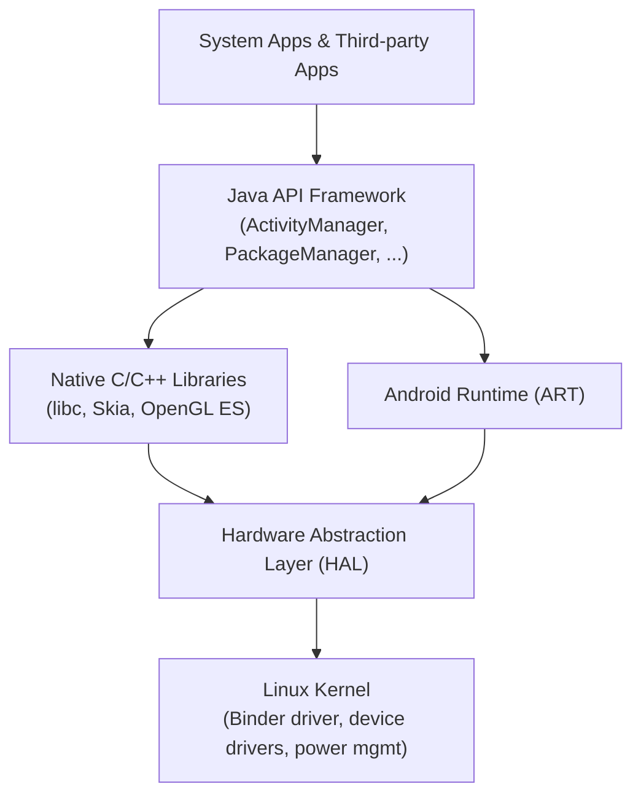
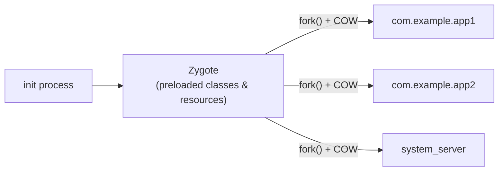
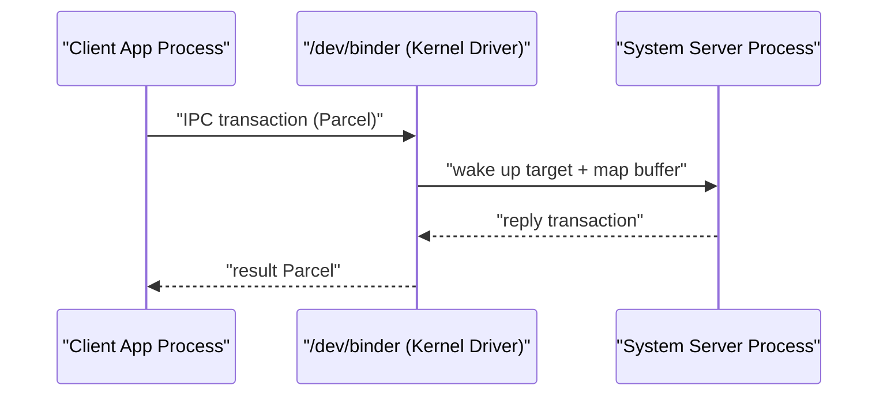

## 이 장을 읽기 전에

이 장은 [01장: 하드웨어 기초](/post/android-hardware-development/hardware-fundamentals/)에서 다룬 SoC, 메모리, 센서 등 물리 하드웨어 지식을 전제로, 그 위에서 동작하는 안드로이드 소프트웨어 스택으로 시선을 옮긴다. 난이도는 전반적으로 초급~중급이지만 ART의 AOT/JIT 컴파일 전략과 Binder의 성능 트레이드오프를 다루는 후반부는 중급~고급 수준으로 올라간다. 이 장은 커널 드라이버를 직접 작성하는 방법은 다루지 않는다 — 그 내용은 다음 장인 [03장: 커널 개발](/post/android-hardware-development/kernel-development/)의 몫이다. 마찬가지로 HAL 모듈을 실제로 설계·구현하는 세부 절차(HIDL/AIDL 인터페이스 작성, 벤더 파티션 배치, VINTF 매니페스트 구성)도 이후 HAL 전용 챕터에서 다루므로, 이 장에서는 HAL이 전체 아키텍처에서 차지하는 위치와 역할만 짚는다.

## 당신의 수준에 맞는 경로

| 수준 | 읽을 부분 | 핵심 목표 |
|---|---|---|
| 처음 접하는 독자 | 도입, 핵심 개념 전체, 흔한 오개념 | 5-레이어 스택과 Zygote·Binder·ART라는 네 가지 축의 이름과 역할을 서로 헷갈리지 않고 구분한다 |
| Linux IPC나 JVM 튜닝 경험이 있는 독자 | 핵심 개념(Binder IPC, ART), 비교/트레이드오프, 실전 적용 | Binder를 소켓·공유메모리와 비교해 상황별로 선택 기준을 세우고 AOT/JIT의 절충을 이해한다 |
| 시스템 서비스·HAL 개발 실무자 | 실전 적용, 비판적 시각, 참고 및 출처 | AIDL 서비스를 직접 구현하고 ART 컴파일 필터를 조정해 부팅·설치 시간을 최적화한다 |

## 도입

하드웨어 팀이 부팅 시간이 느리다거나 특정 시스템 서비스가 죽으면 전화기 전체가 재부팅된다는 버그 리포트를 받았을 때, 원인을 추적하려면 결국 안드로이드 소프트웨어 스택의 내부 구조로 내려가야 한다. 앱 실행이 유독 첫 실행에서만 느린 현상은 ART의 AOT/JIT 전략과 직결되고, 벤더 데몬 하나가 죽었는데 왜 무관해 보이는 시스템 서비스까지 함께 멎는지는 Binder의 프로세스 간 참조 구조를 알아야 설명된다. 또 신규 기기에 안드로이드를 포팅하면서 "이 코드는 어느 파티션에 들어가야 하는가"라는 질문에 답하려면 5-레이어 스택에서 어떤 레이어가 벤더 소유이고 어떤 레이어가 프레임워크 소유인지부터 명확히 해야 한다.

이 네 가지 주제 — 레이어 구조, 프로세스 생성 모델, 프로세스 간 통신, 런타임 컴파일 전략 — 는 서로 독립된 지식이 아니라 하나의 인과 사슬을 이룬다. Zygote가 왜 그런 방식으로 프로세스를 만드는지는 ART의 힙 구조를 알아야 이해되고, Binder가 왜 그렇게 설계됐는지는 5-레이어 스택에서 프레임워크와 벤더 구현이 물리적으로 분리된 프로세스라는 전제를 알아야 이해된다. 이 장은 이 사슬을 이론 중심으로 풀어낸 뒤, 실제로 AIDL 기반 서비스를 만들어보며 그 이론이 코드 위에서 어떻게 구현되는지 확인한다.

## 핵심 개념

### 5-레이어 소프트웨어 스택

AOSP 공식 문서는 안드로이드 소프트웨어 스택을 리눅스 커널, 하드웨어 추상화 계층(HAL), 네이티브 C/C++ 라이브러리와 안드로이드 런타임(ART), 자바 API 프레임워크, 시스템 앱이라는 다섯 개 레이어로 구분한다. **5-레이어 스택(5-Layer Stack)**은 단순한 그림이 아니라 "위 레이어는 아래 레이어의 공개 인터페이스만 알고 구현 세부는 몰라야 한다"는 캡슐화 원칙을 물리적인 파티션 경계로 강제한 결과다. Android 8.0에서 도입된 Project Treble 이후 벤더가 구현하는 HAL과 커널은 `vendor` 파티션에, 구글이 배포하는 프레임워크는 `system` 파티션에 각각 위치하게 되면서, 두 파티션은 서로 다른 일정으로 독립적으로 업데이트될 수 있게 됐다. 즉 이 레이어 구조는 교육용 도식이면서 동시에 실제 빌드 시스템과 배포 전략을 결정하는 아키텍처 경계선이다.

주의할 점은 네이티브 라이브러리와 ART가 같은 레이어에 나란히 그려진다는 것이다. 이는 둘 다 자바 API 프레임워크를 지탱하는 하위 계층이라는 의미이지, ART가 네이티브 라이브러리 위에 순차적으로 쌓인다는 뜻이 아니다. ART는 `.dex` 바이트코드를 실행하는 런타임이고, 네이티브 라이브러리(libc, Skia, OpenGL ES, 미디어 프레임워크 등)는 프레임워크와 앱이 JNI를 통해 직접 호출하는 C/C++ 코드 집합으로, 둘은 병렬적으로 존재하며 서로를 필요에 따라 호출한다.

| 레이어 | 대표 소유 주체 | 대표 언어/기술 |
|---|---|---|
| 시스템 앱 | 구글 + OEM(벤더) | Java/Kotlin |
| 자바 API 프레임워크 | 구글 | Java/Kotlin |
| 네이티브 라이브러리 / ART | 구글 (일부 SoC 벤더 확장) | C/C++, Java 바이트코드 |
| HAL | SoC/디바이스 벤더 | C/C++, AIDL/HIDL |
| 리눅스 커널 | 커널 커뮤니티 + SoC 벤더 | C |



### Zygote 프로세스 모델

**Zygote(자이곳)**는 `init` 프로세스가 부팅 과정에서 생성하는 특수한 프로세스로, 자주 쓰이는 프레임워크 클래스와 리소스를 미리 로드해 둔 뒤 이후 실행되는 모든 앱 프로세스와 `system_server`가 이 프로세스로부터 파생되는 "씨앗" 역할을 한다. 여기서 핵심 원리는 `fork()` 시스템 콜과 **Copy-on-Write(COW, 쓰기 시 복사)** 메모리 관리다. `fork()`는 부모 프로세스의 메모리 페이지를 즉시 복사하지 않고 부모와 자식이 같은 물리 페이지를 공유하다가, 둘 중 하나가 그 페이지에 실제로 쓰기를 시도하는 순간에만 복사본을 만든다. Zygote가 이미 로드해 둔 프레임워크 클래스와 리소스는 새로 실행되는 앱 대부분이 읽기만 하고 수정하지 않으므로, 앱 프로세스마다 JVM/ART를 처음부터 초기화하는 대신 이미 준비된 힙 상태를 거의 공짜로 물려받을 수 있다.

이 모델이 실무에서 갖는 의미는 두 가지다. 첫째, 앱 실행이 느리다는 문제를 조사할 때 "매번 런타임을 새로 부팅한다"는 가정은 틀렸다 — 병목은 대개 Zygote 이후 단계인 애플리케이션 코드의 `Application.onCreate()`나 첫 화면 렌더링에 있다. 둘째, Zygote 자체가 죽거나 오염되면 이후 파생되는 모든 프로세스에 영향이 번질 수 있으므로, Zygote는 시스템에서 가장 신뢰성이 요구되는 프로세스 중 하나로 취급된다. 최근 AOSP는 64비트 Zygote, WebView 전용 Zygote, 그리고 미리 포크해 둔 프로세스 풀(Unspecialized App Process, USAP)을 유지해 프로세스 생성 지연을 더 줄이는 방식도 함께 사용하는데, 구체적인 구성은 안드로이드 버전과 기기 구현에 따라 달라진다.



### Binder IPC 메커니즘

**Binder IPC**는 커널 드라이버(`/dev/binder`)와 사용자 공간 라이브러리(`libbinder`)로 구성된 안드로이드 전용 프로세스 간 통신 메커니즘이다. 안드로이드가 굳이 리눅스에 이미 있는 파이프·소켓·System V IPC를 그대로 쓰지 않고 별도의 메커니즘을 설계한 이유는, 프로세스 경계를 넘는 통신을 마치 같은 프로세스 안에서 객체 메서드를 호출하는 것처럼 다룰 수 있는 프로그래밍 모델(원격 프로시저 호출)이 필요했기 때문이다. Binder는 원격 객체에 대한 참조를 커널이 참조 카운팅으로 관리하고, 호출자의 UID/PID 같은 보안 자격 증명을 커널이 위조 불가능하게 실어 보내며, 서비스가 죽었을 때 이를 감지해 알려주는 death notification까지 제공한다. 이런 기능은 일반 소켓 위에 애플리케이션 계층에서 재구현하기보다 커널 드라이버 수준에서 보장하는 편이 안전하고 일관적이다.

성능 측면에서 Binder는 전송할 데이터를 `Parcel`에 담아 커널로 넘기면, 커널 드라이버가 송신 측 버퍼를 수신 측 프로세스의 주소 공간에 `mmap`으로 매핑해 데이터를 한 번만 복사하는 방식으로 동작한다. Android 8.0부터는 scatter-gather 최적화가 도입되어 데이터 복사 횟수가 기존 3회에서 1회로 줄었고, 세분화된 잠금과 실시간 우선순위 상속도 함께 개선됐다. 다만 이 최적화도 각 트랜잭션당 전달 가능한 데이터 크기에는 실질적인 제한(기본 버퍼 크기 1MB 안팎, 여러 트랜잭션이 이를 나눠 씀)이 있다는 점은 뒤의 비교/트레이드오프에서 다시 짚는다. Binder 통신 경로는 용도에 따라 세 개의 디바이스 노드로 나뉜다 — 프레임워크와 앱 프로세스 간에는 `/dev/binder`, 프레임워크와 벤더 프로세스 간 HAL 호출에는 `/dev/hwbinder`, 벤더 프로세스끼리의 AIDL 통신에는 `/dev/vndbinder`를 사용한다.



### ART: AOT와 JIT의 하이브리드 컴파일

**ART(Android Runtime)**는 안드로이드 5.0에서 Dalvik을 대체한 런타임으로, 앱의 `.dex` 바이트코드를 실행한다. ART의 컴파일 전략을 이해하려면 **AOT(Ahead-of-Time) 컴파일**과 **JIT(Just-in-Time) 컴파일**이라는 두 접근을 먼저 구분해야 한다. AOT는 앱을 실행하기 전, 대개는 설치 시점이나 기기가 유휴 상태일 때 `dex2oat`라는 컴파일러가 `.dex`를 프로세서별 네이티브 코드(`.oat`)로 미리 변환해 두는 방식이고, JIT는 앱이 실제로 실행되는 동안 자주 실행되는 코드 경로를 관찰해 그때그때 네이티브 코드로 컴파일하는 방식이다. ART는 이 둘 중 하나만 쓰지 않고 하이브리드로 결합한다 — 설치 시 AOT 바이너리가 있으면 그것을 우선 사용하고, AOT 바이너리가 없거나 아직 최적화되지 않은 코드 경로는 인터프리터와 JIT 컴파일러가 처리한다.

이 하이브리드 구조의 핵심은 프로파일 기반 최적화(Profile-Guided Compilation) 루프다. 앱이 실행되는 동안 JIT 컴파일러는 실제로 어떤 메서드가 자주 호출되고 어떤 타입이 실제로 흘러 들어오는지를 프로파일 데이터로 기록하며, 이 프로파일은 코드 캐시에 저장되어 메모리 압박 시 가비지 컬렉션의 대상이 되기도 한다. 이렇게 쌓인 프로파일은 기기가 유휴 상태일 때 다시 `dex2oat`에 입력으로 주어져, 다음 AOT 컴파일이 실제 실행 패턴을 반영한 더 정확한 최적화를 만들어내도록 가이드한다. JIT는 런타임에만 알 수 있는 타입 정보를 활용해 AOT보다 더 공격적인 인라이닝이나 On-Stack Replacement 같은 최적화를 적용할 수 있다는 점에서, 단순히 "AOT의 임시 대체재"가 아니라 AOT를 지속적으로 개선시키는 피드백 루프의 한 축으로 봐야 한다.

## 비교/트레이드오프

AOT와 JIT는 경쟁 관계가 아니라 서로 보완하는 관계지만, 시스템을 설계하거나 튜닝할 때는 "어느 쪽 비중을 늘릴 것인가"를 판단해야 하는 순간이 온다. 부팅 과정에서 반드시 실행되는 시스템 서비스나 실행 빈도가 매우 높은 핵심 앱은 설치 시점에 `speed-profile` 이상의 컴파일 필터로 AOT를 강하게 적용해 첫 실행부터 네이티브 속도를 내는 편이 유리하고, 반대로 설치 후 거의 실행되지 않거나 저장 공간이 빠듯한 저사양 기기의 대형 앱은 AOT 비중을 낮추고 JIT/인터프리터에 맡겨 설치 시간과 스토리지를 아끼는 편이 합리적이다. 이 선택은 대부분 ART와 Play 스토어의 컴파일 필터 정책이 자동으로 관리하지만, 하드웨어 벤더가 프리로드 앱의 부팅 시간을 튜닝할 때는 `adb shell cmd package compile` 같은 도구로 이 비중을 직접 조정하기도 한다.

| 항목 | AOT (`dex2oat`) | JIT |
|---|---|---|
| 컴파일 시점 | 설치 시 또는 기기 유휴 시간 | 앱 실행 중 |
| 첫 실행 속도 | 빠름 (이미 네이티브 코드 존재) | 상대적으로 느림 (인터프리터로 시작) |
| 최적화 근거 | 정적 분석 + 이전에 수집된 프로파일 | 실제 실행 중 타입/분기 정보 |
| 설치 시간·저장 공간 | 길고 큼 (컴파일 필터에 비례) | 짧고 작음 |
| 대표 적용 대상 | 부팅 필수 서비스, 고빈도 실행 앱 | 저빈도 실행 앱, 프로파일 미확보 코드 경로 |

Binder 역시 유일한 IPC 수단이 아니다. 트랜잭션이 작고 빈번하며 호출자의 신원(UID/PID) 검증이 필요한 경우 — 즉 시스템 서비스 호출 대부분 — 에는 Binder가 적합하지만, 카메라 프레임이나 그래픽 버퍼처럼 대용량 데이터를 반복적으로 주고받아야 하는 경우에는 Binder 트랜잭션 버퍼의 크기 제한 때문에 데이터 자체를 Binder로 실어 나르지 않고 파일 디스크립터(ashmem/ION 핸들)만 Binder로 전달한 뒤 실제 데이터는 공유 메모리로 주고받는 방식이 표준적으로 쓰인다.

| 방식 | 지연시간 | 대용량 데이터 처리량 | 프로그래밍 모델 | 대표 사용처 |
|---|---|---|---|---|
| Binder | 낮음 (소규모 트랜잭션에 최적) | 트랜잭션당 제한적 | 객체지향 RPC, 참조 카운팅, 자격 증명 전달 | 시스템 서비스 호출, AIDL 앱 IPC |
| Unix Domain Socket | 중간 | 스트리밍에 적합 | 바이트 스트림 | 로그 전달, 벤더 데몬 간 통신 |
| 공유 메모리 (ashmem/ION) | 매우 낮음 (제로카피에 가까움) | 매우 높음 | 수동 동기화 필요 | 카메라 프레임, 그래픽 버퍼 |

## 실전 적용

가정: 벤더 엔지니어로서 온도 센서 데이터를 읽는 네이티브 데몬을 만들고, 이를 프레임워크의 시스템 서비스로 노출해 클라이언트 앱이 조회할 수 있도록 하려 한다. 이 시나리오는 Binder IPC와 AIDL이 실제로 어떻게 코드로 이어지는지 보여준다. 첫 단계는 클라이언트와 서비스가 공유할 인터페이스를 `.aidl` 파일로 정의하는 것이다. AIDL 컴파일러는 이 정의로부터 마샬링/언마샬링 코드를 자동 생성해, 개발자가 `Parcel` 조작 코드를 직접 작성하지 않아도 되게 해 준다.

```java
// ITemperatureGateway.aidl
package com.example.thermal;

interface ITemperatureGateway {
    float getTemperatureCelsius();
    void registerListener(ITemperatureListener listener);
}
```

서비스 쪽에서는 AIDL이 생성한 `Stub` 클래스를 구현하고, `Service.onBind()`에서 이 구현체를 반환해 시스템에 등록한다. 이 시점부터 클라이언트 프로세스가 보낸 호출은 Binder 스레드 풀에서 실행되므로, 아래 `getTemperatureCelsius()` 구현이 여러 스레드에서 동시에 호출될 수 있다는 점을 코드가 스스로 감당해야 한다.

```kotlin
class ThermalGatewayService : Service() {
    private val binder = object : ITemperatureGateway.Stub() {
        override fun getTemperatureCelsius(): Float {
            // 벤더 HAL 또는 sysfs 노드를 통해 실제 센서 값을 읽는다.
            return SensorGateway.readCurrentCelsius()
        }

        override fun registerListener(listener: ITemperatureListener) {
            SensorGateway.addListener(listener)
        }
    }

    override fun onBind(intent: Intent): IBinder = binder
}
```

클라이언트 앱은 `bindService()`로 이 서비스에 연결하고, `onServiceConnected()`에서 전달받은 `IBinder`를 AIDL 스텁으로 캐스팅해 마치 로컬 객체를 호출하듯 원격 메서드를 호출한다. 이때 로컬 호출은 호출 스레드에서 즉시 실행되지만 원격 호출은 내부적으로 Binder 트랜잭션을 거치므로, 메인 스레드에서 남발하면 UI가 멎을 수 있다는 점을 유의해야 한다.

```kotlin
private var gateway: ITemperatureGateway? = null

private val connection = object : ServiceConnection {
    override fun onServiceConnected(name: ComponentName, service: IBinder) {
        gateway = ITemperatureGateway.Stub.asInterface(service)
    }

    override fun onServiceDisconnected(name: ComponentName) {
        gateway = null
    }
}

fun bindThermalGateway(context: Context) {
    val intent = Intent(context, ThermalGatewayService::class.java)
    context.bindService(intent, connection, Context.BIND_AUTO_CREATE)
}
```

이렇게 구현한 서비스가 실제 기기에서 부팅 초반부터 안정적으로 응답해야 한다면, ART의 컴파일 필터도 함께 신경 써야 한다. `adb shell cmd package compile` 명령은 지정한 패키지에 대해 원하는 컴파일 필터로 즉시 AOT 컴파일을 강제할 수 있다 — 다만 정확한 옵션 이름과 동작은 안드로이드 버전에 따라 달라질 수 있으므로 대상 기기의 문서를 함께 확인해야 한다.

```text
# 프로파일 기반 speed-profile 필터로 즉시 AOT 컴파일 (개념 예시, 버전에 따라 옵션이 다를 수 있다)
adb shell cmd package compile -m speed-profile -f com.example.thermal
adb shell dumpsys package com.example.thermal | grep -A2 "arm64: \[status="
```

## 흔한 오개념

첫 번째 오개념은 "앱을 실행할 때마다 런타임을 처음부터 새로 초기화한다"는 것이다. 실제로는 Zygote가 이미 프레임워크 클래스와 힙을 준비해 둔 상태에서 `fork()`와 Copy-on-Write로 앱 프로세스를 파생시키므로, 앱 실행이 느리다면 그 원인은 대개 Zygote 단계가 아니라 애플리케이션 초기화 코드나 첫 화면 렌더링에 있다.

두 번째 오개념은 "Binder는 순수 사용자 공간 라이브러리(`libbinder`)만으로 동작하는 IPC"라는 것이다. `libbinder`는 API를 제공할 뿐이고, 실제 트랜잭션 전달과 참조 카운팅, 자격 증명 검증은 `/dev/binder` 커널 드라이버가 수행한다. 커널 드라이버 없이는 Binder 자체가 동작하지 않는다.

세 번째 오개념은 "ART는 Dalvik과 달리 JIT 없이 AOT만 쓴다"는 것이다. ART 초기 버전(Android 5.0)은 실제로 순수 AOT에 가까웠지만, Android 7.0부터는 AOT와 JIT를 프로파일로 연결한 하이브리드 구조로 바뀌었다. "ART = AOT 전용"이라는 이해는 이제 버전이 다른 옛 설명에 머물러 있는 셈이다.

## 비판적 시각

5-레이어 스택은 교육적으로 유용한 단순화이지만 실제 프로세스 경계와 정확히 일치하지는 않는다. HAL이 "binderized"인지(별도 프로세스로 분리) "passthrough"인지(프레임워크와 같은 프로세스에 링크되는 라이브러리)에 따라, 그림상 같은 HAL 레이어라도 실제 격리 수준은 크게 다르다. 레이어 도식만 보고 모든 HAL이 별도 프로세스로 격리돼 있다고 단정하면 실제 장애 격리 범위를 잘못 판단하게 된다.

Binder를 "안드로이드의 표준 IPC이니 모든 프로세스 간 통신에 써야 한다"고 일반화하는 것도 과도하다. 카메라 프레임이나 비디오 버퍼처럼 크고 반복적인 데이터에 Binder를 그대로 쓰면 트랜잭션 버퍼 제한과 복사 비용 때문에 오히려 병목이 된다. 실무에서는 Binder로 파일 디스크립터만 넘기고 실데이터는 공유 메모리로 처리하는 하이브리드가 표준이며, 이는 "Binder 만능론"에 대한 실질적 반례다.

ART의 AOT 강화 역시 무조건 좋은 것은 아니다. 설치 시점에 강한 AOT 컴파일 필터를 적용하면 저장 공간과 설치 시간을 소비하고, 저사양 기기에서는 오히려 설치 경험을 해칠 수 있다. 그래서 Play 스토어는 클라우드에서 수집한 프로파일을 앱과 함께 배포해 기기에서의 초기 학습 부담을 줄이는 방식도 병행하는데, 이는 "AOT가 항상 더 빠르다"는 단순한 결론이 실제로는 저장 공간·설치 시간·초기 실행 속도 사이의 다면적 절충이라는 점을 보여준다. Zygote의 fork+COW 모델이 프로세스 간 힙 공유를 전제로 한다는 점에서 초기화 시점의 정보 노출 가능성을 지적하는 시각도 있으나, 이는 구현과 완화책(ASLR 등)에 따라 실제 위험도가 달라지는 논쟁적인 주제이므로 단정적으로 결론 내리기보다 트레이드오프로 이해하는 편이 안전하다.

## 다음 장에서는

[03장: 커널 개발](/post/android-hardware-development/kernel-development/)에서는 이 5-레이어 스택의 최하단으로 내려가, Binder 드라이버와 ashmem/ION 같은 안드로이드 전용 커널 서브시스템, 그리고 디바이스 드라이버 개발의 실제 절차를 다룬다.

## 평가 기준

- [ ] 5-레이어 스택의 각 레이어 역할과 대표 소유 주체(구글 vs 벤더)를 설명할 수 있다
- [ ] Zygote가 `fork()`와 Copy-on-Write로 앱 프로세스를 생성하는 이유와 그 이점을 설명할 수 있다
- [ ] Binder IPC가 일반 소켓/파이프와 다른 지점(객체 참조, 자격 증명 전달, 커널 드라이버 필요성)을 설명할 수 있다
- [ ] AOT와 JIT의 차이, 그리고 ART가 이를 프로파일 기반으로 결합하는 방식을 설명할 수 있다
- [ ] 상황(트랜잭션 크기, 빈도, 보안 요구)에 맞게 Binder/소켓/공유메모리 중 적절한 IPC 방식을 선택할 수 있다
- [ ] AIDL 인터페이스를 정의하고 기본적인 시스템 서비스의 클라이언트-서버 구조를 구현할 수 있다

## 참고 및 출처

- Android Open Source Project, "Platform Architecture," [source.android.com/docs/core/architecture](https://source.android.com/docs/core/architecture)
- Android Open Source Project, "Hardware Abstraction Layer (HAL)," [source.android.com/docs/core/architecture/hal](https://source.android.com/docs/core/architecture/hal)
- Android Open Source Project, "Zygote," [source.android.com/docs/core/runtime/zygote](https://source.android.com/docs/core/runtime/zygote)
- Android Open Source Project, "Binder IPC," [source.android.com/docs/core/architecture/hidl/binder-ipc](https://source.android.com/docs/core/architecture/hidl/binder-ipc)
- Android Open Source Project, "ART and Dalvik: JIT Compiler," [source.android.com/docs/core/runtime/jit-compiler](https://source.android.com/docs/core/runtime/jit-compiler)
- Android Developers, "Android Interface Definition Language (AIDL)," [developer.android.com/guide/components/aidl](https://developer.android.com/guide/components/aidl)
