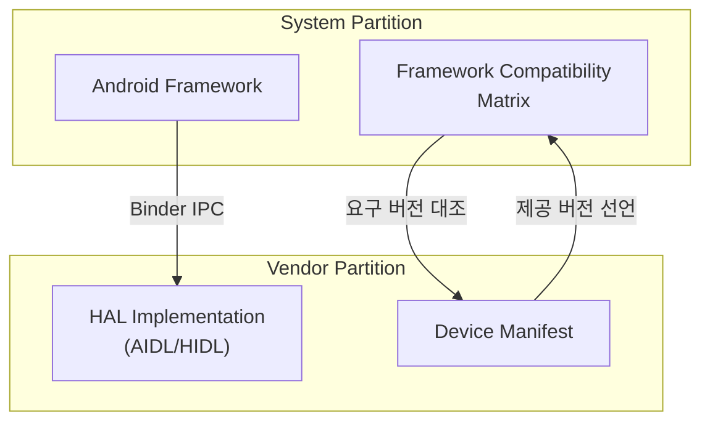

## 이 장을 읽기 전에

이 장은 [03장: 커널 개발](/post/android-hardware-development/kernel-development/)에서 다룬 디바이스 드라이버와 커널 모듈 구조를 전제로 한다. 커널 드라이버가 `/dev` 노드나 `sysfs`를 통해 하드웨어를 노출하는 지점까지 왔다면, 이 장은 그 지점부터 안드로이드 프레임워크까지 값을 안전하게 끌어올리는 계층을 다룬다. 난이도는 중급~전문가 범위이며, HIDL 문법의 세부 항목(모든 타입 키워드, `extends` 규칙 전체)이나 카메라·오디오처럼 구글이 정의한 특정 HAL의 내부 파이프라인은 다루지 않는다. 이런 세부 내용은 각 하드웨어 도메인을 다루는 이후 챕터(그래픽·미디어 파이프라인, 시스템 서비스 통합)에서 필요할 때 참조하는 편이 낫다. 이 장의 목표는 특정 HAL의 API를 암기하는 것이 아니라, "왜 Legacy HAL에서 HIDL로, 다시 AIDL로 옮겨갔는가"라는 설계 변화의 이유와 "VINTF가 무엇을 보장하는가"라는 계약의 본질을 이해하는 것이다.

| 수준 | 읽을 부분 | 핵심 목표 |
|:--:|:--|:--|
| 중급자 | 핵심 개념, 비교/트레이드오프, 실전 적용의 앞부분(인터페이스 정의~서비스 구현) | Legacy HAL과 Treble 이후 HAL의 구조적 차이, HIDL·AIDL 인터페이스를 읽고 쓰는 기본기를 익힌다 |
| 실무자·전문가 | 실전 적용의 뒷부분(VINTF 매니페스트~VTS), 흔한 오개념, 비판적 시각 | VINTF 호환성 매트릭스가 실제 OTA에서 어떻게 검증을 막는지, 언제 HIDL 유산 코드를 유지하고 언제 AIDL로 전환해야 하는지 판단 기준을 세운다 |

## 왜 HAL 경계가 갤럭시급 제품의 생명선인가

안드로이드 하드웨어 제품을 만드는 조직은 대개 두 개의 서로 다른 릴리스 주기를 동시에 다뤄야 한다. 구글은 매년 새 프레임워크를 배포하고, 칩셋 벤더(퀄컴, 미디어텍 등)와 제조사는 훨씬 느린 주기로 드라이버와 하드웨어 종속 로직을 유지보수한다. 이 두 주기가 하나의 이미지에 뒤섞여 있으면, 프레임워크를 업그레이드할 때마다 벤더 코드 전체를 다시 빌드하고 재인증해야 하는 상황이 반복된다. 실제로 안드로이드 7 이전에는 프레임워크와 벤더 코드가 하나의 모놀리식 시스템 이미지로 컴파일되었고, 이 때문에 제조사가 OS 업데이트를 배포하려면 칩셋 벤더로부터 새 바이너리 드라이버 스택을 다시 받아 통합하는 과정을 거쳐야 했다. 이는 안드로이드 생태계에서 "파편화(fragmentation)"라 불리는 문제의 핵심 원인 중 하나였다.

하드웨어 추상화 계층(HAL)은 이 두 세계를 가르는 경계선이다. HAL이 잘 설계되어 있으면 프레임워크 팀은 벤더 구현의 내부를 몰라도 되고, 벤더 팀은 프레임워크의 상세 구현이 바뀌어도 인터페이스 계약만 지키면 자신의 드라이버 스택을 유지할 수 있다. 이 장에서 다루는 Legacy HAL, HIDL, AIDL, VINTF는 모두 이 경계선을 어떻게 그릴 것인가에 대한 서로 다른 시대의 답이다. 갤럭시급 제품처럼 프레임워크 팀과 칩셋 벤더가 물리적으로 분리된 조직에서 협업하는 경우, 이 경계선의 설계 품질이 곧 업데이트 속도와 보안 패치 적용 속도를 결정한다.

## 핵심 개념

### Legacy HAL: 프로세스 내부에 살던 시절

**Legacy HAL(레거시 HAL)**은 안드로이드 8(Oreo) 이전까지 사용되던 방식으로, HAL 구현체가 `.so` 공유 라이브러리 형태로 컴파일되어 이를 호출하는 프레임워크 프로세스(주로 시스템 서버나 미디어 서버) 안에 `dlopen()`으로 직접 로드되는 구조다. 인터페이스는 `hardware/libhardware/include/hardware/hardware.h`에 정의된 `hw_module_t`와 `hw_device_t`라는 공용 C 구조체를 통해 표현되었고, 각 HAL 모듈은 이 구조체에 자신의 함수 포인터를 채워 넣는 방식으로 동작했다. 프로세스 경계가 없다는 것은 곧 호출 오버헤드가 거의 없다는 뜻이지만, 동시에 벤더 코드에 버그가 있으면 프레임워크 프로세스 전체가 함께 죽는다는 뜻이기도 하다.

더 근본적인 문제는 버전 관리였다. `hw_module_t`에는 명시적인 인터페이스 버전 필드가 있었지만, 실제 호환성은 헤더 파일을 공유 컴파일 단위로 함께 빌드하는 데 의존했다. 프레임워크가 구조체 필드 순서를 바꾸거나 함수 시그니처를 수정하면, 그 헤더로 컴파일된 모든 벤더 `.so`를 다시 빌드하지 않는 한 미정의 동작이 발생했다. 이 결합은 시스템 이미지와 벤더 이미지를 분리해서 독립적으로 업데이트하는 것을 사실상 불가능하게 만들었다.

### Project Treble과 HIDL: 프로세스 경계로 계약을 강제하다

구글은 안드로이드 8에서 **Project Treble(프로젝트 트레블)**을 도입해 시스템 이미지와 벤더 이미지를 물리적으로 분리했다. 기기는 `/system` 파티션(프레임워크)과 `/vendor` 파티션(HAL 구현, 드라이버 연동 코드)으로 나뉘고, 두 파티션은 서로 다른 팀이 서로 다른 일정으로 빌드·배포할 수 있게 되었다. 이 분리가 실제로 동작하려면 두 파티션 사이의 통신이 언어 수준의 헤더 공유가 아니라, 프로세스 경계를 넘나드는 **원격 프로시저 호출(RPC, Remote Procedure Call)**로 이루어져야 했다. 이를 위해 구글은 **HIDL(HAL Interface Definition Language)**이라는 인터페이스 정의 언어를 만들었다.

HIDL로 작성한 `.hal` 파일은 인터페이스의 메서드 시그니처와 데이터 타입을 언어 중립적으로 선언하며, `hidl-gen` 컴파일러가 이를 C++(또는 Java) 프록시/스텁 코드로 변환한다. HIDL 인터페이스는 두 가지 방식으로 호출될 수 있다. **바인더화(Binderized) 모드**는 클라이언트와 서버가 서로 다른 프로세스에서 Binder IPC를 통해 통신하며, **패스스루(Passthrough) 모드**는 과거 Legacy HAL과의 호환을 위해 같은 프로세스 안에서 라이브러리를 직접 로드하는 방식을 유지한다. HIDL의 핵심 기여는 인터페이스에 `@1.0`, `@2.1`처럼 명시적 버전을 부여하고, 하위 버전 인터페이스를 `extends`로 확장하는 규칙을 강제함으로써 "프레임워크가 재컴파일 없이 오래된 벤더 HAL과도 통신할 수 있다"는 안정된 ABI(응용 프로그램 바이너리 인터페이스)를 제공한 것이다.

다음은 조도 센서를 감싸는 최소한의 HIDL 인터페이스 정의다. 실제 조명 관련 HIDL 인터페이스는 더 많은 메서드를 갖지만, 여기서는 구조를 보여주는 데 집중한다.

```java
// hardware/interfaces/light/2.0/ILight.hal (구조 예시, 실제 AOSP 트리 축약본)
package android.hardware.light@2.0;

import ILight;

interface ILight {
    /**
     * 지정한 논리 조명(Type)의 상태를 설정한다.
     * @return status OK면 성공, 지원하지 않는 Type이면 LIGHT_NOT_SUPPORTED.
     */
    setLight(Type type, LightState state) generates (Status status);

    /**
     * 이 HAL 구현이 지원하는 조명 종류 목록을 반환한다.
     */
    getSupportedTypes() generates (vec<Type> types);
};
```

`vec<Type>`은 HIDL이 제공하는 가변 길이 배열 타입이며, `generates` 절은 이 메서드가 동기 호출임을 나타내고 반환값을 명시한다. 이 파일 하나로부터 `hidl-gen`은 클라이언트가 사용할 프록시 클래스와, 벤더가 구현해야 할 스텁 베이스 클래스를 자동 생성한다. 구글은 안드로이드 10부터 HIDL을 더 이상 신규 개발 대상으로 권장하지 않는다고 밝혔으며, 이후 신규 HAL은 AIDL로 작성하도록 전환을 유도했다.

### AIDL HAL: 하나의 IPC 언어로 수렴하다

안드로이드 프레임워크는 이미 오래전부터 앱과 시스템 서비스 사이의 통신에 **AIDL(Android Interface Definition Language)**을 사용해왔다. HIDL이 HAL 전용으로 별도 설계된 언어였던 반면, 안드로이드 11부터는 AIDL 자체를 확장해 HAL 계층에서도 사용할 수 있게 만들었다. 이렇게 되면 개발자가 배워야 할 IPC 언어가 하나로 줄고, 프레임워크와 HAL 양쪽에서 같은 디버깅 도구(`dumpsys`, `service list` 등)와 같은 코드 생성 파이프라인을 재사용할 수 있다는 실질적 이점이 생긴다.

HAL에서 사용하는 AIDL 인터페이스는 반드시 **안정화 AIDL(Stable AIDL)**이어야 하며, 인터페이스 선언에 `@VintfStability` 애노테이션을 붙여야 한다. 이 애노테이션은 "이 인터페이스는 시스템과 벤더 파티션을 넘나드는 안정된 계약이므로, 필드를 함부로 재배치하거나 삭제할 수 없다"는 것을 컴파일 시점에 강제하는 장치다. AIDL은 HIDL과 달리 인터페이스 자체에 버전 번호를 파일명에 새기지 않는 대신, 인터페이스 정의에 대한 스냅숏(`aidl_api` 디렉터리)을 축적하며 하위 호환성을 자동으로 검사한다. 벤더 파티션의 C++ 구현체는 레거시 `libbinder` 대신 `libbinder_ndk`(안정화된 NDK 바인딩)를 사용해야 하는데, 이는 시스템 이미지의 `libbinder` 내부 구현이 바뀌더라도 벤더 바이너리가 ABI 호환성을 잃지 않게 하기 위해서다.

```java
// hardware/interfaces/light/aidl/android/hardware/light/ILights.aidl (구조 예시)
package android.hardware.light;

import android.hardware.light.HwLight;
import android.hardware.light.HwLightState;

@VintfStability
interface ILights {
    void setLightState(int id, in HwLightState state);
    HwLight[] getLights();
}
```

두 정의를 나란히 보면, `vec<Type>`이 `HwLight[]`로, `generates` 절이 일반적인 반환 타입 표기로 바뀐 것을 알 수 있다. 이는 AIDL이 안드로이드 프레임워크 전반에서 이미 익숙한 문법을 그대로 재사용한다는 것을 보여주는 지점이다. `in` 키워드는 이 매개변수가 호출자에서 피호출자 방향으로만 전달됨을 명시하는데, AIDL은 `in`/`out`/`inout` 방향성을 문법으로 강제해 HIDL보다 매개변수 전달 의도를 더 명확히 드러낸다.

### VINTF: 매니페스트와 호환성 매트릭스의 계약

HIDL과 AIDL이 "인터페이스를 어떻게 정의하고 호출하는가"에 대한 답이라면, **VINTF(Vendor Interface, 벤더 인터페이스 객체)**는 "이 기기에서 시스템 이미지와 벤더 이미지의 조합이 실제로 서로 맞는가"를 검증하는 계약 계층이다. VINTF는 네 종류의 XML 문서로 구성된다. 벤더 파티션은 자신이 제공하는 HAL 목록과 버전을 **디바이스 매니페스트(Device Manifest)**에 선언하고, 시스템 파티션은 자신이 요구하는 최소 조건을 **프레임워크 호환성 매트릭스(Framework Compatibility Matrix)**에 선언한다. 반대 방향으로는 시스템이 제공하는 서비스를 **프레임워크 매니페스트(Framework Manifest)**가, 벤더가 요구하는 조건을 **디바이스 호환성 매트릭스(Device Compatibility Matrix)**가 각각 선언한다.

기기가 부팅하거나 OTA 업데이트를 적용하기 직전, `libvintf`는 이 네 문서를 상호 대조해 "매니페스트가 선언한 것이 상대편 매트릭스가 요구하는 조건을 만족하는가"를 검사한다. 예를 들어 프레임워크 호환성 매트릭스가 `android.hardware.light` 인터페이스의 특정 버전 이상을 요구하는데 디바이스 매니페스트에 그보다 낮은 버전만 선언되어 있다면, 검증은 실패하고 OTA는 적용되지 않는다. 이 메커니즘 덕분에 제조사는 "이 프레임워크 업데이트가 우리 벤더 이미지와 호환되는가"를 실제 기기에 배포하기 전, 빌드 시점에 `checkvintf` 같은 도구로 미리 검증할 수 있다.



이 다이어그램에서 "Binder IPC" 화살표는 런타임 호출 경로를, "요구 버전 대조"·"제공 버전 선언" 화살표는 부팅·OTA 시점에 이루어지는 정적 검증 경로를 나타낸다. 두 경로를 구분해서 이해하는 것이 중요한데, VINTF 검증을 통과했다고 해서 런타임 호출이 항상 성공한다는 뜻은 아니며(예: 서비스가 크래시한 경우), 반대로 런타임 호출이 지금 당장 성공한다고 해서 다음 OTA에서도 매니페스트 조건을 계속 만족한다는 보장도 아니다.

## Legacy HAL, HIDL, AIDL 비교와 선택 기준

세 방식은 같은 문제(하드웨어 종속 코드를 프레임워크로부터 분리하는 것)를 서로 다른 시기의 제약 속에서 풀었기 때문에, 프로세스 모델과 버전 관리 방식에서 뚜렷한 차이를 보인다. 아래 표는 실무에서 가장 먼저 부딪히는 네 가지 축을 기준으로 정리한 것이다.

| 항목 | Legacy HAL | HIDL HAL | AIDL HAL |
|---|---|---|---|
| 프로세스 모델 | 호출자 프로세스에 `dlopen`으로 로드 (동일 프로세스) | 바인더화(별도 프로세스) 또는 패스스루(동일 프로세스) 선택 가능 | 원칙적으로 별도 프로세스, Binder IPC |
| 인터페이스 정의 | 공용 C 헤더(`hw_module_t`) 수동 관리 | `.hal` 파일 + `hidl-gen` 코드 생성 | `.aidl` 파일 + `aidl` 컴파일러, `@VintfStability` 필수 |
| 버전 관리 | 헤더 공유 컴파일에 의존, 명시적 ABI 보장 없음 | 파일명에 `@X.Y` 버전 명시, `extends`로 확장 | `aidl_api` 스냅숏으로 하위 호환성 자동 검사 |
| Android 지원 상태 | Android 8 이전 표준, 이후 레거시 유지보수 대상 | Android 8에서 도입, Android 10부터 신규 개발 비권장(구현에 따라 유지보수 형태로 잔존) | Android 11부터 HAL 용도로 도입, Android 13부터 신규 HAL 기본 권장 |

이 표에서 실무적으로 가장 중요한 판단 지점은 "새 HAL을 지금 시작한다면 무엇을 쓸 것인가"와 "기존 HIDL HAL을 언제 AIDL로 전환할 것인가"이다. 신규 개발이라면 AIDL을 기본값으로 삼는 것이 합리적이다. 프레임워크 쪽 도구 체인과 문서화가 AIDL을 중심으로 갱신되고 있고, IPC 언어를 하나로 통일하면 팀 내 학습 비용도 줄어든다. 반면 이미 검증을 마치고 필드에 배포된 HIDL HAL을 무리하게 AIDL로 전환하는 것은, 그 자체로 회귀 리스크를 만드는 작업이라는 점을 인식해야 한다. 구글이 제공하는 `hidl2aidl` 변환 도구는 기계적인 시그니처 변환은 도와주지만, VTS 테스트를 다시 통과시키고 SELinux 정책·VINTF 매니페스트를 함께 갱신하는 작업은 여전히 사람이 검증해야 한다. Legacy HAL은 신규 설계에서는 선택지가 아니며, 오직 아주 오래된 칩셋 벤더 코드를 유지보수해야 하는 레거시 상황에서만 마주치게 된다.

## 실전 적용: 커스텀 AIDL HAL 작성 흐름

이제 벤더 엔지니어가 자체 LED 컨트롤러 칩을 위한 커스텀 HAL을 처음부터 만드는 시나리오를 따라가 본다. 커널 드라이버는 이미 `/sys/class/leds/example_led/brightness` 같은 sysfs 노드를 통해 밝기 값을 읽고 쓸 수 있다고 가정한다(이 드라이버 자체는 [03장: 커널 개발](/post/android-hardware-development/kernel-development/)에서 다룬 캐릭터/플랫폼 드라이버 패턴을 따른다). 목표는 이 sysfs 노드를 프레임워크가 Binder로 호출할 수 있는 AIDL HAL로 감싸는 것이다.

첫 단계는 인터페이스 계약을 정의하는 것이다. AOSP 관례상 벤더 고유 HAL은 `vendor/<제조사>/interfaces/<도메인>/aidl/` 아래에 패키지를 두고, `@VintfStability`로 안정성을 표시한다.

```java
// vendor/example/interfaces/led/aidl/com/example/hardware/led/ILed.aidl
package com.example.hardware.led;

@VintfStability
interface ILed {
    /** id로 지정한 LED의 밝기를 0~255 범위로 설정한다. */
    void setBrightness(in int id, in int brightness);

    /** id로 지정한 LED가 지원하는 최대 밝기 값을 반환한다. */
    int getMaxBrightness(in int id);
}
```

이 인터페이스를 빌드 그래프에 연결하려면 `Android.bp`에 `aidl_interface` 모듈을 선언해야 한다. `stability: "vintf"` 필드는 컴파일러에게 이 인터페이스가 VINTF 매니페스트에 등록되어야 하는 안정 인터페이스임을 알려주며, 이 필드가 없으면 `@VintfStability` 애노테이션과 불일치해 빌드가 실패한다.

```text
// vendor/example/interfaces/led/aidl/Android.bp (개념 구조, 실제 필드는 AOSP 버전에 따라 다를 수 있음)
aidl_interface {
    name: "com.example.hardware.led",
    vendor_available: true,
    srcs: ["com/example/hardware/led/*.aidl"],
    stability: "vintf",
    backend: {
        cpp: { enabled: false },
        java: { enabled: false },
        ndk: { enabled: true, vendor_available: true },
    },
}
```

인터페이스가 준비되면 벤더 파티션에서 실행될 서비스 구현체를 작성한다. 벤더 코드는 시스템 `libbinder`가 아니라 안정화된 NDK 바인딩(`libbinder_ndk`)을 사용해야 하므로, 베이스 클래스는 `aidl` 컴파일러가 생성한 `BnLed`(NDK 백엔드의 서버 스텁)를 상속한다.

```cpp
// vendor/example/led/Led.h
#pragma once

#include <aidl/com/example/hardware/led/BnLed.h>

namespace aidl::com::example::hardware::led {

class Led : public BnLed {
  public:
    ::ndk::ScopedAStatus setBrightness(int32_t id, int32_t brightness) override;
    ::ndk::ScopedAStatus getMaxBrightness(int32_t id, int32_t* _aidl_return) override;
};

}  // namespace aidl::com::example::hardware::led
```

헤더에서 선언한 두 메서드의 실제 구현은 sysfs 노드에 값을 읽고 쓰는 것으로 귀결된다. 아래 구현은 밝기 값을 0~255 범위로 클램프한 뒤 파일 쓰기 실패를 별도의 서비스 오류로 구분해서 알리는 점에 주목할 필요가 있다.

```cpp
// vendor/example/led/Led.cpp
#include "Led.h"

#include <android-base/file.h>
#include <android-base/logging.h>
#include <algorithm>
#include <string>

namespace aidl::com::example::hardware::led {

static constexpr int kMaxBrightness = 255;
static constexpr const char* kBrightnessPath = "/sys/class/leds/example_led/brightness";

::ndk::ScopedAStatus Led::setBrightness(int32_t id, int32_t brightness) {
    if (id != 0) {
        return ::ndk::ScopedAStatus::fromExceptionCode(EX_ILLEGAL_ARGUMENT);
    }
    int32_t clamped = std::clamp(brightness, 0, kMaxBrightness);
    if (!::android::base::WriteStringToFile(std::to_string(clamped), kBrightnessPath)) {
        LOG(ERROR) << "sysfs 밝기 노드 쓰기 실패: " << kBrightnessPath;
        return ::ndk::ScopedAStatus::fromServiceSpecificError(EIO);
    }
    return ::ndk::ScopedAStatus::ok();
}

::ndk::ScopedAStatus Led::getMaxBrightness(int32_t id, int32_t* _aidl_return) {
    if (id != 0) {
        return ::ndk::ScopedAStatus::fromExceptionCode(EX_ILLEGAL_ARGUMENT);
    }
    *_aidl_return = kMaxBrightness;
    return ::ndk::ScopedAStatus::ok();
}

}  // namespace aidl::com::example::hardware::led
```

이 구현체에서 눈여겨봐야 할 부분은 반환 타입이 단순한 `bool`이나 `int`가 아니라 `ndk::ScopedAStatus`라는 점이다. Binder 호출은 프로세스 경계를 넘는 원격 호출이므로, "값이 잘못되었다"는 로직 오류와 "상대 프로세스가 죽어서 호출 자체가 실패했다"는 통신 오류를 구분해서 호출자에게 전달해야 한다. `fromExceptionCode`와 `fromServiceSpecificError`는 각각 표준 예외 코드와 서비스 고유 오류 코드를 구분해 전달하는 통로이며, 이 구분을 프레임워크 쪽 클라이언트가 `catch` 블록에서 활용한다.

서비스 구현이 끝나면 이를 실제 데몬 프로세스로 띄우고 서비스 관리자(`servicemanager`)에 등록하는 진입점이 필요하다. `AServiceManager_addService`에 넘기는 인스턴스 이름은 뒤에서 다룰 VINTF 매니페스트의 `<instance>` 값과 정확히 일치해야 한다.

```cpp
// vendor/example/led/main.cpp
#include <android-base/logging.h>
#include <android/binder_ibinder.h>
#include <android/binder_manager.h>
#include <android/binder_process.h>

#include "Led.h"

using aidl::com::example::hardware::led::Led;

int main() {
    ABinderProcess_setThreadPoolMaxThreadCount(0);

    auto led = ndk::SharedRefBase::make<Led>();
    const std::string instance = std::string(Led::descriptor) + "/default";
    binder_status_t status =
        AServiceManager_addService(led->asBinder().get(), instance.c_str());
    CHECK_EQ(status, STATUS_OK) << "LED HAL 서비스 등록 실패: " << instance;

    ABinderProcess_joinThreadPool();
    return EXIT_FAILURE;  // joinThreadPool은 정상적으로는 반환하지 않는다
}
```

이 데몬이 시스템 부팅 시 실제로 기동되려면 `init` 프로세스가 관리하는 rc 스크립트에 서비스로 등록해야 한다. `class hal`은 HAL 데몬 전용 부팅 클래스이며, `user`/`group`은 이 프로세스가 sysfs LED 노드에 접근할 수 있는 최소 권한 계정으로 지정한다.

```text
# vendor/example/led/led-default.rc
service vendor.led-default /vendor/bin/hw/com.example.hardware.led-service
    class hal
    user system
    group system
```

서비스가 등록되어 있어도, VINTF 검증을 통과하지 못하면 이 인터페이스는 "존재하지만 프레임워크가 신뢰하지 않는" 상태로 남는다. 벤더 파티션의 디바이스 매니페스트에 이 인터페이스와 인스턴스를 선언해야 검증이 통과된다.

```xml
<!-- vendor/example/led/led-default.xml -->
<manifest version="1.0" type="device">
    <hal format="aidl">
        <name>com.example.hardware.led</name>
        <version>1</version>
        <fqname>ILed/default</fqname>
    </hal>
</manifest>
```

여기까지가 순수한 IPC·바이너리 계층의 구성이지만, 안드로이드는 기본적으로 강제 접근 제어(MAC) 모델인 SELinux를 통해 Binder 호출조차 정책으로 제한한다. 새 HAL 서비스를 추가하면 `service_contexts`에 서비스 이름과 SELinux 타입을 매핑하고, 그 타입에 대해 어떤 도메인이 `find`/`call` 권한을 갖는지 `.te` 파일로 선언해야 한다. 이 단계를 빠뜨리면 서비스는 정상 등록되고 매니페스트도 통과하지만, 실제 호출 시점에 `avc: denied` 로그와 함께 커널이 호출을 거부한다.

```text
# system/sepolicy/vendor/hal_led_default.te (개념 구조)
type hal_led_default, domain;
hal_server_domain(hal_led_default, hal_led)

# system_server 도메인이 이 HAL을 찾고 호출할 수 있도록 허용
allow system_server hal_led_default:binder call;
```

마지막으로, 이 HAL이 실제로 계약을 지키는지는 사람이 눈으로 확인할 수 없는 수준까지 **VTS(Vendor Test Suite)**로 자동 검증해야 한다. VTS 테스트는 AIDL 인터페이스가 선언한 각 메서드를 실제 인스턴스에 대해 호출하고, 반환값과 오류 처리가 계약대로 동작하는지 확인한다.

```cpp
// vendor/example/led/vts/VtsHalLedTargetTest.cpp
#include <aidl/Gtest.h>
#include <aidl/Vintf.h>
#include <aidl/com/example/hardware/led/ILed.h>
#include <android/binder_manager.h>
#include <gtest/gtest.h>

using aidl::com::example::hardware::led::ILed;

class LedAidlTest : public testing::TestWithParam<std::string> {
  protected:
    void SetUp() override {
        led_ = ILed::fromBinder(
            ndk::SpAIBinder(AServiceManager_waitForService(GetParam().c_str())));
        ASSERT_NE(led_, nullptr);
    }
    std::shared_ptr<ILed> led_;
};

TEST_P(LedAidlTest, SetBrightnessWithinRange) {
    int32_t maxBrightness = 0;
    ASSERT_TRUE(led_->getMaxBrightness(0, &maxBrightness).isOk());
    ASSERT_TRUE(led_->setBrightness(0, maxBrightness / 2).isOk());
}

TEST_P(LedAidlTest, RejectsInvalidId) {
    int32_t unused = 0;
    auto status = led_->getMaxBrightness(99, &unused);
    ASSERT_FALSE(status.isOk());
}

GTEST_ALLOW_UNINSTANTIATED_PARAMETERIZED_TEST(LedAidlTest);
INSTANTIATE_TEST_SUITE_P(
    PerInstance, LedAidlTest,
    testing::ValuesIn(android::getAidlHalInstanceNames(ILed::descriptor)),
    android::PrintInstanceNameToString);
```

이 테스트에서 `RejectsInvalidId`처럼 잘못된 입력에 대한 실패 경로를 명시적으로 검증하는 것이 중요하다. VTS는 인증 과정에서 실행되는 필수 테스트 스위트이므로, 정상 경로만 통과하고 오류 처리 경로를 검증하지 않은 HAL은 실제 필드에서 예상치 못한 크래시나 정의되지 않은 동작을 일으키기 쉽다.

## 흔한 오개념

**"HIDL은 이제 완전히 사라졌다"**는 생각은 정확하지 않다. 구글은 신규 HAL 개발에는 AIDL을 사용하도록 권장하고 있지만, 이미 필드에 배포된 다수의 HIDL HAL(특히 오래된 칩셋의 카메라·오디오 계열)은 여전히 유지보수 상태로 남아 있으며, 안드로이드 프레임워크도 당분간 HIDL 클라이언트 호출을 계속 지원한다. "더 이상 신규 채택 대상이 아니다"와 "즉시 제거된다"는 서로 다른 명제이며, 이를 혼동하면 정상 동작 중인 HIDL HAL을 불필요하게 재작성하는 리스크를 만든다.

**"VINTF 검증을 통과하면 HAL이 정상 동작한다는 뜻이다"**도 흔한 착각이다. VINTF는 매니페스트에 선언된 인터페이스 이름·버전·인스턴스가 상대편이 요구하는 조건을 만족하는지를 정적으로 대조할 뿐, 그 인터페이스의 구현이 실제로 올바른 값을 반환하는지는 전혀 검증하지 않는다. 정적 계약 검증(VINTF)과 동적 동작 검증(VTS, 실제 통합 테스트)은 서로 다른 층위의 문제이며, 둘 다 통과해야 비로소 "이 조합이 배포 가능하다"고 말할 수 있다.

**"바인더화 HAL은 항상 패스스루보다 안전하지만 항상 느리다"**는 절반만 맞는 이야기다. 프로세스 경계를 넘는 호출에는 컨텍스트 스위치와 직렬화 비용이 따르므로 단일 호출의 지연 시간(latency)은 늘어나는 경향이 있지만, 그 비용의 크기는 페이로드 크기와 호출 빈도에 크게 좌우된다. 초당 수천 번 호출되는 저지연 경로(예: 센서 배치 이벤트)에서는 이 오버헤드가 실측을 통해 검증되어야 할 사안이지, "느리다/빠르다"를 코드를 보지 않고 단정할 문제가 아니다.

## 비판적 시각

Project Treble이 가져온 시스템/벤더 분리는 업데이트 유연성이라는 뚜렷한 이득을 주었지만, 공짜로 얻어진 것은 아니다. 모든 HAL 호출이 잠재적으로 프로세스 경계를 넘는 IPC가 되면서, 극단적으로 낮은 지연 시간이 요구되는 일부 경로(예: 초저지연 오디오, 고빈도 센서 스트림)에서는 아키텍처가 강제하는 직렬화·컨텍스트 스위치 비용이 실제 병목이 될 수 있다. 이 때문에 일부 벤더는 패스스루 모드나 공유 메모리 기반의 별도 채널(예: 센서 데이터의 FMQ, Fast Message Queue)을 여전히 활용하며, "모든 HAL은 예외 없이 Binder를 통해서만 통신해야 한다"는 원칙을 실무에서는 상황에 맞게 완화한다.

AIDL로의 전환 역시 만능 해법은 아니다. HIDL이 HAL 전용으로 설계되면서 갖췄던 명시적 버전 파일명(`@1.0`, `@2.1`)은 인터페이스 진화 이력을 파일 시스템 구조만으로 파악할 수 있게 해주었지만, AIDL의 `aidl_api` 스냅숏 방식은 이 이력을 별도 디렉터리 안에 축적된 파일들로 추적해야 해서 가독성 면에서는 다른 트레이드오프를 만든다. 또한 AIDL이 원래 앱-프레임워크 통신을 염두에 두고 설계된 언어라는 점에서, 커널 드라이버와 밀접하게 맞닿아야 하는 일부 저수준 HAL 시나리오(예: 매우 세밀한 메모리 레이아웃 제어가 필요한 경우)에서는 HIDL이 제공했던 일부 관용구가 자연스럽게 옮겨지지 않는 경우도 보고된다. 결국 HIDL에서 AIDL로의 전환은 "무조건 따라야 할 규칙"이 아니라, 신규 개발 비용과 기존 검증된 코드의 안정성 사이에서 조직이 내리는 트레이드오프 판단이라는 점을 기억해야 한다.

## 다음 장에서는

[05장: 시스템 서비스 개발](/post/android-hardware-development/system-services/)에서는 이 장에서 정의한 HAL 인터페이스를 프레임워크 쪽에서 소비하는 시스템 서비스를 어떻게 설계하고 구현하는지 다룬다.

## 평가 기준

- [ ] Legacy HAL이 프로세스 내부 로딩 방식이었던 이유와, 그 방식이 만든 버전 관리 문제를 설명할 수 있다.
- [ ] Project Treble이 시스템/벤더 파티션을 분리하기 위해 HIDL이라는 RPC 기반 IDL을 도입한 이유를 설명할 수 있다.
- [ ] HIDL과 AIDL HAL의 차이를 프로세스 모델, 버전 관리, `@VintfStability` 애노테이션을 기준으로 비교할 수 있다.
- [ ] VINTF의 매니페스트와 호환성 매트릭스가 각각 무엇을 선언하며, 이 둘의 대조가 왜 OTA 안전성과 직결되는지 설명할 수 있다.
- [ ] 커스텀 AIDL HAL을 만들 때 인터페이스 정의부터 서비스 등록, VINTF 매니페스트, SELinux 정책, VTS 테스트까지 필요한 전체 단계를 나열할 수 있다.
- [ ] VINTF 검증 통과와 VTS 테스트 통과가 서로 다른 층위의 검증이라는 점을 구분해서 설명할 수 있다.

## 참고 및 출처

- Android Open Source Project. "Hardware abstraction layer (HAL) overview." *source.android.com*, https://source.android.com/docs/core/architecture/hal
- Android Open Source Project. "HIDL." *source.android.com*, https://source.android.com/docs/core/architecture/hidl
- Android Open Source Project. "AIDL for HALs." *source.android.com*, https://source.android.com/docs/core/architecture/aidl/aidl-hals
- Android Open Source Project. "Vendor Interface Object (VINTF)." *source.android.com*, https://source.android.com/docs/core/architecture/vintf
