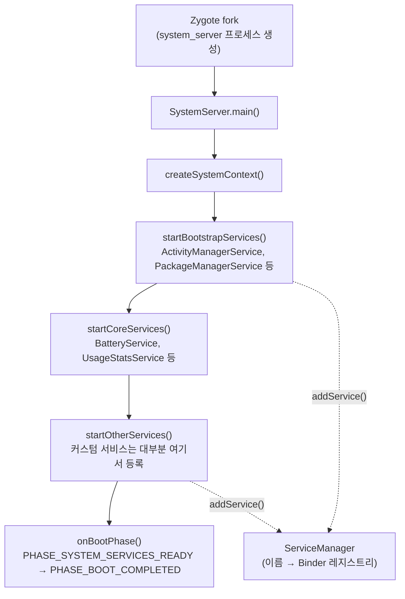

## 이 장을 읽기 전에

이 장은 [04장: 하드웨어 추상화 계층(HAL) 개발](/post/android-hardware-development/hal-development/)에서 다룬 HAL과 Binder IPC의 기초 위에 서 있다. HAL이 "커널 드라이버를 어떻게 프레임워크에 노출할 것인가"를 다뤘다면, 이 장은 그렇게 노출된 기능을 "프레임워크 내부에서 어떤 프로세스가, 어떤 이름으로, 어떤 권한 체계 아래 서비스로 관리하는가"를 다룬다. HIDL/AIDL의 마샬링·언마샬링 세부 구현이나 Binder 드라이버 자체의 커널 동작은 04장에서 다룬 내용을 전제하며, 여기서는 다시 설명하지 않는다.

이 장의 난이도는 중급에서 고급까지다. Java/Kotlin으로 안드로이드 앱을 개발해 본 경험이 있고 Binder·AIDL이라는 용어를 한 번쯤 접해봤다면 전체 내용을 따라갈 수 있다. 반면 SystemServer의 부팅 단계별 의존성 순서, SELinux 정책과의 상호작용, PackageManagerService의 락 경합 완화 구조 같은 절은 AOSP 소스 트리를 직접 열어본 경험이 있는 독자를 염두에 두고 썼다.

이 장이 다루지 않는 것도 명확히 해 둔다. WindowManagerService·SurfaceFlinger로 대표되는 그래픽 파이프라인은 이 컬렉션의 그래픽·미디어 관련 챕터에서 별도로 다룬다. 시스템 서비스가 노출한 API를 "앱 개발자 입장에서 어떻게 소비하는가"는 애플리케이션 개발 챕터의 범위이며, 이 장은 반대로 "그 API를 시스템 쪽에서 어떻게 설계·등록·보호하는가"에 집중한다. 프레임워크 리소스 오버레이(RRO), `SystemUI` 커스터마이징처럼 시스템 서비스 위에 올라가는 UI/정책 커스터마이징은 [06장: 프레임워크 커스터마이징](/post/android-hardware-development/framework-customization/)에서 이어진다.

| 수준 | 읽을 부분 | 핵심 목표 |
|:--:|:--|:--|
| 중급(앱 개발 경험자) | 도입, 핵심 개념 전체, 비교와 트레이드오프 | SystemServer·ServiceManager·AIDL이 서로 어떤 역할을 나누어 맡는지 설명할 수 있다 |
| 고급(플랫폼/벤더 개발자) | 실전 적용, 흔한 오개념, 비판적 시각 | 커스텀 시스템 서비스를 실제로 SystemServer에 등록하고, 그 설계가 초래하는 부팅 시간·안정성 트레이드오프를 판단할 수 있다 |

## 왜 "시스템 서비스"라는 별도 계층이 필요한가

안드로이드 앱은 카메라를 열거나, 위치를 조회하거나, 알림을 띄울 때 해당 하드웨어나 자원을 직접 제어하지 않는다. 모든 요청은 `Context.getSystemService()`를 거쳐 특정 프로세스에 상주하는 객체에게 위임되고, 그 객체가 실제 자원 접근·정책 판단·다른 앱과의 조율을 수행한다. 이 위임 구조가 필요한 이유는 단순하다 — 카메라나 위치 센서 같은 자원은 여러 앱이 동시에 요청할 수 있는 공유 자원이고, 누가 언제 얼마나 접근할 수 있는지에 대한 중재자가 없으면 한 앱이 자원을 독점하거나 서로 충돌하는 상태를 만들 수 있다. 시스템 서비스는 이 중재자 역할을 하는 프로세스 내 객체이며, 대부분 `system_server`라는 하나의 프로세스 안에서 함께 산다.

이 위임 구조를 가능하게 하는 것이 Binder IPC다. 안드로이드 프레임워크의 시스템 서비스 대부분은 앱과는 별도 프로세스(`system_server`)에서 실행되므로, 앱이 시스템 서비스의 메서드를 "호출"하는 것처럼 보이는 코드는 실제로는 프로세스 경계를 넘는 원격 프로시저 호출(RPC)이다. 이 장은 그 RPC가 실제로 어떻게 조립되는지 — 어떤 프로세스가 부팅 시 무슨 순서로 서비스를 만들고, 어떤 레지스트리에 등록하며, 클라이언트가 어떤 인터페이스 정의를 통해 그 서비스를 찾아 호출하는지 — 를 SystemServer 부팅 흐름, ServiceManager, AIDL이라는 세 축으로 나누어 설명한다.

## SystemServer 부팅 흐름

**SystemServer(시스템서버)**는 안드로이드 프레임워크가 제공하는 대부분의 시스템 서비스를 하나의 프로세스 안에서 순차적으로 생성·초기화하는 진입점 클래스다(`frameworks/base/services/java/com/android/server/SystemServer.java`). 부팅 과정에서 `init`이 `zygote`를 기동하면, `zygote`는 `--start-system-server` 플래그로 자기 자신을 포크(fork)해 `system_server` 프로세스를 만들고, 그 자식 프로세스가 `SystemServer.main()`을 실행한다. 이 포크 기반 기동 방식은 다른 안드로이드 프로세스(일반 앱 프로세스 포함)와 동일한 원리를 공유한다 — Zygote가 이미 로드해 둔 프레임워크 클래스와 공유 메모리 페이지를 물려받아, 매번 처음부터 클래스를 로딩하는 것보다 기동 시간을 줄인다.

`SystemServer.main()`이 실행된 뒤 서비스들은 아무렇게나 초기화되지 않는다. 서비스 간에는 암묵적인 의존 관계가 있다 — 예를 들어 대부분의 서비스는 초기화 과정에서 `PackageManagerService`가 이미 패키지 목록을 스캔해 두었다고 가정하고, `PackageManagerService`는 다시 `installd` 같은 네이티브 데몬이 이미 떠 있다고 가정한다. 이 의존성을 다루기 위해 SystemServer는 서비스를 **부트스트랩(bootstrap)**, **코어(core)**, **기타(other)** 세 단계로 나눠 순차적으로 시작하며, 각 단계 함수(`startBootstrapServices()`, `startCoreServices()`, `startOtherServices()`) 안에서도 서비스 생성 순서가 의존 관계를 반영한다. 커스텀 시스템 서비스는 대부분 이 중 `startOtherServices()` 단계에서 등록되는데, 이 단계에 이르면 `ActivityManagerService`나 `PackageManagerService` 같은 핵심 서비스가 이미 사용 가능한 상태이기 때문이다.

부팅 단계는 서비스 생성 순서만이 아니라 "언제부터 안전하게 다른 서비스를 참조해도 되는가"라는 질문에도 답한다. 각 시스템 서비스는 `SystemService` 기반 클래스를 상속하며, 프레임워크는 부팅이 진행됨에 따라 `onBootPhase(int phase)` 콜백을 여러 차례 호출해 현재 어느 단계인지 알려준다. 예를 들어 `PHASE_SYSTEM_SERVICES_READY`는 핵심 시스템 서비스들이 서로를 참조해도 안전한 시점을, `PHASE_BOOT_COMPLETED`는 사용자 앱이 실행되기 직전 최종 단계를 의미한다. 서비스 생성자에서 다른 서비스를 직접 참조하는 대신 `onBootPhase()` 콜백 안에서 필요한 시점에 참조하는 것이 정석적인 패턴인 이유가 여기에 있다 — 생성 순서와 "사용 가능해지는 순서"가 항상 같지 않기 때문이다.



이 순서 설계에서 반드시 짚어야 할 트레이드오프가 있다. 모든 서비스가 하나의 프로세스, 하나의 메인 스레드 흐름 위에서 순차적으로 초기화되므로, 어느 한 서비스의 초기화가 느리면 그 뒤에 오는 모든 서비스의 기동이 지연되고 결과적으로 전체 부팅 시간이 늘어난다. 커스텀 시스템 서비스를 설계할 때 `onStart()`나 생성자에서 무거운 초기화(디스크 스캔, 네트워크 대기 등)를 수행하지 말아야 하는 이유가 바로 이 순차성에 있다.

## ServiceManager: 이름과 Binder를 잇는 레지스트리

**ServiceManager(서비스매니저)**는 "이 이름의 서비스를 찾고 싶다"는 요청을 받아 해당 서비스의 Binder 참조를 돌려주는 이름 서버(name server)다. 네이티브 레벨에서는 `/system/bin/servicemanager`라는 별도 프로세스가 이 역할을 수행하며, Binder 드라이버 안에서 특별한 위치(컨텍스트 매니저)를 차지한다 — 모든 Binder 클라이언트는 어떤 서비스를 찾기 위해 가장 먼저 이 프로세스에게 물어봐야 하므로, ServiceManager 자신은 다른 서비스처럼 "찾아서" 접근하는 대상이 아니라 Binder 통신의 출발점 역할을 한다.

서비스를 제공하는 쪽(서버)은 `addService(name, binder)`로 자신의 Binder 객체를 등록하고, 서비스를 사용하는 쪽(클라이언트)은 `getService(name)`으로 그 이름에 해당하는 Binder 참조를 얻는다. 이 등록·조회 흐름은 Java 프레임워크의 `android.os.ServiceManager`와 네이티브의 `IServiceManager`가 각각 감싸고 있지만, 근본적으로는 같은 Binder 드라이버 메커니즘 위에서 동작한다. 아래는 네이티브 프로세스가 자신의 Binder 서비스를 ServiceManager에 등록하는 전형적인 형태다.

```cpp
// 네이티브 데몬이 자신의 Binder 서비스를 ServiceManager에 등록하는 전형적인 형태
#include <binder/IServiceManager.h>
#include <binder/IPCThreadState.h>
#include <binder/ProcessState.h>
#include <utils/StrongPointer.h>

using namespace android;

void registerNativeService(const sp<IBinder>& service) {
    sp<IServiceManager> sm = defaultServiceManager();
    sm->addService(String16("devicemonitor.native"), service);

    // Binder 스레드 풀을 시작하고 현재 스레드를 커맨드 루프에 편입시킨다
    ProcessState::self()->startThreadPool();
    IPCThreadState::self()->joinThreadPool();
}
```

이 코드에서 눈여겨볼 점은 `addService()` 호출 자체가 서비스를 "즉시 누구나 쓸 수 있게" 만들지 않는다는 것이다. Binder 드라이버와 ServiceManager는 등록·조회 시점에 SELinux 정책(`service_manager_type` 컨텍스트, `add`/`find` 권한)을 검사하므로, 정책이 허용하지 않는 프로세스는 애초에 `addService()`가 거부되거나, 등록에는 성공해도 다른 프로세스의 `getService()` 호출이 거부된다. 이 SELinux 계층은 뒤에서 다룰 커스텀 서비스 등록 절차에서 다시 등장한다.

## AIDL: 인터페이스 정의에서 코드 생성까지

**AIDL(Android Interface Definition Language, 안드로이드 인터페이스 정의 언어)**은 프로세스 경계를 넘는 메서드 호출의 시그니처를 선언하기 위한 언어다. 개발자가 `.aidl` 파일에 인터페이스를 선언하면, 빌드 시스템이 그 파일로부터 클라이언트 쪽 프록시(stub proxy)와 서버 쪽 스텁(stub) 코드를 자동 생성한다. 이 생성된 코드가 메서드 인자를 `Parcel`에 담아 Binder 드라이버로 전송하고(마샬링), 반대편에서 그 `Parcel`을 원래 타입으로 복원하는(언마샬링) 반복 작업을 대신 처리해 준다. AIDL이 해결하는 문제는 "프로세스 간 호출을 프로세스 내 호출처럼 보이게 만드는 것"이지, "이 인터페이스가 시스템 서비스인지 아닌지"를 결정하는 것이 아니다 — 이 구분은 뒤에서 다룰 오개념 중 하나다.

AIDL 인터페이스는 두 갈래로 쓰인다. 하나는 요청-응답 형태의 일반 인터페이스이고, 다른 하나는 서버가 클라이언트에게 비동기로 이벤트를 통지하기 위한 콜백 인터페이스다. 콜백 인터페이스는 보통 `oneway`로 선언해 호출자가 응답을 기다리지 않고 즉시 반환하도록 만든다 — 그렇지 않으면 서버가 콜백을 호출하는 순간 그 콜백을 처리하는 클라이언트 스레드가 끝날 때까지 서버 스레드가 블록될 수 있다.

```aidl
// IDeviceMonitorService.aidl — 요청-응답 인터페이스
package com.android.server.devicemonitor;

interface IDeviceMonitorService {
    int getThermalStatus();
    float getBatteryTemperature();
    void registerListener(IDeviceMonitorListener listener);
    void unregisterListener(IDeviceMonitorListener listener);
}
```

```aidl
// IDeviceMonitorListener.aidl — 서버가 클라이언트로 이벤트를 밀어 보내는 콜백 인터페이스
package com.android.server.devicemonitor;

oneway interface IDeviceMonitorListener {
    void onThermalStatusChanged(int status);
}
```

AOSP는 시스템 서비스처럼 여러 팀·여러 파티션(system/vendor)에 걸쳐 오래 유지보수되는 인터페이스를 위해 **Stable AIDL**이라는 확장을 제공한다. 일반 AIDL은 클라이언트와 서버가 항상 같은 버전의 인터페이스 정의로 빌드된다는 전제를 깔지만, 시스템 파티션과 벤더 파티션이 독립적으로 업데이트되는 Project Treble 환경에서는 그 전제가 깨질 수 있다. Stable AIDL은 인터페이스에 버전을 부여하고 필드 추가만 허용하는 등 하위 호환 규칙을 강제해, 한쪽 파티션만 업데이트되어도 통신이 깨지지 않게 한다.

## ActivityManagerService와 PackageManagerService의 구조

**ActivityManagerService(AMS)**는 이름과 달리 액티비티 생명주기만 관리하는 서비스가 아니다. AMS의 핵심 책임은 프로세스 관리에 가깝다 — 어떤 프로세스가 살아 있어야 하는지, 메모리 압박 상황에서 어떤 프로세스를 먼저 종료해야 하는지를 `oom_adj`라는 우선순위 점수로 계산해 커널의 저메모리 킬러(low memory killer)에게 힌트를 제공하고, 입력 이벤트나 서비스 콜백이 제때 처리되지 않을 때 ANR(Application Not Responding)을 감지하며, 브로드캐스트를 등록된 수신자들에게 순서대로 전달하는 디스패처 역할도 수행한다. Android 10 전후로는 액티비티·태스크·윈도우와 직접 관련된 책임의 상당 부분이 `ActivityTaskManagerService`로 분리되어, AMS는 프로세스 생명주기·oom_adj 계산·ANR 감지·브로드캐스트 디스패치에 더 집중하는 구조로 재편되는 방향의 리팩터링이 이루어졌다(정확한 분리 시점과 범위는 AOSP 버전별 소스로 확인하는 것이 안전하다).

**PackageManagerService(PMS)**는 기기에 설치된 모든 패키지의 메타데이터(권한, 컴포넌트, 서명, 버전)를 관리하는 서비스로, 흔히 "APK 목록을 담은 데이터베이스" 정도로 오해되지만 실제로는 매 부팅마다(또는 패키지 변경 시) `/system/app`, `/vendor/app`, `/data/app` 등 여러 파티션의 APK를 스캔하고, 서명을 검증하며, 선언된 권한을 실제 권한 그래프에 반영하는 능동적인 스캐너에 가깝다. 이 스캔·검증 비용 때문에 PMS 초기화는 SystemServer 부트스트랩 단계에서 가장 시간이 오래 걸리는 구간 중 하나이며, 다른 많은 서비스가 PMS의 스캔 완료를 전제로 자신의 초기화를 진행한다. PMS는 앱의 `queryIntentActivities()`, `getPackageInfo()` 같은 조회가 매우 빈번하게 호출되는 서비스이기도 해서, 최근 AOSP 계열 구현에서는 전역 락 경합을 줄이기 위해 읽기 전용 스냅샷을 통해 조회를 처리하는 방향의 구조 개선이 이루어지는 추세다 — 구체적인 클래스 이름과 도입 버전은 AOSP 소스 버전에 따라 달라지므로 "읽기와 쓰기 경로를 분리해 락 경합을 줄인다"는 설계 방향만 원칙으로 기억해 두는 것이 안전하다.

AMS와 PMS는 둘 다 SystemServer의 `startBootstrapServices()` 단계에서 가장 먼저 생성되는 서비스군에 속한다. 이는 우연이 아니라 위에서 설명한 의존성 순서의 직접적인 결과다 — 다른 거의 모든 시스템 서비스가 "이 컴포넌트를 실행할 권한이 있는가"(PMS)와 "이 프로세스를 지금 시작해도 되는가"(AMS)를 전제로 동작하기 때문에, 이 둘이 준비되지 않으면 그 뒤의 어떤 서비스도 온전히 기능할 수 없다.

## 비교와 트레이드오프: 어디에 서비스를 둘 것인가

새로운 기능을 시스템 서비스로 노출하려 할 때 실무에서 가장 먼저 부딪히는 결정은 "이 기능을 어느 계층에 둘 것인가"다. 같은 Binder·AIDL 메커니즘 위에서도 서비스가 상주하는 프로세스와 등록 방식에 따라 접근 범위와 부팅 영향이 크게 달라진다.

| 방식 | 등록 위치 | 접근 범위 | 부팅 프로세스 영향 | 대표 예 |
|---|---|---|---|---|
| 네이티브 ServiceManager 직접 등록 | 독립 네이티브 프로세스 (C++ Binder) | 네이티브 프로세스가 우선, Java에서 쓰려면 JNI 브리지 필요 | `system_server`와 별개로 기동되므로 SystemServer 부팅 시간에 직접 가산되지 않음 | `SurfaceFlinger`, `media.audio_flinger` |
| SystemServer 내 SystemService + SystemServiceRegistry | `frameworks/base` (`system_server` 프로세스 내부) | 모든 앱 프로세스에서 `Context.getSystemService()`로 접근 | `system_server` 부팅 시간에 직접 가산됨 | `ActivityManagerService`, `PackageManagerService`, 커스텀 디바이스 서비스 |
| 앱 레벨 bound Service + AIDL | 개별 APK의 `AndroidManifest.xml` | 명시적으로 바인딩을 시도한 클라이언트만 | 시스템 부팅과 무관, 필요할 때 지연 기동(lazy start) | 서드파티 앱 간 IPC, OEM 사전 설치 앱의 백그라운드 서비스 |

이 표가 가리키는 판단 기준은 단순하다. 여러 앱이 공유해야 하는 플랫폼 전역 상태나 정책(권한, 디스플레이, 배터리 등)을 다룬다면 `SystemServer` 내 시스템 서비스가 적합하다 — 앱마다 별도 프로세스를 바인딩할 필요 없이 항상 켜져 있는 단일 진실 공급원(single source of truth)을 얻을 수 있기 때문이다. 반대로 기능이 특정 앱 생태계 안에서만 의미가 있고 시스템 부팅과 무관하게 필요할 때만 떠 있어도 충분하다면, 시스템 서비스로 만드는 것은 과한 선택이다 — 부팅 시간을 늘리고 `system_server`라는 단일 장애점에 새로운 위험을 추가할 뿐, 얻는 이득은 없다. 프레임워크 이전 시점(early boot)부터 필요하거나 네이티브 클라이언트가 압도적으로 많다면 네이티브 ServiceManager 직접 등록이 더 자연스러운 선택이다.

## 실전 적용: 커스텀 시스템 서비스 등록

디바이스의 발열 상태를 조회하고 상태 변화를 구독할 수 있는 `DeviceMonitorService`를 실제로 `system_server`에 등록하는 과정을 단계별로 살펴본다. 이 예제는 04장에서 다룬 HAL이 이미 온도 센서 값을 프레임워크에 노출하고 있다고 가정하고, "그 값을 여러 앱이 공유해서 조회할 수 있게 만드는" 시스템 서비스 계층에 집중한다.

첫 단계는 앞서 정의한 `IDeviceMonitorService.aidl`과 `IDeviceMonitorListener.aidl`을 실제 서비스 구현으로 연결하는 것이다. AOSP에서 시스템 서비스는 `com.android.server.SystemService`를 상속하며, `onStart()`에서 Binder 객체를 게시하고 `onBootPhase()`에서 다른 서비스에 대한 의존성을 안전하게 해소한다.

```java
package com.android.server.devicemonitor;

import android.content.Context;
import android.os.RemoteCallbackList;
import android.os.RemoteException;

import com.android.server.SystemService;

public class DeviceMonitorService extends SystemService {

    private static final String PERMISSION_MONITOR =
            "com.android.server.devicemonitor.permission.MONITOR";

    private final RemoteCallbackList<IDeviceMonitorListener> mListeners =
            new RemoteCallbackList<>();
    private volatile int mThermalStatus = 0;

    public DeviceMonitorService(Context context) {
        super(context);
    }

    @Override
    public void onStart() {
        // Binder 스텁을 ServiceManager에 이름으로 게시한다
        publishBinderService("devicemonitor", new BinderService());
    }

    @Override
    public void onBootPhase(int phase) {
        if (phase == SystemService.PHASE_SYSTEM_SERVICES_READY) {
            // BatteryService 등 다른 부트스트랩 서비스가 준비된 이후에만
            // 안전하게 참조할 수 있으므로 생성자가 아닌 이 시점에 초기화한다
            startThermalPolling();
        }
    }

    private void startThermalPolling() {
        // 실제 구현에서는 04장에서 다룬 온도 센서 HAL 콜백을 등록해
        // mThermalStatus를 갱신하고 dispatchThermalStatusChanged()를 호출한다
    }

    private void dispatchThermalStatusChanged(int status) {
        mThermalStatus = status;
        final int n = mListeners.beginBroadcast();
        for (int i = 0; i < n; i++) {
            try {
                mListeners.getBroadcastItem(i).onThermalStatusChanged(status);
            } catch (RemoteException e) {
                // 죽은 클라이언트는 RemoteCallbackList가 자동으로 정리한다
            }
        }
        mListeners.finishBroadcast();
    }

    private final class BinderService extends IDeviceMonitorService.Stub {
        @Override
        public int getThermalStatus() {
            getContext().enforceCallingPermission(
                    PERMISSION_MONITOR,
                    "getThermalStatus 호출에는 MONITOR 권한이 필요하다");
            return mThermalStatus;
        }

        @Override
        public float getBatteryTemperature() {
            getContext().enforceCallingPermission(
                    PERMISSION_MONITOR,
                    "getBatteryTemperature 호출에는 MONITOR 권한이 필요하다");
            return 0f; // 실제 구현에서는 BatteryService 등을 통해 조회한다
        }

        @Override
        public void registerListener(IDeviceMonitorListener listener) {
            mListeners.register(listener);
        }

        @Override
        public void unregisterListener(IDeviceMonitorListener listener) {
            mListeners.unregister(listener);
        }
    }
}
```

이 구현에서 `enforceCallingPermission()` 호출을 생략해도 코드는 컴파일되고 동작하는 것처럼 보이지만, 그 순간 이 서비스는 서명 권한이 없는 어떤 앱이든 호출할 수 있는 상태가 된다는 점을 짚어 둔다. 시스템 서비스는 앱 서비스보다 훨씬 넓은 권한(하드웨어 접근, 다른 앱 상태 조회)을 갖는 경우가 많으므로, 메서드 진입점마다 권한 검사를 명시하는 것이 관례가 아니라 필수에 가깝다.

두 번째 단계는 이 서비스 클래스를 SystemServer의 기동 순서에 실제로 편입시키는 것이다. `SystemServer.java`의 `startOtherServices()` 안에서 `SystemServiceManager.startService()`를 호출하면, 프레임워크가 생성자 호출부터 `onStart()`/`onBootPhase()` 콜백 디스패치까지 생명주기를 대신 관리해 준다.

```java
// frameworks/base/services/java/com/android/server/SystemServer.java (발췌)
private void startOtherServices(@NonNull TimingsTraceAndSlog t) {
    // ... ActivityManagerService, PackageManagerService 등 앞선 서비스들이 이미 기동된 이후 ...

    t.traceBegin("StartDeviceMonitorService");
    mSystemServiceManager.startService(DeviceMonitorService.class);
    t.traceEnd();

    // ... 나머지 기타 서비스 등록이 이어진다 ...
}
```

세 번째 단계는 이렇게 `system_server` 안에 등록된 서비스를 앱이 `Context.getSystemService()`로 자연스럽게 조회할 수 있도록 Java 프레임워크 쪽 매니저 클래스와 레지스트리 항목을 추가하는 것이다. 앱 프로세스에서 `getSystemService()`가 실제로 하는 일은 `ServiceManager.getService(name)`으로 Binder 참조를 얻고, `IDeviceMonitorService.Stub.asInterface()`로 그 참조를 타입이 있는 프록시로 감싸는 것뿐이다.

```java
// frameworks/base/core/java/android/app/DeviceMonitorManager.java
package android.app;

import android.content.Context;
import android.os.RemoteException;

import com.android.server.devicemonitor.IDeviceMonitorService;

public class DeviceMonitorManager {
    private final Context mContext;
    private final IDeviceMonitorService mService;

    public DeviceMonitorManager(Context context, IDeviceMonitorService service) {
        mContext = context;
        mService = service;
    }

    public int getThermalStatus() {
        try {
            return mService.getThermalStatus();
        } catch (RemoteException e) {
            throw e.rethrowFromSystemServer();
        }
    }
}
```

```java
// frameworks/base/core/java/android/app/SystemServiceRegistry.java (발췌)
registerService(Context.DEVICE_MONITOR_SERVICE, DeviceMonitorManager.class,
        new CachedServiceFetcher<DeviceMonitorManager>() {
            @Override
            public DeviceMonitorManager createService(ContextImpl ctx) {
                IBinder b = ServiceManager.getService(Context.DEVICE_MONITOR_SERVICE);
                IDeviceMonitorService service = IDeviceMonitorService.Stub.asInterface(b);
                return new DeviceMonitorManager(ctx, service);
            }
        });
```

`CachedServiceFetcher`를 쓰는 이유는 매 `getSystemService()` 호출마다 새 매니저 객체를 만들지 않기 위해서다 — 같은 `Context`에서 반복 호출하면 처음 생성된 인스턴스를 재사용한다. 다만 `Context`가 여러 개 존재하는 앱(예: 여러 `Activity`, 서비스, 각기 다른 `Application` 컨텍스트)에서는 각 `Context`마다 별도의 매니저 인스턴스가 캐시된다는 점은 기억해 둘 필요가 있다.

마지막 단계는 권한 정의다. `enforceCallingPermission()`이 검사하는 권한 문자열은 프레임워크 매니페스트(`frameworks/base/core/res/AndroidManifest.xml`)에 `signature` 또는 `signature|privileged` 보호 수준으로 선언되어야 하며, 여기에 더해 SELinux 정책이 `system_server` 도메인과 이 서비스를 호출하는 클라이언트 도메인 사이의 Binder 호출(`binder_call`)을 허용해야 한다.

```xml
<!-- frameworks/base/core/res/AndroidManifest.xml (발췌) -->
<permission android:name="com.android.server.devicemonitor.permission.MONITOR"
    android:protectionLevel="signature|privileged" />
```

이 마지막 단계를 생략하면, 코드는 빌드되고 서비스는 정상적으로 게시되지만 실제 기기에서는 SELinux denial 로그(`avc: denied`)와 함께 호출이 거부된다 — 이는 뒤에서 다룰 흔한 오개념 중 하나와 직접 연결된다.

## 흔한 오개념

**"AIDL로 인터페이스를 정의하면 그 자체로 시스템 서비스가 된다"**는 오해가 가장 흔하다. AIDL은 프로세스 경계를 넘는 호출의 마샬링·언마샬링을 자동화하는 인터페이스 정의 도구일 뿐이며, 같은 AIDL 메커니즘이 시스템 서비스에도, 일반 앱의 bound Service에도, `Messenger` 기반 통신에도 똑같이 쓰인다. 어떤 컴포넌트가 "시스템 서비스"로 불리는 이유는 AIDL을 썼기 때문이 아니라 `system_server` 프로세스 안에서 `SystemService`로 등록되어 부팅 순서에 편입되고 `ServiceManager`에 잘 알려진 이름으로 게시되기 때문이다.

**"ServiceManager에 `addService()`로 등록하면 어떤 앱이든 바로 접근할 수 있다"**는 오해도 실무에서 자주 발목을 잡는다. 등록은 그 서비스가 "존재한다"는 사실을 알리는 것일 뿐, 실제 호출 가능 여부는 (1) SELinux 정책이 호출자 도메인과 `system_server` 도메인 사이의 Binder 호출을 허용하는지, (2) 프레임워크 권한 검사(`enforceCallingPermission()` 등)를 통과하는지에 따라 별도로 결정된다. 위 실전 예제에서 SELinux 정책과 권한 선언을 마지막 단계로 분리해 다룬 이유가 여기에 있다 — 이 두 계층은 AIDL 인터페이스 설계와는 독립적으로 항상 함께 챙겨야 한다.

**"PackageManagerService는 설치된 패키지 정보를 담아 두는 정적 캐시일 뿐이다"**라는 생각도 실제 구현과는 거리가 있다. PMS는 부팅마다(그리고 패키지 설치·삭제 이벤트마다) 여러 파티션의 APK를 다시 스캔하고 서명을 검증하는 능동적인 프로세스이며, 이 스캔 비용이 부팅 시간에서 상당한 비중을 차지하기 때문에 실무에서 부팅 시간을 최적화할 때 PMS의 패키지 스캔 범위와 순서가 흔히 조사 대상이 된다.

## 비판적 시각

시스템 서비스를 `system_server`에 추가하는 결정은 편의성과 안정성 사이의 트레이드오프를 수반한다. 모든 서비스가 하나의 프로세스, 하나의 Zygote 힙 안에서 함께 살기 때문에, 어느 한 서비스에서 처리되지 않은 예외가 발생하면 그 서비스만 죽는 것이 아니라 `system_server` 프로세스 전체가 죽고, 이는 곧 기기 재부팅으로 이어진다. AOSP는 이런 상황을 감지하기 위해 `Watchdog` 메커니즘을 두어 특정 서비스의 락 대기가 지나치게 길어지면 의도적으로 `system_server`를 재시작시키기도 한다 — 즉, 커스텀 서비스 하나의 버그가 기기 전체의 재부팅을 유발할 수 있는 구조라는 뜻이다. 이 위험은 부팅 시간에도 그대로 반영된다. 새 서비스를 `startOtherServices()`에 추가할 때마다 그 초기화 비용이 고스란히 전체 부팅 시간에 더해지므로, 실무에서는 커스텀 서비스의 `onStart()`를 가볍게 유지하고 무거운 작업은 `onBootPhase(PHASE_BOOT_COMPLETED)` 이후나 별도 스레드로 지연시키는 것이 관례로 자리 잡았다.

이런 구조적 위험 때문에, 최근 안드로이드 플랫폼의 방향은 가능한 기능을 거대한 `system_server` 프로세스 안에 밀어 넣기보다는 업데이트 가능한 모듈(Project Mainline, APEX 등)로 분리해 장애 범위와 업데이트 단위를 좁히는 쪽으로 움직이고 있다. 이는 이 장에서 다룬 "SystemServer 안에 새 SystemService를 추가한다"는 패턴이 여전히 유효하고 널리 쓰이지만, 모든 새 기능에 대해 무조건적인 기본 선택지는 아니라는 뜻이기도 하다. 벤더·OEM 입장에서 커스텀 서비스를 추가할 때는 "이 기능이 정말 시스템 전역에서 항상 켜져 있어야 하는가", "장애가 발생했을 때 감내할 수 있는 반경이 `system_server` 전체인가, 아니면 더 좁은 프로세스로 격리해야 하는가"를 먼저 따져보는 편이 안전하다.

## 다음 장에서는

[06장: 프레임워크 커스터마이징](/post/android-hardware-development/framework-customization/)에서는 이 장에서 등록한 시스템 서비스 위에서, 리소스 오버레이와 프레임워크 정책 변경을 통해 안드로이드 UI/UX를 벤더 요구사항에 맞게 조정하는 방법을 다룬다.

## 평가 기준

- [ ] SystemServer가 서비스를 부트스트랩·코어·기타 단계로 나눠 순차 초기화하는 이유를 의존성 관점에서 설명할 수 있다.
- [ ] ServiceManager의 `addService()`/`getService()`가 SELinux 정책·권한 검사와 어떻게 별개의 계층인지 구분할 수 있다.
- [ ] AIDL이 "인터페이스 정의 도구"이지 그 자체로 "시스템 서비스"를 의미하지 않는다는 점을 설명할 수 있다.
- [ ] AMS와 PMS가 각각 프로세스 관리와 패키지 스캔·검증이라는 실제 책임을 맡고 있음을 설명할 수 있다.
- [ ] AIDL 정의부터 `SystemService` 구현, SystemServer 등록, `SystemServiceRegistry` 노출, 권한 선언까지 커스텀 시스템 서비스 등록의 전체 절차를 재현할 수 있다.
- [ ] 시스템 서비스를 `system_server`에 추가하는 것이 부팅 시간과 장애 반경에 미치는 트레이드오프를 판단 기준으로 설명할 수 있다.

## 참고 및 출처

- [Android Open Source Project — System Architecture](https://source.android.com/docs/core/architecture)
- [Android Developers — Android Interface Definition Language (AIDL)](https://developer.android.com/guide/components/aidl)
- [Android Open Source Project — Binder IPC](https://source.android.com/docs/core/architecture/hidl/binder-ipc)
