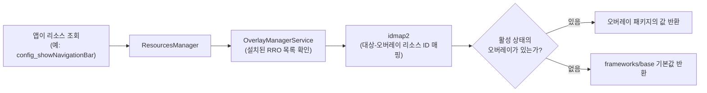

## 이 장을 읽기 전에

이 장은 [05장: 시스템 서비스 개발](/post/android-hardware-development/system-services/)에서 다룬 `SystemServer`의 서비스 부트스트랩 구조와 Binder IPC 모델을 전제로 한다. 커스텀 시스템 서비스를 어떻게 등록하고 클라이언트에 노출하는지 이미 알고 있다면, 이번 장에서 다루는 "프레임워크 리소스와 UI 레이어를 어디까지, 어떤 방식으로 바꿀 것인가"라는 질문에 바로 들어갈 수 있다.

이 장의 난이도는 **중급~전문가**다. 중급 구간에서는 Runtime Resource Overlay(RRO)의 동작 원리와 `config.xml` 오버레이 작성법을 다루고, 전문가 구간에서는 오버레이 정책(`overlayable.xml`)의 제약, SystemUI 플러그인 아키텍처의 보안 모델, 그리고 "언제 프레임워크를 직접 패치해야 하는가"라는 판단까지 다룬다.

이 장이 **다루지 않는 것**도 명확히 해 둔다. 하드웨어 추상화 계층(HAL) 자체를 새로 작성하는 방법은 [04장: 하드웨어 추상화 계층(HAL) 개발](/post/android-hardware-development/hal-development/)에서 다뤘고, 커널 드라이버 수준의 수정은 다음 장인 [07장: 디바이스 드라이버 개발](/post/android-hardware-development/device-drivers/)에서 다룬다. SELinux 정책 튜닝이나 부트로더 서명 체계 같은 보안·부팅 계층의 세부사항, AOSP 빌드 시스템(Soong/Make)의 내부 동작도 이 장의 범위 밖이며, 해당 컬렉션의 뒷부분 챕터에서 별도로 다룬다.

## 당신의 수준에 맞는 경로

| 수준 | 읽을 부분 | 핵심 목표 |
|------|---------|---------|
| 중급자 | 핵심 개념 ~ 커스터마이징 방식 비교 | RRO와 config.xml 오버레이로 리소스를 바꾸는 절차를 이해하고 직접 적용할 수 있다 |
| 고급자 | 실전 적용 ~ 흔한 오개념 | 오버레이 정책 제약을 진단하고, SystemUI 플러그인과 프레임워크 직접 패치의 차이를 설명할 수 있다 |
| 전문가 | 비판적 시각 | 팀의 유지보수 역량과 GSI/Treble 준수 요구에 맞춰 커스터마이징 전략을 설계할 수 있다 |

---

## 왜 프레임워크 커스터마이징을 별도로 배워야 하는가

OEM이나 칩셋 벤더가 안드로이드를 자사 기기에 맞게 다듬는 작업의 상당수는 새 하드웨어를 연결하는 일이 아니라, 이미 동작하는 프레임워크의 겉모습과 기본값을 바꾸는 일이다. 상태 표시줄 아이콘 배치, 내비게이션 바 표시 여부, 기본 알림 LED 색상, 특정 국가에서만 켜야 하는 기능 플래그 같은 것들은 모두 `frameworks/base` 안에 하드코딩되어 있거나 리소스 파일로 분리되어 있다. 문제는 이 코드를 "어떻게" 바꾸느냐가 그 변경의 수명과 유지보수 비용을 결정한다는 데 있다.

`frameworks/base` 소스를 직접 고쳐서 원하는 값을 박아 넣는 방법은 가장 직관적이지만, 안드로이드 버전이 올라갈 때마다 그 패치를 새 소스 트리에 다시 적용해야 하고, Project Treble이 강제하는 벤더-시스템 파티션 분리 원칙을 깨뜨릴 위험이 있다. 반대로 안드로이드는 이미 리소스 값을 빌드 타임이 아니라 런타임에 교체할 수 있는 공식 메커니즘을 제공한다. 이 장에서 다루는 RRO, config.xml 오버레이, SystemUI 커스터마이징은 모두 "코드를 건드리지 않고 얼마나 많은 것을 바꿀 수 있는가"의 경계선을 이해하는 데 초점이 있다. 이 경계를 모르는 채로 작업하면, 사소한 문구 하나를 바꾸려고 시스템 이미지 전체를 재빌드하거나, 반대로 오버레이로는 절대 불가능한 동작 변경을 오버레이로 억지로 시도하다가 시간을 낭비하게 된다.

## 핵심 개념

### frameworks/base 수정 범위

**frameworks/base**는 AOSP 소스 트리에서 자바/코틀린으로 작성된 안드로이드 애플리케이션 프레임워크 전체를 담는 최상위 디렉터리다. `core/`(공개 API와 기본 리소스), `services/`(`ActivityManagerService`, `WindowManagerService` 등 시스템 서비스 구현), `packages/SystemUI`(상태바·내비게이션·퀵 설정), `packages/Settings` 등이 그 아래에 있다. 안드로이드 소프트웨어 스택에서 이 계층은 네이티브 라이브러리·안드로이드 런타임과 애플리케이션 사이에 위치하며, 하드웨어 추상화 계층(HAL)이 제공하는 기능을 자바 API로 감싸 앱에 노출하는 역할을 한다.

이 디렉터리를 직접 수정하는 것 자체는 AOSP가 오픈소스인 이상 기술적으로 항상 가능하다. 하지만 Android 8.0 오레오에서 도입된 Project Treble은 시스템 파티션(`frameworks/base`가 빌드되는 곳)과 벤더 파티션(HAL·드라이버가 있는 곳)을 안정된 인터페이스로 분리하도록 요구했고, 이후 세대 안드로이드는 이 분리를 GSI(Generic System Image) 테스트와 CTS(Compatibility Test Suite)로 검증한다. 따라서 `frameworks/base`를 직접 패치하는 결정은 "코드를 못 고친다"의 문제가 아니라 "고친 뒤 그 시스템 이미지가 여전히 GSI 교체 가능하고 CTS를 통과하는가"의 문제로 바뀐다. 판단 기준은 단순하다 — 리소스 값이나 기본 설정 하나를 바꾸는 수준이면 RRO나 config.xml 오버레이로 충분하고, `ActivityManagerService`의 프로세스 우선순위 알고리즘처럼 로직 자체를 바꿔야 한다면 직접 패치나 시스템 서비스 확장(5장에서 다룬 방식)이 불가피하다.

### Runtime Resource Overlay(RRO)

**Runtime Resource Overlay(런타임 리소스 오버레이)**는 대상 패키지의 리소스 값을 빌드 타임이 아니라 런타임에 바꾸는 별도의 APK다. RRO 자체는 코드를 포함하지 않으며(`AndroidManifest.xml`의 `<application>` 태그에 `android:hasCode="false"`를 명시해야 한다), `<overlay>` 태그의 `android:targetPackage` 속성으로 어떤 패키지의 리소스를 바꿀지 지정한다. 안드로이드 프레임워크 자체의 리소스를 바꾸고 싶다면 대상 패키지는 `"android"`가 된다.

RRO가 안전한 이유는 오버레이 대상이 무제한이 아니기 때문이다. Android 10부터 대상 앱은 `<overlayable>` 태그로 "오버레이해도 되는 리소스"를 명시적으로 선언해야 하며, 각 리소스 그룹에는 `public`(누구나 오버레이 가능), `signature`(같은 서명의 오버레이만 허용), `vendor`/`product`/`system`(특정 파티션에 설치된 오버레이만 허용) 같은 정책이 붙는다. 이 정책이 없는 리소스는 레거시 방식으로도 오버레이가 거부되거나 제한된다. 오버레이는 정적(static, `android:isStatic="true"`와 `android:priority`로 우선순위 지정)과 동적(기본은 비활성 상태로 설치되며 `adb shell cmd overlay enable`로 켜고 끌 수 있음)으로 나뉘고, Android 11부터는 `OverlayConfig`를 통해 가변성과 기본 활성화 상태를 더 세밀하게 구성하는 것이 권장된다.

### config.xml 오버레이

`frameworks/base/core/res/res/values/config.xml`에는 디바이스별로 달라져야 하는 수백 개의 값이 `config_` 접두사가 붙은 리소스로 정의되어 있다(예: 소프트웨어 내비게이션 바를 표시할지 결정하는 불리언 값). 이 파일은 개념적으로 특별한 것이 아니라 **RRO가 적용되는 대표적인 대상 리소스 집합**이다. 즉 "config.xml 오버레이"는 별도의 메커니즘이 아니라, 대상 패키지가 `"android"`이고 오버레이 대상 리소스가 `config_*` 계열인 RRO의 특수한 사례다. 이렇게 구분해서 이해해야 "RRO 따로, config 오버레이 따로" 배우는 중복을 피할 수 있다.

실무에서 config.xml 오버레이가 널리 쓰이는 이유는 이 값들이 하드웨어 폼팩터 차이(물리 내비게이션 버튼 유무, 화면 비율, 통신사 요구사항)를 반영하도록 설계되어 있기 때문이다. 다만 정확한 리소스 이름과 존재 여부는 AOSP 버전마다 추가·제거되므로, 실제 작업 전에는 항상 대상 버전의 `frameworks/base` 소스에서 해당 리소스가 실재하는지, `overlayable.xml`에 오버레이 가능 정책으로 노출되어 있는지 확인해야 한다.

### SystemUI 커스터마이징

**SystemUI**는 상태 표시줄, 내비게이션 바, 잠금 화면, 퀵 설정 패널을 담당하는 `frameworks/base/packages/SystemUI`의 특권 시스템 앱이다. SystemUI의 리소스(아이콘 색상, 문구, 치수)는 RRO로 바꿀 수 있지만, "퀵 설정 타일을 새로 추가한다"거나 "상태바 아이콘 클릭 동작을 바꾼다"처럼 **동작 자체**를 바꾸는 것은 리소스 오버레이의 범위를 벗어난다. 이런 동작 변경을 위해 AOSP는 SystemUI 전용 **플러그인(Plugin)** 아키텍처를 제공한다 — 런타임에 동적으로 로드되는 별도 APK로, 컴파일된 인터페이스 버전을 선언하고 SysUI 쪽 인터페이스 버전과 일치할 때만 로드된다.

이 플러그인 아키텍처에는 두 겹의 방어 장치가 있다. 첫째, SysUI는 플러그인을 스캔·로드하기 전에 빌드가 `Build.IS_DEBUGGABLE`(디버그/도그푸드 빌드)인지 검사한다 — 즉 일반 사용자에게 출하되는 제품 빌드에서는 플러그인이 아예 로드되지 않는다. 둘째, 플러그인 APK는 `com.android.systemui.permission.PLUGIN`이라는 `signature` 보호 수준 권한을 선언해야 하며, 이는 빌드 서명자만 유효한 플러그인을 만들 수 있게 제한한다. 이 두 제약 때문에 SystemUI 플러그인은 실험·프로토타이핑 도구에 가깝고, 실제 양산 기기에서 상태바 동작을 영구적으로 바꾸려는 OEM은 대개 SystemUI 소스 자체를 포크해 자사 빌드에 통합하는 쪽을 선택한다.

## 커스터마이징 방식 비교와 트레이드오프

네 가지 접근(직접 패치, RRO, config.xml 오버레이, SystemUI 플러그인/포크)은 "무엇을 바꿀 수 있는가"와 "그 변경이 얼마나 오래 살아남는가"라는 두 축에서 서로 다른 지점에 있다. 리소스 값만 바꾸면 되는 요구사항에 직접 패치를 쓰는 것은 과잉이고, 반대로 동작 로직을 바꿔야 하는 요구사항에 RRO를 억지로 적용하려는 시도는 애초에 불가능하다.

| 방식 | 바꿀 수 있는 대상 | 재빌드 범위 | GSI/Treble 호환성 | 적용 시점 | 대표 사용처 |
|------|------------------|------------|-------------------|----------|------------|
| frameworks/base 직접 패치 | 코드 로직 전체 | 시스템 이미지 전체 | 낮음 (위반 위험) | 빌드 타임 | 서비스 알고리즘 자체를 바꿔야 할 때 |
| RRO | 리소스 값(문자열·색상·치수·불리언 등) | 오버레이 APK만 | 높음 (파티션 분리 유지) | 런타임(설치/활성화) | 테마, 브랜딩, 문구 |
| config.xml 오버레이 | `config_*` 프레임워크 기본값 | 오버레이 APK만 | 높음 | 런타임/부팅 시 | 내비게이션 바 유무 등 폼팩터 차이 |
| SystemUI 플러그인 | SystemUI의 일부 동작(디버그 빌드 한정) | 플러그인 APK만 | 제품 빌드에서는 미적용 | 런타임(동적 로드) | 사내 프로토타이핑 |
| SystemUI 포크/패치 | SystemUI 동작 전체 | SystemUI 모듈 재빌드 | 낮음~중간 | 빌드 타임 | 상태바·퀵 설정 UI 전면 개편 |

이 표에서 판단 기준은 "리소스냐 로직이냐"로 먼저 나누고, 리소스라면 그 리소스가 대상 패키지의 `overlayable.xml`에 노출되어 있는지를 두 번째 기준으로 삼는 것이다. 노출되어 있지 않다면 아무리 RRO 문법을 정확히 써도 오버레이는 무시되거나 설치 자체가 거부된다. 로직을 바꿔야 한다면, 그 변경이 실험 단계인지 양산 빌드에 들어갈 것인지가 플러그인과 포크를 가르는 기준이 된다.

다음 다이어그램은 앱이 리소스를 조회할 때 RRO가 어느 지점에서 개입하는지를 보여준다. 이 흐름을 이해하면 "오버레이를 설치했는데 왜 적용되지 않는가"를 진단할 때 어느 단계를 확인해야 하는지 감이 잡힌다.



## 실전 적용: 내비게이션 바 기본값을 디바이스별로 오버레이하기

물리 내비게이션 버튼이 있는 기기용 빌드에서 소프트웨어 내비게이션 바를 기본으로 끄고 싶다고 하자. `frameworks/base`를 직접 고치면 이 값이 모든 디바이스 변형(variant)에 영향을 주고 GSI 호환성도 깨지므로, 이 기기 전용 오버레이 패키지를 만드는 것이 올바른 선택이다.

먼저 오버레이 패키지의 매니페스트를 작성한다. 대상 패키지는 프레임워크 리소스를 의미하는 `"android"`이고, 정적 오버레이로 우선순위를 지정한다.

```xml
<?xml version="1.0" encoding="utf-8"?>
<manifest xmlns:android="http://schemas.android.com/apk/res/android"
    package="com.example.device.overlay.navbar">

    <overlay
        android:targetPackage="android"
        android:targetName="ConfigResources"
        android:isStatic="true"
        android:priority="1" />

    <application android:hasCode="false" />
</manifest>
```

`android:isStatic="true"`는 이 오버레이가 설치 즉시 활성화되고 런타임에 끌 수 없다는 뜻이다. 디바이스 하드웨어 특성처럼 부팅 후에도 절대 바뀌지 않는 값에는 정적 오버레이가 적합하고, 사용자 설정처럼 켜고 끌 수 있어야 하는 값에는 동적 오버레이(`isStatic` 생략)가 맞다.

다음으로 실제 오버라이드할 값을 `res/values/config.xml`에 정의한다. 오버레이 리소스 파일은 대상 리소스와 같은 이름·타입을 갖되 새 값만 담는다.

```xml
<?xml version="1.0" encoding="utf-8"?>
<resources>
    <bool name="config_showNavigationBar">false</bool>
</resources>
```

이 오버레이가 실제로 빌드에 포함되려면 Soong 빌드 파일에 `runtime_resource_overlay` 모듈로 선언하고, 디바이스의 `device.mk`(또는 대응하는 `Android.bp`의 `PRODUCT_PACKAGES`)에 이 모듈 이름을 추가해야 한다.

```text
// Android.bp (개념 설명용 — 실제 필드는 Soong 버전에 따라 다를 수 있다)
runtime_resource_overlay {
    name: "DeviceNavBarOverlay",
    manifest: "AndroidManifest.xml",
    resource_dirs: ["res"],
    sdk_version: "current",
}
```

빌드 후 기기에서 오버레이가 실제로 적용됐는지는 `adb`로 직접 확인할 수 있다. 오버레이가 목록에 나타나지 않거나 `[ ]`(비활성) 상태로 남아 있다면, 정적 오버레이인데도 `PRODUCT_PACKAGES`에 빠져 있거나 대상 리소스가 `overlayable.xml`에 노출되어 있지 않은 경우가 대부분이다.

```text
adb shell cmd overlay list
adb shell cmd overlay enable com.example.device.overlay.navbar
adb shell idmap2 dump --idmap-path /data/resource-cache/....idmap
```

`idmap2 dump`의 출력에서 매핑되지 않은 리소스는 `???`로 표시되므로, 오버레이가 설치는 됐지만 값이 반영되지 않는 문제를 진단할 때 가장 먼저 확인할 지점이다. 이 흐름은 리소스 값 하나를 바꾸는 데 그쳤지만, 만약 "내비게이션 바를 끄는 대신 제스처 인식 로직 자체를 커스텀 알고리즘으로 교체"하고 싶다면 이는 더 이상 리소스 오버레이의 영역이 아니며, `frameworks/base/services/core/java/com/android/server/wm` 아래의 제스처 처리 코드를 직접 고치는 패치가 필요하다 — 이때는 위 비교 표의 "직접 패치" 행으로 넘어가는 것이 맞는 판단이다.

## 흔한 오개념

**"RRO는 대상 앱의 어떤 리소스든 덮어쓸 수 있다"**는 가장 흔한 오해다. 실제로는 대상 패키지가 `overlayable.xml`에서 `public` 같은 정책으로 명시적으로 노출한 리소스만 오버레이가 허용된다. 정책 없이 노출되지 않은 리소스, 특히 서명이나 파티션 제약이 걸린 리소스는 오버레이 설치 자체가 거부되거나 `idmap2` 매핑 단계에서 조용히 무시된다. 오버레이를 설계하기 전에 대상 버전의 `overlayable.xml`부터 확인하는 습관이 필요하다.

**"config.xml 값을 바꾸는 건 코드를 안 건드리니 항상 안전하다"**도 위험한 단순화다. `config_` 리소스 다수는 프레임워크 내부 로직이 특정 값 조합을 전제로 동작하도록 설계되어 있다. 예를 들어 내비게이션 바 관련 값과 화면 삽입영역(inset) 계산 로직은 서로 맞물려 있어서, 한쪽만 바꾸면 레이아웃이 깨지거나 최악의 경우 SystemUI가 부팅 루프에 빠질 수 있다. 리소스 값 변경도 실제 디바이스에서의 검증 없이는 "안전하다"고 단정할 수 없다.

**"SystemUI를 커스터마이징하려면 플러그인만 있으면 된다"**는 오개념도 흔하다. SystemUI 플러그인은 `Build.IS_DEBUGGABLE` 빌드에서만 로드되도록 설계되어 있어, 일반 사용자에게 출하하는 제품 빌드에는 애초에 적용되지 않는다. 양산 기기에서 상태바나 퀵 설정의 동작을 영구적으로 바꾸려면 플러그인이 아니라 SystemUI 소스 자체를 패치하거나 포크해야 한다는 점을 처음부터 인지하고 있어야, 프로토타입 단계에서 검증한 기능을 제품 빌드로 옮기는 단계에서 설계를 다시 짜야 하는 상황을 피할 수 있다.

## 비판적 시각: 한계와 트레이드오프

RRO와 config.xml 오버레이가 안전하다고 해서 무비용은 아니다. 설치된 오버레이가 늘어날수록 `OverlayManagerService`가 부팅 시 idmap을 생성하고 리소스 조회 시마다 오버레이 우선순위를 계산하는 부담이 커진다. 이 오버헤드의 크기는 오버레이 개수와 대상 리소스 규모, 그리고 정적/동적 여부에 따라 달라지므로 특정 수치로 단정하기보다는, 오버레이를 많이 쌓아 올린 빌드에서는 부팅 시간과 리소스 조회 지연을 실측으로 확인하는 절차가 필요하다는 정도로 이해하는 것이 정확하다.

`frameworks/base` 직접 패치를 피하라는 원칙도 절대적인 규칙은 아니다. GSI 호환성이나 Treble 준수가 애초에 요구되지 않는 폐쇄형 임베디드 기기(예: 일반 소비자용 GMS 인증이 필요 없는 산업용 단말)라면, 오버레이 인프라를 구축하는 비용이 직접 패치보다 오히려 클 수 있다. 이 경우 "리소스는 오버레이로, 로직은 패치로"라는 기본 원칙보다, 그 팀이 매 안드로이드 버전 업그레이드마다 패치를 리베이스할 유지보수 역량을 갖추고 있는지가 더 중요한 결정 기준이 된다.

SystemUI 포크 전략에 대해서도 같은 긴장이 있다. AOSP 문서 자체가 플러그인 아키텍처를 프로토타이핑 도구로 규정하고 있다는 사실은, 뒤집어 보면 "동작을 영구적으로 바꾸는 공식적이고 안정된 확장 지점이 없다"는 뜻이기도 하다. 이 때문에 다수의 OEM이 SystemUI를 통째로 포크하는 길을 택하지만, 그 대가로 매 버전 업그레이드마다 diff를 재적용해야 하는 유지보수 부채를 떠안는다. 이 트레이드오프에 정답은 없으며, "얼마나 자주 안드로이드 버전을 올릴 것인가"와 "커스터마이징의 깊이가 얼마나 필요한가"를 함께 놓고 판단해야 한다.

## 다음 장에서는

[07장: 디바이스 드라이버 개발](/post/android-hardware-development/device-drivers/)에서는 프레임워크와 HAL 아래, 커널 공간에서 실제 하드웨어와 통신하는 디바이스 드라이버를 다룬다.

## 평가 기준

이 장을 읽은 후에는 다음을 할 수 있어야 한다. `frameworks/base`를 직접 패치하는 것과 RRO를 쓰는 것 중 무엇을 선택할지, 바꾸려는 대상이 리소스인지 로직인지를 기준으로 설명할 수 있다. RRO의 매니페스트 구조(`targetPackage`, `hasCode`, `isStatic`)를 읽고 그 의미를 해석할 수 있다. config.xml 오버레이가 RRO의 특수한 사례라는 관계를 설명할 수 있다. `overlayable.xml` 정책이 없는 리소스는 오버레이가 거부된다는 제약을 알고, 오버레이가 적용되지 않을 때 `adb shell cmd overlay list`와 `idmap2 dump`로 진단할 수 있다. SystemUI 플러그인이 제품 빌드에서 동작하지 않는 이유를 `Build.IS_DEBUGGABLE` 제약으로 설명할 수 있다. 오버레이 누적의 성능 비용과 직접 패치의 유지보수 비용 사이의 트레이드오프를 팀 상황에 맞게 판단할 수 있다.

## 참고 및 출처

- [Change the value of an app's resources at runtime](https://source.android.com/docs/core/runtime/rros) — Android Open Source Project, Runtime Resource Overlay의 매니페스트 구조, `overlayable.xml` 정책, 정적/동적 오버레이 차이를 다루는 공식 문서.
- [Troubleshoot runtime resource overlays](https://source.android.com/docs/core/runtime/rro-troubleshoot) — Android Open Source Project, `adb shell cmd overlay`와 `idmap2 dump`를 이용한 RRO 진단 절차.
- [SystemUI Plugins](https://android.googlesource.com/platform/frameworks/base/+/master/packages/SystemUI/docs/plugins.md) — AOSP `frameworks/base` 소스 트리, SystemUI 플러그인 아키텍처의 `Build.IS_DEBUGGABLE` 제약과 signature 권한 모델.
- [Android architecture overview](https://source.android.com/docs/core/architecture) — Android Open Source Project, 안드로이드 소프트웨어 스택에서 프레임워크 계층의 위치.
