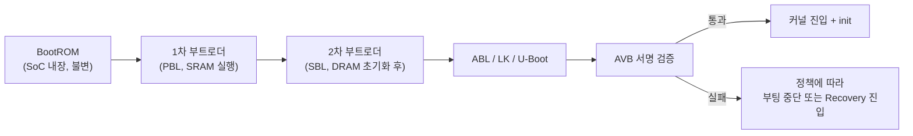

## 이 장을 읽기 전에

이 장은 [07장: 디바이스 드라이버 개발](/post/android-hardware-development/device-drivers/)에서 다룬 커널 드라이버와 HAL 연동 지식을 전제로 하되, 시점을 한 단계 앞으로 당긴다 — 커널이 실행되기 전, SoC 전원이 들어온 순간부터 커널 진입 전까지 무슨 일이 벌어지는지를 다룬다. 난이도는 중급~고급이다. C 포인터, 임베디드 리눅스의 파티션·플래시 스토리지 개념, 그리고 06~07장에서 다룬 HAL 구조에 대한 이해를 전제로 서술한다.

이 장은 커널 자체의 서브시스템 구현(스케줄러, 메모리 관리, 드라이버 모델 심화)은 다루지 않는다 — 그 내용은 03장 커널 개발에서 다뤘다. 또한 부트로더가 신뢰하는 하드웨어 루트 오브 트러스트(eFuse, TrustZone, Secure Element)의 칩 수준 구현 세부사항도 다루지 않으며, 이는 10장 보안 구현에서 더 폭넓게 다룬다. 이 장의 초점은 "부팅 시퀀스의 각 단계가 무엇을 검증하고 무엇을 다음 단계로 넘기는가"라는 부트로더 고유의 책임에 있다.

## 당신의 수준에 맞는 경로

| 수준 | 읽을 부분 | 핵심 목표 |
|:--:|:--|:--|
| 입문자 | "왜 부트로더가 중요한가"부터 "핵심 개념"까지 | BootROM→부트로더→커널로 이어지는 체인의 각 단계가 왜 필요한지 설명할 수 있다 |
| 중급자 | "비교와 트레이드오프", "실전 적용" | LK/ABL/U-Boot 중 상황에 맞는 선택을 하고, AVB 검증과 BootControl HAL 연동 코드를 읽을 수 있다 |
| 실무자 | "흔한 오개념", "비판적 시각" | A/B와 AVB의 실제 운영 트레이드오프(스토리지, 브릭 위험, 검증 정책)를 판단할 수 있다 |

## 왜 부트로더를 이해해야 하는가

안드로이드 개발자 대부분은 부트로더를 "전원을 켜면 자동으로 지나가는 화면" 정도로만 인식한다. 하지만 커스텀 보드에 안드로이드를 포팅하거나, OTA 업데이트가 중간에 실패했을 때 기기가 브릭(bricked, 벽돌 상태)되는 이유를 진단하거나, 루팅·언락된 기기에서 왜 특정 앱이 실행을 거부하는지 이해하려면 부트로더 단계에서 무엇이 검증되고 무엇이 기록되는지 알아야 한다. 부트로더는 커널보다 먼저 실행되므로 커널 자체의 보안 메커니즘(SELinux, 권한 모델)이 아직 존재하지 않는 시점을 책임진다 — 즉 시스템 전체의 신뢰 사슬(chain of trust)이 시작되는 지점이다.

실무적으로도 부트로더 계층은 세 가지 문제와 직접 맞닿아 있다. 첫째, 하드웨어 초기화 실패는 부트로더 단계에서 진단해야 하며 커널 로그로는 원인을 알 수 없는 경우가 많다. 둘째, OTA 업데이트의 신뢰성(업데이트 도중 정전이 나도 기기가 죽지 않는 것)은 A/B 파티션과 부트로더의 슬롯 관리 로직에 달려 있다. 셋째, 기기 보안 등급(구글의 Verified Boot 상태)은 부트로더가 서명을 검증하는 정책에 의해 결정되며, 이는 뱅킹 앱의 SafetyNet/Play Integrity 판정에도 직접 영향을 준다. 이 장에서는 이 세 가지 축 — 부트 체인, A/B 파티션, AVB — 을 순서대로 살펴보고, 마지막으로 이 모든 단계와 상호작용하는 fastboot 프로토콜을 다룬다.

## 핵심 개념

### 부트 체인: BootROM에서 커널까지

**BootROM(부트롬)**은 SoC 제조 시점에 실리콘에 새겨진 불변 코드로, 전원이 들어오면 가장 먼저 실행된다. 소프트웨어로 업데이트할 수 없다는 점이 핵심이다 — 만약 BootROM에 취약점이 있다면 그 SoC를 쓰는 모든 기기는 재발급이 불가능한 결함을 안게 된다. BootROM의 유일한 임무는 다음 단계 코드(1차 부트로더)를 스토리지에서 읽어 SoC 벤더의 루트 공개키로 서명을 검증한 뒤 그 코드에 실행을 넘기는 것이다. 이 루트 키는 보통 One-Time-Programmable(OTP) 퓨즈나 eFuse에 해시 형태로 저장되어 있어 물리적으로도 변조가 어렵다.

BootROM 다음 단계는 SoC 벤더마다 이름이 다르지만 역할은 비슷하다. **1차 부트로더(Primary Bootloader, PBL)**는 DRAM이 아직 초기화되지 않은 상태에서 SoC 내장 SRAM만으로 실행되며, DDR 컨트롤러를 훈련(training)시켜 메인 메모리를 사용 가능하게 만드는 것이 주 임무다. DRAM이 준비되면 **2차 부트로더(Secondary Bootloader, SBL)**가 이어받아 클럭 트리, 전원 관리 IC(PMIC), 보안 프로세서(TrustZone 진입점 등) 초기화를 마친다. 이 지점부터는 SoC 벤더 SDK 밖에서도 관찰 가능한 소프트웨어 스택이 시작되는데, 여기서 안드로이드 기기들은 대체로 세 갈래로 갈린다.

**LK(Little Kernel)**는 원래 Google이 임베디드 부트 환경용으로 만든 경량 실행 환경으로, MediaTek 계열 기기와 구세대 Qualcomm 기기(흔히 `aboot`라는 이름의 파티션으로 배포됨)에서 널리 쓰였다. **ABL(Android Bootloader)**은 Qualcomm이 Snapdragon 845급 이후 세대부터 채택한 방식으로, ARM Trusted Firmware(TF-A)가 EL3(가장 높은 예외 레벨)를 처리한 뒤 EDK2 기반 UEFI 펌웨어가 ABL로서 부트 메뉴·fastboot·이미지 로딩을 담당한다. **U-Boot(Das U-Boot)**는 DENX Software Engineering이 관리하는 오픈소스 부트로더로, 특정 벤더에 종속되지 않고 폭넓은 SoC를 지원해 레퍼런스 보드나 임베디드 안드로이드 포팅 프로젝트에서 자주 선택된다. 상용 플래그십 스마트폰은 벤더 제공 LK/ABL을 쓰는 경우가 대부분이고, U-Boot는 개발 보드·셋톱박스·산업용 기기처럼 벤더가 공식 지원하지 않는 하드웨어를 직접 포팅할 때 선택지가 된다.

이 마지막 단계의 부트로더가 하는 일은 결국 하나로 수렴한다 — 스토리지에서 `boot` 파티션(또는 GKI 체계에서는 `boot` + `vendor_boot` + `init_boot`로 분리된 이미지)을 읽어 커널, 램디스크, 디바이스 트리 블롭(DTB)을 메모리에 올리고, AVB 서명을 검증한 뒤 커널 엔트리 포인트로 점프하는 것이다. 이 흐름을 도식화하면 다음과 같다.



각 단계가 "다음 단계의 서명을 검증한 뒤에만 실행을 넘긴다"는 원칙을 지키면 이를 신뢰 사슬이라 부른다. 사슬의 어느 한 고리가 검증을 생략하면 그 지점부터 신뢰 사슬 전체가 무의미해지므로, 부트로더 개발에서 가장 중요한 설계 원칙은 "각 단계는 자신이 로드하는 다음 단계를 반드시 검증한 뒤에만 실행권을 넘긴다"는 것이다.

### A/B 파티션과 무중단 업데이트

**A/B 파티션(Seamless Update)**은 부팅에 관여하는 주요 파티션(`boot`, `system`, `vendor`, `dtbo` 등)을 두 벌(슬롯 A, 슬롯 B)로 복제해 두고, 한쪽 슬롯이 실행 중인 동안 다른 슬롯에 새 버전을 백그라운드로 기록하는 업데이트 방식이다. 업데이트가 끝나면 재부팅 한 번으로 새 슬롯으로 전환되며, 새 슬롯이 정상 부팅에 실패하면 이전 슬롯으로 자동 폴백한다. 이 방식이 나오기 전 안드로이드는 별도의 `recovery` 파티션으로 재부팅해 업데이트를 적용하는 방식을 썼는데, 이 경우 업데이트 도중 정전이나 오류가 나면 기기가 부팅 불가 상태(브릭)에 빠질 위험이 있었다.

슬롯 전환은 부트로더 혼자 결정하지 않는다. **BootControl HAL**(`android.hardware.boot`, Android 11부터는 AIDL, 그 이전은 HIDL)이 현재 활성 슬롯, 슬롯의 "성공적으로 부팅됨" 표시, 슬롯 전환 요청을 커널 위 프레임워크와 부트로더 사이의 공식 인터페이스로 정의한다. 부트로더는 `misc` 파티션에 기록된 부트로더 제어 블록(BCB)을 읽어 어느 슬롯으로 부팅할지 결정하고, 프레임워크의 `update_engine`이 이 HAL을 통해 슬롯을 갱신한다. 새 슬롯이 몇 차례 연속으로 부팅에 실패하면(부트로더가 재시도 카운터를 관리) 자동으로 이전 슬롯으로 롤백되는데, 이 재시도 로직이 없다면 A/B의 "실패해도 안전하다"는 이점 자체가 성립하지 않는다.

A/B의 가장 큰 비용은 스토리지다 — 업데이트 대상 파티션을 물리적으로 두 벌 유지해야 하므로 순수 A/B는 저장 공간을 거의 두 배로 요구한다. Android 11부터 권장되는 **Virtual A/B**는 이 문제를 완화한다. `boot`, `dtbo`처럼 작은 파티션만 물리적으로 두 벌 유지하고, 용량이 큰 `system`/`vendor`는 동적 파티션(Dynamic Partitions) 위에서 dm-snapshot 기반의 카피-온-라이트(copy-on-write) 스냅샷으로 관리해, 업데이트 중에만 변경된 블록만큼의 추가 공간을 쓰고 설치가 성공적으로 확정(merge)되면 스냅샷을 병합해 공간을 반환한다.

### Android Verified Boot(AVB)

**AVB(Android Verified Boot)**는 Android 8.0부터 제공되는 안드로이드의 표준 부팅 검증 구현체로, Project Treble 아키텍처(HAL과 프레임워크의 분리)와 맞물려 파티션 단위로 서명을 위임할 수 있게 설계됐다. AVB의 핵심 데이터 구조는 **vbmeta**로, 각 파티션의 해시(또는 해시 트리) 정보와 서명, 롤백 인덱스를 담은 메타데이터 블록이다. 부트로더는 vbmeta를 먼저 검증하고, vbmeta에 담긴 디스크립터를 따라가며 나머지 파티션을 검증한다.

`boot`/`init_boot`처럼 크기가 작고 부팅 즉시 전체가 메모리에 올라가는 이미지는 해시 전체를 부팅 시점에 한 번에 계산해 검증한다. 반면 `system`/`vendor`처럼 용량이 큰 파티션은 이미지 전체를 미리 해시하면 부팅 시간이 크게 늘어나므로, **dm-verity**라는 커널 디바이스 매퍼 타깃을 사용해 머클 트리(Merkle tree) 기반으로 블록 단위 검증을 런타임에 지연 수행한다 — 즉 실제로 읽히는 블록만 그 자리에서 해시를 대조하고, 위·변조된 블록을 읽으려는 순간에만 I/O 오류를 발생시킨다. AVB는 이 dm-verity 메타데이터의 생성·서명·검증을 자동화하고 여기에 파티션 간 신뢰 위임과 롤백 보호를 더한 상위 계층이라고 이해하는 편이 정확하다.

**롤백 보호(Rollback Protection)**는 공격자가 알려진 취약점이 있는 구버전 이미지로 기기를 되돌려 그 취약점을 악용하는 다운그레이드 공격을 막는 메커니즘이다. vbmeta에는 단조 증가하는 롤백 인덱스가 담겨 있고, 이 값은 부트로더가 검증할 때마다 **RPMB(Replay Protected Memory Block)**처럼 재생 공격에 안전한 보안 스토리지에 저장된 최소값과 비교된다. 새로 부팅하려는 이미지의 롤백 인덱스가 저장된 최소값보다 낮으면 부트로더는 부팅을 거부한다. 검증 결과에 따라 기기는 네 가지 부팅 상태(Verified Boot state) 중 하나로 표시된다 — 잠금 상태에서 구글 키로 검증되면 초록(Green), 잠금 상태에서 OEM/커스텀 키로 검증되면 노랑(Yellow), 부트로더가 언락되어 있으면 서명 여부와 무관하게 주황(Orange), 검증에 실패해 신뢰 가능한 이미지를 찾지 못하면 빨강(Red)이다. 이 상태는 부팅 시 경고 화면과 Play Integrity API 판정에 반영된다.

### fastboot 프로토콜

**fastboot**는 호스트 PC와 부트로더가 USB(또는 TCP/UDP)를 통해 파티션 이미지를 주고받기 위한 프로토콜이자 그 프로토콜을 구현한 호스트 도구의 이름이다. 프로토콜은 호스트 주도의 동기식 요청-응답 구조를 따른다 — 호스트가 최대 4096바이트의 ASCII 명령 문자열을 보내면, 부트로더는 `OKAY`(성공), `FAIL`(실패), `DATA`(뒤이어 데이터 전송 단계 진행), `INFO`(진행 상황 메시지), `TEXT`(추가 텍스트) 중 하나로 시작하는 응답을 최대 256바이트로 돌려준다. `getvar:<이름>`으로 부트로더 변수를 읽고, `download:<크기>`로 이미지를 부트로더 메모리에 적재한 뒤, `flash:<파티션>`으로 그 데이터를 실제 파티션에 기록하는 흐름이 가장 기본적인 사용 패턴이다.

Android 10부터는 fastboot 처리 주체가 둘로 나뉘었다. 커널이 아직 실행되지 않은 시점의 "부트로더 fastboot"는 `boot`, `vbmeta`, `bootloader` 같은 비동적(non-dynamic) 파티션을 직접 다루고, 반면 `system`/`vendor`처럼 동적 파티션으로 관리되는 이미지는 리커버리 램디스크에서 부팅되는 사용자 공간 데몬인 **fastbootd**가 처리한다. fastbootd는 리눅스 커널과 안드로이드 사용자 공간 위에서 동작하므로 파티션 크기 재조정처럼 부트로더만으로는 처리하기 어려운 동적 파티션 연산을 지원할 수 있다.

## 비교와 트레이드오프

부트로더 프레임워크 선택은 대상 하드웨어가 이미 어떤 SoC 벤더 생태계에 속해 있는지에 크게 좌우되지만, 직접 포팅하는 임베디드 프로젝트라면 아래 기준으로 비교하는 것이 실무적으로 유용하다.

| 항목 | LK (Little Kernel) | ABL (UEFI 기반) | U-Boot |
|:--|:--|:--|:--|
| 기반 구조 | 경량 실행 환경, 벤더 SDK 위에서 확장 | TF-A(BL31) + EDK2 UEFI | Das U-Boot (DENX 관리 오픈소스) |
| 주요 채용처 | MediaTek 계열, 구세대 Qualcomm(`aboot`) | Qualcomm(Snapdragon 845급 이후) | 레퍼런스 보드, 임베디드 안드로이드 포팅 |
| 표준 준수 | 벤더 자체 확장 위주 | UEFI 스펙을 부분적으로 준수 | 커뮤니티 표준, SoC 지원 범위가 넓음 |
| 커스터마이징 난이도 | 중간, 벤더 SDK 문서 의존도 높음 | 높음, UEFI + 벤더 BSP 이해 필요 | 낮음~중간, 문서와 커뮤니티 자료 풍부 |
| AVB/fastboot 통합 | 벤더 레퍼런스에 이미 포함 | 벤더 레퍼런스에 이미 포함 | 커뮤니티 패치를 적용하거나 직접 통합 필요 |

상용 플래그십을 대상으로 한다면 선택의 여지가 거의 없다 — 해당 SoC 벤더가 배포하는 LK 또는 ABL 레퍼런스를 그대로 쓰는 것이 현실적이다. 반대로 상용 SoC 벤더의 지원이 끊긴 보드나 자체 설계 하드웨어를 안드로이드로 포팅한다면, 이미 검증된 드라이버 생태계와 커뮤니티 문서를 갖춘 U-Boot가 개발 속도 면에서 유리하다. 다만 U-Boot 기반 포팅은 AVB·fastbootd 같은 안드로이드 고유 규약을 처음부터 직접 통합해야 하므로, "부트로더 자체 이식"과 "안드로이드 부트 규약 준수"라는 두 가지 작업량을 별도로 계산해야 한다.

업데이트 전략도 마찬가지로 트레이드오프가 있다.

| 항목 | A/B (Seamless) | 단일 파티션 + Recovery |
|:--|:--|:--|
| 스토리지 비용 | 물리 A/B는 대상 파티션 약 2배, Virtual A/B는 변경분만큼만 추가 | 파티션 1벌 + 별도 recovery 영역만 |
| 업데이트 중 가용성 | 백그라운드 설치 후 재부팅 1회로 전환, 서비스 중단 최소화 | recovery로 재부팅해 업데이트 적용, 그동안 기기 사용 불가 |
| 실패 시 복구 | 새 슬롯 부팅 실패 시 이전 슬롯으로 자동 폴백 | 도중 실패 시 브릭 위험이 상대적으로 높고 수동 복구 필요 |
| 구현 복잡도 | BootControl HAL, update_engine, misc 파티션 관리 필요 | 상대적으로 단순, recovery 이미지 하나만 관리 |

A/B는 사용자 경험과 업데이트 신뢰성에서 명확히 우월하지만, 그 대가로 부트로더·HAL·업데이트 엔진이 맞물려야 하는 구현 복잡도를 감수해야 한다. 스토리지가 극도로 제한적인 저가형 임베디드 기기라면 단일 파티션 + recovery 조합이 여전히 합리적인 선택일 수 있으며, 이 경우 업데이트 신뢰성은 recovery 이미지의 A/B화(recovery 자체만 이중화)나 전원 손실에 안전한 쓰기(atomic write) 순서 설계로 별도로 보완해야 한다.

## 실전 적용: AVB 검증과 슬롯 관리 통합하기

시나리오를 하나 설정해 보자. 임베디드 보드 팀에서 U-Boot 기반 커스텀 부트로더에 AVB 검증을 통합하고, 부팅 성공 후 프레임워크가 슬롯 상태를 갱신할 수 있도록 BootControl HAL을 연결하는 작업을 맡았다고 하자. 이 작업은 크게 세 단계로 나뉜다 — (1) 부트로더 쪽에서 AVB가 파티션을 읽을 수 있도록 I/O 콜백을 구현하고, (2) `avb_slot_verify()`를 호출해 검증 결과를 받고, (3) 부팅이 성공한 뒤 프레임워크 쪽에서 그 슬롯을 "성공"으로 표시한다.

AVB 라이브러리(`external/avb/libavb`)는 부트로더가 스토리지에 직접 접근하는 방법을 모르기 때문에, 부트로더가 `AvbOps` 구조체에 함수 포인터로 I/O 콜백을 채워 넘겨줘야 한다. 아래는 `avb_ops.h`에 정의된 필드 중 검증에 필요한 핵심 콜백만 발췌한 형태다(전체 필드는 libavb 버전에 따라 추가되므로 실제 포팅 시 헤더 원본을 기준으로 삼아야 한다).

```c
#include <stdint.h>
#include <stddef.h>
#include <stdbool.h>
#include <libavb/libavb.h>

/* 부트로더가 구현해야 하는 파티션 읽기 콜백.
 * partition 이름으로 지정된 파티션에서 offset부터 num_bytes만큼
 * buffer로 읽어 오고, 실제로 읽은 바이트 수를 out_num_read에 기록한다. */
static AvbIOResult board_read_from_partition(AvbOps* ops,
                                              const char* partition,
                                              int64_t offset,
                                              size_t num_bytes,
                                              void* buffer,
                                              size_t* out_num_read) {
    /* 실제 구현에서는 eMMC/UFS 블록 디바이스 드라이버 호출로 대체된다 */
    if (board_storage_read(partition, offset, buffer, num_bytes) != 0) {
        return AVB_IO_RESULT_ERROR_IO;
    }
    *out_num_read = num_bytes;
    return AVB_IO_RESULT_OK;
}

/* vbmeta에 담긴 공개키가 이 보드가 신뢰하는 키인지 판단하는 콜백 */
static AvbIOResult board_validate_vbmeta_public_key(
        AvbOps* ops,
        const uint8_t* public_key_data,
        size_t public_key_length,
        const uint8_t* public_key_metadata,
        size_t public_key_metadata_length,
        bool* out_is_trusted) {
    *out_is_trusted = board_key_matches_embedded_root(public_key_data,
                                                        public_key_length);
    return AVB_IO_RESULT_OK;
}

/* 부트로더 언락 여부를 AVB에 알려주는 콜백. 언락 상태면 검증 실패를
 * 치명적 오류로 취급하지 않고 경고와 함께 부팅을 허용할 수 있다. */
static AvbIOResult board_read_is_device_unlocked(AvbOps* ops,
                                                   bool* out_is_unlocked) {
    *out_is_unlocked = board_get_unlock_state();
    return AVB_IO_RESULT_OK;
}

static AvbOps g_avb_ops = {
    .read_from_partition = board_read_from_partition,
    .validate_vbmeta_public_key = board_validate_vbmeta_public_key,
    .read_is_device_unlocked = board_read_is_device_unlocked,
};
```

콜백을 채운 뒤에는 `avb_slot_verify()` 한 번으로 vbmeta부터 시작해 연결된 모든 파티션을 검증한다. 이 함수가 `AVB_SLOT_VERIFY_RESULT_OK`를 반환하면 `out_data`에 검증된 커널 커맨드라인(dm-verity 파라미터 포함)과 각 파티션의 검증된 데이터가 채워진다.

```c
#include <libavb/libavb.h>

int board_verify_and_boot(const char* ab_suffix) {
    const char* requested_partitions[] = {"boot", "vendor_boot", NULL};
    AvbSlotVerifyData* verify_data = NULL;

    AvbSlotVerifyResult result = avb_slot_verify(
        &g_avb_ops,
        requested_partitions,
        ab_suffix,                                  /* 예: "_a" 또는 "_b" */
        AVB_SLOT_VERIFY_FLAGS_NONE,
        AVB_HASHTREE_ERROR_MODE_RESTART_AND_INVALIDATE,
        &verify_data);

    if (result != AVB_SLOT_VERIFY_RESULT_OK) {
        board_log_error("AVB verification failed: %d", result);
        return -1;
    }

    /* verify_data->cmdline 에는 dm-verity 파라미터가 포함된
     * 검증된 커널 커맨드라인이 들어 있다 */
    board_boot_kernel(verify_data->cmdline);
    avb_slot_verify_data_free(verify_data);
    return 0;
}
```

마지막 단계는 부팅이 실제로 프레임워크까지 정상적으로 올라온 뒤, 안드로이드 쪽에서 이번 슬롯을 "성공"으로 표시해 부트로더의 재시도 카운터를 초기화하는 것이다. 이 호출은 부트로더가 아니라 시스템 서버(`update_verifier` 계열 컴포넌트)가 BootControl HAL의 AIDL 클라이언트로 수행한다.

```cpp
#include <aidl/android/hardware/boot/IBootControl.h>
#include <android/binder_manager.h>
#include <android/binder_process.h>
#include <memory>

using aidl::android::hardware::boot::IBootControl;

bool MarkCurrentSlotSuccessful() {
    ndk::SpAIBinder binder(AServiceManager_waitForService(
        "android.hardware.boot.IBootControl/default"));
    std::shared_ptr<IBootControl> boot_control =
        IBootControl::fromBinder(binder);
    if (boot_control == nullptr) {
        return false;
    }

    ndk::ScopedAStatus status = boot_control->markBootSuccessful();
    return status.isOk();
}
```

`markBootSuccessful()` 호출이 성공하면 부트로더는 다음 부팅부터 이 슬롯을 "이미 검증된 슬롯"으로 취급하고 재시도 카운터를 리셋한다. 이 호출이 누락되면 정상적으로 동작하는 새 슬롯도 재시도 카운터가 계속 소진되다 결국 부트로더가 강제로 이전 슬롯로 되돌리는 오류가 발생한다 — 실무에서 "OTA 이후 며칠 뒤 갑자기 구버전으로 롤백됐다"는 버그 리포트의 상당수가 이 표시 호출 누락이나 타이밍 문제에서 비롯된다.

마지막으로, 위 과정에서 `board_read_is_device_unlocked()`가 반환하는 언락 상태는 호스트 쪽 fastboot 명령으로 바뀐다. 예를 들어 개발 보드에서 부트로더 언락을 요청하고 이미지를 플래시하는 일반적인 흐름은 다음과 같다.

```text
# 부트로더로 재부팅
fastboot reboot-bootloader

# 부트로더 언락 (경고: 대부분의 구현에서 userdata 전체를 지운다)
fastboot flashing unlock

# boot 이미지를 현재 슬롯에 기록
fastboot flash boot boot.img

# 현재 활성 슬롯 확인 후 b 슬롯으로 전환
fastboot getvar current-slot
fastboot --set-active=b
```

## 흔한 오개념

**"A/B 파티션은 사용자 데이터(userdata)도 두 벌 관리한다"**는 오해가 흔하다. 실제로 A/B가 이중화하는 대상은 OS 이미지가 담긴 `boot`, `system`, `vendor` 같은 파티션뿐이다. `userdata` 파티션은 슬롯과 무관하게 하나만 존재하며 두 슬롯이 공유한다 — 그렇지 않다면 슬롯을 전환할 때마다 사용자의 앱과 데이터가 통째로 사라져야 할 것이다. 다만 이 공유 구조 때문에 새 OS 버전이 만든 데이터베이스 스키마 변경이 이전 슬롯과 호환되지 않으면 롤백 이후 데이터 손상이 발생할 수 있어, OTA 페이로드는 데이터 마이그레이션의 하위 호환성도 함께 고려해야 한다.

**"AVB가 있으면 dm-verity는 필요 없다" 혹은 그 반대로 "dm-verity만 있으면 AVB는 불필요하다"**는 것도 흔한 오해다. 두 메커니즘은 서로 다른 계층을 담당한다. dm-verity는 커널의 디바이스 매퍼 타깃으로, 런타임에 블록을 읽을 때마다 머클 트리로 무결성을 검사하는 실행 메커니즘이다. AVB는 그 dm-verity가 검증에 쓸 루트 해시를 어디서 신뢰할 수 있는 형태로 가져올지, 그리고 여러 파티션 간 서명·롤백 정책을 어떻게 통일할지를 관리하는 상위 프레임워크다. AVB 없이 dm-verity만 켜면 루트 해시 자체를 누가 어떻게 서명하고 배포하는지가 표준화되지 않고, dm-verity 없이 AVB만 있으면 큰 파티션을 검증하기 위해 부팅 시마다 전체 이미지를 해시해야 해 부팅 시간이 크게 늘어난다.

**"부트로더를 언락해도 데이터는 안전하다"**는 오해도 위험하다. 대부분의 구현에서 `fastboot flashing unlock`은 즉시 `userdata` 파티션을 와이프한다. 이는 실수가 아니라 의도된 보안 설계다 — 언락은 검증되지 않은 이미지를 플래시할 수 있게 하므로, 공격자가 물리적으로 탈취한 기기를 언락해 저장된 개인 데이터를 그대로 읽어가는 것을 막기 위해 언락 시점에 데이터를 지운다. 반대로 재-락(re-lock) 역시 같은 이유로 데이터를 와이프하는 구현이 많다.

## 비판적 시각

부트로더 검증 정책은 종종 "제조사가 사용자에게 얼마나 많은 통제권을 허용하는가"라는 논쟁의 중심에 선다. Google이 AOSP를 통해 부트로더 언락과 커스텀 서명 키 등록을 지원하는 레퍼런스 구현을 제공함에도, 많은 OEM은 상용 출시 기기에서 부트로더 언락 자체를 지원하지 않거나 통신사 모델에서만 제한적으로 허용한다. 이는 사용자 소유권(오픈소스 진영이 강조하는 "구매한 기기를 마음대로 다룰 권리")과 제조사·통신사 입장에서의 보안·지원 비용·DRM 콘텐츠 보호 사이의 긴장으로, 어느 한쪽이 절대적으로 옳다고 보기 어렵다. 언락된 기기는 커스텀 ROM과 루팅의 자유를 얻는 대신 Verified Boot 상태가 주황(Orange)으로 고정되어 일부 뱅킹·DRM 콘텐츠 앱이 정상 동작하지 않을 수 있다.

A/B와 Virtual A/B 역시 무조건적인 정답은 아니다. Virtual A/B의 스냅샷 병합(merge) 과정은 유휴 시간에 백그라운드로 진행되도록 설계되지만, 저사양 임베디드 기기나 eMMC처럼 쓰기 성능이 낮은 스토리지에서는 병합이 끝나기 전에 다시 전원이 꺼지는 일이 반복되면 병합이 지연되어 스토리지 여유 공간이 예상보다 오래 부족한 상태로 남을 수 있다. 또한 AVB의 롤백 보호는 보안상 바람직하지만, 롤백 인덱스를 잘못 관리하면(예: 테스트 이미지의 인덱스를 실수로 올린 경우) 정상적인 구버전 이미지로도 되돌아갈 수 없게 되어 개발·QA 워크플로에서 예상치 못한 브릭을 유발하기도 한다. 결국 부트로더 보안 정책은 "가능한 한 엄격하게"가 항상 정답이 아니라, 대상 제품의 위협 모델(공개 판매되는 소비자 기기인지, 통제된 환경의 산업용 기기인지)에 맞춰 검증 엄격도와 개발 편의성 사이의 지점을 선택하는 문제다.

## 다음 장에서는

[09장: 성능 최적화](/post/android-hardware-development/performance-optimization/)에서는 부팅 시간 단축을 포함해 시스템 전반의 성능을 측정하고 개선하는 기법을 다룬다.

## 평가 기준

- [ ] BootROM부터 커널까지 이어지는 부트 체인의 각 단계(PBL, SBL, LK/ABL/U-Boot)가 무엇을 검증하고 무엇을 다음 단계에 넘기는지 설명할 수 있다.
- [ ] LK, ABL, U-Boot의 차이와 각각이 채택되는 실무적 이유를 비교할 수 있다.
- [ ] A/B 파티션이 무엇을 이중화하고 무엇을 공유하는지, 그리고 Virtual A/B가 스토리지 비용을 어떻게 줄이는지 설명할 수 있다.
- [ ] AVB의 vbmeta, dm-verity, 롤백 인덱스가 각각 어떤 문제를 해결하는지 구분해 설명할 수 있다.
- [ ] `AvbOps` 콜백 구현과 `avb_slot_verify()` 호출, BootControl HAL의 `markBootSuccessful()` 연동 흐름을 읽고 각 단계의 역할을 짚을 수 있다.
- [ ] fastboot 프로토콜의 기본 요청-응답 구조와 부트로더 fastboot·fastbootd의 역할 분담을 설명할 수 있다.

## 참고 및 출처

- [Android Open Source Project — Partitions overview](https://source.android.com/docs/core/architecture/bootloader/partitions)
- [Android Open Source Project — Android Verified Boot 2.0](https://source.android.com/docs/security/features/verifiedboot/avb)
- [Android Open Source Project — A/B (seamless) system updates](https://source.android.com/docs/core/ota/ab)
- [Android Open Source Project — fastboot protocol README (system/core)](https://android.googlesource.com/platform/system/core/+/master/fastboot/README.md)
