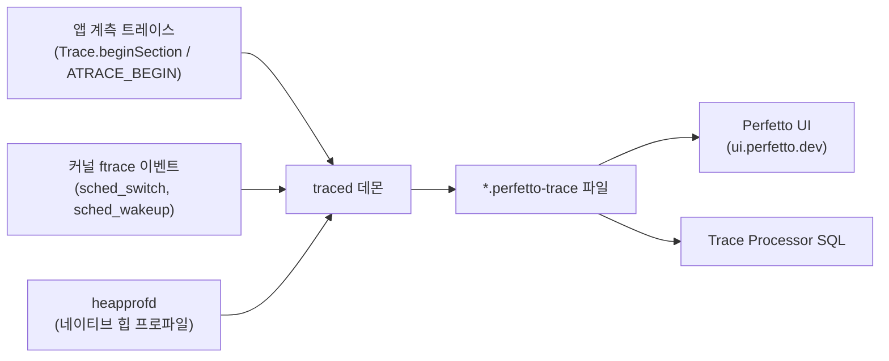

## 이 장을 읽기 전에

이 장은 [08장: 부트로더 개발](/post/android-hardware-development/bootloader-development/)에서 다룬 "기기가 어떻게 켜지는가"의 다음 단계, 즉 "켜진 시스템이 왜 느려지는가"를 다룬다. 난이도 범위는 중급에서 전문가까지다 — "핵심 개념"과 "비교/트레이드오프"는 `adb`로 기기를 다뤄본 정도의 경험이면 충분히 따라올 수 있게 썼고, "실전 적용"과 "비판적 시각"은 실제로 트레이스 파일을 열어 원인을 좁혀본 적이 있는 사람에게 의미가 큰 수준으로 썼다. 이 장은 CFS 스케줄러 자체의 내부 구조나 인터럽트 처리 경로처럼 커널 서브시스템의 구현 세부는 다시 설명하지 않는다 — 그 부분은 이미 커널 개발 장에서 다뤘다. 대신 이 장은 "그 위에서 시스템이 실제로 어떻게 느려지는지 관찰하고, 원인을 좁혀 가는 절차"에 집중한다. GPU 렌더링 파이프라인 자체의 세부 구현(SurfaceFlinger 합성, 셰이더 최적화, HWC 컴포지션)이나 배터리 회로·PMIC 하드웨어 설계는 이 장의 범위 밖이며, 이 시리즈의 그래픽·미디어 프레임워크 관련 장에서 별도로 다룬다.

| 수준 | 읽을 부분 | 핵심 목표 |
|---|---|---|
| 초급 (성능 분석을 처음 접하는 안드로이드 개발자) | 도입, 핵심 개념 | Perfetto/systrace가 무엇을 기록하는지, ANR과 Jank가 어떻게 정의되는지 설명할 수 있다 |
| 중급 (시스템 프로그래밍·앱 성능 튜닝 경험자) | 핵심 개념, 비교/트레이드오프, 실전 적용 | 트레이스를 직접 수집·쿼리해 병목 구간을 좁히고, 힙 덤프로 메모리 누수 후보를 식별할 수 있다 |
| 전문가 (플랫폼·펌웨어 성능 담당) | 비교/트레이드오프, 실전 적용, 비판적 시각 | cpufreq 거버너와 열 스로틀링의 상호작용을 이해하고, 측정 도구 자체의 관찰 오버헤드를 감안해 결론을 판단할 수 있다 |

## 도입

성능 문제는 기능 버그와 달리 "재현되지만 원인을 특정하기 어려운" 유형의 결함이다. 앱은 크래시하지 않고, 로그에는 에러 하나 남지 않은 채로 사용자는 그저 "느리다"고 느낀다. 이 느림의 정체는 메인 스레드가 5초 넘게 응답하지 못한 ANR일 수도 있고, 프레임 하나가 16밀리초를 넘겨 그려지지 못한 Jank일 수도 있고, 백그라운드에서 서서히 쌓인 네이티브 메모리가 저사양 기기의 Low Memory Killer를 자극한 결과일 수도 있고, CPU가 발열 때문에 최고 주파수로 올라가지 못한 DVFS 스로틀링의 결과일 수도 있다. 이 네 가지는 증상은 비슷해 보여도 원인과 해결 방법이 완전히 다르며, 어떤 것인지 구분하지 못한 채로 "일단 최적화해 보자"고 코드를 손대면 실제 병목과 무관한 곳을 고치고도 문제가 남아 있는 상황에 빠지기 쉽다. 이 장은 추측 대신 측정으로 원인을 좁히는 절차, 즉 Perfetto/systrace로 시스템 전체의 타임라인을 기록하고, ANR/Jank의 판정 기준으로 증상을 분류하고, 메모리 프로파일러로 힙의 성장을 추적하고, DVFS 계층에서 주파수가 어떻게 결정되는지 이해하는 것을 다룬다. 이 순서 자체가 실무에서 성능 이슈를 조사할 때 따르는 진단 흐름과 거의 일치한다.

## 핵심 개념

### Perfetto와 systrace: 트레이싱의 원리

**트레이싱(Tracing)**은 시스템에서 일어나는 사건을 발생 시각과 함께 순서대로 기록하는 관찰 기법으로, 일정 주기마다 콜스택을 표본 추출하는 **프로파일링(Profiling, 샘플링 기반)**과는 성격이 다르다. 프로파일링(예: `simpleperf`)은 "이 함수가 전체 CPU 시간의 몇 퍼센트를 차지하는가"라는 통계적 질문에 강하지만, "정확히 몇 시에 무슨 일이 있었는가"라는 시간순 인과관계 질문에는 트레이싱이 더 적합하다. 안드로이드는 이 목적을 위해 애플리케이션 코드가 직접 구간을 표시하는 계측(instrumentation) 트레이스 포인트와, 커널이 스케줄러 전환·인터럽트 같은 사건을 기록하는 `ftrace` 이벤트를 결합해 하나의 타임라인으로 합친다.

**Perfetto**는 이 계측 트레이스와 ftrace 이벤트, 힙 프로파일(`heapprofd`), CPU 프로파일 등 여러 데이터 소스를 `traced`라는 중앙 데몬이 수집해 하나의 프로토콜 버퍼 형식 트레이스 파일로 기록하는 오픈소스 트레이싱 플랫폼이다. Perfetto는 현재 안드로이드 OS와 크로미움의 기본 트레이싱 시스템이며, 예전에 널리 쓰이던 `systrace` 파이썬 스크립트는 이제 내부적으로 Perfetto를 호출하는 얇은 래퍼로 남아 있다. 즉 "systrace냐 Perfetto냐"는 더 이상 서로 다른 두 도구를 고르는 문제가 아니라, 같은 수집 엔진을 어떤 인터페이스(레거시 명령행 스크립트인지, 최신 설정 프로토콜인지)로 다루느냐의 문제에 가깝다. 앱 코드는 `android.os.Trace.beginSection()`/`endSection()`(Java/Kotlin)이나 네이티브의 `ATRACE_BEGIN`/`ATRACE_END` 매크로로 자신만의 구간을 트레이스에 표시할 수 있고, 이렇게 표시된 구간은 커널이 기록한 스케줄러 이벤트와 같은 타임라인 위에 겹쳐서 시각화된다.



수집된 트레이스는 두 가지 방식으로 분석할 수 있다. 하나는 브라우저 기반 Perfetto UI에 파일을 올려 타임라인을 시각적으로 훑는 방식이고, 다른 하나는 Trace Processor가 제공하는 SQL 인터페이스로 특정 조건(예: 16밀리초를 넘는 슬라이스)을 질의하는 방식이다. 후자는 트레이스가 수십 메가바이트를 넘어가 사람 눈으로 훑기 어려울 때, 또는 같은 조건의 회귀를 자동화된 성능 테스트 파이프라인에 통합할 때 특히 유용하다.

### ANR과 Jank: 무엇이, 언제 "느림"으로 분류되는가

**ANR(Application Not Responding, 응답 없음)**은 메인 스레드가 사용자 입력이나 시스템 콜백에 정해진 시간 안에 응답하지 못했을 때 시스템이 강제로 판정하는 상태다. 이 판정은 임의의 감각적 기준이 아니라 구체적인 시간 임계값을 갖는데, 입력 이벤트(키·터치)에 5초 안에 응답하지 못하면 입력 디스패치 타임아웃으로, 포그라운드 서비스가 `onCreate()`/`onStartCommand()`를 몇 초 안에 끝내지 못하거나 `startForeground()`를 5초 안에 호출하지 못하면 서비스 관련 ANR로, `BroadcastReceiver`가 포그라운드 액티비티가 있는 상태에서 5초 안에 처리를 끝내지 못하면 브로드캐스트 ANR로 분류된다. 이 임계값들은 Android Developers 공식 문서의 ANR 판정 기준에 정의되어 있으며, Google Play는 이와 별개로 "일일 활성 사용자 중 사용자 체감 ANR을 겪는 비율이 기기 전체 기준 0.47%, 특정 기기 모델 기준 8%를 넘는가"라는 서비스 품질 지표(Android Vitals)로 앱을 평가한다. ANR이 발생하면 시스템은 `/data/anr/` 아래에 각 스레드의 콜스택을 담은 트레이스 파일을 남기는데, 이 파일에서 메인 스레드가 어떤 코드에서 멈춰 있었는지를 읽는 것이 ANR 조사의 출발점이다.

**Jank(잰크, 끊김)**는 화면 갱신 주기 안에 프레임을 제때 그리지 못해 사용자가 스터터링을 체감하는 현상이다. 60fps를 유지하려면 프레임 하나를 16밀리초 안에, 90fps는 11밀리초 안에, 120fps는 8밀리초 안에 그려야 하며, 이 창을 단 1밀리초라도 넘기면 프레임이 "조금 늦게" 표시되는 것이 아니라 `Choreographer`가 해당 프레임 전체를 버리고 다음 vsync까지 기다린다. Android Developers 문서는 이 현상을 렌더링 시간에 따라 세 단계로 구분하는데, 16~700밀리초 사이는 스크롤 끊김 같은 **느린 프레임(Slow Frame)**, 700밀리초~5초 사이는 앱이 잠시 멈춘 것처럼 보이는 **정지 프레임(Frozen Frame)**, 5초를 넘어가면 비로소 ANR로 분류된다. 즉 ANR은 Jank의 극단적인 하위 집합이며, 조사 우선순위는 대개 ANR을 먼저 없애고, 그다음 정지 프레임, 마지막으로 느린 프레임 순으로 다룬다. `Choreographer`는 vsync 신호를 받을 때마다 `doFrame()` 콜백을 호출해 입력 처리·애니메이션·측정/배치·그리기를 한 프레임 주기 안에 순서대로 실행시키는 조정자 역할을 하며, 이 파이프라인 어느 단계에서든 시간이 초과되면 프레임이 밀린다.

| 구분 | 소요 시간 | 사용자 체감 | 대표 원인 |
|---|---|---|---|
| 느린 프레임 | 16ms ~ 700ms | 스크롤·애니메이션이 매끄럽지 않음 | 과도한 오버드로우, 무거운 `onMeasure`/`onLayout`, 잦은 객체 할당으로 인한 GC 압박 |
| 정지 프레임 | 700ms ~ 5s | 화면이 잠깐 멈춘 것처럼 보임 | 메인 스레드에서의 동기 I/O, 큰 비트맵 디코딩, 잠금 경합 |
| ANR | 5s 초과 | 입력에 전혀 반응하지 않음, 시스템이 강제 종료 대화상자 표시 | 데드락, 동기 Binder 호출 대기, 무한 루프에 가까운 계산 |

### 메모리 프로파일링: 힙, 네이티브 메모리, 그리고 회수 압박

안드로이드 프로세스의 메모리는 크게 세 종류의 힙으로 나뉜다. **앱 힙(App Heap)**은 애플리케이션이 실행 중 직접 할당하는 객체가 쌓이는 영역이고, **이미지 힙(Image Heap)**은 부트 이미지에 미리 구워진, 모든 앱이 공유하는 불변 시스템 클래스 영역이며, **자이곳 힙(Zygote Heap)**은 `zygote` 프로세스가 `fork()`될 때 자식 프로세스와 쓰기 시 복사(Copy-on-Write) 방식으로 공유하는 초기 상태 힙이다. Android Studio Memory Profiler는 이 세 힙에 대해 할당 개수, 네이티브 크기(비트맵처럼 JVM 바깥에 실제 데이터를 두는 객체), 얕은 크기(shallow size, 객체 자신만의 크기), 유지 크기(retained size, 그 객체를 회수하면 함께 사라질 전체 크기)를 보여준다. 흔한 메모리 누수 원인은 `Activity`나 `Context`에 대한 장기 참조, 해제되지 않은 리스너/옵저버, `Activity` 참조를 캡처한 non-static 내부 클래스나 람다다.

Java 힙의 가비지 컬렉션은 ART(Android Runtime)의 컬렉터가 담당하지만, 정확한 알고리즘과 세대(generational) 동작 여부는 ART 버전과 기기 구성에 따라 달라지므로 특정 버전 번호로 단정하지 않는 편이 안전하다. 여기서 중요한 것은 GC 자체보다, GC가 메인 스레드를 멈추는 정지 시간(pause time)이 앞서 다룬 Jank와 직접 연결된다는 점이다 — 짧은 시간에 많은 객체를 할당했다가 버리는 코드(예: 루프 안에서 문자열을 연결하거나 임시 컬렉션을 반복 생성하는 코드)는 GC 빈도를 높여 프레임 예산을 잠식한다. 네이티브 힙(malloc으로 할당되는 메모리, 예를 들어 비트맵 픽셀 버퍼나 네이티브 라이브러리가 할당한 버퍼)은 Java 힙과 별도로 추적해야 하며, Perfetto의 `heapprofd`는 네이티브 할당 지점까지 샘플링해 어느 콜스택이 얼마나 많은 네이티브 메모리를 차지하는지 보여준다. 시스템 전체가 메모리 압박을 받으면 `lmkd`(Low Memory Killer Daemon, 커널 개발 장에서 다룬 것처럼 과거의 인커널 LMK를 대체한 유저스페이스 데몬)가 `oom_score_adj` 우선순위가 낮은 백그라운드 프로세스부터 종료하며, 이때 죽는 프로세스의 로그를 놓치면 "왜 백그라운드에서 앱이 사라졌는지" 원인을 찾기 어려워진다.

### DVFS: 주파수와 전압을 누가, 언제 결정하는가

**DVFS(Dynamic Voltage and Frequency Scaling, 동적 전압-주파수 스케일링)**는 CPU 코어가 처리해야 할 부하에 맞춰 동작 주파수와 공급 전압을 실시간으로 조정하는 전력 관리 기법이다. 리눅스 커널에서 이 역할은 `cpufreq` 서브시스템이 맡고, 실제로 "언제 주파수를 올리고 내릴지" 결정하는 정책 알고리즘은 **거버너(Governor)**라는 교체 가능한 모듈로 분리되어 있다. 커널 문서가 정의하는 대표적인 거버너는 네 가지다. `performance`는 정책이 허용하는 최고 주파수를 항상 요구하고, `powersave`는 반대로 최저 주파수를 항상 요구한다. `ondemand`는 CPU가 유휴 상태가 아니었던 시간의 비율로 부하를 추정해 임계값을 넘으면 즉시 최고 주파수로 뛰어오르는 방식이며, 스케줄러와 독립적으로 동작하는 대신 잦은 컨텍스트 스위치 오버헤드를 유발한다. `schedutil`은 `ondemand`와 `conservative`를 대체하기 위해 설계된 거버너로, 커널 스케줄러가 이미 계산해 둔 CPU 사용률(utilization) 데이터를 직접 활용해 주파수를 계산하며, I/O 대기 작업에 대해 일시적으로 주파수를 끌어올리는 IO-wait 부스트 기능도 갖고 있다. 최신 안드로이드 기기는 대체로 `schedutil`을 기본값으로 사용하는데, 이는 스케줄러와 주파수 결정이 같은 부하 정보를 공유해 판단 지연을 줄일 수 있기 때문이다.

DVFS는 동일 종류 코어의 주파수만 조정하지만, 모바일 SoC는 여기에 더해 **big.LITTLE**이라는 이기종 코어 구성을 함께 쓴다. ARM의 설명에 따르면 이 구조는 고성능·고소비 전력의 big 코어와 저성능·저소비 전력의 LITTLE 코어를 함께 두고, 문자메시지·이메일·오디오 재생처럼 가벼운 작업은 LITTLE 코어에, 게임처럼 무거운 작업은 big 코어에 배치하는 식으로 작업 자체를 옮겨 전력 효율을 얻는다. 즉 DVFS가 "같은 하드웨어를 얼마나 세게 돌릴지"를 결정하는 층이라면, big.LITTLE 스케줄링은 그 위에서 "애초에 어느 하드웨어에 작업을 배치할지"를 결정하는 층이다. 이 둘은 sysfs 인터페이스(`/sys/devices/system/cpu/cpuX/cpufreq/scaling_governor`, `scaling_available_frequencies`, `scaling_cur_freq` 등)를 통해 값을 조회하거나(루팅되지 않은 상용 기기에서는 대개 읽기만 가능) 조정할 수 있으며, 실제 값은 열 관리 엔진이 온도에 따라 `scaling_max_freq`를 낮추는 형태로 동시에 개입하기 때문에, 코드만 봐서는 "왜 주파수가 기대만큼 오르지 않는지"를 완전히 설명하지 못하는 경우가 흔하다.

## 비교/트레이드오프

성능 조사에 쓰는 도구는 저마다 관찰 방식과 오버헤드가 다르며, 무엇을 알고 싶은지에 따라 선택이 갈린다. 아래 표는 이 장에서 다룬 트레이싱 도구를 정리한 것이다.

| 도구 | 관찰 방식 | 오버헤드 | 적합한 상황 |
|---|---|---|---|
| systrace (레거시 명령행) | Perfetto를 호출하는 래퍼, 사전 정의된 카테고리 수집 | 낮음 | 오래된 문서·스크립트와의 호환이 필요한 경우 |
| Perfetto | 이벤트 기반 트레이싱(계측 + ftrace + heapprofd 등 다중 소스 통합) | 낮음~중간(활성화한 데이터 소스 수에 비례) | 정확한 시각·인과관계, 여러 서브시스템을 한 타임라인에서 상관관계 분석할 때 |
| simpleperf | 통계적 샘플링(하드웨어 PMU 카운터 활용 가능) | 중간(샘플링 주기에 비례) | "어느 함수가 CPU 시간을 많이 쓰는가" 같은 핫스팟 탐색 |
| Memory Profiler / heapprofd | 힙 스냅샷 또는 네이티브 할당 샘플링 | 스냅샷 촬영 순간 GC 정지 발생 | 메모리 누수 후보 식별, 힙 성장 추이 관찰 |

트레이싱은 "언제 무슨 일이 있었는가"라는 순서가 중요할 때, 샘플링 프로파일링은 "어디에 시간이 몰려 있는가"라는 분포가 중요할 때 유리하다는 것이 판단 기준이다. Jank처럼 특정 프레임 하나가 왜 늦었는지 원인을 좁히는 작업은 트레이싱이 압도적으로 유리하고, 반대로 "이 앱을 30분 돌렸을 때 CPU 사이클의 대부분이 어느 함수에 몰려 있는가"처럼 장시간에 걸친 전체 경향을 파악할 때는 샘플링 프로파일러가 오버헤드 대비 효율이 좋다.

DVFS 거버너 선택에도 비슷한 트레이드오프가 있다.

| 거버너 | 판단 근거 | 장점 | 단점/적합 상황 |
|---|---|---|---|
| `performance` | 항상 최고 주파수 요구 | 지연 시간 최소화 | 배터리 소모·발열 급증, 벤치마크·디버깅 용도로만 제한적으로 사용 |
| `powersave` | 항상 최저 주파수 요구 | 전력 소모 최소화 | 부하가 조금만 늘어도 체감 지연이 커짐 |
| `ondemand` | 유휴가 아니었던 시간 비율로 부하 추정 | 구현이 단순, 오래 검증됨 | 스케줄러와 독립적이라 잦은 컨텍스트 스위치, 반응이 계단식 |
| `schedutil` | 스케줄러의 CPU 사용률 데이터를 직접 활용 | 스케줄러와 결정을 공유해 반응이 빠르고 정교함 | 스케줄러 클래스(EAS 등)와의 통합 설정이 기기·커널 버전에 따라 달라짐 |

`performance`로 거버너를 고정해 두면 특정 구간의 지연 시간을 최소화할 수는 있지만, 이는 어디까지나 통제된 벤치마크나 디버깅 상황에 한정된 선택이다. 실제 상용 기기에서 지속적으로 고주파수를 요구하면 열 관리 엔진이 개입해 오히려 주파수를 강제로 끌어내리는 스로틀링이 반복되고, 그 결과가 `schedutil`로 자연스럽게 부하에 맞춰 조정했을 때보다 더 들쭉날쭉한 사용자 체감을 만드는 경우도 드물지 않다.

## 실전 적용

특정 목록 화면을 스크롤할 때 사용자가 끊김을 보고했다고 가정하자. 이런 신고를 받았을 때 첫 단계는 코드를 추측으로 고치는 것이 아니라, 문제가 재현되는 구간을 트레이스로 남기는 것이다. 기기가 Android 9 이상이면 개발자 옵션의 시스템 트레이싱(System Tracing) 앱으로 ADB 없이도 트레이스를 남길 수 있고, 명령행에서는 아래와 같이 특정 카테고리만 골라 짧게 캡처할 수 있다.

```bash
# gfx(그래픽), view(뷰 시스템), sched(스케줄러), freq(cpufreq) 카테고리로 10초 캡처
adb shell perfetto \
  -c - --txt \
  -o /data/misc/perfetto-traces/scroll-jank.perfetto-trace \
  <<EOF
buffers: {
    size_kb: 63488
}
data_sources: {
    config {
        name: "linux.ftrace"
        ftrace_config {
            ftrace_events: "sched/sched_switch"
            ftrace_events: "power/cpu_frequency"
            atrace_categories: "gfx"
            atrace_categories: "view"
        }
    }
}
duration_ms: 10000
EOF
adb pull /data/misc/perfetto-traces/scroll-jank.perfetto-trace .
```

이 트레이스만으로는 "어느 화면의 어느 코드가 느렸는지"까지는 알기 어려울 수 있으므로, 의심되는 메서드 주변에 앱 코드에서 직접 구간을 표시해 두면 분석이 훨씬 수월해진다. 아래는 리스트 항목을 바인딩하는 메서드에 커스텀 트레이스 구간을 추가한 예시다.

```kotlin
import android.os.Trace
import android.widget.ImageView
import android.widget.TextView

class ItemViewHolder(itemView: android.view.View) : androidx.recyclerview.widget.RecyclerView.ViewHolder(itemView) {
    private val title: TextView = itemView.findViewById(android.R.id.text1)
    private val thumbnail: ImageView = itemView.findViewById(android.R.id.icon)

    fun bind(item: ListItem) {
        Trace.beginSection("ItemViewHolder.bind")
        try {
            title.text = item.title
            Trace.beginSection("ItemViewHolder.decodeThumbnail")
            try {
                thumbnail.setImageBitmap(item.decodeThumbnail())
            } finally {
                Trace.endSection()
            }
        } finally {
            Trace.endSection()
        }
    }
}
```

`Trace.beginSection()`은 반드시 같은 스레드에서 짝이 되는 `Trace.endSection()`으로 닫아야 하며, 예외가 발생해도 구간이 닫히도록 `try`/`finally`로 감싸는 것이 안전하다. 네이티브 코드(JNI 구현이나 C++ 라이브러리)에서 같은 역할을 하려면 `<cutils/trace.h>`가 제공하는 `ATRACE_BEGIN`/`ATRACE_END` 매크로를 쓰거나, Perfetto SDK를 직접 링크한 경우 `TRACE_EVENT` 매크로를 쓴다.

```cpp
#include <perfetto.h>

PERFETTO_DEFINE_CATEGORIES(
    perfetto::Category("rendering").SetDescription("Custom rendering trace points"));

void DecodeThumbnail(const uint8_t* data, size_t length) {
    TRACE_EVENT("rendering", "DecodeThumbnail", "byte_length", length);
    // 실제 디코딩 로직
}
```

트레이스를 수집한 뒤에는 Trace Processor의 SQL 인터페이스로 16밀리초를 넘긴 슬라이스만 골라낼 수 있다. 아래 질의는 앞서 표시한 `ItemViewHolder.bind` 구간 중 예산을 초과한 것만 지속 시간 순으로 나열한다.

```sql
SELECT ts, dur, name
FROM slice
WHERE name IN ('ItemViewHolder.bind', 'ItemViewHolder.decodeThumbnail')
  AND dur > 16000000  -- 나노초 단위, 16ms
ORDER BY dur DESC
LIMIT 20;
```

이 질의 결과 `decodeThumbnail` 구간이 반복적으로 예산을 넘기고 있다면, 병목은 메인 스레드에서 비트맵을 동기적으로 디코딩하는 코드에 있다는 결론을 코드를 추측으로 뜯어보지 않고도 얻을 수 있다. 만약 같은 화면에서 스크롤 도중 완전히 멈춘 것처럼 보였다는 신고까지 겹친다면, `/data/anr/`에 남은 ANR 트레이스 파일을 함께 확인해야 한다. 이 파일은 사건 당시 모든 스레드의 콜스택을 담은 텍스트로, 메인 스레드 항목이 다음과 같은 형태로 나타난다.

```text
"main" prio=5 tid=1 Blocked
  | group="main" sCount=1 ucsCount=0 flags=1 obj=0x72d1a420 self=0x...
  | held mutexes=
  at com.example.app.ThumbnailCache.get(ThumbnailCache.java:42)
  - waiting to lock <0x0d3a9f1c> (a java.lang.Object) held by thread 12
  at com.example.app.ItemViewHolder.bind(ItemViewHolder.java:18)
  at androidx.recyclerview.widget.RecyclerView$Adapter.bindViewHolder
  at android.os.Looper.loop(Looper.java:288)
  at android.app.ActivityThread.main(ActivityThread.java:7872)
```

이 스택은 메인 스레드가 `ThumbnailCache.get()` 안에서 다른 스레드(12번)가 쥐고 있는 락을 기다리다 멈췄다는 사실을 그대로 보여준다. Perfetto 트레이스에서 본 "느린 디코딩"과 이 ANR 트레이스에서 본 "락 경합"이 같은 캐시 클래스를 가리킨다면, 원인은 디코딩 자체의 CPU 비용이 아니라 캐시 접근을 보호하는 락의 설계에 있다는 쪽으로 가설이 좁혀진다. 마지막으로 이 문제가 저사양 기기에서만 재현된다면 메모리 압박과 DVFS 스로틀링도 함께 확인할 가치가 있다. `dumpsys meminfo`로 해당 패키지의 메모리 구성을 보고, 재현 중 `scaling_cur_freq`를 폴링해 코어가 실제로 어느 주파수에 머물러 있었는지 함께 남긴다.

```bash
adb shell dumpsys meminfo com.example.app | head -20
adb shell "while true; do cat /sys/devices/system/cpu/cpu0/cpufreq/scaling_cur_freq; sleep 0.5; done"
```

Java 힙에서 특정 클래스의 인스턴스가 화면을 여러 번 스크롤할수록 계속 늘어나는 패턴이 보이면, `android.os.Debug.dumpHprofData(String)`으로 힙 덤프를 뜬 뒤 표준 도구로 열어볼 수 있는 형식으로 변환해 참조 사슬을 추적한다.

```bash
adb shell am dumpheap com.example.app /data/local/tmp/scroll-jank.hprof
adb pull /data/local/tmp/scroll-jank.hprof .
hprof-conv scroll-jank.hprof scroll-jank-converted.hprof
```

이렇게 트레이스(무엇이, 언제), ANR 스택(어디서 멈췄는지), 메모리·주파수 로그(자원 압박이 있었는지)를 함께 놓고 보면, 같은 "스크롤이 끊긴다"는 신고라도 실제 원인은 메인 스레드 디코딩 비용, 락 경합, 메모리 압박으로 인한 GC 폭증, 열 스로틀링 중 하나(혹은 여러 개의 조합)로 구체적으로 좁혀진다.

## 흔한 오개념

**"ANR은 앱이 크래시한 것과 같다"**는 정확하지 않다. ANR은 프로세스가 살아 있는 상태에서 메인 스레드가 정해진 시간 안에 응답하지 못했다는 응답성 지표이지, 프로세스가 죽었다는 안정성 지표가 아니다. 사용자에게는 "앱 종료" 대화상자가 뜨지만 실제로는 프로세스가 여전히 메모리에 남아 있을 수 있고, Android Vitals에서도 ANR과 크래시(Crash)는 서로 다른 지표로 별도 집계된다. 두 문제를 같은 로그에서 찾으려 하면 엉뚱한 곳을 뒤지게 된다.

**"프레임이 밀리는 건 항상 GPU 렌더링이 느려서다"**도 흔한 오해다. 앞서 다룬 것처럼 `Choreographer`의 `doFrame()` 파이프라인은 입력 처리, 애니메이션 갱신, 측정/배치, 그리기를 모두 포함하며, 이 중 어느 단계든 메인 스레드에서 시간이 오래 걸리면 프레임이 밀린다. 실제로 실전 적용 절에서 다룬 사례처럼 비트맵 디코딩이나 락 경합처럼 GPU와 무관한 CPU 작업이 원인인 경우가 드물지 않으며, Perfetto 트레이스로 프레임 안에서 시간이 실제로 어느 단계에 쓰였는지 확인하지 않은 채 "GPU가 느리다"고 단정하면 잘못된 곳을 최적화하게 된다.

**"거버너를 `performance`로 고정하면 항상 빠르다"**는 성급한 결론이다. 지속적인 최고 주파수 요구는 열 관리 엔진의 스로틀링을 유발하고, 그 결과 짧은 구간에서는 빨라 보여도 긴 세션에서는 주파수가 급락과 회복을 반복하며 오히려 `schedutil`보다 체감 일관성이 떨어질 수 있다. "느리다"는 신고에 무조건 최고 성능 모드로 대응하는 것은 진단이 아니라 임시방편에 가깝다.

## 비판적 시각

이 장에서 다룬 도구들은 모두 "관찰이 관찰 대상에 영향을 준다"는 근본적인 한계를 안고 있다. Perfetto 계측 트레이스는 오버헤드가 낮다고 알려져 있지만 0은 아니며, 활성화하는 ftrace 카테고리가 많아질수록, 특히 스케줄러 이벤트를 촘촘히 기록할수록 그 자체가 타이밍에 영향을 준다. 힙 덤프는 더 극단적인데, 스냅샷을 뜨는 순간 VM이 힙을 순회하기 위해 짧게 멈추므로, 메모리 조사와 Jank 조사를 같은 세션에서 동시에 진행하면 힙 덤프 자체가 만든 정지 시간이 원래 조사하려던 프레임 드롭과 뒤섞여 원인 분석을 오염시킬 수 있다.

ANR과 Jank의 시간 임계값(5초, 16/700밀리초 등)도 절대적인 생리학적 기준이 아니라 Google Play의 서비스 품질 정책으로 정해진 값이라는 점을 감안해야 한다. 이 값들은 실무에서 우선순위를 정하는 데 유용한 합의된 기준이지만, 실제 사용자가 "끊긴다"고 느끼는 경계는 프레임 소요 시간 하나만이 아니라 프레임 페이싱의 일관성, 입력 지연, 모션 블러 여부 등 여러 요인이 겹쳐 결정되므로, 어떤 프레임이 16밀리초를 살짝 넘겼다고 해서 사용자가 반드시 그것을 인지한다고 단정할 수는 없다.

DVFS 튜닝에도 같은 종류의 한계가 있다. `cpufreq` 서브시스템과 거버너는 커널 문서에 비교적 깔끔하게 정리되어 있지만, 실제 상용 기기에서는 그 위에 벤더가 구현한 열 관리 엔진과 전력 HAL이 얹혀 있어, 문서에 기술된 거버너의 판단과 실제 관측되는 주파수 변화가 어긋나는 경우가 흔하다. 상용 기기 대부분은 `scaling_governor` sysfs 파일을 루팅 없이는 변경할 수 없게 잠가 두기 때문에, 이 장에서 설명한 사용자 공간 튜닝 절차는 개발용 레퍼런스 보드나 루팅된 테스트 기기에서만 온전히 적용되고, 일반 소비자 기기에서는 관찰(읽기)까지만 가능한 경우가 대부분이라는 점도 실무에서 자주 부딪히는 제약이다.

## 다음 장에서는

[10장: 보안 구현](/post/android-hardware-development/security-implementation/)에서는 이 장에서 다룬 관찰·계측 도구들이 노출할 수 있는 정보를 어떻게 통제하는지를 포함해, 안드로이드 플랫폼의 보안 메커니즘을 다룬다.

## 평가 기준

- [ ] 트레이싱과 샘플링 프로파일링의 차이를 설명하고, Perfetto와 systrace가 지금 어떤 관계인지 말할 수 있다.
- [ ] ANR을 유발하는 조건과 시간 임계값을 나열하고, ANR 트레이스 파일에서 메인 스레드가 멈춘 지점을 읽을 수 있다.
- [ ] Jank를 느린 프레임·정지 프레임·ANR로 구분하는 기준을 설명하고, `Choreographer`가 프레임을 어떻게 스케줄링하는지 말할 수 있다.
- [ ] 앱 힙·이미지 힙·자이곳 힙의 차이를 구분하고, 힙 덤프로 메모리 누수 후보를 좁히는 절차를 수행할 수 있다.
- [ ] `cpufreq` 거버너별 판단 근거와 트레이드오프를 비교하고, big.LITTLE과 DVFS가 서로 다른 층의 결정이라는 점을 설명할 수 있다.
- [ ] 트레이스·ANR 스택·메모리·주파수 로그를 함께 놓고 같은 증상의 서로 다른 원인을 구분하는 진단 절차를 적용할 수 있다.

## 참고 및 출처

- Perfetto, "Perfetto - System profiling, app tracing and trace analysis," [perfetto.dev/docs](https://perfetto.dev/docs/)
- Android Developers, "Application Not Responding (ANR)," [developer.android.com/topic/performance/vitals/anr](https://developer.android.com/topic/performance/vitals/anr)
- Android Developers, "Understand jank and the frame lifecycle," [developer.android.com/topic/performance/vitals/render](https://developer.android.com/topic/performance/vitals/render)
- Android Developers, "Capture a system trace on device," [developer.android.com/topic/performance/tracing/on-device](https://developer.android.com/topic/performance/tracing/on-device)
- Android Developers, "Use the Memory Profiler," [developer.android.com/studio/profile/memory-profiler](https://developer.android.com/studio/profile/memory-profiler)
- The Linux Kernel documentation, "CPU Performance Scaling," [docs.kernel.org/admin-guide/pm/cpufreq.html](https://docs.kernel.org/admin-guide/pm/cpufreq.html)
- Arm, "Arm big.LITTLE Technology," [arm.com/technologies/big-little](https://www.arm.com/technologies/big-little)
