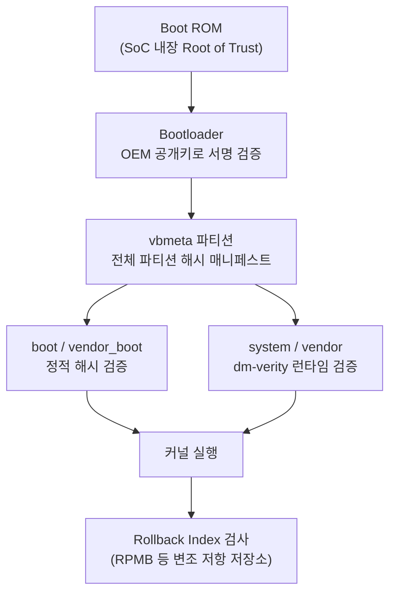

# 10장. 보안 구현

## 이 장을 읽기 전에

이 장은 [09장: 성능 최적화](/post/android-hardware-development/performance-optimization/)에서 다룬 시스템 자원 튜닝 지식을 전제로 하지 않는다. 다만 커널·HAL·부트로더가 어떤 계층에서 상호작용하는지에 대한 감각은 앞선 장들(특히 커널·HAL·부트로더를 다룬 장)에서 이미 다뤘으므로, "정책이 커널 로그에서 어떻게 적용되는지", "부트 파티션이 무엇을 의미하는지" 정도는 안다고 가정하고 진행한다.

이 장의 깊이는 **중급~전문가**를 포괄한다. 중급 구간에서는 SELinux·Verified Boot·TEE·Keystore 각각이 "무엇을 보호하는가"를 원리 수준으로 이해하는 데 집중하고, 전문가 구간에서는 이 네 가지 메커니즘이 하나의 신뢰 체인으로 어떻게 이어지는지, 그리고 실제 제품에서 하드웨어 증명(Attestation) 서버를 어떻게 설계해야 하는지를 다룬다.

이 장이 다루지 않는 것도 명확히 해 둔다. 실제 인증 프로그램(CTS/GMS, Common Criteria, FIPS 140 등)을 통과하기 위한 절차와 문서화 요구사항은 [11장: 인증 및 컴플라이언스](/post/android-hardware-development/certification-compliance/)에서 다룬다. 개별 드라이버 코드의 메모리 안전성 취약점(버퍼 오버플로우, UAF 등)을 찾고 고치는 시큐어 코딩 기법이나, 5G/Wi-Fi 같은 네트워크 프로토콜 자체의 암호화 스펙은 이 장의 범위 밖이다. 이 장은 어디까지나 "안드로이드 플랫폼이 기기 자체의 무결성과 비밀을 어떻게 지키는가"에 집중한다.

## 당신의 수준에 맞는 경로

| 수준 | 읽을 부분 | 핵심 목표 |
|------|---------|---------|
| 플랫폼 엔지니어(중급) | 핵심 개념 전체 + 실전 적용의 1~2단계 | SELinux·AVB·TEE·Keystore가 각각 무엇을 보호하는지 설명할 수 있다 |
| 보안/시스템 아키텍트 | 계층 간 트레이드오프 + 실전 적용 전체 + 비판적 시각 | TEE·Secure Element·소프트웨어 키스토어 중 상황에 맞는 것을 선택하고, 서버 측 증명 검증을 설계할 수 있다 |
| 제품 의사결정권자 | 도입 + 비판적 시각 + 참고 및 출처 | "Zero Trust"·"Hardware Attestation"이라는 마케팅 용어가 실제로 어디까지 표준화되어 있는지 판단할 수 있다 |

## 왜 계층형 보안이 필요한가

스마트폰 한 대에는 결제 카드 토큰, 헬스케어 데이터, 기업 VPN 자격증명, 생체 인증 템플릿이 동시에 들어 있다. 공격자 입장에서 이 기기는 루팅 취약점 하나로 전체 데이터를 훔칠 수 있는 단일 표적이 아니라, 커널·부트로더·애플리케이션·하드웨어 보안 모듈이라는 여러 겹의 방어선을 순서대로 뚫어야 하는 대상이어야 한다. 안드로이드 보안 아키텍처가 SELinux, Verified Boot, TEE, Keystore를 별개의 기능이 아니라 서로를 전제로 하는 체인으로 설계한 이유가 여기에 있다.

이 네 가지는 서로 다른 위협을 막는다. SELinux는 "이미 코드 실행 권한을 얻은 프로세스가 얼마나 더 나쁜 짓을 할 수 있는가"를 제한하는 커널 수준 방어이고, Verified Boot는 "부팅 시점에 실행되는 코드가 애초에 변조되지 않았는가"를 보장한다. TEE는 "정상 OS(커널 포함)가 완전히 장악당해도 특정 비밀만은 지킬 수 있는가"를 다루며, Keystore는 그 TEE의 격리 능력을 애플리케이션 개발자가 API 수준에서 쓸 수 있게 노출한다. 하나라도 빠지면 나머지 셋의 보장 범위가 좁아진다 — 예를 들어 SELinux 정책이 아무리 촘촘해도 부팅 체인이 변조된 커널을 그대로 실행해 버리면 정책 자체가 공격자가 심은 코드일 수 있다.

## 핵심 개념

### SELinux: 커널 수준 강제 접근 제어

**SELinux(Security-Enhanced Linux, 보안 강화 리눅스)**는 리눅스 커널에 강제 접근 제어(Mandatory Access Control, MAC)를 추가하는 보안 모듈이다. 전통적인 유닉스 권한 모델인 임의 접근 제어(Discretionary Access Control, DAC)는 파일 소유자가 `chmod`로 권한을 스스로 완화할 수 있다는 한계가 있다. root 권한을 얻은 프로세스 하나가 시스템 전체 파일에 접근할 수 있는 구조이기 때문에, root 탈취가 곧 전체 장악으로 이어진다. MAC은 이 결정권을 개별 프로세스가 아니라 커널이 강제하는 중앙 정책으로 옮긴다.

안드로이드는 이를 **SEAndroid**라는 이름으로 통합했다. 각 프로세스는 도메인(domain)이라는 보안 컨텍스트에서 실행되고, 각 파일·소켓·바이너더 서비스는 타입(type)이라는 레이블을 갖는다. 정책은 "도메인 A가 타입 B에 대해 동작 C를 할 수 있다"는 규칙의 집합이며, 규칙에 없는 모든 접근은 기본적으로 거부된다. Android Open Source Project 문서는 이를 "기본 거부(default-deny) 원칙"으로 설명하며, Android 5.0부터 60개 이상의 도메인에 강제 적용(enforcing) 모드가 전면 적용되었다고 밝히고 있다. 정책 위반은 permissive 모드에서는 로그만 남기고, enforcing 모드에서는 실제로 차단된다 — 이 두 모드의 차이는 개발 단계에서 정책을 다듬을 때 특히 중요하다.

실제 정책은 `.te`(type enforcement) 파일에 도메인과 규칙을 선언하는 방식으로 작성된다. 다음은 커스텀 벤더 HAL 프로세스에 최소 권한만 부여하는 예시다.

```selinux
# device/vendor/sepolicy/vendor_fingerprint_hal.te

type vendor_fingerprint_hal, domain;
type vendor_fingerprint_hal_exec, exec_type, vendor_file_type, file_type;

init_daemon_domain(vendor_fingerprint_hal)

# 지문 센서 디바이스 노드에만 읽기/쓰기 허용
allow vendor_fingerprint_hal fingerprint_device:chr_file rw_file_perms;

# hwservicemanager에 자신의 서비스만 등록 가능
hwbinder_use(vendor_fingerprint_hal)
add_hwservice(vendor_fingerprint_hal, hal_fingerprint_hwservice)

# 명시적으로 금지: 다른 HAL의 공유 메모리 접근 차단
neverallow vendor_fingerprint_hal { domain -vendor_fingerprint_hal }:fd use;
```

이 정책의 핵심은 `allow` 규칙이 필요한 최소 권한만 나열한다는 점과, `neverallow`가 빌드 시점에 정책 전체를 검사해 이 규칙을 위반하는 변경이 들어오면 컴파일 자체를 실패시킨다는 점이다. CTS(Compatibility Test Suite)는 OEM이 이런 `neverallow` 규칙을 우회하지 못하도록 표준 정책을 강제하며, 벤더가 임의로 정책을 느슨하게 바꾸는 것을 막는 역할을 한다.

### Android Verified Boot: 부팅 무결성 체인

**Android Verified Boot(AVB, 안드로이드 검증 부팅)**는 기기가 켜지는 순간부터 커널이 실행되기까지 모든 실행 코드가 신뢰할 수 있는 출처에서 나왔음을 암호학적으로 보장하는 메커니즘이다. AOSP 공식 문서는 이를 "신뢰할 수 있는 출처(주로 기기 OEM)에서 나온 코드만 실행되도록 보장"하는 것으로 정의한다. 핵심은 하드웨어에 내장된 변경 불가능한 시작점, 즉 **Root of Trust(신뢰 근본)**에서 시작해 각 단계가 다음 단계를 검증한 뒤에만 실행 권한을 넘기는 체인 구조다.

이 체인은 SoC 제조사가 굽는 Boot ROM에서 시작한다. Boot ROM은 부트로더의 서명을 OEM 공개키로 검증하고, 부트로더는 다시 `vbmeta` 파티션에 담긴 서명 매니페스트를 검증한다. `vbmeta`는 boot, vendor_boot, system 등 나머지 파티션의 해시를 담고 있어, 이 한 파티션의 서명만 확인하면 나머지 파티션 전체의 무결성을 연쇄적으로 검증할 수 있다. 읽기 전용이 아닌 대용량 파티션은 부팅 시 전체를 해시 검증하는 대신, 커널의 **dm-verity** 기능이 블록을 읽을 때마다 실시간으로 해시 트리와 대조해 변조를 탐지한다. dm-verity는 Android 4.4에서 커널에 추가되었고, AVB는 Android 8.0부터 이를 포함한 통합 서명 구조의 참조 구현으로 자리 잡았다.



체인의 마지막 방어선은 **롤백 방지(Rollback Protection)**다. 공격자가 과거 버전의 정상 서명된 이미지(이미 패치된 취약점을 포함한)를 다시 설치해 알려진 취약점을 악용하는 다운그레이드 공격을 막기 위해, 각 파티션에는 롤백 인덱스가 새겨지고 이 값은 물리적으로 되돌리기 어려운 저장소(RPMB 등)에 기록된다. 부팅 시 이미지의 롤백 인덱스가 저장된 값보다 낮으면 부팅이 거부된다. 다만 dm-verity 세부 최적화나 해시 알고리즘 선택, AVB 각 버전의 정확한 기능 차이는 SoC와 안드로이드 버전 조합에 따라 달라지므로, 특정 기기의 동작을 단정하기보다 AOSP 문서와 해당 벤더 릴리스 노트를 함께 확인하는 것이 안전하다.

### TEE와 TrustZone: 하드웨어 격리 실행 환경

**TEE(Trusted Execution Environment, 신뢰 실행 환경)**는 메인 운영체제(안드로이드 커널 포함)와 물리적으로 격리된 별도의 실행 공간으로, 정상 OS가 루팅되거나 커널 취약점으로 완전히 장악되어도 TEE 내부의 비밀은 노출되지 않는다는 것이 설계 목표다. ARM 기반 SoC에서 이 격리를 제공하는 하드웨어 확장이 **TrustZone**이다. ARM 공식 자료는 이를 "Secure World(보안 영역)"와 "Non-Secure World(일반 영역)"라는 두 개의 실행 세계로 설명하며, 이 구분이 프로세서 코어뿐 아니라 메모리, 버스 트랜잭션, 인터럽트, SoC 내 주변 장치까지 확장된다고 명시한다. 두 세계 간 전환은 보안 모니터(Secure Monitor)를 통해서만 이뤄지고, 일반 영역의 코드는 보안 자원에 직접 접근할 수 없다.

TrustZone은 하드웨어 격리 능력만 제공할 뿐, 그 안에서 실제로 무엇을 실행할지는 TEE 운영체제가 결정한다. 구글은 **Trusty**라는 오픈소스 TEE OS를 참조 구현으로 제공하며, ARM과 인텔 프로세서를 모두 지원하는 소형 커널(Little Kernel 기반)로 지문 인식, DRM, 모바일 결제 같은 신뢰 애플리케이션(Trusted Application, TA)을 실행한다. 다만 실제 출하되는 기기의 TEE 구현은 SoC 벤더마다 갈린다는 점을 짚어야 한다 — 퀄컴 칩셋은 QSEE/QTEE, 삼성 엑시노스 계열은 자체 TEE 스택을 쓰는 경우가 있고, 벤더별로 TA 개발 도구와 API가 다르다. "TrustZone을 쓴다"는 사실이 곧 "모든 기기가 동일한 TEE 소프트웨어 스택을 공유한다"는 뜻은 아니라는 점에서, TEE 생태계는 하드웨어 표준(TrustZone)과 소프트웨어 구현(벤더별 TEE OS)이 분리되어 있다.

### Keystore와 하드웨어 기반 키 관리

**Android Keystore(안드로이드 키스토어)**는 위에서 설명한 TEE의 격리 능력을 애플리케이션 개발자가 표준 API로 쓸 수 있게 노출하는 시스템 서비스다. 핵심 설계 원칙은 "개인키 자료가 애플리케이션 프로세스 메모리에 절대 들어오지 않는다"는 것이다. 앱은 키를 생성하고 서명·복호화 같은 연산을 요청할 수 있지만, 실제 연산은 Keystore 데몬을 거쳐 TEE(또는 더 강한 격리가 필요하면 별도의 보안 요소) 내부에서 수행되고, 앱은 결과값만 돌려받는다.

Android 9(API 28)부터는 **StrongBox**라는 한 단계 더 격리된 옵션이 추가되었다. StrongBox는 TEE처럼 같은 다이(die)의 코어를 분리하는 방식이 아니라, 독립된 CPU와 보안 스토리지, 진정한 난수 생성기(true RNG), 변조 감지 메커니즘을 갖춘 임베디드 보안 요소(Secure Element) 위에서 동작한다. Android Developers 문서는 StrongBox가 TEE보다 강한 물리적 변조 저항성을 제공하지만, 그 대가로 연산 속도가 느리고 동시 처리 가능한 작업 수가 제한된다고 명시한다. 최고 수준의 보안이 필요한 결제 키 같은 자산에는 적합하지만, 모든 키를 StrongBox에 넣는 것은 과잉 설계일 수 있다.

```kotlin
import android.content.pm.PackageManager
import android.security.keystore.KeyGenParameterSpec
import android.security.keystore.KeyProperties
import android.security.keystore.StrongBoxUnavailableException
import java.security.KeyPairGenerator
import java.security.KeyPair

fun generateDeviceBoundKeyPair(
    context: android.content.Context,
    alias: String,
    challenge: ByteArray
): KeyPair {
    val hasStrongBox = context.packageManager.hasSystemFeature(
        PackageManager.FEATURE_STRONGBOX_KEYSTORE
    )

    fun buildSpec(useStrongBox: Boolean): KeyGenParameterSpec =
        KeyGenParameterSpec.Builder(
            alias,
            KeyProperties.PURPOSE_SIGN or KeyProperties.PURPOSE_VERIFY
        ).run {
            setDigests(KeyProperties.DIGEST_SHA256)
            setAlgorithmParameterSpec(
                java.security.spec.ECGenParameterSpec("secp256r1")
            )
            setAttestationChallenge(challenge)
            setIsStrongBoxBacked(useStrongBox)
            build()
        }

    val generator = KeyPairGenerator.getInstance(
        KeyProperties.KEY_ALGORITHM_EC, "AndroidKeyStore"
    )

    return try {
        generator.initialize(buildSpec(useStrongBox = hasStrongBox))
        generator.generateKeyPair()
    } catch (e: StrongBoxUnavailableException) {
        // StrongBox 미지원 기기: TEE 백엔드로 재시도
        generator.initialize(buildSpec(useStrongBox = false))
        generator.generateKeyPair()
    }
}
```

이 코드에서 `setAttestationChallenge()`가 핵심이다. 이 값을 지정하면 Keystore는 키 생성과 동시에 하드웨어가 서명한 인증서 체인을 함께 생성하며, 이 체인이 다음 절에서 다룰 **Key Attestation(키 증명)**의 근거가 된다. 챌린지 값은 서버가 발급한 난스(nonce)를 사용해야 재전송 공격을 막을 수 있다.

## 계층 간 트레이드오프: TEE, Secure Element, 소프트웨어 키스토어

세 가지 키 저장 방식은 격리 강도와 비용이 반비례 관계에 있다. 소프트웨어 전용 키스토어는 커널 메모리 보호에만 의존하므로 커널 취약점 하나로 뚫릴 수 있지만 지연 시간이 가장 짧고 모든 기기에서 동작한다. TEE 백엔드는 커널이 완전히 장악되어도 키 자료는 노출되지 않지만, 같은 SoC 다이 위의 사이드채널 공격(전력 분석, 타이밍 공격 등)에는 이론적으로 취약할 수 있다. StrongBox 같은 별도 보안 요소는 물리적으로 분리된 칩이라 사이드채널 공격 표면 자체가 줄어들지만, 연산 속도가 느리고 지원 기기가 제한적이다.

| 방식 | 격리 수준 | 물리적 공격 저항 | 성능 | 대표 사용 사례 |
|------|----------|-----------------|------|---------------|
| 소프트웨어 키스토어 | 커널 프로세스 격리 | 낮음 | 가장 빠름 | 짧은 수명의 세션 키, 캐시 토큰 |
| TEE(TrustZone/Trusty) | 별도 실행 세계(다이 내부) | 중간 | 준수 | 앱 수준 로그인 키, DRM, 지문 매칭 |
| StrongBox(보안 요소) | 물리적으로 분리된 칩 | 높음 | 느림, 동시성 제한 | 결제 카드 토큰, 고가치 자격증명 |

판단 기준은 "이 키가 노출되면 발생하는 피해 규모"와 "그 피해를 감수할 수 있는 지연 시간"의 균형이다. 결제 애플리케이션처럼 키 유출이 곧 금전적 손실로 직결되는 경우 StrongBox를 우선 시도하고 미지원 기기에서는 TEE로 우아하게 폴백하는 것이 실무에서 흔한 패턴이다. 반대로 세션마다 재발급되는 단기 토큰처럼 유출되어도 피해 창구가 짧은 키까지 StrongBox에 넣는 것은 사용자 체감 지연만 늘릴 뿐이다. SELinux의 enforcing/permissive 선택도 비슷한 논리를 따른다 — 프로덕션 빌드는 반드시 enforcing이어야 하지만, 새 HAL을 개발하는 초기 단계에서는 permissive 모드로 위반 로그만 수집해 정책을 점진적으로 다듬는 쪽이 개발 속도와 정확성의 균형을 맞춘다.

## 실전 적용: 기기 바인딩 로그인 키와 서버 측 증명 검증

핀테크 앱 팀이 "루팅되지 않은 정품 기기에서만, 그리고 이 기기에 고유하게 바인딩된 키로만 로그인을 허용한다"는 요구사항을 구현하는 상황을 가정한다. 클라이언트는 앞서 만든 `generateDeviceBoundKeyPair()`로 키를 생성하고, 그 인증서 체인을 서버로 전송해 검증받아야 한다. 여기서 가장 중요한 원칙은 **검증을 절대 클라이언트 기기 자신에게 맡기지 않는다**는 것이다 — 기기가 이미 루팅되어 시스템 콜 결과가 조작될 수 있는 상황이라면, 클라이언트가 "나는 안전하다"고 스스로 보고하는 값은 신뢰할 근거가 없다.

```kotlin
import java.security.KeyStore
import java.security.cert.Certificate
import android.util.Base64

fun exportAttestationChain(alias: String): List<String> {
    val keyStore = KeyStore.getInstance("AndroidKeyStore").apply { load(null) }
    val chain: Array<Certificate> = keyStore.getCertificateChain(alias)
        ?: throw IllegalStateException("키 체인을 찾을 수 없습니다: $alias")

    // 리프 인증서부터 루트까지, DER 인코딩을 Base64로 직렬화해 서버로 전송
    return chain.map { cert ->
        Base64.encodeToString(cert.encoded, Base64.NO_WRAP)
    }
}
```

클라이언트가 보낸 체인은 서버에서 다음 순서로 검증한다. 먼저 체인의 최상위 인증서가 구글이 발급한 Attestation Root Key로 서명되었는지 확인하고, 체인의 각 인증서가 순서대로 다음 인증서에 서명했는지 검증한다. 그다음 `https://android.googleapis.com/attestation/status`에서 제공하는 폐지 목록을 조회해 체인에 폐지된 인증서가 없는지 확인한다. 마지막으로 루트에 가장 가까운 인증서에 포함된 Key Attestation 확장 필드를 파싱해 `verifiedBootState`(부팅 무결성 상태), `attestationSecurityLevel`(TEE인지 StrongBox인지), `deviceLocked`(부트로더 잠금 여부) 값을 읽는다. Android Developers 공식 문서는 이 확장 필드가 리프 인증서가 아니라 "체인에서 루트로부터 처음 나타나는 인증서"에만 있어야 신뢰할 수 있고, 그 이후 인증서의 확장 필드는 공격자가 위조했을 수 있다고 명시한다 — 이 순서를 혼동하면 검증 로직 전체가 무력화된다.

이 흐름을 SELinux 관점에서도 점검할 필요가 있다. 만약 이 기능이 커스텀 HAL을 거쳐 보안 요소와 통신한다면, 그 HAL 프로세스에는 위에서 본 `.te` 정책처럼 필요한 디바이스 노드와 hwservice에만 접근 권한을 부여해야 한다. 서버 측 검증이 아무리 정확해도, 그 검증 대상인 하드웨어 증명 자체를 생성하는 HAL이 과도한 권한으로 실행되고 있다면 공격자가 그 HAL을 경유해 증명 절차를 조작할 여지가 생긴다. 즉 키 증명 체인의 신뢰성은 궁극적으로 SELinux 정책이 그 체인을 만드는 프로세스를 얼마나 좁게 가뒀는가에 다시 의존한다.

## 흔한 오개념

**"TEE를 쓰면 루팅 방지가 저절로 된다"**는 가장 흔한 오해다. TEE는 특정 비밀(키, 생체 템플릿)이 정상 OS 장악과 무관하게 안전하다는 것만 보장할 뿐, 정상 OS 자체가 변조되었는지 여부는 별도로 판단하지 않는다. 루팅 여부와 부팅 무결성은 Verified Boot와 `verifiedBootState` 확장 필드의 책임이며, TEE와 Verified Boot는 서로를 대체하지 않고 보완한다.

**"SELinux를 enforcing으로 켜면 성능이 크게 떨어진다"**도 흔히 과장되는 부분이다. 실제로는 접근 결정이 커널의 Access Vector Cache(AVC)에 캐싱되어 매 시스템 콜마다 전체 정책을 재평가하지 않으므로 런타임 오버헤드는 일반적으로 작다. 실무에서 진짜 비용은 CPU 사이클이 아니라 "새 HAL이나 서비스를 추가할 때마다 정책을 정확히 작성하고 검증하는 엔지니어링 시간"이다.

**"클라이언트에서 루팅 탐지 라이브러리로 한 번 확인했으니 서버 검증은 생략해도 된다"**는 가정도 위험하다. 루팅된 기기에서는 클라이언트 코드 자체와 그 실행 결과를 조작할 수 있으므로, 클라이언트 측 자가 진단은 참고 신호일 뿐 신뢰의 근거가 될 수 없다. 위 실전 적용 절에서 강조했듯, 하드웨어 증명 체인은 반드시 별도의 신뢰할 수 있는 서버에서 검증해야 한다.

## 비판적 시각: Zero Trust와 Hardware Attestation, 표준화는 어디까지 왔나

**Zero Trust(제로 트러스트)**라는 용어는 모바일 보안 마케팅에서 자주 쓰이지만, 원래 이 개념을 정식으로 정의한 문서는 NIST SP 800-207(2020)이며, 이는 기업 IT 인프라(네트워크 경계, 사용자 계정, 클라우드 자산)를 대상으로 한 아키텍처 지침이다. NIST 문서는 Zero Trust를 "물리적 위치나 네트워크 위치에 관계없이 자산과 계정에 암묵적 신뢰를 부여하지 않고, 리소스 접근 전에 독립적으로 인증·인가를 수행하는 사이버보안 패러다임 모음"으로 정의한다. 이 정의를 단일 스마트폰의 내부 컴포넌트(SELinux 도메인 간, TEE와 정상 OS 간) 관계에 그대로 적용하는 것은 개념적으로는 유효한 유추이지만, NIST가 실제로 모바일 기기 내부 아키텍처를 대상으로 표준을 낸 것은 아니라는 점은 분명히 해 둘 필요가 있다. "이 기기는 Zero Trust 아키텍처를 따른다"는 문구를 볼 때는, 그것이 공식 인증을 받은 준수 선언인지 아니면 설계 철학을 차용했다는 마케팅적 서술인지 구분해서 읽어야 한다.

**Hardware Attestation(하드웨어 증명)**의 표준화 수준도 과장하지 않는 것이 중요하다. 이 장에서 다룬 Key Attestation은 X.509 인증서 확장이라는 표준 포맷을 빌려 쓰지만, 그 확장 필드의 스키마와 Attestation Root Key 자체는 구글이 관리하는 사실상 독자 규격이다. 즉 안드로이드 생태계 내에서는 광범위하게 쓰이는 사실상의 표준(de facto standard)이지만, IETF나 W3C 같은 개방형 표준화 기구가 제정한 상호운용 규격은 아니다. 여기에 더해 SoC 벤더별 TEE 구현이 갈리고, 삼성 같은 일부 OEM은 자체 증명 체계를 추가로 운영하는 경우가 있어, "하드웨어 증명"이라는 한 단어 아래 실제로는 벤더마다 조금씩 다른 신뢰 루트와 검증 절차가 존재한다. 이 분절된 상황은 서버 개발자에게 실질적인 부담이 된다 — 구글 루트 하나만 검증하면 끝나는 것이 아니라, 지원해야 하는 기기 생태계에 따라 여러 벤더의 검증 경로를 함께 고려해야 할 수 있다.

이 두 개념을 비판적으로 보는 것이 "쓸모없다"는 뜻은 아니다. 계층형 방어와 하드웨어 기반 증명이라는 방향 자체는 현재로서는 가장 견고한 실무 전략이다. 다만 엔지니어와 제품 책임자는 "Zero Trust 인증"이나 "표준 Hardware Attestation"이라는 표현을 볼 때, 그것이 어떤 조직이 어떤 범위에 대해 발행한 것인지 항상 되짚어야 한다 — 이 블로그를 포함해 개인이 작성한 기술 문서가 실제 삼성·구글·퀄컴의 공식 인증이나 파트너십을 의미하지 않는 것과 같은 이유다.

## 다음 장에서는

[11장: 인증 및 컴플라이언스](/post/android-hardware-development/certification-compliance/)에서는 이 장에서 구현한 보안 메커니즘들이 실제 제품 인증 프로그램(CTS/GMS, 개인정보보호 규제 등)에서 어떻게 요구되고 검증되는지를 다룬다.

## 평가 기준

이 장을 읽은 후에는 다음을 할 수 있어야 한다. SELinux의 MAC이 DAC과 어떻게 다른지, 그리고 도메인·타입·`allow`/`neverallow` 규칙이 실제로 무엇을 제한하는지 설명할 수 있다. Android Verified Boot의 신뢰 체인을 Boot ROM부터 dm-verity, 롤백 방지까지 순서대로 그릴 수 있다. TrustZone(하드웨어)과 TEE OS(소프트웨어, 예: Trusty)의 관계를 구분하고, 벤더별 TEE 구현이 갈릴 수 있다는 점을 설명할 수 있다. TEE·StrongBox·소프트웨어 키스토어 중 주어진 시나리오에 맞는 저장 방식을 트레이드오프 근거와 함께 선택할 수 있다. Key Attestation 체인을 왜 반드시 서버에서 검증해야 하는지, 그리고 확장 필드를 어느 인증서에서 읽어야 신뢰할 수 있는지 설명할 수 있다. "Zero Trust"와 "Hardware Attestation"이라는 용어가 실제로 어떤 표준화 기구의 어떤 문서에 근거하는지, 그리고 그 한계가 무엇인지 비판적으로 판단할 수 있다.

## 참고 및 출처

- Android Open Source Project, [Android Verified Boot](https://source.android.com/docs/security/features/verifiedboot), source.android.com
- Android Open Source Project, [Security-Enhanced Linux in Android](https://source.android.com/docs/security/features/selinux), source.android.com
- Android Open Source Project, [Trusty TEE](https://source.android.com/docs/security/features/trusty), source.android.com
- Android Developers, [Android Keystore system](https://developer.android.com/privacy-and-security/keystore), developer.android.com
- Android Developers, [Verify hardware-backed key pairs with key attestation](https://developer.android.com/privacy-and-security/security-key-attestation), developer.android.com
- Android Developers, [Play Integrity API overview](https://developer.android.com/google/play/integrity), developer.android.com
- ARM, [TrustZone for Cortex-A](https://www.arm.com/technologies/trustzone-for-cortex-a), arm.com
- Scott Rose, Oliver Borchert, Stu Mitchell, Sean Connelly, *Zero Trust Architecture*, NIST Special Publication 800-207 (2020), [csrc.nist.gov](https://csrc.nist.gov/pubs/sp/800/207/final)
