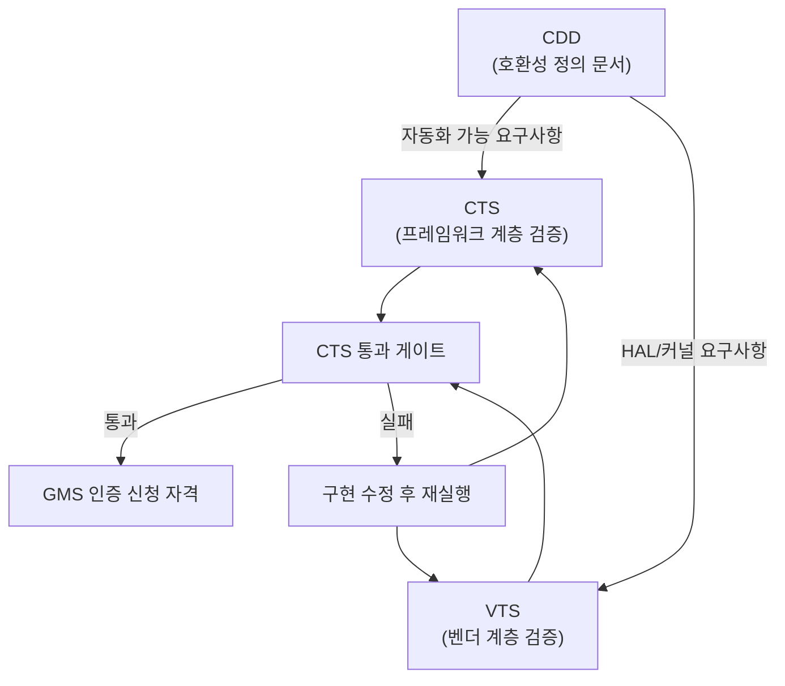

## 이 장을 읽기 전에

이 장은 [10장: 보안 구현](/post/android-hardware-development/security-implementation/)에서 다룬 부트 체인 무결성, SELinux 정책, 키 관리 구조가 이미 갖춰져 있다는 전제 위에서 출발한다. Verified Boot와 키스토어 격리가 왜 필요한지 모른다면 10장을 먼저 읽는 편이 낫다. 이 장이 다루는 난이도는 중급–전문가 구간이다 — CDD 문서를 읽고 요구사항을 해석하는 수준(중급)부터, CTS/VTS 실패 케이스를 원인 분석해 패치하고 지역별 인증 전략을 설계하는 수준(전문가)까지 폭넓게 걸쳐 있다.

이 장은 특정 국가의 인증 신청 서류를 대신 작성해주는 절차서가 아니다. RF 회로 설계 자체(안테나 튜닝, SAR 저감 설계)는 [01장: 하드웨어 기초](/post/android-hardware-development/hardware-fundamentals/)의 범위이고, 보안 취약점 대응의 세부 기술은 10장에서 다룬다. 이 장은 "왜 이런 인증 체계가 존재하고, 어떤 순서로 검증을 통과시켜야 제품 출시 일정이 지켜지는가"라는 프로세스와 판단 기준에 집중한다.

## 당신의 수준에 맞는 경로

| 수준 | 읽을 부분 | 핵심 목표 |
|---|---|---|
| 중급 (CDD/CTS 처음 접함) | 핵심 개념, 실전 적용의 CTS 실행 예제까지 | CDD-CTS-VTS 3단 구조를 이해하고 로컬에서 CTS를 실행할 수 있다 |
| 전문가 (인증 전략 수립) | 비교/트레이드오프, 흔한 오개념, 비판적 시각 전체 | GMS/전파 인증/개인정보보호 규제를 제품 로드맵에 맞춰 순서화하고, 인증 실패 리스크를 사전에 줄일 수 있다 |

## 도입

안드로이드 기기를 만드는 일과 안드로이드 기기를 *출시할 수 있는* 상태로 만드는 일은 서로 다른 문제다. 하드웨어가 정상 동작하고 앱이 잘 실행되더라도, 실제로 시장에 내놓으려면 세 겹의 관문을 통과해야 한다. 첫째는 구글이 정의한 소프트웨어·하드웨어 호환성 기준이고, 둘째는 각국 정부가 요구하는 전파·안전 인증이며, 셋째는 개인정보를 다루는 모든 제품에 적용되는 프라이버시 규제다. 이 세 관문은 서로 다른 기관이 서로 다른 기준으로 심사하지만, 실무에서는 하나의 릴리스 일정 안에서 동시에 관리해야 하는 종속 작업들이다.

이 주제가 실무에서 중요한 이유는 단순하다. 인증 실패는 코드 버그와 달리 발견 시점이 출시 직전이고, 재검증에 걸리는 시간이 짧게는 며칠에서 길게는 수개월이다. CTS 실패 하나가 릴리스 게이트를 막고, RF 인증 재시험이 하드웨어 리비전을 요구하고, 개인정보 처리 방침의 누락이 특정 국가에서의 판매 자체를 불가능하게 만들 수 있다. 하드웨어·플랫폼 엔지니어가 인증 요구사항을 개발 초기 단계부터 설계에 반영해야 하는 이유가 여기에 있다 — 인증은 출시 전 체크박스가 아니라, 아키텍처 결정에 영향을 미치는 제약 조건이다.

## 핵심 개념

### CDD: 호환성의 기준 문서

**CDD(Compatibility Definition Document, 호환성 정의 문서)**는 안드로이드 기기가 갖춰야 할 하드웨어·소프트웨어 요구사항을 산문(prose) 형태로 규정한 문서다. AOSP 소스만으로 빌드한 시스템이라 해도, CDD가 요구하는 API 노출 범위·하드웨어 기능 선언·성능 하한선을 만족하지 않으면 "안드로이드 호환 기기"로 인정받지 못한다. CDD는 안드로이드 메이저 버전마다 갱신되며, 이전 버전에서 "권장(SHOULD)"이었던 항목이 다음 버전에서 "필수(MUST)"로 격상되는 패턴이 반복된다. 예를 들어 카메라 HAL의 특정 기능이나 생체 인증 강도 등급처럼, 신규 폼팩터가 늘면서 새로운 하드웨어 카테고리에 대한 요구사항이 계속 추가된다.

CDD의 역할을 정확히 이해하려면 "왜 자동화된 테스트만으로는 부족한가"라는 질문에서 출발해야 한다. source.android.com의 CDD 개요 문서는 이 점을 명시적으로 밝히고 있는데, 아무리 방대한 테스트 스위트도 완전히 포괄적일 수 없기 때문에(no test suite can truly be comprehensive) CDD가 하드웨어 요구사항과 정책적 기준을 문서 형태로 별도 규정한다는 취지다. 즉 CTS는 CDD가 규정한 요구사항 중 자동으로 검증 가능한 부분만을 코드로 옮긴 것이고, CDD 자체는 그보다 넓은 범위 — 예를 들어 특정 시스템 앱을 사전 탑재해서는 안 된다는 정책적 제약이나, 특정 센서가 있다면 반드시 특정 정밀도를 만족해야 한다는 하드웨어 스펙 — 를 규정한다.

### CTS와 VTS: 두 층위의 자동 검증

**CTS(Compatibility Test Suite, 호환성 테스트 스위트)**는 CDD 요구사항 중 자동화 가능한 부분을 검증하는 무료 오픈소스 테스트 도구다. Trade Federation이라는 테스트 하네스 위에서 동작하며, API 시그니처 일치 여부, 플랫폼 기능 동작, Dalvik/ART 바이트코드 형식 준수, 콘텐츠 프로바이더·시스템 인텐트·권한 처리가 표준을 따르는지를 검사한다. CTS는 애플리케이션 프레임워크 계층, 즉 개발자가 `android.*` API를 통해 접하는 표면을 주로 검증한다.

**VTS(Vendor Test Suite, 벤더 테스트 스위트)**는 CTS보다 한 층 아래, HAL(Hardware Abstraction Layer)과 커널 인터페이스를 검증한다. VTS는 GTest 기반의 C++ 테스트로 HAL 구현체를 직접 호출해 검사하고, JUnit 기반의 호스트 구동 테스트로 커널 sysfs 인터페이스 같은 항목을 검증하며, Kselftest·Linux Test Project 같은 커널 표준 테스트도 포함한다. CTS가 "이 기기에서 개발자가 기대하는 API가 정확히 동작하는가"를 묻는다면, VTS는 "이 기기의 벤더 구현이 프레임워크가 기대하는 계약을 지키는가"를 묻는다. Treble 아키텍처 이후 프레임워크와 벤더 구현이 분리되면서, VTS는 벤더 이미지를 프레임워크 업그레이드와 독립적으로 검증하는 핵심 수단이 되었다.

두 테스트 스위트의 관계를 도식으로 정리하면 아래와 같다.



이 구조에서 실무적으로 중요한 점은, CTS/VTS 통과가 "안드로이드처럼 동작함"을 증명할 뿐 "구글 서비스를 탑재해도 됨"을 증명하지는 않는다는 것이다. AOSP만으로 빌드한 기기도 CTS/VTS를 통과할 수 있다. GMS는 별개의 상위 계층이다.

### GMS: 구글 모바일 서비스 탑재 절차

**GMS(Google Mobile Services)**는 Play 스토어, Google Play 서비스, Gmail 같은 구글 소유 애플리케이션·API 묶음을 가리킨다. AOSP는 오픈소스이므로 누구나 빌드해 배포할 수 있지만, GMS 앱과 API는 구글의 별도 라이선스 계약 없이는 기기에 탑재할 수 없다. 제조사가 GMS를 탑재하려면 우선 CTS/VTS를 통과해 해당 빌드가 안드로이드 호환 기기임을 증명해야 하고, 그 위에 구글이 정의한 브랜딩 가이드라인(부팅 로고, 기본 런처 배치, Play 스토어 노출 방식 등)을 준수해야 한다. 이 절차는 구글과 제조사 사이의 상업적 계약 관계이며, 특정 리전에서는 반독점 규제(예: 유럽연합의 모바일 애플리케이션 배포 규칙 변경) 영향으로 라이선싱 조건이 달라져 왔다는 점도 알아둘 필요가 있다 — 정확한 현재 조건은 리전과 시점에 따라 달라지므로, 이 문서에서 조건을 단정하지 않는다.

이 블로그는 개인 기술 블로그이며 구글·삼성·퀄컴과의 공식 제휴나 실제 인증 대행 자격을 가지고 있지 않다. 아래 설명은 공개된 절차 구조를 정리한 것이지, 특정 벤더의 실제 계약 조건을 대변하지 않는다.

### 전파 인증: FCC와 CE로 대표되는 지역별 체계

무선 통신 모듈(Wi-Fi, 블루투스, 셀룰러)을 탑재한 기기는 국가별 전파 규제 기관의 인증 없이는 해당 국가에서 판매·수입할 수 없다. **FCC(Federal Communications Commission, 미국 연방통신위원회) 인증**은 미국에서 판매되는 무선 기기가 지정된 주파수 대역 밖으로 전자파를 방출하지 않는지, SAR(Specific Absorption Rate, 전자파 인체 흡수율)가 허용 기준을 넘지 않는지를 검증한다. 인증 절차는 기기의 무선 특성에 따라 Certification(공인 시험소 시험 후 FCC 승인), DoC(Declaration of Conformity, 자가 선언), Verification(자가 검증) 세 방식으로 나뉘며, 셀룰러 모듈처럼 간섭 가능성이 큰 부품은 가장 엄격한 Certification 절차를 거친다.

**CE(Conformité Européenne) 마킹**은 유럽경제지역(EEA)에서 판매되는 제품이 안전·보건·환경 보호 요구사항을 충족한다는 제조사의 선언 표시다. 유럽연합 집행위원회 산하 내부시장총국이 관리하는 공식 설명에 따르면, CE 마킹은 EEA 역내에서 거래되는 다수 제품에 표시되며 "높은 안전, 보건, 환경 보호 요구사항을 충족한다고 평가되었음을 의미"한다. 무선 기기는 RED(Radio Equipment Directive, 무선기기지침)의 적용을 받아 전자파 적합성(EMC)과 무선 성능 요구사항을 함께 만족해야 한다. CE는 미국의 FCC와 달리 정부 기관의 사전 승인이 아니라 제조사의 자기 선언(self-declaration) 구조에 가깝다는 점이 근본적인 차이다 — 다만 무선기기지침처럼 위해도가 높은 범주는 공인 기관(Notified Body)의 개입이 요구되는 경우도 있다.

이 두 체계 외에도 한국의 KC 인증(전자파적합성·전기용품안전 통합), 일본의 TELEC(電波法 기반 기술기준적합증명), 중국의 CCC, 인도의 BIS-WPC, 브라질의 ANATEL처럼 각국이 독자적인 전파·안전 인증 체계를 운영한다. 이들 인증의 공통 원리는 같다 — 무선 송신 특성이 지역 주파수 배분 계획과 충돌하지 않아야 하고, 인체 노출 전자파가 안전 기준 이내여야 한다 — 하지만 시험 항목, 소요 기간, 자가 선언 허용 여부는 국가마다 크게 다르므로 목표 출시국이 정해지면 해당 국가의 규제 기관 문서를 개별적으로 확인해야 한다.

### 개인정보보호 규제 대응

안드로이드 기기와 그 위에서 동작하는 프리로드 앱은 필연적으로 위치, 광고 식별자, 생체 데이터, 사용 로그 같은 개인정보를 다룬다. **GDPR(General Data Protection Regulation, EU 일반 개인정보보호규정)**은 유럽 사용자의 데이터를 처리하는 모든 제품에 적용되며, 데이터 최소 수집·목적 제한·사용자 동의·삭제권 보장을 요구한다. 안드로이드 플랫폼 차원에서는 developer.android.com의 프라이버시 가이드가 명시하듯, 런타임 권한 모델을 통해 앱이 필요한 권한만 요청하도록 하고, 백그라운드 위치 접근을 별도 승인 단계로 분리하며, 패키지 가시성(package visibility) 제한으로 기기에 설치된 다른 앱 목록을 함부로 열람하지 못하게 한다. 이러한 플랫폼 기능은 규제 준수를 자동으로 보장하지는 않지만, 벤더가 프리로드 앱을 설계할 때 활용해야 하는 도구다.

제조사·벤더 관점에서 개인정보보호 대응은 크게 두 축으로 나뉜다. 하나는 플랫폼 설정값(기기 식별자 노출 범위, 진단 로그 수집 정책, 프리로드 앱의 데이터 수집 범위)을 규제가 요구하는 수준으로 맞추는 것이고, 다른 하나는 사용자에게 제공하는 개인정보 처리방침·동의 화면이 실제 데이터 처리 관행과 일치하도록 문서화하는 것이다. 두 축이 어긋나면 — 예컨대 처리방침에는 없다고 적어둔 데이터를 실제로는 수집하는 경우 — 기술적으로는 문제가 없어도 규제 위반이 성립한다.

## 비교/트레이드오프

인증 항목마다 검증 주체, 소요 기간, 실패 시 재작업 범위가 크게 다르다. 아래 표는 이 장에서 다룬 네 가지 인증 축을 실무 관점에서 비교한 것이다.

| 인증 축 | 검증 주체 | 검증 대상 | 실패 시 재작업 범위 | 자동화 가능 여부 |
|---|---|---|---|---|
| CDD/CTS | 자체(사전 검증) + 구글(GMS 신청 시 교차 확인) | 프레임워크 API 동작 | 대체로 소프트웨어 패치로 해결 | 대부분 자동화 가능 |
| VTS | 자체(사전 검증) | HAL/커널 인터페이스 | HAL 구현 또는 커널 드라이버 수정 필요 | 대부분 자동화 가능 |
| GMS | 구글 | 브랜딩·라이선스 준수 | 계약 재협상, 빌드 재구성 | 부분적(체크리스트 수준) |
| 전파 인증(FCC/CE 등) | 정부·공인 시험소 | RF 물리 특성, SAR | 안테나·RF 회로 리비전 필요 시 하드웨어 재설계 | 자동화 불가(실물 시험 필수) |
| 개인정보보호(GDPR 등) | 규제 기관, 사후 감사 | 데이터 처리 관행 전체 | 정책·코드·문서 동시 수정, 소급 적용 이슈 발생 가능 | 자동화 불가(법적 판단 개입) |

이 표에서 눈여겨볼 지점은 재작업 범위가 뒤로 갈수록 커진다는 것이다. CTS 실패는 보통 릴리스 빌드 안에서 해결되지만, RF 인증 실패가 안테나 설계 결함에서 비롯되면 하드웨어 리비전과 재시험이 필요해 수 주에서 수개월이 소요될 수 있다. 따라서 실무에서는 자동화 가능한 CTS/VTS를 개발 초기부터 CI에 통합해 지속적으로 돌리고, 자동화 불가능한 RF 인증과 개인정보보호 검토는 하드웨어 설계가 확정되는 시점과 프리로드 앱 기획 시점에 맞춰 최대한 일찍 착수하는 순서가 합리적이다. RF 인증을 개발 후반부로 미루는 것은 가장 흔한 일정 리스크 중 하나다 — 안테나 설계는 산업 디자인(케이스 형상)과 강하게 결합되어 있어서, 뒤늦게 SAR 기준을 넘는다는 사실을 발견하면 산업 디자인 자체를 되돌려야 하는 경우가 생긴다.

## 실전 적용

로컬 개발 환경에서 CTS를 실행하는 절차를 살펴본다. 실제 인증 제출용 결과가 아니더라도, 개발 중인 빌드가 CDD 요구사항에서 얼마나 벗어나 있는지 조기에 파악하려면 CTS를 CI 파이프라인에 통합하는 것이 정석이다. CTS는 Trade Federation(`tradefed`) 하네스와 테스트 패키지(`android-cts.zip`)로 구성되며, source.android.com이 배포하는 사전 빌드 패키지를 내려받거나 AOSP 소스에서 `cts` 타겟을 직접 빌드해 얻는다.

```bash
# CTS 사전 빌드 패키지 압축 해제 후 실행 디렉터리로 이동
unzip android-cts.zip -d cts_workspace
cd cts_workspace/android-cts/tools

# 연결된 디바이스 확인 (adb 필요)
adb devices

# CTS 콘솔 실행 후 특정 모듈만 지정해 테스트
./cts-tradefed
```

CTS 콘솔에 진입한 뒤에는 `run cts --module CtsPermissionTestCases`처럼 특정 모듈을 지정해 부분 실행할 수 있고, 결과는 `results/` 디렉터리에 XML/HTML 리포트로 저장된다. 전체 CTS는 수만 개 테스트 케이스로 구성되어 완주에 여러 시간이 걸리므로, 개발 중에는 변경 사항과 관련된 모듈만 선택 실행하고 릴리스 후보 빌드에서만 전체 스위트를 돌리는 방식이 현실적이다.

CTS 결과에서 특정 테스트가 실패했을 때, 원인이 프레임워크 커스터마이징인지 아니면 실제 버그인지 구분하는 절차가 중요하다. 예를 들어 권한 관련 테스트가 실패했다면, 벤더가 커스텀 시스템 앱에 기본 권한을 부여한 것이 CDD가 금지하는 "사용자 동의 없는 권한 사전 승인"에 해당하는지를 먼저 확인해야 한다. 아래는 그런 상황을 코드 레벨에서 점검하는 예시로, AOSP의 권한 화이트리스트 설정 파일(`privapp-permissions-*.xml`) 형태를 보여준다. 이는 실제 XML 스키마를 따르는 설정 예시이며, 개념만 보여주는 의사코드가 아니다.

```xml
<?xml version="1.0" encoding="utf-8"?>
<permissions>
    <privapp-permissions package="com.example.oem.systemapp">
        <permission name="android.permission.WRITE_SECURE_SETTINGS"/>
        <permission name="android.permission.MANAGE_USB"/>
    </privapp-permissions>
</permissions>
```

이 설정 파일은 `/system/etc/permissions/` 아래 배치되어, 지정한 특권 앱(privileged app)에게 일반 앱은 요청할 수 없는 서명·시스템 수준 권한을 부여한다. CDD는 특권 권한 부여가 정당한 시스템 기능(예: OEM 진단 도구)에 한정되어야 한다고 요구하므로, CTS의 `CtsPermissionTestCases` 모듈은 이 화이트리스트에 부적절한 권한이 포함되지 않았는지를 검사한다. 권한을 과도하게 부여하면 CTS 실패로 이어질 뿐 아니라, 개인정보보호 감사에서도 지적 대상이 된다 — 두 검증 축이 같은 설정 파일을 서로 다른 이유로 검토하는 셈이다.

## 흔한 오개념

**CTS를 통과하면 안드로이드 인증이 완료된다는 오해**가 가장 흔하다. CTS/VTS 통과는 CDD가 규정한 호환성 요구사항 중 자동화 가능한 부분을 만족했다는 뜻일 뿐이며, GMS 라이선스, 전파 인증, 개인정보보호 규제는 완전히 별개의 절차다. CTS만 통과한 기기는 "안드로이드 호환 기기"이지 "구글 서비스가 탑재된 기기"나 "미국·유럽에서 판매 가능한 기기"가 아니다.

**전파 인증이 소프트웨어와 무관한 하드웨어 이슈라는 오해**도 자주 발생한다. 실제로는 무선 드라이버의 송신 출력 제어 로직, 국가별 채널 제한 테이블, 절전 모드에서의 송신 타이밍 같은 소프트웨어 요소가 SAR 측정값과 간섭 특성에 직접 영향을 준다. 동일한 하드웨어라도 펌웨어 설정에 따라 인증 시험 결과가 달라질 수 있으므로, RF 인증은 하드웨어 팀만의 책임이 아니라 드라이버·펌웨어 팀과의 공동 작업이다.

**개인정보보호 규제 준수를 개인정보 처리방침 문서 작성으로 착각하는 오해**도 흔하다. 처리방침 문서는 실제 데이터 처리 관행을 설명하는 결과물일 뿐, 그 자체로 규제 준수를 만들어내지 않는다. 프리로드 앱이 문서에 명시하지 않은 데이터를 수집하거나, 사용자가 거부한 이후에도 계속 수집한다면 문서의 존재 여부와 무관하게 위반이다. 규제 준수는 데이터 흐름 설계 단계에서 시작해야 하며, 문서화는 그 설계를 정확히 반영하는 마지막 단계다.

## 비판적 시각

CDD/CTS/VTS 체계는 안드로이드 생태계의 파편화(fragmentation)를 억제하는 데 실질적으로 기여했지만, 동시에 소규모 제조사나 실험적 폼팩터에는 진입장벽으로 작용한다는 비판도 꾸준히 제기되어 왔다. CDD가 매 버전 요구사항을 늘려가는 방향으로 진화하면서, 자원이 제한된 팀은 CTS 통과 자체에 개발 역량 상당 부분을 소모하게 된다. 이는 "호환성 보장"과 "혁신 여지 축소"라는 두 가치가 근본적으로 긴장 관계에 있다는 것을 보여준다 — CDD가 느슨하면 앱 개발자가 기기마다 다르게 동작하는 API에 대응해야 하고, CDD가 엄격하면 제조사의 차별화 여지가 줄어든다.

GMS 라이선싱 구조에 대해서도 반독점 관점의 비판이 있어 왔다. 구글이 GMS 탑재 조건으로 특정 앱의 기본 설정이나 번들링을 요구했던 관행은 여러 지역에서 규제 조사와 제도 변경의 대상이 되었다. 다만 이 문서 작성 시점 기준으로 리전별 정확한 라이선싱 조건과 규제 결과는 계속 변화하는 사안이므로, 실제 계약을 진행할 때는 반드시 최신 공식 문서와 법률 자문을 통해 확인해야 하며 이 글의 서술을 계약 조건의 근거로 삼아서는 안 된다.

전파 인증과 개인정보보호 규제는 국가마다 요구 수준과 절차가 크게 달라, "글로벌 표준 하나로 인증하면 끝"이라는 접근이 성립하지 않는다는 점도 비판적으로 볼 지점이다. CE 마킹처럼 자기 선언에 가까운 체계가 있는가 하면, FCC Certification처럼 공인 시험소의 사전 승인이 필수인 체계도 있다. 이 비대칭성 때문에 글로벌 출시를 목표로 하는 제품일수록 인증 전략을 국가별로 세분화해서 수립해야 하고, "가장 엄격한 기준 하나로 모든 지역을 커버한다"는 가정은 실제로는 성립하지 않는 경우가 많다 — 어떤 기준을 충족했다고 해서 다른 관할권의 절차적 요구사항(서류 제출 방식, 현지 대리인 지정 등)까지 자동으로 충족되는 것은 아니기 때문이다.

## 다음 장에서는

[12장: 안드로이드 애플리케이션 개발](/post/android-hardware-development/android-application-development/)에서는 이 장에서 다룬 인증·컴플라이언스 요구사항을 충족한 하드웨어 플랫폼 위에서, 실제 애플리케이션을 어떻게 설계하고 최적화하는지를 다룬다.

## 평가 기준

이 장을 읽은 후 다음을 할 수 있어야 한다.

- CDD, CTS, VTS 세 가지가 각각 무엇을 검증하는지 구분해서 설명할 수 있다.
- CTS 통과와 GMS 인증, 전파 인증, 개인정보보호 규제 준수가 서로 독립적인 절차임을 설명할 수 있다.
- 로컬 환경에서 CTS를 실행하고 특정 모듈의 실패 원인을 privapp-permissions 설정 같은 실제 원인으로 추적할 수 있다.
- FCC의 공인 시험소 승인 방식과 CE의 자기 선언 방식이 어떻게 다른지 설명할 수 있다.
- 인증 실패의 재작업 비용이 인증 축마다 다르다는 점을 근거로, 어떤 인증을 개발 초기에 착수해야 하는지 판단할 수 있다.
- 개인정보 처리방침 문서 작성과 실제 데이터 흐름 설계 준수가 별개의 작업임을 설명할 수 있다.

## 참고 및 출처

- Android Open Source Project, ["Compatibility Definition Document"](https://source.android.com/docs/compatibility/cdd), source.android.com.
- Android Open Source Project, ["Compatibility Test Suite (CTS)"](https://source.android.com/docs/compatibility/cts), source.android.com.
- Android Open Source Project, ["Vendor Test Suite (VTS)"](https://source.android.com/docs/core/tests/vts), source.android.com.
- Android Developers, ["Privacy"](https://developer.android.com/privacy), developer.android.com.
- European Commission, Directorate-General for Internal Market, Industry, Entrepreneurship and SMEs, ["CE marking"](https://single-market-economy.ec.europa.eu/single-market/ce-marking_en), single-market-economy.ec.europa.eu.
