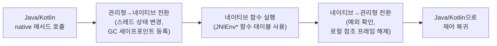

## 이 장을 읽기 전에

이 장은 [13장: AOSP 빌드 시스템 및 개발 도구](/post/android-hardware-development/aosp-build-system/)에서 다룬 Soong/Blueprint 기반 AOSP 빌드 지식을 전제로 하지 않는다 — 여기서 다루는 NDK 빌드는 AOSP 소스 트리 밖, 즉 일반 Android Studio 프로젝트(Gradle)에서 C/C++ 라이브러리를 앱에 포함시키는 흐름이다. 다만 13장에서 다룬 "소스가 오브젝트 파일을 거쳐 실행 파일이 되는 과정"에 대한 감각은 이 장의 크로스 컴파일 설명을 이해하는 데 도움이 된다. 난이도는 중급–고급이다. Java 또는 Kotlin으로 안드로이드 앱을 작성해본 경험과 C/C++의 포인터·메모리 레이아웃에 대한 기초 지식을 전제로 서술한다.

이 장은 OpenGL ES·Vulkan 렌더링 파이프라인이나 미디어 코덱처럼 네이티브 계층 위에서 동작하는 특정 도메인 API는 다루지 않는다 — 그래픽·미디어 프레임워크는 15장에서 별도로 다룬다. 또한 TensorFlow Lite 같은 온디바이스 머신러닝 프레임워크의 텐서 연산 최적화도 이 장의 범위 밖이며, 이는 16장에서 다룬다. 이 장의 초점은 "Java/Kotlin 코드와 C/C++ 코드가 정확히 무엇을 통해, 어떤 비용을 치르며 서로를 호출하는가"라는 NDK/JNI 고유의 메커니즘에 있다.

## 당신의 수준에 맞는 경로

| 수준 | 읽을 부분 | 핵심 목표 |
|:--:|:--|:--|
| 입문자 | "왜 네이티브 개발을 이해해야 하는가"부터 "핵심 개념"까지 | NDK가 무엇을 가능하게 하는지, JNI 브리지가 왜 필요한지 설명할 수 있다 |
| 중급자 | "비교와 트레이드오프", "실전 적용" | CMake와 ndk-build 중 상황에 맞는 선택을 하고, JNI 호출 오버헤드를 줄이는 코드를 읽고 쓸 수 있다 |
| 실무자 | "흔한 오개념", "비판적 시각" | 언제 네이티브 계층을 도입할 가치가 있는지, 그 대가로 무엇을 잃는지 판단할 수 있다 |

## 왜 네이티브 개발을 이해해야 하는가

안드로이드 앱 개발자 대부분은 Java/Kotlin만으로 앱 수명 주기를 마친다. 그럼에도 NDK와 JNI를 이해해야 하는 이유는 세 갈래로 나뉜다. 첫째, 이미지·오디오·물리 시뮬레이션처럼 연산 집약적인 코드는 C/C++로 작성된 기존 라이브러리(OpenCV, FFmpeg, 게임 엔진 등)의 자산을 그대로 재사용할 수 있을 때가 많고, 이를 Java/Kotlin으로 다시 구현하는 것은 현실적이지 않다. 둘째, 크로스 플랫폼 팀에서는 핵심 비즈니스 로직을 C++로 한 번 작성해 iOS·Android·데스크톱이 공유하는 구조를 택하기도 한다. 셋째, 안드로이드 프레임워크 자체가 HAL·Binder·미디어 스택 상당 부분을 네이티브 코드로 구현하고 있으므로(1–13장에서 다룬 내용 대부분이 실제로는 C/C++ 계층이다), 프레임워크 내부를 정확히 이해하려면 JNI가 이 두 세계를 어떻게 잇는지 알아야 한다.

다만 네이티브 계층은 공짜로 얻어지지 않는다. JNI 경계를 넘나드는 호출에는 순수 Java/Kotlin 함수 호출에는 없는 고유한 비용이 붙고, 이 비용을 이해하지 못한 채 무분별하게 네이티브 계층을 오가면 오히려 순수 Java/Kotlin 구현보다 느려지는 경우가 드물지 않다. 이 장에서는 NDK의 전체 구조를 먼저 파악한 뒤, JNI가 실제로 어떤 메커니즘으로 두 언어를 잇는지, 빌드 시스템과 ABI가 그 결과물을 어떻게 생성하는지, 그리고 마지막으로 JNI 호출 비용이 어디서 발생하고 어떻게 줄이는지를 순서대로 다룬다.

## 핵심 개념

### NDK란 무엇인가

<strong>NDK(Native Development Kit)</strong>는 안드로이드 앱에서 C/C++로 작성한 코드를 컴파일·링크·패키징할 수 있게 해주는 도구 모음으로, 크로스 컴파일 툴체인(Clang/LLVM 기반), 각 ABI별 표준 C 라이브러리(Bionic)와 표준 C++ 라이브러리(libc++), 그리고 카메라·센서·오디오 같은 하드웨어 자원에 네이티브 코드에서 직접 접근할 수 있는 안정화된 헤더 세트를 함께 제공한다. NDK로 만든 결과물은 최종적으로 공유 라이브러리(`.so`, ELF 포맷)이며, 이 `.so`는 APK 또는 Android App Bundle(AAB) 안에 ABI별 디렉터리로 묶여 패키징된다.

NDK가 앱 안에서 차지하는 위치를 정확히 이해하려면, 네이티브 코드가 Java/Kotlin 코드와 "같은 프로세스, 다른 실행 계층"이라는 점을 짚어야 한다. 안드로이드 앱 프로세스 하나에는 ART(Android Runtime) 인스턴스가 하나 떠 있고, 그 위에서 앱의 Java/Kotlin 바이트코드가 관리형(managed) 코드로 실행된다. 앱이 `System.loadLibrary()`를 호출해 `.so`를 로드하면, 같은 프로세스의 주소 공간에 네이티브 코드가 매핑되고 이때부터 관리형 스택과 네이티브 스택이 같은 프로세스 안에서 공존한다. 즉 NDK는 별도의 프로세스나 샌드박스를 만드는 것이 아니라, 같은 프로세스 안에 두 개의 실행 모델(가비지 컬렉션이 관리하는 ART 관리형 코드와, 개발자가 메모리를 직접 관리하는 네이티브 코드)을 공존시키는 기술이다. 이 두 세계 사이의 유일한 공식 통로가 다음 절에서 다루는 JNI다.

### JNI 브리지의 동작 원리

<strong>JNI(Java Native Interface)</strong>는 JVM 계열 런타임(안드로이드에서는 ART)이 네이티브 코드와 함수를 서로 호출하고 데이터를 주고받기 위해 정의한 표준 인터페이스로, 원래 JDK 1.1에서 정의된 사양을 ART가 구현한 것이다. JNI를 이해하는 가장 실용적인 방법은 "네이티브 메서드가 어떻게 발견되는가"와 "데이터가 어떻게 두 세계를 오가는가"라는 두 질문으로 나누는 것이다.

네이티브 메서드가 Java/Kotlin `native` 선언과 실제 C/C++ 함수를 연결하는 방식은 두 가지다. 첫 번째는 <strong>동적 심볼 검색(lazy binding)</strong>으로, ART가 `native` 메서드를 처음 호출할 때 `Java_<패키지_클래스명>_<메서드명>` 형태의 이름 규칙에 따라 로드된 `.so`에서 해당 심볼을 찾는다. 이 방식은 구현이 간단하지만, 클래스 이름에 언더스코어나 유니코드 문자가 있으면 이름이 복잡한 이스케이프 규칙을 따라야 하고, 첫 호출마다 심볼 테이블을 뒤지는 비용이 든다. 두 번째는 <strong>명시적 등록(RegisterNatives)</strong>으로, 라이브러리가 로드되는 시점에 자동 호출되는 `JNI_OnLoad()` 함수 안에서 `RegisterNatives()`를 호출해 Java 메서드 시그니처와 C/C++ 함수 포인터를 담은 테이블을 한 번에 등록한다. 이 방식은 함수 이름을 자유롭게 지을 수 있고 런타임 심볼 검색 비용도 없앨 수 있어, 실무에서 규모 있는 네이티브 라이브러리는 대부분 이 방식을 쓴다.

두 세계 사이의 실제 호출은 **JNIEnv**라는 스레드-로컬 포인터를 통해 이뤄진다. JNIEnv는 클래스 탐색, 메서드/필드 접근, 객체 생성, 예외 처리 같은 JNI 함수들의 포인터 테이블을 가리키며, 스레드마다 별도의 JNIEnv 인스턴스를 가지므로 한 스레드에서 얻은 JNIEnv 포인터를 다른 스레드에 넘겨 쓰면 안 된다. 네이티브 코드에서 새로 만든 pthread가 JNI 함수를 호출해야 한다면, 그 스레드는 먼저 `JavaVM::AttachCurrentThread()`로 ART에 스레드를 등록해 자신만의 JNIEnv를 얻어야 하고, 작업이 끝나면 `DetachCurrentThread()`로 등록을 해제해야 한다.

JNI를 거쳐 자바 객체를 참조할 때는 참조의 생명주기를 구분해야 한다. 네이티브 메서드 안에서 `NewObject()`나 배열 접근 함수가 돌려주는 `jobject`는 기본적으로 <strong>로컬 참조(Local Reference)</strong>로, 현재 네이티브 메서드 호출이 끝나 관리형 코드로 복귀하는 시점에 자동으로 해제된다. 로컬 참조를 하나의 네이티브 메서드 호출을 넘어 유지하고 싶다면 `NewGlobalRef()`로 <strong>글로벌 참조(Global Reference)</strong>를 만들어야 하며, 이 참조는 `DeleteGlobalRef()`를 명시적으로 호출할 때까지 유효하다. 글로벌 참조가 가리키는 객체가 GC 대상이 되어도 무방하다면(예: 캐시 용도) `NewWeakGlobalRef()`로 <strong>약한 글로벌 참조(Weak Global Reference)</strong>를 만들 수 있는데, 이 경우 사용 전마다 객체가 아직 살아 있는지 확인하는 절차가 필요하다. 이 세 참조 유형의 생명주기 차이는 다음 절의 표에서 정리한다.

이 전체 흐름을 관리형-네이티브 경계를 넘나드는 관점에서 도식화하면 다음과 같다.



이 두 전환 구간(`transition1`, `transition2`)이 바로 이후 "실전 적용"에서 다룰 JNI 호출 오버헤드의 근원이다.

### 빌드 시스템: CMake와 ndk-build

NDK 코드를 실제 `.so`로 만드는 빌드 시스템은 두 가지가 공식 지원된다. **CMake**는 크로스 플랫폼 빌드 도구로, NDK가 제공하는 `android.toolchain.cmake` 툴체인 파일을 통해 `ANDROID_ABI`, `ANDROID_PLATFORM`, `ANDROID_STL` 같은 변수로 타겟 ABI·최소 API 레벨·표준 라이브러리 종류를 지정한다. **ndk-build**는 더 오래된 빌드 시스템으로, GNU Make 문법을 따르는 `Android.mk`(모듈 정의)와 `Application.mk`(전역 설정)라는 두 파일로 구성된다. 두 시스템 모두 최종적으로는 Clang/LLVM 툴체인을 호출해 ABI별 오브젝트 파일을 생성하고 링크하므로, 생성되는 `.so`의 성능 자체에는 차이가 없다 — 차이는 빌드 스크립트를 작성하고 유지보수하는 경험에 있다.

Gradle 프로젝트에서 CMake를 연결하는 최소 구성은 `build.gradle`의 `externalNativeBuild` 블록과 `CMakeLists.txt` 한 쌍으로 이뤄진다.

```groovy
android {
    defaultConfig {
        externalNativeBuild {
            cmake {
                cppFlags "-std=c++17"
                abiFilters "armeabi-v7a", "arm64-v8a", "x86_64"
            }
        }
    }
    externalNativeBuild {
        cmake {
            path "src/main/cpp/CMakeLists.txt"
            version "3.22.1"
        }
    }
}
```

`CMakeLists.txt`는 다음과 같이 소스 파일을 모듈로 묶고 필요한 시스템 라이브러리를 링크한다.

```cmake
cmake_minimum_required(VERSION 3.22.1)
project("imageprocessor")

add_library(imageprocessor SHARED
    src/main/cpp/image_processor.cpp)

find_library(log-lib log)

target_link_libraries(imageprocessor
    ${log-lib}
    android)
```

`abiFilters`에 지정한 각 ABI마다 이 빌드가 독립적으로 실행되어 `armeabi-v7a/libimageprocessor.so`, `arm64-v8a/libimageprocessor.so`처럼 ABI별 디렉터리에 결과물이 생성되고, 이것이 그대로 APK/AAB에 패키징된다. 두 빌드 시스템의 실무적 선택 기준은 다음 절의 비교 표에서 다룬다.

### ABI: 어떤 CPU 명령어 집합을 타겟팅할 것인가

<strong>ABI(Application Binary Interface)</strong>는 컴파일된 바이너리가 특정 CPU 아키텍처·운영체제 조합에서 동작하기 위해 지켜야 하는 저수준 규약으로, 명령어 집합(instruction set), 함수 호출 규약(레지스터로 인자를 넘길지 스택으로 넘길지), 데이터 타입의 크기와 정렬(alignment) 규칙을 포함한다. 안드로이드 NDK가 공식 지원하는 ABI는 32비트 ARM용 `armeabi-v7a`, 64비트 ARM용 `arm64-v8a`, 32비트 x86용 `x86`, 64비트 x86용 `x86_64` 네 가지다. 소스 코드 자체는 ABI마다 같더라도, ABI별로 완전히 별도의 `.so`를 빌드해야 한다 — Java 바이트코드처럼 런타임에 한 번 컴파일된 결과물을 여러 CPU가 공유할 수 없기 때문이다.

`arm64-v8a`는 현재 유통되는 안드로이드 기기 대부분이 탑재한 64비트 ARM 코어를 타겟팅하며, NEON SIMD 명령어를 기본으로 사용할 수 있어 이미지·오디오 처리 같은 연산 집약적 코드에서 성능 이점이 크다. `armeabi-v7a`는 구형 32비트 ARM 기기를 위한 하위 호환용으로, 최신 하이엔드 기기 대상 앱이라면 굳이 포함할 필요가 없는 경우가 많다. `x86`/`x86_64`는 인텔 기반 태블릿이나(현재는 드물다) 안드로이드 에뮬레이터를 위해 필요하다 — 에뮬레이터에서 네이티브 라이브러리를 테스트하려면 호스트 PC 아키텍처와 일치하는 `x86_64` 빌드가 있어야 ARM 명령어 에뮬레이션으로 인한 속도 저하 없이 테스트할 수 있다. 어떤 ABI를 포함할지는 Play Console의 App Bundle 배포 방식(기기별로 필요한 ABI의 `.so`만 내려받는 분할 배포)과 맞물려 결정하는 것이 실무적으로 유리하며, 무조건 네 ABI를 모두 포함시키면 APK/AAB 용량만 불필요하게 늘어난다.

## 비교와 트레이드오프

빌드 시스템 선택은 프로젝트의 이력에 크게 좌우된다. 신규 프로젝트라면 Google이 현재 권장하는 CMake를 기본으로 고려하는 것이 합리적이고, 이미 `Android.mk`로 작성된 서드파티 C/C++ 라이브러리를 그대로 가져다 쓰는 상황이라면 ndk-build를 유지하는 편이 마이그레이션 비용을 줄인다.

| 항목 | CMake | ndk-build |
|:--|:--|:--|
| 설정 파일 | `CMakeLists.txt` (CMake 문법) | `Android.mk` + `Application.mk` (GNU Make 문법) |
| 생태계 | 크로스 플랫폼 표준, IDE(CLion, Android Studio) 통합 우수 | 안드로이드 전용, 오래된 NDK 샘플·서드파티 라이브러리 다수가 이 형식 |
| 디버깅/코드 인덱싱 | Android Studio의 네이티브 디버거·코드 완성과 밀접하게 통합 | 상대적으로 IDE 지원이 약함 |
| 신규 프로젝트 권장도 | 공식 권장, 최신 NDK 문서 대부분이 CMake 기준으로 작성됨 | 레거시 유지보수 목적이 아니면 신규 채택 이유가 적음 |
| 최종 산출물 | Clang/LLVM 툴체인이 생성하는 ABI별 `.so` (CMake와 동일) | Clang/LLVM 툴체인이 생성하는 ABI별 `.so` (ndk-build와 동일) |

JNI 참조 유형의 선택도 마찬가지로 트레이드오프다. 세 참조 유형은 생명주기 관리 책임과 GC 상호작용 방식이 서로 다르며, 이 차이를 잘못 이해하면 메모리 누수나 댕글링 참조로 이어진다.

| 참조 유형 | 생성 함수 | 생명주기 | 주 용도 |
|:--|:--|:--|:--|
| 로컬 참조 | `NewLocalRef()` 또는 JNI 함수의 반환값 | 현재 네이티브 메서드가 반환할 때 자동 해제(로컬 참조 프레임 pop) | 한 번의 JNI 호출 안에서만 쓰는 임시 객체 참조 |
| 글로벌 참조 | `NewGlobalRef()` | `DeleteGlobalRef()`를 호출할 때까지 유지, GC 대상에서 제외 | 콜백 리스너, 여러 호출에 걸쳐 유지해야 하는 캐시된 클래스/객체 |
| 약한 글로벌 참조 | `NewWeakGlobalRef()` | `DeleteWeakGlobalRef()`까지 유지되지만 GC 대상이 될 수 있음 | 순환 참조를 피해야 하는 캐시, 대상 객체 생존이 보장되지 않아도 되는 경우 |

로컬 참조는 개발자가 신경 쓰지 않아도 함수가 끝나면 정리되지만, 하나의 네이티브 메서드 안에서 반복문을 돌며 로컬 참조를 계속 새로 만들면 기본 로컬 참조 테이블 용량(구현·버전에 따라 다르며 일반적으로 수백 개 수준)을 넘겨 `JNI ERROR: local reference table overflow` 예외가 발생할 수 있다. 이 경우 반복문 안에서 `DeleteLocalRef()`로 즉시 해제하거나 `PushLocalFrame()`/`PopLocalFrame()`으로 로컬 참조 프레임을 명시적으로 관리해야 한다. 글로벌 참조는 명시적 해제 책임이 개발자에게 있으므로, 콜백 객체처럼 오래 유지해야 하는 참조에만 제한적으로 쓰고 필요 없어지는 즉시 해제하는 규율이 필요하다.

## 실전 적용: JNI 호출 오버헤드 측정과 최소화

시나리오를 하나 설정해 보자. 카메라 프리뷰 프레임을 실시간으로 그레이스케일로 변환하는 이미지 처리 라이브러리를 만드는데, 초기 구현은 픽셀 하나마다 네이티브 메서드를 호출하도록 작성했더니 프레임레이트가 눈에 띄게 떨어졌다. 이 절에서는 왜 이런 일이 벌어지는지, 그리고 어떻게 고치는지를 단계별로 살펴본다.

가장 먼저 문제가 되는 구현은 다음과 같다. Java 쪽에서 픽셀 배열을 순회하며 픽셀마다 네이티브 메서드를 호출한다.

```java
public class ImageProcessor {
    static {
        System.loadLibrary("imageprocessor");
    }

    public static native int nativeToGray(int rgb);

    public static void toGraySlow(int[] pixels, int[] outGray) {
        for (int i = 0; i < pixels.length; i++) {
            // 픽셀 수만큼 JNI 전환이 반복된다 (예: 1920x1080 프레임이면
            // 프레임 한 장마다 약 200만 번의 관리형↔네이티브 전환 발생)
            outGray[i] = nativeToGray(pixels[i]);
        }
    }
}
```

이 코드가 느린 이유는 앞서 살펴본 "관리형→네이티브 전환"과 "네이티브→관리형 전환"이 픽셀마다 반복되기 때문이다. 각 전환마다 ART는 스레드 상태를 전환하고(실행 중인 네이티브 코드는 GC가 스택을 훑을 수 없으므로 GC 세이프포인트 등록·해제가 필요하다), 인자를 JNI 호출 규약에 맞게 마셜링하며, 함수가 반환되면 대기 중인 예외가 있는지 확인한다. 이 비용은 픽셀당 처리 자체(비트 시프트 몇 번)보다 훨씬 크므로, 200만 번의 전환 비용이 실제 연산 비용을 압도해 버린다.

해결 방법은 "JNI 전환 횟수를 줄이는 것"이다 — 픽셀 하나마다 경계를 넘는 대신, 배열 전체를 한 번의 호출로 네이티브 쪽에 넘기고 반복문 자체를 네이티브 코드 안에서 돈다. 이때 자바 배열 원소에 접근하는 방법도 성능에 영향을 준다. `GetIntArrayRegion()`은 항상 네이티브 버퍼로 복사를 수행하는 안전한 방법이고, `GetPrimitiveArrayCritical()`은 구현에 따라 복사 없이 JVM 힙의 배열을 직접 가리키는 포인터를 돌려줄 수 있어 더 빠르지만, 이 포인터를 쥐고 있는 동안에는 다른 JNI 호출이나 블로킹 작업을 하면 안 된다는 제약이 따른다 — GC가 그 시간 동안 대기해야 하기 때문이다.

```cpp
#include <jni.h>
#include <cstdint>

namespace {

jint NativeToGray(JNIEnv* /* env */, jclass /* clazz */, jint rgb) {
    auto v = static_cast<uint32_t>(rgb);
    uint8_t r = (v >> 16) & 0xFF;
    uint8_t g = (v >> 8) & 0xFF;
    uint8_t b = v & 0xFF;
    auto gray = static_cast<uint8_t>((r * 299 + g * 587 + b * 114) / 1000);
    return (gray << 16) | (gray << 8) | gray;
}

// 배열 전체를 한 번의 JNI 호출로 처리한다.
void NativeToGrayBatch(JNIEnv* env, jclass /* clazz */,
                        jintArray pixels, jintArray outGray) {
    jsize length = env->GetArrayLength(pixels);

    jint* in = static_cast<jint*>(
        env->GetPrimitiveArrayCritical(pixels, nullptr));
    jint* out = static_cast<jint*>(
        env->GetPrimitiveArrayCritical(outGray, nullptr));
    if (in == nullptr || out == nullptr) {
        if (in != nullptr) {
            env->ReleasePrimitiveArrayCritical(pixels, in, JNI_ABORT);
        }
        if (out != nullptr) {
            env->ReleasePrimitiveArrayCritical(outGray, out, JNI_ABORT);
        }
        return;
    }

    for (jsize i = 0; i < length; ++i) {
        auto v = static_cast<uint32_t>(in[i]);
        uint8_t r = (v >> 16) & 0xFF;
        uint8_t g = (v >> 8) & 0xFF;
        uint8_t b = v & 0xFF;
        auto gray = static_cast<uint8_t>((r * 299 + g * 587 + b * 114) / 1000);
        out[i] = (gray << 16) | (gray << 8) | gray;
    }

    // outGray는 실제로 변경했으므로 0(반영), pixels는 읽기만 했으므로
    // JNI_ABORT(변경 사항 없음을 명시해 불필요한 복사 방지)로 해제한다.
    env->ReleasePrimitiveArrayCritical(outGray, out, 0);
    env->ReleasePrimitiveArrayCritical(pixels, in, JNI_ABORT);
}

const JNINativeMethod kMethods[] = {
    {"nativeToGray", "(I)I", reinterpret_cast<void*>(NativeToGray)},
    {"nativeToGrayBatch", "([I[I)V",
     reinterpret_cast<void*>(NativeToGrayBatch)},
};

}  // namespace

extern "C" JNIEXPORT jint JNICALL
JNI_OnLoad(JavaVM* vm, void* /* reserved */) {
    JNIEnv* env = nullptr;
    if (vm->GetEnv(reinterpret_cast<void**>(&env), JNI_VERSION_1_6) !=
        JNI_OK) {
        return JNI_ERR;
    }

    jclass clazz =
        env->FindClass("com/example/imageprocessor/ImageProcessor");
    if (clazz == nullptr) {
        return JNI_ERR;
    }

    jint result = env->RegisterNatives(
        clazz, kMethods, sizeof(kMethods) / sizeof(kMethods[0]));
    env->DeleteLocalRef(clazz);
    return (result == JNI_OK) ? JNI_VERSION_1_6 : JNI_ERR;
}
```

이 구현은 두 가지를 동시에 개선한다. 첫째, `RegisterNatives()`로 라이브러리 로드 시점에 함수 포인터를 등록하므로 첫 호출마다 이름 기반 심볼 검색을 반복하지 않는다. 둘째, `nativeToGrayBatch()`는 픽셀 배열 전체에 대해 JNI 전환을 단 한 번만 겪으므로, 전환 횟수가 프레임 픽셀 수(수백만 번)에서 프레임 수(초당 수십 번)로 줄어든다.

두 방식의 실제 성능 차이는 기기, ART 버전, 배열 크기에 따라 달라지므로 특정 배율을 단정하기보다 직접 측정하는 것이 정확하다. 다음은 그 측정 절차의 골격이다.

```java
public final class JniOverheadBenchmark {
    private JniOverheadBenchmark() {}

    public static void run(int[] pixels) {
        int[] gray = new int[pixels.length];

        // 워밍업: JIT/AOT 컴파일이 안정화되기 전 측정은 왜곡되기 쉽다.
        for (int i = 0; i < 3; i++) {
            ImageProcessor.toGraySlow(pixels, gray);
            ImageProcessor.nativeToGrayBatch(pixels, gray);
        }

        long perCallStart = System.nanoTime();
        ImageProcessor.toGraySlow(pixels, gray);
        long perCallNanos = System.nanoTime() - perCallStart;

        long batchStart = System.nanoTime();
        ImageProcessor.nativeToGrayBatch(pixels, gray);
        long batchNanos = System.nanoTime() - batchStart;

        System.out.println(
            "per-call: " + perCallNanos + "ns, batch: " + batchNanos + "ns");
    }
}
```

이 밖에도 실무에서 자주 쓰이는 오버헤드 완화 전략으로는, `jclass`·`jmethodID`·`jfieldID`를 매 호출 `FindClass()`/`GetMethodID()`로 다시 조회하지 않고 `JNI_OnLoad()`에서 한 번만 조회해 정적 변수로 캐시해 두는 방법, 그리고 대용량 버퍼를 매번 복사하는 대신 `NewDirectByteBuffer()`로 네이티브 메모리를 자바 쪽 `ByteBuffer`에 직접 매핑해 복사 자체를 없애는 방법이 있다. 안드로이드 프레임워크 내부에는 `@FastNative`/`@CriticalNative`라는 애노테이션으로 JNI 전환 비용을 더 줄이는 기법도 존재하지만, 이는 원래 AOSP 프레임워크 내부 코드를 위한 숨은 API로 도입되었으며 일반 앱이 공식 SDK를 통해 안정적으로 사용할 수 있는 기능은 아니라는 점에 유의해야 한다.

## 흔한 오개념

<strong>"네이티브 코드로 옮기면 무조건 빨라진다"</strong>는 이 장에서 가장 흔한 오해다. 실제로는 JNI 경계를 넘는 횟수가 늘어날수록 전환 비용이 누적되므로, 계산량이 적은 로직을 잘게 쪼개 자주 JNI를 호출하는 방식으로 옮기면 오히려 순수 Java/Kotlin 구현보다 느려질 수 있다. 네이티브 이전이 이득을 보는 경우는 (1) 연산 자체가 무겁고 (2) 그 연산을 한 번의 호출로 배치 처리할 수 있을 때다.

<strong>"JNI 함수 호출은 일반 C 함수 호출과 비슷한 비용이다"</strong>도 흔한 오해다. JNIEnv를 통한 호출은 함수 포인터 테이블을 거치는 간접 호출이고, 특히 `FindClass()`, `GetMethodID()`, `NewObject()`처럼 리플렉션에 가까운 조회를 수행하는 함수는 단순 산술 연산보다 훨씬 무겁다. 이런 조회를 반복문 안에서 매번 호출하는 코드는 흔한 성능 함정이며, 조회 결과를 캐시하는 것만으로도 상당한 개선을 얻는 경우가 많다.

<strong>"로컬 참조는 자동으로 정리되니 신경 쓰지 않아도 된다"</strong>는 절반만 맞는 이야기다. 로컬 참조는 현재 네이티브 메서드가 반환할 때 정리되지만, 그 메서드 자체가 반환하기 전까지는 계속 쌓인다. 하나의 네이티브 메서드 안에서 긴 반복문을 돌며 매 반복마다 새 로컬 참조를 만드는 코드는 함수가 끝나기 전에 로컬 참조 테이블을 넘겨 `local reference table overflow` 예외를 유발할 수 있다.

## 비판적 시각

NDK/JNI 도입은 트레이드오프의 연속이며, "네이티브로 가면 항상 이득"이라는 단순한 규칙은 성립하지 않는다. 가장 먼저 치러야 하는 대가는 개발·유지보수 비용이다. C/C++는 메모리 안전성을 언어 차원에서 보장하지 않으므로 버퍼 오버플로, use-after-free, 이중 해제 같은 클래스의 버그가 새로 생기고, 이런 버그는 순수 Java/Kotlin에서는 발생하지 않던 네이티브 크래시(SIGSEGV 등)로 이어져 디버깅 난이도가 올라간다. 크래시 리포트도 Java 스택 트레이스와 네이티브 스택 트레이스가 분리되어 수집·분석 도구 체인을 별도로 갖춰야 하는 경우가 많다.

두 번째 대가는 배포 복잡도다. ABI마다 별도의 `.so`를 빌드·테스트·서명해야 하므로 CI 파이프라인이 복잡해지고, 여러 ABI를 모두 포함하면 앱 용량이 늘어난다(App Bundle의 ABI별 분할 배포로 상당 부분 완화되지만 여전히 빌드·QA 매트릭스는 ABI 수만큼 늘어난다). 세 번째는 이식성 논쟁이다 — "핵심 로직을 C++로 한 번 작성해 여러 플랫폼이 공유한다"는 목표 자체는 합리적이지만, 실제로는 각 플랫폼의 JNI/Objective-C++ 브리지 코드를 유지보수하는 비용이 예상보다 커서, Kotlin Multiplatform처럼 관리형 언어 수준에서 코드를 공유하는 대안이 최근 부상한 배경이기도 하다. 결국 네이티브 계층 도입 여부는 "이 라이브러리가 정말 재사용해야 할 만큼 무겁고 검증된 자산인가", "팀이 C/C++ 디버깅·메모리 안전성 이슈를 감당할 여력이 있는가"라는 질문에 대한 현실적인 답에 달려 있으며, 성능이 아쉽다는 이유만으로 섣불리 선택할 결정은 아니다.

## 다음 장에서는

[15장: 그래픽 및 미디어 프레임워크](/post/android-hardware-development/graphics-media-framework/)에서는 이 장에서 다룬 네이티브 개발 기반 위에서, Surface Flinger·OpenGL ES·Vulkan을 통한 렌더링 파이프라인과 미디어 코덱 처리를 다룬다.

## 평가 기준

- [ ] NDK로 빌드된 네이티브 코드가 앱 프로세스 안에서 ART와 어떤 관계로 공존하는지 설명할 수 있다.
- [ ] JNI가 네이티브 메서드를 발견하는 두 가지 방식(동적 심볼 검색, RegisterNatives)의 차이를 설명할 수 있다.
- [ ] 로컬 참조, 글로벌 참조, 약한 글로벌 참조의 생명주기 차이와 각각을 언제 써야 하는지 구분할 수 있다.
- [ ] CMake와 ndk-build 중 프로젝트 상황에 맞는 빌드 시스템을 선택하고 이유를 설명할 수 있다.
- [ ] arm64-v8a를 포함한 주요 ABI의 차이와 어떤 기준으로 지원 ABI 목록을 결정해야 하는지 설명할 수 있다.
- [ ] JNI 호출 오버헤드가 발생하는 지점을 짚고, 배치 호출·심볼 캐싱 같은 구체적 완화 기법을 적용할 수 있다.

## 참고 및 출처

- [Android NDK — Concepts](https://developer.android.com/ndk/guides/concepts)
- [Android NDK — JNI tips](https://developer.android.com/training/articles/perf-jni)
- [Android NDK — CMake](https://developer.android.com/ndk/guides/cmake)
- [Android NDK — Android ABIs](https://developer.android.com/ndk/guides/abis)
- [Android NDK — Android.mk](https://developer.android.com/ndk/guides/android_mk)
