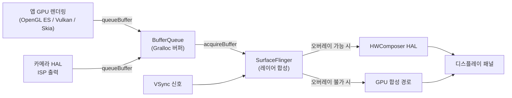

## 이 장을 읽기 전에

이 장은 [14장: 네이티브 개발(NDK/JNI)](/post/android-hardware-development/native-development/)에서 다룬 JNI 연동과 NDK 빌드 체계를 전제로 한다. `ANativeWindow`, `AHardwareBuffer` 같은 네이티브 그래픽 타입과 JNI를 통한 Java-Native 경계 넘나들기가 이미 익숙하다고 가정하고 진행한다.

난이도는 중급에서 전문가 구간까지 걸쳐 있다. 카메라·인코더 API를 애플리케이션 코드로 다루는 부분은 중급 수준이지만, SurfaceFlinger와 직접 상호작용하는 `ASurfaceControl` 예제나 오디오 HAL의 AIDL 인터페이스 구조를 다루는 부분은 벤더 HAL 개발자나 성능 엔지니어에게 맞춰진 전문가 구간이다.

이 장은 OpenGL ES/Vulkan 셰이더 프로그래밍 자체, GPU 드라이버 내부 구조, AR/VR 렌더링 최적화는 다루지 않는다. 이들은 그래픽 API를 이용해 "무엇을 그릴지"를 다루는 별도 주제이며, 이 장은 그보다 한 단계 아래 계층인 "그린 결과를 어떻게 화면과 저장 매체로 옮기는가"에 집중한다.

## 당신의 수준에 맞는 경로

| 수준 | 읽을 부분 | 핵심 목표 |
|------|----------|----------|
| 중급 (NDK/JNI를 마친 앱·미디어 개발자) | 도입, 핵심 개념 전체, 비교/트레이드오프, 흔한 오개념 | SurfaceFlinger·Codec2·Camera2/CameraX·오디오 HAL이 각각 어느 계층을 책임지는지 구분하고, 상황에 맞는 API를 고를 수 있다 |
| 전문가 (HAL/드라이버 개발자, 성능 엔지니어) | 실전 적용의 네이티브 예제, 비판적 시각, 참고 및 출처 | `ASurfaceControl` 수준에서 SurfaceFlinger와 버퍼를 주고받고, Audio HAL AIDL 전환이나 코덱 지연 튜닝처럼 벤더 레벨 의사결정을 설계할 수 있다 |

## 도입

안드로이드 기기에서 카메라 프리뷰가 화면에 뜨고, 그 영상이 동시에 압축되어 파일로 저장되고, 마이크 소리가 어긋남 없이 녹음되는 과정은 하나의 프로세스가 아니라 최소 네 개의 독립된 서비스—SurfaceFlinger, 카메라 서비스, 미디어 코덱 서비스, 오디오 서버—가 공유 메모리 버퍼와 동기화 신호를 주고받으며 만들어내는 결과다. 이 파이프라인 중 한 구간만 이해하면 "화면이 잠깐씩 끊긴다"거나 "녹화 영상과 소리가 어긋난다" 같은 증상이 카메라 문제인지, 인코더 문제인지, 컴포지터 문제인지조차 구분하지 못한다.

실무에서 이 계층을 정확히 이해하고 있는지가 갈리는 지점은 대개 성능 이슈다. 프리뷰 프레임 드롭, 녹화 중 발열, 저지연 화상통화의 왕복 지연(latency) 문제는 애플리케이션 코드 수준의 최적화만으로는 해결되지 않는 경우가 많다. 버퍼가 몇 번 복사되는지, 어느 시점에 GPU와 하드웨어 인코더 사이에서 동기화 대기가 발생하는지, 오디오 HAL이 어떤 샘플링 경로를 타는지를 알아야 원인을 좁힐 수 있다. 이 장은 그 네 축—SurfaceFlinger의 합성 역할, Codec2/MediaCodec의 인코딩·디코딩 경로, Camera2/CameraX의 카메라 스택, 오디오 HAL 경로—를 순서대로 다룬다.

## 핵심 개념

### SurfaceFlinger의 역할: 렌더링이 아니라 합성

<strong>SurfaceFlinger(서피스플링거)</strong>는 안드로이드에서 화면에 표시될 모든 콘텐츠를 최종적으로 조합해 디스플레이로 내보내는 시스템 서비스다. 여기서 정확히 짚어야 할 개념이 <strong>컴포지션(Composition, 합성)</strong>과 <strong>렌더링(Rendering)</strong>의 구분이다. 앱은 OpenGL ES, Vulkan, Skia 같은 그래픽 API로 자신의 윈도우 내용을 직접 그린다(렌더링). SurfaceFlinger는 그 결과물—이미 픽셀이 채워진 버퍼—을 여러 앱과 시스템 UI로부터 받아 하나의 화면으로 겹쳐 쌓는(합성) 역할만 한다. AOSP 공식 문서는 이를 "SurfaceFlinger accepts, composes, and sends buffers to the display"로 요약한다.

이 합성 과정에서 핵심이 되는 두 요소가 <strong>Gralloc(그랄록)</strong>과 <strong>BufferQueue(버퍼큐)</strong>다. Gralloc은 그래픽 버퍼 메모리 할당을 담당하는 HAL로, GPU·카메라·인코더·디스플레이 컨트롤러가 모두 동일한 물리 메모리 영역을 (가능하면 복사 없이) 공유하도록 버퍼를 할당한다. BufferQueue는 생산자(producer, 예: 앱의 GPU 렌더링 스레드나 카메라 HAL)와 소비자(consumer, 예: SurfaceFlinger)가 버퍼를 순환시키는 큐 구조다. 생산자가 버퍼를 채워 `queueBuffer`로 넘기면, 소비자는 `acquireBuffer`로 받아 사용한 뒤 `releaseBuffer`로 돌려준다. 이 큐가 있기 때문에 앱은 디스플레이의 정확한 타이밍을 몰라도 되고, SurfaceFlinger는 여러 앱의 버퍼 도착 시점이 제각각이어도 합성 시점을 제어할 수 있다.

SurfaceFlinger는 이 합성 작업을 **VSync(수직 동기화)** 신호에 맞춰 수행한다. 디스플레이 패널이 다음 프레임을 그릴 준비가 됐다는 하드웨어 신호가 오면, 그 시점까지 도착한 각 레이어의 최신 버퍼들을 모아 한 번에 합성한다. 이 합성은 두 가지 방식 중 하나로 이뤄지는데, GPU 합성(SurfaceFlinger 자신이 OpenGL/Vulkan으로 레이어를 겹쳐 그리는 방식)과 <strong>하드웨어 컴포저(HWComposer, HWC)</strong>를 통한 오버레이 합성(디스플레이 컨트롤러가 여러 레이어를 하드웨어적으로 겹쳐 GPU 개입 없이 출력하는 방식)이다. HWC 오버레이가 가능한 레이어가 많을수록 GPU 부하와 전력 소모가 줄어들기 때문에, SoC 벤더의 HWC HAL 구현 품질이 실제 발열·배터리 체감에 직결된다.



### Codec2와 MediaCodec: 프레임워크 API와 HAL 구현의 분리

<strong>MediaCodec(미디어코덱)</strong>은 앱과 프레임워크 서비스가 하드웨어 또는 소프트웨어 코덱에 접근하는 공개 API다. 비디오/오디오를 압축(인코딩)하거나 압축을 풀어(디코딩) 원시 프레임을 얻는 역할을 하며, 입력과 출력 모두 버퍼 큐 기반으로 동작한다. 이 API 자체는 벤더가 어떤 코덱 구현체를 쓰는지 감춘다—`MediaCodec.createEncoderByType("video/avc")`를 호출한 앱 코드는 그 인코더가 소프트웨어 구현인지, 특정 SoC의 전용 하드웨어 블록인지 알 필요가 없다.

<strong>Codec2(코덱투)</strong>는 MediaCodec API 뒤에서 실제로 코덱 HAL 구현체와 프레임워크 사이를 잇는 인터페이스 계층이다. 안드로이드는 오랫동안 <strong>OMX(OpenMAX IL)</strong>를 이 계층으로 사용해왔지만, OMX는 컴포넌트 그래프 모델이 복잡하고 프로세스 경계를 넘는 IPC 오버헤드가 컸다. Codec2는 이를 대체하기 위해 설계된 더 단순한 컴포넌트 모델로, 버퍼 소유권 이전 규칙이 명확하고 Treble 아키텍처의 HAL 경계(HIDL/AIDL)와 잘 맞물린다. 실무 관점에서 중요한 점은, MediaCodec을 호출하는 앱 코드는 그 뒤에 OMX가 있든 Codec2가 있든 동일하게 동작해야 한다는 것—즉 Codec2로의 전환은 원칙적으로 앱 개발자에게는 투명하고, HAL·벤더 레이어의 문제라는 점이다.

MediaCodec은 **동기(synchronous) 모드**와 **비동기(asynchronous) 모드** 두 가지 사용 패턴을 제공한다. 동기 모드는 `dequeueInputBuffer`/`dequeueOutputBuffer`를 폴링하며 앱이 직접 버퍼 흐름을 제어하는 방식이고, 비동기 모드는 `MediaCodec.Callback`을 등록해 버퍼가 준비될 때마다 콜백으로 통지받는 방식이다. Android 11부터는 **저지연 디코딩(low-latency decoding)** 힌트를 코덱에 전달할 수 있는데, 이는 SoC 제조사가 디코더 드라이버 단에서 이를 지원해야 실제로 효과가 나는 기능이며 Codec2 또는 OMX 설정 파라미터로 노출된다.

### Camera2와 CameraX: 저수준 제어와 기기 호환성의 트레이드오프

<strong>Camera2(카메라투)</strong>는 안드로이드의 저수준 카메라 API로, `CameraManager`로 물리 카메라 장치를 열고 `CaptureRequest`로 노출·초점·화이트밸런스 같은 센서 파라미터를 프레임 단위로 세밀하게 제어할 수 있다. 이 세밀함의 대가는 기기별 파편화다. 모든 안드로이드 기기가 Camera2의 모든 기능을 동일한 수준으로 지원하지는 않으며, `CameraCharacteristics`의 `INFO_SUPPORTED_HARDWARE_LEVEL` 값(LEGACY/LIMITED/FULL/LEVEL_3)에 따라 지원 기능 범위가 갈린다. 즉 Camera2로 작성한 코드는 기기마다 분기 처리가 필요해질 수 있다.

<strong>CameraX(카메라엑스)</strong>는 Camera2 위에 얹힌 Jetpack 라이브러리로, Preview·ImageAnalysis·ImageCapture·VideoCapture라는 유스케이스(use case) 단위로 카메라 기능을 추상화한다. Android Developers 공식 문서는 CameraX가 "API 레벨 21 이상, 즉 기존 안드로이드 기기의 98% 이상"에서 일관된 동작을 목표로 자동화된 호환성 테스트를 거친다고 설명한다. 내부적으로는 여전히 Camera2를 호출하지만, 기기별 예외 처리와 쿼크(quirk) 보정을 라이브러리가 흡수해준다. 다만 Camera2가 제공하는 모든 저수준 파라미터를 CameraX가 1:1로 노출하지는 않으므로, RAW 캡처나 수동 노출 브라케팅처럼 세밀한 제어가 필요하면 `Camera2Interop` API로 Camera2 파라미터를 부분적으로 주입해야 한다.

### 오디오 HAL 경로: AudioFlinger에서 DSP까지

오디오 신호의 경로는 그래픽 파이프라인과 구조적으로 유사하지만 시간 축의 정밀도 요구가 훨씬 엄격하다. 앱이 `AudioTrack`이나 `AAudio`로 오디오 데이터를 재생 요청하면, 시스템 서비스인 **AudioFlinger**가 여러 앱의 오디오 스트림을 믹싱하고, 그 결과를 **Audio HAL**로 넘긴다. Audio HAL은 프레임워크의 오디오 API와 실제 오디오 드라이버(코덱 칩, DSP) 사이를 잇는 HAL로, 모든 안드로이드 기기가 반드시 구현해야 하는 계층이다. AOSP 문서에 따르면 Audio HAL은 Core HAL, Effects HAL, Common HAL 세 부분으로 구성되며, Android 14부터는 이전까지 쓰이던 **HIDL** 대신 **AIDL**을 인터페이스 정의 언어로 사용한다.

이 계층에서 실무적으로 중요한 개념이 <strong>DSP 오프로드(offload)</strong>다. 저전력 오디오 재생(예: 화면이 꺼진 상태의 음악 재생)에서는 AP(애플리케이션 프로세서)가 매번 깨어나 오디오 버퍼를 채우는 대신, 압축된 오디오 데이터를 통째로 DSP에 넘겨 DSP가 디코딩과 출력을 전담하게 할 수 있다. 이는 Audio HAL이 오프로드 가능 여부를 프레임워크에 알리고, 프레임워크가 해당 스트림을 오프로드 트랙으로 열 때만 활성화된다. 반대로 화상통화나 음성인식처럼 낮은 왕복 지연이 중요한 경로에서는 오프로드 대신 **AAudio의 MMAP 저지연 경로**를 사용해, 오디오 버퍼를 커널 드라이버와 유저스페이스가 메모리 맵으로 직접 공유하며 버퍼 복사와 스케줄링 지연을 최소화한다.

## 비교/트레이드오프

카메라·코덱·오디오 각 영역에서 "어느 API/경로를 쓸 것인가"는 세밀한 제어력과 구현 비용·기기 호환성 사이의 트레이드오프로 수렴한다. 아래 표는 각 축에서 실무 판단에 쓰이는 기준을 정리한 것이다.

| 판단 축 | 저수준 선택 (세밀한 제어) | 고수준 선택 (호환성·생산성) | 선택 기준 |
|---------|--------------------------|------------------------------|----------|
| 카메라 | Camera2 | CameraX | RAW 캡처, 수동 노출 브라케팅, 멀티 카메라 동기 캡처처럼 파라미터 단위 제어가 필요하면 Camera2. 일반적인 프리뷰/촬영/녹화 UX면 CameraX + 필요 시 Camera2Interop 부분 사용 |
| 코덱 사용 패턴 | 동기(polling) MediaCodec | 비동기(callback) MediaCodec | 버퍼 흐름을 앱이 정밀하게 스케줄링해야 하면 동기, UI 스레드 블로킹 없이 이벤트 기반으로 처리하려면 비동기(Android 권장 기본값) |
| 코덱 HAL 세대 | OMX(레거시) | Codec2 | 신규 개발은 전부 Codec2 대상. OMX는 레거시 기기 호환 목적 외에는 신규 채택 근거가 없다 |
| 오디오 재생 경로 | AAudio MMAP 저지연 경로 | 표준 AudioTrack/오프로드 경로 | 화상통화·실시간 악기 앱처럼 20ms 미만 왕복 지연이 요구되면 저지연 경로. 배경 음악 재생처럼 전력 효율이 우선이면 오프로드 |
| HAL IPC 인터페이스 | HIDL(레거시) | AIDL | Android 14 이상을 타깃으로 하는 신규 벤더 HAL 구현은 AIDL이 요구사항이며, HIDL은 이전 버전 호환 목적으로만 유지 |

이 표에서 공통으로 드러나는 원칙은, 프레임워크가 제공하는 고수준 추상화(CameraX, 비동기 MediaCodec, 표준 오디오 경로)를 기본값으로 삼고, 성능·정밀도 요구가 이를 넘어설 때만 저수준으로 내려가라는 것이다. 저수준 API는 기기 파편화와 예외 처리 비용을 앱 개발자에게 그대로 전가하기 때문에, "더 세밀하게 제어할 수 있으니 항상 저수준을 쓴다"는 접근은 유지보수 비용을 불필요하게 늘린다.

## 실전 적용

카메라로 촬영한 1080p 영상을 실시간으로 H.264로 인코딩하면서, 동시에 프리뷰 위에 SurfaceFlinger 레이어로 그래픽 오버레이(예: 녹화 상태 표시)를 직접 그려야 하는 시나리오를 생각해보자. 이 시나리오는 앞서 다룬 세 계층—Camera2, MediaCodec, SurfaceFlinger—을 모두 건드리므로 파이프라인 전체를 조립하는 연습으로 적합하다.

첫 단계는 인코더를 먼저 구성해 입력 Surface를 확보하는 것이다. 인코더의 입력을 `Surface`로 받도록 설정하면(`COLOR_FormatSurface`), 카메라가 채운 프리뷰 버퍼가 소프트웨어 복사 없이 인코더 하드웨어로 직접 전달된다—이것이 Camera2와 MediaCodec을 연동할 때 가장 중요한 성능 결정이다.

```kotlin
import android.hardware.camera2.CameraCaptureSession
import android.hardware.camera2.CameraDevice
import android.media.MediaCodec
import android.media.MediaCodecInfo
import android.media.MediaFormat
import android.os.Handler
import android.os.HandlerThread
import android.view.Surface
import java.nio.ByteBuffer

class RecordingPipeline {

    private lateinit var encoder: MediaCodec
    private lateinit var encoderInputSurface: Surface
    private lateinit var captureSession: CameraCaptureSession
    private val workerThread = HandlerThread("camera-encode").apply { start() }
    private val workerHandler = Handler(workerThread.looper)

    // 1) 인코더를 먼저 구성하고, 인코더가 소비할 입력 Surface를 얻는다.
    //    이 Surface가 카메라 캡처 요청의 타겟이 되면, 카메라 HAL이 채운
    //    프리뷰 버퍼가 CPU 복사 없이 인코더 하드웨어 블록으로 넘어간다.
    fun prepareEncoder() {
        val format = MediaFormat.createVideoFormat("video/avc", 1920, 1080).apply {
            setInteger(MediaFormat.KEY_BIT_RATE, 8_000_000)
            setInteger(MediaFormat.KEY_FRAME_RATE, 30)
            setInteger(
                MediaFormat.KEY_COLOR_FORMAT,
                MediaCodecInfo.CodecCapabilities.COLOR_FormatSurface
            )
            setInteger(MediaFormat.KEY_I_FRAME_INTERVAL, 1)
        }
        encoder = MediaCodec.createEncoderByType("video/avc")
        encoder.setCallback(object : MediaCodec.Callback() {
            override fun onInputBufferAvailable(codec: MediaCodec, index: Int) {
                // Surface 입력 모드에서는 이 콜백이 호출되지 않는다.
            }

            override fun onOutputBufferAvailable(
                codec: MediaCodec, index: Int, info: MediaCodec.BufferInfo
            ) {
                val encoded: ByteBuffer = codec.getOutputBuffer(index) ?: return
                writeEncodedSample(encoded, info)
                codec.releaseOutputBuffer(index, false)
            }

            override fun onError(codec: MediaCodec, e: MediaCodec.CodecException) {
                if (e.isRecoverable) {
                    codec.stop()
                    codec.start()
                }
            }

            override fun onOutputFormatChanged(codec: MediaCodec, format: MediaFormat) {
                onMuxerFormatReady(format)
            }
        }, workerHandler)

        encoder.configure(format, null, null, MediaCodec.CONFIGURE_FLAG_ENCODE)
        encoderInputSurface = encoder.createInputSurface()
        encoder.start()
    }

    // 2) 카메라 캡처 요청의 타겟을 인코더 입력 Surface로 지정한다.
    //    TEMPLATE_RECORD는 프레임워크에 녹화 용도임을 알려 노출·초점
    //    파라미터의 기본값을 녹화에 맞게 조정하도록 힌트를 준다.
    fun startRecordingSession(camera: CameraDevice) {
        val request = camera.createCaptureRequest(CameraDevice.TEMPLATE_RECORD).apply {
            addTarget(encoderInputSurface)
        }
        camera.createCaptureSession(
            listOf(encoderInputSurface),
            object : CameraCaptureSession.StateCallback() {
                override fun onConfigured(session: CameraCaptureSession) {
                    captureSession = session
                    session.setRepeatingRequest(request.build(), null, workerHandler)
                }

                override fun onConfigureFailed(session: CameraCaptureSession) = Unit
            },
            workerHandler
        )
    }

    private fun writeEncodedSample(buffer: ByteBuffer, info: MediaCodec.BufferInfo) {
        // MediaMuxer.writeSampleData(trackIndex, buffer, info) 호출 지점
    }

    private fun onMuxerFormatReady(format: MediaFormat) {
        // MediaMuxer.addTrack(format) 호출 지점
    }
}
```

이 코드에서 주의할 점은 `onInputBufferAvailable` 콜백이 Surface 입력 모드에서는 호출되지 않는다는 것이다—입력 버퍼 채우기는 GPU/카메라 파이프라인이 Surface에 직접 쓰는 방식으로 이뤄지므로, 앱이 `ByteBuffer`를 수동으로 채울 필요가 없다. 또한 `onError`에서 `isRecoverable`을 확인하지 않고 무조건 재시작하면, 복구 불가능한 하드웨어 오류(`isTransient`가 아닌 치명적 오류) 상황에서 무한 재시작 루프에 빠질 수 있다.

녹화 상태 표시 오버레이처럼 SurfaceFlinger에 별도 레이어를 직접 얹어야 하는 경우, 네이티브 코드에서 `ASurfaceControl` API를 사용한다. 이는 Android 10(API 29)부터 NDK에 노출된 API로, 14장에서 다룬 JNI 경계를 넘어 SurfaceFlinger와 직접 트랜잭션을 주고받는다.

```cpp
#include <android/native_window_jni.h>
#include <android/surface_control.h>
#include <android/hardware_buffer.h>
#include <jni.h>

extern "C" JNIEXPORT jlong JNICALL
Java_com_example_gfx_OverlayRenderer_nativeCreateLayer(
        JNIEnv* env, jobject /* thiz */, jobject surface) {
    ANativeWindow* window = ANativeWindow_fromSurface(env, surface);
    if (window == nullptr) {
        return 0L;
    }
    // SurfaceFlinger에 새 레이어를 등록하고, 이후 트랜잭션으로
    // 하드웨어 버퍼를 직접 밀어 넣을 수 있는 핸들을 얻는다.
    ASurfaceControl* control =
            ASurfaceControl_createFromWindow(window, "recording_indicator_layer");
    ANativeWindow_release(window);
    return reinterpret_cast<jlong>(control);
}

extern "C" JNIEXPORT void JNICALL
Java_com_example_gfx_OverlayRenderer_nativeSubmitFrame(
        JNIEnv* /* env */, jobject /* thiz */,
        jlong controlPtr, jlong bufferPtr, jint fenceFd) {
    auto* control = reinterpret_cast<ASurfaceControl*>(controlPtr);
    auto* buffer = reinterpret_cast<AHardwareBuffer*>(bufferPtr);

    ASurfaceTransaction* transaction = ASurfaceTransaction_create();
    // 획득 펜스(fenceFd)는 GPU가 버퍼 쓰기를 끝냈다는 신호다.
    // SurfaceFlinger는 이 펜스가 신호될 때까지 버퍼를 읽지 않으므로,
    // GPU와 컴포지터 사이의 동기화가 별도 락 없이 펜스로 해결된다.
    ASurfaceTransaction_setBuffer(transaction, control, buffer, fenceFd);
    ASurfaceTransaction_setZOrder(transaction, control, 1);
    ASurfaceTransaction_apply(transaction);
    ASurfaceTransaction_delete(transaction);
}
```

이 트랜잭션 모델에서 핵심은 펜스(fence) 기반 동기화다. `setBuffer`에 넘기는 `fenceFd`는 "이 버퍼에 대한 쓰기가 언제 끝나는가"를 나타내는 커널 동기화 객체이며, SurfaceFlinger는 뮤텍스나 폴링이 아니라 이 펜스 신호를 기다렸다가 버퍼를 합성에 사용한다. 이 방식 덕분에 GPU, 카메라 HAL, 인코더가 서로 다른 스레드·프로세스에서 동작해도 데이터 경합 없이 버퍼 소유권을 순차적으로 넘길 수 있다.

오디오 HAL 계층은 앱 코드가 직접 건드릴 일이 거의 없지만, 벤더 HAL을 개발하거나 지연 문제를 진단할 때는 인터페이스 구조를 이해해야 한다. 다음은 Audio Core HAL이 노출하는 인터페이스의 개념을 보여주기 위해 단순화해 재구성한 예시로, AOSP 원본 AIDL 파일의 축약이 아니라 구조를 이해하기 위한 설명용 코드임을 밝혀둔다.

```text
// 개념 예시: Audio Core HAL이 프레임워크에 노출하는 인터페이스의 구조
// (AOSP 원본을 단순화한 설명용 의사코드이며, 실제 필드/메서드 시그니처는
//  hardware/interfaces/audio/aidl 하위의 실제 .aidl 파일을 확인해야 한다)
interface IModule {
    IStreamOut openOutputStream(AudioPortConfig config);
    IStreamIn openInputStream(AudioPortConfig config);
    boolean supportsOffload(AudioFormat format);
    void setAudioPatch(AudioPatch patch);   // 입력-출력 포트 간 라우팅 설정
}
```

이 구조에서 `supportsOffload`가 반환하는 값에 따라 프레임워크가 오프로드 트랙을 열지, 표준 믹싱 경로를 열지가 갈린다는 점, 그리고 `setAudioPatch`가 물리적인 오디오 라우팅(예: 스피커에서 헤드셋으로 전환)을 결정한다는 점이 이 계층에서 실무적으로 중요한 지점이다.

## 흔한 오개념

**"SurfaceFlinger가 화면을 그린다"는 것은 부정확한 표현이다.** SurfaceFlinger는 이미 렌더링이 끝난 버퍼들을 받아 합성만 한다. 화면이 실제로 어떤 픽셀로 채워지는지는 각 앱의 GPU 드로우콜(OpenGL ES/Vulkan/Skia)이 이미 결정한 결과다. 이 구분을 놓치면 "화면이 끊긴다"는 증상을 무조건 SurfaceFlinger 튜닝으로 해결하려 들게 되는데, 실제 원인은 앱의 렌더 스레드가 프레임 마감을 못 맞추는 것(jank)일 수도 있고, HWC 오버레이 실패로 GPU 합성이 강제되는 것일 수도 있다—증상은 같아도 대응은 다르다.

**"MediaCodec은 항상 하드웨어 가속을 쓴다"는 것도 오해다.** MediaCodec은 하드웨어 코덱과 소프트웨어 코덱을 동일한 API로 노출한다. `MediaCodecList`로 사용 가능한 코덱을 조회하면 `OMX.google.` 또는 `c2.android.`로 시작하는 소프트웨어 구현체와 벤더가 제공하는 하드웨어 구현체가 함께 나열되며, `createEncoderByType`은 시스템이 우선순위에 따라 고른 구현체를 반환한다. 특정 하드웨어 코덱을 반드시 써야 한다면 `MediaCodecInfo`를 순회해 이름으로 명시적으로 선택해야 한다.

**"CameraX를 쓰면 Camera2를 몰라도 된다"는 것도 실무에서는 틀린 가정이다.** CameraX는 Camera2 위의 추상화이지 대체가 아니다. 표준 유스케이스를 벗어나는 요구—RAW 캡처, 수동 노출 브라케팅, 벤더 특화 확장 기능—가 생기면 `Camera2Interop`으로 내려가 Camera2 파라미터를 직접 주입해야 하고, 이때 Camera2의 파라미터 의미를 모르면 CameraX의 추상화만으로는 문제를 해결할 수 없다.

## 비판적 시각

Codec2로의 전환은 설계상으로는 OMX보다 단순하고 IPC 오버헤드가 적지만, 실제 채택 속도는 벤더의 드라이버 이식 일정에 달려 있다. 프레임워크가 Codec2를 표준으로 삼아도, 특정 SoC의 코덱 드라이버가 여전히 OMX 래퍼를 통해서만 노출된다면 그 기기에서는 Codec2의 장점을 온전히 누릴 수 없다. 이 계층의 개선은 프레임워크 릴리스만으로 완성되지 않고, 벤더 HAL 구현이 실제로 최신 인터페이스를 따라가야 완성된다는 점에서 안드로이드 생태계 파편화 문제의 축소판이라 할 수 있다.

SurfaceFlinger의 제로카피(zero-copy) 목표—버퍼를 복사 없이 생산자에서 디스플레이까지 전달하는 것—도 이론과 실제 사이에 간극이 있다. HWC 오버레이로 처리할 수 있는 레이어 수는 디스플레이 컨트롤러의 하드웨어 한계(대개 4–8개 수준이지만 정확한 값은 SoC마다 다르므로 구현 정의로 봐야 한다)를 넘으면 GPU 합성으로 폴백하고, 이 폴백은 벤더 HWC HAL 구현의 품질과 드라이버 성숙도에 따라 편차가 크다. 즉 "SurfaceFlinger를 쓰면 항상 하드웨어 오버레이로 효율적으로 합성된다"는 가정은 특정 기기·특정 앱 구성에서만 성립하는 조건부 사실이다.

Audio HAL의 HIDL에서 AIDL로의 강제 전환 역시 신규 기기에는 유리하지만, 레거시 벤더 드라이버를 유지해야 하는 제조사 입장에서는 HAL 어댑터 계층을 추가로 유지보수해야 하는 부담으로 작용한다. 이런 플랫폼 차원의 인터페이스 교체는 최종 사용자 경험(지연, 안정성)을 개선하려는 의도지만, 그 비용은 항상 벤더 엔지니어링 조직이 흡수해야 한다는 점에서 순수하게 기술적인 결정만은 아니다.

## 다음 장에서는

[16장: On-Device AI/ML 통합](/post/android-hardware-development/on-device-ai-ml-integration/)에서는 이 장에서 다룬 카메라·미디어 파이프라인에서 얻은 프레임 데이터를 온디바이스 신경망 추론으로 연결하는 방법을 다룬다.

## 평가 기준

이 장을 읽은 후 다음을 할 수 있어야 한다.

- SurfaceFlinger가 담당하는 "합성"과 앱이 담당하는 "렌더링"을 구분해 설명할 수 있다.
- BufferQueue와 VSync가 앱-SurfaceFlinger-디스플레이 사이의 타이밍을 어떻게 조율하는지 설명할 수 있다.
- MediaCodec API와 Codec2/OMX HAL 계층의 관계를 구분하고, 동기/비동기 모드 중 상황에 맞는 것을 선택할 수 있다.
- Camera2와 CameraX 중 요구사항(세밀한 제어 vs 기기 호환성)에 맞는 API를 선택하고, 필요 시 Camera2Interop으로 내려가는 이유를 설명할 수 있다.
- 오디오 HAL의 오프로드 경로와 저지연(MMAP) 경로의 차이를 사용 시나리오와 함께 설명할 수 있다.
- 카메라-인코더-SurfaceFlinger로 이어지는 파이프라인에서 펜스 기반 버퍼 동기화가 왜 필요한지 설명할 수 있다.

## 참고 및 출처

- Android Open Source Project, ["SurfaceFlinger and WindowManager"](https://source.android.com/docs/core/graphics/surfaceflinger-windowmanager), source.android.com
- Android Open Source Project, ["Low latency decoding for MediaCodec"](https://source.android.com/docs/core/media/low-latency-media), source.android.com
- Android Open Source Project, ["Audio HAL"](https://source.android.com/docs/core/audio/implement), source.android.com
- Android Developers, ["Camera2 overview"](https://developer.android.com/media/camera/camera2), developer.android.com
- Android Developers, ["CameraX overview"](https://developer.android.com/media/camera/camerax), developer.android.com
- Android Developers, ["MediaCodec"](https://developer.android.com/reference/android/media/MediaCodec) API reference, developer.android.com
