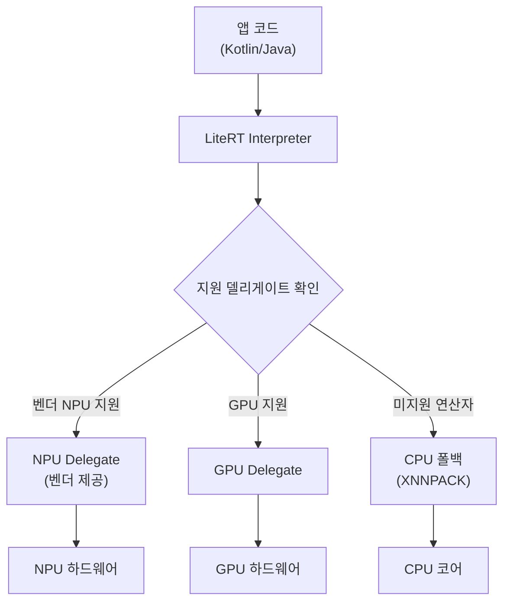

## 이 장을 읽기 전에

이전 챕터인 [15장: 그래픽 및 미디어 프레임워크](/post/android-hardware-development/graphics-media-framework/)에서는 SurfaceFlinger, 하드웨어 컴포저(HWC), MediaCodec으로 이어지는 그래픽·미디어 파이프라인을 다뤘다. 이 장은 그 파이프라인 위에서, 또는 그와 나란히 동작하는 **온디바이스 추론 스택** 자체로 초점을 옮긴다. NNAPI가 왜 등장했고 왜 물러나는지, LiteRT가 그 자리를 어떻게 대체하는지, NPU와 GPU가 어떻게 연산을 나눠 맡는지, 모델을 기기에 맞게 줄이는 양자화가 무엇을 트레이드오프하는지, 그리고 "온디바이스라서 안전하다"는 말이 어디까지 사실인지를 다룬다.

이 장의 난이도는 중급~고급이다. HAL과 시스템 서비스 구조(4장, 5장), NDK/JNI를 통한 네이티브 개발(14장)에 대한 기본 이해를 전제로 하며, 신경망 자체의 수학(역전파, 손실 함수 등)은 다루지 않는다. 이 장이 다루지 않는 것은 다음과 같다. 모델을 처음부터 학습(training)시키는 방법과 서버 사이드 ML 파이프라인 구축은 다루지 않는다. GPU 컴포지션·렌더링 파이프라인의 세부 구현은 15장에서, 그래픽 가속 하드웨어 자체의 구조는 [17장: 안드로이드 그래픽 엔진](/post/android-hardware-development/android-graphics-engine/)에서 다룬다.

## 당신의 수준에 맞는 경로

| 수준 | 읽을 부분 | 핵심 목표 |
|------|-----------|-----------|
| 입문 (Android 앱 개발 경험만 있음) | 핵심 개념, 비교/트레이드오프의 표 | NNAPI·LiteRT·델리게이트·양자화라는 용어가 각각 무엇을 가리키는지 구분할 수 있다 |
| 중급 (HAL/NDK 경험 있음) | 전체 본문 + 실전 적용 코드 | GPU 델리게이트를 붙인 추론 파이프라인을 직접 구현하고, 상황에 맞는 추론 경로를 선택할 수 있다 |
| 고급 (시스템/드라이버 개발자) | 비판적 시각, 흔한 오개념 | NPU 벤더 파편화, 양자화의 정확도 트레이드오프, 온디바이스 프라이버시 주장의 한계를 근거를 들어 설명할 수 있다 |

## 도입

스마트폰 카메라가 사진을 찍는 순간 얼굴을 인식하고, 키보드가 다음 단어를 예측하고, 통화 중 배경 소음을 실시간으로 제거하는 기능들은 대부분 클라우드 서버가 아니라 기기 안의 신경망 가속기에서 실행된다. 이런 온디바이스 추론이 실무에서 중요해진 이유는 세 가지로 요약된다. 첫째, 네트워크 왕복 지연이 없어 카메라 프리뷰나 음성 처리처럼 수십 밀리초 단위의 반응성이 필요한 기능에 필수적이다. 둘째, 사용자 데이터를 서버로 전송하지 않아도 되므로 프라이버시 요구사항이 있는 기능(얼굴 인식 잠금, 개인화 추천)을 구현하기 쉬워진다. 셋째, 네트워크가 불안정하거나 아예 없는 환경에서도 기능이 동작해야 하는 제품(카메라, 웨어러블, 차량용 인포테인먼트)이 늘고 있다.

문제는 스마트폰 SoC 안에 CPU, GPU, NPU라는 세 가지 이상 성격이 다른 연산 장치가 공존하고, 벤더마다(퀄컴, 미디어텍, 삼성, 구글 텐서) 이 장치들에 접근하는 방식이 제각각이라는 점이다. 안드로이드는 이 파편화를 애플리케이션 개발자로부터 감추기 위해 하나의 추상화 계층을 두 차례에 걸쳐 다시 설계했다. 첫 번째가 NNAPI였고, 지금 진행 중인 두 번째가 LiteRT다. 이 장은 이 전환이 왜 일어났는지, 그리고 그 위에서 실제로 무엇을 구현해야 하는지를 다룬다.

## 핵심 개념

### NNAPI에서 LiteRT로: 온디바이스 추론 스택의 위치

**NNAPI(Neural Networks API)**는 Android 8.1(API 레벨 27)에서 도입된, 신경망 연산을 하드웨어 가속기에 위임하기 위한 C 언어 기반 시스템 API다. 앱이나 프레임워크가 직접 벤더별 드라이버를 호출하는 대신, NNAPI라는 공통 인터페이스에 연산 그래프를 넘기면 시스템이 기기에 설치된 NNAPI HAL 구현체(주로 벤더가 제공)를 통해 CPU, GPU, DSP, NPU 중 적절한 장치로 그래프를 라우팅하는 구조였다. HAL 계층에서 벤더 드라이버를 표준 인터페이스로 감싼다는 점에서, 4장에서 다룬 HAL의 설계 철학을 신경망 가속이라는 특정 도메인에 적용한 사례로 볼 수 있다.

그러나 Android 개발자 문서는 NNAPI가 더 이상 신규 개발의 기본 경로가 아니라고 명시한다. "NNAPI is deprecated. While you can continue to use NNAPI, we expect the majority of devices in the future to use the CPU backend, and therefore for performance critical workloads, we recommend migrating to alternative solutions, for example the TF Lite GPU runtime" — Android NDK 문서, "Android Neural Networks API"(developer.android.com)의 경고문이다. NNAPI는 Android 15에서 공식적으로 사용 중단(deprecated) 표시가 붙었고, 신경망 모델이 트랜스포머·디퓨전 모델 등으로 빠르게 진화하는 데 비해 시스템 API는 OS 릴리스 주기에 묶여 있어 갱신 속도를 따라가지 못한다는 것이 근본적인 이유다. 시스템 API 형태로 냈던 것을 앱이 직접 번들링하거나 Google Play 서비스로 갱신 가능한 런타임 형태로 바꾼 것이 이번 전환의 핵심이다.

그 자리를 이어받은 것이 **LiteRT**다. LiteRT는 기존 TensorFlow Lite 런타임의 새 이름으로, "the next generation of the world's most widely deployed machine learning runtime"(Google AI Edge, LiteRT 개요 문서)라고 소개된다. 기존 `.tflite` 모델 포맷과 API 상당 부분을 그대로 유지하면서, PyTorch·JAX·Keras 등 TensorFlow 외부에서 만든 모델도 변환해 실행할 수 있도록 발전시킨 것이 특징이다. 실무적으로는 "이름이 바뀐 TensorFlow Lite"로 이해해도 크게 틀리지 않는다 — 기존 TFLite 코드베이스와 지식은 대부분 그대로 옮겨간다. NNAPI 마이그레이션 가이드가 제시하는 대체 경로는 Google Play 서비스로 배포되는 TensorFlow Lite 런타임, GenAI 파운데이션 모델(Gemini Nano)을 위한 **AICore**, 그리고 하드웨어 가속을 위한 TFLite GPU 델리게이트 세 가지다.

### 델리게이트: 연산 그래프를 가속기에 위임하는 방식

LiteRT는 모델을 구성하는 연산 그래프 전체를 하나의 실행기에서 돌리는 대신, **델리게이트(Delegate)**라는 플러그인 계층을 통해 그래프의 일부 또는 전체를 특정 하드웨어에 위임할 수 있게 설계되어 있다. 델리게이트는 인터프리터가 그래프를 순회하다가 자신이 지원하는 연산자(Op)를 만나면 그 서브그래프를 통째로 넘겨받아 실행하고 결과만 돌려주는 방식으로 동작한다. 이 설계 덕분에 앱 코드는 "GPU를 써라"처럼 델리게이트 객체 하나만 등록하면 되고, 실제로 어떤 연산이 GPU에서 도는지 CPU로 남는지는 런타임이 그래프 분석을 통해 결정한다.

GPU 델리게이트는 컨볼루션(CONV_2D, DEPTHWISE_CONV_2D), 풀링(MAX_POOL_2D, AVERAGE_POOL_2D), 활성화 함수(RELU, LOGISTIC) 등 신경망에서 빈도가 높은 연산자를 16비트 또는 32비트 부동소수점으로 지원한다. 여기서 중요한 트레이드오프가 하나 있다. 그래프 안에 GPU 델리게이트가 지원하지 않는 연산자가 섞여 있으면, 런타임은 그 부분만 CPU로 되돌리는 부분 위임(split execution)을 수행한다. 이 경우 CPU와 GPU 사이를 오가는 동기화 비용 때문에 오히려 CPU 단독 실행보다 느려질 수 있다는 점을 Google AI Edge의 GPU 델리게이트 문서가 명시적으로 경고한다. 즉 "GPU 델리게이트를 붙이면 무조건 빨라진다"는 가정은 틀릴 수 있으며, 실제 대상 모델의 연산자 구성을 확인하는 과정이 필요하다.

**NPU(Neural Processing Unit)** 델리게이트는 GPU 델리게이트와 개념은 같지만 대상 하드웨어가 다르다. 퀄컴, 미디어텍, 삼성, 구글 텐서 등 SoC 벤더들은 각자의 신경망 전용 가속기(예: 퀄컴 Hexagon, 삼성 NPU)를 위한 델리게이트를 별도로 제공하며, LiteRT는 이런 벤더별 NPU 가속을 GPU·CPU와 함께 묶어 "하드웨어 가속의 단순화"라는 목표 아래 통합하는 방향으로 발전하고 있다. 실무에서 중요한 점은 NPU 델리게이트가 GPU 델리게이트보다 벤더 종속성이 강하다는 것이다. 같은 앱이라도 어떤 칩셋에서 실행되느냐에 따라 사용 가능한 NPU 델리게이트의 존재 여부와 지원 연산자 목록이 달라질 수 있으므로, 벤더 독립적인 GPU 델리게이트나 CPU 폴백을 항상 대비책으로 남겨두는 설계가 일반적이다.

### 모델 양자화: 정밀도를 낮춰 크기와 속도를 얻는다

**양자화(Quantization)**는 모델 파라미터를 표현하는 수치의 정밀도를 낮추는 최적화 기법이다. 학습 직후의 모델은 기본적으로 32비트 부동소수점(float32)으로 가중치를 저장하는데, 이를 더 적은 비트로 표현하면 모델 파일 크기가 줄고 추론 시 연산량과 메모리 대역폭 요구량도 함께 줄어든다. Google AI Edge의 모델 최적화 문서에 따르면 양자화는 "모델의 파라미터를 표현하는 데 쓰이는 수의 정밀도를 낮추는" 방식으로 동작하며, 이를 통해 더 작고 빠른 모델을 얻는다.

양자화에는 크게 두 갈래가 있다. **PTQ(Post-Training Quantization, 학습 후 양자화)**는 이미 학습이 끝난 float32 모델을 별도의 재학습 없이 낮은 정밀도로 변환하는 방식이다. 학습 데이터가 필요 없고 적용이 간단해 일반적으로 가장 먼저 시도하는 방법으로 권장된다. **QAT(Quantization-Aware Training, 양자화 인식 학습)**는 학습 과정 자체에 양자화로 인한 오차를 시뮬레이션해 반영함으로써, PTQ보다 정확도 손실을 더 줄이는 방식이다. 대신 레이블이 붙은 학습 데이터와 재학습 과정이 필요하므로, PTQ로 지연시간·정확도 목표를 만족하지 못할 때 선택하는 것이 일반적인 순서다.

정밀도 수준 자체도 선택지가 여럿이다. float32를 **float16**으로 낮추면 모델 크기가 최대 약 50% 줄고 정확도 손실은 미미한 수준으로 알려져 있으며 CPU와 GPU 모두에서 지원된다. **int8**로 낮추면 크기가 최대 약 75%까지 줄고 CPU·GPU(Android)·Edge TPU 등 더 넓은 하드웨어에서 가속을 받을 수 있지만, float16보다는 정확도 손실 위험이 크다. 활성화값이 양자화에 민감한 모델에서는 가중치만 int8로, 활성화는 int16으로 두는 혼합 정밀도 방식이 순수 int8보다 정확도를 개선하는 경우가 있다고 문서화되어 있다. 이 수치들은 모델 구조와 데이터 분포에 따라 달라지므로, "int8은 항상 75% 줄어든다"가 아니라 "최대 그 정도까지 줄어들 수 있다"는 상한선으로 이해해야 한다.

### Google AI Edge: 온디바이스 ML을 위한 도구 모음

**Google AI Edge**는 온디바이스 ML/AI를 구축하고 배포하기 위한 구글의 종단간(end-to-end) 도구 스택을 가리키는 이름이다. 공식 소개에 따르면 이 스택은 구글 자체 제품(픽셀폰, Google Meet, YouTube Shorts 등)의 AI 기능을 구동하는 데도 쓰인다. 스택을 구성하는 주요 요소는 다음과 같다. **LiteRT**는 PyTorch·JAX·TensorFlow·Keras로 만든 커스텀 모델을 하드웨어 가속 형태로 배포하는 핵심 런타임이고, **MediaPipe**는 배경 흐림, 얼굴 메시, 객체 탐지처럼 자주 쓰이는 기능을 바로 붙일 수 있는 사전 구축(prebuilt) Task API를 제공한다. **LiteRT-LM**은 동일한 LLM을 Android·iOS·웹·임베디드에서 함께 구동하기 위한 SDK이고, **Model Explorer**는 모델 구조를 시각화·디버깅하는 도구, **AI Edge Quantizer**는 앞서 설명한 양자화 변환·최적화를 자동화하는 도구, **AI Edge Portal**은 실제 안드로이드 기기에서 대규모 벤치마킹을 수행하는 서비스다. 이 구성에서 알 수 있듯, Google AI Edge는 단일 제품이 아니라 "모델 변환 → 최적화 → 벤치마크 → 배포"라는 온디바이스 ML 워크플로 전체를 아우르는 도구 모음으로 이해하는 것이 정확하다.

다음 다이어그램은 앱 코드에서 시작해 LiteRT 인터프리터가 델리게이트를 통해 실제 하드웨어까지 연산을 위임하는 경로를 정리한 것이다.



## 비교와 트레이드오프

여러 추론 경로 중 무엇을 선택할지는 모델 종류, 지연시간 요구사항, 대상 기기의 다양성에 따라 달라진다. 아래 표는 각 경로의 특징과 적합한 상황을 정리한 것이다.

| 추론 경로 | 특징 | 적합한 상황 | 주의점 |
|-----------|------|--------------|--------|
| CPU (XNNPACK 커널) | 모든 기기에서 동작, 별도 델리게이트 불필요 | 저사양 기기 대비 폴백, 작은 모델 | 대형 모델·고해상도 입력에서는 지연시간이 커짐 |
| GPU 델리게이트 | 벤더 독립적, 병렬 연산에 강함 | 이미지 분류·세그멘테이션 등 CNN 계열 | 지원하지 않는 연산자가 섞이면 부분 폴백으로 오히려 느려질 수 있음 |
| 벤더 NPU 델리게이트 | 동일 연산 대비 전력 효율이 가장 좋은 경우가 많음(기기별 상이) | 상시 구동되는 카메라/음성 기능, 배터리 민감 시나리오 | 벤더·칩셋마다 지원 연산자와 API가 달라 파편화가 큼 |
| NNAPI (레거시) | Android 8.1 이상 시스템 API, 벤더 HAL을 통해 자동 라우팅 | 이미 NNAPI로 구현된 기존 코드의 유지보수 | Android 15부터 사용 중단(deprecated) 표시, 신규 개발에는 권장되지 않음 |
| TensorFlow Lite in Google Play services | Play 서비스로 배포되어 OS 업데이트 없이 런타임 갱신 가능 | 최신 델리게이트·연산자를 빠르게 받고 싶은 신규 프로젝트 | Play 서비스가 없는 기기(일부 중국 시장 등)에서는 사용 불가 |
| AICore + Gemini Nano | 온디바이스 파운데이션 모델을 시스템 서비스로 제공 | 요약, 교정 등 온디바이스 GenAI 기능 | 지원 기기가 제한적이며 커스텀 모델 학습 대상이 아님 |

이 표에서 판단 기준을 단순화하면 다음과 같다. 신규 프로젝트에서 커스텀 CNN·RNN류 모델을 돌린다면 GPU 델리게이트를 기본으로 하고 CPU 폴백을 반드시 함께 구현한다. 특정 벤더의 플래그십 기기에 최적화가 필요하고 전력 효율이 최우선이라면 해당 벤더의 NPU 델리게이트를 추가로 검토하되, 그 경로가 없는 기기를 위한 GPU/CPU 폴백 체인을 포기하지 않는다. 이미 NNAPI로 구현된 코드가 있다면 당장 걷어낼 필요는 없지만, 신규 기능은 NNAPI 위에 쌓지 않는다. 온디바이스 LLM 기능(요약, 문장 교정 등)이 필요하다면 처음부터 커스텀 모델을 학습시키기보다 AICore/Gemini Nano가 이미 그 기능을 제공하는지부터 확인하는 것이 합리적이다.

## 실전 적용: 카메라 프레임 분류 파이프라인

실전 시나리오를 하나 설정한다. 카메라 프리뷰 프레임을 받아 이미지 분류 모델(MobileNet 계열, 입력 224×224×3)을 온디바이스에서 실행하고, GPU 가속이 가능한 기기에서는 GPU 델리게이트를, 그렇지 않은 기기에서는 멀티스레드 CPU로 폴백하는 안드로이드 클래스를 구현한다. 먼저 `build.gradle`에 LiteRT와 GPU 델리게이트 의존성을 추가한다.

```gradle
dependencies {
    implementation 'com.google.ai.edge.litert:litert'
    implementation 'com.google.ai.edge.litert:litert-gpu'
    implementation 'com.google.ai.edge.litert:litert-gpu-api'
}
```

다음으로 `assets/` 디렉터리에 넣어둔 `.tflite` 모델 파일을 메모리 맵으로 로드하고, `CompatibilityList`를 통해 현재 기기가 GPU 델리게이트를 지원하는지 확인한 뒤 인터프리터를 구성하는 클래스를 작성한다. GPU를 지원하지 않는 기기에서는 스레드 수를 늘린 CPU 실행으로 대체한다.

```kotlin
import android.content.res.AssetManager
import android.graphics.Bitmap
import org.tensorflow.lite.Interpreter
import org.tensorflow.lite.gpu.CompatibilityList
import org.tensorflow.lite.gpu.GpuDelegate
import java.io.FileInputStream
import java.nio.ByteBuffer
import java.nio.ByteOrder
import java.nio.MappedByteBuffer
import java.nio.channels.FileChannel

class OnDeviceImageClassifier(assetManager: AssetManager, modelPath: String) {

    private val inputSize = 224
    private val numClasses = 1001
    private val interpreter: Interpreter
    private var gpuDelegate: GpuDelegate? = null

    init {
        val modelBuffer = loadModelFile(assetManager, modelPath)
        val options = Interpreter.Options()
        val compatList = CompatibilityList()

        if (compatList.isDelegateSupportedOnThisDevice) {
            // 이 기기는 GPU 델리게이트를 지원하므로 GPU로 가속한다
            val delegateOptions = compatList.bestOptionsForThisDevice
            val delegate = GpuDelegate(delegateOptions)
            gpuDelegate = delegate
            options.addDelegate(delegate)
        } else {
            // GPU 델리게이트를 지원하지 않는 기기는 CPU 멀티스레드로 대체한다
            options.setNumThreads(4)
        }

        interpreter = Interpreter(modelBuffer, options)
    }

    private fun loadModelFile(assetManager: AssetManager, modelPath: String): MappedByteBuffer {
        val fileDescriptor = assetManager.openFd(modelPath)
        val inputStream = FileInputStream(fileDescriptor.fileDescriptor)
        val fileChannel = inputStream.channel
        val startOffset = fileDescriptor.startOffset
        val declaredLength = fileDescriptor.declaredLength
        return fileChannel.map(FileChannel.MapMode.READ_ONLY, startOffset, declaredLength)
    }

    fun classify(bitmap: Bitmap): FloatArray {
        val inputBuffer = convertBitmapToByteBuffer(bitmap)
        val outputBuffer = Array(1) { FloatArray(numClasses) }
        interpreter.run(inputBuffer, outputBuffer)
        return outputBuffer[0]
    }

    private fun convertBitmapToByteBuffer(bitmap: Bitmap): ByteBuffer {
        val byteBuffer = ByteBuffer.allocateDirect(4 * inputSize * inputSize * 3)
        byteBuffer.order(ByteOrder.nativeOrder())
        val resized = Bitmap.createScaledBitmap(bitmap, inputSize, inputSize, true)
        val pixels = IntArray(inputSize * inputSize)
        resized.getPixels(pixels, 0, inputSize, 0, 0, inputSize, inputSize)

        for (pixel in pixels) {
            byteBuffer.putFloat(((pixel shr 16) and 0xFF) / 255.0f)
            byteBuffer.putFloat(((pixel shr 8) and 0xFF) / 255.0f)
            byteBuffer.putFloat((pixel and 0xFF) / 255.0f)
        }
        return byteBuffer
    }

    fun close() {
        interpreter.close()
        gpuDelegate?.close()
    }
}
```

이 코드에서 눈여겨볼 지점이 두 가지 있다. 첫째, `GpuDelegate`와 `Interpreter`는 네이티브 리소스를 붙잡고 있으므로 `close()`를 반드시 호출해 해제해야 한다. 카메라 프리뷰처럼 프레임마다 인터프리터를 새로 만드는 방식은 비효율적이며, 실제로는 이 클래스를 한 번만 생성해 재사용하고 `classify()`만 반복 호출하는 구조가 맞다. 둘째, 이 예제는 float32 모델을 전제로 정규화(0~255 값을 0~1로 나누는 연산)를 수행한다. 만약 PTQ로 int8 양자화된 모델을 쓴다면 입력 텐서 타입이 `uint8` 또는 `int8`이 되므로 이 정규화 로직 자체를 제거하고, 대신 인터프리터가 내부적으로 처리하는 양자화 파라미터(scale, zero-point)에 맞춰 입력 버퍼 타입을 바꿔야 한다. 모델 파일을 양자화 버전으로 교체했는데 입력 전처리 코드는 float32용 그대로 두는 실수는 실무에서 흔히 발생하며, 이 경우 추론 자체는 에러 없이 돌아가지만 결과가 조용히 틀어진다.

NNAPI 델리게이트(`org.tensorflow.lite.nnapi.NnApiDelegate`)를 이 자리에 대신 등록하는 것도 API 수준에서는 가능하지만, 이 장 앞부분에서 다룬 대로 신규 코드에서는 권장되지 않는다. 기존에 NNAPI 델리게이트로 구현된 코드베이스를 유지보수하는 경우가 아니라면, 위 예제처럼 GPU 델리게이트를 우선하고 `CompatibilityList`가 false를 반환하는 기기에 대해서만 CPU 폴백을 두는 구조가 현재 권장 경로에 가깝다.

## 흔한 오개념

**"NNAPI가 없어지면 온디바이스 가속 자체를 못 쓴다"는 오해**가 가장 흔하다. NNAPI는 여러 가속 경로 중 하나였고, 그 경로가 사용 중단되었을 뿐 GPU 델리게이트, 벤더 NPU 델리게이트, TFLite in Google Play services 같은 다른 경로는 여전히 존재하며 오히려 더 활발히 개발되고 있다. NNAPI의 deprecated는 "온디바이스 가속의 종료"가 아니라 "가속으로 가는 진입점 하나를 다른 진입점으로 교체하는 것"으로 이해해야 한다.

**"모델을 기기에 넣으면 자동으로 NPU에서 돈다"는 오해**도 자주 나온다. 실제로는 델리게이트를 명시적으로 등록해야 하고, 등록하더라도 그래프 안의 각 연산자가 해당 델리게이트에서 지원되는지 여부에 따라 일부는 CPU로 남는다. 특히 커스텀 연산자나 최신 아키텍처(어텐션 블록 등)를 쓰는 모델일수록 델리게이트 지원이 완전하지 않을 가능성이 높으므로, "델리게이트를 붙였으니 전부 가속될 것"이라고 가정하지 말고 실제 기기에서 프로파일링해 어떤 연산자가 CPU로 폴백되는지 확인하는 절차가 필요하다.

**"양자화는 정확도를 크게 희생하는 대가로 얻는 것"이라는 오해**도 실제 수치와는 다르다. PTQ 방식의 float16 양자화는 대부분 정확도 손실이 무시할 만한 수준이며, int8도 모델과 데이터 분포에 따라 다르지만 일반적으로는 "작은" 손실로 보고된다. 양자화로 인한 정확도 저하가 실제로 큰 모델은 활성화값의 분포가 넓거나 민감한 특정 구조에 국한되는 경우가 많고, 이런 경우에도 QAT나 혼합 정밀도(int16 활성화 + int8 가중치)로 상당 부분 완화할 수 있다. "양자화 = 화질 저하 감수"라는 식의 단순화된 이해보다, 모델별로 PTQ를 먼저 시도하고 정확도를 실측한 뒤 필요할 때만 QAT로 넘어가는 순서가 실무적으로 맞다.

## 비판적 시각: 온디바이스 AI의 프라이버시 이점과 한계

온디바이스 처리가 주는 프라이버시 이점의 핵심은 "원본 데이터(raw data)가 기기 밖으로 나가지 않는다"는 것이다. 카메라 프레임, 음성 파형, 타이핑 내용 같은 민감한 원본이 네트워크를 타고 서버에 도달할 필요 없이 기기 안에서 추론까지 끝난다는 점은 실질적인 이점이며, 특히 규제 산업(의료, 금융)이나 오프라인 환경에서 이 차이는 결코 작지 않다. 그러나 이 이점을 "온디바이스니까 완전히 안전하다"는 결론으로 확장하면 과장이 된다. 몇 가지 이유가 있다.

첫째, 추론 결과나 파생 메타데이터(분류 라벨, 임베딩 벡터, 사용 로그)가 원본 데이터는 아니더라도 여전히 서버로 전송되는 경우가 흔하다. 원본 사진은 기기에 남더라도 "이 사진에 사람 얼굴이 있다"는 판정 결과나 추천 시스템을 위한 특징 벡터가 분석 목적으로 전송된다면, 프라이버시 표면적은 원본 전송보다는 줄지만 0이 되지는 않는다. 둘째, 모델 자체가 학습 데이터의 흔적을 암묵적으로 담고 있을 수 있다는 연구 결과가 있다(membership inference, model memorization 등). 즉 온디바이스에 배포된 모델 파일 자체를 분석해 학습에 쓰인 특정 데이터의 존재 여부를 추정하는 공격이 이론적으로 가능하다는 것이며, "모델은 안전한 요약본"이라는 가정도 무조건적으로 성립하지는 않는다. 셋째, 온디바이스 처리가 항상 서버 처리보다 빠르거나 정확한 것은 아니다. 대형 모델일수록 서버의 GPU 클러스터가 기기의 NPU보다 압도적으로 빠르며, 배터리·발열·메모리 제약 때문에 온디바이스에는 경량화된(양자화되거나 파라미터 수를 줄인) 모델만 올릴 수 있는 경우가 많아 정확도가 서버 모델보다 떨어지는 트레이드오프가 발생한다.

이 맥락에서 **연합학습(Federated Learning)**이라는 개념을 짚어둘 필요가 있다. 연합학습은 모델 학습에 필요한 원본 데이터를 서버로 모으는 대신, 각 기기에서 로컬로 계산한 모델 업데이트(gradient 등)만 서버로 보내 중앙에서 취합하는 학습 방식이다. 구글의 연합학습 소개 자료는 이를 "사용자 기기에 남아 있는 데이터를 이용해 모델을 학습시키는" 방식으로 설명하며, 원본 데이터를 수집하지 않고도 다양한 실사용 데이터로부터 학습할 수 있다는 점을 강점으로 든다. 다만 이 장에서는 연합학습을 개념 소개 수준으로만 다룬다. 개별 기기의 업데이트 자체도 정보 유출 경로가 될 수 있어(예: 업데이트 값으로부터 원본 데이터의 일부 속성을 역추정하는 공격), 실제 강한 프라이버시 보장을 하려면 차등 프라이버시(differential privacy)나 보안 다자간 집계(secure aggregation) 같은 추가 장치가 필요하다는 것이 학계·업계의 일반적 입장이다. 연합학습은 "온디바이스 학습이므로 자동으로 프라이버시가 보장된다"는 단순한 서사보다는, 프라이버시를 개선하는 여러 기법 중 하나이며 그 자체로 완결된 해법은 아니라는 관점으로 이해하는 것이 정확하다.

마지막으로 NPU 파편화 문제도 비판적으로 봐야 한다. 벤더별 NPU 델리게이트는 각기 다른 API, 다른 지원 연산자 목록, 다른 성능 특성을 가지며, 이는 iOS의 단일 Core ML 경로와 대비되는 안드로이드 생태계 특유의 어려움이다. Google AI Edge가 이 파편화를 델리게이트 추상화로 완화하려 하고 있지만, 실무에서는 여전히 "이 칩셋에서는 NPU 델리게이트가 이 연산자를 지원하지 않아 CPU로 떨어진다"는 식의 기기별 예외 처리가 남아 있는 경우가 많다. 이런 세부 사항은 벤더 SDK 버전과 안드로이드 릴리스에 따라 계속 바뀌므로, 이 장에서 제시한 API 이름이나 지원 범위도 실제 배포 전에는 대상 기기군에서 직접 검증해야 한다.

## 다음 장에서는

[17장: 안드로이드 그래픽 엔진](/post/android-hardware-development/android-graphics-engine/)에서는 이 장에서 다룬 GPU 델리게이트가 실행되는 그래픽 가속 하드웨어 자체의 구조로 들어가, GPU 아키텍처와 렌더링 파이프라인을 더 깊이 다룬다.

## 평가 기준

- NNAPI가 Android 15에서 사용 중단(deprecated)된 이유와, 그 대체 경로로 무엇이 제시되는지 설명할 수 있다.
- LiteRT가 TensorFlow Lite와 어떤 관계인지, 그리고 델리게이트가 연산 그래프를 하드웨어에 위임하는 구조를 설명할 수 있다.
- GPU 델리게이트가 항상 성능을 개선하는 것은 아닌 이유(부분 위임에 따른 동기화 비용)를 설명할 수 있다.
- PTQ와 QAT의 차이, float16과 int8 양자화의 트레이드오프를 구분해 설명할 수 있다.
- 상황(모델 종류, 지연시간 요구, 기기 다양성)에 맞는 추론 경로를 이 장의 비교 표를 근거로 선택할 수 있다.
- "온디바이스 = 완전한 프라이버시 보장"이라는 주장의 한계를 최소 두 가지 근거로 반박할 수 있다.

## 참고 및 출처

- Android Developers, "Android Neural Networks API (NNAPI)," developer.android.com/ndk/guides/neuralnetworks
- Android Developers, "NNAPI migration guide," developer.android.com/ndk/guides/neuralnetworks/migration-guide
- Google AI Edge, "LiteRT overview," developers.google.com/edge/litert
- Google AI Edge, "Google AI Edge platform overview," developers.google.com/edge
- Google AI Edge, "Model optimization (quantization)," developers.google.com/edge/litert/models/model_optimization
- Google AI Edge, "GPU delegate," developers.google.com/edge/litert/performance/gpu
- Google, "Federated Learning," federated.withgoogle.com
