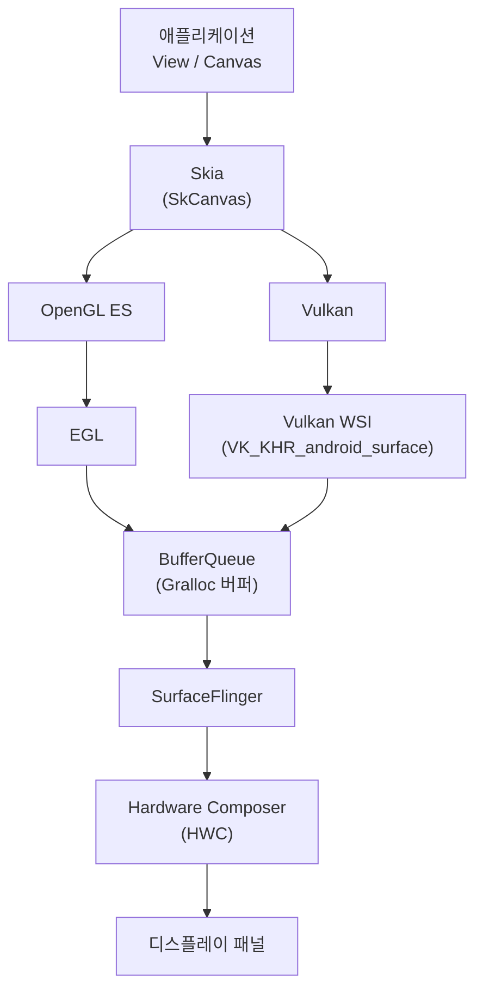
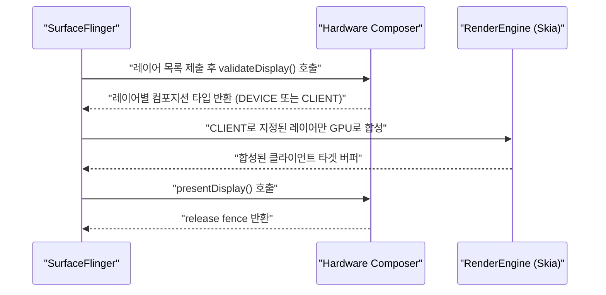

## 이 장을 읽기 전에

이 장은 [16장: On-Device AI/ML 통합](/post/android-hardware-development/on-device-ai-ml-integration/)에서 다룬 "어떤 연산을 어떤 하드웨어 블록에 위임할 것인가"라는 질문을 그래픽 도메인으로 옮겨서 다룬다. NPU에 텐서 연산을 맡기는 판단과, GPU 오버레이 플레인에 레이어 합성을 맡기는 판단은 구조적으로 같은 문제다. 따라서 이 장은 HAL(Hardware Abstraction Layer)의 기본 구조, Binder IPC 개념, C/C++로 네이티브 라이브러리를 빌드해 본 경험을 이미 갖추고 있다고 전제한다.

난이도는 중급–전문가 구간을 아우른다. 그래픽 스택의 레이어 구조를 처음 접하는 독자는 핵심 개념과 비교표까지만 읽어도 충분하고, HWC 커스터마이징이나 RenderEngine 튜닝을 실무에서 다뤄야 하는 독자는 실전 적용과 비판적 시각까지 읽는 것을 권한다. 이 장은 미디어 코덱, 카메라 ISP 파이프라인, 저지연 오디오 처리는 다루지 않는다. 이들은 그래픽과 마찬가지로 GPU·전용 하드웨어를 공유하지만 별도의 버퍼 흐름과 지연시간 예산을 갖는 독립된 주제이므로 이 장의 범위 밖으로 둔다.

## 당신의 수준에 맞는 경로

| 수준 | 읽을 부분 | 핵심 목표 |
|---|---|---|
| 중급 (그래픽 스택을 처음 정리하는 단계) | 핵심 개념, 비교/트레이드오프 | Skia → GPU API → BufferQueue → SurfaceFlinger → HWC로 이어지는 각 레이어의 책임을 자신의 언어로 설명할 수 있다 |
| 고급 (포팅·최적화 실무 경험 보유) | 실전 적용, 흔한 오개념 | HWC 오버레이 예산을 고려해 레이어를 설계하고, OpenGL ES와 Vulkan 중 상황에 맞는 API를 근거를 들어 선택할 수 있다 |
| 전문가 (RenderEngine·컴포지터·드라이버 개발) | 전체 + 참고 및 출처 원문 | validate/present 2단계 프로토콜과 Skia 백엔드 전환의 트레이드오프를 근거로 설계 결정을 내리고, 벤더별 HWC 구현 차이를 진단할 수 있다 |

## 도입

스마트폰 화면에 프레임이 한 장 뜨기까지, 안드로이드는 애플리케이션이 그린 도형을 최소 서너 개의 서로 다른 소프트웨어·하드웨어 계층을 거쳐 합성한다. 이 계층 구조를 모르는 상태에서 "왜 이 화면만 유독 배터리를 많이 먹지", "왜 이 레이아웃만 프레임을 드롭하지" 같은 질문에 답하려 하면, 추측에 의존한 최적화를 반복하게 된다. 실제 원인은 대개 GPU 셰이더 성능이 아니라, 레이어 개수가 하드웨어 오버레이 예산을 초과해 매 프레임 GPU 합성으로 폴백되는 구조적 문제이거나, 텍스처 포맷이 컴포지터가 기대하는 색공간과 맞지 않아 추가 변환 패스가 끼어드는 문제인 경우가 많다.

이 장은 안드로이드 그래픽 스택을 이론적으로 재구성한다. Skia가 어떤 방식으로 그리기 명령을 GPU 명령으로 변환하는지, Hardware Composer가 왜 존재하고 언제 개입하는지, GPU 렌더링 파이프라인이 모바일에서 왜 데스크톱과 다르게 동작하는지, 그리고 OpenGL ES와 Vulkan이 경쟁 관계가 아니라 서로 다른 문제를 푸는 도구라는 점을 순서대로 설명한다. 이 이해가 있어야 "프레임이 느리다"는 증상을 "어느 계층에서 무엇이 병목인가"라는 진단 가능한 질문으로 바꿀 수 있다.

## 핵심 개념

### 안드로이드 그래픽 스택 개관

안드로이드의 그리기 파이프라인은 생산자-소비자(producer-consumer) 모델로 이해하는 것이 가장 정확하다. 애플리케이션(생산자)은 픽셀이 채워진 버퍼를 만들어 큐에 밀어 넣고, 컴포지터(소비자)는 큐에서 버퍼를 꺼내 화면에 표시될 최종 프레임으로 합성한다. 이 모델의 핵심 자료구조가 **BufferQueue(버퍼큐)**다. BufferQueue는 **Gralloc(그래픽 메모리 할당자)**이 할당한 그래픽 버퍼를 힙처럼 재사용하면서, Binder IPC를 통해 프로세스 경계를 넘어 버퍼 소유권을 안전하게 주고받는다. 애플리케이션 프로세스와 시스템 프로세스인 SurfaceFlinger는 서로 다른 주소 공간에 있으므로, 버퍼 자체가 아니라 버퍼에 대한 핸들(파일 디스크립터)만 오가며 실제 픽셀 데이터는 복사되지 않는다.

이 생산-소비 구조 위에 두 종류의 렌더러가 얹힌다. 하나는 **Skia**로, View 시스템의 2D 드로잉(Canvas API)과 텍스트·벡터 그래픽을 담당한다. 다른 하나는 **OpenGL ES / Vulkan**으로, 게임이나 커스텀 3D 렌더링, 그리고 Skia 자신의 GPU 가속 백엔드가 사용하는 저수준 GPU API다. 두 렌더러 모두 최종적으로 **EGL**(OpenGL ES 경로) 또는 Vulkan WSI(Window System Integration, `VK_KHR_android_surface` 확장) 경로를 통해 BufferQueue에 완성된 버퍼를 제출한다. 이렇게 모인 버퍼들을 **SurfaceFlinger**가 프레임 하나로 합성하고, 실제 합성 연산의 상당 부분을 **Hardware Composer(HWC)**라는 디스플레이 전용 하드웨어에 위임한다.



이 다이어그램에서 눈여겨볼 지점은 화살표가 하나로 수렴한다는 것이다. Skia로 그리든 OpenGL ES로 그리든 Vulkan으로 그리든, 결과물은 결국 동일한 BufferQueue 인터페이스를 통해 SurfaceFlinger에 도착한다. 즉 렌더러 선택은 "그리기 명령을 어떻게 생성할 것인가"의 문제일 뿐, "합성이 어떻게 이루어지는가"와는 별개의 층위다. 이 분리가 뒤에서 다룰 OpenGL ES/Vulkan 선택 기준과 HWC 합성 전략을 독립적으로 판단할 수 있게 해 준다.

### Skia 그래픽 라이브러리 구조

**Skia**는 구글이 관리하는 오픈소스 2D 그래픽 라이브러리로, 크롬·크롬OS·안드로이드·플러터·파이어폭스 등에서 공통 렌더링 엔진으로 쓰인다. Skia의 공개 API는 `SkCanvas`를 중심으로 구성되며, `SkCanvas`는 도형·경로·텍스트·이미지를 그리는 명령을 받는 그리기 표면의 추상화다. 실제로 픽셀이 어디에 기록되는지는 `SkSurface`가 결정하는데, `SkSurface`는 CPU 메모리 위의 래스터 버퍼일 수도 있고 GPU 텍스처일 수도 있다. 이 백엔드 추상화 덕분에 상위 애플리케이션 코드는 "GPU가 있는가 없는가"를 신경 쓰지 않고 동일한 `SkCanvas` API로 그림을 그릴 수 있다.

안드로이드 View 시스템의 하드웨어 가속 렌더링(HWUI)은 별도의 RenderThread에서 그리기 명령 목록(display list)을 구성한 뒤 Skia의 GPU 백엔드로 이를 실행한다. Skia의 GPU 백엔드는 오랫동안 "Ganesh"라는 이름의 OpenGL/Vulkan 기반 백엔드였고, 이후 Vulkan과 Dawn(WebGPU 구현체)을 겨냥한 차세대 백엔드인 "Graphite"로의 전환이 진행되어 왔다. 어느 백엔드가 기본값인지, 어떤 안드로이드 버전부터 전환됐는지는 기기·안드로이드 버전·빌드 설정에 따라 달라지므로, 특정 버전을 기준으로 단정하기보다 "Skia는 백엔드를 교체 가능한 계층으로 설계했다"는 원칙을 이해하는 것이 실무적으로 더 유용하다.

Skia는 GPU 없이도 완전히 동작한다는 점이 중요하다. 서버 사이드에서 썸네일을 생성하거나, 헤드리스 환경에서 스크린샷을 렌더링하는 등 디스플레이 없는 컨텍스트에서는 CPU 래스터 백엔드만으로 충분하다. 다음 코드는 CPU 래스터 서피스를 만들어 둥근 사각형을 그리는 최소 예제로, GPU 컨텍스트 초기화 없이도 `SkCanvas` API가 동작함을 보여준다.

```cpp
#include "include/core/SkSurface.h"
#include "include/core/SkCanvas.h"
#include "include/core/SkPaint.h"
#include "include/core/SkColor.h"
#include "include/core/SkRect.h"

// CPU 래스터 백엔드로 오프스크린 서피스를 만들어 도형을 그린다.
// GPU 컨텍스트가 없는 헤드리스 환경(예: 썸네일 생성 서비스)에서도
// 동일한 SkCanvas API가 그대로 동작함을 보여준다.
void DrawRoundedRect(int width, int height) {
    sk_sp<SkSurface> surface = SkSurface::MakeRasterN32Premul(width, height);
    SkCanvas* canvas = surface->getCanvas();
    canvas->clear(SK_ColorWHITE);

    SkPaint paint;
    paint.setColor(SK_ColorBLUE);
    paint.setAntiAlias(true);

    SkRect rect = SkRect::MakeXYWH(20, 20,
                                    static_cast<SkScalar>(width - 40),
                                    static_cast<SkScalar>(height - 40));
    canvas->drawRoundRect(rect, 24, 24, paint);
}
```

이 코드에서 주의할 점은 `SkSurface::MakeRasterN32Premul`이 CPU 메모리에 버퍼를 할당한다는 것이다. 같은 그리기 명령을 GPU 텍스처에 그리려면 `SkSurface::MakeFromBackendTexture`류의 GPU 백엔드 생성 함수와 `GrDirectContext`(Ganesh) 또는 그래파이트의 `skgpu::graphite::Recorder`가 필요하다. 어느 경로를 taken하든 `SkCanvas` 이후의 그리기 호출 코드는 동일하게 유지된다는 것이 Skia 아키텍처가 주는 실질적 이점이다.

### GPU 렌더링 파이프라인

GPU 렌더링 파이프라인은 정점(vertex) 데이터가 화면의 픽셀로 변환되는 일련의 고정·프로그래머블 단계를 말한다. 정점 셰이더가 각 정점의 위치를 변환하고, 래스터화 단계가 정점들이 이루는 삼각형을 픽셀 격자에 투영해 어떤 픽셀이 삼각형 내부에 있는지 계산하며, 프래그먼트(픽셀) 셰이더가 각 픽셀의 최종 색상을 계산한다. 데스크톱 GPU는 대개 즉시 모드 렌더링(Immediate Mode Rendering, IMR) 방식을 쓰는데, 이는 삼각형이 도착하는 순서대로 바로 프레임버퍼에 기록하는 방식이다.

모바일 GPU 대부분(ARM Mali, Qualcomm Adreno, PowerVR 등)은 IMR 대신 **타일 기반 지연 렌더링(Tile-Based Deferred Rendering, TBDR)** 방식을 쓴다. TBDR은 화면을 작은 타일로 나누고, 한 프레임의 모든 지오메트리를 먼저 수집(binning)한 뒤 타일 단위로 온칩 메모리에서 래스터화·블렌딩을 끝내고 나서야 결과를 외부 메모리(DRAM)에 기록한다. 이 방식이 모바일에 유리한 이유는 대역폭이다. IMR은 픽셀을 덮어쓸 때마다(오버드로우가 있을 때마다) DRAM을 읽고 쓰지만, TBDR은 타일이 온칩 메모리에 있는 동안 여러 번 겹쳐 그려도 DRAM 접근이 발생하지 않는다. DRAM 접근은 모바일 SoC에서 가장 큰 전력 소비원 중 하나이므로, TBDR은 같은 장면을 그리는 데 필요한 배터리를 크게 줄인다.

이 구조는 실무에 직접적인 함의를 준다. TBDR에서는 프레임버퍼를 매 프레임 완전히 지우지 않고 이전 내용을 유지하려는 최적화(`glInvalidateFramebuffer`를 호출하지 않는 습관 등)가 오히려 타일 로드 비용을 발생시켜 성능을 해친다. 데스크톱 GPU 경험을 그대로 모바일에 옮기면 최적화 방향이 정반대로 뒤집히는 대표적인 사례다.

### OpenGL ES와 Vulkan의 역할 구분

**OpenGL ES**는 임베디드 시스템을 겨냥한 OpenGL의 서브셋으로, 상태 머신(state machine) 모델을 따른다. 텍스처를 바인딩하고, 셰이더를 활성화하고, 그리기 호출을 하는 절차형 API이며, 드라이버가 내부적으로 명령 스트림 생성, 자원 동기화, 메모리 배치를 대신 처리해 준다. 이 편의성은 대가를 동반한다. 드라이버가 매 호출마다 상태 유효성을 검증하고 필요한 동기화를 삽입해야 하므로, 그리기 호출이 많은 장면에서는 드라이버 오버헤드가 CPU 병목이 되기 쉽다. 또한 OpenGL ES 컨텍스트는 기본적으로 하나의 스레드에 강하게 묶여 있어, 여러 스레드에서 그리기 명령을 병렬로 준비하기가 까다롭다.

**Vulkan**은 크로노스 그룹(Khronos Group)이 설계한 저수준 GPU API로, OpenGL ES가 드라이버에 맡기던 책임의 상당 부분을 애플리케이션에 명시적으로 넘긴다. 메모리 할당, 파이프라인 상태 객체 생성, 커맨드 버퍼 기록, 그리고 GPU 작업 간 동기화(펜스·세마포어·배리어)를 모두 애플리케이션 코드가 직접 관리한다. 이 명시성 덕분에 여러 스레드가 각자 커맨드 버퍼를 독립적으로 기록한 뒤 한 번에 제출할 수 있어, CPU 코어가 여러 개인 모바일 SoC의 병렬성을 활용하기 유리하다. 안드로이드는 Vulkan을 7.0(API 24)부터 지원하기 시작했으며, 실제 기기에서의 드라이버 완성도와 확장 지원 범위는 SoC 벤더와 안드로이드 버전에 따라 차이가 있다.

두 API는 대체 관계가 아니라 역할이 다른 도구로 이해해야 한다. Skia의 GPU 백엔드, WebView, 대부분의 UI 프레임워크는 여전히 OpenGL ES 경로(또는 그 위에 구축된 Ganesh/Graphite)를 폭넓게 지원하는데, 이는 개발 생산성과 광범위한 기기 호환성이 중요하기 때문이다. 반면 그리기 호출이 수천 건에 달하는 게임 엔진이나, GPU 자원을 세밀하게 스케줄링해야 하는 실시간 컴퓨팅(GPU 기반 ML 추론 등)에서는 Vulkan의 명시적 제어가 실질적인 성능 이득으로 이어진다.

### Hardware Composer(HWC)

**Hardware Composer(HWC)**는 디스플레이 서브시스템을 위한 하드웨어 추상화 계층으로, SurfaceFlinger가 준비한 여러 레이어를 최종 화면으로 합성하는 작업을 GPU가 아니라 디스플레이 컨트롤러의 전용 합성 하드웨어에 위임할 수 있게 해 준다. 대부분의 모바일 디스플레이 컨트롤러는 오버레이 플레인(overlay plane)이라는 고정 기능 하드웨어를 여러 개(기기·SoC에 따라 보통 서너 개에서 여덟 개 내외) 갖추고 있으며, 각 플레인은 독립적인 버퍼를 읽어와 스케일링·회전·알파 블렌딩을 하드웨어 회로로 수행한 뒤 하나의 화면으로 겹쳐 낸다. 이 연산은 셰이더를 실행하는 것이 아니라 고정된 회로를 거치는 것이므로, GPU로 같은 합성을 수행하는 것보다 전력 소비가 훨씬 적다.

SurfaceFlinger와 HWC는 검증(validate)과 표시(present)라는 2단계 프로토콜로 협상한다. SurfaceFlinger는 매 프레임 현재 레이어 목록을 HWC에 제출하며 이 레이어들을 오버레이로 처리할 수 있는지 묻는다. HWC는 오버레이 플레인 개수, 지원하는 블렌딩 모드, 픽셀 포맷 제약 등을 고려해 레이어마다 "DEVICE"(하드웨어 오버레이로 처리 가능) 또는 "CLIENT"(하드웨어가 처리할 수 없으므로 GPU가 먼저 합성해서 넘겨 달라) 중 하나로 응답한다. CLIENT로 지정된 레이어들은 SurfaceFlinger의 RenderEngine(Skia 기반 GPU 컴포지터)이 먼저 하나의 버퍼로 합성하고, 그 결과 버퍼를 다시 하나의 레이어로 HWC에 제출한 뒤에야 최종 표시(present) 단계가 진행된다.



이 프로토콜에서 실무적으로 중요한 지점은 두 가지다. 첫째, HWC가 무엇을 오버레이로 받아 줄지는 애플리케이션이 직접 제어할 수 없고 매 프레임 동적으로 재협상된다. 화면에 뜬 레이어 수가 오버레이 플레인 예산을 넘으면 일부는 자동으로 CLIENT로 강등되어 GPU 합성 경로를 타게 되고, 이는 곧 전력 소비 증가로 이어진다. 둘째, 이 인터페이스는 안드로이드 버전에 걸쳐 HWC1 → HWC2(HIDL 기반) → AIDL 기반 IComposer로 세대를 거쳐 왔고, 세대마다 콜백 구조와 확장 지점이 달라졌다. 정확한 인터페이스 시그니처는 대상 안드로이드 버전의 AOSP 소스에서 확인해야 하며, 이 장에서는 세대에 걸쳐 변하지 않는 validate/present의 개념적 구조에 집중한다.

## 비교/트레이드오프

GPU 합성과 HWC 오버레이 합성은 같은 결과(합성된 프레임)를 만들어내지만 자원 소비 구조가 근본적으로 다르다. 다음 표는 이 둘을 SurfaceFlinger의 관점에서 비교한 것이다.

| 항목 | GPU 합성 (CLIENT) | HWC 오버레이 합성 (DEVICE) |
|---|---|---|
| 처리 주체 | RenderEngine(Skia GPU 백엔드) | 디스플레이 컨트롤러의 전용 회로 |
| 전력 소비 | 상대적으로 높음(셰이더 실행 + DRAM 대역폭) | 낮음(고정 기능 블렌딩, 온칩 처리) |
| 처리 가능 레이어 수 | 사실상 제한 없음(한 프레임버퍼로 순차 합성) | 오버레이 플레인 개수만큼(기기별 상이, 초과 시 자동 CLIENT 폴백) |
| 지원 연산 | 임의의 셰이더·블렌딩·이펙트 | 제한된 스케일/회전/알파 블렌드 모드 |
| 프레임 지연 | 상대적으로 큼(GPU 파이프라인 통과 필요) | 작음 |
| 결정 주체 | validateDisplay() 결과에 따라 SurfaceFlinger가 자동 결정 | 상동 |

이 표가 시사하는 실전 판단 기준은 명확하다. 레이어 수를 오버레이 플레인 예산 이내로 유지하면(대체로 화면을 구성하는 시스템 바, 상태 바, 앱 콘텐츠, IME 정도로 억제하면) 배터리 소비가 눈에 띄게 줄어든다. 반대로 커스텀 셰이더 효과나 복잡한 블렌딩이 필요한 레이어는 애초에 HWC가 처리할 수 없으므로 GPU 합성을 피할 수 없다는 것을 인정하고, 대신 그런 레이어의 개수와 크기를 최소화하는 방향으로 설계해야 한다.

OpenGL ES와 Vulkan의 선택은 프로그래밍 모델 자체가 다르므로 더 신중한 판단이 필요하다.

| 항목 | OpenGL ES | Vulkan |
|---|---|---|
| 프로그래밍 모델 | 암묵적 상태 머신 | 명시적 객체·상태 관리 |
| 드라이버 오버헤드 | 드라이버가 검증·동기화를 대신 수행(오버헤드 큼) | 애플리케이션이 검증·동기화를 직접 수행(오버헤드 작음) |
| 멀티스레드 커맨드 생성 | 컨텍스트가 사실상 단일 스레드에 묶임 | 여러 스레드가 독립적으로 커맨드 버퍼 기록 가능 |
| 동기화 모델 | 드라이버 내부에서 암묵적으로 처리 | 펜스·세마포어·배리어로 명시적 처리 |
| 코드량·복잡도 | 상대적으로 적음 | 초기화만으로도 코드량이 크게 늘어남 |
| 적합한 상황 | UI 수준 렌더링, 빠른 프로토타이핑, 폭넓은 기기 호환성 필요 | 그리기 호출이 많은 게임, CPU 병목이 뚜렷한 렌더링, 세밀한 GPU 스케줄링이 필요한 경우 |

두 API 중 무엇을 쓸지는 "우리 병목이 GPU 셰이더 실행 시간인가, 아니면 CPU에서 드라이버 호출을 처리하는 시간인가"라는 질문으로 판단한다. 프로파일러(Android GPU Inspector, Snapdragon Profiler 등)로 CPU 사이드에서 드라이버 스레드가 병목이라는 것이 확인되기 전에는, 개발 속도와 유지보수성이 더 나은 OpenGL ES를 유지하는 편이 합리적인 경우가 많다.

## 실전 적용

임베디드 IVI(In-Vehicle Infotainment) 보드에 커스텀 런처를 이식하는 상황을 가정한다. 이 보드의 디스플레이 컨트롤러는 오버레이 플레인을 세 개만 지원하고, 배터리가 아니라 발열과 팬 소음이 제약 조건이라 GPU 합성 사용량을 최소화해야 한다. 이런 제약 아래서는 화면을 구성하는 레이어를 설계 단계에서부터 세 개의 예산 안에 배치하도록 계획해야 한다. 예컨대 배경(1), 콘텐츠(1), 상태 표시줄(1)로 예산을 정확히 채우고, 알림 배지나 애니메이션 효과처럼 추가 레이어가 필요한 요소는 별도 서피스를 새로 만들지 않고 콘텐츠 레이어 안에서 Skia로 직접 합성하는 방식을 택한다.

콘텐츠 레이어를 그리는 경로는 두 갈래로 나뉜다. 정적인 대시보드 요소는 OpenGL ES 경로로 충분하며, EGL을 통해 네이티브 윈도우에 렌더링 컨텍스트를 연결하는 절차는 다음과 같다.

```c
#include <EGL/egl.h>
#include <GLES2/gl2.h>
#include <android/native_window.h>
#include <stdbool.h>

// ANativeWindow로부터 OpenGL ES 2.0 렌더링 컨텍스트를 생성한다.
// SurfaceView가 내부적으로 수행하는 절차와 동일한 최소 형태다.
bool CreateGlesContext(ANativeWindow* window,
                        EGLDisplay* outDisplay,
                        EGLSurface* outSurface,
                        EGLContext* outContext) {
    EGLDisplay display = eglGetDisplay(EGL_DEFAULT_DISPLAY);
    if (display == EGL_NO_DISPLAY) return false;
    if (!eglInitialize(display, NULL, NULL)) return false;

    const EGLint configAttribs[] = {
        EGL_SURFACE_TYPE, EGL_WINDOW_BIT,
        EGL_RENDERABLE_TYPE, EGL_OPENGL_ES2_BIT,
        EGL_RED_SIZE, 8,
        EGL_GREEN_SIZE, 8,
        EGL_BLUE_SIZE, 8,
        EGL_ALPHA_SIZE, 8,
        EGL_NONE
    };
    EGLConfig config;
    EGLint numConfigs = 0;
    if (!eglChooseConfig(display, configAttribs, &config, 1, &numConfigs)
        || numConfigs == 0) {
        return false;
    }

    EGLSurface surface = eglCreateWindowSurface(display, config, window, NULL);
    if (surface == EGL_NO_SURFACE) return false;

    const EGLint contextAttribs[] = { EGL_CONTEXT_CLIENT_VERSION, 2, EGL_NONE };
    EGLContext context = eglCreateContext(display, config, EGL_NO_CONTEXT,
                                           contextAttribs);
    if (context == EGL_NO_CONTEXT) return false;

    if (!eglMakeCurrent(display, surface, surface, context)) return false;

    *outDisplay = display;
    *outSurface = surface;
    *outContext = context;
    return true;
}
```

이 코드에서 `EGL_SURFACE_TYPE`을 `EGL_WINDOW_BIT`로 지정한 것은 오프스크린 렌더링이 아니라 실제 화면에 표시될 윈도우 서피스를 만들겠다는 의미다. `eglMakeCurrent` 호출이 성공하면 현재 스레드에 GPU 컨텍스트가 바인딩되며, 이후 `glClear`, `glDrawArrays` 같은 OpenGL ES 호출이 이 컨텍스트를 대상으로 실행된다.

반면 계기판 애니메이션처럼 프레임마다 다수의 그리기 호출이 발생하고 여러 코어에서 명령을 병렬로 준비해야 하는 레이어는 Vulkan이 유리하다. Vulkan은 초기화 단계부터 인스턴스와 물리 장치를 애플리케이션이 직접 열거해야 하며, 안드로이드에서는 `VK_KHR_android_surface` 확장으로 네이티브 윈도우를 표면(surface)에 연결한다.

```cpp
#include <vulkan/vulkan.h>
#include <cstring>

// Vulkan 인스턴스를 생성한다. OpenGL ES와 달리 확장·레이어를
// 애플리케이션이 명시적으로 선언해야 하며, 드라이버는 여기서
// 선언되지 않은 기능을 암묵적으로 활성화하지 않는다.
VkResult CreateVulkanInstance(VkInstance* outInstance) {
    VkApplicationInfo appInfo{};
    appInfo.sType = VK_STRUCTURE_TYPE_APPLICATION_INFO;
    appInfo.pApplicationName = "IviClusterAnimation";
    appInfo.applicationVersion = VK_MAKE_VERSION(1, 0, 0);
    appInfo.apiVersion = VK_API_VERSION_1_1;

    const char* extensions[] = {
        VK_KHR_SURFACE_EXTENSION_NAME,
        VK_KHR_ANDROID_SURFACE_EXTENSION_NAME
    };

    VkInstanceCreateInfo createInfo{};
    createInfo.sType = VK_STRUCTURE_TYPE_INSTANCE_CREATE_INFO;
    createInfo.pApplicationInfo = &appInfo;
    createInfo.enabledExtensionCount =
        static_cast<uint32_t>(sizeof(extensions) / sizeof(extensions[0]));
    createInfo.ppEnabledExtensionNames = extensions;

    return vkCreateInstance(&createInfo, nullptr, outInstance);
}
```

`VK_KHR_ANDROID_SURFACE_EXTENSION_NAME`은 안드로이드 플랫폼 전용 확장으로, 이후 `vkCreateAndroidSurfaceKHR` 호출에서 `ANativeWindow` 포인터를 전달해 실제 화면 표면을 만드는 데 쓰인다. 인스턴스 생성 이후에는 물리 장치 열거, 큐 패밀리 선택, 논리 장치 생성, 스왑체인 구성이 이어지는데, 이 각 단계가 바로 OpenGL ES가 드라이버 내부에 숨겨 두었던 책임을 애플리케이션에 노출한 지점들이다.

마지막으로, 이 런처가 백그라운드에서 위젯 미리보기 이미지를 서버리스 배치 작업으로 생성해야 한다면 디스플레이도 GPU 컨텍스트도 필요 없다. 이 경우 앞서 다룬 Skia CPU 래스터 서피스(`SkSurface::MakeRasterN32Premul`)를 그대로 재사용해, 디스플레이 파이프라인 전체를 우회하고 순수 CPU 연산만으로 이미지를 렌더링할 수 있다. 같은 그리기 로직을 화면 표시용과 배치 렌더링용 양쪽에 재사용할 수 있다는 점이 Skia를 백엔드 추상화 계층으로 두는 실질적 이점이다.

## 흔한 오개념

첫 번째 오개념은 "SurfaceFlinger는 항상 GPU로 화면을 합성한다"는 생각이다. 실제로는 그 반대에 가깝다. HWC가 처리할 수 있는 레이어는 GPU를 전혀 거치지 않고 디스플레이 컨트롤러의 오버레이 플레인에서 직접 합성된다. GPU 합성(RenderEngine 경로)은 HWC가 처리하지 못하는 레이어에 대한 폴백이지, 기본 경로가 아니다. 이 오해를 가진 채로 최적화를 시도하면 "GPU 셰이더를 줄이자"는 엉뚱한 방향으로 흐르기 쉽다. 실제로 확인해야 할 것은 레이어 수와 오버레이 플레인 예산의 관계다.

두 번째 오개념은 "Vulkan이 OpenGL ES보다 항상 빠르다"는 단정이다. Vulkan의 성능 이점은 애플리케이션이 동기화와 메모리 관리를 GPU 드라이버보다 잘 해낼 수 있을 때만 실현된다. 명시적 동기화를 잘못 구성하면 데이터 경합이나 불필요한 대기가 발생해 OpenGL ES 구현보다 오히려 느려질 수 있다. Vulkan은 "빠른 API"가 아니라 "빠르게 만들 수 있는 권한을 넘겨주는 API"라고 이해하는 것이 정확하다.

세 번째 오개념은 "Skia는 2D 전용이라 게임이나 고성능 렌더링과 무관하다"는 생각이다. Skia는 벡터 그래픽·텍스트 전용 라이브러리가 아니라 GPU 백엔드를 갖춘 범용 2D 렌더링 엔진이며, 안드로이드 View 시스템의 하드웨어 가속 렌더링과 WebView의 실질적인 렌더링 엔진이 바로 Skia다. "2D"라는 이름 때문에 소프트웨어 렌더링만 한다고 오해하기 쉽지만, 실제로는 OpenGL ES/Vulkan 위에서 GPU 가속을 받는 경우가 일반적인 프로덕션 구성이다.

## 비판적 시각

이 장에서 설명한 계층 구조는 AOSP 공개 인터페이스 수준에서는 일관되지만, 실제 기기에서의 동작은 벤더 구현에 크게 좌우된다는 한계가 있다. HWC의 오버레이 플레인 개수, 지원하는 블렌딩 모드, 픽셀 포맷 제약은 공개 문서에 표준화된 숫자로 정리되어 있지 않고 SoC 벤더의 HAL 구현에 따라 달라진다. 같은 안드로이드 버전이라도 삼성·퀄컴·미디어텍 기반 기기에서 동일한 레이어 구성이 서로 다른 합성 전략으로 처리될 수 있으며, 이는 "AOSP 표준 API를 따랐으니 모든 기기에서 같은 성능이 나올 것"이라는 가정을 무너뜨린다. 실무에서는 반드시 대상 기기에서 GPU 프로파일러로 실측해야 한다.

Vulkan 채택 역시 트레이드오프가 뚜렷하다. 명시적 동기화 모델은 성능을 위한 권한이지만, 동시에 정확성 책임도 애플리케이션에 전가한다. 검증 레이어(validation layer) 없이 개발하면 리소스 생존 주기나 동기화 오류가 특정 기기·특정 드라이버에서만 발현되는 재현하기 어려운 버그로 이어지기 쉽다. 팀의 규모나 릴리스 일정에 따라, Vulkan의 잠재적 성능 이득이 늘어난 디버깅 비용을 상쇄하지 못하는 경우도 실제로 존재한다.

Skia의 백엔드 전환(Ganesh에서 Graphite로)도 완결된 사실이 아니라 진행 중인 전환이다. 특정 안드로이드 버전에서 어떤 백엔드가 기본값인지, 특정 기기가 Graphite를 완전히 지원하는지는 시점에 따라 달라질 수 있으므로, 프로덕션 코드에서 백엔드 종류에 의존하는 가정을 하드코딩하기보다는 Skia의 공개 API 추상화를 신뢰하고 백엔드는 빌드/런타임 설정에 맡기는 편이 안전하다.

## 다음 장에서는

[18장: 시스템 통합 및 최종 테스팅](/post/android-hardware-development/system-integration-testing/)에서는 지금까지 다룬 그래픽 스택을 포함한 전체 하드웨어-소프트웨어 서브시스템을 하나의 제품으로 통합하고 검증하는 과정을 다룬다.

## 평가 기준

이 장을 읽은 후 다음을 할 수 있어야 한다.

- Skia, OpenGL ES/Vulkan, BufferQueue, SurfaceFlinger, HWC가 각각 어떤 책임을 지는지, 그리고 그리기 명령이 화면에 도달하기까지 이 계층들을 어떤 순서로 통과하는지 설명할 수 있다.
- GPU 합성과 HWC 오버레이 합성의 전력·지연시간·처리 가능 레이어 수 트레이드오프를 근거로 레이어 예산을 설계할 수 있다.
- 모바일 GPU가 타일 기반 지연 렌더링을 쓰는 이유와, 이것이 프레임버퍼 무효화 같은 구체적 최적화 습관에 미치는 영향을 설명할 수 있다.
- OpenGL ES와 Vulkan 중 어떤 것을 선택할지, CPU/GPU 병목 진단 결과를 근거로 판단할 수 있다.
- HWC의 validate/present 2단계 프로토콜과 DEVICE/CLIENT 컴포지션 타입 분기를 설명할 수 있다.
- "SurfaceFlinger는 항상 GPU로 합성한다", "Vulkan이 항상 더 빠르다" 같은 흔한 오개념을 근거를 들어 반박할 수 있다.

## 참고 및 출처

- Android Open Source Project, [Graphics](https://source.android.com/docs/core/graphics) — SurfaceFlinger, Hardware Composer, Gralloc, BufferQueue의 공식 아키텍처 개요.
- Android Developers, [Get started with Vulkan](https://developer.android.com/ndk/guides/graphics/getting-started) — 안드로이드에서 Vulkan 샘플을 빌드·실행하는 공식 가이드, Vulkan 지원 최소 버전(Android 7.0 / API 24) 명시.
- Android Developers, [Displaying graphics with OpenGL ES](https://developer.android.com/develop/ui/views/graphics/opengl) — OpenGL ES 2.0 기반 렌더링 환경 구성 공식 가이드.
- Skia, [Documentation](https://skia.org/docs/) — Skia 그래픽 라이브러리 공식 문서 허브, SkCanvas/SkSurface API 레퍼런스 및 백엔드 구조 설명.
