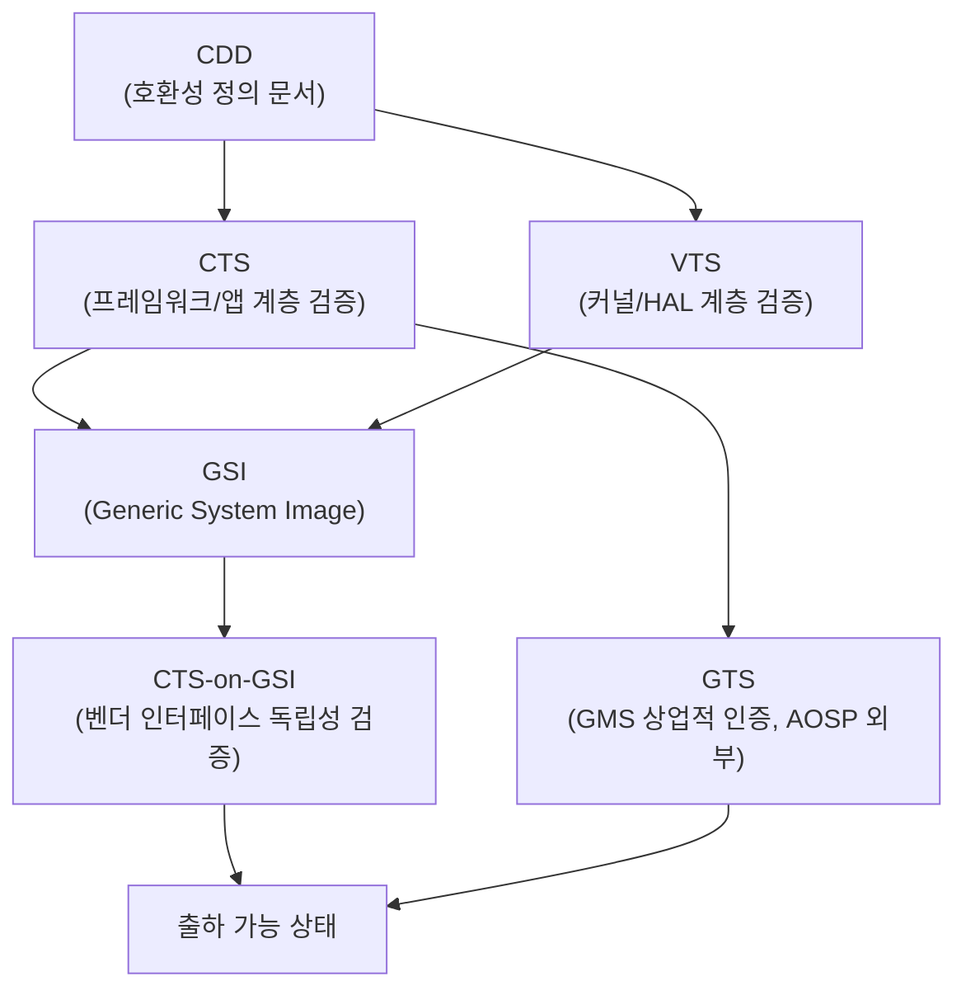

## 이 장을 읽기 전에

이 장은 [17장: 안드로이드 그래픽 엔진](/post/android-hardware-development/android-graphics-engine/)에서 다룬 렌더링 파이프라인 최적화까지, 시리즈 전체(1장 부트로더·커널부터 17장 그래픽 스택까지)에서 쌓아온 개별 서브시스템 역량을 전제로 한다. 이 장을 읽기 전에 최소한 HAL(Hardware Abstraction Layer)과 AIDL/HIDL 기반 벤더 인터페이스 개념, 그리고 커널-유저스페이스 경계에 대한 기본 이해가 있어야 이후 내용이 자연스럽게 연결된다.

난이도는 중급~고급이다. 개별 드라이버 작성법이나 HAL 구현 세부 API는 다시 설명하지 않는다 — 그 내용은 각각 [07장: 디바이스 드라이버 개발](/post/android-hardware-development/device-drivers/)과 [04장: 하드웨어 추상화 계층(HAL) 개발](/post/android-hardware-development/hal-development/) 같은 앞선 챕터의 몫이다. 이 장은 그 개별 결과물들이 하나의 시스템으로 합쳐질 때 발생하는 문제 — 서브시스템은 각각 정상 동작하는데 왜 통합 후에는 깨지는가, 무엇을 기준으로 "출시 가능"이라고 판단하는가 — 를 다룬다. 개별 하드웨어 블록의 저수준 튜닝 기법이 필요하다면 해당 챕터로 돌아가는 것이 맞다.

## 당신의 수준에 맞는 경로

| 수준 | 읽을 부분 | 핵심 목표 |
|------|----------|----------|
| 처음 통합 테스트를 접하는 개발자 | 도입, 핵심 개념, 비교/트레이드오프 | CTS/VTS/GTS의 역할 차이와 CDD가 왜 존재하는지 이해 |
| 개별 HAL/드라이버는 작성해봤지만 통합 경험이 없는 엔지니어 | 핵심 개념 전체, 실전 적용 | 회귀 테스트 파이프라인 설계, 실패 격리(triage) 방법 습득 |
| 출시를 앞둔 프로젝트의 QA/릴리스 리드 | 비교/트레이드오프, 실전 적용, 흔한 오개념, 비판적 시각 | 상용화 전 체크리스트 설계와 조직적 함정 회피 |

## 도입

17개 챕터를 거치며 쌓은 부트로더, 커널 드라이버, HAL, 그래픽 스택은 각각 단위 테스트를 통과했다고 해서 자동으로 "제품"이 되지 않는다. 개별 컴포넌트가 스펙대로 동작하는 것과, 수백 개의 컴포넌트가 동시에 켜진 실제 디바이스에서 사용자가 12시간 동안 앱을 전환하고 통화를 받고 카메라를 켜는 동안 아무것도 깨지지 않는 것은 완전히 다른 차원의 문제다. 시스템 통합(System Integration)은 이 간극을 메우는 공학 활동이며, 최종 테스팅은 그 결과를 정량적으로 검증하는 절차다.

이 주제가 실무에서 중요한 이유는 단순하다. 개별 기능 결함은 패치 하나로 고칠 수 있지만, 통합 결함 — 예를 들어 전력 관리 HAL이 절전 모드로 전환할 때 카메라 HAL의 인터럽트 핸들러가 경쟁 상태(race condition)에 빠지는 문제 — 은 원인 파악에만 며칠이 걸리고, 출시 직전에 발견되면 일정 전체를 흔든다. 게다가 Android 생태계에 참여하려면 Google이 정의한 호환성 기준(CDD, CTS, VTS)을 통과해야 하는데, 이 기준들은 "이 정도면 되겠지"라는 감으로는 충족되지 않는다. 이 장은 그 기준을 통과하기 위한 전략과, 통과 이후에도 남는 실사용 품질 문제를 어떻게 조직적으로 잡아내는지를 다룬다.

## 핵심 개념

### 호환성 검증 3종 세트: CDD, CTS, VTS

**CDD(Compatibility Definition Document, 호환성 정의 문서)**는 어떤 기기가 특정 Android 버전과 "호환된다"고 주장하기 위해 충족해야 할 요구사항을 문서로 규정한 것이다. Android 공식 문서는 CDD를 "Android 소스코드와 SDK 문서를 참조하는 중심축" 역할로 설명하며, 특히 그래픽 표시 능력이나 하드웨어 기능처럼 자동화된 테스트 스위트만으로는 검증하기 어려운 요구사항을 명문화한다는 점을 강조한다. 실무적으로 CDD는 "무엇을 만들어야 하는가"에 대한 설계 문서이자 계약서이며, 통합 테스트 계획을 세우기 전에 반드시 대상 Android 버전의 CDD를 정독해야 하는 이유가 여기에 있다.

**CTS(Compatibility Test Suite, 호환성 테스트 스위트)**는 CDD에 규정된 요구사항 중 자동화 가능한 부분을 실제로 검증하는 도구 모음이다. Java JUnit 기반의 자동화 테스트와, 자동화가 불가능한 항목(카메라 프리뷰 품질, 센서 반응성 등)을 사람이 확인하는 CTS Verifier(CTS-V)로 구성된다. CTS는 API 시그니처, 플랫폼 API 동작, Intent 처리, 권한 모델, 리소스 처리 등 주로 애플리케이션 프레임워크 계층의 정합성을 검증하는 데 초점을 맞춘다.

**VTS(Vendor Test Suite)**는 CTS와 대칭을 이루는 개념으로, 커널과 HAL을 포함한 벤더 구현 계층을 검증한다. VTS는 GTest 스타일의 C++ HAL 검증 테스트, Linux 커널 테스트(Kselftest, LTP 포함), 호스트 기반 JUnit 테스트로 구성되며, Android 8.0에서 도입된 Treble 아키텍처 — 프레임워크와 벤더 구현을 AIDL/HIDL 인터페이스로 분리하는 구조 — 를 전제로 벤더 인터페이스가 프레임워크와 독립적으로 안정적인지 검증한다. CTS가 "이 기기 위에서 Android 앱이 기대한 대로 동작하는가"를 묻는다면, VTS는 "이 벤더 구현이 다음 프레임워크 업데이트가 와도 계속 동작할 수 있는 형태로 짜여 있는가"를 묻는다.

**GTS(GMS Test Suite)**는 CTS/VTS와 달리 AOSP 공개 소스의 일부가 아니라, Google Mobile Services(Gmail, Play Store, Google 어시스턴트 등)를 탑재하려는 기기가 통과해야 하는 별도의 인증 절차에 속한다. 이는 Google과 기기 제조사 간의 상업적 라이선스 계약에 종속되어 있어 AOSP 문서처럼 공개적으로 접근할 수 없다. 이 블로그는 Google과의 공식 제휴나 인증 권한을 갖고 있지 않으므로, GTS에 대해서는 "GMS를 포함하려는 제품이라면 CTS/VTS를 통과한 이후에 별도로 존재하는 상업적 인증 절차"라는 개념적 위치만 설명하고, 세부 테스트 항목은 다루지 않는다.

세 가지 검증 체계의 관계를 정리하면, CDD가 규정하고 CTS와 VTS가 AOSP 공개 방식으로 검증하며 GTS가 그 위에 상업적 조건을 얹는 계층 구조다. 아래 다이어그램은 그 흐름을 보여준다.



이 흐름에서 실무적으로 중요한 지점은 GSI(Generic System Image)다. GSI는 AOSP 코드를 수정하지 않은 순수 Android 시스템 이미지로, 기기의 실제 시스템 이미지를 GSI로 교체한 뒤 VTS를 실행하면 벤더 구현이 프레임워크 변경에 얼마나 독립적인지 드러난다. Android 공식 문서는 "GSI는 VTS 및 CTS-on-GSI 테스트를 실행하는 데 사용되며, 기기의 시스템 이미지를 GSI로 교체한 뒤 VTS로 테스트한다"고 설명한다. 벤더 코드가 프레임워크 계층에 몰래 의존하고 있었다면 GSI 교체 시점에 즉시 드러나므로, 이는 Treble 준수 여부를 검증하는 가장 실전적인 방법이다.

### Trade Federation과 테스트 실행 인프라

CTS와 VTS는 각각 독립된 도구가 아니라 **Trade Federation(Tradefed, TF)**이라는 공통 프레임워크 위에서 실행된다. Trade Federation은 Android 기기를 대상으로 지속적인 테스트를 실행하도록 설계된 Java 기반 호스트 애플리케이션으로, adb를 통해 기기와 통신하며 instrumentation 테스트, uiautomator 테스트, native/gtest 테스트, 호스트 기반 JUnit 테스트를 모두 하나의 파이프라인으로 통합해 실행할 수 있다. 여러 기기에 걸쳐 테스트를 샤딩(sharding)해 병렬로 돌리는 기능과, 실패한 테스트만 골라 재실행하는 재시도 기능을 제공한다는 점이 실무에서 특히 유용하다 — 수만 개에 달하는 CTS 테스트 케이스를 순차 실행하면 하루를 넘기기 쉽지만, 샤딩으로 여러 기기에 분산시키면 몇 시간 단위로 줄일 수 있다.

이 인프라를 이해하는 것이 왜 중요한가 하면, CI/CD 파이프라인에 CTS/VTS를 통합할 때 "테스트를 통과했다"는 결과만 보고할 것이 아니라 어떤 테스트가 실행되지 않고 건너뛰어졌는지(module not found, ABI mismatch 등)를 함께 확인해야 하기 때문이다. Trade Federation은 실행하지 못한 테스트를 실패가 아닌 "not executed"로 분류하는 경우가 있어, 리포트만 훑어보면 실제로는 검증되지 않은 영역을 통과한 것으로 착각하기 쉽다.

### 회귀 테스트 체계의 설계 원칙

**회귀 테스트(Regression Testing)**는 새 변경이 기존에 정상 동작하던 기능을 깨뜨리지 않았는지 확인하는 테스트다. 단일 컴포넌트 개발 단계에서는 회귀 테스트가 사치처럼 느껴질 수 있지만, 17개 서브시스템이 통합된 시점부터는 필수 인프라가 된다. 이유는 통합 시스템에서 변경의 영향 범위를 사람이 예측할 수 없기 때문이다 — 전력 관리 커널 드라이버의 사소한 타이밍 변경이 왜 블루투스 오디오 스트리밍의 간헐적 끊김으로 이어지는지, 코드만 봐서는 알 수 없는 경우가 흔하다.

효과적인 회귀 테스트 체계는 세 가지 계층으로 나뉜다. 첫째, 커밋 단위로 몇 분 안에 끝나는 스모크 테스트(smoke test) 계층으로, 부팅 성공 여부와 핵심 서비스 기동 여부만 확인한다. 둘째, 매일 밤 실행되는 나이틀리(nightly) 계층으로, CTS/VTS 전체 스위트와 자동화된 UI 시나리오(Monkey 테스트 등)를 포함한다. 셋째, 릴리스 후보 시점에만 실행되는 확장 계층으로, 장시간 안정성 테스트와 CTS-on-GSI, 실제 사용자 시나리오 기반 수동 테스트를 포함한다. 이 계층 구조가 없으면 두 가지 극단에 빠진다 — 모든 테스트를 매 커밋마다 돌리다가 피드백 루프가 너무 느려져 팀이 우회하기 시작하거나, 반대로 릴리스 직전에만 몰아서 테스트하다가 근본 원인 파악에 걸리는 시간이 릴리스 일정을 초과하는 상황이다.

회귀 테스트에서 가장 실패하기 쉬운 지점은 실패를 감지하는 것이 아니라 **격리(triage)**다. 통합 시스템에서 하나의 테스트가 실패했을 때, 그 원인이 방금 병합된 커밋인지, 테스트 자체의 불안정성(flaky test)인지, 아니면 테스트 인프라(기기 연결 불안정 등)의 문제인지 구분하는 절차가 없으면 회귀 테스트 결과 자체를 팀이 신뢰하지 않게 되고, 결국 "빨간 테스트를 무시하고 병합하는" 문화가 자리 잡는다. 이는 회귀 테스트 체계 전체를 무력화하는 가장 흔한 실패 양상이다.

## 비교/트레이드오프

CTS, VTS, 자체 회귀 테스트, 그리고 수동 QA는 서로 대체재가 아니라 서로 다른 층위의 결함을 잡아내는 상호보완적 도구다. 각각이 무엇을 검증하고 무엇을 검증하지 못하는지 명확히 구분해야 리소스를 어디에 배분할지 판단할 수 있다.

| 검증 수단 | 주 검증 대상 | 실행 주기에 적합한 시점 | 잡아내지 못하는 결함 |
|---|---|---|---|
| CTS | 프레임워크/앱 API 정합성 | 릴리스 후보, 나이틀리 | 벤더 HAL 내부 로직, 실사용 UX 품질 |
| VTS | 커널·HAL·벤더 인터페이스 안정성 | 커밋~나이틀리(모듈 단위), 릴리스 후보(전체) | 프레임워크 계층 버그, 앱 상호작용 |
| 자체 회귀 테스트 | 프로젝트 고유 통합 시나리오(멀티태스킹, 특정 하드웨어 조합) | 커밋~나이틀리 | Google이 정의한 표준 호환성 기준 |
| 수동 QA/사용성 테스트 | 자동화가 어려운 감각적 품질(터치 반응감, 카메라 화질) | 릴리스 후보 | 광범위한 회귀, 반복 가능한 정량 측정 |

이 표에서 판단 기준을 끌어내면, CTS/VTS는 "Google 생태계에 참여할 자격이 있는가"를 검증하는 최소 기준선이지 제품 품질의 충분조건이 아니라는 점이 핵심이다. CTS/VTS를 100% 통과한 기기에서도 부팅 후 3일이 지나면 메모리 파편화로 느려지는 문제, 특정 액세서리 조합에서만 재현되는 드라이버 충돌 같은 문제는 얼마든지 남아 있을 수 있다. 반대로 자체 회귀 테스트만으로는 Google Play 생태계 진입 자격 자체를 얻지 못하므로, 표준 인증과 자체 품질 기준 중 하나를 선택하는 문제가 아니라 두 가지를 모두 갖춰야 하는 문제다.

언제 어느 쪽에 더 투자할지는 프로젝트 성격에 따라 갈린다. GMS를 탑재해 Google Play 생태계에 참여하는 상용 제품이라면 CTS/VTS 통과는 협상 대상이 아닌 필수 관문이므로 초기 일정에 충분한 버퍼를 잡아야 한다. 반면 커스텀 AOSP 파생 제품이나 특정 산업용 임베디드 기기처럼 Google 인증이 필요 없는 프로젝트라면, CTS/VTS는 참고 기준으로만 활용하고 리소스 대부분을 자체 회귀 테스트와 도메인 특화 QA에 투입하는 편이 합리적이다.

## 실전 적용

3~17장에서 개발한 부트로더, 커널 드라이버, HAL, 그래픽 스택을 통합해 상용화 직전 단계에 도달한 프로젝트를 가정하자. 이 시나리오에서 가장 먼저 할 일은 CTS/VTS를 CI 파이프라인에 편입시켜 회귀를 조기에 잡는 것이다. 아래는 Trade Federation을 사용해 VTS의 특정 모듈만 선택적으로 실행하는 셸 스크립트 예시다. 실제 명령어와 옵션은 AOSP `vts-tradefed` 실행기의 실제 인터페이스를 따른다.

```bash
#!/usr/bin/env bash
# vts_module_ci.sh
# CI 파이프라인에서 커밋 단위로 특정 HAL 모듈의 VTS만 빠르게 검증한다.
set -euo pipefail

ANDROID_BUILD_TOP="${ANDROID_BUILD_TOP:?ANDROID_BUILD_TOP이 설정되어 있어야 합니다}"
VTS_ROOT="${ANDROID_BUILD_TOP}/out/host/linux-x86/vts"
DEVICE_SERIAL="${1:?사용법: vts_module_ci.sh <device-serial> <hal-module>}"
HAL_MODULE="${2:?사용법: vts_module_ci.sh <device-serial> <hal-module>}"

echo "[VTS] 대상 기기: ${DEVICE_SERIAL}, 모듈: ${HAL_MODULE}"

"${VTS_ROOT}/android-vts/tools/vts-tradefed" run commandAndExit \
    vts \
    --serial "${DEVICE_SERIAL}" \
    --module "${HAL_MODULE}" \
    --log-level-display VERBOSE \
    --skip-preconditions

RESULT_DIR=$(find "${VTS_ROOT}" -maxdepth 3 -type d -name "results" | head -n 1)
if grep -q "FAILED" "${RESULT_DIR}"/*/test_result.xml 2>/dev/null; then
    echo "[VTS] 실패한 테스트가 있습니다. 로그를 확인하세요: ${RESULT_DIR}"
    exit 1
fi

echo "[VTS] ${HAL_MODULE} 모듈 통과"
```

이 스크립트의 핵심은 `--module` 옵션으로 특정 HAL 모듈만 선택 실행한다는 점이다. 이렇게 하면 카메라 HAL 코드를 수정한 커밋에서 전체 VTS(수 시간 소요)를 다 돌리는 대신 카메라 관련 모듈만 몇 분 내로 검증할 수 있다. 다만 이 접근에는 트레이드오프가 있는데, 모듈 단위 실행은 모듈 간 상호작용에서 발생하는 결함(예: 카메라 HAL과 전력 관리 HAL이 동시에 활성화될 때만 나타나는 경쟁 상태)을 잡아내지 못한다. 그래서 커밋 단계에서는 모듈 단위, 나이틀리에서는 전체 스위트라는 계층 구조가 필요한 것이다.

전체 스위트 실행 결과를 해석할 때는 통과율만 볼 것이 아니라 실행되지 않은 테스트의 비율도 함께 추적해야 한다. 다음은 Trade Federation이 출력하는 `test_result.xml`을 파싱해 모듈별 실행률과 통과율을 요약하는 Python 스크립트다.

```python
#!/usr/bin/env python3
"""parse_vts_result.py
VTS/CTS의 test_result.xml을 파싱해 모듈별 실행률/통과율을 요약한다.
"""
import sys
import xml.etree.ElementTree as ET
from dataclasses import dataclass
from pathlib import Path


@dataclass
class ModuleStat:
    name: str
    total: int = 0
    passed: int = 0
    failed: int = 0
    not_executed: int = 0

    @property
    def executed(self) -> int:
        return self.passed + self.failed

    @property
    def pass_rate(self) -> float:
        return (self.passed / self.executed * 100.0) if self.executed else 0.0


def parse_result(xml_path: Path) -> list[ModuleStat]:
    tree = ET.parse(xml_path)
    root = tree.getroot()
    stats: dict[str, ModuleStat] = {}

    for module in root.iter("Module"):
        name = module.get("name", "unknown")
        stat = stats.setdefault(name, ModuleStat(name=name))
        for test_case in module.iter("Test"):
            stat.total += 1
            result = test_case.get("result", "")
            if result == "pass":
                stat.passed += 1
            elif result == "fail":
                stat.failed += 1
            else:
                stat.not_executed += 1

    return sorted(stats.values(), key=lambda s: s.pass_rate)


def main() -> int:
    if len(sys.argv) != 2:
        print("사용법: parse_vts_result.py <test_result.xml>", file=sys.stderr)
        return 1

    xml_path = Path(sys.argv[1])
    worst_first = parse_result(xml_path)

    print(f"{'모듈':<40}{'실행':>8}{'통과':>8}{'실패':>8}{'미실행':>8}{'통과율':>10}")
    for stat in worst_first:
        print(
            f"{stat.name:<40}{stat.executed:>8}{stat.passed:>8}"
            f"{stat.failed:>8}{stat.not_executed:>8}{stat.pass_rate:>9.1f}%"
        )

    low_coverage = [s for s in worst_first if s.total and s.not_executed / s.total > 0.1]
    if low_coverage:
        print("\n[경고] 미실행 비율 10% 초과 모듈:")
        for stat in low_coverage:
            print(f"  - {stat.name}: 미실행 {stat.not_executed}/{stat.total}")

    return 0


if __name__ == "__main__":
    raise SystemExit(main())
```

이 스크립트가 강조하는 지점은 `not_executed`(미실행) 항목이다. 팀이 통과율만 대시보드에 표시하면 "카메라 모듈 통과율 100%"라는 결과가 실제로는 테스트 케이스의 60%가 기기 미지원으로 건너뛰어진 결과일 수 있다는 사실이 가려진다. 릴리스 후보 심사에서는 통과율과 함께 실행률(executed / total)을 반드시 병기해야, 실제로 검증되지 않은 영역을 통과한 것으로 착각하는 실수를 막을 수 있다.

마지막으로 상용화 전 QA 체크리스트는 단순 항목 나열이 아니라 각 항목이 "왜" 필요한지와 "무엇으로" 검증하는지가 짝을 이뤄야 실효성이 있다. 아래 표는 그 형식의 예시다.

| 점검 항목 | 검증 목적 | 검증 방법 |
|---|---|---|
| CTS-on-GSI 통과 | 벤더 구현이 프레임워크 업데이트에 독립적인지 확인 | GSI로 시스템 이미지 교체 후 VTS 재실행 |
| 72시간 이상 연속 동작 | 메모리 누수·파편화로 인한 장기 열화 여부 확인 | 스트레스 테스트 중 `/proc/meminfo` 추이 로깅 |
| OTA 업데이트 후 롤백 성공률 | 실패한 업데이트가 기기를 벽돌로 만들지 않는지 확인 | A/B 파티션 전환 실패 주입 테스트 |
| 부트로더 잠금 상태에서의 보안 부팅 체인 | 변조된 이미지로 부팅이 거부되는지 확인 | 서명되지 않은 이미지로 부팅 시도 |

이 체크리스트가 실전 적용 섹션에 속한 이유는, 이 네 항목이 17개 챕터의 결과물이 실제로 맞물려야 통과할 수 있는 항목들이기 때문이다 — 보안 부팅 체인은 초반 챕터의 부트로더 작업, 72시간 안정성은 커널·메모리 관리 챕터, OTA 롤백은 시스템 업데이트 챕터, CTS-on-GSI는 HAL/Treble 챕터의 결과물을 모두 통합했을 때만 의미 있게 검증된다.

## 흔한 오개념

첫 번째 오개념은 "CTS/VTS를 통과하면 상용화 준비가 끝났다"는 생각이다. CTS/VTS는 Google이 정의한 최소 호환성 기준을 검증할 뿐, 특정 제품의 배터리 수명 목표, 특정 액세서리와의 상호운용성, 특정 시장의 규제 요구사항(전자파 인증 등)은 전혀 다루지 않는다. CTS/VTS 통과는 출시의 필요조건이지 충분조건이 아니다.

두 번째 오개념은 "회귀 테스트는 QA 팀의 일이지 개발자의 일이 아니다"라는 인식이다. 통합 시스템에서 회귀의 원인은 대부분 개발자가 자신의 변경 범위 밖에서 일으킨 부작용이며, 이를 QA가 사후에 찾아내는 구조는 발견부터 수정까지의 지연을 필연적으로 늘린다. 효과적인 조직은 회귀 테스트 결과를 커밋 작성자에게 직접 되돌려주는 피드백 루프를 갖추고 있으며, 이는 QA가 게이트키퍼가 아니라 개발 루프의 일부로 작동한다는 뜻이다.

세 번째 오개념은 "테스트 커버리지 숫자가 높으면 안전하다"는 믿음이다. 실전 적용에서 다룬 것처럼 "실행률"과 "통과율"은 다른 지표이며, 커버리지 도구가 보고하는 라인 커버리지 역시 그 라인이 의미 있는 조건으로 검증됐는지는 말해주지 않는다. 특정 HAL 함수가 100% 라인 커버리지를 기록했더라도, 에러 경로(오류 코드 반환, 타임아웃)가 테스트되지 않았다면 실사용 환경에서 가장 먼저 터지는 부분이 검증되지 않은 것이다.

## 비판적 시각

CTS/VTS 기반 인증 체계는 Android 생태계의 파편화를 막는 데 실질적으로 기여해왔지만, 동시에 여러 한계와 트레이드오프를 동반한다. 첫째, CTS/VTS 스위트는 매 Android 버전마다 수만 개 규모로 늘어나는 추세이며, 전체 스위트 실행에는 상당한 컴퓨팅 자원과 시간이 든다. 소규모 팀이나 개인 프로젝트 입장에서는 이 인프라를 갖추는 것 자체가 진입 장벽이 되고, 결과적으로 리소스가 풍부한 대형 제조사에 유리한 구조라는 비판이 있다.

둘째, 표준화된 테스트 스위트는 정의상 "표준적인" 사용 패턴을 검증하도록 설계되어 있어, 특정 제품이 목표로 하는 독특한 사용자 경험(예: 폴더블 기기의 화면 전환, 특정 산업용 센서 조합)에 대한 검증은 스위트 밖에서 별도로 구축해야 한다. CTS/VTS를 통과시키는 데 과도하게 집중하면 정작 그 제품을 차별화하는 기능의 품질 검증이 뒷전으로 밀리는 역효과가 발생할 수 있다.

셋째, GTS로 대표되는 GMS 인증 절차는 AOSP처럼 공개된 규칙이 아니라 Google과의 상업적 계약에 종속되어 있다는 점에서, 오픈소스 프로젝트 관점에서는 불투명성에 대한 비판이 꾸준히 제기되어 왔다. 이는 이 시리즈가 다루는 AOSP 기반 개발 범위를 넘어서는 사업적·법률적 영역이므로, 이 장에서는 그 절차가 존재한다는 사실과 AOSP 표준 검증과는 별개 트랙이라는 점만 명시하고 세부 조건에 대한 단정적 서술은 피한다. 마지막으로, 회귀 테스트 인프라 자체도 완벽하지 않다는 점을 인정해야 한다 — 불안정한(flaky) 테스트가 누적되면 팀이 테스트 결과에 대한 신뢰를 잃고 실패를 무시하는 문화가 자리 잡는 역설이 발생하며, 이는 도구의 문제가 아니라 테스트를 얼마나 엄격하게 유지보수하느냐라는 조직 문화의 문제로 귀결된다.

## 평가 기준

- CDD, CTS, VTS, GTS 각각이 검증하는 대상과 계층이 서로 어떻게 다른지 설명할 수 있다.
- Treble 아키텍처에서 GSI가 CTS-on-GSI/VTS 검증에 어떤 역할을 하는지 설명할 수 있다.
- Trade Federation을 이용해 특정 HAL 모듈 단위로 VTS를 실행하고 결과를 해석할 수 있다.
- 통과율과 실행률을 구분해서 읽어야 하는 이유를 설명하고, 이를 실제 리포트에서 확인할 수 있다.
- 커밋/나이틀리/릴리스 후보의 3계층 회귀 테스트 체계를 프로젝트 상황에 맞게 설계할 수 있다.
- CTS/VTS 통과가 상용화 준비의 충분조건이 아닌 이유를 근거를 들어 설명할 수 있다.

## 참고 및 출처

- Android Open Source Project, "Compatibility Test Suite (CTS)", source.android.com/docs/compatibility/cts
- Android Open Source Project, "Vendor Test Suite (VTS)", source.android.com/docs/compatibility/vts
- Android Open Source Project, "Compatibility Definition Document (CDD)", source.android.com/docs/compatibility/cdd
- Android Open Source Project, "Trade Federation Overview", source.android.com/docs/core/tests/tradefed
- Android Open Source Project, "Generic System Image (GSI)", source.android.com/docs/core/tests/vts/gsi
