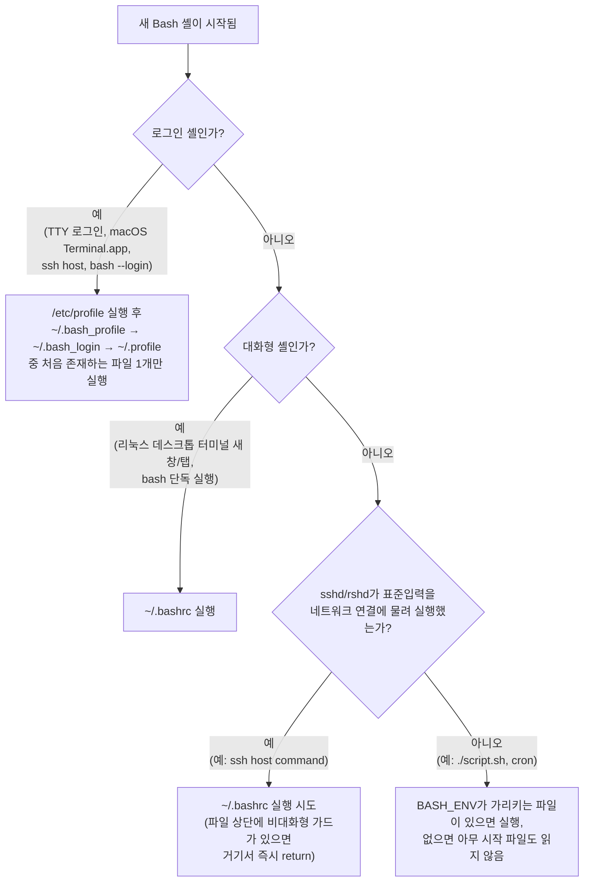

같은 `.bashrc`를 만들어도 macOS Terminal.app에서는 안 읽히고, `ssh host command`로 실행한 명령에서는 별칭이 사라지는 경우가 있다. 이 장은 Bash가 시작될 때 "로그인 셸인가"와 "대화형 셸인가"라는 두 개의 독립된 질문에 어떻게 답하고, 그 답의 조합에 따라 `/etc/profile`·`~/.bash_profile`·`~/.bash_login`·`~/.profile`·`~/.bashrc` 중 어떤 파일을 읽는지를 GNU Bash Reference Manual 원문과 대조해 정리한다.

## 이 장을 읽기 전에

직전 챕터인 [10장: PATH, type, hash, command](/post/bashshell/path-type-hash-command-shell-command-lookup/)에서는 셸이 명령어의 실행 파일 위치를 어떻게 찾는지를 다뤘다. 이 장은 그 명령어 탐색 능력 자체가 아니라, 셸이 시작되는 "시점"에 어떤 환경(별칭·함수·`PATH` 값 등)을 미리 구성해 두는지를 다룬다는 점에서 이어지는 주제다 — `PATH`를 아무리 잘 이해해도 그 값을 설정한 파일이 애초에 읽히지 않으면 소용이 없다. [3장: cat](/post/bashshell/cat-head-tail-commands-view-file-contents/)과 [4장: less, more](/post/bashshell/less-more-commands-view-large-files-linux/)에서 다룬 파일 내용 확인법은 이 장에서 `~/.bashrc`·`~/.bash_profile` 같은 설정 파일을 직접 열어볼 때 그대로 쓰인다.

난이도는 입문–중급이다. 셸을 열고 명령을 입력해 본 경험만 있으면 충분하며, 별도의 스크립팅 지식은 필요하지 않다.

**다루지 않는 것**: 환경 변수를 내보내고 확인하는 `export`/`env` 자체의 문법은 [34장: echo, export, env](/post/bashshell/echo-export-env-commands-shell-variables/)에서 다룬다. `PATH` 변수의 구조와 명령어 탐색 순서는 [10장](/post/bashshell/path-type-hash-command-shell-command-lookup/)에서 이미 다뤘다. 로그인 인증 절차(PAM, `/etc/passwd`)나 zsh·fish 등 Bash 이외 셸의 시작 파일 규칙도 이 장의 범위 밖이다.

## 당신의 수준에 맞는 경로

| 수준 | 읽을 부분 | 핵심 목표 |
|---|---|---|
| 입문 | 개요 + 정신 모델, 핵심 개념의 "로그인 셸과 비로그인 셸"·"대화형 셸과 비대화형 셸" | 내가 지금 쓰는 셸이 로그인 셸인지 비로그인 셸인지, 대화형인지 아닌지를 구분할 수 있다 |
| 중급 | 핵심 개념 전체, 예시(판단 트리) | 4가지 조합에서 각각 어떤 파일이 읽히는지 표를 보지 않고 설명하고, `.bashrc` 설정을 올바른 파일에 넣을 수 있다 |
| 심화 | 주의사항·함정, 흔한 오개념 | SSH 비대화형 실행과 macOS/리눅스 터미널 기본값 차이를 원인 수준에서 설명하고, 실무 스크립트·배포 환경에서 설정 누락을 예방할 수 있다 |

## 개요 + 정신 모델

Bash는 시작될 때마다 스스로에게 두 개의 이진 질문을 던지는 스위치라는 정신 모델로 이해하면 가장 명확하다. 첫 번째 질문은 "나는 로그인 셸인가?"이고, 두 번째 질문은 "나는 대화형 셸인가?"다. 이 두 질문의 답 조합(로그인×대화형, 로그인×비대화형, 비로그인×대화형, 비로그인×비대화형) 네 가지가 어떤 시작 파일을 읽을지를 거의 전적으로 결정한다. 파일 이름이 `.bash_profile`이든 `.bashrc`든, 파일 자체에는 "이건 로그인용", "이건 비로그인용"이라는 표시가 없다 — 순전히 Bash가 시작 시점에 두 질문에 어떻게 답했는지에 따라 어떤 파일을 찾아 읽을지가 결정될 뿐이다. 이 모델을 갖고 있으면 "왜 이 설정이 여기서는 보이고 저기서는 안 보이는가"라는 질문에 항상 "이 두 질문의 답이 상황마다 다르기 때문"이라고 답할 수 있다.

## 핵심 개념

### 로그인 셸과 비로그인 셸

**로그인 셸**은 사용자가 시스템에 "로그인"하는 행위와 함께 시작되는 셸이다. 가상 콘솔(TTY)에서 아이디·비밀번호를 입력해 로그인할 때, `ssh host`로 원격 호스트에 대화형으로 접속할 때, `su -`나 `login` 명령으로 사용자를 전환할 때, 그리고 `bash --login`으로 명시적으로 실행할 때가 모두 로그인 셸이다. **비로그인 셸**은 이미 로그인된 세션 "안에서" 파생되는 셸이다. 데스크톱 터미널 에뮬레이터가 새 창·새 탭을 열 때, 터미널에서 `bash`를 그냥 입력해 하위 셸을 하나 더 띄울 때가 여기 해당한다.

### 대화형 셸과 비대화형 셸

**대화형(interactive) 셸**은 표준입력·표준출력이 터미널에 연결되어 있고, 사람이 프롬프트를 보고 명령을 하나씩 입력하는 셸이다. **비대화형(non-interactive) 셸**은 표준입력이 터미널이 아니라 스크립트 파일이거나, `ssh host command`처럼 실행할 명령이 이미 정해져 있어 프롬프트 없이 명령을 실행하고 곧바로 끝나는 셸이다. 실행 중인 셸에서 `[[ $- == *i* ]]`을 실행하면 특수 변수 `$-`에 `i` 플래그가 포함되어 있는지로 대화형 여부를 직접 확인할 수 있다.

### 4가지 조합이 읽는 시작 파일

GNU Bash Reference Manual은 로그인 셸의 시작 파일 읽기 순서를 다음과 같이 명시한다.

> "When Bash is invoked as an interactive login shell, or as a non-interactive shell with the --login option, it first reads and executes commands from the file /etc/profile, if that file exists." — GNU Bash Reference Manual, "Bash Startup Files"

즉 **대화형 로그인 셸**과 **`--login` 옵션으로 시작된 비대화형 셸**은 동일하게 취급된다 — 둘 다 먼저 `/etc/profile`을 읽는다. 그다음 사용자별 설정 파일을 찾는데, 매뉴얼은 세 후보 중 정확히 하나만 읽힌다고 못박는다.

> "it looks for ~/.bash_profile, ~/.bash_login, and ~/.profile, in that order, and reads and executes commands from the first one that exists and is readable." — GNU Bash Reference Manual, "Bash Startup Files"

비로그인 셸의 경우는 대화형 여부로 다시 갈린다.

> "When an interactive shell that is not a login shell is started, Bash reads and executes commands from ~/.bashrc, if that file exists." — GNU Bash Reference Manual, "Bash Startup Files"

**비로그인·비대화형**(스크립트 실행)은 기본적으로 아무 시작 파일도 읽지 않는다. 유일한 예외는 `BASH_ENV` 환경 변수다.

> "When Bash is started non-interactively, to run a shell script, for example, it looks for the variable BASH_ENV in the environment, expands its value if it appears there, and uses the expanded value as the name of a file to read and execute." — GNU Bash Reference Manual, "Bash Startup Files"

여기에 실무에서 자주 놓치는 예외가 하나 더 있다. `ssh host command`처럼 표준입력이 네트워크 연결에 물린 채 비대화형으로 실행되는 경우, Bash는 이를 별도로 감지해 `~/.bashrc`를 읽으려 시도한다.

> "Bash attempts to determine when it is being run with its standard input connected to a network connection, as when executed by the historical remote shell daemon, usually rshd, or the secure shell daemon sshd. ... If Bash determines it is being run non-interactively in this fashion, it reads and executes commands from ~/.bashrc, if that file exists and is readable." — GNU Bash Reference Manual, "Bash Startup Files"

정리하면 다음과 같다.

| 조합 | 대표 상황 | 읽는 파일 |
|---|---|---|
| 로그인 + 대화형 | TTY 콘솔 로그인, macOS Terminal.app 기본값, `ssh host`(원격 로그인) | `/etc/profile` → `~/.bash_profile`/`~/.bash_login`/`~/.profile` 중 처음 존재하는 파일 1개 |
| 로그인 + 비대화형 | `bash --login script.sh` | 위와 동일(매뉴얼상 동일하게 처리) |
| 비로그인 + 대화형 | 리눅스 데스크톱 터미널의 새 창·탭, 터미널 안에서 `bash` 단독 실행 | `~/.bashrc` |
| 비로그인 + 비대화형 | `./script.sh`, `bash script.sh`, cron 작업 | 기본적으로 없음. `BASH_ENV`가 설정돼 있으면 그 파일. `ssh host command`처럼 sshd/rshd가 표준입력을 네트워크 연결에 물려 실행한 것으로 감지되면 예외적으로 `~/.bashrc` |

### 각 시작 파일의 역할

`/etc/profile`은 시스템 관리자가 모든 사용자에게 공통으로 적용할 로그인 셸 설정을 두는 자리다. `~/.bash_profile`·`~/.bash_login`·`~/.profile`은 사용자별 로그인 셸 설정을 두는 자리이지만, 앞서 인용했듯 셋 중 "처음 존재하는 파일 하나만" 읽히고 나머지 둘은 완전히 무시된다. `~/.bashrc`는 별칭·함수·프롬프트처럼 매번 새 대화형 셸을 열 때마다 다시 적용하고 싶은 설정을 두는 자리다. 로그인 셸이 종료될 때는 별도의 파일이 한 번 더 실행된다.

> "Bash reads and executes commands from the file ~/.bash_logout, if it exists." — GNU Bash Reference Manual, "Bash Startup Files"

`~/.bash_logout`은 로그아웃 시점에 화면을 지우거나 임시 파일을 정리하는 등의 용도로 쓰인다.

## 예시

아래 판단 트리는 위 표를 그대로 흐름으로 옮긴 것이다. 로그인 여부를 먼저 묻고, 아니라면 대화형 여부를, 그마저도 아니라면 네트워크 연결 여부를 마지막으로 확인한다.



지금 실행 중인 셸이 트리의 어느 가지에 해당하는지는 직접 확인할 수 있다.

```bash
# 로그인 셸인지 확인 (Bash 전용 shopt)
shopt login_shell

# 대화형 셸인지 확인 ($-에 i 플래그가 포함되는지)
[[ $- == *i* ]] && echo "대화형" || echo "비대화형"
```

`shopt login_shell`은 로그인 셸에서는 `login_shell on`을, 비로그인 셸에서는 `login_shell off`를 출력한다. 두 명령을 macOS Terminal.app에서 새로 연 창, 리눅스 데스크톱 터미널에서 새로 연 창, 그리고 `ssh host` 원격 접속 직후 각각 실행해 보면 위 판단 트리의 어느 가지를 타고 있는지 눈으로 확인할 수 있다.

## 주의사항·함정

**셋 중 하나만 읽힌다는 규칙을 놓치기 쉽다**: `~/.bash_profile`과 `~/.profile`을 둘 다 만들어 두고 최근에 `~/.profile`을 수정했는데 로그인해도 반영되지 않는 사고가 흔하다. `~/.bash_profile`이 이미 존재하면 Bash는 그 파일 하나만 읽고 `~/.bash_login`·`~/.profile`은 존재 여부조차 확인하지 않는다.

**macOS와 리눅스 데스크톱 터미널의 기본값이 다르다**: macOS의 Terminal.app은 환경설정에서 새 창을 "로그인 셸로 실행"하도록 기본값이 맞춰져 있어 매번 로그인 셸이 열리는 반면, GNOME Terminal·Konsole 등 대부분의 리눅스 데스크톱 터미널은 새 창·탭을 비로그인 대화형 셸로 연다. 그래서 같은 `~/.bashrc`를 만들어도 macOS에서는 새 창을 열 때 기본적으로 읽히지 않는다. 매뉴얼은 이 간극을 메우는 관용적인 해법을 명시한다.

> "typically, your ~/.bash_profile contains the line `if [ -f ~/.bashrc ]; then . ~/.bashrc; fi`" — GNU Bash Reference Manual, "Bash Startup Files"

macOS 사용자들이 `~/.bash_profile` 안에 위 한 줄을 넣어 `~/.bashrc`를 명시적으로 불러오는 방식이 그래서 관행으로 굳어져 있다.

**Bash가 아닌 셸에서는 이 규칙이 그대로 적용되지 않는다**: `sh`로 실행되거나 `--posix` 옵션으로 POSIX 모드에 들어가면 Bash는 위 규칙 대신 POSIX 표준의 시작 파일 규칙(대화형 셸에서 `ENV` 변수가 가리키는 파일을 읽는 방식)을 따른다. zsh·dash 등 다른 셸은 파일 이름과 읽는 조건이 전혀 다르므로, `#!/bin/sh`로 시작하는 스크립트를 디버깅할 때 이 장의 규칙을 그대로 적용하면 안 된다.

## 흔한 오개념

<strong>".bashrc에 넣은 설정인데 SSH로 접속하면 안 보인다"</strong>는 사실 두 가지 서로 다른 상황을 뭉뚱그린 표현이다. `ssh host`처럼 대화형으로 접속하는 경우는 로그인 셸이므로 애초에 `~/.bashrc`가 아니라 `/etc/profile`과 `~/.bash_profile` 계열이 읽힌다 — `~/.bash_profile`에서 `~/.bashrc`를 source하도록 설정해 두지 않았다면 대화형 SSH 세션에서도 `.bashrc`의 별칭·함수는 원래부터 적용되지 않는다. 반면 `ssh host command`처럼 명령 하나만 비대화형으로 실행하는 경우, 앞서 인용한 매뉴얼대로 Bash는 sshd 연결을 감지해 `~/.bashrc`를 읽으려 시도한다. 그런데도 실무에서 "안 읽힌다"고 느껴지는 이유는 대부분 Debian·Ubuntu 계열 배포판의 기본 `~/.bashrc` 최상단에 있는 가드 때문이다.

```bash
# Debian/Ubuntu 기본 ~/.bashrc 상단에 흔히 있는 가드
case $- in
    *i*) ;;
      *) return;;
esac
```

Bash는 분명 `~/.bashrc`를 여는 데까지는 성공하지만, 파일 안의 이 가드가 "현재 셸이 대화형이 아니면 즉시 return"하도록 만들어 놓았기 때문에 그 아래 줄의 별칭·함수 정의는 실행되지 않는다. 즉 "Bash가 파일을 안 읽는다"가 아니라 "파일 스스로 비대화형 상황에서 조기 종료한다"가 정확한 원인이다.

<strong>"터미널을 새로 열면 항상 같은 설정 파일이 읽힌다"</strong>도 흔한 오해다. 위에서 다뤘듯 macOS Terminal.app과 리눅스 데스크톱 터미널은 새 창을 여는 기본 동작(로그인 셸 여부)이 서로 다르므로, 운영체제를 바꿔 같은 dotfile을 그대로 옮겨도 기대한 대로 동작하지 않을 수 있다.

## 다음 장에서는

[12장: man, history](/post/bashshell/man-history-commands-manual-pages-shell-history/)에서는 명령어 매뉴얼을 찾아보는 `man`과 셸에 입력한 명령을 다시 불러오는 `history`를 다룬다. 12장은 Part 1(셸 기초와 탐색)의 마지막 장으로, 이 장까지 다룬 탐색·명령어 찾기·환경설정 지식을 바탕으로 Part 2(텍스트 처리)로 넘어가기 전 마지막 정리에 해당한다.

## 평가 기준

- 로그인 셸/비로그인 셸, 대화형/비대화형 셸의 차이를 각각 예시 상황과 함께 설명할 수 있다.
- 4가지 조합에서 각각 어떤 시작 파일이 읽히는지 표 없이 나열할 수 있다.
- `~/.bash_profile`·`~/.bash_login`·`~/.profile` 중 처음 존재하는 파일 하나만 읽힌다는 규칙을 설명하고, 이 규칙 때문에 생기는 설정 누락을 진단할 수 있다.
- SSH 대화형 접속과 `ssh host command` 비대화형 실행에서 `.bashrc`가 각각 왜 보이거나 안 보이는지, 배포판 기본 가드까지 포함해 설명할 수 있다.
- macOS와 리눅스 데스크톱 터미널의 기본 동작 차이를 알고, `~/.bash_profile`이 `~/.bashrc`를 source하도록 만드는 실무 관행을 적용할 수 있다.

## 참고

- [Bash Startup Files — GNU Bash Reference Manual](https://doc.guix.gnu.org/bash/latest/en/html_node/Bash-Startup-Files.html)
