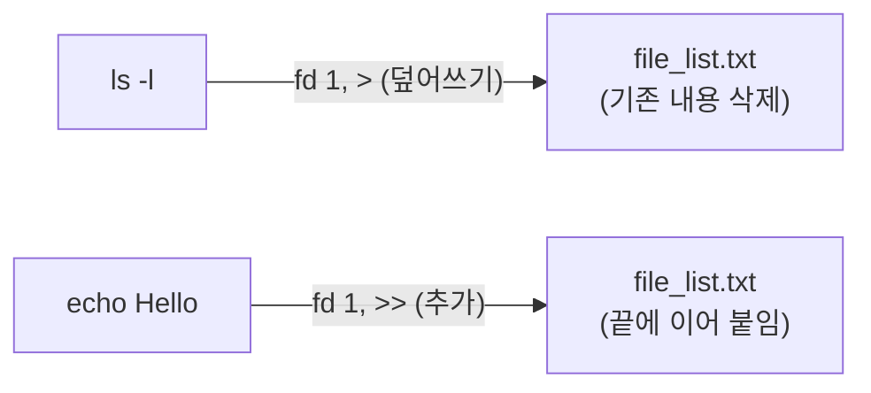
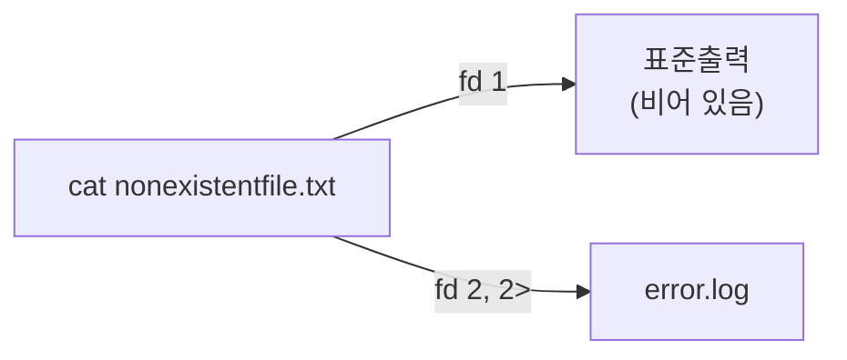
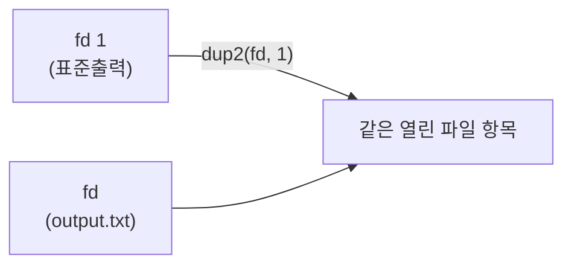

리다이렉션은 명령이 읽고 쓰는 대상을 파일이나 다른 파일 디스크립터로 바꾸는 셸 기능이다. `>`로 출력을 파일에 저장하고, `<`로 파일 내용을 입력으로 넘기고, `2>`로 오류 메시지만 따로 걸러낼 수 있다.

## 이 장을 읽기 전에

직전 챕터인 [19장: 파이프](/post/bashshell/pipe-operator-linux-command-chaining/)에서는 한 명령의 표준 출력을 다른 명령의 표준 입력으로 바로 연결하는 법을 다뤘다. 파이프가 **프로세스 대 프로세스** 연결이라면, 리다이렉션은 **프로세스와 파일**(또는 다른 파일 디스크립터) 사이의 연결이다 — 대상이 또 다른 실행 중인 명령이 아니라 디스크 위의 파일이거나 셸이 이미 열어둔 다른 디스크립터라는 점이 다르다. 이 장이 전제하는 지식은 표준 입력·표준 출력이라는 용어가 낯설지 않은 정도면 충분하며, 별도의 셸 스크립팅 지식은 필요 없다.

난이도는 입문–중급이다. 기본 리다이렉션(`<`, `>`, `>>`, `2>`)은 입문 구간에서 다루고, 파일 디스크립터 복제(`dup2`, `n>&m`)와 순서에 따른 동작 차이는 중급–심화 구간에서 다룬다.

**다루지 않는 것**: 한 명령의 출력을 다른 명령의 입력으로 즉시 연결하는 파이프(`|`)는 [19장: 파이프](/post/bashshell/pipe-operator-linux-command-chaining/)에서 이미 다뤘다. 작은따옴표·큰따옴표로 리다이렉션 대상 파일명이나 명령 인자를 감싸는 인용(quoting) 규칙은 [22장: 인용](/post/bashshell/bash-quoting-escaping-special-characters/)에서 별도로 다룬다.

## 당신의 수준에 맞는 경로

| 수준 | 읽을 부분 | 핵심 목표 |
|---|---|---|
| 입문 | 개요+정신 모델, 핵심 개념의 입력·출력·표준에러 리다이렉션 | `>`, `>>`, `<`, `2>`로 명령의 입출력을 파일과 연결할 수 있다 |
| 중급 | 핵심 개념의 Here Document·Here String, 파일 디스크립터 복제 | 여러 줄 입력을 스크립트 안에 직접 담고, `2>&1`로 표준출력·표준에러를 한 곳으로 모을 수 있다 |
| 심화 | 주의사항·함정, 흔한 오개념 | `>` 순서에 따라 결과가 달라지는 이유와 같은 파일을 두 번 여는 위험을 설명하고 피할 수 있다 |

## 개요 + 정신 모델

모든 프로세스는 시작할 때 커널로부터 파일 디스크립터 세 개를 기본으로 받는다. `0`번은 표준 입력(stdin), `1`번은 표준 출력(stdout), `2`번은 표준 오류(stderr)다. 터미널에서 평범하게 명령을 실행하면 이 세 디스크립터는 모두 지금 사용 중인 터미널 장치에 연결돼 있다 — 그래서 키보드로 입력한 값이 명령에 전달되고, 명령의 결과와 오류 메시지가 둘 다 같은 화면에 뒤섞여 출력된다.

**리다이렉션의 정신 모델은 간단하다**: 셸은 명령을 실제로 실행(`exec`)하기 **직전**에, 명령줄에 적힌 리다이렉션 연산자(`<`, `>`, `>>`, `2>` 등)를 하나씩 읽어 해당 디스크립터가 가리키는 대상을 파일이나 다른 디스크립터로 미리 바꿔치기한다. 명령 자신은 이 사실을 전혀 모른 채 평소처럼 0번에서 읽고 1번과 2번에 쓸 뿐이다 — `sort < input.txt`를 실행해도 `sort`라는 프로그램 코드는 "파일을 읽어라"라고 짜여 있지 않다. 셸이 `sort`를 실행하기 전에 미리 0번 디스크립터를 `input.txt`로 바꿔치기해 두었을 뿐이고, `sort`는 그저 표준 입력(0번)을 읽었을 뿐이다. 이 원리 때문에 리다이렉션은 특정 명령의 기능이 아니라 **셸이 모든 명령에 공통으로 제공하는 기능**이 된다.

디스크립터 세 개의 기본 연결 대상과 방향을 표로 정리하면 다음과 같다.

| 번호 | 이름 | 기본 연결 대상 | 방향 |
|---|---|---|---|
| 0 | stdin(표준 입력) | 터미널 키보드 | 명령이 읽는다 |
| 1 | stdout(표준 출력) | 터미널 화면 | 명령이 쓴다 |
| 2 | stderr(표준 오류) | 터미널 화면 | 명령이 쓴다(오류만) |

## 핵심 개념

### 입력 리다이렉션 (`<`)

`<`는 파일의 내용을 명령의 표준 입력(0번)으로 연결한다. 명령이 키보드 입력을 기다리는 대신, 지정한 파일을 처음부터 끝까지 읽어 들인다.

```bash
sort < input.txt
```


### 출력 리다이렉션 (`>`, `>>`)

`>`는 표준 출력(1번)을 파일로 연결한다. 대상 파일이 이미 있으면 **덮어쓰고**, 없으면 새로 만든다. `>>`는 같은 방향이지만 기존 내용을 지우지 않고 파일 끝에 **추가**한다.

```bash
ls -l > file_list.txt        # 덮어쓰기: 기존 내용은 사라진다
echo "Hello" >> file_list.txt  # 추가: 기존 내용 뒤에 이어 붙는다
```



### 표준에러 리다이렉션 (`2>`, `&>`)

표준 출력과 표준 오류는 서로 다른 디스크립터(1번과 2번)이므로 각각 따로 리다이렉션할 수 있다. `2>`는 오류 메시지만 골라 파일로 보내고, `&>`(또는 `> file 2>&1`)는 둘 다 같은 대상으로 합친다.

```bash
cat nonexistentfile.txt 2> error.log   # 오류만 error.log로
command &> all_output.log              # 정상 출력 + 오류를 all_output.log 하나로
```



### Here Document (`<<`)

Here Document는 스크립트 소스 코드 안에 여러 줄의 텍스트를 직접 적어 두고, 그 전체를 명령의 표준 입력으로 전달하는 방법이다. `<<종료문자열`로 시작해 같은 문자열이 단독으로 등장하는 줄에서 끝난다.

```bash
cat <<EOF
안녕하세요.
여러 줄의 텍스트를 쉽게 입력할 수 있습니다.
EOF
```


### Here String (`<<<`)

Here String은 Here Document의 축약형으로, 여러 줄이 아니라 문자열 하나를 표준 입력으로 곧바로 전달한다. 종료 문자열이 필요 없어 한 줄짜리 입력에 더 간결하다.

```bash
cat <<< "Hello, World!"
grep "keyword" <<< "$variable"
```

### 파일 디스크립터 복제 (`dup2`, `n>&m`)

`n>&m`(또는 `n<&m`)은 디스크립터 `n`이 디스크립터 `m`과 **같은 열린 파일**을 가리키게 복제한다. 커널 관점에서 이 연산은 값을 복사하는 것이 아니라, 두 디스크립터 번호가 동일한 파일 테이블 항목을 함께 참조하게 만드는 것이다. 셸의 `2>&1`이 바로 이 문법이며, C에서는 `dup()`/`dup2()` 시스템 호출이 같은 일을 한다.

```c
#include <stdio.h>
#include <unistd.h>
#include <fcntl.h>

int main(void) {
    int fd = open("output.txt", O_WRONLY | O_CREAT | O_TRUNC, 0644);
    if (fd == -1) { perror("open"); return 1; }

    int saved_stdout = dup(STDOUT_FILENO);  // 원래 표준출력을 보관
    dup2(fd, STDOUT_FILENO);                // 표준출력을 fd로 복제(교체)
    printf("이 내용은 output.txt에 저장됩니다.\n");

    dup2(saved_stdout, STDOUT_FILENO);      // 원래 표준출력 복원
    close(saved_stdout);
    close(fd);
    printf("이 내용은 터미널에 출력됩니다.\n");
    return 0;
}
```



셸 수준에서는 이 복제를 `2>&1`처럼 한 줄로 쓴다. 아래는 표준출력과 표준오류를 같은 파일 하나로 합치는 가장 흔한 형태다.

```bash
command > all.log 2>&1
```

## 주의사항·함정

**`cmd > file 2>&1`과 `cmd 2>&1 > file`은 결과가 다르다.** 셸은 리다이렉션 연산자를 **왼쪽에서 오른쪽으로 순서대로** 처리한다. `cmd > file 2>&1`은 먼저 `1`번(표준출력)을 `file`로 연결한 뒤, `2`번(표준오류)을 "지금 1번이 가리키는 곳"(즉 `file`)으로 복제한다 — 결과적으로 출력과 오류가 모두 `file`에 쓰인다. 반면 `cmd 2>&1 > file`은 먼저 `2`번을 "지금 1번이 가리키는 곳"(아직 리다이렉션 전이므로 터미널)으로 복제한 뒤에야 `1`번을 `file`로 연결한다 — `2`번은 이미 터미널을 가리키도록 고정된 뒤라 그대로 터미널에 남고, `file`에는 표준출력만 저장된다.

```bash
# 출력과 오류가 모두 all.log에 저장된다
command > all.log 2>&1

# 표준출력만 all.log에 저장되고, 오류는 터미널에 그대로 출력된다
command 2>&1 > all.log
```

**같은 파일을 `>`로 두 번 열면 내용이 깨질 수 있다.** `cmd > file 2> file`처럼 표준출력과 표준오류를 각각 `>`로 같은 파일에 리다이렉션하면, 셸이 그 파일을 **독립적으로 두 번** 연다. 두 디스크립터가 서로 다른 파일 오프셋을 유지한 채 같은 파일에 쓰기 때문에, 두 스트림이 번갈아 도착하는 타이밍에 따라 앞서 쓴 내용을 다른 쪽이 덮어써 뒤섞이거나 유실될 수 있다. `&>`(또는 `> file 2>&1`)는 파일을 **한 번만** 열고 두 디스크립터가 같은 열린 파일 항목을 공유하도록 복제하므로, 오프셋이 하나로 유지되어 이런 충돌이 생기지 않는다.

```bash
# 위험: file을 두 번 열어 내용이 섞이거나 유실될 수 있다
command > file 2> file

# 안전: 파일을 한 번만 열고 fd를 복제한다
command > file 2>&1
command &> file
```

## 흔한 오개념

<strong>"리다이렉션은 명령이 실행되는 동안 실시간으로 작동한다"</strong>는 흔한 오해다. 실제로는 개요에서 다뤘듯 셸이 명령을 실행하기 **전에** 디스크립터 연결을 미리 끝마친다. 리다이렉션 대상 파일을 명령 실행 도중에 바꾸거나 옮겨도 이미 열려 있는 디스크립터에는 영향을 주지 않는 이유가 여기에 있다.

<strong>"`2>&1`은 표준오류의 내용을 표준출력 변수에 복사한다"</strong>도 자주 나오는 오해다. `2>&1`은 값이나 텍스트를 복사하는 연산이 아니라, 두 디스크립터 번호가 **같은 열린 파일 항목을 함께 가리키게** 만드는 참조 복제다. 그래서 이후 어느 쪽에 쓰든 최종적으로는 같은 대상에 도착한다.

## 다음 장에서는

[21장: xargs](/post/bashshell/xargs-command-build-execute-command-lines/)에서는 표준 입력으로 받은 항목을 다른 명령의 **인자**로 바꿔 넘기는 법을 다룬다. 이 장이 명령의 입출력을 파일·디스크립터와 연결하는 법이었다면, 다음 장은 파이프로 넘어온 값을 다시 명령줄 인자로 변환해 `find`처럼 인자를 직접 받는 명령과 파이프라인을 이어 붙이는 법이다.

## 평가 기준

- 파일 디스크립터 0/1/2가 각각 무엇을 가리키는지, 리다이렉션이 이 대상을 언제(명령 실행 전) 바꾸는지 설명할 수 있다.
- `<`, `>`, `>>`, `2>`를 상황에 맞게 골라 쓰고, `>`와 `>>`의 차이(덮어쓰기 vs 추가)를 구분할 수 있다.
- Here Document(`<<`)와 Here String(`<<<`)의 차이를 설명하고, 여러 줄·한 줄 입력에 맞게 선택할 수 있다.
- `cmd > file 2>&1`과 `cmd 2>&1 > file`의 결과가 다른 이유를 리다이렉션 처리 순서로 설명할 수 있다.
- 같은 파일을 `>`로 두 번 여는 것이 왜 위험한지, `&>`가 왜 더 안전한지 설명할 수 있다.

## 참고

- [Redirections — GNU Bash Reference Manual](https://doc.guix.gnu.org/bash/latest/en/html_node/Redirections.html)
- [Redirection — POSIX.1-2017 Shell Command Language (The Open Group Base Specifications)](https://pubs.opengroup.org/onlinepubs/9699919799/utilities/V3_chap02.html)
