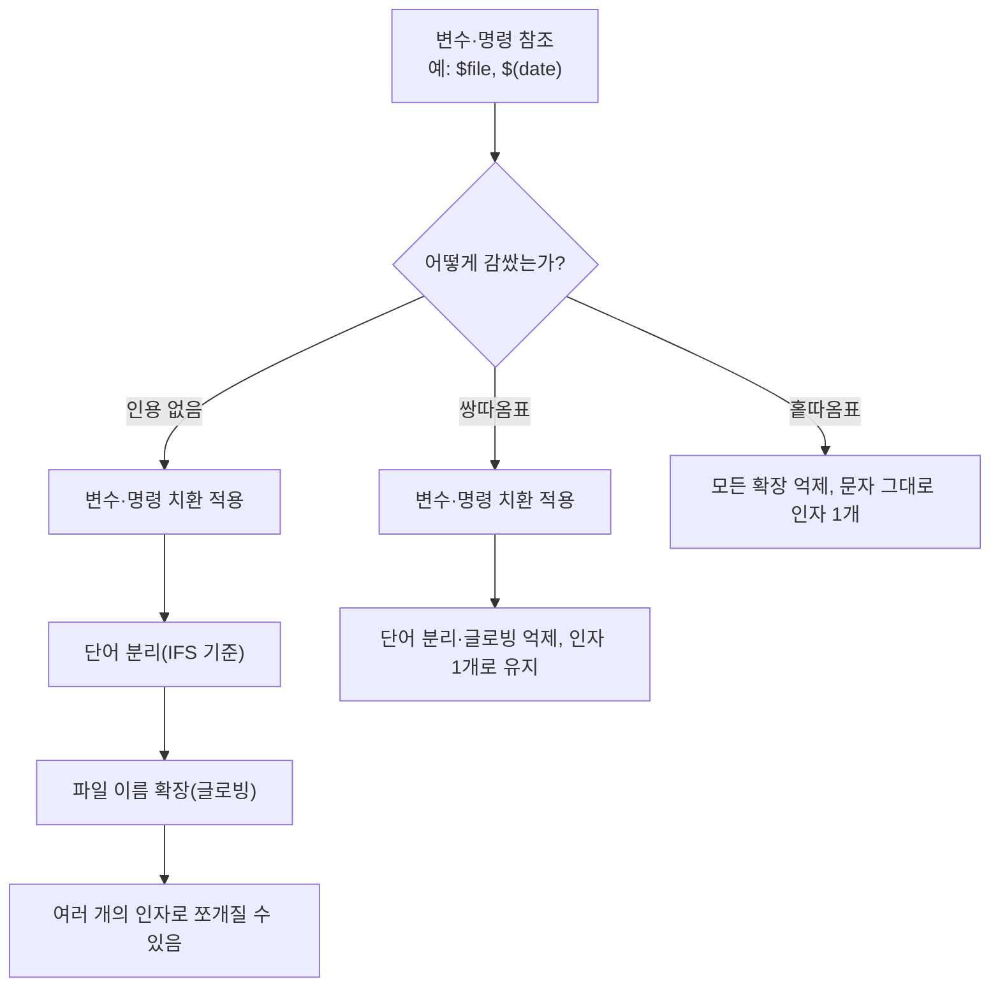

셸은 명령줄을 곧바로 실행하지 않는다. 먼저 그 줄을 여러 단계의 <strong>확장(expansion)</strong>을 거쳐 최종 인자 목록으로 바꾸는데, <strong>인용(quoting)</strong>은 이 확장 단계 중 일부를 선택적으로 억제하는 스위치다. 홑따옴표(`'`)·쌍따옴표(`"`)·백슬래시(`\`)는 이 스위치를 켜는 범위가 서로 다르다.

## 이 장을 읽기 전에

직전 챕터인 [21장: xargs](/post/bashshell/xargs-command-build-execute-command-lines/)까지가 Part 3(파이프라인과 입출력)였다. 19장에서 파이프(`|`)로 명령과 명령을 잇는 법을, 20장에서 리다이렉션(`>`, `<`)으로 명령과 파일을 잇는 법을, 21장에서 표준입력을 인자로 바꾸는 `xargs`를 다뤘다 — 모두 "데이터를 어떻게 흘려보낼 것인가"의 문제였다. 이 장은 그 흐름과는 결이 다르다. 파이프·리다이렉션·xargs로 명령을 조합하다 보면 변수에 담긴 값에 공백이나 `*` 같은 특수문자가 섞이는 순간 예상과 다르게 여러 인자로 쪼개지는 문제를 반드시 만나게 되는데, 이 장은 그 문제의 근본 원인인 셸의 확장 메커니즘과 그것을 통제하는 인용 규칙을 다룬다. 그런 의미에서 22장은 Part 3의 마지막 챕터이자, 지금까지 다룬 모든 명령을 안전하게 조합하기 위한 마무리 퍼즐 조각이다.

난이도는 입문–중급이다. 변수 확장(`$var`)이 무엇인지 감각적으로만 알면 따라올 수 있고, "주의사항·함정"·"흔한 오개념"은 명령 치환(`` `cmd` ``, `$(cmd)`)과 파일 이름 확장(글로빙, `*`)까지 함께 이해해야 완전히 소화된다.

**다루지 않는 것**: 변수를 선언하고 값을 대입하는 법 자체는 [34장: echo, export, env](/post/bashshell/echo-export-env-commands-shell-variables/)에서 다룬다. 이 장은 이미 존재하는 변수·명령 결과를 참조할 때 그 값을 셸이 어떻게 나누는지(혹은 나누지 않는지)에 집중한다. `[[ ]]`·`(( ))` 안에서 인용 규칙이 완화되는 세부 사항도 범위 밖이며, 조건문 자체는 [27장: if, test](/post/bashshell/if-test-command-bash-conditional-statements/)에서 다룬다.

## 당신의 수준에 맞는 경로

| 수준 | 읽을 부분 | 핵심 목표 |
|---|---|---|
| 입문 | 개요 + 정신 모델, 핵심 개념의 쌍따옴표·홑따옴표 | `"$var"`와 `$var`의 출력이 왜 다를 수 있는지 감을 잡는다 |
| 중급 | 핵심 개념 전체, 예시 | 세 가지 인용 방식을 상황에 맞게 골라 쓰고, 변수는 항상 따옴표로 감싸는 습관을 들인다 |
| 심화 | 주의사항·함정, 흔한 오개념 | word splitting·globbing이 실제로 어떤 스크립트 버그를 만드는지 재현하고 고칠 수 있다 |

## 개요 + 정신 모델

셸이 명령줄 한 줄을 읽으면, 실행하기 전에 정해진 순서대로 여러 <strong>확장(expansion)</strong>을 적용한다. GNU Bash Reference Manual은 그 순서를 다음과 같이 규정한다.

> "The order of expansions is: brace expansion; tilde expansion, parameter and variable expansion, arithmetic expansion, and command substitution (done in a left-to-right fashion); word splitting; and filename expansion." — GNU Bash Reference Manual, "Shell Expansions"

즉 중괄호 확장 → 물결표 확장 → 변수·매개변수 확장 → 산술 확장·명령 치환 → **단어 분리(word splitting)** → **파일 이름 확장(globbing)** 순으로 처리되고, 맨 마지막에 따옴표 문자 자체를 지우는 <strong>따옴표 제거(quote removal)</strong>가 일어난다. 인용은 이 목록에 새 단계를 추가하는 문법이 아니라, 이미 있는 단계들 중 일부를 뒤에서 선택적으로 꺼 버리는 스위치다. 홑따옴표는 거의 모든 확장을 끄고, 쌍따옴표는 변수·명령 치환은 켜 둔 채 단어 분리와 글로빙만 끄며, 백슬래시는 바로 다음 문자 하나에 대해서만 스위치를 켠다. 이 스위치 모델을 가지고 있으면 "왜 `"$var"`는 안전하고 `$var`는 위험한가"라는 질문에 옵션을 암기하지 않고도 답할 수 있다 — 따옴표가 없으면 목록의 여섯·일곱 번째 단계인 단어 분리와 글로빙이 그대로 적용되기 때문이다.



## 핵심 개념

### 쌍따옴표 `"..."`

쌍따옴표는 대부분의 특수문자를 무력화하지만 전부는 아니다.

> "Enclosing characters in double quotes preserves the literal value of all characters within the quotes, with the exception of `$`, `` ` ``, `\`, and, when history expansion is enabled, `!`." — GNU Bash Reference Manual, "Double Quotes"

즉 **변수 확장**(`$VAR`), **명령 치환**(`` `cmd` ``, `$(cmd)`), **백슬래시 이스케이프**(`\$`, `\"`, `` \` ``)는 여전히 해석되지만, 공백·와일드카드(`*`, `?`)는 리터럴로 취급되어 하나의 인자로 유지된다.

```bash
name="hello world"
echo "$name"     # hello world (한 개의 인자)
echo "$(date +%F)"   # 명령 치환 결과가 그대로 확장된다
```

### 홑따옴표 `'...'`

홑따옴표는 예외 없이 모든 문자를 리터럴로 취급한다.

> "Enclosing characters in single quotes preserves the literal value of each character within the quotes." — GNU Bash Reference Manual, "Single Quotes"

변수·명령 치환·백슬래시 이스케이프 전부 해석되지 않는다. 홑따옴표 안에는 홑따옴표 자체를 넣을 수 없으므로(홑따옴표는 홑따옴표로만 닫힌다), `'\''`처럼 홑따옴표를 잠깐 닫고 이스케이프된 홑따옴표 하나를 끼워 넣은 뒤 다시 여는 관용구로 우회한다.

```bash
echo '$HOME'       # $HOME 그대로 출력, 변수 확장 안 됨
echo 'it'\''s a test'   # it's a test — 'it' + \' (이스케이프된 홑따옴표) + 's a test'
```

### 백슬래시 `\`

백슬래시는 범위가 아니라 **다음 문자 딱 한 개**에만 적용되는 가장 좁은 인용 수단이다.

```bash
echo \$HOME         # $HOME 그대로 출력 (달러 기호 하나만 이스케이프)
echo "따옴표 \"안\"의 이스케이프"   # 쌍따옴표 안에서 큰따옴표를 리터럴로
```

### 변수 확장 시 인용

값에 공백·특수문자가 있을 수 있는 변수는 **반드시 인용**하는 것이 안전하다: `"$var"`. `$var`처럼 따옴표 없이 쓰면 단어 분리와 글로빙이 그대로 적용된다 — 자세한 사고 사례는 아래 "주의사항·함정"에서 다룬다.

## 예시

```bash
# 1) 쌍따옴표 vs 무인용: 공백이 있는 변수의 확장 결과가 갈린다
name="hello world"
echo "$name"        # hello world → 인자 1개
echo $name           # hello world → word splitting으로 인자 2개("hello", "world")

# 2) 홑따옴표: 셸 메타문자를 전부 무력화한다
echo '$name * 100'   # $name * 100 그대로 출력 (변수도, 글로빙도 해석되지 않음)

# 3) 명령 치환: $()와 백틱은 결과가 같지만 문법 안전성이 다르다
echo "오늘은 $(date +%F)"
echo "오늘은 `date +%F`"

# 4) 백틱 중첩은 이스케이프가 필요하지만 $()는 그대로 중첩 가능하다
echo "$(echo "안쪽 $(date +%F)")"
echo "`echo \`date +%F\``"

# 5) 파이프와 조합: 명령 치환 결과를 다시 grep으로 거른다
echo "$(ls -l | grep '^-')" | wc -l

# 6) 따옴표 없는 변수의 word splitting 버그: ls
file="my report.txt"
touch "$file"
ls $file             # "my"와 "report.txt" 두 인자로 쪼개져 각각을 찾다가 실패한다
ls "$file"            # 공백 포함 파일명 하나를 정확히 가리킨다

# 7) 같은 버그가 rm에서는 파괴적 사고로 이어진다
rm $file              # 의도와 다르게 "my", "report.txt" 각각을 지우려 시도
rm "$file"             # 안전: 인용된 파일명 하나만 정확히 삭제

# 8) 따옴표 없는 변수의 globbing 버그
pattern="*.txt"
echo $pattern          # 셸이 *.txt를 실제 파일 목록으로 확장해 버릴 수 있다
echo "$pattern"         # *.txt 문자열 그대로 출력

# 9) 리다이렉션 대상 경로에 공백이 있을 때도 동일하게 적용된다
mkdir -p "log dir"
echo "hello" > "log dir/out.txt"   # 인용 없이 > log dir/out.txt라 쓰면 인자 개수 오류가 난다
```

## 주의사항·함정

**세 인용 수단은 억제하는 확장의 범위가 서로 다르다.** 홑따옴표는 변수 확장·명령 치환·이스케이프를 포함한 사실상 모든 확장을 끄고, 쌍따옴표는 변수 확장·명령 치환·백슬래시 이스케이프(`\$`, `` \` ``, `\"`, `\\`)만 남긴 채 단어 분리와 글로빙을 끄며, 백슬래시는 바로 뒤 문자 하나에 대해서만 특수 의미를 없앤다. 세 범위를 좁은 것부터 넓은 것 순으로 놓으면 백슬래시(문자 1개) < 쌍따옴표(변수·명령 치환 허용) < 홑따옴표(전면 억제)다. 이 차이를 헷갈리면 쌍따옴표 안에 넣은 변수가 왜 여전히 확장되는지, 홑따옴표 안에 넣은 `$(date)`가 왜 문자 그대로 찍히는지를 설명할 수 없다.

**`$()`와 백틱은 결과가 같아도 중첩 가능성이 다르다.** `$()` 형태는 괄호 사이의 모든 문자를 새 문맥으로 취급해 안쪽에 다른 인용·중첩 명령 치환을 그대로 넣을 수 있다.

> "When using the `$(command)` form, all characters between the parentheses make up the command; none are treated specially." — GNU Bash Reference Manual, "Command Substitution"

반면 백틱은 중첩하려면 안쪽 백틱을 백슬래시로 직접 이스케이프해야 한다.

> "To nest when using the backquoted form, escape the inner backquotes with backslashes." — GNU Bash Reference Manual, "Command Substitution"

즉 `` `echo \`date +%F\`` ``처럼 중첩 단계가 늘어날수록 이스케이프 개수가 기하급수적으로 늘어나 읽기 어려워지는 반면, `$(echo $(date +%F))`는 중첩을 몇 겹으로 늘려도 문법이 그대로 유지된다. 이 때문에 현대 셸 스크립트에서는 백틱보다 `$()`를 쓰도록 권장한다.

**변수를 따옴표 없이 쓰면 word splitting과 globbing이 그대로 적용되는 것이 가장 흔한 실전 버그다.** 위 예시 6·7에서 보듯 `$file`을 인용 없이 쓰면 `IFS`(기본값: 스페이스·탭·개행)를 기준으로 값이 여러 단어로 쪼개지고, 그 각각의 단어가 다시 글로빙 대상이 된다. `ls $file`은 파일을 못 찾는 정도로 끝나지만, `rm $file`·`mv $file`·`cp $file`처럼 되돌릴 수 없는 명령에서 같은 실수를 하면 의도하지 않은 다른 파일을 지우거나 덮어쓸 위험으로 이어진다. `for f in $(ls)`류의 관용구도 같은 이유로 피해야 한다 — 공백이 포함된 파일명을 만나는 순간 반복문이 파일 하나를 두 개 이상의 항목으로 잘못 나눈다. 안전한 기본값은 "변수를 참조할 때는 예외 없이 따옴표로 감싼다"이며, 예외적으로 인용을 빼는 것은 정말로 여러 단어로 쪼개고 싶을 때(예: 옵션 문자열을 여러 인자로 펼치고 싶은 경우)뿐이다.

## 흔한 오개념

<strong>"쌍따옴표를 쓰면 모든 특수문자가 무력화된다"</strong>는 흔한 오해다. 실제로는 앞서 "핵심 개념"에서 인용한 GNU Bash Reference Manual 문구대로 `$`, `` ` ``, `\`(그리고 히스토리 확장이 켜져 있으면 `!`)는 쌍따옴표 안에서도 특수 의미를 유지한다. 그래서 `"$var"`는 여전히 변수를 확장하고, `"$(cmd)"`도 여전히 명령을 실행한다 — 쌍따옴표가 막는 것은 공백에 의한 단어 분리와 `*`/`?`의 글로빙이지, 변수·명령 치환이 아니다.

<strong>"변수에 값을 대입할 때도 항상 따옴표로 감싸야 안전하다"</strong>도 정확하지 않다. 대입문(`name=$value`)의 오른쪽은 변수 참조와는 다른 문맥으로 처리된다.

> "Word splitting and filename expansion are not performed." — GNU Bash Reference Manual, "Shell Parameters"

즉 `dest=$SRC`처럼 대입 우변에 따옴표 없이 변수를 써도 단어 분리·글로빙이 애초에 적용되지 않으므로 값이 공백을 포함해도 쪼개지지 않는다(단, 대입 자체가 아니라 그 뒤 `echo $dest`처럼 다시 참조하는 시점에는 이 장의 규칙이 그대로 적용된다). 가독성과 일관성을 위해 대입 우변에도 따옴표를 습관적으로 붙이는 것은 나쁘지 않지만, "안 붙이면 무조건 깨진다"는 설명은 이 장의 다른 예시(`ls $file`, `rm $file`)와는 성격이 다른 문맥이라는 점을 구분해야 한다.

## 다음 장에서는

지금까지 텍스트와 파이프를 다뤘다면, [23장: ps](/post/bashshell/ps-command-process-status-linux/)부터 시작하는 Part 4(프로세스와 작업 제어)는 실행 중인 프로세스 자체를 다룬다. 22장까지는 "명령줄을 어떻게 조합하고 안전하게 쓸 것인가"가 주제였다면, 23장부터는 그렇게 실행한 명령이 시스템 위에서 어떤 프로세스로 존재하고 어떻게 관찰·제어되는지로 관심이 옮겨간다. `ps`는 이 전환의 첫 도구로, 현재 실행 중인 프로세스 목록을 스냅샷으로 보여준다.

## 평가 기준

- 셸이 명령줄을 실행하기 전 여러 확장 단계(변수·명령 치환, 단어 분리, 글로빙 등)를 순서대로 적용한다는 정신 모델을 설명할 수 있다.
- 홑따옴표·쌍따옴표·백슬래시가 각각 어떤 확장까지 억제하는지 구분하고, 상황에 맞는 인용 방식을 선택할 수 있다.
- `$()`와 백틱 명령 치환의 차이, 특히 중첩할 때 이스케이프 복잡도가 왜 달라지는지 설명할 수 있다.
- 따옴표 없는 변수 참조가 word splitting·globbing으로 이어져 `ls`·`rm` 같은 명령에서 실제로 어떤 버그·사고를 일으키는지 재현하고 고칠 수 있다.
- 변수 참조 문맥과 대입문 우변 문맥에서 단어 분리·글로빙 적용 여부가 다르다는 점을 구분할 수 있다.

## 참고

- [Quoting — GNU Bash Reference Manual](https://doc.guix.gnu.org/bash/latest/en/html_node/Quoting.html)
- [Command Substitution — GNU Bash Reference Manual](https://doc.guix.gnu.org/bash/latest/en/html_node/Command-Substitution.html)
- [Shell Command Language: Quoting — POSIX.1-2017](https://pubs.opengroup.org/onlinepubs/9699919799/utilities/V3_chap02.html#tag_18_02)
