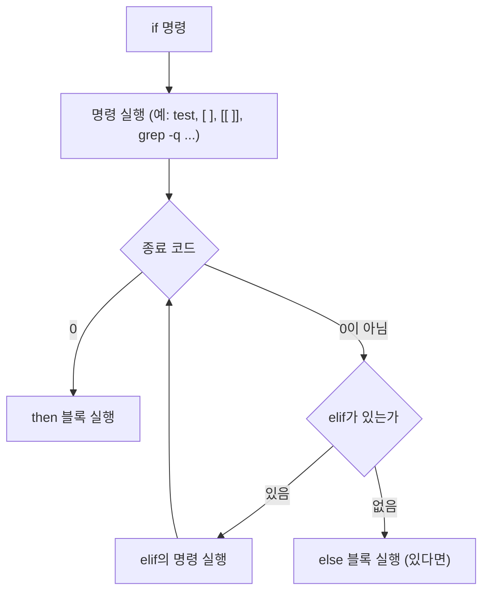

Bash에서 **조건 분기**는 `if`와 **테스트 명령**(`test`, `[ ]`, 그리고 bash 확장 `[[ ]]`)의 조합으로 이루어진다. 이 넷이 어떻게 맞물리는지, 그리고 왜 "조건"이 셸에서 별도의 자료형이 아니라 명령의 종료 코드인지부터 짚고 시작한다.

## 이 장을 읽기 전에

직전 챕터인 [26장: nohup](/post/bashshell/nohup-command-run-process-background-linux/)까지가 Part 4(프로세스와 작업 제어)였다. `ps`·`top`·`kill`·`jobs`·`nohup`은 이미 실행 중인 프로세스를 살펴보고 제어하는 도구였다. 이 장부터는 Part 5(셸 스크립팅)로 넘어간다 — 지금까지는 터미널에 명령을 하나씩 입력해 실행했다면, 이제부터는 여러 명령을 조건·반복·함수로 엮어 하나의 스크립트로 자동화하는 법을 다룬다. `if`와 `test`는 그 첫 관문이다. 스크립트가 상황에 따라 다른 명령을 실행하려면 먼저 "지금 상황이 어떤지"를 판별할 수 있어야 하고, 그 판별 수단이 바로 이 장의 주제다.

난이도는 입문–중급이다. 지금까지처럼 명령을 개별적으로 실행할 줄 알면 입문 구간은 바로 따라올 수 있고, POSIX와 bash의 차이까지 이해하려면 셸이 인자를 어떻게 나누고 확장하는지(단어 분리, 파일명 확장)에 대한 감각이 필요하다.

**다루지 않는 것**: 조건을 반복해서 검사하는 `for`·`while`·`until` 반복문은 [28장: for, while](/post/bashshell/for-while-loop-bash-shell-scripting/)에서 다룬다. 여러 값 중 하나와 매칭하는 `case`문과 산술 비교 `(( ))`는 [29장: case, 산술 연산](/post/bashshell/case-statement-arithmetic-expansion-bash/)에서 별도로 다룬다 — 이 장은 `if`/`test` 계열에 집중하고, `(( ))`는 이 장의 "핵심 개념"에서 존재만 짧게 언급한다.

## 당신의 수준에 맞는 경로

| 수준 | 읽을 부분 | 핵심 목표 |
|---|---|---|
| 입문 | 개요 + 정신 모델, 핵심 개념의 기본 형태·파일/문자열 테스트 | `if`/`test`/`[ ]`로 기본적인 조건 분기 스크립트를 작성할 수 있다 |
| 중급 | 핵심 개념 전체, 예시 | `[[ ]]` 확장을 활용하고, 상황에 맞는 파일·문자열·수치 테스트를 고를 수 있다 |
| 심화 | 주의사항·함정, 흔한 오개념 | POSIX `[ ]`와 bash `[[ ]]`의 차이를 근거를 들어 설명하고, 따옴표 누락으로 스크립트가 깨지는 사고를 예방할 수 있다 |

## 개요 + 정신 모델

셸에서 "조건"은 참/거짓이라는 별도의 자료형이 아니다. **모든 명령은 끝날 때 0–255 사이의 정수 하나(종료 코드)를 셸에 돌려주고, `if`는 그 값이 0이면 "참", 0이 아니면 "거짓"으로 해석할 뿐이다.** 이는 [33장: 종료 코드와 set -e/-x, trap](/post/bashshell/exit-status-set-trap-bash-error-handling/)에서 다룬 `$?` 개념과 정확히 같은 메커니즘이다 — `if`는 새로운 판별 방식을 도입하는 게 아니라, 이미 모든 명령이 갖고 있던 종료 코드를 분기의 재료로 그대로 재사용한다.

이 관점에서 보면 `test`(그리고 그 별칭인 `[ ]`, bash 확장인 `[[ ]]`)는 특별한 문법이 아니라 **그 자체로 종료 코드를 반환하는 명령일 뿐**이다. `test -f file.txt`를 실행하면 `file.txt`가 일반 파일이면 종료 코드 0을, 아니면 1을 돌려준다. `if`는 이 종료 코드를 보고 분기할 뿐, `test`가 "참"이나 "거짓"이라는 값을 어딘가에 저장해서 넘겨주는 게 아니다. 그래서 `if`의 조건 자리에는 `test`뿐 아니라 종료 코드를 반환하는 **어떤 명령**도 올 수 있다 — `if grep -q ERROR log.txt; then ...`처럼 `grep`을 직접 조건으로 쓰는 것도 같은 원리다(매치를 찾으면 0, 못 찾으면 1을 반환하므로).

```bash
test -f /etc/hosts; echo "test의 종료 코드: $?"   # 파일이 있으면 0

grep -q root /etc/passwd; echo "grep의 종료 코드: $?"   # if의 조건 자리에 그대로 쓸 수 있다
```

## 핵심 개념

### if의 기본 형태

```bash
if 명령; then
  명령이-성공하면-실행
elif 명령2; then
  명령2가-성공하면-실행
else
  둘-다-실패하면-실행
fi
```

`if` 뒤에는 `test`가 아니라도 어떤 명령이든 올 수 있지만, 실무에서는 조건을 표현하기 위해 거의 항상 `test`/`[ ]`/`[[ ]]`를 함께 쓴다.

### test, [ ], [[ ]]는 모두 "명령"이다

- `test 조건`과 `[ 조건 ]`은 완전히 동일한 명령이다. `[`는 `test`의 또 다른 이름(별칭 프로그램/빌트인)이며, 마지막 인자로 `]`를 반드시 받는다는 점만 다르다. 그래서 `[ 조건 ]`을 쓸 때 여는 대괄호·닫는 대괄호 앞뒤에 **공백이 필수**다 — `[`도 하나의 인자이므로 `[조건]`처럼 붙여 쓰면 셸이 `[조건]`을 명령 이름 하나로 잘못 해석한다.
- `[[ 조건 ]]`은 프로그램이 아니라 <strong>bash의 예약어(키워드)</strong>로 처리되는 복합 명령(compound command)이다. 이 차이가 뒤의 "주의사항·함정"에서 다루는 안전성 차이의 근본 원인이다.

### 파일 테스트

| 테스트 | 의미 |
|--------|------|
| `-f FILE` | 일반 파일인가 |
| `-d FILE` | 디렉터리인가 |
| `-e FILE` | 존재하는가 |
| `-r FILE` | 읽기 가능한가 |
| `-w FILE` | 쓰기 가능한가 |
| `-x FILE` | 실행 가능한가 |
| `-L FILE` | 심볼릭 링크인가 |
| `-s FILE` | 크기가 0보다 큰가 |

### 문자열 테스트

| 테스트 | 의미 |
|--------|------|
| `-z STR` | 길이가 0인가 |
| `-n STR` | 길이가 0이 아닌가 |
| `STR1 = STR2` | 같음 (양쪽 공백 필수) |
| `STR1 != STR2` | 다름 |

### 수치(정수) 테스트

| 테스트 | 의미 |
|--------|------|
| `-eq`, `-ne` | 같음, 다름 |
| `-lt`, `-le` | 미만, 이하 |
| `-gt`, `-ge` | 초과, 이상 |

### [[ ]] 확장

- `==`, `!=`로 **패턴 매칭**이 가능하다: `[[ $x == *.txt ]]`
- `&&`, `||`를 대괄호 안에서 직접 이어 쓸 수 있다: `[[ -f "$f" && -r "$f" ]]`
- `=~`로 정규 표현식 매칭도 지원한다: `[[ $line =~ ^[0-9]+$ ]]`

수치 비교만 할 때는 `test`/`[ ]` 대신 산술 컨텍스트 `(( ))`를 쓰는 방법도 있다(`(( x > 5 ))`처럼 C 스타일 연산자를 그대로 쓸 수 있어 가독성이 좋다). `(( ))`의 문법과 산술 연산자 전반은 [29장: case, 산술 연산](/post/bashshell/case-statement-arithmetic-expansion-bash/)에서 자세히 다룬다.

## 예시

```bash
# 기본형: 파일 존재 확인
if [ -f "$file" ]; then
  echo "file exists"
fi

# 변수가 비어 있지 않은지 확인
if [ -n "$VAR" ]; then
  echo "VAR is set"
fi

# [[ ]]의 패턴 매칭
if [[ $x == *.log ]]; then
  echo "ends with .log"
fi

# elif로 세 갈래 분기
score=72
if [ "$score" -ge 90 ]; then
  grade="A"
elif [ "$score" -ge 70 ]; then
  grade="B"
else
  grade="C"
fi
echo "grade: $grade"

# test를 직접 명령으로 사용 (test와 [ ]는 동일)
if test -d "$dir"; then
  echo "directory exists"
fi

# [[ ]]로 && 조건을 대괄호 안에서 직접 결합
if [[ -f "$file" && -r "$file" ]]; then
  echo "file exists and readable"
fi

# if 조건 자리에 test가 아닌 다른 명령을 직접 사용
if grep -q "ERROR" app.log; then
  echo "에러 로그 발견"
fi

# ! 로 조건 부정
if [ ! -e "$path" ]; then
  echo "경로가 존재하지 않는다"
fi
```

`if`가 조건을 판단하는 흐름을 종료 코드 관점에서 그리면 다음과 같다. `test`(또는 `[ ]`, `[[ ]]`, 혹은 임의의 명령)는 항상 종료 코드 하나만 `if`에 돌려주고, `if`는 그 값이 0인지 아닌지만 본다.



## 주의사항·함정

**POSIX `[`(=`test`)와 bash 확장 `[[`는 문법 처리 단계가 다르다.** `[`는 셸이 다른 명령과 똑같이 취급하는 프로그램/빌트인이므로, 안의 인자들이 실행 전에 일반적인 단어 분리(word splitting)와 파일명 확장(pathname expansion)을 그대로 거친다. 그래서 `$var`에 공백이 들어 있거나 값이 `*`처럼 와일드카드 문자를 포함하면, 따옴표로 감싸지 않았을 때 의도와 다르게 여러 단어로 쪼개지거나 파일명으로 확장될 위험이 있다. 반면 `[[ ]]`는 bash 예약어로 처리되는 복합 명령이라 이 확장을 겪지 않는다. GNU Bash Reference Manual은 이를 다음과 같이 규정한다.

> "The words between the `[[` and `]]` do not undergo word splitting and filename expansion." — GNU Bash Reference Manual, "Conditional Constructs"

이 덕분에 `[[ ]]` 안에서는 변수를 따옴표 없이 써도 `[ ]`보다 훨씬 안전하고, `&&`/`||`를 대괄호 안에서 직접 쓸 수 있으며(`[ ]`는 이를 위해 폐기 예정인 `-a`/`-o`를 쓰거나 명령을 별도로 나눠야 한다), `==`로 와일드카드 패턴 매칭까지 바로 쓸 수 있다. 다만 `[[ ]]`는 POSIX 표준이 아니라 bash·zsh·ksh가 제공하는 확장이므로, `#!/bin/sh`로 시작해 `dash` 같은 최소 POSIX 셸에서 실행될 스크립트에는 쓸 수 없다 — 이식성이 중요한 스크립트는 `[ ]`(=`test`)로 작성해야 한다.

**문자열 비교 `=`와 숫자 비교 `-eq`를 혼동하는 실수가 흔하다.** `[ "$a" -eq "$b" ]`는 양쪽을 정수로 해석하려 시도하므로, `$a`나 `$b`가 숫자가 아닌 문자열이면 "integer expression expected" 오류가 난다. 반대로 `[ "$a" = "$b" ]`는 순수 문자열 비교라서 `"10" = "10.0"`처럼 값은 같아 보여도 문자열이 다르면 거짓으로 판정한다.

```bash
a="10"; b="10.0"
[ "$a" = "$b" ] && echo "문자열로 같음" || echo "문자열로 다름"   # 다름 (문자열 비교이므로)
[ "$a" -eq "$b" ]   # "10.0"은 정수가 아니므로 오류: integer expression expected
```

**변수를 따옴표 없이 조건에 넣으면, 값이 빈 문자열일 때 문법 에러가 난다.** `[ $var = "x" ]`에서 `$var`가 비어 있으면, 셸은 인자를 확장한 뒤 `[ = "x" ]`처럼 좌변이 통째로 사라진 형태로 `test`를 호출한다. `test`는 이를 인자 개수가 맞지 않는 문법 오류로 처리한다.

```bash
var=""
[ $var = "x" ]        # var가 비어 있으면 [ = "x" ]가 되어 오류: unary operator expected

[ "$var" = "x" ]      # 따옴표로 감싸면 [ "" = "x" ]가 되어 정상적으로 거짓 판정
[[ $var == "x" ]]     # [[ ]]는 단어 분리를 겪지 않으므로 따옴표 없이도 안전
```

`[ ]`를 쓸 때는 변수를 항상 따옴표로 감싸는 습관이 이 문제를 근본적으로 막는 가장 간단한 방법이고, `[[ ]]`로 넘어가는 것도 같은 문제를 구조적으로 피하는 방법이다.

## 흔한 오개념

<strong>"if는 참/거짓이라는 별도의 자료형을 검사한다"</strong>는 가장 흔한 오해다. 앞서 "개요 + 정신 모델"에서 설명했듯, 셸에는 불리언 타입이 없다 — `if`는 오직 명령의 종료 코드가 0인지 아닌지만 본다. 이 오해를 갖고 있으면 `if [ "$flag" ]; then`과 `if $flag; then`(단, `$flag`가 `true`/`false`라는 실제 명령 이름일 때)의 차이나, 왜 `if grep -q pattern file; then`처럼 `test` 없이 명령을 직접 조건으로 쓸 수 있는지를 설명할 수 없다.

<strong>"`[ ]`와 `[[ ]]`는 문법만 다를 뿐 완전히 같은 기능이라 아무거나 편한 대로 쓰면 된다"</strong>도 자주 틀리는 지점이다. 실제로는 "주의사항·함정"에서 다뤘듯 `[[ ]]`가 단어 분리·파일명 확장을 겪지 않는다는 구조적인 차이가 있고, 이식성 방향에서는 반대로 `[ ]`만 POSIX 표준이라 `dash`처럼 `[[ ]]`를 지원하지 않는 셸도 있다. "bash 스크립트에서는 `[[ ]]`가 더 안전하다"와 "`#!/bin/sh` 스크립트에서는 `[ ]`만 쓸 수 있다"는 서로 다른 상황에 적용되는 규칙이며, 어느 한쪽이 항상 우월한 선택은 아니다.

## 다음 장에서는

[28장: for, while](/post/bashshell/for-while-loop-bash-shell-scripting/)에서는 조건을 한 번 판별하고 끝나는 것이 아니라, 조건이 유지되는 동안 반복해서 명령을 실행하는 `for`·`while`·`until`을 다룬다. 이 장이 "지금 상황에 따라 한 번 갈라지는 법"이었다면, 다음 장은 "같은 판별을 반복해서 여러 번 적용하는 법"이다 — `while`의 조건 판별 자리에는 이 장에서 배운 `test`/`[ ]`/`[[ ]]`가 그대로 재사용된다.

## 평가 기준

- 셸에서 "조건"이 별도의 자료형이 아니라 명령의 종료 코드(`$?`)라는 점을, 33장의 `$?` 개념과 연결해 설명할 수 있다.
- `test`, `[ ]`, `[[ ]]`가 각각 무엇인지(프로그램/빌트인 vs bash 예약어) 구분하고, 파일·문자열·수치 테스트를 상황에 맞게 선택할 수 있다.
- POSIX `[ ]`와 bash 확장 `[[ ]]`의 차이(단어 분리·파일명 확장 여부, `&&`/`||`·패턴 매칭 직접 사용 가능 여부, 이식성)를 근거를 들어 설명할 수 있다.
- 문자열 비교(`=`)와 숫자 비교(`-eq`)를 구분해 쓰고, 변수를 따옴표 없이 조건에 넣었을 때 빈 문자열이 문법 에러로 이어지는 함정을 피할 수 있다.
- `if`/`elif`/`else`로 세 갈래 이상의 조건 분기 스크립트를 작성할 수 있다.

## 참고

- [Conditional Constructs — GNU Bash Reference Manual](https://doc.guix.gnu.org/bash/latest/en/html_node/Conditional-Constructs.html)
- [Bash Conditional Expressions — GNU Bash Reference Manual](https://doc.guix.gnu.org/bash/latest/en/html_node/Bash-Conditional-Expressions.html)
- [test — POSIX.1-2017, The Open Group Base Specifications](https://pubs.opengroup.org/onlinepubs/9699919799/utilities/test.html)
