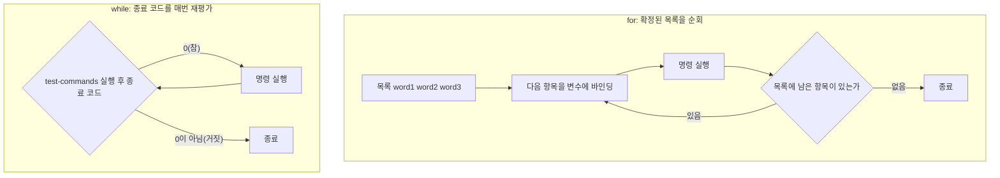

Bash **반복문**에는 목록을 순회하는 <strong>`for`</strong>, 조건이 참인 동안 도는 <strong>`while`</strong>, 조건이 거짓인 동안 도는 <strong>`until`</strong>이 있다. 셋 다 명령을 반복 실행한다는 결과는 같지만, 반복을 멈추는 기준 — 확정된 목록의 끝인지, 매번 새로 평가하는 조건인지 — 은 서로 다르다.

## 이 장을 읽기 전에

직전 챕터인 [27장: if, test](/post/bashshell/if-test-command-bash-conditional-statements/)에서 `test`/`[ ]`/`[[ ]]`로 조건을 판단해 참(종료 코드 0)·거짓(0이 아님)을 만들어내는 법을 다뤘다. 그 종료 코드는 `if`가 한 번 분기하는 데만 쓰이지 않는다 — 이 장에서 다루는 `while`은 같은 종료 코드를 반복 조건으로 그대로 재사용한다. 조건 분기를 배웠으니 이제 그 조건을 반복에 활용하는 단계다.

이 장은 Part 5(셸 스크립팅)의 두 번째 챕터로, `for`·`while`·`until` 세 가지 반복 구조와 `break`/`continue`를 다룬다.

난이도는 입문–중급이다. 27장의 종료 코드 개념과 [19장: 파이프](/post/bashshell/pipe-operator-linux-command-chaining/)의 서브셸 개념을 알면 "주의사항·함정"까지 온전히 이해할 수 있다.

**다루지 않는 것**: `while read` 루프에서 표준입력을 필드 단위로 안전하게 읽는 세부 문법(`-r`, `IFS=`, 여러 필드로 나눠 읽기)은 뒤이어 나올 30장(read와 표준입력)에서 다룬다. 배열을 순회하는 `for` 루프의 배열 전용 문법(`"${arr[@]}"`)은 31장(배열과 셸 확장)에서 다룬다. C 스타일 `for`의 `((...))` 산술 문맥 자체는 [29장: case와 산술 연산](/post/bashshell/case-statement-arithmetic-expansion-bash/)에서 본격적으로 다룬다.

## 당신의 수준에 맞는 경로

| 수준 | 읽을 부분 | 핵심 목표 |
|---|---|---|
| 입문 | 개요 + 정신 모델, 핵심 개념의 `for`(목록) · `while`(조건) 기본형 | 리스트를 순회하는 `for`와 조건이 참인 동안 도는 `while`을 구분해 쓸 수 있다 |
| 중급 | 핵심 개념 전체(C 스타일 `for`, `until`, `break`/`continue`), 예시 | 범위·파일 목록을 순회하고 `while read`로 파일을 한 줄씩 처리할 수 있다 |
| 심화 | 주의사항·함정, 흔한 오개념 | `for f in $(ls)` 안티패턴을 피하고, `while read` 파이프의 서브셸 격리 문제를 프로세스 치환·`lastpipe`로 해결할 수 있다 |

## 개요 + 정신 모델

Bash의 반복 구조는 서로 다른 두 가지 발상 위에 서 있다. **`for`는 이미 정해진 목록을 순회**한다 — 목록의 각 원소를 변수에 차례로 바인딩하며 명령을 실행하고, 더 순회할 원소가 없으면 멈춘다. 이 목록은 공백으로 구분된 단어들이거나(`for x in a b c`), 와일드카드가 확장된 파일명들이거나(`for f in *.txt`), 셸이 미리 만들어낸 정수 범위(`for i in {1..5}`)다 — 어느 경우든 루프가 시작되기 **전에** 반복 횟수와 각 항목이 이미 확정되어 있다. 반면 **`while`은 27장에서 배운 종료 코드를 반복 조건으로 재사용**한다 — 매 반복이 시작되기 전에 `test-commands`를 실제로 실행해 그 종료 코드가 0(참)인 동안만 계속 돈다. 몇 번을 반복할지 미리 정해져 있지 않고, 조건 자체가 매 반복마다 새로 평가된다는 점에서 `for`와 근본적으로 다르다. `until`은 `while`의 조건을 뒤집은 짝으로, 종료 코드가 0이 아닌(거짓) 동안 반복한다는 점만 다르고 나머지 메커니즘은 동일하다.



`for`는 왼쪽처럼 목록을 다 소진하면 끝나는 유한한 순회이고, `while`은 오른쪽처럼 매 반복 직전에 조건을 다시 실행해 그 결과에 따라 계속 여부를 결정하는 재평가 구조다.

## 핵심 개념

### for — 목록을 순회한다

GNU Bash Reference Manual은 `for`의 표준형을 이렇게 규정한다.

> "for name [ in [ words ...] ] ; do commands; done" — GNU Bash Reference Manual, "Looping Constructs"

```bash
# 리스트
for x in a b c; do
  echo "$x"
done

# 파일명 (와일드카드, 셸이 미리 목록으로 확장)
for f in *.txt; do
  echo "$f"
done

# 범위 (브레이스 확장)
for i in {1..5}; do
  echo "$i"
done

# 범위 + 증분(step)
for i in {1..10..2}; do
  echo "$i"
done
```

`in words...`를 아예 생략하면 위치 매개변수(`$@`)를 순회하는 기본형이 된다. POSIX Shell Command Language는 이 생략형을 명시적으로 규정한다.

> "If `in word...` is omitted, `for` shall execute the `do compound-list` once for each positional parameter that is set, as if `in \"$@\"` had been specified." — POSIX.1-2017, "Compound Commands"

```bash
# in을 생략하면 "$@"(스크립트/함수에 전달된 인자)를 순회한다
print_args() {
  for arg; do
    echo "인자: $arg"
  done
}
print_args foo bar baz
```

### C 스타일 for — 산술 조건으로 반복한다

`for name in words`가 이미 존재하는 목록을 순회하는 것과 달리, 배열 인덱스를 하나씩 늘려가거나 정수 카운터를 세는 상황에는 목록을 미리 만들 필요 없이 초기값·조건식·증분식만으로 반복을 표현하는 편이 자연스럽다. C 언어의 `for`와 문법이 거의 같아 다른 언어 경험이 있는 독자에게 익숙하다는 것도 실무에서 자주 선택되는 이유다.

```bash
for ((i=0; i<10; i++)); do
  echo "$i"
done
```

GNU Bash Reference Manual은 이를 표준형과 구분해 "대안 형태(alternate form)"로 부른다.

> "There is also an alternate form of the for command... First, the arithmetic expression `expr1` is evaluated..." — GNU Bash Reference Manual, "Looping Constructs"

`expr1`은 루프 진입 전 한 번, `expr2`는 매 반복 전에 참(0이 아닌 값)인지 평가되고, `expr3`은 매 반복이 끝난 뒤 실행된다 — 이 산술 평가 문맥(`((...))`) 자체는 [29장: case와 산술 연산](/post/bashshell/case-statement-arithmetic-expansion-bash/)에서 정식으로 다룬다. 이 형태가 POSIX 표준이 아니라는 점은 "주의사항·함정"에서 다시 짚는다.

### while / until — 조건이 참·거짓인 동안 반복한다

`while`의 `test-commands` 자리에는 27장에서 다룬 `[ ]`·`[[ ]]`뿐 아니라 종료 코드를 반환하는 어떤 명령이든 올 수 있다. 아래 첫 번째 예는 정수 비교로 카운터를 세는 가장 흔한 형태이고, 세 번째 예는 `test-commands` 자리에 `read`를 직접 둬 "다음 줄이 있는 동안" 반복하는 패턴이다 — 파일이 끝나 `read`가 실패(종료 코드 1)하는 순간이 곧 반복 종료 조건이 된다.

```bash
count=0
while [ "$count" -lt 5 ]; do
  echo "count: $count"
  count=$((count + 1))
done

# until은 while의 반대 — 조건이 거짓(0이 아님)인 동안 반복한다
count=0
until [ "$count" -ge 5 ]; do
  echo "count: $count"
  count=$((count + 1))
done

# 파일을 한 줄씩 읽기 (파이프가 아니라 리다이렉션으로 입력)
while read -r line; do
  echo "읽은 줄: $line"
done < file.txt
```

### break, continue — 반복 중단·건너뛰기

`break`는 루프를 즉시 탈출하고, `continue`는 이번 반복만 건너뛰고 다음 반복으로 넘어간다. 둘 다 중첩 루프에서 몇 단계를 빠져나갈지 지정하는 정수 인자 `n`을 받는다.

> "break [n] ... Exit from a for, while, until, or select loop. If n is supplied, the nth enclosing loop is exited." — GNU Bash Reference Manual, "Bourne Shell Builtins"

```bash
for i in 1 2 3 4 5; do
  if [ "$i" -eq 3 ]; then
    continue   # 3만 건너뛴다
  fi
  if [ "$i" -eq 5 ]; then
    break      # 5에서 완전히 멈춘다
  fi
  echo "$i"
done
```

## 예시

아래 여섯 개는 실무 스크립트에서 자주 쓰는 조합이다. 앞의 세 개(1–3)는 목록이 실행 전에 이미 확정되는 `for` 계열이고, 뒤의 세 개(4–6)는 매 반복마다 조건이나 입력을 새로 확인하는 `while` 계열이다 — 어떤 값이 반복 전에 정해져 있는지 반복 도중에 결정되는지를 기준으로 둘을 나누면 어떤 도구를 쓸지 고르기 쉽다.

```bash
# 1. 문자열 목록 순회
for name in alice bob carol; do
  echo "안녕, $name"
done

# 2. 글롭으로 파일 목록 순회 (공백 있는 파일명도 안전)
for f in ./logs/*.log; do
  echo "로그: $f"
done

# 3. C 스타일 for로 배열 인덱스 순회
arr=(a b c)
for ((i=0; i<${#arr[@]}; i++)); do
  echo "인덱스 $i: ${arr[$i]}"
done

# 4. while로 조건이 참인 동안 재시도
attempt=1
while [ "$attempt" -le 3 ]; do
  echo "시도 $attempt"
  attempt=$((attempt + 1))
done

# 5. until로 조건이 거짓인 동안 대기 폴링
until curl -sf http://localhost:8080/health >/dev/null; do
  echo "서비스 준비 대기 중..."
  sleep 1
done

# 6. while read로 파일을 한 줄씩 파싱 (리다이렉션, 서브셸 문제 없음)
while IFS=: read -r user _ uid _; do
  echo "계정 $user, UID $uid"
done < /etc/passwd
```

6번은 필드 구분자(`IFS=:`)를 바꿔 `/etc/passwd`의 콜론 구분 형식을 그대로 분해한 것으로, `read`가 한 줄을 여러 변수에 나눠 담는 세부 문법은 30장(read와 표준입력)에서 더 다룬다. 여기까지는 모두 안전한 형태만 골랐다 — 다음 절에서는 겉보기엔 비슷하지만 실무에서 실제로 사고를 내는 변형들을 살펴본다.

## 주의사항·함정

**`for f in $(ls)`는 흔히 보이지만 피해야 하는 안티패턴이다.** `$(ls)`의 출력은 따옴표로 감싸지 않았으므로 `for`가 목록을 만들기 전에 <strong>단어 분리(word splitting)</strong>와 <strong>글로빙(파일명 확장)</strong>을 그대로 거친다. GNU Bash Reference Manual은 단어 분리를 이렇게 규정한다.

> "The shell scans the results of parameter expansion, command substitution, and arithmetic expansion that did not occur within double quotes for word splitting." — GNU Bash Reference Manual, "Word Splitting"

즉 파일명에 공백이 있으면(`March report.log`) `for f in $(ls)`는 이를 하나의 파일명이 아니라 `March`와 `report.log`라는 두 개의 서로 다른 항목으로 쪼갠다. `ls`의 출력 자체가 사람이 읽기 위한 서식이라 스크립트에서 파싱할 대상으로 설계되지 않았다는 점도 근본 원인이다.

```bash
# 안티패턴: 공백 있는 파일명이 깨진다
for f in $(ls); do
  echo "처리: $f"
done

# 고친 버전 1: 글롭 자체를 목록으로 쓴다 (word splitting을 거치지 않는다)
for f in *.txt; do
  echo "처리: $f"
done

# 고친 버전 2: find -print0 + while read -d ''로 임의의 파일명을 안전하게 순회한다
# (21장 xargs에서 xargs -0의 짝으로 예고한 널 문자 구분 패턴을, 여기서는 xargs 대신 while로 소비한다)
find . -name "*.txt" -print0 | while IFS= read -r -d '' f; do
  echo "처리: $f"
done
```

`*.txt`처럼 글롭을 따옴표 없이 그대로 목록에 쓰면 셸이 매칭되는 파일명들을 이미 확정된 단어 목록으로 확장해 `for`에 넘기므로 안전하다. 반면 하위 디렉터리까지 재귀적으로 훑거나 글롭만으로 표현하기 어려운 조건(수정 시각, 권한 등)이 필요하면 `find`가 필요한데, 이때는 [21장: xargs](/post/bashshell/xargs-command-build-execute-command-lines/)에서 다룬 것과 같은 이유로 `-print0`/널 문자 구분이 필요하다 — 다만 뒤 명령이 `xargs`가 아니라 `while read`이므로 `read -d ''`로 구분자를 받는다.

**C 스타일 `for (( ))`는 POSIX가 아니라 Bash 확장이다.** 앞서 "핵심 개념"에서 인용했듯 GNU Bash Reference Manual은 이를 표준형과 별도의 "대안 형태"로 다룬다. POSIX Shell Command Language는 `for name [in [word ...]]` 형태만 규정하고 C 스타일 산술 `for`는 정의하지 않는다. `#!/bin/sh`로 시작하는 스크립트가 `dash`처럼 최소 POSIX 셸에서 실행되면 `for (( i=0; i<10; i++ ))`는 문법 오류를 낸다. 이식성이 필요한 스크립트라면 셔뱅을 `#!/bin/bash`로 명시하거나, `i=0; while [ "$i" -lt 10 ]; do ...; i=$((i+1)); done`처럼 POSIX 표준 형태로 대체해야 한다.

**`while read` 파이프의 오른쪽은 서브셸이라 변수가 루프 밖으로 나오지 않는다.** [19장: 파이프](/post/bashshell/pipe-operator-linux-command-chaining/)에서 다뤘듯, 파이프로 연결된 각 명령은 별도의 서브셸에서 실행된다. `cmd | while read -r line; do ...; done`처럼 쓰면 `while` 전체가 서브셸 안에서 도는 것이므로, 루프 안에서 갱신한 변수는 서브셸이 끝나는 순간 함께 사라진다.

```bash
# 함정: count가 파이프 오른쪽 서브셸 안에서만 갱신되고, 밖에서는 사라진다
count=0
cat access.log | while read -r line; do
  count=$((count + 1))
done
echo "총 줄 수: $count"   # 항상 0이 출력된다

# 대안 1: 프로세스 치환으로 while을 현재 셸에서 실행한다
count=0
while read -r line; do
  count=$((count + 1))
done < <(cat access.log)
echo "총 줄 수: $count"   # 실제 줄 수가 출력된다

# 대안 2: 파이프가 애초에 필요 없다면 리다이렉션만으로 충분하다
count=0
while read -r line; do
  count=$((count + 1))
done < access.log
echo "총 줄 수: $count"

# 대안 3: bash 4+에서 lastpipe로 파이프라인의 마지막 명령을 현재 셸에서 실행한다
shopt -s lastpipe
count=0
cat access.log | while read -r line; do
  count=$((count + 1))
done
echo "총 줄 수: $count"   # lastpipe가 켜져 있으면 여기서도 실제 값이 나온다
```

GNU Bash Reference Manual은 `lastpipe`를 다음과 같이 규정한다.

> "If set, and job control is not active, the shell runs the last command of a pipeline not executed in the background in the current shell environment." — GNU Bash Reference Manual, "The Shopt Builtin"

`lastpipe`는 잡 컨트롤이 비활성 상태일 때만 동작하므로, 잡 컨트롤이 기본으로 켜진 대화형 셸보다는 스크립트 안에서 켤 때 더 예측 가능하게 동작한다. `cat access.log |` 형태를 그대로 유지하고 싶을 때만 대안 3을 쓰고, 그럴 필요가 없다면 대안 1·2처럼 애초에 서브셸이 필요 없는 형태로 바꾸는 편이 이식성이 더 높다.

## 흔한 오개념

<strong>"`while`도 `for`처럼 몇 번 반복할지 미리 정해져 있다"</strong>는 흔한 오해다. `for`는 목록이 확정된 뒤 시작하므로 반복 횟수를 루프 진입 전에 알 수 있지만, `while`은 매 반복 직전에 `test-commands`를 실제로 다시 실행해 그 결과로 계속 여부를 결정한다. 위 예시 5의 `until curl ... ; do sleep 1; done`처럼 반복 횟수가 실행 전에는 전혀 알려지지 않고, 외부 상태(서비스가 언제 뜨는지)에 따라 매번 달라지는 경우가 `while`/`until`의 전형적인 용도다.

<strong>"`break`는 중첩된 루프를 전부 빠져나온다"</strong>도 자주 틀리는 지점이다. 기본 `break`(인자 없음)는 가장 안쪽 루프 하나만 탈출한다.

```bash
for i in 1 2 3; do
  for j in a b c; do
    if [ "$j" = b ]; then
      break        # 안쪽 for(j)만 탈출한다 — 바깥 for(i)는 계속 돈다
    fi
    echo "$i-$j"
  done
done
```

바깥쪽 루프까지 함께 빠져나오려면 "핵심 개념"에서 다룬 `break n`처럼 몇 단계를 탈출할지 숫자로 명시해야 한다(`break 2`는 두 단계 바깥 루프까지 탈출).

## 다음 장에서는

[29장: case와 산술 연산](/post/bashshell/case-statement-arithmetic-expansion-bash/)에서는 `if`보다 다중 패턴 분기에 특화된 `case`와, `$(( ))` 산술 확장으로 정수 계산을 셸 자체에서 처리하는 법을 다룬다. 이 장이 반복(loop)을 다뤘다면, 다음 장은 조건 분기를 확장하고 이 장의 C 스타일 `for (( i=0; i<10; i++ ))`에 이미 등장했던 `((...))` 산술 문맥을 본격적으로 파고든다.

## 평가 기준

- `for`가 확정된 목록(word-splitting 기반)을 순회하고, `while`/`until`이 매 반복마다 재평가하는 종료 코드가 참·거짓인 동안 반복한다는 서로 다른 정신 모델을 설명하고 구분해서 쓸 수 있다.
- 리스트·글롭·브레이스 범위·C 스타일·위치 매개변수 생략형까지 `for`의 여러 형태를 상황에 맞게 선택할 수 있다.
- `for f in $(ls)` 안티패턴이 단어 분리·글로빙 때문에 깨지는 이유를 설명하고, `for f in *.txt` 또는 `find -print0 | while read -r -d ''`로 안전하게 고칠 수 있다.
- C 스타일 `for (( ))`가 POSIX가 아니라 Bash 확장이라는 점을 알고, 이식성이 필요한 스크립트에서 대체할 방법을 선택할 수 있다.
- `while read` 파이프 오른쪽이 서브셸에서 실행되어 변수가 밖으로 전달되지 않는다는 함정을 알고, 프로세스 치환·리다이렉션·`lastpipe` 중 상황에 맞는 대안을 적용할 수 있다.
- `break`/`continue`가 기본적으로 가장 안쪽 루프에만 적용된다는 점과, 숫자 인자로 여러 단계를 빠져나가는 방법을 안다.

## 참고

- [Looping Constructs — GNU Bash Reference Manual](https://doc.guix.gnu.org/bash/latest/en/html_node/Looping-Constructs.html)
- [Word Splitting — GNU Bash Reference Manual](https://doc.guix.gnu.org/bash/latest/en/html_node/Word-Splitting.html)
- [The Shopt Builtin — GNU Bash Reference Manual](https://doc.guix.gnu.org/bash/latest/en/html_node/The-Shopt-Builtin.html)
- [Bourne Shell Builtins — GNU Bash Reference Manual](https://doc.guix.gnu.org/bash/latest/en/html_node/Bourne-Shell-Builtins.html)
- [Shell Command Language: Compound Commands — POSIX.1-2017](https://pubs.opengroup.org/onlinepubs/9699919799/utilities/V3_chap02.html#tag_18_09_04)
