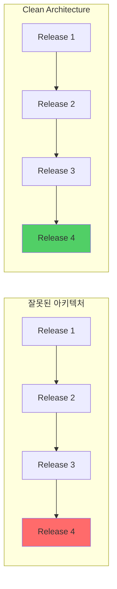
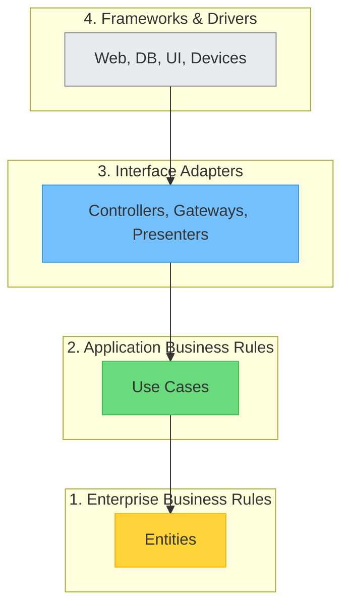

## Clean Architecture란

**Clean Architecture**는 Robert C. Martin(Uncle Bob)이 2017년 출간한 동명의 책에서 체계화한 소프트웨어 아키텍처 설계 원칙이다. 이 아키텍처의 핵심 목표는 **의존성 방향을 안쪽(고수준 정책)으로 향하게** 하여, 비즈니스 규칙을 프레임워크, 데이터베이스, UI 등의 세부 사항으로부터 분리하는 것이다.

> "좋은 아키텍처는 결정을 내리는 것이 아니라, 결정을 최대한 미룰 수 있게 해주는 것이다."
> — Robert C. Martin

Clean Architecture는 단순히 하나의 새로운 패턴이 아니라, **Hexagonal Architecture(Ports & Adapters)**, **Onion Architecture**, **BCE(Boundary-Control-Entity)** 등 기존의 우수한 아키텍처 패턴들의 핵심 원칙을 통합하고 정제한 결과물이다.

## 왜 Clean Architecture인가

소프트웨어 개발에서 가장 큰 비용은 **유지보수**에서 발생한다. 잘못된 아키텍처 결정은 시간이 지남에 따라 기하급수적으로 비용을 증가시킨다.

|문제|잘못된 아키텍처|Clean Architecture|
|:--:|:--:|:--:|
|변경 비용|기능 추가할수록 증가|일정하게 유지|
|테스트|UI/DB 의존으로 어려움|비즈니스 로직 독립 테스트|
|프레임워크 교체|전체 재작성 필요|경계 레이어만 수정|
|개발 속도|초기 빠름, 점차 감소|초기 느림, 장기 안정|



## 핵심 원칙: 동심원 구조

Clean Architecture의 가장 상징적인 이미지는 **동심원 다이어그램**이다. 안쪽 원으로 갈수록 고수준 정책(비즈니스 규칙)이 위치하고, 바깥쪽으로 갈수록 저수준 세부사항(UI, DB, 프레임워크)이 위치한다.



### 의존성 규칙(Dependency Rule)

**"의존성은 항상 안쪽으로만 향해야 한다."**

- 안쪽 원은 바깥쪽 원에 대해 아무것도 알지 못한다
- 바깥쪽 원의 어떤 것도 안쪽 원에 영향을 주어서는 안 된다
- 데이터 형식, 함수 이름, 프레임워크 등 바깥쪽의 어떤 것도 안쪽에서 언급되어서는 안 된다

## 책의 구성

이 시리즈는 Robert C. Martin의 *Clean Architecture: A Craftsman's Guide to Software Structure and Design*을 기반으로 총 **6개 파트, 45개 챕터**로 구성되어 있다.

### Part 1: 서론 (Introduction)

|챕터|제목|핵심 내용|
|:--:|:--|:--|
|01|소프트웨어 아키텍처의 탄생과 진화|Layered에서 Clean까지 아키텍처 발전사|
|02|계층형 아키텍처의 역사와 한계|전통적 3계층 구조와 한계|
|03|헥사고날 아키텍처 (Ports and Adapters)|Ports & Adapters 패턴|
|04|어니언 아키텍처: 도메인 중심 설계|도메인 중심 설계|
|05|클린 아키텍처의 탄생|Uncle Bob의 통합 제안|
|06|서론: 설계와 아키텍처|설계 vs 아키텍처 개념 정의|
|07|설계와 아키텍처란?|둘의 관계와 연속성|
|08|두 가지 가치: 행위와 구조|행위(Behavior)와 구조(Structure)|

### Part 2: 프로그래밍 패러다임 (Programming Paradigms)

|챕터|제목|핵심 내용|
|:--:|:--|:--|
|09|프로그래밍 패러다임 서론|프로그래밍 역사와 세 가지 패러다임|
|10|패러다임 개요: 세 가지 패러다임|구조적/객체지향/함수형 비교|
|11|구조적 프로그래밍|goto 제거와 제어 흐름|
|12|객체 지향 프로그래밍|다형성과 의존성 역전|
|13|함수형 프로그래밍|불변성과 부작용 제거|

### Part 3: 설계 원칙 (SOLID Principles)

|챕터|제목|핵심 내용|
|:--:|:--|:--|
|14|SOLID 원칙 서론|설계 원칙의 필요성|
|15|SRP: 단일 책임 원칙|하나의 변경 이유|
|16|OCP: 개방-폐쇄 원칙|확장에 열림, 수정에 닫힘|
|17|LSP: 리스코프 치환 원칙|하위 타입 호환성|
|18|ISP: 인터페이스 분리 원칙|클라이언트별 인터페이스|
|19|DIP: 의존성 역전 원칙|추상화에 의존|

### Part 4: 컴포넌트 원칙 (Component Principles)

|챕터|제목|핵심 내용|
|:--:|:--|:--|
|20|컴포넌트 원칙 서론|배포 단위로서의 컴포넌트|
|21|컴포넌트: 배포 단위|역사와 정의|
|22|컴포넌트 응집도: REP, CCP, CRP|REP, CCP, CRP|
|23|컴포넌트 결합: ADP, SDP, SAP|ADP, SDP, SAP|

### Part 5: 아키텍처 (Architecture)

|챕터|제목|핵심 내용|
|:--:|:--|:--|
|24|아키텍처 서론|시스템 설계 개요|
|25|아키텍처란?|시스템 생명주기 지원|
|26|독립성: 유스케이스, 운영, 개발, 배포|유스케이스, 운영, 개발, 배포|
|27|경계: 선 긋기와 플러그인 아키텍처|플러그인 아키텍처|
|28|경계 해부학: 모놀리스에서 서비스까지|모놀리스에서 서비스까지|
|29|정책과 수준|고수준 의존성 방향|
|30|업무 규칙: 엔티티와 유스케이스|엔티티와 유스케이스|
|31|소리치는 아키텍처|의도를 드러내는 구조|
|32|클린 아키텍처: 동심원과 의존성 규칙|동심원과 의존성 규칙|
|33|프레젠터와 험블 객체|테스트 용이성 확보|
|34|부분적 경계|비용-효과 균형|
|35|레이어와 경계|실전 설정|
|36|메인 컴포넌트|최저 수준 정책|
|37|서비스: 아키텍처 경계인가?|마이크로서비스 아키텍처|
|38|테스트 경계|테스트도 시스템의 일부|
|39|클린 임베디드 아키텍처|하드웨어 분리|

### Part 6: 세부사항 (Details)

|챕터|제목|핵심 내용|
|:--:|:--|:--|
|40|세부사항 서론|교체 가능한 부품|
|41|데이터베이스는 세부사항이다|영속성 분리|
|42|웹은 세부사항이다|GUI 역사와 분리|
|43|프레임워크는 세부사항이다|결합 위험성|
|44|사례 연구: 비디오 판매 시스템|실전 적용 예시|
|45|빠진 장: 패키지 구조|패키지 조직 방법|

## 핵심 개념 요약

### 1. 엔티티(Entities)
- 가장 핵심적인 비즈니스 규칙을 캡슐화
- 애플리케이션이 아닌 **기업 전체**에 적용되는 규칙
- 외부 변경에 가장 영향을 적게 받음

### 2. 유스케이스(Use Cases)
- 애플리케이션 고유의 비즈니스 규칙
- 시스템의 **행위**를 정의
- 엔티티를 조작하여 목표 달성

### 3. 인터페이스 어댑터(Interface Adapters)
- 외부와 내부 사이의 **데이터 변환**
- Controller, Presenter, Gateway
- 프레임워크와 비즈니스 로직 연결

### 4. 프레임워크와 드라이버(Frameworks & Drivers)
- 가장 바깥쪽 레이어
- Web, Database, UI Framework
- **교체 가능한 세부사항**

## Java 코드 예시

```java
// Entity - 핵심 비즈니스 규칙
public class Order {
    private List<OrderItem> items;
    private Money totalAmount;
    
    public Money calculateTotal() {
        return items.stream()
            .map(OrderItem::getSubtotal)
            .reduce(Money.ZERO, Money::add);
    }
}

// Use Case - 애플리케이션 비즈니스 규칙
public class PlaceOrderUseCase {
    private final OrderRepository orderRepository;
    private final PaymentGateway paymentGateway;
    
    public PlaceOrderUseCase(
        OrderRepository orderRepository,
        PaymentGateway paymentGateway
    ) {
        this.orderRepository = orderRepository;
        this.paymentGateway = paymentGateway;
    }
    
    public OrderResult execute(PlaceOrderRequest request) {
        Order order = createOrder(request);
        paymentGateway.charge(order.calculateTotal());
        orderRepository.save(order);
        return new OrderResult(order.getId());
    }
}

// Interface Adapter - 외부 연결
public interface OrderRepository {
    void save(Order order);
    Order findById(OrderId id);
}

public interface PaymentGateway {
    void charge(Money amount);
}
```

## Python 코드 예시

```python
# Entity
from dataclasses import dataclass
from decimal import Decimal
from typing import List

@dataclass
class OrderItem:
    product_id: str
    quantity: int
    unit_price: Decimal
    
    @property
    def subtotal(self) -> Decimal:
        return self.unit_price * self.quantity

@dataclass
class Order:
    items: List[OrderItem]
    
    def calculate_total(self) -> Decimal:
        return sum(item.subtotal for item in self.items)

# Use Case
from abc import ABC, abstractmethod

class OrderRepository(ABC):
    @abstractmethod
    def save(self, order: Order) -> str:
        pass

class PaymentGateway(ABC):
    @abstractmethod
    def charge(self, amount: Decimal) -> bool:
        pass

class PlaceOrderUseCase:
    def __init__(
        self,
        order_repository: OrderRepository,
        payment_gateway: PaymentGateway
    ):
        self.order_repository = order_repository
        self.payment_gateway = payment_gateway
    
    def execute(self, request: dict) -> dict:
        order = self._create_order(request)
        self.payment_gateway.charge(order.calculate_total())
        order_id = self.order_repository.save(order)
        return {"order_id": order_id, "status": "placed"}
```

## 결론

Clean Architecture는 단순한 폴더 구조나 코딩 규칙이 아니다. 이는 **소프트웨어의 본질적인 가치**인 유연성과 유지보수성을 극대화하기 위한 설계 철학이다.

핵심은 다음 세 가지로 요약된다:

1. **의존성 역전**: 고수준 정책이 저수준 세부사항에 의존하지 않도록 한다
2. **경계 분리**: 비즈니스 규칙과 인프라스트럭처를 명확히 분리한다
3. **결정 지연**: 중요하지 않은 결정(DB, 프레임워크 등)을 최대한 늦춘다

이 시리즈를 통해 Clean Architecture의 원칙을 깊이 이해하고, 실무에 적용할 수 있는 역량을 키우길 바란다.

## 핵심 개념 상세 설명

### 엔티티(Entities)

엔티티는 가장 핵심적인 비즈니스 규칙을 캡슐화한다. 이는 특정 애플리케이션이 아닌 **기업 전체**에 적용되는 규칙이다.

```java
// 42jerrykim.github.io에서 더 많은 정보를 확인 할 수 있다
public class Order {
    private OrderId id;
    private CustomerId customerId;
    private List<OrderItem> items;
    private OrderStatus status;
    
    public Money calculateTotal() {
        return items.stream()
            .map(OrderItem::getSubtotal)
            .reduce(Money.ZERO, Money::add);
    }
    
    public boolean canBeCancelled() {
        return status == OrderStatus.PENDING 
            || status == OrderStatus.CONFIRMED;
    }
    
    public void cancel() {
        if (!canBeCancelled()) {
            throw new OrderCannotBeCancelledException(id);
        }
        this.status = OrderStatus.CANCELLED;
    }
}
```

### 유스케이스(Use Cases)

유스케이스는 애플리케이션 고유의 비즈니스 규칙을 정의한다.

```java
// 42jerrykim.github.io에서 더 많은 정보를 확인 할 수 있다
public class PlaceOrderUseCase implements PlaceOrderInputBoundary {
    private final OrderRepository orderRepository;
    private final PaymentGateway paymentGateway;
    private final PlaceOrderOutputBoundary presenter;
    
    @Override
    public void execute(PlaceOrderRequest request) {
        Customer customer = customerRepository.findById(request.getCustomerId())
            .orElseThrow(() -> new CustomerNotFoundException(request.getCustomerId()));
        
        Order order = Order.create(customer, request.getItems());
        
        PaymentResult paymentResult = paymentGateway.charge(
            customer.getPaymentMethod(),
            order.calculateTotal()
        );
        
        if (!paymentResult.isSuccessful()) {
            presenter.presentPaymentFailure(paymentResult.getErrorMessage());
            return;
        }
        
        order.confirm(paymentResult.getTransactionId());
        orderRepository.save(order);
        presenter.presentSuccess(new PlaceOrderResponse(order.getId()));
    }
}
```

### 인터페이스 어댑터(Interface Adapters)

```java
// 42jerrykim.github.io에서 더 많은 정보를 확인 할 수 있다
@RestController
@RequestMapping("/api/orders")
public class OrderController {
    private final PlaceOrderInputBoundary placeOrderUseCase;
    
    @PostMapping
    public ResponseEntity<OrderResponseDto> placeOrder(
        @RequestBody PlaceOrderRequestDto requestDto
    ) {
        PlaceOrderRequest request = requestDto.toUseCaseRequest();
        placeOrderUseCase.execute(request);
        return ResponseEntity.ok().build();
    }
}

@Repository
public class JpaOrderRepository implements OrderRepository {
    private final OrderJpaRepository jpaRepository;
    
    @Override
    public void save(Order order) {
        OrderEntity entity = mapper.toEntity(order);
        jpaRepository.save(entity);
    }
}
```

## Python 코드 예시

```python
# 42jerrykim.github.io에서 더 많은 정보를 확인 할 수 있다
from dataclasses import dataclass
from decimal import Decimal
from typing import List, Optional
from enum import Enum

class OrderStatus(Enum):
    PENDING = "pending"
    CONFIRMED = "confirmed"
    CANCELLED = "cancelled"

@dataclass
class OrderItem:
    product_id: str
    quantity: int
    unit_price: Decimal
    
    @property
    def subtotal(self) -> Decimal:
        return self.unit_price * self.quantity

@dataclass
class Order:
    id: str
    customer_id: str
    items: List[OrderItem]
    status: OrderStatus = OrderStatus.PENDING
    
    def calculate_total(self) -> Decimal:
        return sum(item.subtotal for item in self.items)
    
    def can_be_cancelled(self) -> bool:
        return self.status in (OrderStatus.PENDING, OrderStatus.CONFIRMED)

from abc import ABC, abstractmethod

class OrderRepository(ABC):
    @abstractmethod
    def save(self, order: Order) -> None:
        pass

class PaymentGateway(ABC):
    @abstractmethod
    def charge(self, amount: Decimal, payment_method: str) -> dict:
        pass

class PlaceOrderUseCase:
    def __init__(self, order_repository: OrderRepository, payment_gateway: PaymentGateway):
        self.order_repository = order_repository
        self.payment_gateway = payment_gateway
    
    def execute(self, request: dict) -> dict:
        items = [OrderItem(**item) for item in request["items"]]
        order = Order(id=str(uuid.uuid4()), customer_id=request["customer_id"], items=items)
        
        payment_result = self.payment_gateway.charge(order.calculate_total(), request["payment_method"])
        if not payment_result["success"]:
            return {"error": payment_result["error"]}
        
        order.status = OrderStatus.CONFIRMED
        self.order_repository.save(order)
        return {"order_id": order.id, "status": "placed"}
```

## Clean Architecture의 장점과 단점

### 장점

1. **테스트 용이성**: 비즈니스 로직을 프레임워크나 데이터베이스 없이 테스트할 수 있다
2. **유연성**: 프레임워크, 데이터베이스, UI를 쉽게 교체할 수 있다
3. **독립적 개발**: 팀이 각 레이어를 독립적으로 개발할 수 있다
4. **유지보수성**: 변경의 영향 범위가 명확하게 제한된다
5. **비즈니스 로직 보호**: 핵심 로직이 외부 변경으로부터 보호된다

### 단점

1. **초기 복잡성**: 작은 프로젝트에는 과도한 구조일 수 있다
2. **학습 곡선**: 팀원들이 원칙을 이해하는 데 시간이 필요하다
3. **보일러플레이트 코드**: 레이어 간 데이터 변환 코드가 많아질 수 있다
4. **과도한 추상화**: 잘못 적용하면 불필요한 복잡성이 증가한다

### 적용 시 고려사항

|프로젝트 규모|권장 수준|
|:--:|:--|
|소규모 (1-2명, 3개월 미만)|간소화된 레이어 구조|
|중규모 (3-10명, 6개월-1년)|표준 Clean Architecture|
|대규모 (10명 이상, 1년 이상)|완전한 Clean Architecture + 마이크로서비스|


## 참고 자료

- Martin, R. C. (2017). *Clean Architecture: A Craftsman's Guide to Software Structure and Design*. Prentice Hall.
- Cockburn, A. (2005). *Hexagonal Architecture*. [https://alistair.cockburn.us/hexagonal-architecture/](https://alistair.cockburn.us/hexagonal-architecture/)
- Palermo, J. (2008). *The Onion Architecture*. [https://jeffreypalermo.com/2008/07/the-onion-architecture-part-1/](https://jeffreypalermo.com/2008/07/the-onion-architecture-part-1/)
