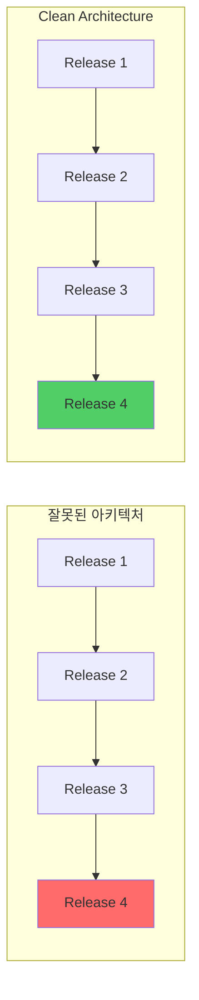
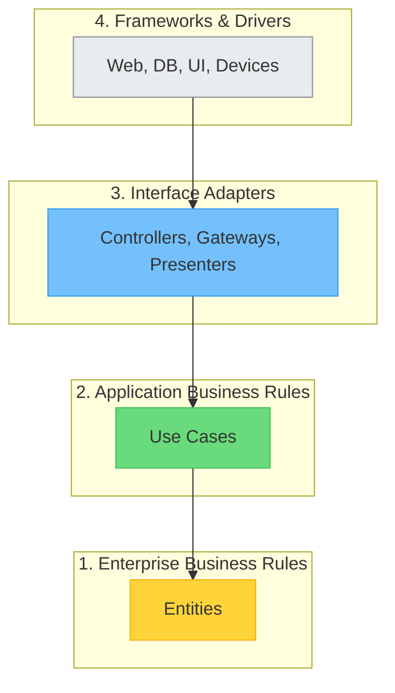

## Clean Architecture란

**Clean Architecture**는 Robert C. Martin(Uncle Bob)이 2017년 출간한 동명의 책에서 체계화한 소프트웨어 아키텍처 설계 원칙이다. 이 아키텍처의 핵심 목표는 **의존성 방향을 안쪽(고수준 정책)으로 향하게** 하여, 비즈니스 규칙을 프레임워크, 데이터베이스, UI 등의 세부 사항으로부터 분리하는 것이다.

마틴은 책 전반에서 좋은 아키텍처의 역할을 이렇게 요약한다: 좋은 아키텍처는 프레임워크·데이터베이스·UI 같은 세부사항에 대한 결정을 **강제로 미리 내리게 하지 않고, 최대한 뒤로 미룰 수 있게** 해주는 것이다(Martin, 2017, Ch. 15 "What Is Architecture?").

Clean Architecture는 단순히 하나의 새로운 패턴이 아니라, **Hexagonal Architecture(Ports & Adapters)**, **Onion Architecture**, **BCE(Boundary-Control-Entity)** 등 기존의 우수한 아키텍처 패턴들의 핵심 원칙을 통합하고 정제한 결과물이다. 세 원조 패턴은 공통적으로 "의존성이 프레임워크·DB 같은 바깥쪽 세부사항이 아니라 도메인 로직 쪽으로 향해야 한다"는 결론에 도달했지만, 그 경계를 긋는 방식은 저마다 달랐다. Hexagonal은 포트(인터페이스)와 어댑터(구현체)로 안과 밖을 나누는 데 집중했고, Onion은 도메인 모델을 중심에 두고 그 주위를 여러 겹의 레이어로 감싸는 방식을 택했으며, Clean Architecture는 이 둘의 경계 개념을 받아들이되 Entities·Use Cases·Interface Adapters·Frameworks라는 **4개의 이름 붙은 계층**으로 더 구체적으로 규정했다(3장·4장에서 각각 자세히 다룬다).

## 왜 Clean Architecture인가

소프트웨어 개발에서 가장 큰 비용은 **유지보수**에서 발생한다. 잘못된 아키텍처 결정은 시간이 지남에 따라 기하급수적으로 비용을 증가시킨다.

|문제|잘못된 아키텍처|Clean Architecture|
|:--:|:--:|:--:|
|변경 비용|기능 추가할수록 증가|일정하게 유지|
|테스트|UI/DB 의존으로 어려움|비즈니스 로직 독립 테스트|
|프레임워크 교체|전체 재작성 필요|경계 레이어만 수정|
|개발 속도|초기 빠름, 점차 감소|초기 느림, 장기 안정|


```mermaid
graph LR
    subgraph "잘못된 아키텍처"
        A1["Release 1"] --> B1["Release 2"]
        B1 --> C1["Release 3"]
        C1 --> D1["Release 4"]
        style D1 fill:#ff6b6b
    end
    
    subgraph "Clean Architecture"
        A2["Release 1"] --> B2["Release 2"]
        B2 --> C2["Release 3"]
        C2 --> D2["Release 4"]
        style D2 fill:#51cf66
    end
```

## 핵심 원칙: 동심원 구조

Clean Architecture의 가장 상징적인 이미지는 **동심원 다이어그램**이다. 안쪽 원으로 갈수록 고수준 정책(비즈니스 규칙)이 위치하고, 바깥쪽으로 갈수록 저수준 세부사항(UI, DB, 프레임워크)이 위치한다.


```mermaid
graph TB
    subgraph "4. Frameworks & Drivers"
        F["Web, DB, UI, Devices"]
    end
    subgraph "3. Interface Adapters"
        I["Controllers, Gateways, Presenters"]
    end
    subgraph "2. Application Business Rules"
        A["Use Cases"]
    end
    subgraph "1. Enterprise Business Rules"
        E["Entities"]
    end
    
    F --> I
    I --> A
    A --> E
    
    style E fill:#ffd43b,stroke:#fab005
    style A fill:#69db7c,stroke:#40c057
    style I fill:#74c0fc,stroke:#339af0
    style F fill:#e9ecef,stroke:#868e96
```

### 의존성 규칙(Dependency Rule)

동심원 구조 자체는 그림일 뿐이고, 이 그림을 실제로 지탱하는 단 하나의 규칙이 있다.

**"의존성은 항상 안쪽으로만 향해야 한다."**

이 규칙은 세 가지 구체적인 금지사항으로 풀어볼 수 있다.

- 안쪽 원은 바깥쪽 원에 대해 아무것도 알지 못한다
- 바깥쪽 원의 어떤 것도 안쪽 원에 영향을 주어서는 안 된다
- 데이터 형식, 함수 이름, 프레임워크 등 바깥쪽의 어떤 것도 안쪽에서 언급되어서는 안 된다

세 항목은 결국 하나의 결론으로 수렴한다 — 소스 코드 의존성(누가 누구를 `import`하는가)의 방향이 항상 안쪽을 향해야 하며, 이는 런타임 제어 흐름의 방향과 반대일 수도 있다(예: 안쪽 유스케이스가 인터페이스를 통해 바깥쪽 구현을 호출하는 경우).

## 책의 구성

원저는 Part I~VI 34개 챕터와 Appendix A "Architecture Archaeology"로 구성된다. 이 시리즈는 그 34개 챕터를 근간으로, 이해를 돕는 역사·비교 챕터(육각형·어니언 아키텍처, SOLID·컴포넌트 원칙 서론 등) 11개를 더해 **6개 파트, 45개 챕터**로 재구성했다.

### Part 1: 서론 (Introduction)

|챕터|제목|핵심 내용|
|:--:|:--|:--|
|01|소프트웨어 아키텍처의 탄생과 진화|Layered에서 Clean까지 아키텍처 발전사|
|02|계층형 아키텍처의 역사와 한계|전통적 3계층 구조와 한계|
|03|헥사고날 아키텍처 (Ports and Adapters)|Ports & Adapters 패턴|
|04|어니언 아키텍처: 도메인 중심 설계|도메인 중심 설계|
|05|클린 아키텍처의 탄생|Uncle Bob의 통합 제안|
|06|서론: 설계와 아키텍처|동작하는 코드 vs 제대로 된 소프트웨어, 왜 신경 써야 하는가|
|07|설계와 아키텍처란?|둘의 정의와 관계, 연속성|
|08|두 가지 가치: 행위와 구조|행위(Behavior)와 구조(Structure)|

### Part 2: 프로그래밍 패러다임 (Programming Paradigms)

|챕터|제목|핵심 내용|
|:--:|:--|:--|
|09|프로그래밍 패러다임 서론|프로그래밍 역사와 세 가지 패러다임|
|10|패러다임 개요: 세 가지 패러다임|구조적/객체지향/함수형 비교|
|11|구조적 프로그래밍|goto 제거와 제어 흐름|
|12|객체 지향 프로그래밍|다형성과 의존성 역전|
|13|함수형 프로그래밍|불변성과 부작용 제거|

### Part 3: 설계 원칙 (SOLID Principles)

|챕터|제목|핵심 내용|
|:--:|:--|:--|
|14|SOLID 원칙 서론|설계 원칙의 필요성|
|15|SRP: 단일 책임 원칙|하나의 변경 이유|
|16|OCP: 개방-폐쇄 원칙|확장에 열림, 수정에 닫힘|
|17|LSP: 리스코프 치환 원칙|하위 타입 호환성|
|18|ISP: 인터페이스 분리 원칙|클라이언트별 인터페이스|
|19|DIP: 의존성 역전 원칙|추상화에 의존|

### Part 4: 컴포넌트 원칙 (Component Principles)

|챕터|제목|핵심 내용|
|:--:|:--|:--|
|20|컴포넌트 원칙 서론|배포 단위로서의 컴포넌트|
|21|컴포넌트: 배포 단위|역사와 정의|
|22|컴포넌트 응집도: REP, CCP, CRP|REP, CCP, CRP|
|23|컴포넌트 결합: ADP, SDP, SAP|ADP, SDP, SAP|

### Part 5: 아키텍처 (Architecture)

|챕터|제목|핵심 내용|
|:--:|:--|:--|
|24|아키텍처 서론|시스템 설계 개요|
|25|아키텍처란?|시스템 생명주기 지원|
|26|독립성: 유스케이스, 운영, 개발, 배포|유스케이스, 운영, 개발, 배포|
|27|경계: 선 긋기와 플러그인 아키텍처|플러그인 아키텍처|
|28|경계 해부학: 모놀리스에서 서비스까지|모놀리스에서 서비스까지|
|29|정책과 수준|고수준 의존성 방향|
|30|업무 규칙: 엔터티와 유스케이스|엔터티와 유스케이스|
|31|소리치는 아키텍처|의도를 드러내는 구조|
|32|클린 아키텍처: 동심원과 의존성 규칙|동심원과 의존성 규칙|
|33|프레젠터와 험블 객체|테스트 용이성 확보|
|34|부분적 경계|비용-효과 균형|
|35|레이어와 경계|실전 설정|
|36|메인 컴포넌트|최저 수준 정책|
|37|서비스: 아키텍처 경계인가?|마이크로서비스 아키텍처|
|38|테스트 경계|테스트도 시스템의 일부|
|39|클린 임베디드 아키텍처|하드웨어 분리|

### Part 6: 세부사항 (Details)

|챕터|제목|핵심 내용|
|:--:|:--|:--|
|40|세부사항 서론|교체 가능한 부품|
|41|데이터베이스는 세부사항이다|영속성 분리|
|42|웹은 세부사항이다|GUI 역사와 분리|
|43|프레임워크는 세부사항이다|결합 위험성|
|44|사례 연구: 비디오 판매 시스템|실전 적용 예시|
|45|빠진 장: 패키지 구조|패키지 조직 방법|

> 원저의 Appendix A "Architecture Archaeology"(마틴 자신의 과거 프로젝트 회고)는 이 시리즈의 커리큘럼 범위에서 제외했다 — 역사적 일화 위주로, 다른 챕터와 달리 재사용 가능한 원칙을 담고 있지 않기 때문이다.

## 핵심 개념: 4개 계층

동심원의 4개 계층은 각각 명확히 구분된 책임을 가지며, 아래로 갈수록(바깥쪽일수록) 변경 빈도가 높고 위로 갈수록(안쪽일수록) 안정적이다.

**엔티티(Entities)**는 가장 핵심적인 비즈니스 규칙을 캡슐화한다. 특정 애플리케이션이 아닌 **기업 전체**에 적용되는 규칙이며, 외부 변경에 가장 영향을 적게 받는다. **유스케이스(Use Cases)**는 애플리케이션 고유의 비즈니스 규칙으로, 시스템의 **행위**를 정의하고 엔티티를 조작해 목표를 달성한다. **인터페이스 어댑터(Interface Adapters)**는 Controller·Presenter·Gateway로 외부와 내부 사이의 데이터 변환을 담당하며, 프레임워크와 비즈니스 로직을 연결한다. 가장 바깥쪽인 **프레임워크와 드라이버(Frameworks & Drivers)**는 Web·Database·UI Framework 등 **교체 가능한 세부사항**이다.

## 흔한 오해

Clean Architecture를 처음 접하면 다음 두 가지를 오해하기 쉽다.

**오해 1: "Clean Architecture는 특정 폴더 구조다."** 동심원 다이어그램이 유명해지면서 `entities/`, `usecases/`, `adapters/`, `frameworks/` 같은 폴더를 만들면 끝이라고 생각하기 쉽다. 하지만 핵심은 폴더 이름이 아니라 **의존성 방향**이다. 폴더를 나눠도 안쪽 계층이 바깥쪽 구체 클래스를 직접 import하면 의존성 규칙은 깨진 것이다.

**오해 2: "4개 계층을 정확히 지켜야 한다."** 마틴 본인도 원저에서 계층 수는 "4개가 유일한 정답이 아니다"라고 밝힌다. 계층은 필요에 따라 더 늘어나거나 줄어들 수 있으며, 지켜야 할 불변 원칙은 계층 개수가 아니라 **의존성이 항상 안쪽으로만 향해야 한다**는 규칙 자체다.

## 학습 목표

이 개요 챕터를 읽은 후 다음을 할 수 있어야 한다.

- 동심원 4계층(엔티티, 유스케이스, 인터페이스 어댑터, 프레임워크·드라이버)의 책임을 각각 설명할 수 있다.
- 의존성 규칙("의존성은 항상 안쪽으로만 향한다")이 무엇을 금지하는지 구체적인 예로 들 수 있다.
- Hexagonal·Onion Architecture와 Clean Architecture의 공통점과 차이를 비교할 수 있다.
- "Clean Architecture = 특정 폴더 구조"라는 오해가 왜 틀렸는지 설명할 수 있다.

## 코드로 보는 4개 계층

### 엔티티(Entities)

아래 세 코드 블록은 뒤에서 다시 정의하지 않고 이 절 안에서 세 계층에 걸쳐 재사용되는 하나의 주문(Order) 예제다.

```java
import java.util.List;

// 보조 타입
class OrderId { OrderId(String id) {} }
class CustomerId { CustomerId(String id) {} }
enum OrderStatus { PENDING, CONFIRMED, CANCELLED }
class Money {
    static final Money ZERO = new Money();
    Money add(Money other) { return this; }
}
class OrderItem { Money getSubtotal() { return Money.ZERO; } }
class OrderCannotBeCancelledException extends RuntimeException {
    OrderCannotBeCancelledException(OrderId id) { super("cannot cancel: " + id); }
}

public class Order {
    private OrderId id;
    private CustomerId customerId;
    private List<OrderItem> items;
    private OrderStatus status;
    
    public Money calculateTotal() {
        return items.stream()
            .map(OrderItem::getSubtotal)
            .reduce(Money.ZERO, Money::add);
    }
    
    public boolean canBeCancelled() {
        return status == OrderStatus.PENDING 
            || status == OrderStatus.CONFIRMED;
    }
    
    public void cancel() {
        if (!canBeCancelled()) {
            throw new OrderCannotBeCancelledException(id);
        }
        this.status = OrderStatus.CANCELLED;
    }
}
```

### 유스케이스(Use Cases)

아래 `PlaceOrderUseCase`는 위 `Order` 엔티티를 그대로 조작하되, 결제·저장·응답 같은 바깥쪽 동작은 구체 구현이 아니라 인터페이스(Boundary)로만 알고 있다는 점에 주목한다. `OrderRepository`·`PaymentGateway`가 실제로 무엇으로 구현되는지는 이 클래스의 관심사가 아니다.

```java
import java.util.List;
import java.util.Optional;

// 보조 타입(엔티티는 위 "엔티티" 절과 동일)
class CustomerId { CustomerId(String id) {} }
class PaymentMethod {}
class Customer {
    PaymentMethod getPaymentMethod() { return new PaymentMethod(); }
}
class Money { static final Money ZERO = new Money(); }
class OrderItem {}
class OrderId {}
class Order {
    static Order create(Customer customer, List<OrderItem> items) { return new Order(); }
    Money calculateTotal() { return Money.ZERO; }
    void confirm(String transactionId) {}
    OrderId getId() { return new OrderId(); }
}
class PlaceOrderRequest {
    CustomerId getCustomerId() { return new CustomerId("c1"); }
    List<OrderItem> getItems() { return List.of(); }
}
class PlaceOrderResponse { PlaceOrderResponse(OrderId id) {} }
class PaymentResult {
    boolean isSuccessful() { return true; }
    String getErrorMessage() { return ""; }
    String getTransactionId() { return "tx1"; }
}
class CustomerNotFoundException extends RuntimeException {
    CustomerNotFoundException(CustomerId id) { super("customer not found"); }
}
interface PlaceOrderInputBoundary { void execute(PlaceOrderRequest request); }
interface PlaceOrderOutputBoundary {
    void presentPaymentFailure(String message);
    void presentSuccess(PlaceOrderResponse response);
}
interface OrderRepository { void save(Order order); }
interface CustomerRepository { Optional<Customer> findById(CustomerId id); }
interface PaymentGateway { PaymentResult charge(PaymentMethod method, Money amount); }

public class PlaceOrderUseCase implements PlaceOrderInputBoundary {
    private final OrderRepository orderRepository;
    private final CustomerRepository customerRepository;
    private final PaymentGateway paymentGateway;
    private final PlaceOrderOutputBoundary presenter;
    
    public PlaceOrderUseCase(
        OrderRepository orderRepository,
        CustomerRepository customerRepository,
        PaymentGateway paymentGateway,
        PlaceOrderOutputBoundary presenter
    ) {
        this.orderRepository = orderRepository;
        this.customerRepository = customerRepository;
        this.paymentGateway = paymentGateway;
        this.presenter = presenter;
    }
    
    @Override
    public void execute(PlaceOrderRequest request) {
        Customer customer = customerRepository.findById(request.getCustomerId())
            .orElseThrow(() -> new CustomerNotFoundException(request.getCustomerId()));
        
        Order order = Order.create(customer, request.getItems());
        
        PaymentResult paymentResult = paymentGateway.charge(
            customer.getPaymentMethod(),
            order.calculateTotal()
        );
        
        if (!paymentResult.isSuccessful()) {
            presenter.presentPaymentFailure(paymentResult.getErrorMessage());
            return;
        }
        
        order.confirm(paymentResult.getTransactionId());
        orderRepository.save(order);
        presenter.presentSuccess(new PlaceOrderResponse(order.getId()));
    }
}
```

### 인터페이스 어댑터(Interface Adapters)

아래 두 클래스가 바로 앞서 정의한 `PlaceOrderInputBoundary`·`OrderRepository` 인터페이스의 실제 구현체다. `OrderController`는 HTTP 요청을 유스케이스가 이해하는 `PlaceOrderRequest`로 변환해 전달하고, `JpaOrderRepository`는 JPA 엔티티와 도메인 `Order` 객체 사이를 오간다. 두 클래스 모두 바깥쪽(웹 프레임워크·JPA)의 세부사항을 알지만, 유스케이스 쪽 코드는 이 어댑터의 존재조차 몰라도 된다는 점이 의존성 규칙이 실제로 지켜지는 지점이다.

```java
import org.springframework.web.bind.annotation.*;
import org.springframework.http.ResponseEntity;
import org.springframework.stereotype.Repository;

// 보조 타입
class OrderId {}
class Order {}
class OrderEntity {}
class PlaceOrderRequest {}
class OrderResponseDto {}
class PlaceOrderRequestDto {
    PlaceOrderRequest toUseCaseRequest() { return new PlaceOrderRequest(); }
}
interface PlaceOrderInputBoundary { void execute(PlaceOrderRequest request); }
interface OrderRepository { void save(Order order); }
interface OrderJpaRepository { void save(OrderEntity entity); }
class OrderMapper { OrderEntity toEntity(Order order) { return new OrderEntity(); } }

@RestController
@RequestMapping("/api/orders")
public class OrderController {
    private final PlaceOrderInputBoundary placeOrderUseCase;
    
    public OrderController(PlaceOrderInputBoundary placeOrderUseCase) {
        this.placeOrderUseCase = placeOrderUseCase;
    }
    
    @PostMapping
    public ResponseEntity<OrderResponseDto> placeOrder(
        @RequestBody PlaceOrderRequestDto requestDto
    ) {
        PlaceOrderRequest request = requestDto.toUseCaseRequest();
        placeOrderUseCase.execute(request);
        return ResponseEntity.ok().build();
    }
}

@Repository
public class JpaOrderRepository implements OrderRepository {
    private final OrderJpaRepository jpaRepository;
    private final OrderMapper mapper;
    
    public JpaOrderRepository(OrderJpaRepository jpaRepository, OrderMapper mapper) {
        this.jpaRepository = jpaRepository;
        this.mapper = mapper;
    }
    
    @Override
    public void save(Order order) {
        OrderEntity entity = mapper.toEntity(order);
        jpaRepository.save(entity);
    }
}
```

### 언어에 독립적인 원칙

위 3개 Java 블록이 보여준 구조 — 엔티티는 인터페이스만 알고 구체 구현을 모른다는 것 — 는 특정 언어의 문법이 아니라 의존성 방향에 관한 규칙이므로, Python처럼 클래스 기반 언어든 함수형 언어든 동일하게 적용된다. Python이라면 `OrderRepository`를 `abc.ABC` 기반 추상 클래스로, Go라면 암묵적 인터페이스로 표현 방식만 달라질 뿐 "유스케이스가 구현체를 몰라야 한다"는 규칙 자체는 그대로 유지된다. 이 예제의 세부 구현(엔티티 설계 원칙은 30장, 프레젠터를 통한 테스트 용이성은 33장)은 뒤에서 각각 더 깊이 다룬다.

## Clean Architecture의 장점과 단점

### 장점

의존성이 안쪽으로만 향하도록 강제하면 다음 다섯 가지 이점이 구조적으로 따라온다.

1. **테스트 용이성**: 비즈니스 로직을 프레임워크나 데이터베이스 없이 테스트할 수 있다
2. **유연성**: 프레임워크, 데이터베이스, UI를 쉽게 교체할 수 있다
3. **독립적 개발**: 팀이 각 레이어를 독립적으로 개발할 수 있다
4. **유지보수성**: 변경의 영향 범위가 명확하게 제한된다
5. **비즈니스 로직 보호**: 핵심 로직이 외부 변경으로부터 보호된다

다섯 항목은 모두 같은 원인(안쪽 계층이 바깥쪽 계층을 모른다는 것)에서 파생된 결과다. 위 "코드로 보는 4개 계층" 예제에서 `PlaceOrderUseCase`가 `OrderRepository` 인터페이스만 알고 `JpaOrderRepository` 구현을 모르는 것이 바로 1번(테스트 용이성)과 2번(유연성)이 동시에 성립하는 이유다 — 테스트에서는 가짜 `OrderRepository`를, 운영에서는 진짜 JPA 구현을 주입하기만 하면 된다.

### 단점

반대로 계층·경계를 나누는 데는 비용이 따르며, 프로젝트 규모에 맞지 않게 적용하면 이점보다 비용이 커질 수 있다.

1. **초기 복잡성**: 작은 프로젝트에는 과도한 구조일 수 있다
2. **학습 곡선**: 팀원들이 원칙을 이해하는 데 시간이 필요하다
3. **보일러플레이트 코드**: 레이어 간 데이터 변환 코드가 많아질 수 있다
4. **과도한 추상화**: 잘못 적용하면 불필요한 복잡성이 증가한다

이 네 가지는 장점과 정확히 대칭 관계에 있다 — 인터페이스와 계층을 나누는 바로 그 행위가 유연성을 낳는 동시에 코드량과 학습 부담을 늘린다. 따라서 "장점만 취하고 단점은 피하는" 절충은 존재하지 않으며, 다음 절처럼 프로젝트 상황에 맞춰 이 비용을 얼마나 감수할지 판단하는 문제로 귀결된다.

### 적용 시 고려사항

장단점을 감안하면 "항상 전면 적용"이 정답은 아니다. 프로젝트 규모와 수명에 따라 적용 수준을 조절하는 것이 실용적이다.

|프로젝트 규모|권장 수준|
|:--:|:--|
|소규모 (1-2명, 3개월 미만)|간소화된 레이어 구조|
|중규모 (3-10명, 6개월-1년)|표준 Clean Architecture|
|대규모 (10명 이상, 1년 이상)|완전한 Clean Architecture + 마이크로서비스|

## 결론

Clean Architecture는 단순한 폴더 구조나 코딩 규칙이 아니다. 이는 **소프트웨어의 본질적인 가치**인 유연성과 유지보수성을 극대화하기 위한 설계 철학이다.

핵심은 다음 세 가지로 요약된다:

1. **의존성 역전**: 고수준 정책이 저수준 세부사항에 의존하지 않도록 한다
2. **경계 분리**: 비즈니스 규칙과 인프라스트럭처를 명확히 분리한다
3. **결정 지연**: 중요하지 않은 결정(DB, 프레임워크 등)을 최대한 늦춘다

이 시리즈를 통해 Clean Architecture의 원칙을 깊이 이해하고, 실무에 적용할 수 있는 역량을 키우길 바란다.

## 참고 자료

- Martin, R. C. (2017). *Clean Architecture: A Craftsman's Guide to Software Structure and Design*. Prentice Hall.
- Cockburn, A. (2005). *Hexagonal Architecture*. [https://alistair.cockburn.us/hexagonal-architecture/](https://alistair.cockburn.us/hexagonal-architecture/)
- Palermo, J. (2008). *The Onion Architecture*. [https://jeffreypalermo.com/2008/07/the-onion-architecture-part-1/](https://jeffreypalermo.com/2008/07/the-onion-architecture-part-1/)
