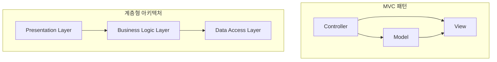
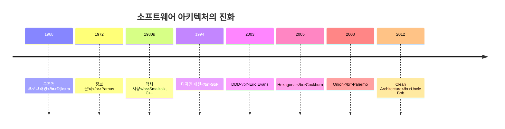

소프트웨어 아키텍처는 하루아침에 만들어진 개념이 아니다. 수십 년에 걸친 실패와 성공의 경험이 축적되어 오늘날 우리가 알고 있는 아키텍처 원칙과 패턴들이 탄생했다. Clean Architecture를 제대로 이해하려면, 먼저 그것이 등장하게 된 역사적 맥락을 살펴볼 필요가 있다.

## 1960년대: 소프트웨어 위기와 구조적 프로그래밍의 등장

1960년대 후반, 소프트웨어 산업은 심각한 위기에 직면했다. 프로젝트들은 예산을 초과하고, 일정을 지키지 못했으며, 버그가 넘쳐났다. 1968년 NATO 소프트웨어 공학 컨퍼런스에서 "소프트웨어 위기(Software Crisis)"라는 용어가 처음 사용되었다.

이 시기에 **에츠허르 데이크스트라(Edsger Dijkstra)**가 등장했다. 그는 1968년 "Go To Statement Considered Harmful"이라는 유명한 논문을 발표하며, 무분별한 goto 문의 사용이 프로그램을 이해하기 어렵게 만든다고 주장했다. 이것이 **구조적 프로그래밍(Structured Programming)**의 시작이었다.

```
구조적 프로그래밍의 핵심 원칙:
- 순차(Sequence): 명령문을 순서대로 실행
- 선택(Selection): if-then-else 구조
- 반복(Iteration): while, for 루프
```

데이크스트라의 주장은 단순했다. 프로그램의 모든 제어 흐름은 이 세 가지 구조만으로 표현할 수 있으며, 이렇게 작성된 프로그램은 수학적으로 증명 가능하다는 것이었다.

## 1970년대: 모듈화와 정보 은닉

1970년대에는 **데이비드 파르나스(David Parnas)**가 소프트웨어 설계의 새로운 지평을 열었다. 그의 1972년 논문 "On the Criteria To Be Used in Decomposing Systems into Modules"는 오늘날까지도 소프트웨어 아키텍처의 기초가 되는 개념을 제시했다.

파르나스는 **정보 은닉(Information Hiding)**이라는 개념을 도입했다. 모듈은 자신의 내부 구현을 숨기고, 잘 정의된 인터페이스만을 외부에 노출해야 한다는 것이다.

> "모듈을 나누는 기준은 기능이 아니라, 변경될 가능성이 있는 설계 결정이어야 한다."
> — David Parnas

이 원칙은 훗날 객체 지향 프로그래밍의 캡슐화(Encapsulation) 개념으로 발전하게 된다.

## 1980년대: 객체 지향의 부상

1980년대는 **객체 지향 프로그래밍(Object-Oriented Programming)**이 주류로 부상한 시기다. Smalltalk, C++와 같은 언어들이 등장하며, 캡슐화, 상속, 다형성이라는 세 가지 핵심 개념이 정립되었다.

| 개념 | 설명 | 아키텍처적 의미 |
|------|------|----------------|
| 캡슐화 | 데이터와 행위를 하나로 묶음 | 모듈 경계 정의 |
| 상속 | 기존 코드의 재사용 | 확장성 확보 |
| 다형성 | 동일 인터페이스, 다른 구현 | 의존성 역전의 기반 |

특히 **다형성**은 소프트웨어 아키텍처에서 혁명적인 의미를 가졌다. 다형성을 통해 소스 코드의 의존성 방향을 제어 흐름과 반대로 설정할 수 있게 되었기 때문이다. 이것이 바로 **의존성 역전(Dependency Inversion)**의 핵심이다.

## 1990년대: 디자인 패턴과 아키텍처 스타일

1994년, **Gang of Four(GoF)**가 "Design Patterns: Elements of Reusable Object-Oriented Software"를 출간했다. 이 책은 23개의 디자인 패턴을 체계화하여, 개발자들이 공통의 언어로 설계를 논의할 수 있게 해주었다.

같은 시기에 다양한 **아키텍처 스타일**도 등장했다:

- **MVC (Model-View-Controller)**: 1979년 Smalltalk에서 시작되어 1990년대에 웹 애플리케이션의 표준이 됨
- **계층형 아키텍처 (Layered Architecture)**: Presentation, Business Logic, Data Access 계층으로 분리
- **클라이언트-서버 아키텍처**: 네트워크 기반 시스템의 기본 모델



## 2000년대: 도메인 중심 설계와 새로운 아키텍처 패턴

2003년, **에릭 에반스(Eric Evans)**가 "Domain-Driven Design"을 출간했다. DDD는 복잡한 소프트웨어를 도메인 모델 중심으로 설계하는 방법론을 제시했다.

같은 시기에 **알리스테어 콕번(Alistair Cockburn)**은 **육각형 아키텍처(Hexagonal Architecture)**를 제안했다(2005). 이 아키텍처는 애플리케이션의 핵심 비즈니스 로직을 외부 요소(UI, DB, 외부 서비스)로부터 분리하는 방법을 제시했다.

2008년에는 **제프리 팔레르모(Jeffrey Palermo)**가 **양파 아키텍처(Onion Architecture)**를 발표했다. 이 아키텍처는 도메인 모델을 중심에 두고, 외부로 갈수록 인프라스트럭처에 가까워지는 동심원 구조를 제안했다.

## 2010년대: Clean Architecture의 등장

2012년, **로버트 C. 마틴(Robert C. Martin, Uncle Bob)**은 자신의 블로그에 "The Clean Architecture"라는 글을 게시했다. 이 글에서 그는 육각형 아키텍처, 양파 아키텍처, BCE(Boundary-Control-Entity) 등 기존 아키텍처 패턴들의 공통점을 추출하여 **Clean Architecture**라는 통합된 개념을 제시했다.

2017년에는 "Clean Architecture: A Craftsman's Guide to Software Structure and Design"이라는 책을 출간하여, 이 개념을 체계적으로 정리했다.



## Clean Architecture가 해결하고자 하는 문제

Clean Architecture는 수십 년간의 소프트웨어 개발 경험에서 축적된 문제들을 해결하고자 한다:

1. **프레임워크 종속성**: 프레임워크가 시스템을 지배하면 안 된다
2. **테스트 어려움**: 비즈니스 로직은 UI, DB 없이도 테스트 가능해야 한다
3. **UI 종속성**: UI가 변경되어도 비즈니스 로직은 영향받지 않아야 한다
4. **데이터베이스 종속성**: Oracle에서 MongoDB로 바꿔도 비즈니스 로직은 변하지 않아야 한다
5. **외부 시스템 종속성**: 외부 API가 변경되어도 내부 시스템은 보호되어야 한다

## 역사로부터 배우는 교훈

소프트웨어 아키텍처의 역사를 살펴보면, 한 가지 일관된 방향성을 발견할 수 있다. 그것은 바로 **관심사의 분리(Separation of Concerns)**와 **의존성 관리(Dependency Management)**다.

데이크스트라의 구조적 프로그래밍부터 Uncle Bob의 Clean Architecture까지, 모든 발전은 결국 다음 질문에 대한 답을 찾는 과정이었다:

> "어떻게 하면 변경하기 쉽고, 이해하기 쉽고, 유지보수하기 쉬운 소프트웨어를 만들 수 있을까?"

Clean Architecture는 이 질문에 대한 가장 최신의, 그리고 가장 체계적인 답변이다. 이제 우리는 이 역사적 맥락 위에서, Clean Architecture의 각 요소들을 더 깊이 이해할 준비가 되었다.

## 다음 장에서는

다음 장에서는 전통적인 계층형 아키텍처가 어떻게 등장했고, 왜 한계에 부딪혔는지 살펴본다. 이 한계를 이해해야 Clean Architecture가 왜 필요한지 진정으로 이해할 수 있다.
