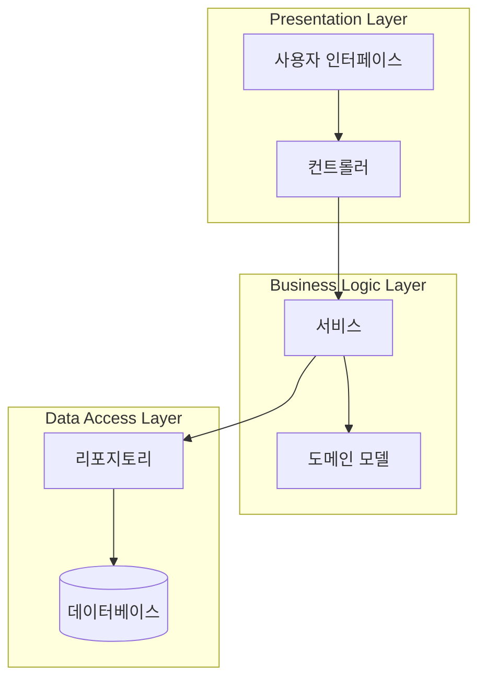
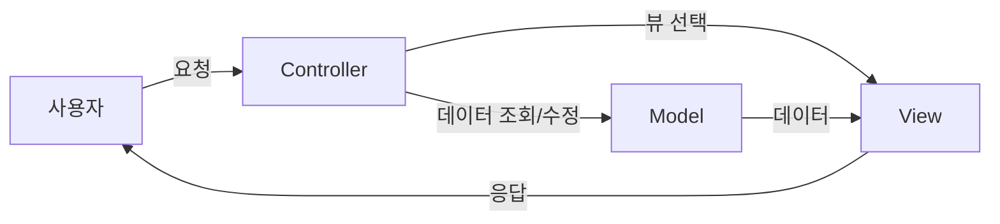
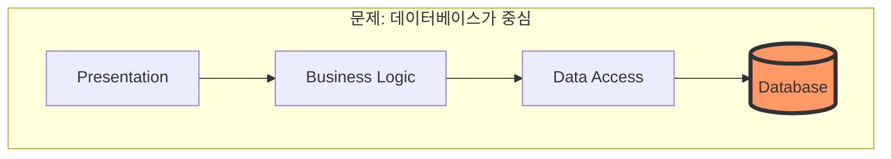
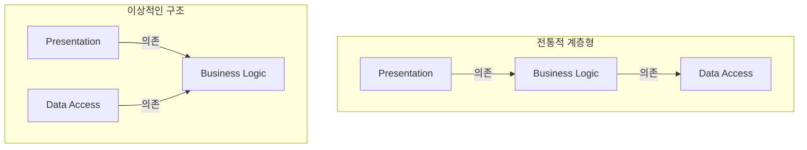

계층형 아키텍처는 수십 년간 소프트웨어 개발의 표준으로 자리 잡았다. 대부분의 엔터프라이즈 애플리케이션이 이 구조를 따랐고, 많은 프레임워크들이 이 패턴을 기본으로 제공했다. 그러나 이 검증된 패턴에도 근본적인 한계가 있었고, 이 한계를 극복하기 위해 새로운 아키텍처 패턴들이 등장하게 되었다.

## 계층형 아키텍처의 등장

### 왜 계층이 필요했는가?

초기 소프트웨어 개발에서 가장 큰 문제 중 하나는 **코드의 뒤엉킴**이었다. UI 코드 안에 데이터베이스 쿼리가 섞여 있고, 비즈니스 로직이 여기저기 흩어져 있는 구조를 흔히 "Big Ball of Mud"라고 불렀다.

```
// Big Ball of Mud 예시 - 모든 것이 뒤엉킨 코드
public void ProcessOrder(HttpRequest request) {
    // UI 처리
    string customerId = request.Form["customerId"];
    
    // DB 접근
    SqlConnection conn = new SqlConnection(connectionString);
    conn.Open();
    SqlCommand cmd = new SqlCommand("SELECT * FROM Customers WHERE Id = " + customerId, conn);
    
    // 비즈니스 로직
    if (customer.Balance < orderTotal) {
        // 에러 처리와 UI 표시가 혼재
        Response.Write("<h1>잔액 부족</h1>");
    }
    
    // 다시 DB 접근
    cmd = new SqlCommand("INSERT INTO Orders...", conn);
    cmd.ExecuteNonQuery();
    
    // UI 처리
    Response.Redirect("success.aspx");
}
```

이런 코드는 이해하기 어렵고, 수정하면 예상치 못한 곳에서 버그가 발생하며, 테스트하기도 거의 불가능하다.

### 관심사의 분리

계층형 아키텍처의 핵심 아이디어는 **관심사의 분리(Separation of Concerns)**다. 서로 다른 관심사를 별도의 계층으로 분리하여, 각 계층이 자신의 역할에만 집중하도록 한다.

## 전통적인 3계층 아키텍처

가장 널리 알려진 계층형 아키텍처는 **3계층 아키텍처(3-Tier Architecture)**다.



### 각 계층의 역할

| 계층 | 역할 | 포함 요소 |
|------|------|----------|
| Presentation | 사용자와의 상호작용 | UI, 컨트롤러, 뷰 |
| Business Logic | 비즈니스 규칙 처리 | 서비스, 도메인 모델 |
| Data Access | 데이터 저장/조회 | 리포지토리, ORM |

### 계층 간 의존성 규칙

전통적인 계층형 아키텍처에서 의존성은 **위에서 아래로** 흐른다:

- Presentation → Business Logic → Data Access

각 계층은 바로 아래 계층만 알 수 있고, 아래 계층은 위 계층을 모른다.

## MVC 패턴

**MVC(Model-View-Controller)** 패턴은 1979년 Smalltalk에서 시작되어, 웹 애플리케이션의 표준 아키텍처가 되었다.



### MVC의 구성 요소

- **Model**: 데이터와 비즈니스 로직을 담당
- **View**: 데이터를 사용자에게 표시
- **Controller**: 사용자 입력을 처리하고 Model과 View를 연결

### MVC의 변형들

시간이 지나며 다양한 변형이 등장했다:

- **MVP (Model-View-Presenter)**: View가 수동적
- **MVVM (Model-View-ViewModel)**: 데이터 바인딩 활용
- **MVI (Model-View-Intent)**: 단방향 데이터 흐름

## 계층형 아키텍처의 장점

### 1. 명확한 구조

각 계층의 역할이 명확하여 개발자들이 코드를 어디에 배치할지 쉽게 결정할 수 있다.

### 2. 팀 분업의 용이성

프론트엔드 개발자는 Presentation 계층을, 백엔드 개발자는 Business Logic과 Data Access 계층을 담당할 수 있다.

### 3. 교체 가능성

이론적으로, 한 계층을 다른 구현으로 교체할 수 있다. 예를 들어 웹 UI를 모바일 UI로 바꾸거나, MySQL을 PostgreSQL로 바꾸는 것이 가능하다.

## 계층형 아키텍처의 한계

그러나 실제 프로젝트에서 계층형 아키텍처는 여러 심각한 문제에 직면한다.

### 1. 데이터베이스 중심 설계



계층형 아키텍처에서 모든 의존성은 결국 **데이터베이스를 향한다**. 이는 다음과 같은 문제를 야기한다:

- 비즈니스 로직이 데이터베이스 스키마에 종속
- 데이터베이스 변경 시 전체 시스템에 영향
- "데이터베이스 먼저, 비즈니스 로직 나중" 사고방식 유발

> "우리는 데이터베이스 테이블을 먼저 설계하고, 그 위에 비즈니스 로직을 쌓는 실수를 반복한다."

### 2. 테스트의 어려움

```
// 테스트하기 어려운 서비스 계층
public class OrderService {
    private readonly OrderRepository _repository;
    private readonly PaymentGateway _paymentGateway;
    
    public OrderService() {
        // 구체적인 구현에 직접 의존
        _repository = new OrderRepository();
        _paymentGateway = new StripePaymentGateway();
    }
    
    public void PlaceOrder(Order order) {
        // 데이터베이스와 외부 서비스 없이 테스트 불가
        _repository.Save(order);
        _paymentGateway.Charge(order.Total);
    }
}
```

Business Logic 계층이 Data Access 계층에 직접 의존하면, 데이터베이스 없이 비즈니스 로직을 테스트할 수 없다.

### 3. 의존성 방향의 문제

가장 근본적인 문제는 **의존성의 방향**이다.



전통적 계층형 아키텍처에서:
- 비즈니스 로직 → 데이터 접근에 의존
- 가장 중요한 비즈니스 로직이 가장 변하기 쉬운 인프라스트럭처에 의존

이상적인 구조에서:
- 데이터 접근 → 비즈니스 로직에 의존
- 가장 중요한 비즈니스 로직이 중심에 위치하고, 나머지가 이에 의존

### 4. 프레임워크 종속성

많은 웹 프레임워크가 계층형 아키텍처를 강제한다. Spring, Django, Rails 등은 모두 특정한 구조를 권장하며, 이 구조에서 벗어나기 어렵다.

```
// Spring의 전형적인 구조 - 프레임워크에 종속됨
@Controller
public class OrderController {
    @Autowired
    private OrderService orderService;
    
    @PostMapping("/orders")
    public ResponseEntity<Order> createOrder(@RequestBody OrderRequest request) {
        // 프레임워크 어노테이션이 비즈니스 로직까지 침투
    }
}
```

### 5. 도메인 로직의 유출

시간이 지나면 비즈니스 로직이 여러 계층으로 흩어지는 현상이 발생한다:

- 컨트롤러에 비즈니스 로직 (편의상)
- 뷰에 비즈니스 로직 (표시 형식 결정)
- 데이터베이스에 비즈니스 로직 (저장 프로시저, 트리거)

### 6. 계층 건너뛰기

"빠른 개발"을 위해 계층을 건너뛰는 유혹이 생긴다:

```
// 계층을 건너뛴 안티패턴
@Controller
public class OrderController {
    @Autowired
    private JdbcTemplate jdbcTemplate;  // 컨트롤러에서 직접 DB 접근!
    
    @GetMapping("/orders/{id}")
    public Order getOrder(@PathVariable Long id) {
        return jdbcTemplate.queryForObject(
            "SELECT * FROM orders WHERE id = ?",
            new OrderRowMapper(), id);
    }
}
```

## 계층형 아키텍처의 진화 시도

이러한 한계를 극복하기 위해 여러 시도가 있었다.

### 1. 서비스 계층 패턴

비즈니스 로직을 Service 클래스로 분리하여 재사용성을 높임.

### 2. 리포지토리 패턴

데이터 접근을 추상화하여 데이터베이스 종속성을 줄임.

### 3. 의존성 주입 (DI)

인터페이스를 통해 의존성을 주입받아 테스트 용이성을 높임.

```
// 의존성 주입으로 개선된 서비스
public class OrderService {
    private readonly IOrderRepository _repository;
    private readonly IPaymentGateway _paymentGateway;
    
    public OrderService(IOrderRepository repository, IPaymentGateway paymentGateway) {
        _repository = repository;
        _paymentGateway = paymentGateway;
    }
}
```

그러나 이러한 개선에도 불구하고, 근본적인 문제인 **의존성의 방향**은 해결되지 않았다.

## 새로운 아키텍처의 필요성

계층형 아키텍처의 한계는 결국 다음과 같은 질문으로 이어졌다:

> "비즈니스 로직이 인프라스트럭처에 의존하는 것이 아니라, 인프라스트럭처가 비즈니스 로직에 의존하도록 할 수 없을까?"

이 질문에 대한 답이 바로:
- **육각형 아키텍처 (Hexagonal Architecture)**
- **양파 아키텍처 (Onion Architecture)**
- **클린 아키텍처 (Clean Architecture)**

다음 장에서는 이 중 첫 번째인 육각형 아키텍처가 어떻게 계층형 아키텍처의 문제를 해결하려 했는지 살펴본다.

## 핵심 요약

| 항목 | 계층형 아키텍처 | 문제점 |
|------|----------------|--------|
| 의존성 방향 | 위 → 아래 (DB 방향) | 비즈니스 로직이 DB에 종속 |
| 중심 요소 | 데이터베이스 | 도메인 로직이 아닌 데이터가 중심 |
| 테스트 | DB 필요 | 단위 테스트 어려움 |
| 프레임워크 | 강한 결합 | 프레임워크 교체 어려움 |
| 확장성 | 수직적 확장 | 수평적 확장 어려움 |

계층형 아키텍처는 "코드를 어디에 둘 것인가"에 대한 답을 주었지만, "의존성을 어떻게 관리할 것인가"에 대한 답은 주지 못했다. 이 한계를 극복하기 위해 새로운 아키텍처 패턴들이 등장하게 된다.
