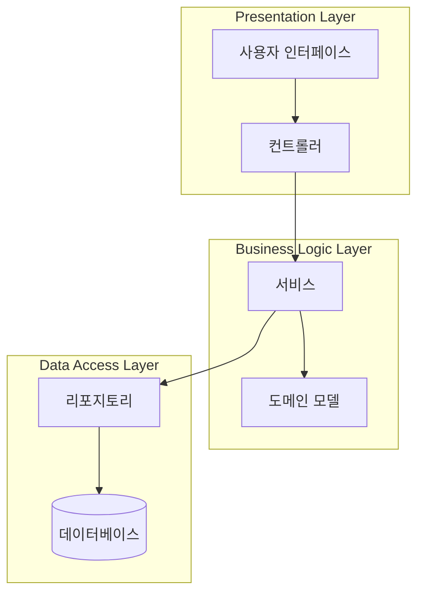
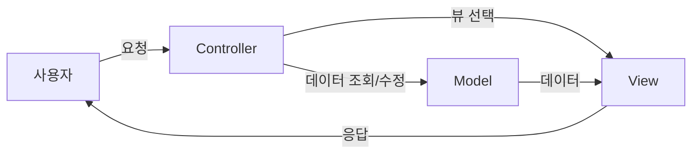
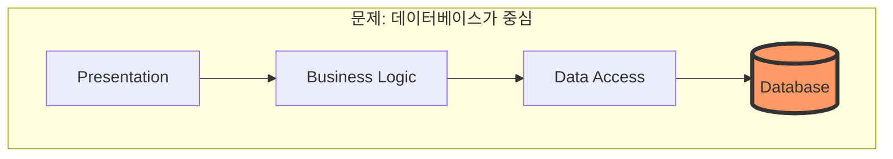
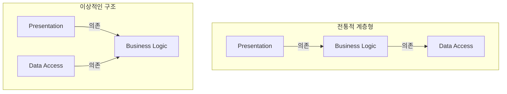

계층형 아키텍처는 수십 년간 소프트웨어 개발의 표준으로 자리 잡았다. 대부분의 엔터프라이즈 애플리케이션이 이 구조를 따랐고, 많은 프레임워크들이 이 패턴을 기본으로 제공했다. 그러나 이 검증된 패턴에도 근본적인 한계가 있었고, 이 한계를 극복하기 위해 새로운 아키텍처 패턴들이 등장하게 되었다.

## 계층형 아키텍처의 등장

### 왜 계층이 필요했는가?

초기 소프트웨어 개발에서 가장 큰 문제 중 하나는 **코드의 뒤엉킴**이었다. UI 코드 안에 데이터베이스 쿼리가 섞여 있고, 비즈니스 로직이 여기저기 흩어져 있는 구조를 흔히 "Big Ball of Mud"라고 불렀다.

```text
// Big Ball of Mud 예시(의사코드) - 모든 것이 뒤엉킨 코드
public void ProcessOrder(HttpRequest request) {
    // UI 처리
    string customerId = request.Form["customerId"];
    
    // DB 접근
    SqlConnection conn = new SqlConnection(connectionString);
    conn.Open();
    SqlCommand cmd = new SqlCommand("SELECT * FROM Customers WHERE Id = " + customerId, conn);
    
    // 비즈니스 로직
    if (customer.Balance < orderTotal) {
        // 에러 처리와 UI 표시가 혼재
        Response.Write("<h1>잔액 부족</h1>");
    }
    
    // 다시 DB 접근
    cmd = new SqlCommand("INSERT INTO Orders...", conn);
    cmd.ExecuteNonQuery();
    
    // UI 처리
    Response.Redirect("success.aspx");
}
```

이런 코드는 이해하기 어렵고, 수정하면 예상치 못한 곳에서 버그가 발생하며, 테스트하기도 거의 불가능하다.

### 관심사의 분리

계층형 아키텍처의 핵심 아이디어는 **관심사의 분리(Separation of Concerns)**다. 서로 다른 관심사를 별도의 계층으로 분리하여, 각 계층이 자신의 역할에만 집중하도록 한다.

## 전통적인 3계층 아키텍처

가장 널리 알려진 계층형 아키텍처는 **3계층 아키텍처(3-Tier Architecture)**다.


```mermaid
flowchart TB
    subgraph Presentation [Presentation Layer]
        UI[사용자 인터페이스]
        Controller[컨트롤러]
    end
    
    subgraph Business [Business Logic Layer]
        Service[서비스]
        Domain[도메인 모델]
    end
    
    subgraph Data [Data Access Layer]
        Repository[리포지토리]
        DB[(데이터베이스)]
    end
    
    UI --> Controller
    Controller --> Service
    Service --> Domain
    Service --> Repository
    Repository --> DB
```

### 각 계층의 역할

| 계층 | 역할 | 포함 요소 |
|------|------|----------|
| Presentation | 사용자와의 상호작용 | UI, 컨트롤러, 뷰 |
| Business Logic | 비즈니스 규칙 처리 | 서비스, 도메인 모델 |
| Data Access | 데이터 저장/조회 | 리포지토리, ORM |

### 계층 간 의존성 규칙

전통적인 계층형 아키텍처에서 의존성은 **위에서 아래로** 흐른다:

- Presentation → Business Logic → Data Access

각 계층은 바로 아래 계층만 알 수 있고, 아래 계층은 위 계층을 모른다.

## MVC 패턴과 3계층의 관계

3계층 아키텍처의 Presentation Layer는 대개 **MVC(Model-View-Controller)** 패턴으로 구현된다. 트리그베 린스코그(Trygve Reenskaug)가 1979년 제록스 PARC에서 Smalltalk 환경을 위해 고안한 이 패턴은 이후 웹 애플리케이션의 표준이 되었고, Controller가 Business Logic Layer로 요청을 넘기는 진입점 역할을 한다.


```mermaid
flowchart LR
    User[사용자] -->|요청| Controller
    Controller -->|데이터 조회/수정| Model
    Controller -->|뷰 선택| View
    Model -->|데이터| View
    View -->|응답| User
```

MVC는 책임을 셋으로 나눈다. Model이 상태와 규칙을 갖고, View는 그 상태를 보여주기만 하며, Controller가 사용자 입력을 받아 Model을 변경하고 적절한 View를 선택한다. **Model**은 데이터와 비즈니스 로직을, **View**는 화면 표시를, **Controller**는 입력 처리와 Model-View 연결을 담당한다. 이 구도에서 알 수 있듯, MVC의 Model은 3계층의 Business Logic Layer와 겹치는 개념이다 — 즉 MVC는 3계층 구조를 UI 쪽에서 좀 더 세분화한 것이지, 3계층과 별개의 아키텍처가 아니다.

## 계층형 아키텍처의 장점

계층형 아키텍처가 수십 년간 표준으로 자리 잡은 데는 이유가 있다. 아래 세 가지 장점은 특히 팀 규모가 커지고 프로젝트가 여러 사람의 손을 거칠수록 뚜렷하게 드러난다.

### 1. 명확한 구조

각 계층의 역할이 명확하여 개발자들이 코드를 어디에 배치할지 쉽게 결정할 수 있다. 새로 합류한 개발자도 "컨트롤러는 여기, 서비스는 여기"라는 관례만 익히면 빠르게 기여할 수 있다.

### 2. 팀 분업의 용이성

프론트엔드 개발자는 Presentation 계층을, 백엔드 개발자는 Business Logic과 Data Access 계층을 담당할 수 있다. 계층 간 인터페이스만 합의되면 각 팀이 독립적으로 작업을 진행할 수 있다.

### 3. 교체 가능성

이론적으로, 한 계층을 다른 구현으로 교체할 수 있다. 예를 들어 웹 UI를 모바일 UI로 바꾸거나, MySQL을 PostgreSQL로 바꾸는 것이 가능하다. 다만 이 교체 가능성은 아래에서 살펴볼 한계로 인해 실제로는 이론만큼 자유롭지 않은 경우가 많다.

## 계층형 아키텍처의 한계

그러나 실제 프로젝트에서 계층형 아키텍처는 여러 심각한 문제에 직면한다.

### 1. 데이터베이스 중심 설계


```mermaid
flowchart TB
    subgraph Problem ["문제: 데이터베이스가 중심"]
        P[Presentation]
        B[Business Logic]
        D[Data Access]
        DB[(Database)]
        
        P --> B
        B --> D
        D --> DB
    end
    
    style DB fill:#f96,stroke:#333,stroke-width:4px
```

계층형 아키텍처에서 모든 의존성은 결국 **데이터베이스를 향한다**. 이는 다음과 같은 문제를 야기한다:

- 비즈니스 로직이 데이터베이스 스키마에 종속
- 데이터베이스 변경 시 전체 시스템에 영향
- "데이터베이스 먼저, 비즈니스 로직 나중" 사고방식 유발

결국 많은 팀이 데이터베이스 테이블을 먼저 설계하고 그 위에 비즈니스 로직을 쌓는 순서로 작업하게 되는데, 이는 원인이 아니라 계층형 구조가 강요하는 의존성 방향의 **결과**다.

### 2. 테스트의 어려움

```csharp
// 테스트하기 어려운 서비스 계층
public class OrderService {
    private readonly OrderRepository _repository;
    private readonly PaymentGateway _paymentGateway;
    
    public OrderService() {
        // 구체적인 구현에 직접 의존
        _repository = new OrderRepository();
        _paymentGateway = new StripePaymentGateway();
    }
    
    public void PlaceOrder(Order order) {
        // 데이터베이스와 외부 서비스 없이 테스트 불가
        _repository.Save(order);
        _paymentGateway.Charge(order.Total);
    }
}
```

Business Logic 계층이 Data Access 계층에 직접 의존하면, 데이터베이스 없이 비즈니스 로직을 테스트할 수 없다.

### 3. 의존성 방향의 문제

가장 근본적인 문제는 **의존성의 방향**이다.


```mermaid
flowchart TB
    subgraph Traditional ["전통적 계층형"]
        P1[Presentation]
        B1[Business Logic]
        D1[Data Access]
        
        P1 -->|의존| B1
        B1 -->|의존| D1
    end
    
    subgraph Desired ["이상적인 구조"]
        P2[Presentation]
        B2[Business Logic]
        D2[Data Access]
        
        P2 -->|의존| B2
        D2 -->|의존| B2
    end
```

전통적 계층형 아키텍처에서는 비즈니스 로직이 데이터 접근에 의존한다. 문제는 데이터 접근 계층이 DB 스키마·ORM·쿼리 문법처럼 자주 바뀌는 인프라스트럭처를 감싸고 있다는 점이다. 결과적으로 시스템에서 가장 안정적이어야 할 핵심 규칙이, 가장 변하기 쉬운 세부사항에 종속되는 역전이 발생한다.

이상적인 구조에서는 이 화살표가 반대로 향한다. 데이터 접근이 비즈니스 로직에 의존하므로, 저장 방식을 MySQL에서 MongoDB로 바꾸더라도 비즈니스 로직은 그 사실을 몰라도 된다. 비즈니스 로직이 시스템의 중심에 위치하고 나머지 모든 것이 거기에 의존하는 구조야말로, 이후 3~4장에서 다룰 육각형·양파·클린 아키텍처가 공통으로 추구하는 방향이다.

### 4. 프레임워크 종속성

많은 웹 프레임워크가 계층형 아키텍처를 강제한다. Spring, Django, Rails 등은 모두 특정한 구조를 권장하며, 이 구조에서 벗어나기 어렵다.

```java
// Spring의 전형적인 구조 - 프레임워크에 종속됨
@Controller
public class OrderController {
    @Autowired
    private OrderService orderService;
    
    @PostMapping("/orders")
    public ResponseEntity<Order> createOrder(@RequestBody OrderRequest request) {
        // 프레임워크 어노테이션이 비즈니스 로직까지 침투
    }
}
```

### 5. 도메인 로직의 유출

시간이 지나면 비즈니스 로직이 여러 계층으로 흩어지는 현상이 발생한다. 컨트롤러에는 "일단 여기 넣는 게 빠르니까"라는 이유로 검증 로직이 쌓이고, 뷰는 "0원이면 표시하지 않는다" 같은 표시 형식 결정 뒤에 실제로는 비즈니스 규칙을 숨기고 있으며, 데이터베이스는 저장 프로시저·트리거로 정합성 규칙을 대신 처리한다. 문제는 이 세 곳에 흩어진 규칙이 서로 동기화되지 않는다는 점이다 — 컨트롤러의 검증 로직을 고쳐도 저장 프로시저의 트리거는 그대로 남아, 같은 비즈니스 규칙이 두 곳에서 다르게 동작하는 상황이 벌어진다.

### 6. 계층 건너뛰기

"빠른 개발"을 위해 계층을 건너뛰는 유혹이 생긴다:

```java
// 계층을 건너뛴 안티패턴
@Controller
public class OrderController {
    @Autowired
    private JdbcTemplate jdbcTemplate;  // 컨트롤러에서 직접 DB 접근!
    
    @GetMapping("/orders/{id}")
    public Order getOrder(@PathVariable Long id) {
        return jdbcTemplate.queryForObject(
            "SELECT * FROM orders WHERE id = ?",
            new OrderRowMapper(), id);
    }
}
```

## 계층형 아키텍처의 진화 시도

이러한 한계를 극복하기 위해 여러 시도가 있었다. 다만 아래에서 보듯 이 시도들은 증상을 완화할 뿐, 계층 구조 자체의 의존성 방향은 바꾸지 못했다.

### 1. 서비스 계층 패턴

비즈니스 로직을 컨트롤러나 데이터 접근 코드에서 분리해 별도의 Service 클래스로 모으는 방식이다. 여러 컨트롤러가 같은 비즈니스 규칙을 재사용할 수 있게 되지만, Service가 여전히 Repository 구현체를 직접 참조한다면 근본적인 의존성 방향은 그대로다.

### 2. 리포지토리 패턴

데이터 접근 코드를 `Repository` 인터페이스 뒤로 숨겨 데이터베이스 종속성을 줄이는 방식이다. SQL 세부사항이 서비스 계층으로 새어 나오는 것은 막지만, 인터페이스가 여전히 Business Logic 계층 안에 정의되어 있다면 "누가 누구에게 의존하는가"라는 방향 문제는 남는다.

### 3. 의존성 주입 (DI)

구체 클래스를 직접 `new`로 생성하는 대신, 인터페이스 타입으로 의존성을 외부에서 주입받는 방식이다. 아래 코드처럼 `OrderService`가 `IOrderRepository`·`IPaymentGateway` 인터페이스에만 의존하면, 테스트 시 실제 DB나 결제 게이트웨이 대신 가짜(mock) 구현을 주입해 단위 테스트를 실행할 수 있다.

```csharp
// 의존성 주입으로 개선된 서비스
public interface IOrderRepository {
    void Save(Order order);
}

public interface IPaymentGateway {
    void Charge(decimal amount);
}

public class OrderService {
    private readonly IOrderRepository _repository;
    private readonly IPaymentGateway _paymentGateway;
    
    public OrderService(IOrderRepository repository, IPaymentGateway paymentGateway) {
        _repository = repository;
        _paymentGateway = paymentGateway;
    }
}
```

그러나 이러한 개선에도 불구하고, 근본적인 문제인 **의존성의 방향**은 해결되지 않았다.

## 새로운 아키텍처의 필요성

계층형 아키텍처의 한계는 결국 다음과 같은 질문으로 이어졌다: 비즈니스 로직이 인프라스트럭처에 의존하는 것이 아니라, 인프라스트럭처가 비즈니스 로직에 의존하도록 할 수는 없을까?

이 질문에 대한 답이 바로:
- **육각형 아키텍처 (Hexagonal Architecture)**
- **양파 아키텍처 (Onion Architecture)**
- **클린 아키텍처 (Clean Architecture)**

다음 장에서는 이 중 첫 번째인 육각형 아키텍처가 어떻게 계층형 아키텍처의 문제를 해결하려 했는지 살펴본다.

## 학습 목표

이 장을 읽은 후 다음을 할 수 있어야 한다.

- 3계층 아키텍처에서 의존성이 왜 결국 데이터베이스를 향하게 되는지 설명할 수 있다.
- 서비스 계층·리포지토리 패턴·DI가 계층형 아키텍처의 증상은 완화하지만 근본 원인(의존성 방향)은 해결하지 못하는 이유를 설명할 수 있다.
- 계층형 아키텍처가 여전히 적합한 상황과, 경계 분리가 필요한 상황을 구분할 수 있다.

## 판단 기준

계층형 아키텍처 자체가 나쁜 것은 아니다. 요구사항이 단순하고 수명이 짧은 CRUD 위주 서비스라면, 계층형 구조의 낮은 학습 비용과 빠른 초기 개발 속도가 오히려 이점이다. 반면 비즈니스 로직이 복잡하고 오래 유지보수해야 하는 시스템이라면, 이 장에서 다룬 한계(테스트 어려움, DB 종속, 프레임워크 결합)가 시간이 지날수록 누적되어 비용을 키운다.

## 참고 자료

- Reenskaug, T. (1979). *Models-Views-Controllers*. Xerox PARC 기술 노트.
- Fowler, M. (2002). *Patterns of Enterprise Application Architecture*. Addison-Wesley.

## 핵심 요약

| 항목 | 계층형 아키텍처 | 문제점 |
|------|----------------|--------|
| 의존성 방향 | 위 → 아래 (DB 방향) | 비즈니스 로직이 DB에 종속 |
| 중심 요소 | 데이터베이스 | 도메인 로직이 아닌 데이터가 중심 |
| 테스트 | DB 필요 | 단위 테스트 어려움 |
| 프레임워크 | 강한 결합 | 프레임워크 교체 어려움 |
| 확장성 | 수직적 확장 | 수평적 확장 어려움 |

계층형 아키텍처는 "코드를 어디에 둘 것인가"에 대한 답을 주었지만, "의존성을 어떻게 관리할 것인가"에 대한 답은 주지 못했다. 이 한계를 극복하기 위해 새로운 아키텍처 패턴들이 등장하게 된다.
