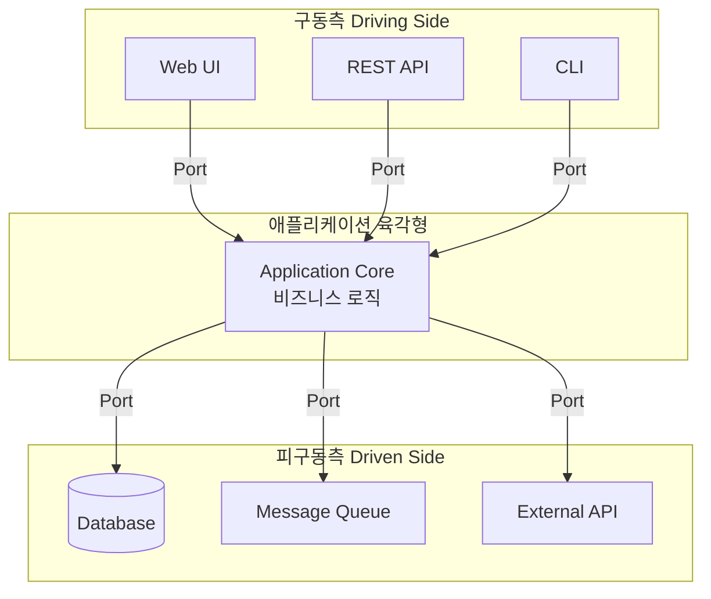
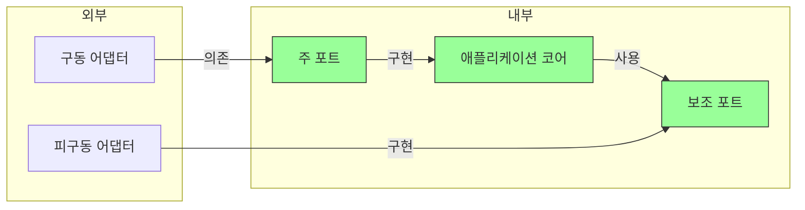
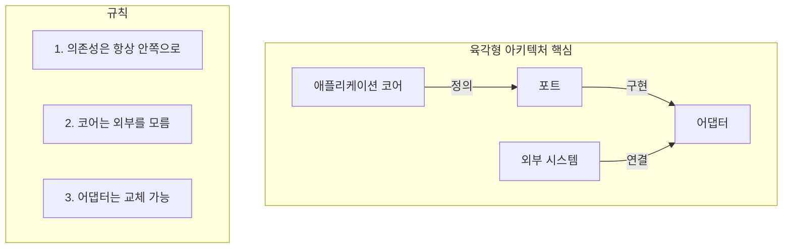

2005년, 알리스테어 콕번(Alistair Cockburn)은 "Hexagonal Architecture" 또는 "Ports and Adapters" 패턴을 제안했다. 이 아키텍처는 전통적인 계층형 아키텍처의 근본적인 문제를 해결하기 위해 등장했으며, Clean Architecture에 직접적인 영향을 미친 중요한 선행 패턴이다.

## 육각형 아키텍처의 탄생 배경

### 콕번의 문제 인식

알리스테어 콕번은 기존 소프트웨어 개발에서 반복되는 문제를 발견했다:

1. **비즈니스 로직이 UI 코드에 스며듦**: 프레젠테이션 레이어 변경 시 비즈니스 로직도 수정 필요
2. **비즈니스 로직이 데이터베이스 코드에 스며듦**: DB 변경 시 비즈니스 로직도 수정 필요
3. **테스트의 어려움**: 실제 DB나 UI 없이 비즈니스 로직 테스트 불가

> "애플리케이션이 사용자, 프로그램, 자동화된 테스트, 또는 배치 스크립트에 의해 동등하게 구동될 수 있도록 하고, 최종적인 실행 장치와 데이터베이스로부터 분리되어 개발되고 테스트될 수 있도록 하라."
> — Alistair Cockburn

### 왜 "육각형"인가?

사실 육각형이라는 모양 자체에 특별한 의미는 없다. 콕번은 기존의 "위-아래" 또는 "좌-우" 계층 다이어그램에서 벗어나고 싶었다. 육각형은 필요한 만큼의 포트와 어댑터를 표현하기에 충분한 변을 가진 도형일 뿐이다.



## 핵심 개념

### 1. 애플리케이션 코어 (Application Core)

육각형의 중심에는 **애플리케이션 코어**가 있다. 이곳에는 오직 비즈니스 로직만 존재한다.

- 어떤 UI 기술이 사용되는지 모름 (Web? Mobile? CLI?)
- 어떤 데이터베이스가 사용되는지 모름 (MySQL? MongoDB? File?)
- 어떤 외부 서비스가 연결되는지 모름 (Email? SMS? Push?)

```
// 순수한 애플리케이션 코어 - 외부 의존성 없음
public class OrderService {
    private final OrderRepository orderRepository;  // 인터페이스
    private final PaymentProcessor paymentProcessor;  // 인터페이스
    
    public Order placeOrder(OrderRequest request) {
        // 순수한 비즈니스 로직만 존재
        Order order = new Order(request.getItems());
        
        if (!order.isValid()) {
            throw new InvalidOrderException();
        }
        
        paymentProcessor.process(order.getTotal());
        orderRepository.save(order);
        
        return order;
    }
}
```

### 2. 포트 (Ports)

**포트**는 애플리케이션 코어와 외부 세계 사이의 인터페이스다. 두 종류의 포트가 있다:

#### 주 포트 (Primary Ports / Driving Ports)

외부에서 애플리케이션으로 들어오는 진입점. 애플리케이션이 **제공하는** 기능을 정의한다.

```java
// 주 포트 - 애플리케이션이 제공하는 기능
public interface OrderUseCase {
    Order placeOrder(OrderRequest request);
    Order getOrder(OrderId id);
    void cancelOrder(OrderId id);
}
```

#### 보조 포트 (Secondary Ports / Driven Ports)

애플리케이션이 외부 서비스를 사용하기 위한 인터페이스. 애플리케이션이 **필요로 하는** 기능을 정의한다.

```java
// 보조 포트 - 애플리케이션이 필요로 하는 기능
public interface OrderRepository {
    void save(Order order);
    Order findById(OrderId id);
    List<Order> findByCustomer(CustomerId customerId);
}

public interface PaymentProcessor {
    PaymentResult process(Money amount);
}
```

### 3. 어댑터 (Adapters)

**어댑터**는 포트의 구체적인 구현체다. 외부 기술과 포트 인터페이스 사이를 연결한다.

#### 구동 어댑터 (Driving Adapters / Primary Adapters)

외부 요청을 받아 주 포트를 호출한다.

```java
// REST 어댑터 - HTTP 요청을 주 포트로 변환
@RestController
public class OrderRestAdapter {
    private final OrderUseCase orderUseCase;  // 주 포트에 의존
    
    @PostMapping("/orders")
    public OrderResponse createOrder(@RequestBody OrderRequest request) {
        Order order = orderUseCase.placeOrder(request);
        return OrderResponse.from(order);
    }
}

// CLI 어댑터 - 커맨드라인 입력을 주 포트로 변환
public class OrderCliAdapter {
    private final OrderUseCase orderUseCase;
    
    public void execute(String[] args) {
        OrderRequest request = parseArgs(args);
        orderUseCase.placeOrder(request);
    }
}
```

#### 피구동 어댑터 (Driven Adapters / Secondary Adapters)

보조 포트를 구현하여 실제 외부 서비스와 연결한다.

```java
// JPA 어댑터 - 보조 포트 구현
@Repository
public class JpaOrderRepository implements OrderRepository {
    private final JpaOrderEntityRepository jpaRepository;
    
    @Override
    public void save(Order order) {
        OrderEntity entity = OrderEntity.from(order);
        jpaRepository.save(entity);
    }
    
    @Override
    public Order findById(OrderId id) {
        return jpaRepository.findById(id.getValue())
            .map(OrderEntity::toDomain)
            .orElseThrow(() -> new OrderNotFoundException(id));
    }
}

// Stripe 결제 어댑터 - 보조 포트 구현
public class StripePaymentAdapter implements PaymentProcessor {
    private final StripeClient stripeClient;
    
    @Override
    public PaymentResult process(Money amount) {
        ChargeRequest request = new ChargeRequest(amount.getValue());
        ChargeResponse response = stripeClient.charge(request);
        return new PaymentResult(response.isSuccess());
    }
}
```

## 의존성의 방향

육각형 아키텍처에서 가장 중요한 원칙은 **의존성의 방향**이다.



**핵심 규칙**: 
- 모든 의존성은 **바깥에서 안으로** 향한다
- 애플리케이션 코어는 어댑터를 모른다
- 어댑터는 포트에 의존한다

### 전통적 계층형과의 비교

| 항목 | 계층형 아키텍처 | 육각형 아키텍처 |
|------|----------------|----------------|
| 의존성 방향 | 위 → 아래 (단방향) | 바깥 → 안 (방사형) |
| 중심 요소 | 데이터베이스 | 비즈니스 로직 |
| DB 계층 | 비즈니스가 DB에 의존 | DB가 비즈니스에 의존 |
| 테스트 | DB 필요 | Mock으로 대체 가능 |

## 테스트 용이성

육각형 아키텍처의 가장 큰 장점 중 하나는 **테스트 용이성**이다.

### 애플리케이션 코어 테스트

```java
// 순수한 비즈니스 로직 테스트 - 외부 의존성 없음
@Test
void shouldPlaceOrder() {
    // 보조 포트의 Mock 구현
    OrderRepository mockRepository = new InMemoryOrderRepository();
    PaymentProcessor mockProcessor = new AlwaysSuccessPaymentProcessor();
    
    // 애플리케이션 코어 테스트
    OrderService service = new OrderService(mockRepository, mockProcessor);
    
    OrderRequest request = new OrderRequest(/* ... */);
    Order order = service.placeOrder(request);
    
    assertThat(order.getStatus()).isEqualTo(OrderStatus.PLACED);
}
```

### 테스트 어댑터

테스트를 위한 특별한 어댑터를 쉽게 만들 수 있다:

```java
// 테스트용 인메모리 리포지토리
public class InMemoryOrderRepository implements OrderRepository {
    private final Map<OrderId, Order> store = new HashMap<>();
    
    @Override
    public void save(Order order) {
        store.put(order.getId(), order);
    }
    
    @Override
    public Order findById(OrderId id) {
        return store.get(id);
    }
}

// 테스트용 결제 프로세서
public class AlwaysSuccessPaymentProcessor implements PaymentProcessor {
    @Override
    public PaymentResult process(Money amount) {
        return PaymentResult.success();
    }
}
```

## 실제 구조 예시

전형적인 육각형 아키텍처의 패키지 구조:

```
src/
├── application/          # 애플리케이션 코어
│   ├── domain/           # 도메인 모델
│   │   ├── Order.java
│   │   └── OrderStatus.java
│   ├── port/
│   │   ├── in/           # 주 포트 (Driving Ports)
│   │   │   └── OrderUseCase.java
│   │   └── out/          # 보조 포트 (Driven Ports)
│   │       ├── OrderRepository.java
│   │       └── PaymentProcessor.java
│   └── service/          # 유스케이스 구현
│       └── OrderService.java
│
└── adapter/              # 어댑터
    ├── in/               # 구동 어댑터
    │   ├── web/
    │   │   └── OrderRestAdapter.java
    │   └── cli/
    │       └── OrderCliAdapter.java
    └── out/              # 피구동 어댑터
        ├── persistence/
        │   └── JpaOrderRepository.java
        └── payment/
            └── StripePaymentAdapter.java
```

## 육각형 아키텍처의 장점

### 1. 기술 독립성

- **UI 독립**: REST, GraphQL, gRPC, CLI 등 다양한 인터페이스 지원
- **DB 독립**: JPA, MongoDB, Redis 등 저장소 교체 용이
- **외부 서비스 독립**: 결제, 메일, SMS 등 서비스 교체 용이

### 2. 테스트 용이성

- 애플리케이션 코어를 외부 의존성 없이 테스트
- Mock/Stub으로 쉽게 대체 가능
- 빠른 단위 테스트 실행

### 3. 점진적 마이그레이션

- 한 번에 하나의 어댑터만 교체 가능
- 기존 시스템의 점진적 현대화 용이

### 4. 도메인 중심 설계

- 비즈니스 로직이 기술적 결정으로부터 보호됨
- 도메인 모델의 순수성 유지

## 육각형 아키텍처의 한계와 주의점

### 1. 복잡성 증가

- 포트와 어댑터 인터페이스로 인한 코드량 증가
- 작은 프로젝트에는 과도할 수 있음

### 2. 매핑 비용

```java
// 어댑터와 코어 사이의 데이터 변환이 필요
public Order findById(OrderId id) {
    OrderEntity entity = jpaRepository.findById(id.getValue());
    return entity.toDomain();  // 매핑 필요
}
```

### 3. 학습 곡선

- 새로운 팀원이 구조를 이해하는 데 시간 필요
- 포트/어댑터 개념에 대한 충분한 이해 필요

## Clean Architecture와의 관계

육각형 아키텍처는 Clean Architecture의 직접적인 선조다. 두 아키텍처의 공통점:

- 비즈니스 로직을 중심에 배치
- 외부 요소에 대한 의존성 역전
- 인터페이스를 통한 추상화
- 테스트 용이성 강조

Clean Architecture는 육각형 아키텍처의 아이디어를 더욱 발전시켜, 더 세밀한 계층 구분과 명확한 의존성 규칙을 제시한다.

## 핵심 요약



| 구성 요소 | 역할 | 예시 |
|----------|------|------|
| 애플리케이션 코어 | 순수한 비즈니스 로직 | OrderService, Order |
| 주 포트 | 코어가 제공하는 기능 | OrderUseCase |
| 보조 포트 | 코어가 필요로 하는 기능 | OrderRepository |
| 구동 어댑터 | 외부 → 코어 연결 | RestController |
| 피구동 어댑터 | 코어 → 외부 연결 | JpaRepository |

## 다음 장에서는

다음 장에서는 제프리 팔레르모의 **양파 아키텍처(Onion Architecture)**를 살펴본다. 양파 아키텍처는 육각형 아키텍처의 아이디어를 계승하면서, 더 명확한 계층 구조를 제시한다.
