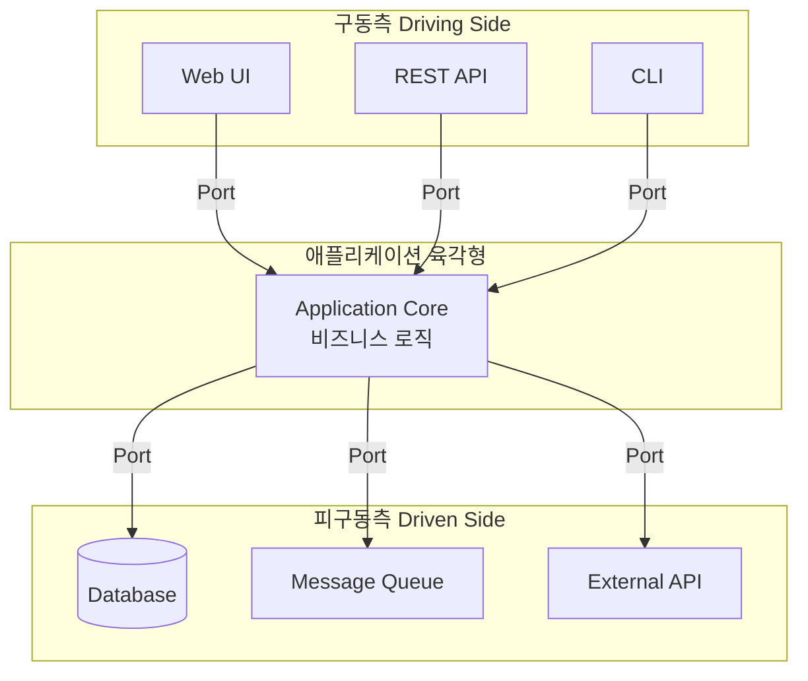
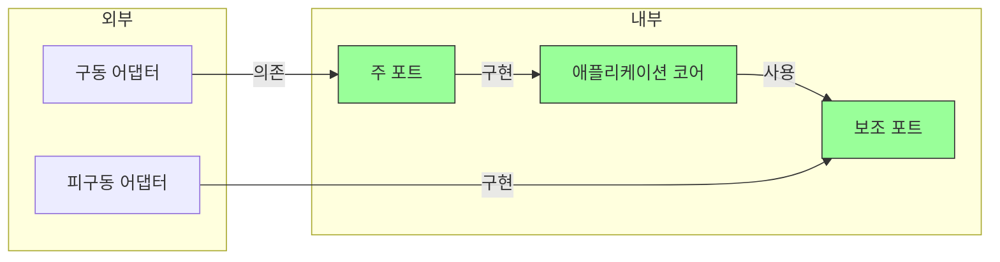
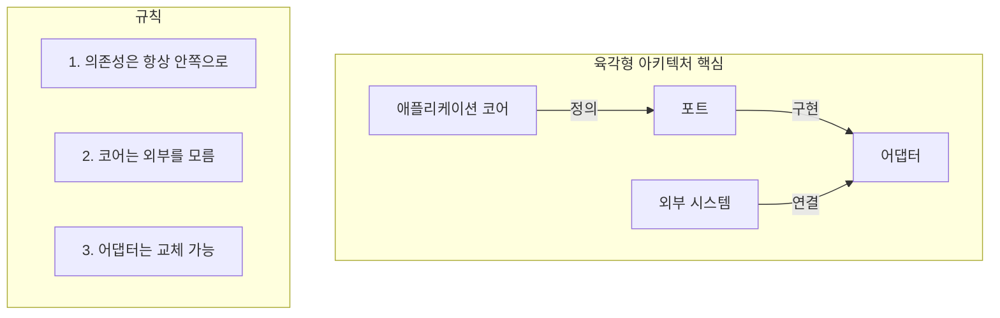

2005년, 알리스테어 콕번(Alistair Cockburn)은 "Hexagonal Architecture" 또는 "Ports and Adapters" 패턴을 제안했다. 이 아키텍처는 전통적인 계층형 아키텍처의 근본적인 문제를 해결하기 위해 등장했으며, Clean Architecture에 직접적인 영향을 미친 중요한 선행 패턴이다.

## 육각형 아키텍처의 탄생 배경

### 콕번의 문제 인식

알리스테어 콕번은 기존 소프트웨어 개발에서 반복되는 문제를 발견했다:

1. **비즈니스 로직이 UI 코드에 스며듦**: 프레젠테이션 레이어 변경 시 비즈니스 로직도 수정 필요
2. **비즈니스 로직이 데이터베이스 코드에 스며듦**: DB 변경 시 비즈니스 로직도 수정 필요
3. **테스트의 어려움**: 실제 DB나 UI 없이 비즈니스 로직 테스트 불가

> "애플리케이션이 사용자, 프로그램, 자동화된 테스트, 또는 배치 스크립트에 의해 동등하게 구동될 수 있도록 하고, 최종적인 실행 장치와 데이터베이스로부터 분리되어 개발되고 테스트될 수 있도록 하라."
> — Alistair Cockburn, "Hexagonal Architecture" (2005), [alistair.cockburn.us/hexagonal-architecture](https://alistair.cockburn.us/hexagonal-architecture/)

### 왜 "육각형"인가?

사실 육각형이라는 모양 자체에 특별한 의미는 없다. 콕번은 기존의 "위-아래" 또는 "좌-우" 계층 다이어그램에서 벗어나고 싶었다. 육각형은 필요한 만큼의 포트와 어댑터를 표현하기에 충분한 변을 가진 도형일 뿐이다.


```mermaid
flowchart TB
    subgraph Hexagon [애플리케이션 육각형]
        direction TB
        Core[Application Core</br>비즈니스 로직]
    end
    
    subgraph Driving [구동측 Driving Side]
        UI[Web UI]
        REST[REST API]
        CLI[CLI]
    end
    
    subgraph Driven [피구동측 Driven Side]
        DB[(Database)]
        MQ[Message Queue]
        Ext[External API]
    end
    
    UI -->|Port| Core
    REST -->|Port| Core
    CLI -->|Port| Core
    Core -->|Port| DB
    Core -->|Port| MQ
    Core -->|Port| Ext
```

## 핵심 개념

### 1. 애플리케이션 코어 (Application Core)

육각형의 중심에는 **애플리케이션 코어**가 있다. 이곳에는 오직 비즈니스 로직만 존재한다.

- 어떤 UI 기술이 사용되는지 모름 (Web? Mobile? CLI?)
- 어떤 데이터베이스가 사용되는지 모름 (MySQL? MongoDB? File?)
- 어떤 외부 서비스가 연결되는지 모름 (Email? SMS? Push?)

```java
import java.util.List;

class OrderItem { OrderItem(String sku, int qty) {} }
class Money { static final Money ZERO = new Money(); }
enum OrderStatus { DRAFT, PLACED }
class OrderId {}
class Order {
    private OrderStatus status = OrderStatus.DRAFT;
    Order(List<OrderItem> items) {}
    boolean isValid() { return true; }
    Money getTotal() { return Money.ZERO; }
    OrderId getId() { return new OrderId(); }
    OrderStatus getStatus() { return status; }
}
class OrderRequest {
    private final List<OrderItem> items;
    OrderRequest(List<OrderItem> items) { this.items = items; }
    List<OrderItem> getItems() { return items; }
}
class InvalidOrderException extends RuntimeException {}
interface OrderRepository { void save(Order order); Order findById(OrderId id); }
interface PaymentProcessor { void process(Money amount); }

// 순수한 애플리케이션 코어 - 외부 의존성 없음
public class OrderService {
    private final OrderRepository orderRepository;  // 인터페이스
    private final PaymentProcessor paymentProcessor;  // 인터페이스

    public OrderService(OrderRepository orderRepository, PaymentProcessor paymentProcessor) {
        this.orderRepository = orderRepository;
        this.paymentProcessor = paymentProcessor;
    }

    public Order placeOrder(OrderRequest request) {
        // 순수한 비즈니스 로직만 존재
        Order order = new Order(request.getItems());

        if (!order.isValid()) {
            throw new InvalidOrderException();
        }

        paymentProcessor.process(order.getTotal());
        orderRepository.save(order);

        return order;
    }
}
```

### 2. 포트 (Ports)

**포트**는 애플리케이션 코어와 외부 세계 사이의 인터페이스다. 두 종류의 포트가 있다:

#### 주 포트 (Primary Ports / Driving Ports)

외부에서 애플리케이션으로 들어오는 진입점. 애플리케이션이 **제공하는** 기능을 정의한다.

```java
import java.util.List;

class OrderItem {}
class OrderId {}
class Order {}
class OrderRequest { OrderRequest(List<OrderItem> items) {} }

// 주 포트 - 애플리케이션이 제공하는 기능
public interface OrderUseCase {
    Order placeOrder(OrderRequest request);
    Order getOrder(OrderId id);
    void cancelOrder(OrderId id);
}
```

#### 보조 포트 (Secondary Ports / Driven Ports)

애플리케이션이 외부 서비스를 사용하기 위한 인터페이스. 애플리케이션이 **필요로 하는** 기능을 정의한다.

```java
import java.util.List;

class Order {}
class OrderId {}
class CustomerId {}

// 보조 포트 - 애플리케이션이 필요로 하는 기능
public interface OrderRepository {
    void save(Order order);
    Order findById(OrderId id);
    List<Order> findByCustomer(CustomerId customerId);
}
```

`PaymentProcessor`도 같은 원칙으로 정의한다 — 코어는 결제를 "요청"할 뿐, 실제로 Stripe를 쓰는지 PayPal을 쓰는지 알 필요가 없다.

```java
class Money {}
class PaymentResult { static PaymentResult success() { return new PaymentResult(); } }

public interface PaymentProcessor {
    PaymentResult process(Money amount);
}
```

### 3. 어댑터 (Adapters)

**어댑터**는 포트의 구체적인 구현체다. 외부 기술과 포트 인터페이스 사이를 연결한다.

#### 구동 어댑터 (Driving Adapters / Primary Adapters)

외부 요청을 받아 주 포트를 호출한다.

```java
import org.springframework.web.bind.annotation.*;

class Order {}
class OrderId {}
class OrderRequest {}
class OrderResponse { static OrderResponse from(Order order) { return new OrderResponse(); } }
interface OrderUseCase {
    Order placeOrder(OrderRequest request);
    Order getOrder(OrderId id);
    void cancelOrder(OrderId id);
}

// REST 어댑터 - HTTP 요청을 주 포트로 변환
@RestController
public class OrderRestAdapter {
    private final OrderUseCase orderUseCase;  // 주 포트에 의존

    public OrderRestAdapter(OrderUseCase orderUseCase) {
        this.orderUseCase = orderUseCase;
    }

    @PostMapping("/orders")
    public OrderResponse createOrder(@RequestBody OrderRequest request) {
        Order order = orderUseCase.placeOrder(request);
        return OrderResponse.from(order);
    }
}
```

같은 `OrderUseCase`를 CLI 어댑터가 호출하면 HTTP 대신 커맨드라인 인자를 입력으로 받는다는 점만 다르다 — 유스케이스 로직은 단 한 줄도 바뀌지 않는다.

```java
class Order {}
class OrderId {}
class OrderRequest {}
interface OrderUseCase {
    Order placeOrder(OrderRequest request);
    Order getOrder(OrderId id);
    void cancelOrder(OrderId id);
}

// CLI 어댑터 - 커맨드라인 입력을 주 포트로 변환
public class OrderCliAdapter {
    private final OrderUseCase orderUseCase;

    public OrderCliAdapter(OrderUseCase orderUseCase) {
        this.orderUseCase = orderUseCase;
    }

    public void execute(String[] args) {
        OrderRequest request = parseArgs(args);
        orderUseCase.placeOrder(request);
    }

    private OrderRequest parseArgs(String[] args) { return new OrderRequest(); }
}
```

#### 피구동 어댑터 (Driven Adapters / Secondary Adapters)

보조 포트를 구현하여 실제 외부 서비스와 연결한다.

```java
import org.springframework.stereotype.Repository;
import org.springframework.data.jpa.repository.JpaRepository;
import java.util.List;

class Order {}
class OrderId { Long getValue() { return 1L; } }
class CustomerId {}
class OrderEntity {
    static OrderEntity from(Order order) { return new OrderEntity(); }
    Order toDomain() { return new Order(); }
}
class OrderNotFoundException extends RuntimeException {
    OrderNotFoundException(OrderId id) {}
}
interface OrderRepository {
    void save(Order order);
    Order findById(OrderId id);
    List<Order> findByCustomer(CustomerId customerId);
}
interface JpaOrderEntityRepository extends JpaRepository<OrderEntity, Long> {}

// JPA 어댑터 - 보조 포트 구현
@Repository
public class JpaOrderRepository implements OrderRepository {
    private final JpaOrderEntityRepository jpaRepository;

    public JpaOrderRepository(JpaOrderEntityRepository jpaRepository) {
        this.jpaRepository = jpaRepository;
    }

    @Override
    public void save(Order order) {
        OrderEntity entity = OrderEntity.from(order);
        jpaRepository.save(entity);
    }

    @Override
    public Order findById(OrderId id) {
        return jpaRepository.findById(id.getValue())
            .map(OrderEntity::toDomain)
            .orElseThrow(() -> new OrderNotFoundException(id));
    }

    @Override
    public List<Order> findByCustomer(CustomerId customerId) { return List.of(); }
}
```

결제 어댑터도 같은 패턴을 따른다 — `PaymentProcessor` 포트를 구현하되, Stripe SDK와의 통신 세부사항은 이 어댑터 안에만 존재한다.

```java
class Money { double getValue() { return 0; } }
class PaymentResult { PaymentResult(boolean success) {} }
interface PaymentProcessor { PaymentResult process(Money amount); }
class ChargeRequest { ChargeRequest(double amount) {} }
class ChargeResponse { boolean isSuccess() { return true; } }
class StripeClient { ChargeResponse charge(ChargeRequest request) { return new ChargeResponse(); } }

// Stripe 결제 어댑터 - 보조 포트 구현
public class StripePaymentAdapter implements PaymentProcessor {
    private final StripeClient stripeClient;

    public StripePaymentAdapter(StripeClient stripeClient) {
        this.stripeClient = stripeClient;
    }

    @Override
    public PaymentResult process(Money amount) {
        ChargeRequest request = new ChargeRequest(amount.getValue());
        ChargeResponse response = stripeClient.charge(request);
        return new PaymentResult(response.isSuccess());
    }
}
```

## 의존성의 방향

육각형 아키텍처에서 가장 중요한 원칙은 **의존성의 방향**이다.


```mermaid
flowchart LR
    subgraph Outside [외부]
        DA1[구동 어댑터]
        DA2[피구동 어댑터]
    end
    
    subgraph Inside [내부]
        PP[주 포트]
        Core[애플리케이션 코어]
        SP[보조 포트]
    end
    
    DA1 -->|의존| PP
    PP -->|구현| Core
    Core -->|사용| SP
    DA2 -->|구현| SP
    
    style Core fill:#9f9,stroke:#333
    style PP fill:#9f9,stroke:#333
    style SP fill:#9f9,stroke:#333
```

**핵심 규칙**: 
- 모든 의존성은 **바깥에서 안으로** 향한다
- 애플리케이션 코어는 어댑터를 모른다
- 어댑터는 포트에 의존한다

### 전통적 계층형과의 비교

02장에서 살펴본 계층형 아키텍처와 나란히 놓으면 의존성 방향의 차이가 뚜렷하게 드러난다.

| 항목 | 계층형 아키텍처 | 육각형 아키텍처 |
|------|----------------|----------------|
| 의존성 방향 | 위 → 아래 (단방향) | 바깥 → 안 (방사형) |
| 중심 요소 | 데이터베이스 | 비즈니스 로직 |
| DB 계층 | 비즈니스가 DB에 의존 | DB가 비즈니스에 의존 |
| 테스트 | DB 필요 | Mock으로 대체 가능 |

## 테스트 용이성

육각형 아키텍처의 가장 큰 장점 중 하나는 **테스트 용이성**이다.

### 애플리케이션 코어 테스트

```java
import org.junit.jupiter.api.Test;
import static org.assertj.core.api.Assertions.assertThat;
import java.util.List;
import java.util.HashMap;
import java.util.Map;

class OrderItem { OrderItem(String sku, int qty) {} }
class Money { static final Money ZERO = new Money(); }
enum OrderStatus { DRAFT, PLACED }
class OrderId {}
class Order {
    private OrderStatus status = OrderStatus.PLACED;
    Order(List<OrderItem> items) {}
    boolean isValid() { return true; }
    Money getTotal() { return Money.ZERO; }
    OrderId getId() { return new OrderId(); }
    OrderStatus getStatus() { return status; }
}
class OrderRequest {
    private final List<OrderItem> items;
    OrderRequest(List<OrderItem> items) { this.items = items; }
    List<OrderItem> getItems() { return items; }
}
interface OrderRepository { void save(Order order); Order findById(OrderId id); }
interface PaymentProcessor { void process(Money amount); }
class InMemoryOrderRepository implements OrderRepository {
    private final Map<OrderId, Order> store = new HashMap<>();
    public void save(Order order) { store.put(order.getId(), order); }
    public Order findById(OrderId id) { return store.get(id); }
}
class AlwaysSuccessPaymentProcessor implements PaymentProcessor {
    public void process(Money amount) {}
}
class OrderService {
    private final OrderRepository orderRepository;
    private final PaymentProcessor paymentProcessor;
    OrderService(OrderRepository orderRepository, PaymentProcessor paymentProcessor) {
        this.orderRepository = orderRepository;
        this.paymentProcessor = paymentProcessor;
    }
    Order placeOrder(OrderRequest request) {
        Order order = new Order(request.getItems());
        paymentProcessor.process(order.getTotal());
        orderRepository.save(order);
        return order;
    }
}

public class OrderServiceTest {
    // 순수한 비즈니스 로직 테스트 - 외부 의존성 없음
    @Test
    void shouldPlaceOrder() {
        // 보조 포트의 Mock 구현
        OrderRepository mockRepository = new InMemoryOrderRepository();
        PaymentProcessor mockProcessor = new AlwaysSuccessPaymentProcessor();

        // 애플리케이션 코어 테스트
        OrderService service = new OrderService(mockRepository, mockProcessor);

        OrderRequest request = new OrderRequest(List.of(new OrderItem("SKU-1", 2)));
        Order order = service.placeOrder(request);

        assertThat(order.getStatus()).isEqualTo(OrderStatus.PLACED);
    }
}
```

### 테스트 어댑터

테스트를 위한 특별한 어댑터를 쉽게 만들 수 있다:

```java
import java.util.HashMap;
import java.util.Map;

class OrderId {}
class Order { OrderId getId() { return new OrderId(); } }
interface OrderRepository { void save(Order order); Order findById(OrderId id); }

// 테스트용 인메모리 리포지토리
public class InMemoryOrderRepository implements OrderRepository {
    private final Map<OrderId, Order> store = new HashMap<>();

    @Override
    public void save(Order order) {
        store.put(order.getId(), order);
    }

    @Override
    public Order findById(OrderId id) {
        return store.get(id);
    }
}
```

결제 프로세서도 마찬가지로 항상 성공만 반환하는 가짜 구현을 만들어, 테스트가 실제 결제 게이트웨이의 네트워크 상태에 좌우되지 않게 한다.

```java
class Money {}
class PaymentResult { static PaymentResult success() { return new PaymentResult(); } }
interface PaymentProcessor { PaymentResult process(Money amount); }

// 테스트용 결제 프로세서
public class AlwaysSuccessPaymentProcessor implements PaymentProcessor {
    @Override
    public PaymentResult process(Money amount) {
        return PaymentResult.success();
    }
}
```

## 실제 구조 예시

전형적인 육각형 아키텍처의 패키지 구조:

```text
src/
├── application/          # 애플리케이션 코어
│   ├── domain/           # 도메인 모델
│   │   ├── Order.java
│   │   └── OrderStatus.java
│   ├── port/
│   │   ├── in/           # 주 포트 (Driving Ports)
│   │   │   └── OrderUseCase.java
│   │   └── out/          # 보조 포트 (Driven Ports)
│   │       ├── OrderRepository.java
│   │       └── PaymentProcessor.java
│   └── service/          # 유스케이스 구현
│       └── OrderService.java
│
└── adapter/              # 어댑터
    ├── in/               # 구동 어댑터
    │   ├── web/
    │   │   └── OrderRestAdapter.java
    │   └── cli/
    │       └── OrderCliAdapter.java
    └── out/              # 피구동 어댑터
        ├── persistence/
        │   └── JpaOrderRepository.java
        └── payment/
            └── StripePaymentAdapter.java
```

## 육각형 아키텍처의 장점

포트와 어댑터로 경계를 나누면 아래 네 가지 이점이 동시에 따라온다. 공통점은 모두 "코어가 외부를 모른다"는 한 가지 규칙에서 파생된다는 것이다.

### 1. 기술 독립성

포트가 코어와 외부 기술 사이의 유일한 접점이므로, 그 접점 뒤의 기술은 자유롭게 바뀔 수 있다.

- **UI 독립**: REST, GraphQL, gRPC, CLI 등 다양한 인터페이스 지원
- **DB 독립**: JPA, MongoDB, Redis 등 저장소 교체 용이
- **외부 서비스 독립**: 결제, 메일, SMS 등 서비스 교체 용이

### 2. 테스트 용이성

코어가 포트(인터페이스)에만 의존하므로, 테스트에서는 그 인터페이스를 구현한 가벼운 대역으로 실제 어댑터를 대체할 수 있다.

- 애플리케이션 코어를 외부 의존성 없이 테스트
- Mock/Stub으로 쉽게 대체 가능
- 빠른 단위 테스트 실행

### 3. 점진적 마이그레이션

어댑터가 코어로부터 독립적이므로, 레거시 시스템을 한 번에 다시 쓰지 않고 어댑터 단위로 순차 교체할 수 있다.

- 한 번에 하나의 어댑터만 교체 가능
- 기존 시스템의 점진적 현대화 용이

### 4. 도메인 중심 설계

코어가 외부를 모르므로, 설계 논의의 중심이 자연스럽게 "어떤 프레임워크를 쓸까"가 아니라 "도메인 규칙이 무엇인가"로 옮겨간다.

- 비즈니스 로직이 기술적 결정으로부터 보호됨
- 도메인 모델의 순수성 유지

## 육각형 아키텍처의 한계와 주의점

다만 이 경계 분리는 공짜가 아니다. 아래 세 가지는 특히 소규모 프로젝트에서 이점보다 비용이 클 수 있는 지점이다.

### 1. 복잡성 증가

포트마다 인터페이스가 하나씩 늘어나고, 어댑터마다 구현 클래스가 하나씩 늘어난다.

- 포트와 어댑터 인터페이스로 인한 코드량 증가
- 작은 프로젝트에는 과도할 수 있음

### 2. 매핑 비용

어댑터와 코어 사이를 오갈 때마다 엔티티↔도메인 모델 변환이 필요하다. 계층이 늘어날수록 이 매핑 코드도 함께 늘어난다.

```java
import org.springframework.data.jpa.repository.JpaRepository;

class Order {}
class OrderId { Long getValue() { return 1L; } }
class OrderEntity { Order toDomain() { return new Order(); } }
interface JpaOrderEntityRepository extends JpaRepository<OrderEntity, Long> {}

public class OrderMappingExample {
    private final JpaOrderEntityRepository jpaRepository;

    public OrderMappingExample(JpaOrderEntityRepository jpaRepository) {
        this.jpaRepository = jpaRepository;
    }

    // 어댑터와 코어 사이의 데이터 변환이 필요
    public Order findById(OrderId id) {
        OrderEntity entity = jpaRepository.findById(id.getValue()).orElseThrow();
        return entity.toDomain();  // 매핑 필요
    }
}
```

### 3. 학습 곡선

"인터페이스는 코어 안에, 구현은 코어 밖에"라는 배치는 처음 접하는 개발자에게는 직관에 어긋나 보인다.

- 새로운 팀원이 구조를 이해하는 데 시간 필요
- 포트/어댑터 개념에 대한 충분한 이해 필요

### 도입 여부 판단

| 상황 | 권장 |
|------|------|
| 포트/어댑터 후보가 1~2개뿐이고 프로젝트 수명이 짧음 | 생략하고 단순한 계층 구조로 시작 |
| UI·DB·외부 서비스 중 하나 이상을 교체할 계획이 있음 | 그 경계에만 포트/어댑터 도입 |
| 여러 UI(웹·CLI·배치)가 같은 비즈니스 로직을 공유해야 함 | 전면 도입 |

## 흔한 오해

<strong>"포트는 곧 인터페이스 클래스다"</strong>라는 이해는 절반만 맞다. 포트는 코어와 외부 사이의 **계약**이라는 개념이고, 인터페이스는 그 계약을 코드로 표현하는 한 가지 수단일 뿐이다. 동적 타입 언어에서는 덕 타이핑만으로도 포트 역할을 할 수 있다. 또한 <strong>"육각형이니 반드시 여섯 개의 변(포트)이 있어야 한다"</strong>는 것도 오해다. 콕번 본인이 밝혔듯 육각형이라는 모양 자체는 임의적이며, 포트의 개수는 애플리케이션이 실제로 필요로 하는 진입점·의존성의 수에 따라 정해진다.

## Clean Architecture와의 관계

육각형 아키텍처는 Clean Architecture의 직접적인 선조다. 두 아키텍처의 공통점:

- 비즈니스 로직을 중심에 배치
- 외부 요소에 대한 의존성 역전
- 인터페이스를 통한 추상화
- 테스트 용이성 강조

Clean Architecture는 육각형 아키텍처의 아이디어를 더욱 발전시켜, 더 세밀한 계층 구분과 명확한 의존성 규칙을 제시한다.

## 핵심 요약


```mermaid
flowchart TB
    subgraph Summary [육각형 아키텍처 핵심]
        A[애플리케이션 코어] -->|정의| B[포트]
        B -->|구현| C[어댑터]
        D[외부 시스템] -->|연결| C
    end
    
    subgraph Rules [규칙]
        R1["1. 의존성은 항상 안쪽으로"]
        R2["2. 코어는 외부를 모름"]
        R3["3. 어댑터는 교체 가능"]
    end
```

| 구성 요소 | 역할 | 예시 |
|----------|------|------|
| 애플리케이션 코어 | 순수한 비즈니스 로직 | OrderService, Order |
| 주 포트 | 코어가 제공하는 기능 | OrderUseCase |
| 보조 포트 | 코어가 필요로 하는 기능 | OrderRepository |
| 구동 어댑터 | 외부 → 코어 연결 | RestController |
| 피구동 어댑터 | 코어 → 외부 연결 | JpaRepository |

## 학습 목표

이 장을 읽은 후 다음을 할 수 있어야 한다.

- 주 포트(Driving Port)와 보조 포트(Driven Port)의 역할 차이를 설명할 수 있다.
- 육각형 아키텍처와 계층형 아키텍처의 테스트 전략 차이를 비교할 수 있다.
- "포트=인터페이스 클래스"라는 오해가 왜 절반만 맞는지 설명할 수 있다.

## 참고 자료

- Cockburn, A. (2005). "Hexagonal Architecture". [alistair.cockburn.us/hexagonal-architecture](https://alistair.cockburn.us/hexagonal-architecture/)

## 다음 장에서는

다음 장에서는 제프리 팔레르모의 <strong>양파 아키텍처(Onion Architecture)</strong>를 살펴본다. 양파 아키텍처는 육각형 아키텍처의 아이디어를 계승하면서, 더 명확한 계층 구조를 제시한다.
