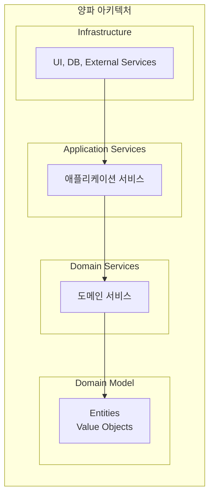
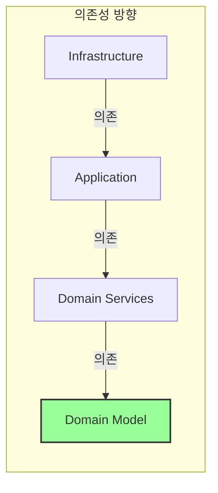
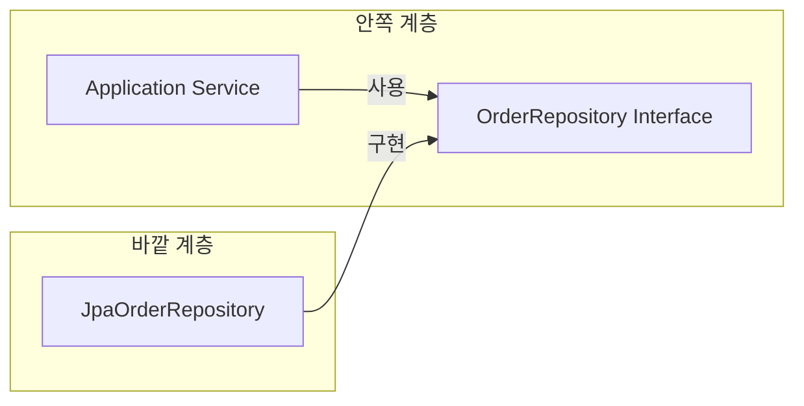
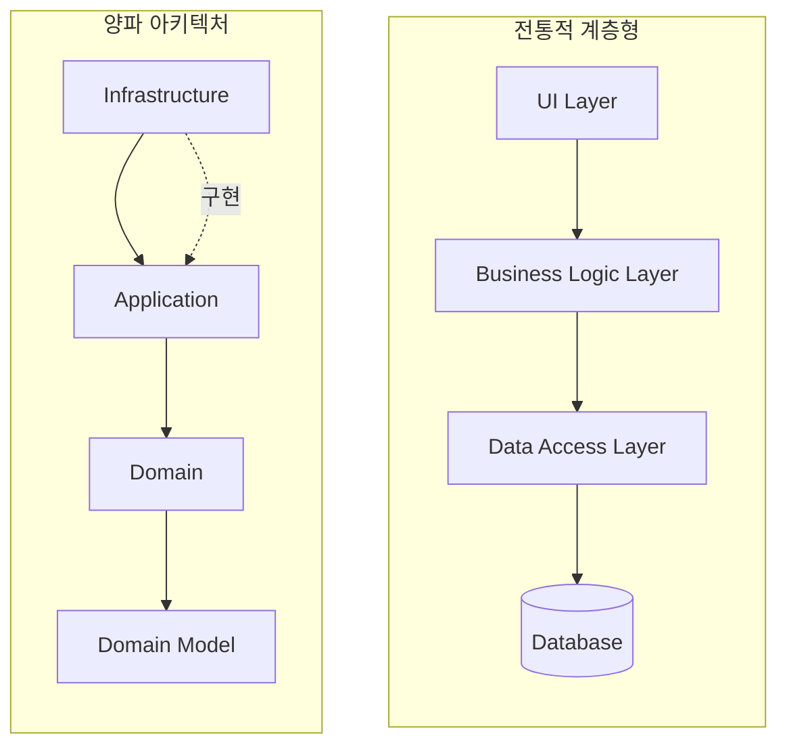
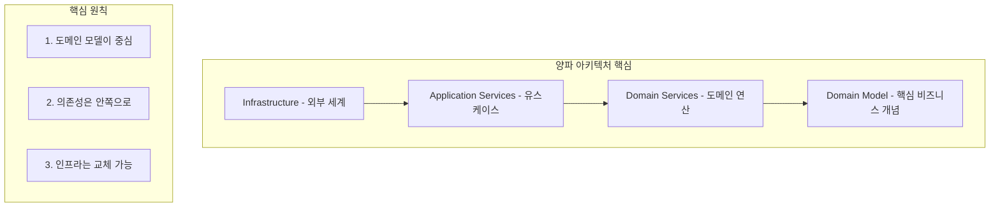

2008년, 제프리 팔레르모(Jeffrey Palermo)는 자신의 블로그에 "The Onion Architecture"라는 시리즈 글을 게시했다. 육각형 아키텍처의 아이디어를 계승하면서, 더 명확한 계층 구조와 의존성 규칙을 제시한 이 아키텍처는 Clean Architecture의 또 다른 중요한 선조가 되었다.

## 양파 아키텍처의 탄생 배경

### 팔레르모의 문제 인식

팔레르모는 전통적인 계층형 아키텍처에서 반복되는 문제를 지적했다:

> "전통적인 계층형 아키텍처에서, UI는 비즈니스 로직에 의존하고, 비즈니스 로직은 데이터 접근에 의존한다. 이는 비즈니스 로직을 데이터베이스와 강하게 결합시킨다."

그가 제안한 해결책은 **의존성의 방향을 뒤집는 것**이었다.

### 왜 "양파"인가?

양파는 여러 겹의 껍질로 이루어져 있다. 팔레르모는 이 비유를 사용하여, 소프트웨어를 동심원 형태의 계층으로 표현했다. 바깥 껍질은 쉽게 벗겨낼 수 있지만, 중심부는 단단하게 보호된다.



## 양파 아키텍처의 계층 구조

### 1. 도메인 모델 (Domain Model) - 가장 안쪽

도메인 모델은 양파의 핵심이다. 이 계층에는 비즈니스의 핵심 개념을 표현하는 요소들이 있다:

- **엔터티 (Entities)**: 고유한 식별자를 가진 도메인 객체
- **값 객체 (Value Objects)**: 식별자 없이 속성으로만 정의되는 객체
- **애그리게잇 (Aggregates)**: 연관된 객체들의 묶음

```java
// 도메인 모델 - 순수한 비즈니스 개념
public class Order {
    private final OrderId id;
    private final CustomerId customerId;
    private final List<OrderLine> lines;
    private OrderStatus status;
    private Money total;
    
    public void addItem(Product product, int quantity) {
        if (status != OrderStatus.DRAFT) {
            throw new OrderAlreadySubmittedException();
        }
        
        OrderLine line = new OrderLine(product.getId(), quantity, product.getPrice());
        lines.add(line);
        recalculateTotal();
    }
    
    public void submit() {
        if (lines.isEmpty()) {
            throw new EmptyOrderException();
        }
        status = OrderStatus.SUBMITTED;
    }
    
    private void recalculateTotal() {
        total = lines.stream()
            .map(OrderLine::getSubtotal)
            .reduce(Money.ZERO, Money::add);
    }
}

// 값 객체 - 불변, 식별자 없음
public final class Money {
    public static final Money ZERO = new Money(BigDecimal.ZERO);
    
    private final BigDecimal amount;
    
    public Money add(Money other) {
        return new Money(this.amount.add(other.amount));
    }
    
    @Override
    public boolean equals(Object obj) {
        if (obj instanceof Money) {
            return this.amount.equals(((Money) obj).amount);
        }
        return false;
    }
}
```

### 2. 도메인 서비스 (Domain Services)

도메인 서비스는 특정 엔터티에 속하지 않는 도메인 로직을 담는다. 여러 엔터티를 조율하거나, 도메인 개념을 표현하는 연산을 포함한다.

```java
// 도메인 서비스 - 엔터티에 속하지 않는 도메인 로직
public class PricingService {
    
    public Money calculateDiscount(Order order, Customer customer) {
        // 복잡한 할인 계산 로직
        if (customer.isVip()) {
            return order.getTotal().multiply(0.1);
        }
        
        if (order.getTotal().isGreaterThan(Money.of(100))) {
            return order.getTotal().multiply(0.05);
        }
        
        return Money.ZERO;
    }
}
```

### 3. 애플리케이션 서비스 (Application Services)

애플리케이션 서비스는 유스케이스를 구현한다. 이 계층은:

- 도메인 객체들을 조율한다
- 트랜잭션 경계를 정의한다
- 리포지토리를 통해 도메인 객체를 가져오고 저장한다
- 외부 서비스와의 통합을 조율한다

```java
// 애플리케이션 서비스 - 유스케이스 구현
public class OrderApplicationService {
    private final OrderRepository orderRepository;
    private final CustomerRepository customerRepository;
    private final PricingService pricingService;
    private final PaymentGateway paymentGateway;
    
    @Transactional
    public OrderId placeOrder(PlaceOrderCommand command) {
        // 1. 도메인 객체 로드
        Customer customer = customerRepository.findById(command.getCustomerId())
            .orElseThrow(() -> new CustomerNotFoundException(command.getCustomerId()));
        
        // 2. 도메인 객체 생성 및 비즈니스 로직 실행
        Order order = new Order(OrderId.generate(), customer.getId());
        
        for (OrderItemCommand item : command.getItems()) {
            order.addItem(item.getProductId(), item.getQuantity());
        }
        
        // 3. 도메인 서비스 사용
        Money discount = pricingService.calculateDiscount(order, customer);
        order.applyDiscount(discount);
        
        // 4. 주문 제출
        order.submit();
        
        // 5. 저장
        orderRepository.save(order);
        
        // 6. 결제 처리 (외부 서비스)
        paymentGateway.charge(order.getId(), order.getTotal());
        
        return order.getId();
    }
}
```

### 4. 인프라스트럭처 (Infrastructure) - 가장 바깥쪽

인프라스트럭처는 양파의 가장 바깥 껍질이다. 모든 외부 세계와의 연결이 이 계층에 위치한다:

- **UI**: Web Controllers, CLI, Desktop UI
- **데이터베이스**: JPA, JDBC, MongoDB
- **외부 서비스**: REST 클라이언트, 메시지 큐
- **프레임워크**: Spring, Django, Rails

```java
// 인프라스트럭처 - 리포지토리 구현
@Repository
public class JpaOrderRepository implements OrderRepository {
    
    private final OrderJpaRepository jpaRepository;
    
    @Override
    public void save(Order order) {
        OrderEntity entity = OrderMapper.toEntity(order);
        jpaRepository.save(entity);
    }
    
    @Override
    public Optional<Order> findById(OrderId id) {
        return jpaRepository.findById(id.getValue())
            .map(OrderMapper::toDomain);
    }
}

// 인프라스트럭처 - 결제 게이트웨이 구현
@Component
public class StripePaymentGateway implements PaymentGateway {
    
    private final StripeClient stripeClient;
    
    @Override
    public void charge(OrderId orderId, Money amount) {
        ChargeRequest request = ChargeRequest.builder()
            .orderId(orderId.getValue())
            .amount(amount.getValue())
            .currency("USD")
            .build();
            
        stripeClient.createCharge(request);
    }
}
```

## 의존성 규칙

양파 아키텍처의 핵심 규칙은 단순하다:

> **의존성은 항상 안쪽을 향한다.**



### 규칙의 의미

1. **인프라스트럭처**는 **애플리케이션**을 알고 의존한다
2. **애플리케이션**은 **도메인 서비스**를 알고 의존한다
3. **도메인 서비스**는 **도메인 모델**만 알고 의존한다
4. **도메인 모델**은 아무것도 의존하지 않는다

### 역방향 의존성은 어떻게?

애플리케이션 서비스가 데이터베이스에 접근해야 할 때, 어떻게 의존성을 안쪽으로 유지할 수 있을까?

답은 **인터페이스**에 있다:



- 인터페이스(`OrderRepository`)는 안쪽 계층에 정의
- 구현체(`JpaOrderRepository`)는 바깥 계층에 위치
- 결과적으로 바깥 계층이 안쪽 계층에 의존

## 전통적 계층형 아키텍처와의 비교



| 항목 | 전통적 계층형 | 양파 아키텍처 |
|------|--------------|--------------|
| 의존성 방향 | 위 → 아래 | 바깥 → 안 |
| 중심 요소 | 데이터베이스 | 도메인 모델 |
| DB 계층 위치 | 맨 아래 (핵심) | 맨 바깥 (교체 가능) |
| 비즈니스 로직 | DB에 의존 | 독립적 |
| 테스트 | DB 필요 | 격리 가능 |

## 테스트 전략

양파 아키텍처는 계층별로 다른 테스트 전략을 사용한다:

### 1. 도메인 모델 테스트

순수한 단위 테스트. 외부 의존성이 전혀 없다.

```java
@Test
void shouldAddItemToOrder() {
    Order order = new Order(OrderId.generate(), customerId);
    
    order.addItem(productId, 2);
    
    assertThat(order.getLines()).hasSize(1);
    assertThat(order.getTotal()).isEqualTo(Money.of(20));
}

@Test
void shouldNotAddItemToSubmittedOrder() {
    Order order = new Order(OrderId.generate(), customerId);
    order.addItem(productId, 1);
    order.submit();
    
    assertThrows(OrderAlreadySubmittedException.class, 
        () -> order.addItem(productId, 1));
}
```

### 2. 애플리케이션 서비스 테스트

도메인 객체는 실제로, 인프라스트럭처는 Mock으로.

```java
@Test
void shouldPlaceOrder() {
    // Given - Mock 인프라스트럭처
    OrderRepository mockRepository = mock(OrderRepository.class);
    PaymentGateway mockGateway = mock(PaymentGateway.class);
    
    OrderApplicationService service = new OrderApplicationService(
        mockRepository, mockGateway, new PricingService());
    
    PlaceOrderCommand command = new PlaceOrderCommand(customerId, items);
    
    // When
    OrderId orderId = service.placeOrder(command);
    
    // Then
    verify(mockRepository).save(any(Order.class));
    verify(mockGateway).charge(eq(orderId), any(Money.class));
}
```

### 3. 인프라스트럭처 테스트

실제 데이터베이스나 외부 서비스와의 통합 테스트.

```java
@DataJpaTest
class JpaOrderRepositoryTest {
    
    @Autowired
    private JpaOrderRepository repository;
    
    @Test
    void shouldSaveAndFindOrder() {
        Order order = createOrder();
        
        repository.save(order);
        Optional<Order> found = repository.findById(order.getId());
        
        assertThat(found).isPresent();
        assertThat(found.get().getTotal()).isEqualTo(order.getTotal());
    }
}
```

## 실제 패키지 구조

```
src/
├── domain/                    # 도메인 계층
│   ├── model/                 # 도메인 모델
│   │   ├── order/
│   │   │   ├── Order.java
│   │   │   ├── OrderId.java
│   │   │   ├── OrderLine.java
│   │   │   └── OrderStatus.java
│   │   └── customer/
│   │       ├── Customer.java
│   │       └── CustomerId.java
│   └── service/               # 도메인 서비스
│       └── PricingService.java
│
├── application/               # 애플리케이션 계층
│   ├── service/               # 애플리케이션 서비스
│   │   └── OrderApplicationService.java
│   ├── port/                  # 포트 (인터페이스)
│   │   ├── OrderRepository.java
│   │   └── PaymentGateway.java
│   └── command/               # 커맨드 객체
│       └── PlaceOrderCommand.java
│
└── infrastructure/            # 인프라스트럭처 계층
    ├── persistence/           # DB 관련
    │   ├── JpaOrderRepository.java
    │   └── entity/
    │       └── OrderEntity.java
    ├── payment/               # 결제 관련
    │   └── StripePaymentGateway.java
    └── web/                   # Web 관련
        └── OrderController.java
```

## 양파 아키텍처의 장점

### 1. 도메인 중심 설계

비즈니스 로직이 아키텍처의 중심에 위치하여, 기술적 결정에 영향받지 않는다.

### 2. 높은 테스트 용이성

도메인 모델과 애플리케이션 서비스를 격리하여 테스트할 수 있다.

### 3. 기술 독립성

데이터베이스, 프레임워크, UI를 쉽게 교체할 수 있다.

### 4. 명확한 의존성 규칙

"의존성은 안쪽으로"라는 단순한 규칙으로 아키텍처를 유지할 수 있다.

## 양파 아키텍처의 한계

### 1. 복잡성

작은 프로젝트에는 과도한 구조가 될 수 있다.

### 2. 학습 곡선

팀원들이 의존성 규칙과 계층 구조를 이해하는 데 시간이 필요하다.

### 3. 인터페이스 폭발

의존성 역전을 위해 많은 인터페이스가 필요할 수 있다.

## Clean Architecture와의 관계

양파 아키텍처와 Clean Architecture는 매우 유사하다. 주요 차이점:

| 항목 | 양파 아키텍처 | Clean Architecture |
|------|-------------|-------------------|
| 계층 수 | 4개 (명확히 정의) | 4개 (유연하게 적용) |
| 유스케이스 | Application Services | Use Cases (별도 강조) |
| 용어 | DDD 영향 | 더 일반적 용어 |
| 인터페이스 어댑터 | Infrastructure에 포함 | 별도 계층으로 분리 |

Clean Architecture는 양파 아키텍처를 더욱 정제하고 일반화한 것이라 볼 수 있다.

## 핵심 요약



## 다음 장에서는

다음 장에서는 드디어 **Clean Architecture의 탄생**을 다룬다. Robert C. Martin이 어떻게 육각형 아키텍처와 양파 아키텍처의 아이디어를 통합하여 Clean Architecture를 만들어냈는지 살펴본다.
