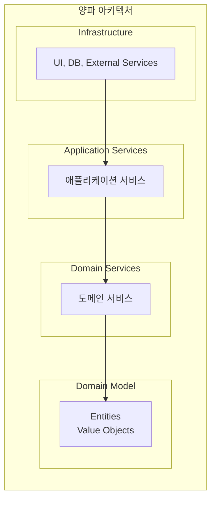
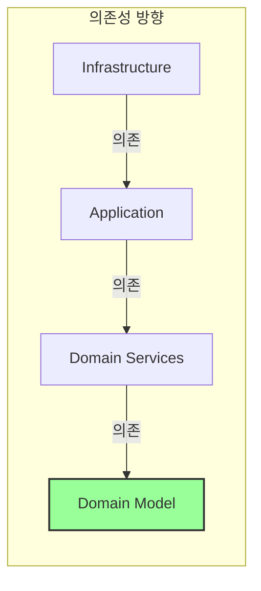
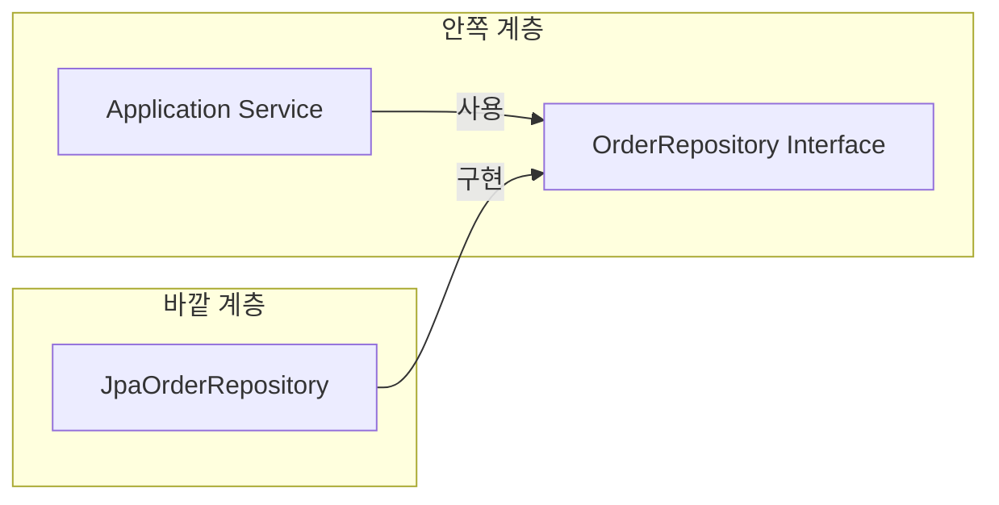
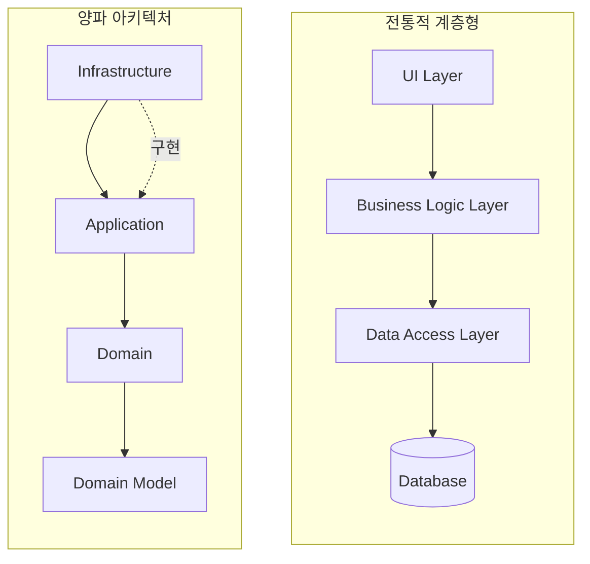
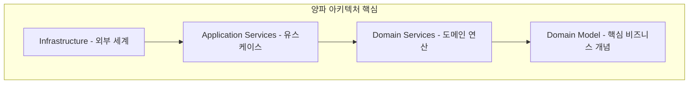

2008년, 제프리 팔레르모(Jeffrey Palermo)는 자신의 블로그에 "The Onion Architecture"라는 시리즈 글을 게시했다. 육각형 아키텍처의 아이디어를 계승하면서, 더 명확한 계층 구조와 의존성 규칙을 제시한 이 아키텍처는 Clean Architecture의 또 다른 중요한 선조가 되었다.

## 양파 아키텍처의 탄생 배경

### 팔레르모의 문제 인식

팔레르모는 전통적인 계층형 아키텍처에서 반복되는 문제를 지적했다:

팔레르모는 이를 이렇게 요약한다: 전통적인 계층형 아키텍처에서 UI는 비즈니스 로직에 결합되고, 비즈니스 로직은 다시 데이터 접근에 결합된다. 결과적으로 UI 없이는 비즈니스 로직이 동작하지 않고, 데이터 접근 없이는 비즈니스 로직도 동작하지 않는다(Palermo, *The Onion Architecture*, 2008, [jeffreypalermo.com/2008/07/the-onion-architecture-part-1](https://jeffreypalermo.com/2008/07/the-onion-architecture-part-1/)).

그가 제안한 해결책은 **의존성의 방향을 뒤집는 것**이었다.

### 왜 "양파"인가?

양파는 여러 겹의 껍질로 이루어져 있다. 팔레르모는 이 비유를 사용하여, 소프트웨어를 동심원 형태의 계층으로 표현했다. 바깥 껍질은 쉽게 벗겨낼 수 있지만, 중심부는 단단하게 보호된다.


```mermaid
flowchart TB
    subgraph Onion [양파 아키텍처]
        direction TB
        subgraph Core [Domain Model]
            E[Entities</br>Value Objects]
        end
        
        subgraph DS [Domain Services]
            D[도메인 서비스]
        end
        
        subgraph AS [Application Services]
            A[애플리케이션 서비스]
        end
        
        subgraph Infra [Infrastructure]
            I[UI, DB, External Services]
        end
    end
    
    I --> A
    A --> D
    D --> E
```

## 양파 아키텍처의 계층 구조

### 1. 도메인 모델 (Domain Model) - 가장 안쪽

도메인 모델은 양파의 핵심이다. 이 계층은 프레임워크·DB·외부 서비스를 전혀 참조하지 않는 순수 자바(또는 순수 언어) 코드로만 구성되며, 그래야만 나머지 계층이 무엇으로 바뀌든 도메인 규칙이 살아남는다는 양파 아키텍처의 전제가 성립한다. 이 계층에는 비즈니스의 핵심 개념을 표현하는 요소들이 있다:

- **엔터티 (Entities)**: 고유한 식별자를 가진 도메인 객체
- **값 객체 (Value Objects)**: 식별자 없이 속성으로만 정의되는 객체
- **애그리게잇 (Aggregates)**: 연관된 객체들의 묶음

```java
// 도메인 모델 - 순수한 비즈니스 개념
public class Order {
    private final OrderId id;
    private final CustomerId customerId;
    private final List<OrderLine> lines;
    private OrderStatus status;
    private Money total;
    
    public Order(OrderId id, CustomerId customerId) {
        this.id = id;
        this.customerId = customerId;
        this.lines = new ArrayList<>();
        this.status = OrderStatus.DRAFT;
        this.total = Money.ZERO;
    }
    
    public void addItem(Product product, int quantity) {
        if (status != OrderStatus.DRAFT) {
            throw new OrderAlreadySubmittedException();
        }
        
        OrderLine line = new OrderLine(product.getId(), quantity, product.getPrice());
        lines.add(line);
        recalculateTotal();
    }
    
    public void submit() {
        if (lines.isEmpty()) {
            throw new EmptyOrderException();
        }
        status = OrderStatus.SUBMITTED;
    }
    
    public void applyDiscount(Money discount) {
        total = total.add(discount.multiply(-1));
    }
    
    private void recalculateTotal() {
        total = lines.stream()
            .map(OrderLine::getSubtotal)
            .reduce(Money.ZERO, Money::add);
    }
}

// 값 객체 - 불변, 식별자 없음
public final class Money {
    public static final Money ZERO = new Money(BigDecimal.ZERO);
    
    private final BigDecimal amount;
    
    public Money(BigDecimal amount) {
        this.amount = amount;
    }
    
    public static Money of(double amount) {
        return new Money(BigDecimal.valueOf(amount));
    }
    
    public Money add(Money other) {
        return new Money(this.amount.add(other.amount));
    }
    
    public Money multiply(double factor) {
        return new Money(this.amount.multiply(BigDecimal.valueOf(factor)));
    }
    
    public boolean isGreaterThan(Money other) {
        return this.amount.compareTo(other.amount) > 0;
    }
    
    @Override
    public boolean equals(Object obj) {
        if (obj instanceof Money) {
            return this.amount.equals(((Money) obj).amount);
        }
        return false;
    }
}
```

### 2. 도메인 서비스 (Domain Services)

도메인 서비스는 특정 엔터티에 속하지 않는 도메인 로직을 담는다. 예를 들어 할인 계산은 `Order` 하나만의 책임도 `Customer` 하나만의 책임도 아니라 둘의 관계에서 나오는 규칙이므로, 어느 한쪽 엔터티에 억지로 넣기보다 별도의 도메인 서비스로 분리하는 편이 자연스럽다. 여러 엔터티를 조율하거나, 도메인 개념을 표현하는 연산을 포함한다.

```java
// 도메인 서비스 - 엔터티에 속하지 않는 도메인 로직
public class PricingService {
    
    public Money calculateDiscount(Order order, Customer customer) {
        // 복잡한 할인 계산 로직
        if (customer.isVip()) {
            return order.getTotal().multiply(0.1);
        }
        
        if (order.getTotal().isGreaterThan(Money.of(100))) {
            return order.getTotal().multiply(0.05);
        }
        
        return Money.ZERO;
    }
}
```

### 3. 애플리케이션 서비스 (Application Services)

애플리케이션 서비스는 유스케이스를 구현한다. 도메인 모델·도메인 서비스가 "무엇이 옳은가"를 정의한다면, 애플리케이션 서비스는 "이번 요청에서 그것들을 어떤 순서로 호출할 것인가"를 조율하는 역할이다. 이 계층은:

- 도메인 객체들을 조율한다
- 트랜잭션 경계를 정의한다
- 리포지토리를 통해 도메인 객체를 가져오고 저장한다
- 외부 서비스와의 통합을 조율한다

```java
// 애플리케이션 서비스 - 유스케이스 구현
public class OrderApplicationService {
    private final OrderRepository orderRepository;
    private final CustomerRepository customerRepository;
    private final PricingService pricingService;
    private final PaymentGateway paymentGateway;
    
    public OrderApplicationService(
        OrderRepository orderRepository,
        CustomerRepository customerRepository,
        PricingService pricingService,
        PaymentGateway paymentGateway
    ) {
        this.orderRepository = orderRepository;
        this.customerRepository = customerRepository;
        this.pricingService = pricingService;
        this.paymentGateway = paymentGateway;
    }
    
    @Transactional
    public OrderId placeOrder(PlaceOrderCommand command) {
        // 1. 도메인 객체 로드
        Customer customer = customerRepository.findById(command.getCustomerId())
            .orElseThrow(() -> new CustomerNotFoundException(command.getCustomerId()));
        
        // 2. 도메인 객체 생성 및 비즈니스 로직 실행
        Order order = new Order(OrderId.generate(), customer.getId());
        
        for (OrderItemCommand item : command.getItems()) {
            order.addItem(item.getProductId(), item.getQuantity());
        }
        
        // 3. 도메인 서비스 사용
        Money discount = pricingService.calculateDiscount(order, customer);
        order.applyDiscount(discount);
        
        // 4. 주문 제출
        order.submit();
        
        // 5. 저장
        orderRepository.save(order);
        
        // 6. 결제 처리 (외부 서비스)
        paymentGateway.charge(order.getId(), order.getTotal());
        
        return order.getId();
    }
}
```

### 4. 인프라스트럭처 (Infrastructure) - 가장 바깥쪽

인프라스트럭처는 양파의 가장 바깥 껍질이다. 이 계층의 클래스들은 안쪽 계층이 정의한 인터페이스(`OrderRepository`, `PaymentGateway` 등)를 **구현**할 뿐, 안쪽 계층은 이 구현체의 존재를 전혀 모른다. 모든 외부 세계와의 연결이 이 계층에 위치한다:

- **UI**: Web Controllers, CLI, Desktop UI
- **데이터베이스**: JPA, JDBC, MongoDB
- **외부 서비스**: REST 클라이언트, 메시지 큐
- **프레임워크**: Spring, Django, Rails

```java
// 인프라스트럭처 - 리포지토리 구현
@Repository
public class JpaOrderRepository implements OrderRepository {
    
    private final OrderJpaRepository jpaRepository;
    
    public JpaOrderRepository(OrderJpaRepository jpaRepository) {
        this.jpaRepository = jpaRepository;
    }
    
    @Override
    public void save(Order order) {
        OrderEntity entity = OrderMapper.toEntity(order);
        jpaRepository.save(entity);
    }
    
    @Override
    public Optional<Order> findById(OrderId id) {
        return jpaRepository.findById(id.getValue())
            .map(OrderMapper::toDomain);
    }
}

// 인프라스트럭처 - 결제 게이트웨이 구현
@Component
public class StripePaymentGateway implements PaymentGateway {
    
    private final StripeClient stripeClient;
    
    public StripePaymentGateway(StripeClient stripeClient) {
        this.stripeClient = stripeClient;
    }
    
    @Override
    public void charge(OrderId orderId, Money amount) {
        ChargeRequest request = ChargeRequest.builder()
            .orderId(orderId.getValue())
            .amount(amount.getValue())
            .currency("USD")
            .build();
            
        stripeClient.createCharge(request);
    }
}
```

## 의존성 규칙

양파 아키텍처의 핵심 규칙은 단순하다:

> **의존성은 항상 안쪽을 향한다.**


```mermaid
flowchart LR
    subgraph Dependency [의존성 방향]
        Infra[Infrastructure] -->|의존| App[Application]
        App -->|의존| Domain[Domain Services]
        Domain -->|의존| Core[Domain Model]
    end
    
    style Core fill:#9f9,stroke:#333,stroke-width:2px
```

### 규칙의 의미

이 규칙은 각 계층이 "누구를 알아도 되는가"를 정확히 규정한다. 안쪽 계층으로 갈수록 아는 것이 줄어들고, 가장 안쪽인 도메인 모델은 아무것도 몰라야 한다.

1. **인프라스트럭처**는 **애플리케이션**을 알고 의존한다
2. **애플리케이션**은 **도메인 서비스**를 알고 의존한다
3. **도메인 서비스**는 **도메인 모델**만 알고 의존한다
4. **도메인 모델**은 아무것도 의존하지 않는다

### 역방향 의존성은 어떻게?

애플리케이션 서비스가 데이터베이스에 접근해야 할 때, 어떻게 의존성을 안쪽으로 유지할 수 있을까?

답은 **인터페이스**에 있다:


```mermaid
flowchart LR
    subgraph Inside [안쪽 계층]
        AS[Application Service]
        I[OrderRepository Interface]
        AS -->|사용| I
    end
    
    subgraph Outside [바깥 계층]
        JPA[JpaOrderRepository]
        JPA -->|구현| I
    end
```

- 인터페이스(`OrderRepository`)는 안쪽 계층에 정의
- 구현체(`JpaOrderRepository`)는 바깥 계층에 위치
- 결과적으로 바깥 계층이 안쪽 계층에 의존

## 전통적 계층형 아키텍처와의 비교


```mermaid
flowchart TB
    subgraph Traditional [전통적 계층형]
        direction TB
        T_UI[UI Layer]
        T_BL[Business Logic Layer]
        T_DA[Data Access Layer]
        T_DB[(Database)]
        
        T_UI --> T_BL
        T_BL --> T_DA
        T_DA --> T_DB
    end
    
    subgraph Onion [양파 아키텍처]
        direction TB
        O_UI[Infrastructure]
        O_App[Application]
        O_Domain[Domain]
        O_Core[Domain Model]
        
        O_UI --> O_App
        O_App --> O_Domain
        O_Domain --> O_Core
        O_UI -.->|구현| O_App
    end
```

| 항목 | 전통적 계층형 | 양파 아키텍처 |
|------|--------------|--------------|
| 의존성 방향 | 위 → 아래 | 바깥 → 안 |
| 중심 요소 | 데이터베이스 | 도메인 모델 |
| DB 계층 위치 | 맨 아래 (핵심) | 맨 바깥 (교체 가능) |
| 비즈니스 로직 | DB에 의존 | 독립적 |
| 테스트 | DB 필요 | 격리 가능 |

## 테스트 전략

양파 아키텍처는 계층별로 다른 테스트 전략을 사용한다:

### 1. 도메인 모델 테스트

순수한 단위 테스트. 외부 의존성이 전혀 없다.

```java
@Test
void shouldAddItemToOrder() {
    Order order = new Order(OrderId.generate(), customerId);
    
    order.addItem(productId, 2);
    
    assertThat(order.getLines()).hasSize(1);
    assertThat(order.getTotal()).isEqualTo(Money.of(20));
}

@Test
void shouldNotAddItemToSubmittedOrder() {
    Order order = new Order(OrderId.generate(), customerId);
    order.addItem(productId, 1);
    order.submit();
    
    assertThrows(OrderAlreadySubmittedException.class, 
        () -> order.addItem(productId, 1));
}
```

### 2. 애플리케이션 서비스 테스트

도메인 객체는 실제로, 인프라스트럭처는 Mock으로.

```java
@Test
void shouldPlaceOrder() {
    // Given - Mock 인프라스트럭처
    OrderRepository mockRepository = mock(OrderRepository.class);
    CustomerRepository mockCustomerRepository = mock(CustomerRepository.class);
    PaymentGateway mockGateway = mock(PaymentGateway.class);
    
    OrderApplicationService service = new OrderApplicationService(
        mockRepository, mockCustomerRepository, new PricingService(), mockGateway);
    
    PlaceOrderCommand command = new PlaceOrderCommand(customerId, items);
    
    // When
    OrderId orderId = service.placeOrder(command);
    
    // Then
    verify(mockRepository).save(any(Order.class));
    verify(mockGateway).charge(eq(orderId), any(Money.class));
}
```

### 3. 인프라스트럭처 테스트

실제 데이터베이스나 외부 서비스와의 통합 테스트.

```java
@DataJpaTest
class JpaOrderRepositoryTest {
    
    @Autowired
    private JpaOrderRepository repository;
    
    @Test
    void shouldSaveAndFindOrder() {
        Order order = createOrder();
        
        repository.save(order);
        Optional<Order> found = repository.findById(order.getId());
        
        assertThat(found).isPresent();
        assertThat(found.get().getTotal()).isEqualTo(order.getTotal());
    }
}
```

## 실제 패키지 구조

```text
src/
├── domain/                    # 도메인 계층
│   ├── model/                 # 도메인 모델
│   │   ├── order/
│   │   │   ├── Order.java
│   │   │   ├── OrderId.java
│   │   │   ├── OrderLine.java
│   │   │   └── OrderStatus.java
│   │   └── customer/
│   │       ├── Customer.java
│   │       └── CustomerId.java
│   └── service/               # 도메인 서비스
│       └── PricingService.java
│
├── application/               # 애플리케이션 계층
│   ├── service/               # 애플리케이션 서비스
│   │   └── OrderApplicationService.java
│   ├── port/                  # 포트 (인터페이스)
│   │   ├── OrderRepository.java
│   │   └── PaymentGateway.java
│   └── command/               # 커맨드 객체
│       └── PlaceOrderCommand.java
│
└── infrastructure/            # 인프라스트럭처 계층
    ├── persistence/           # DB 관련
    │   ├── JpaOrderRepository.java
    │   └── entity/
    │       └── OrderEntity.java
    ├── payment/               # 결제 관련
    │   └── StripePaymentGateway.java
    └── web/                   # Web 관련
        └── OrderController.java
```

## 양파 아키텍처의 장점

위에서 살펴본 4계층 구조와 의존성 규칙은 실무에서 다음 네 가지 이점으로 이어진다.

### 1. 도메인 중심 설계

비즈니스 로직이 아키텍처의 중심에 위치하여, 기술적 결정에 영향받지 않는다. UI 프레임워크나 ORM을 바꾸는 논의가 도메인 모델 설계에 끼어들 여지가 구조적으로 차단된다.

### 2. 높은 테스트 용이성

도메인 모델과 애플리케이션 서비스를 격리하여 테스트할 수 있다. 위 "테스트 전략" 절에서 보았듯, 계층마다 다른 속도·범위의 테스트를 적용할 수 있다.

### 3. 기술 독립성

데이터베이스, 프레임워크, UI를 쉽게 교체할 수 있다. 교체 대상은 항상 가장 바깥쪽 Infrastructure 계층으로 한정된다.

### 4. 명확한 의존성 규칙

"의존성은 안쪽으로"라는 단순한 규칙 하나로 아키텍처 리뷰 시 "이 코드가 여기 있어도 되는가"를 즉시 판단할 수 있다.

## 양파 아키텍처의 한계

이점이 공짜는 아니다. 다음 세 가지는 특히 소규모 팀·프로젝트에서 비용이 이점을 넘어설 수 있는 지점이다.

### 1. 복잡성

작은 프로젝트에는 과도한 구조가 될 수 있다. 4개 계층 모두를 갖추려면 CRUD 몇 개짜리 서비스에도 상당한 보일러플레이트가 필요하다.

### 2. 학습 곡선

팀원들이 의존성 규칙과 계층 구조를 이해하는 데 시간이 필요하다. 특히 "인터페이스는 안쪽에, 구현은 바깥쪽에"라는 역방향 배치는 처음 접하면 직관에 어긋난다.

### 3. 인터페이스 폭발

의존성 역전을 위해 많은 인터페이스가 필요할 수 있다. 리포지토리마다, 외부 서비스마다 인터페이스를 만들다 보면 실제 구현체는 하나뿐인 인터페이스가 늘어난다.

## 흔한 오해

**"양파 아키텍처와 헥사고날 아키텍처는 완전히 같다"**는 오해가 흔하다. 두 아키텍처는 "의존성이 안쪽을 향해야 한다"는 원칙을 공유하지만, 양파 아키텍처는 도메인 모델·도메인 서비스·애플리케이션 서비스라는 **DDD 용어의 계층 구분**을 명시하는 반면, 헥사고날 아키텍처는 포트/어댑터라는 **경계의 형태**에 초점을 맞춘다. 또한 **"도메인 서비스와 애플리케이션 서비스는 같은 것"**이라는 혼동도 흔한데, 도메인 서비스는 순수 비즈니스 규칙(할인 계산 등)을, 애플리케이션 서비스는 트랜잭션·조율·외부 연동을 담당한다는 점에서 책임이 다르다.

## Clean Architecture와의 관계

양파 아키텍처와 Clean Architecture는 매우 유사하다. 주요 차이점:

| 항목 | 양파 아키텍처 | Clean Architecture |
|------|-------------|-------------------|
| 계층 수 | 4개 (명확히 정의) | 4개 (유연하게 적용) |
| 유스케이스 | Application Services | Use Cases (별도 강조) |
| 용어 | DDD 영향 | 더 일반적 용어 |
| 인터페이스 어댑터 | Infrastructure에 포함 | 별도 계층으로 분리 |

Clean Architecture는 양파 아키텍처를 더욱 정제하고 일반화한 것이라 볼 수 있다.

## 핵심 요약


```mermaid
flowchart TB
    subgraph Summary [양파 아키텍처 핵심]
        C[Domain Model - 핵심 비즈니스 개념]
        DS[Domain Services - 도메인 연산]
        AS[Application Services - 유스케이스]
        I[Infrastructure - 외부 세계]
        
        I --> AS --> DS --> C
    end
```

## 학습 목표

이 장을 읽은 후 다음을 할 수 있어야 한다.

- 도메인 모델·도메인 서비스·애플리케이션 서비스·인프라스트럭처 4계층의 책임 차이를 설명할 수 있다.
- 역방향 의존성(바깥 계층이 안쪽 인터페이스를 구현)이 왜 필요한지, 코드로 설명할 수 있다.
- 양파 아키텍처와 헥사고날 아키텍처의 공통점·차이를 비교할 수 있다.

## 판단 기준

DDD 용어(엔터티, 값 객체, 도메인 서비스)에 익숙한 팀이거나 도메인 로직이 복잡한 시스템이라면 양파 아키텍처의 명시적 계층 구분이 유용하다. 반대로 도메인 규칙이 단순하고 팀이 DDD 개념에 익숙하지 않다면, 계층 수를 줄인 단순한 구조나 03장의 육각형 아키텍처(포트/어댑터 중심)가 학습 비용 대비 더 실용적일 수 있다.

## 참고 자료

- Palermo, J. (2008). *The Onion Architecture*. [jeffreypalermo.com/2008/07/the-onion-architecture-part-1](https://jeffreypalermo.com/2008/07/the-onion-architecture-part-1/)

## 다음 장에서는

다음 장에서는 드디어 **Clean Architecture의 탄생**을 다룬다. Robert C. Martin이 어떻게 육각형 아키텍처와 양파 아키텍처의 아이디어를 통합하여 Clean Architecture를 만들어냈는지 살펴본다.
