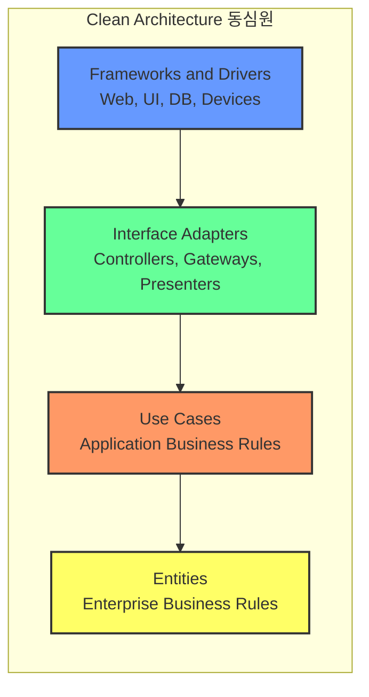
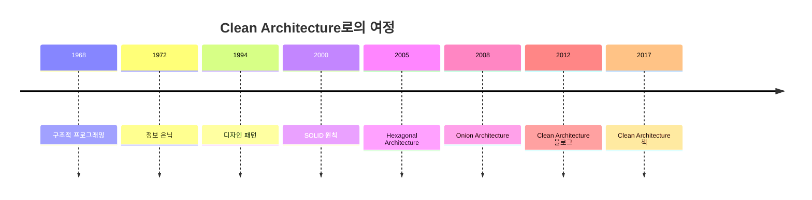

2012년 8월 13일, 로버트 C. 마틴(Robert C. Martin)은 자신의 블로그 "The Clean Code Blog"에 "The Clean Architecture"라는 제목의 글을 게시했다. 이 글은 육각형 아키텍처, 양파 아키텍처, BCE(Boundary-Control-Entity) 등 기존 아키텍처 패턴들의 공통점을 추출하여 하나의 통합된 개념으로 정리했다. 이것이 Clean Architecture의 공식적인 탄생이었다.

## Robert C. Martin: Uncle Bob

### 프로그래밍 경력의 시작

로버트 C. 마틴은 1970년에 프로그래머로 경력을 시작했다. 그의 경력은 소프트웨어 산업의 역사 그 자체와 함께했다:

- **1970년대**: 어셈블리어, COBOL, Fortran으로 프로그래밍 시작
- **1980년대**: C 언어와 객체 지향 프로그래밍의 등장 목격
- **1990년대**: C++, Java의 부상과 함께 객체 지향 설계 전문가로 활동
- **2000년대**: 애자일 운동의 선구자, SOLID 원칙 체계화
- **2010년대**: Clean 시리즈 저술, 소프트웨어 장인정신 운동 주도

### Object Mentor와 소프트웨어 컨설팅

마틴은 1990년에 Object Mentor를 설립했다. 이 회사는 전 세계의 기업들에 객체 지향 설계와 애자일 방법론을 컨설팅했다. 수천 개의 프로젝트에서 얻은 경험이 그의 원칙과 패턴의 기반이 되었다.

### 애자일 선언문 서명자

2001년 2월, 마틴은 Utah주 Snowbird 스키 리조트에서 열린 역사적인 모임에 참석했다. 17명의 소프트웨어 개발자들이 모여 **애자일 선언문(Agile Manifesto)**을 작성한 이 모임에서, 마틴은 핵심 서명자 중 한 명이었다.

```
애자일 소프트웨어 개발 선언문

우리는 소프트웨어를 개발하고, 또 다른 사람의 개발을 도와주면서
소프트웨어 개발의 더 나은 방법들을 찾아가고 있다.
이 작업을 통해 우리는 다음을 가치 있게 여기게 되었다:

- 프로세스와 도구보다 개인과 상호작용을
- 포괄적인 문서보다 작동하는 소프트웨어를
- 계약 협상보다 고객과의 협력을
- 계획을 따르기보다 변화에 대응하기를

왼쪽의 것들도 가치가 있지만, 오른쪽의 것들에 더 높은 가치를 둔다.
```

## SOLID 원칙의 체계화

마틴은 기존에 흩어져 있던 객체 지향 설계 원칙들을 **SOLID**라는 약어로 체계화했다. 이 원칙들은 Clean Architecture의 이론적 기반이 된다:

| 원칙 | 이름 | 핵심 |
|------|------|------|
| S | 단일 책임 원칙 (SRP) | 클래스는 하나의 이유로만 변경되어야 한다 |
| O | 개방-폐쇄 원칙 (OCP) | 확장에는 열리고, 수정에는 닫혀야 한다 |
| L | 리스코프 치환 원칙 (LSP) | 하위 타입은 상위 타입을 대체할 수 있어야 한다 |
| I | 인터페이스 분리 원칙 (ISP) | 클라이언트별로 인터페이스를 분리해야 한다 |
| D | 의존성 역전 원칙 (DIP) | 추상화에 의존해야 한다 |

## Clean 시리즈의 탄생

마틴은 소프트웨어 개발에 대한 자신의 지식과 경험을 "Clean" 시리즈로 정리했다:

### Clean Code (2008)

> "깨끗한 코드는 한 가지를 잘 한다."

이 책은 코드 레벨에서의 깨끗함을 다룬다. 의미 있는 이름, 작은 함수, 주석의 올바른 사용 등 코드 작성의 원칙을 제시한다.

### Clean Coder (2011)

> "프로페셔널 프로그래머는 아니오라고 말할 줄 안다."

이 책은 개발자의 태도와 윤리를 다룬다. 프로페셔널 개발자로서의 책임과 자세를 설명한다.

### Clean Architecture (2017)

> "좋은 아키텍처는 세부사항을 결정하지 않고도 만들 수 있다."

코드와 개발자를 넘어, 시스템 전체의 구조를 다룬다. 이것이 오늘 우리가 공부하는 주제다.

## 2012년 블로그 포스트: The Clean Architecture

2012년 8월 13일의 블로그 포스트에서 마틴은 다음과 같이 시작했다:

> "지난 몇 년간 시스템 아키텍처에 관한 여러 아이디어를 보았다. 여기에는 다음이 포함된다:
> - Hexagonal Architecture (Alistair Cockburn)
> - Onion Architecture (Jeffrey Palermo)
> - Screaming Architecture (Uncle Bob)
> - DCI (James Coplien, Trygve Reenskaug)
> - BCE (Ivar Jacobson)
>
> 이들은 세부사항에서 다소 다르지만, 매우 유사하다. 모두 같은 목표를 가지고 있는데, 바로 관심사의 분리다."

### 유사한 아키텍처들의 공통점

마틴은 이 아키텍처들의 공통점을 다음과 같이 정리했다:

1. **프레임워크 독립성**: 아키텍처는 프레임워크에 의존하지 않는다
2. **테스트 가능성**: 비즈니스 규칙은 UI, DB, 웹 서버 없이 테스트 가능하다
3. **UI 독립성**: UI는 쉽게 변경할 수 있다
4. **데이터베이스 독립성**: 비즈니스 규칙은 DB에 묶이지 않는다
5. **외부 에이전시 독립성**: 비즈니스 규칙은 외부 세계를 모른다

### 의존성 규칙 (The Dependency Rule)

마틴은 이 모든 아키텍처를 관통하는 하나의 규칙을 발견했다:

> **"소스 코드 의존성은 반드시 안쪽으로, 고수준의 정책 방향으로만 향해야 한다."**

이것이 Clean Architecture의 핵심이다.



## 선행 아키텍처의 통합

마틴은 기존 아키텍처들의 장점을 통합하여 Clean Architecture를 구성했다:

### Hexagonal Architecture에서 가져온 것

- **포트와 어댑터 개념**: 외부 세계와의 연결 방식
- **애플리케이션 코어의 독립성**: 비즈니스 로직의 보호
- **양방향 대칭성**: 입력과 출력의 동등한 처리

### Onion Architecture에서 가져온 것

- **동심원 구조**: 계층을 원형으로 표현
- **도메인 중심 설계**: 도메인 모델이 가장 안쪽에 위치
- **의존성 방향**: 항상 안쪽으로

### BCE에서 가져온 것

- **Boundary**: 인터페이스 어댑터 계층과 유사
- **Control**: 유스케이스 계층과 유사
- **Entity**: 엔터티 계층과 동일

### DCI에서 가져온 것

- **Data**: 도메인 객체
- **Context**: 유스케이스의 실행 맥락
- **Interaction**: 역할 기반의 행위 분리

## Clean Architecture의 4가지 계층

마틴은 최종적으로 4가지 계층을 정의했다:

### 1. Entities (엔터티)

가장 안쪽의 계층. 기업 전체의 비즈니스 규칙을 캡슐화한다.

- 가장 변경이 적은 부분
- 외부 변화로부터 가장 보호받는 부분
- 메서드를 가진 객체일 수도, 데이터 구조와 함수의 집합일 수도 있음

### 2. Use Cases (유스케이스)

애플리케이션 특화 비즈니스 규칙을 포함한다.

- 시스템의 모든 유스케이스를 구현하고 캡슐화
- 엔터티로 들어오고 나가는 데이터 흐름을 조율
- 이 계층의 변경이 엔터티에 영향을 주지 않음
- UI, DB, 외부 시스템의 변경이 이 계층에 영향을 주지 않음

### 3. Interface Adapters (인터페이스 어댑터)

유스케이스와 엔터티에 가장 편리한 형식에서, 외부 에이전시에 가장 편리한 형식으로 데이터를 변환한다.

- Controllers, Presenters, Gateways
- MVC 아키텍처의 컨트롤러와 뷰
- 데이터 변환 로직

### 4. Frameworks and Drivers (프레임워크와 드라이버)

가장 바깥쪽의 계층. 세부사항으로 구성된다.

- 웹 프레임워크
- 데이터베이스
- UI 프레임워크
- 외부 도구와 라이브러리

## 2017년 책 출간

마틴은 2017년에 "Clean Architecture: A Craftsman's Guide to Software Structure and Design"을 출간했다. 이 책은 2012년 블로그 포스트의 아이디어를 확장하고 체계화했다.

### 책의 구성

| 부 | 제목 | 내용 |
|---|------|------|
| 1부 | 소개 | 아키텍처의 중요성 |
| 2부 | 벽돌부터 시작하기 | 프로그래밍 패러다임 |
| 3부 | 설계 원칙 | SOLID 원칙 |
| 4부 | 컴포넌트 원칙 | 응집도와 결합도 |
| 5부 | 아키텍처 | Clean Architecture 상세 |
| 6부 | 세부사항 | DB, 웹, 프레임워크 |

### 책이 주는 통찰

마틴은 책에서 수십 년의 경험에서 얻은 통찰을 공유했다:

> "좋은 아키텍처는 결정을 지연시킬 수 있게 해준다."

데이터베이스, 프레임워크, UI에 대한 결정을 나중으로 미룰 수 있다면, 그것은 좋은 아키텍처다.

> "아키텍처는 의도를 소리쳐야 한다."

프로젝트의 최상위 디렉토리 구조를 보면, 이것이 건강 관리 시스템인지, 회계 시스템인지 알 수 있어야 한다. Rails나 Spring이 보여서는 안 된다.

## Clean Architecture의 의의

Clean Architecture는 단순히 또 하나의 아키텍처 패턴이 아니다. 이것은 수십 년간의 소프트웨어 개발 경험과 여러 아키텍처 패턴들의 공통 원칙을 정제한 것이다.



### Clean Architecture가 해결하는 문제

1. **프레임워크 갈아타기**: 프레임워크가 죽어도 비즈니스 로직은 살아남는다
2. **테스트 지옥 탈출**: 데이터베이스 없이 비즈니스 로직 테스트
3. **UI 변경의 공포**: UI를 바꿔도 비즈니스 로직은 그대로
4. **레거시 마이그레이션**: 점진적으로 아키텍처 개선 가능

### Uncle Bob의 메시지

마틴은 Clean Architecture를 통해 한 가지 핵심 메시지를 전달한다:

> "소프트웨어의 부드러움(soft)을 지키려면, 변경하기 쉬워야 한다. 변경하기 쉬우려면, 중요한 것(비즈니스 로직)이 중요하지 않은 것(세부사항)에 의존하지 않아야 한다."

## 핵심 요약

| 항목 | 내용 |
|------|------|
| 창시자 | Robert C. Martin (Uncle Bob) |
| 공식 발표 | 2012년 블로그 포스트 |
| 책 출간 | 2017년 |
| 선행 패턴 | Hexagonal, Onion, BCE, DCI |
| 핵심 규칙 | 의존성은 안쪽으로만 |
| 목표 | 프레임워크/DB/UI 독립성 |

## 다음 장에서는

역사적 배경에 대한 탐구를 마치고, 이제 Clean Architecture의 본격적인 내용으로 들어간다. 다음 장에서는 "설계와 아키텍처란 무엇인가"에 대해 로버트 마틴의 관점을 살펴본다.
