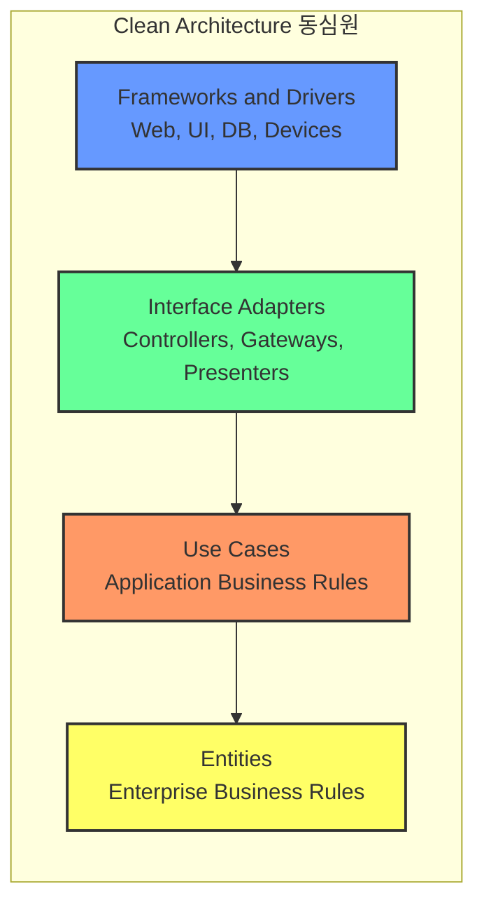
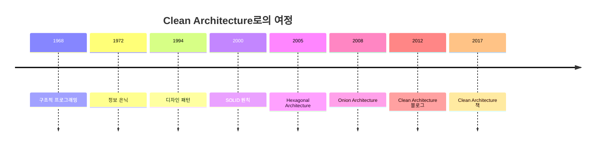

2012년 8월 13일, 로버트 C. 마틴(Robert C. Martin)은 자신의 블로그 "The Clean Code Blog"에 "The Clean Architecture"라는 제목의 글을 게시했다. 이 글은 육각형 아키텍처, 양파 아키텍처, BCE(Boundary-Control-Entity) 등 기존 아키텍처 패턴들의 공통점을 추출하여 하나의 통합된 개념으로 정리했다. 이것이 Clean Architecture의 공식적인 탄생이었다.

## Robert C. Martin: Uncle Bob

### 프로그래밍 경력의 시작

로버트 C. 마틴은 1970년에 프로그래머로 경력을 시작했다. 그의 경력이 특별한 이유는 단순히 오래되었기 때문이 아니라, 소프트웨어 산업이 겪은 주요 패러다임 전환 — 구조적 프로그래밍에서 객체 지향으로, 다시 애자일과 아키텍처 원칙 정립으로 — 을 실무자로서 모두 통과했다는 점이다. 이 경험의 축적이 Clean Architecture가 특정 유행이 아니라 여러 시대의 교훈을 종합한 결과물이라는 주장의 근거가 된다.

- **1970년대**: 어셈블리어, COBOL, Fortran으로 프로그래밍 시작
- **1980년대**: C 언어와 객체 지향 프로그래밍의 등장 목격
- **1990년대**: C++, Java의 부상과 함께 객체 지향 설계 전문가로 활동
- **2000년대**: 애자일 운동의 선구자, SOLID 원칙 체계화
- **2010년대**: Clean 시리즈 저술, 소프트웨어 장인정신 운동 주도

### Object Mentor와 소프트웨어 컨설팅

마틴은 1991년에 Object Mentor를 설립했다. 이 회사는 전 세계의 기업들에 객체 지향 설계와 애자일 방법론을 컨설팅했다. 수천 개의 프로젝트에서 얻은 경험이 그의 원칙과 패턴의 기반이 되었다.

### 애자일 선언문 서명자

2001년 2월, 마틴은 Utah주 Snowbird 스키 리조트에서 열린 역사적인 모임에 참석했다. 17명의 소프트웨어 개발자들이 모여 **애자일 선언문(Agile Manifesto)**을 작성한 이 모임에서, 마틴은 핵심 서명자 중 한 명이었다.

```
애자일 소프트웨어 개발 선언문

우리는 소프트웨어를 개발하고, 또 다른 사람의 개발을 도와주면서
소프트웨어 개발의 더 나은 방법들을 찾아가고 있다.
이 작업을 통해 우리는 다음을 가치 있게 여기게 되었다:

- 프로세스와 도구보다 개인과 상호작용을
- 포괄적인 문서보다 작동하는 소프트웨어를
- 계약 협상보다 고객과의 협력을
- 계획을 따르기보다 변화에 대응하기를

왼쪽의 것들도 가치가 있지만, 오른쪽의 것들에 더 높은 가치를 둔다.
```

## SOLID 원칙의 체계화

마틴은 기존에 흩어져 있던 객체 지향 설계 원칙들을 **SOLID**라는 약어로 체계화했다. 이 원칙들은 Clean Architecture의 이론적 기반이 된다:

| 원칙 | 이름 | 핵심 |
|------|------|------|
| S | 단일 책임 원칙 (SRP) | 클래스는 하나의 이유로만 변경되어야 한다 |
| O | 개방-폐쇄 원칙 (OCP) | 확장에는 열리고, 수정에는 닫혀야 한다 |
| L | 리스코프 치환 원칙 (LSP) | 하위 타입은 상위 타입을 대체할 수 있어야 한다 |
| I | 인터페이스 분리 원칙 (ISP) | 클라이언트별로 인터페이스를 분리해야 한다 |
| D | 의존성 역전 원칙 (DIP) | 추상화에 의존해야 한다 |

## Clean 시리즈의 탄생

마틴은 소프트웨어 개발에 대한 자신의 지식과 경험을 "Clean" 시리즈로 정리했다:

### Clean Code (2008)

이 책의 핵심 메시지는 "깨끗한 코드는 한 가지를 잘 한다"는 것이다(Martin, *Clean Code*, 2008). 코드 레벨에서의 깨끗함을 다루며, 의미 있는 이름, 작은 함수, 주석의 올바른 사용 등 코드 작성의 원칙을 제시한다.

### Clean Coder (2011)

이 책은 "프로페셔널 프로그래머는 아니오라고 말할 줄 안다"는 태도로 대표되는, 개발자의 태도와 윤리를 다룬다(Martin, *The Clean Coder*, 2011). 프로페셔널 개발자로서의 책임과 자세를 설명한다.

### Clean Architecture (2017)

이 책의 핵심 주장은 "좋은 아키텍처는 세부사항에 대한 결정을 나중으로 미룰 수 있게 해준다"는 것이다(Martin, *Clean Architecture*, 2017). 코드와 개발자를 넘어, 시스템 전체의 구조를 다룬다. 이것이 오늘 우리가 공부하는 주제다.

## 2012년 블로그 포스트: The Clean Architecture

2012년 8월 13일의 블로그 포스트([blog.cleancoder.com/uncle-bob/2012/08/13/the-clean-architecture.html](https://blog.cleancoder.com/uncle-bob/2012/08/13/the-clean-architecture.html))에서 마틴은 다음과 같이 시작했다:

> "지난 몇 년간 시스템 아키텍처에 관한 여러 아이디어를 보았다. 여기에는 다음이 포함된다:
> - Hexagonal Architecture (Alistair Cockburn)
> - Onion Architecture (Jeffrey Palermo)
> - Screaming Architecture (Uncle Bob)
> - DCI (James Coplien, Trygve Reenskaug)
> - BCE (Ivar Jacobson)
>
> 이들은 세부사항에서 다소 다르지만, 매우 유사하다. 모두 같은 목표를 가지고 있는데, 바로 관심사의 분리다."

### 유사한 아키텍처들의 공통점

마틴은 이 아키텍처들의 공통점을 다음과 같이 정리했다:

1. **프레임워크 독립성**: 아키텍처는 프레임워크에 의존하지 않는다
2. **테스트 가능성**: 비즈니스 규칙은 UI, DB, 웹 서버 없이 테스트 가능하다
3. **UI 독립성**: UI는 쉽게 변경할 수 있다
4. **데이터베이스 독립성**: 비즈니스 규칙은 DB에 묶이지 않는다
5. **외부 에이전시 독립성**: 비즈니스 규칙은 외부 세계를 모른다

### 의존성 규칙 (The Dependency Rule)

마틴은 이 모든 아키텍처를 관통하는 하나의 규칙을 발견했다. 소스 코드 의존성은 반드시 안쪽으로, 고수준의 정책 방향으로만 향해야 한다는 것이다(Martin, 2012 블로그 포스트; *Clean Architecture*, 2017, 이른바 "The Dependency Rule"). 이것이 Clean Architecture의 핵심이다.


```mermaid
flowchart TB
    subgraph CleanArch [Clean Architecture 동심원]
        direction TB
        E[Entities</br>Enterprise Business Rules]
        U[Use Cases</br>Application Business Rules]
        I[Interface Adapters</br>Controllers, Gateways, Presenters]
        F[Frameworks and Drivers</br>Web, UI, DB, Devices]
    end
    
    F --> I
    I --> U
    U --> E
    
    style E fill:#ff6,stroke:#333,stroke-width:2px
    style U fill:#f96,stroke:#333,stroke-width:2px
    style I fill:#6f9,stroke:#333,stroke-width:2px
    style F fill:#69f,stroke:#333,stroke-width:2px
```

이 규칙을 코드 한 조각으로 보면, "안쪽 원이 바깥 원의 존재를 모른다"는 말이 실제로 무엇을 뜻하는지 분명해진다.

```java
// Entities 계층 — 프레임워크·DB를 전혀 언급하지 않는다
class Order {
    private boolean paid;
    void markPaid() { this.paid = true; }
    boolean isPaid() { return paid; }
}

// Use Cases 계층 — Entities에만 의존하고, Interface Adapters는 인터페이스로만 안다
interface OrderPresenter { void present(Order order); }
class PayOrderUseCase {
    private final OrderPresenter presenter;
    PayOrderUseCase(OrderPresenter presenter) { this.presenter = presenter; }
    void execute(Order order) {
        order.markPaid();
        presenter.present(order); // 화면이 웹인지 CLI인지 이 코드는 모른다
    }
}
```

`Order`는 `PayOrderUseCase`의 존재를 모르고, `PayOrderUseCase`는 `OrderPresenter`를 구현하는 것이 REST 컨트롤러인지 콘솔 출력인지 모른다 — 화살표(의존성)가 항상 안쪽으로만 향한다는 것은 이런 식으로 "바깥쪽 타입을 import하지 않는다"는 구체적인 코드 규율로 나타난다.

## 선행 아키텍처의 통합

마틴은 기존 아키텍처들에서 각각 다른 요소를 가져와 통합했다. 이 절은 "무엇을 어디서 가져왔는지"를 정리한다 — 즉 Clean Architecture는 무(無)에서 나온 발명이 아니라, 여러 선행 아키텍처가 독립적으로 도달한 공통 결론을 정제한 결과라는 뜻이다.

### Hexagonal Architecture에서 가져온 것

콕번의 육각형 아키텍처에서는 **포트와 어댑터 개념**(외부 세계와의 연결 방식), **애플리케이션 코어의 독립성**(비즈니스 로직의 보호), **양방향 대칭성**(입력과 출력을 동등하게 취급)을 가져왔다.

### Onion Architecture에서 가져온 것

팔레르모의 양파 아키텍처에서는 **동심원 구조**(계층을 원형으로 표현하는 시각화 방식), **도메인 중심 설계**(도메인 모델이 가장 안쪽에 위치), **의존성 방향**(항상 안쪽으로)을 가져왔다.

### BCE에서 가져온 것

이바 야콥슨(Ivar Jacobson)의 BCE(Boundary-Control-Entity) 패턴에서는 3개 요소가 각각 대응된다: **Boundary**는 인터페이스 어댑터 계층과, **Control**은 유스케이스 계층과, **Entity**는 엔터티 계층과 유사하다.

### DCI에서 가져온 것

제임스 코플리엔(James Coplien)과 트리그베 린스코그의 DCI(Data-Context-Interaction)에서는 **Data**(도메인 객체), **Context**(유스케이스의 실행 맥락), **Interaction**(역할 기반의 행위 분리) 개념을 가져왔다.

Clean Architecture의 동심원 4계층(Entities, Use Cases, Interface Adapters, Frameworks and Drivers) 각각의 책임과 코드 예시는 이 시리즈의 32장 "클린 아키텍처: 동심원과 의존성 규칙"에서 자세히 다룬다.

## 2017년 책 출간

마틴은 2017년에 "Clean Architecture: A Craftsman's Guide to Software Structure and Design"을 출간했다. 이 책은 2012년 블로그 포스트의 아이디어를 확장하고 체계화했다.

### 책의 구성

| 부 | 제목 | 내용 |
|---|------|------|
| 1부 | 소개 | 아키텍처의 중요성 |
| 2부 | 벽돌부터 시작하기 | 프로그래밍 패러다임 |
| 3부 | 설계 원칙 | SOLID 원칙 |
| 4부 | 컴포넌트 원칙 | 응집도와 결합도 |
| 5부 | 아키텍처 | Clean Architecture 상세 |
| 6부 | 세부사항 | DB, 웹, 프레임워크 |

### 책이 주는 통찰

마틴은 책에서 수십 년의 경험에서 얻은 통찰을 공유했다. 그중 두 가지가 특히 자주 인용된다(Martin, *Clean Architecture*, 2017).

**결정 지연**: 데이터베이스, 프레임워크, UI에 대한 결정을 나중으로 미룰 수 있다면, 그것은 좋은 아키텍처라는 것이다.

**의도를 드러내는 구조(Screaming Architecture)**: 프로젝트의 최상위 디렉토리 구조를 보면, 이것이 건강 관리 시스템인지, 회계 시스템인지 알 수 있어야 한다는 것이다. Rails나 Spring이 보여서는 안 된다.

## Clean Architecture의 의의

Clean Architecture는 단순히 또 하나의 아키텍처 패턴이 아니다. 이것은 수십 년간의 소프트웨어 개발 경험과 여러 아키텍처 패턴들의 공통 원칙을 정제한 것이다.


```mermaid
timeline
    title Clean Architecture로의 여정
    1968 : 구조적 프로그래밍
    1972 : 정보 은닉
    1994 : 디자인 패턴
    2000 : SOLID 원칙
    2005 : Hexagonal Architecture
    2008 : Onion Architecture
    2012 : Clean Architecture 블로그
    2017 : Clean Architecture 책
```

### Clean Architecture가 해결하는 문제

아래 네 가지는 서로 다른 문제처럼 보이지만, 모두 "비즈니스 로직이 세부사항에 의존하지 않는다"는 하나의 규칙이 지켜지면 함께 해결된다.

1. **프레임워크 갈아타기**: 프레임워크가 죽어도 비즈니스 로직은 살아남는다
2. **테스트 지옥 탈출**: 데이터베이스 없이 비즈니스 로직 테스트
3. **UI 변경의 공포**: UI를 바꿔도 비즈니스 로직은 그대로
4. **레거시 마이그레이션**: 점진적으로 아키텍처 개선 가능

### Uncle Bob의 메시지

마틴은 Clean Architecture를 통해 한 가지 핵심 메시지를 전달한다(Martin, *Clean Architecture*, 2017). 소프트웨어의 부드러움(soft)을 지키려면 변경하기 쉬워야 하고, 변경하기 쉬우려면 중요한 것(비즈니스 로직)이 중요하지 않은 것(세부사항)에 의존하지 않아야 한다는 것이다.

## 흔한 오해

"Clean Code·Clean Coder·Clean Architecture는 같은 내용을 반복하는 시리즈"라는 오해가 흔하다. 실제로는 세 책이 서로 다른 층위를 다룬다 — Clean Code는 함수·변수 이름 같은 코드 한 줄 수준, Clean Coder는 마감을 지키는 법 같은 개발자의 태도, Clean Architecture는 시스템 전체의 구조다. 세 층위 모두 "변경하기 쉬운 소프트웨어"라는 같은 목표를 다른 각도에서 다룰 뿐, 내용이 겹치지 않는다.

또 다른 오해는 "2012년 블로그 포스트는 2017년 책이 나온 뒤로는 낡은 자료"라는 생각이다. 책은 블로그 포스트의 아이디어를 확장한 것이지 대체한 것이 아니다 — 블로그 포스트는 여전히 Dependency Rule의 핵심을 몇 문단으로 압축해 보여주는 가장 빠른 입문 자료로 남아 있으며, 이 시리즈의 여러 장에서도 원 출처로 함께 인용한다.

## 핵심 요약

| 항목 | 내용 |
|------|------|
| 창시자 | Robert C. Martin (Uncle Bob) |
| 공식 발표 | 2012년 블로그 포스트 |
| 책 출간 | 2017년 |
| 선행 패턴 | Hexagonal, Onion, BCE, DCI |
| 핵심 규칙 | 의존성은 안쪽으로만 |
| 목표 | 프레임워크/DB/UI 독립성 |

## 비판적 시각

Clean Architecture의 "통합" 서사에는 비판도 따른다. 일부 개발자는 마틴이 통합했다고 주장하는 육각형·양파·BCE·DCI 아키텍처가 이미 "의존성을 안쪽으로"라는 같은 결론에 각자 도달해 있었기 때문에, Clean Architecture의 기여는 새로운 아이디어라기보다 **기존 아이디어의 재포장과 대중화**에 가깝다는 지적이다. 실제로 마틴 본인도 2012년 블로그 포스트에서 "이들은 매우 유사하다"고 인정한다. 다만 서로 다른 커뮤니티(DDD, 헥사고날, BCE)에서 각각 다른 용어로 논의되던 개념을 하나의 이름과 다이어그램으로 통일해 넓은 개발자 대중에게 전파했다는 점은 그 자체로 실무적 가치가 있다는 반론도 있다.

## 판단 기준

이 역사적 맥락은 단순한 교양이 아니라 실무 판단에도 쓰인다. 새로운 아키텍처 패턴을 제안하거나 팀에 도입을 설득할 때는, 이미 다른 이름으로 같은 결론에 도달한 선행 사례가 있는지부터 조사하는 것이 좋다 — 마틴 본인이 그렇게 했듯, 기존 아이디어를 정확히 인용하고 통합하는 편이 "새로운 것을 발명했다"고 주장하는 것보다 신뢰를 얻기 쉽고, 팀원들이 이미 아는 개념(헥사고날, DDD 등)과 연결 지어 설명할 수 있어 설득력도 높아진다.

## 학습 목표

이 장을 읽은 후 다음을 할 수 있어야 한다.

- Clean Architecture가 어떤 4개 선행 아키텍처(Hexagonal, Onion, BCE, DCI)에서 각각 무엇을 가져왔는지 설명할 수 있다.
- "Clean Architecture는 완전히 새로운 발명"이라는 주장과 "기존 아이디어의 재포장"이라는 비판을 모두 근거를 들어 평가할 수 있다.
- Clean Code·Clean Coder·Clean Architecture 세 책이 각각 어느 층위(코드/개발자 태도/시스템 구조)를 다루는지 구분할 수 있다.

## 참고 자료

- Martin, R. C. (2012). "The Clean Architecture". [blog.cleancoder.com/uncle-bob/2012/08/13/the-clean-architecture.html](https://blog.cleancoder.com/uncle-bob/2012/08/13/the-clean-architecture.html)
- Martin, R. C. (2017). *Clean Architecture: A Craftsman's Guide to Software Structure and Design*. Prentice Hall.

## 다음 장에서는

역사적 배경에 대한 탐구를 마치고, 이제 Clean Architecture의 본격적인 내용으로 들어간다. 다음 장에서는 "설계와 아키텍처란 무엇인가"에 대해 로버트 마틴의 관점을 살펴본다.
