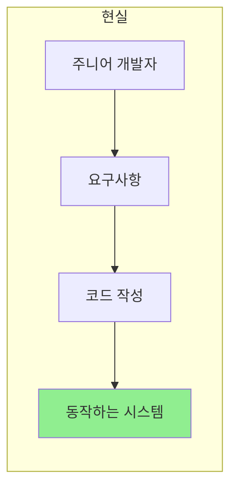
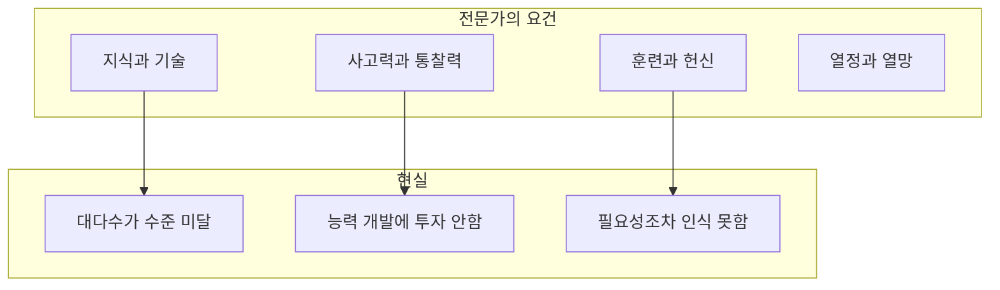
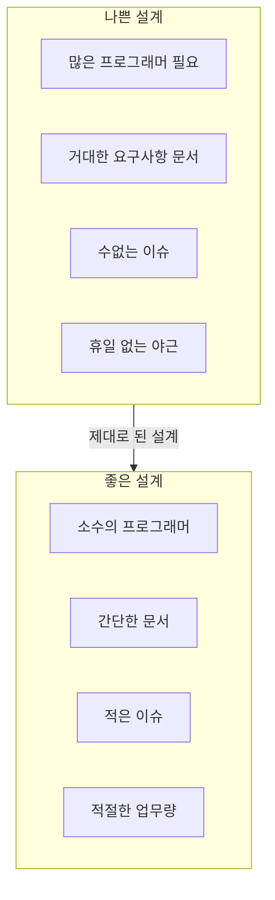
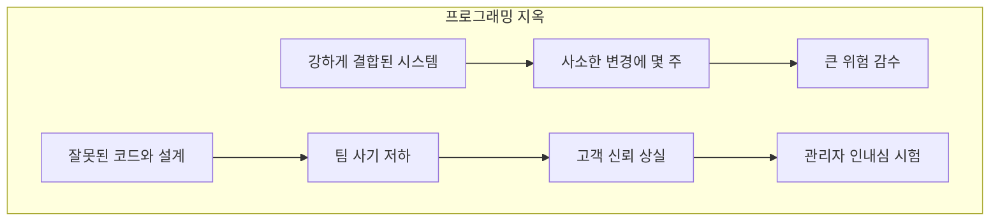
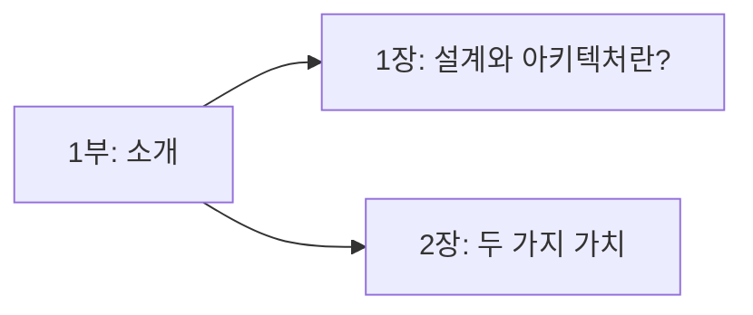

**프로그램이 동작하도록 만드는 데 엄청난 수준의 지식과 기술이 필요하지는 않다.** 언제든 어린 고등학생이라도 할 수 있는 일이다.

## 동작하는 코드: 누구나 만들 수 있다

젊은 대학생도 PHP 또는 루비 코드 몇 줄을 이리저리 맞춰가며 **수억 달러 규모의 사업**을 시작한다. 전 세계의 수많은 초급 프로그래머가 칸막이로 나뉜 작은 사무실에서 이슈 추적 시스템에 등록된 거대한 요구사항 문서들을 순전히 강인한 정신력만으로 힘겹게 해결해 내면서 시스템을 '동작하도록' 만든다.



이들이 작성한 코드는 그다지 깔끔하지 않을 순 있지만, **동작은 한다**. 프로그램을 동작하게 만들기는 그리 어려운 일이 아니기 때문이다.

### 동작하는 코드의 특징

```java
// 동작은 하지만... 좋은 코드인가?
public class OrderService {
    public void processOrder(String customerId, String productId, int qty) {
        // 데이터베이스 직접 접근
        Connection conn = DriverManager.getConnection("jdbc:mysql://...");
        Statement stmt = conn.createStatement();
        
        // 비즈니스 로직과 SQL이 뒤섞임
        ResultSet rs = stmt.executeQuery(
            "SELECT * FROM products WHERE id = '" + productId + "'");
        // ... 수백 줄의 코드
        
        // 에러 처리? 트랜잭션? 로깅?
        // "나중에 하자..."
    }
}
```

## 제대로 된 소프트웨어: 전문가의 영역

하지만 프로그램을 **제대로** 만드는 일은 전혀 다르다.

> "소프트웨어를 올바르게 만드는 일은 어렵다."
> — Robert C. Martin

### 전문가가 되기 위한 요소



소프트웨어를 제대로 만들려면:
- **적정 수준의 지식과 기술**을 겸비해야 한다
- **사고력과 통찰력**을 갖춰야 한다
- **훈련과 헌신**이 필요하다
- **기술을 향한 열정**과 전문가가 되려는 **열망**이 필수다

### 대다수 프로그래머의 현실

| 요구 사항 | 대다수의 현실 |
|-----------|--------------|
| 지식과 기술 | 이 수준에 도달하지 못함 |
| 사고력과 통찰력 | 개발에 시간을 투자하지 않음 |
| 훈련과 헌신 | 필요하다는 생각조차 안 함 |

## 마법과도 같은 일: 제대로 만들면

반면 소프트웨어를 제대로 만들게 되면 **마법과도 같은 일**이 벌어진다.



### 좋은 설계의 효과

- **소수의 프로그래머**만으로 프로그램이 지속적으로 동작
- 거대한 요구사항 문서와 이슈 추적 시스템 **불필요**
- 휴일도 없이 일해야 하는 프로그래머 **불필요**

> "제대로 된 소프트웨어를 만들면 아주 적은 인력만으로도 새로운 기능을 추가하거나 유지보수할 수 있다."

| 좋은 설계의 결과 | 설명 |
|-----------------|------|
| 변경 용이성 | 변경은 단순해지고 빠르게 반영 가능 |
| 낮은 결함률 | 결함은 적어지고 잦아든다 |
| 높은 생산성 | 최소한의 노력으로 기능과 유연성 최대화 |

## 저자의 경험: 천국과 지옥

### 천국: 좋은 아키텍처

> "나는 거기에 있었고, 또 목격했다."

마틴은 다음과 같은 프로젝트를 경험했다:

- 제대로 만든 시스템 설계와 아키텍처 덕택에 **쉽게 구현하고 유지보수**할 수 있었던 프로젝트
- **예상보다 적은 인력**만으로 완수한 프로젝트
- **결함률이 극도로 낮은** 시스템
- 훌륭한 소프트웨어 아키텍처가 **시스템, 프로젝트, 팀에 놀라운 효과**를 가져오는 것

### 지옥: 나쁜 아키텍처

하지만 당신의 경험을 한번 보자. 전혀 반대의 상황을 겪지 않았나?



| 증상 | 결과 |
|------|------|
| 서로 강하게 연관되고 복잡하게 결합 | 사소한 변경에도 몇 주 소요 |
| 잘못된 코드와 끔찍한 설계 | 방해받고 진행 불가 |
| 나쁜 시스템 설계 | 팀의 사기 저하 |
| 형편없는 소프트웨어 구조 | 팀, 부서, 회사 실패 |

## 우리의 현실

> "나를 포함해서 우리 대다수는 대체로 이러한 경험을 했다."

```java
// 현실: 레거시 코드와의 싸움
public class LegacyOrderProcessor {
    // 2005년에 작성됨. 아무도 이해 못함.
    // TODO: 리팩토링 필요 (2010년 작성)
    // FIXME: 왜 이게 동작하지? (2015년 작성)
    // WARNING: 절대 수정하지 마시오! (2020년 작성)
    
    public void process(Object... args) {
        // 500줄의 스파게티 코드
        // 18개의 중첩 if문
        // 3개의 goto 대체 구문
        // 수십 개의 매직 넘버
    }
}
```

훌륭한 소프트웨어 설계를 바탕으로 작업하면서 **즐거움을 느끼기보다는**, 형편없는 소프트웨어 설계와 **맞서 싸우는 일**을 훨씬 더 자주 맞닥뜨린다.

## 이 파트에서 다룰 내용



| 장 | 제목 | 핵심 내용 |
|----|------|----------|
| 1장 | 설계와 아키텍처란? | 둘 사이에 차이가 없다 |
| 2장 | 두 가지 가치 | 행위 vs 구조 |

## 핵심 요약

| 항목 | 동작하는 코드 | 제대로 된 소프트웨어 |
|------|--------------|-------------------|
| 난이도 | 쉬움 | 어려움 |
| 필요 역량 | 기본적인 프로그래밍 | 지식, 기술, 통찰력, 헌신 |
| 유지보수 | 악몽 | 쉽고 빠름 |
| 인력 | 많이 필요 | 적게 필요 |
| 결함률 | 높음 | 낮음 |
| 변경 비용 | 시간이 지날수록 증가 | 일정하게 유지 |

> "이 책의 목표는 좋은 소프트웨어 아키텍처가 무엇인지, 어떻게 만드는지를 설명하는 것이다. 비용은 최소화하고 생산성은 최대화할 수 있는 설계를 만들기 위해 알아야 할 모든 것을 다룬다."

다음 장에서는 **설계와 아키텍처의 정의**와 그 **목표**에 대해 자세히 알아본다.
