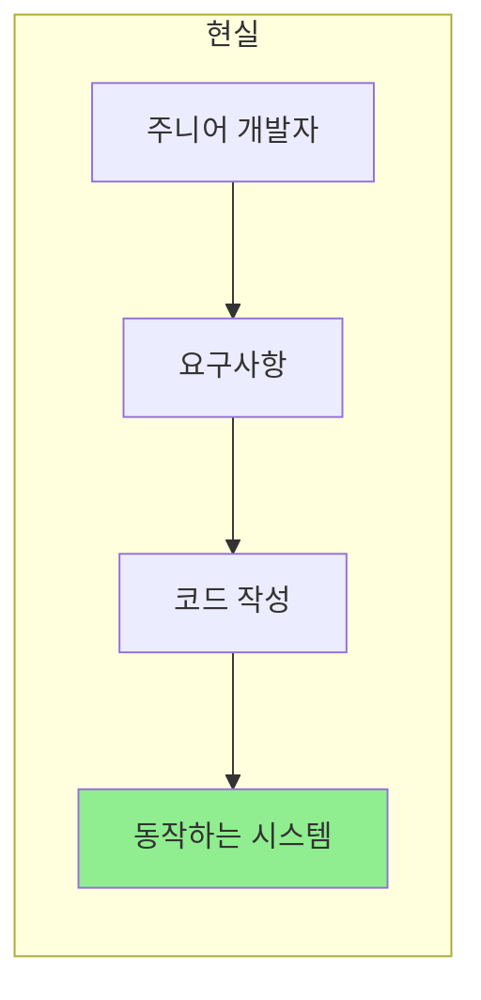
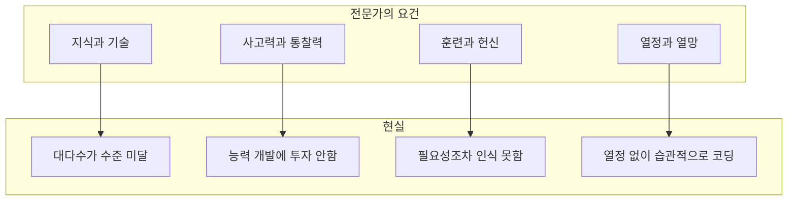
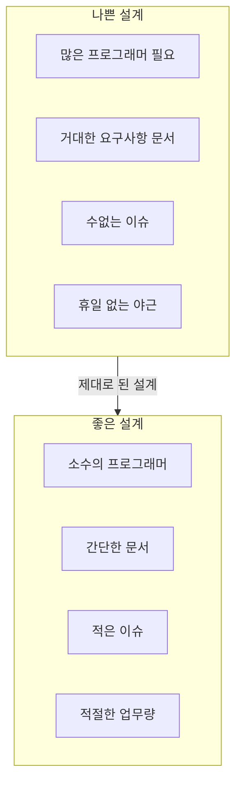
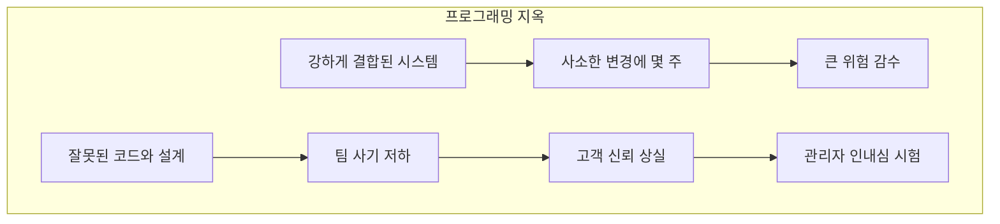
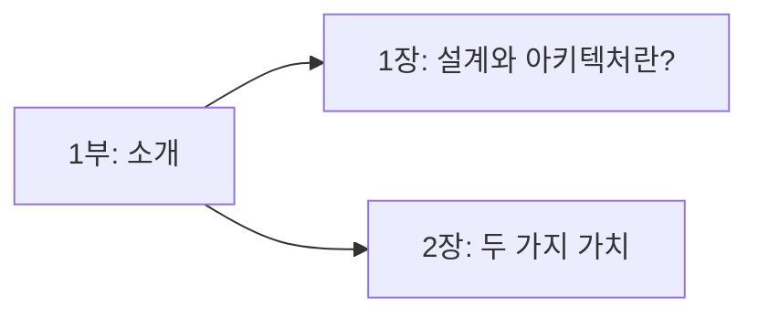

**프로그램이 동작하도록 만드는 데 엄청난 수준의 지식과 기술이 필요하지는 않다.** 언제든 어린 고등학생이라도 할 수 있는 일이다.

## 동작하는 코드: 누구나 만들 수 있다

젊은 대학생도 PHP 또는 루비 코드 몇 줄을 이리저리 맞춰가며 **수억 달러 규모의 사업**을 시작한다. 전 세계의 수많은 초급 프로그래머가 칸막이로 나뉜 작은 사무실에서 이슈 추적 시스템에 등록된 거대한 요구사항 문서들을 순전히 강인한 정신력만으로 힘겹게 해결해 내면서 시스템을 '동작하도록' 만든다.


```mermaid
flowchart LR
    subgraph Reality [현실]
        JD[주니어 개발자]
        REQ[요구사항]
        CODE[코드 작성]
        WORK[동작하는 시스템]
    end
    
    JD --> REQ --> CODE --> WORK
    
    style WORK fill:#90EE90
```

이들이 작성한 코드는 그다지 깔끔하지 않을 순 있지만, **동작은 한다**. 프로그램을 동작하게 만들기는 그리 어려운 일이 아니기 때문이다.

### 동작하는 코드의 특징

```java
import java.sql.*;

// 동작은 하지만... 좋은 코드인가?
public class OrderService {
    public void processOrder(String customerId, String productId, int qty) throws SQLException {
        // 데이터베이스 직접 접근
        Connection conn = DriverManager.getConnection("jdbc:mysql://...");
        Statement stmt = conn.createStatement();
        
        // 비즈니스 로직과 SQL이 뒤섞임
        ResultSet rs = stmt.executeQuery(
            "SELECT * FROM products WHERE id = '" + productId + "'");
        // ... 수백 줄의 코드가 이런 식으로 이어지며 재고 확인, 가격 계산, 주문 저장을 전부 이 메서드 안에서 처리한다
        
        // 에러 처리? 트랜잭션? 로깅? "나중에 하자..." — 결국 아무도 하지 않는다
        conn.close();
    }
}
```

이 코드가 "동작한다"는 사실 자체는 부정할 수 없다 — 주문을 받아 DB에 저장하는 요구사항을 지금 당장은 충족한다. 문제는 요구사항이 바뀌는 순간 드러난다. 재고 확인 로직에 조건 하나만 추가해도 이미 뒤섞인 SQL·비즈니스 로직·에러 처리 부재 사이 어딘가에 새 코드를 끼워 넣어야 하고, `processOrder` 메서드는 그때마다 조금씩 더 얽힌다. 이 얽힘은 코드를 처음 짠 사람에게는 보이지 않는다 — 문제가 가시화되는 시점은 항상 몇 달 뒤, 다른 사람이 이 메서드를 고치려 할 때다.

## 제대로 된 소프트웨어: 전문가의 영역

하지만 프로그램을 **제대로** 만드는 일은 전혀 다르다.

마틴은 서문 초반에 이렇게 단언하는 것으로 알려져 있다: 소프트웨어를 올바르게 만드는 일은 어렵다(Martin, *Clean Architecture*, 2017, 서문 — 취지를 풀어쓴 것이며 원문 그대로의 인용은 아니다).

### 전문가가 되기 위한 요소


```mermaid
flowchart TB
    subgraph Requirements [전문가의 요건]
        K[지식과 기술]
        T[사고력과 통찰력]
        D[훈련과 헌신]
        P[열정과 열망]
    end
    
    subgraph Reality [현실]
        R1[대다수가 수준 미달]
        R2[능력 개발에 투자 안함]
        R3[필요성조차 인식 못함]
        R4[열정 없이 습관적으로 코딩]
    end
    
    K --> R1
    T --> R2
    D --> R3
    P --> R4
```

소프트웨어를 제대로 만들려면 네 가지가 함께 필요하다. **적정 수준의 지식과 기술**, **사고력과 통찰력**, **훈련과 헌신**, 그리고 **기술을 향한 열정**과 전문가가 되려는 **열망**이다. 위 다이어그램이 보여주듯, 대다수 프로그래머는 이 네 요건 중 어느 하나에서든 미달하기 쉽다 — 지식과 기술 수준 자체가 부족하거나, 그 수준에 도달할 시간을 투자하지 않거나, 애초에 그럴 필요성조차 인식하지 못하거나, 열정 없이 그저 습관적으로 코드를 작성한다.

## 마법과도 같은 일: 제대로 만들면

반면 소프트웨어를 제대로 만들게 되면 **마법과도 같은 일**이 벌어진다. 위 "천국과 지옥" 흐름도가 보여주듯, 좋은 설계는 단순히 코드가 예뻐지는 것을 넘어 조직 전체의 운영 방식을 바꾼다.


```mermaid
flowchart TB
    subgraph Before [나쁜 설계]
        B1[많은 프로그래머 필요]
        B2[거대한 요구사항 문서]
        B3[수없는 이슈]
        B4[휴일 없는 야근]
    end
    
    subgraph After [좋은 설계]
        A1[소수의 프로그래머]
        A2[간단한 문서]
        A3[적은 이슈]
        A4[적절한 업무량]
    end
    
    Before -->|제대로 된 설계| After
```

마틴은 이를, 제대로 된 소프트웨어를 만들면 아주 적은 인력만으로도 새로운 기능을 추가하거나 유지보수할 수 있다는 취지로 요약하는 것으로 알려져 있다(Martin, *Clean Architecture*, 2017, 서문 — 원문 그대로의 인용은 아니다). 구체적으로는 아래 세 가지 결과로 나타난다.

| 좋은 설계의 결과 | 설명 |
|-----------------|------|
| 변경 용이성 | 변경은 단순해지고 빠르게 반영 가능 |
| 낮은 결함률 | 결함은 적어지고 잦아든다 |
| 높은 생산성 | 최소한의 노력으로 기능과 유연성 최대화 |

## 저자의 경험: 천국과 지옥

### 천국: 좋은 아키텍처

마틴은 서문에서 자신의 수십 년 컨설팅 경력을 근거로 다음과 같은 프로젝트를 경험했다고 밝히는 것으로 알려져 있다(Martin, *Clean Architecture*, 2017, 서문 — 이하 이 절의 서술은 원문을 그대로 옮긴 것이 아니라 취지를 풀어쓴 것이다):

- 제대로 만든 시스템 설계와 아키텍처 덕택에 **쉽게 구현하고 유지보수**할 수 있었던 프로젝트
- **예상보다 적은 인력**만으로 완수한 프로젝트
- **결함률이 극도로 낮은** 시스템
- 훌륭한 소프트웨어 아키텍처가 **시스템, 프로젝트, 팀에 놀라운 효과**를 가져오는 것

### 지옥: 나쁜 아키텍처

하지만 당신의 경험을 한번 보자. 전혀 반대의 상황을 겪지 않았나?


```mermaid
flowchart TB
    subgraph Problems [프로그래밍 지옥]
        P1[강하게 결합된 시스템]
        P2[사소한 변경에 몇 주]
        P3[큰 위험 감수]
        P4[잘못된 코드와 설계]
        P5[팀 사기 저하]
        P6[고객 신뢰 상실]
        P7[관리자 인내심 시험]
    end
    
    P1 --> P2 --> P3
    P4 --> P5 --> P6 --> P7
```

| 증상 | 결과 |
|------|------|
| 서로 강하게 연관되고 복잡하게 결합 | 사소한 변경에도 몇 주 소요 |
| 잘못된 코드와 끔찍한 설계 | 방해받고 진행 불가 |
| 나쁜 시스템 설계 | 팀의 사기 저하 |
| 형편없는 소프트웨어 구조 | 팀, 부서, 회사 실패 |

이 증상들은 대체로 한 방향으로 이어진다. 강한 결합이 사소한 변경조차 며칠~몇 주짜리 작업으로 바꾸고, 그 지연이 반복되면 관리자는 인내심을 잃고 더 많은 인력을 투입하며, 그 인력이 다시 결합을 늘리는 악순환에 빠진다. 결국 이 순환을 끊지 못하면 07장에서 다룰 "인력을 늘려도 산출은 늘지 않는" 상태에 도달한다.

## 우리의 현실

마틴은 자신을 포함해 대다수의 개발자가 "천국"보다는 "지옥"에 훨씬 가까운 경험을 더 자주 한다고 인정하는 것으로 알려져 있다(Martin, *Clean Architecture*, 2017, 서문). 아래는 그런 "지옥"의 전형적인 모습이다 — 원저자도, 리팩토링을 시도한 사람도, 지금 유지보수하는 사람도 이 코드의 전체 동작을 설명하지 못한다.

```java
// 현실: 레거시 코드와의 싸움 (Order/Customer/Inventory/Receipt는 각 도메인 레코드)
record Order(String productId, String customerId) {
    public String getProductId() { return productId; }
}
record Customer(int tier) {
    public int getTier() { return tier; }
}
record Inventory(boolean backordered) {
    public boolean hasBackorder(String productId) { return backordered; }
}
record Receipt(Order order, int discountCode) {}

public class LegacyOrderProcessor {
    // 2005년에 작성됨. 아무도 이해 못함.
    // TODO: 리팩토링 필요 (2010년 작성)
    // FIXME: 왜 이게 동작하지? (2015년 작성)
    // WARNING: 절대 수정하지 마시오! (2020년 작성)

    public Receipt process(Order order, Customer customer, Inventory inventory) {
        if (order == null) throw new IllegalArgumentException("order");
        int discountCode = customer.getTier() * 7 % 13;  // 왜 13인지 아무도 모름
        if (discountCode == 4 || discountCode == 9) {
            // 2011년에 추가된 특수 할인 로직, 근거 문서 소실
            if (inventory.hasBackorder(order.getProductId())) {
                discountCode = 0;
            }
        }
        // ... 이런 식의 조건문이 18개 더 이어진다 ...
        return new Receipt(order, discountCode);
    }
}
```

훌륭한 소프트웨어 설계를 바탕으로 작업하면서 **즐거움을 느끼기보다는**, 형편없는 소프트웨어 설계와 **맞서 싸우는 일**을 훨씬 더 자주 맞닥뜨린다.

`discountCode`를 계산하는 `customer.getTier() * 7 % 13`이라는 한 줄이 이 코드가 왜 위험한지를 압축해 보여준다. 왜 하필 7과 13인지는 아무도 모르지만, 이 숫자를 바꾸면 어떤 고객이 어떤 할인율을 받는지가 통째로 달라진다 — 그런데도 이 로직을 검증하는 테스트는 어디에도 없다. TODO(2010)·FIXME(2015)·WARNING(2020)이라는 주석의 연도가 보여주듯, 이 코드를 마주친 세 명의 개발자 모두 "이해했다"가 아니라 "손대지 않기로 했다"를 선택했다. 문제는 이 회피가 코드를 안전하게 만들지 못한다는 점이다 — 18개의 추가 조건문이 이미 같은 패턴으로 쌓여 있다는 주석이 암시하듯, 아무도 손대지 않는 동안에도 요구사항은 계속 추가되어 왔고, 그때마다 이해하지 못한 코드 위에 이해하지 못한 코드가 덧붙여졌다.

## 흔한 오해

**오해 1: "동작하는 코드는 충분히 좋은 설계다."** `LegacyOrderProcessor`는 실제로 동작한다 — 주문을 받아 할인율을 계산하고 영수증을 만들어낸다. 이 코드가 "나쁜 설계"로 분류되는 이유는 동작을 못 해서가 아니라, `discountCode`가 왜 그렇게 계산되는지 아무도 설명하지 못하고 아무도 안전하게 수정할 수 없기 때문이다. "동작함"과 "제대로 만들어짐"은 이 장 전체가 구분하려는 서로 다른 축이며, 동작한다는 사실만으로 설계 품질을 판단하면 이 레거시 코드조차 합격점을 주게 된다.

**오해 2: "설계 품질은 나중에 개선하면 된다."** `LegacyOrderProcessor`의 주석 이력(2010년 TODO, 2015년 FIXME, 2020년 WARNING)이 이 오해를 정확히 반박한다. "나중에 리팩토링하자"는 결정이 세 번의 기회 동안 세 번 다 미뤄졌고, 그 사이 이해 못 할 조건문 18개가 더 쌓였다. 설계 개선을 미루는 선택은 코드를 현상 유지시키는 게 아니라, 이해하기 더 어려운 상태로 계속 악화시킨다.

## 이 파트에서 다룰 내용

이 장은 "설계와 아키텍처가 왜 중요한가"라는 동기를 먼저 보여준다. 정작 "설계와 아키텍처란 정확히 무엇인가"라는 정의 자체는 다음 장으로 미루는데, 이는 의도적인 순서다 — 정의부터 외우기보다, 왜 이 구분에 신경 써야 하는지 절감한 뒤에 정의를 접하는 편이 기억에 남는다.


```mermaid
flowchart LR
    P1[1부: 소개] --> C1[1장: 설계와 아키텍처란?]
    P1 --> C2[2장: 두 가지 가치]
```

| 장 | 제목 | 핵심 내용 |
|----|------|----------|
| 1장 | 설계와 아키텍처란? | 둘 사이에 차이가 없다 |
| 2장 | 두 가지 가치 | 행위 vs 구조 |

## 핵심 요약

이 장에서 대비한 "동작하는 코드"와 "제대로 된 소프트웨어"는 결국 난이도·필요 역량·유지보수 비용이라는 세 축에서 갈린다. 아래 표는 그 차이를 한눈에 정리한 것이다.

| 항목 | 동작하는 코드 | 제대로 된 소프트웨어 |
|------|--------------|-------------------|
| 난이도 | 쉬움 | 어려움 |
| 필요 역량 | 기본적인 프로그래밍 | 지식, 기술, 통찰력, 헌신 |
| 유지보수 | 악몽 | 쉽고 빠름 |
| 인력 | 많이 필요 | 적게 필요 |
| 결함률 | 높음 | 낮음 |
| 변경 비용 | 시간이 지날수록 증가 | 일정하게 유지 |

마틴은 이 책의 목표를, 좋은 소프트웨어 아키텍처가 무엇인지·어떻게 만드는지를 설명하고 비용은 최소화하고 생산성은 최대화할 수 있는 설계를 위해 알아야 할 것을 다루는 것으로 정리하는 것으로 알려져 있다(Martin, *Clean Architecture*, 2017, 서문).

## 비판적 시각

이 장의 "천국과 지옥" 대비는 극적인 효과를 위해 양 극단을 보여주는 수사적 장치에 가깝다. 실제 프로젝트 대부분은 이 두 극단 사이 어딘가에 있으며, "나쁜 설계=회사 실패"라는 인과관계도 지나친 단순화일 수 있다 — 시장 상황, 팀 역량, 자금 등 다른 요인도 함께 작용한다. 다만 "설계 품질이 나쁠수록 같은 인력으로 낼 수 있는 산출물이 줄어든다"는 방향성 자체는 이후 장들에서 다룰 구체적 근거(SOLID, 컴포넌트 원칙 등)로 뒷받침된다.

## 학습 목표

이 장을 읽은 후 다음을 할 수 있어야 한다.

- "동작하는 코드"와 "제대로 된 소프트웨어"의 차이를 필요 역량 관점에서 설명할 수 있다.
- 나쁜 설계가 왜 팀 규모를 키워도 해결되지 않는지 설명할 수 있다.
- 이 챕터의 "천국과 지옥" 대비가 갖는 수사적 성격과 한계를 인식할 수 있다.

## 판단 기준

"동작하는 코드"와 "제대로 된 소프트웨어" 중 어느 수준을 목표로 할지는 코드의 예상 수명에 달려 있다. 일회성 프로토타입이나 결과를 확인하고 버릴 스크립트라면, `OrderService` 수준의 뒤섞인 코드로도 충분하다 — 어차피 나중에 고칠 사람이 없기 때문이다. 반대로 여러 사람이 오래 유지보수할 시스템이라면, 초기에 설계에 들이는 시간이 `LegacyOrderProcessor`처럼 아무도 이해 못 하는 코드가 쌓이는 것을 막는 유일한 방법이다. 이 판단이 어려운 이유는 프로토타입이 종종 그대로 운영에 투입되기 때문인데, "이 코드가 정말 버려질 것인가, 아니면 살아남아 확장될 것인가"를 미리 정직하게 묻는 것이 실질적인 기준이 된다.

이 장의 메시지를 팀에 전달할 때도 "우리 코드는 지옥이다"는 식의 전면 비판보다, 구체적으로 어떤 결합·중복이 변경 비용을 어떻게 늘리고 있는지 수치나 사례로 보여주는 편이 설득력이 높다. 다음 장부터 다룰 SOLID·컴포넌트 원칙은 이런 "좋은/나쁜 설계"라는 추상적 구분을 구체적으로 진단·개선하는 도구를 제공한다.

## 참고 자료

- Martin, R. C. (2017). *Clean Architecture: A Craftsman's Guide to Software Structure and Design*. Prentice Hall.

다음 장에서는 **설계와 아키텍처의 정의**와 그 **목표**에 대해 자세히 알아본다.
