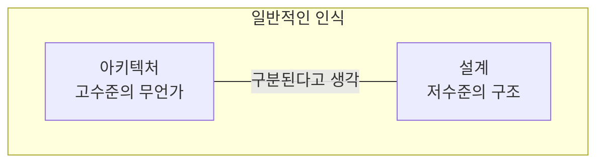
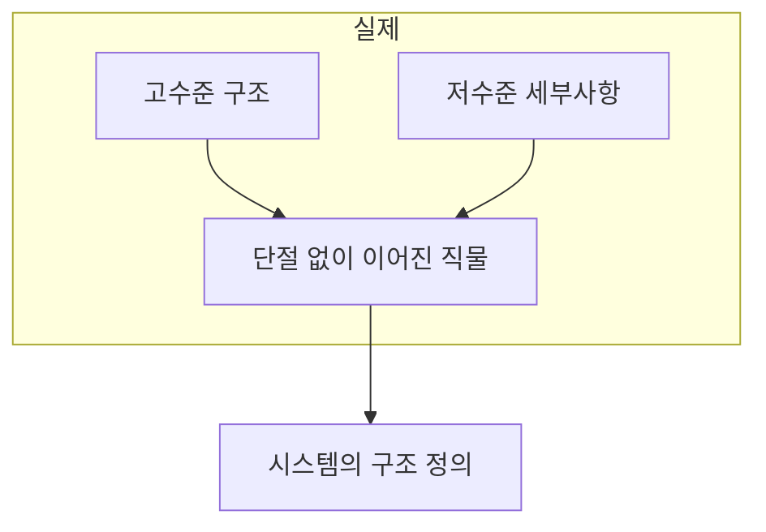
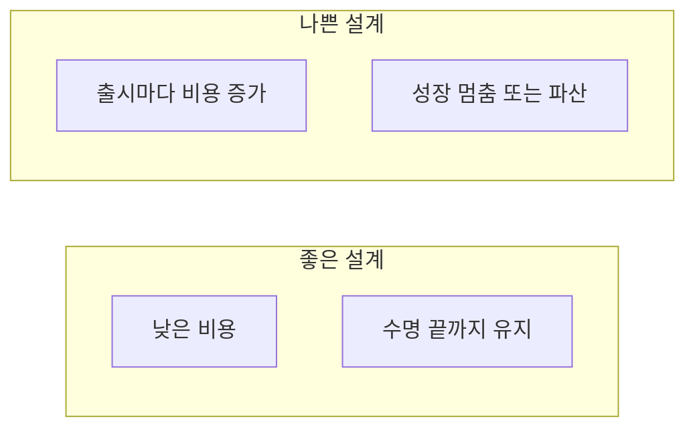
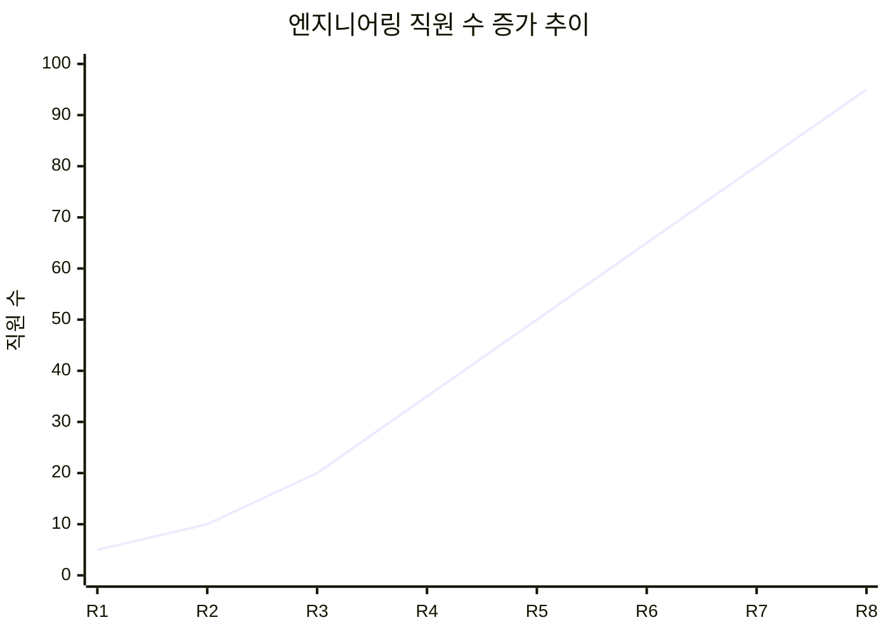
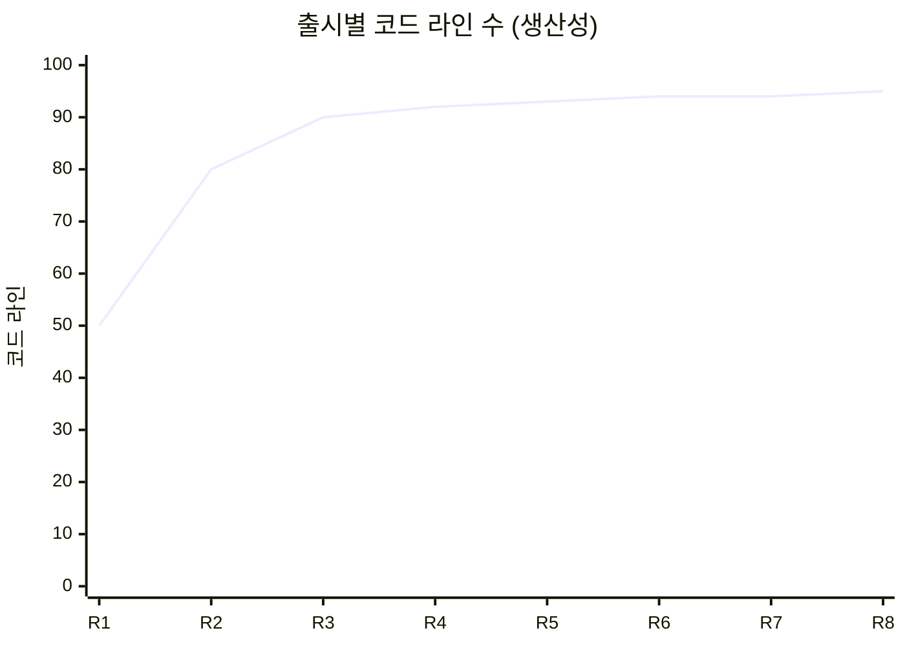
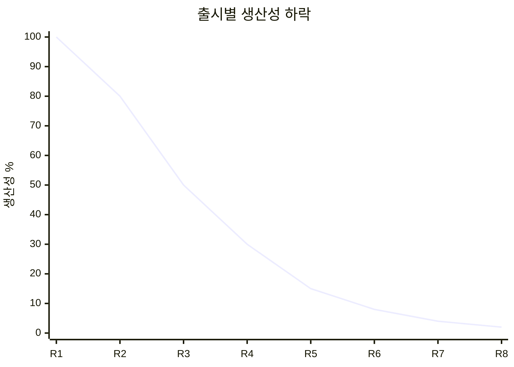
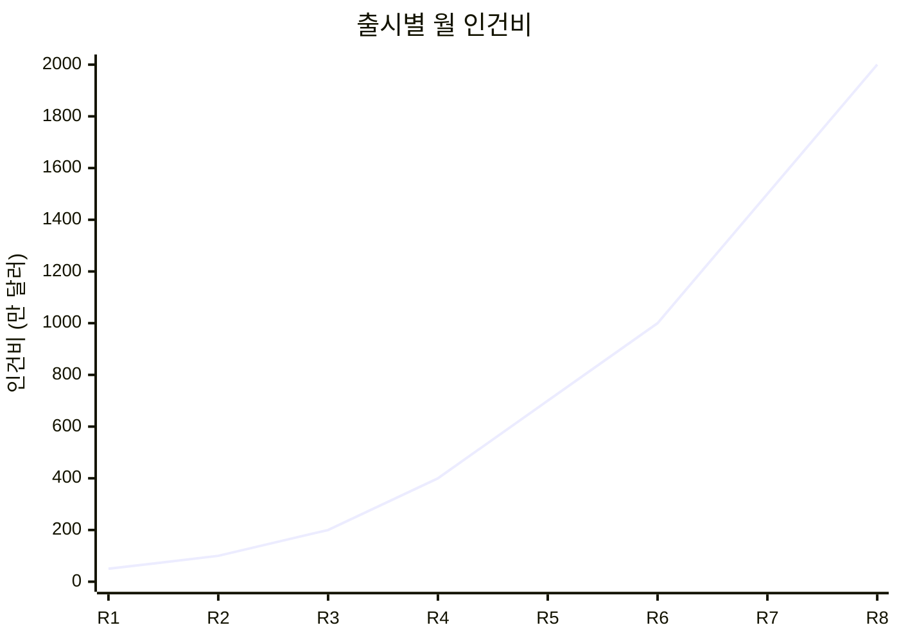
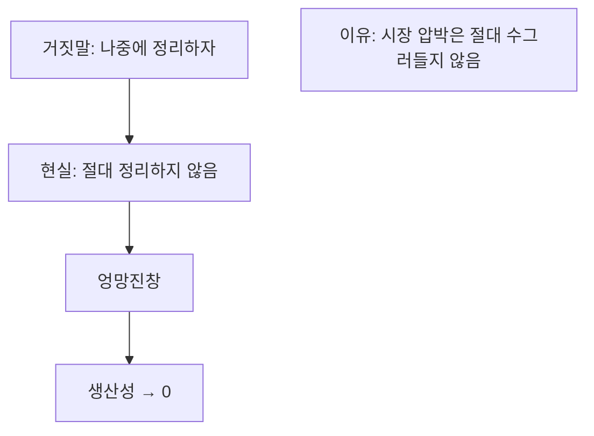
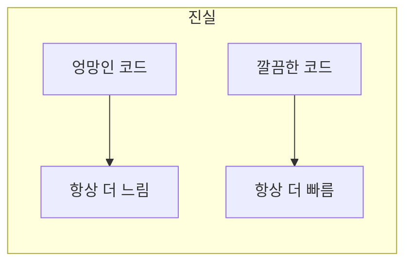
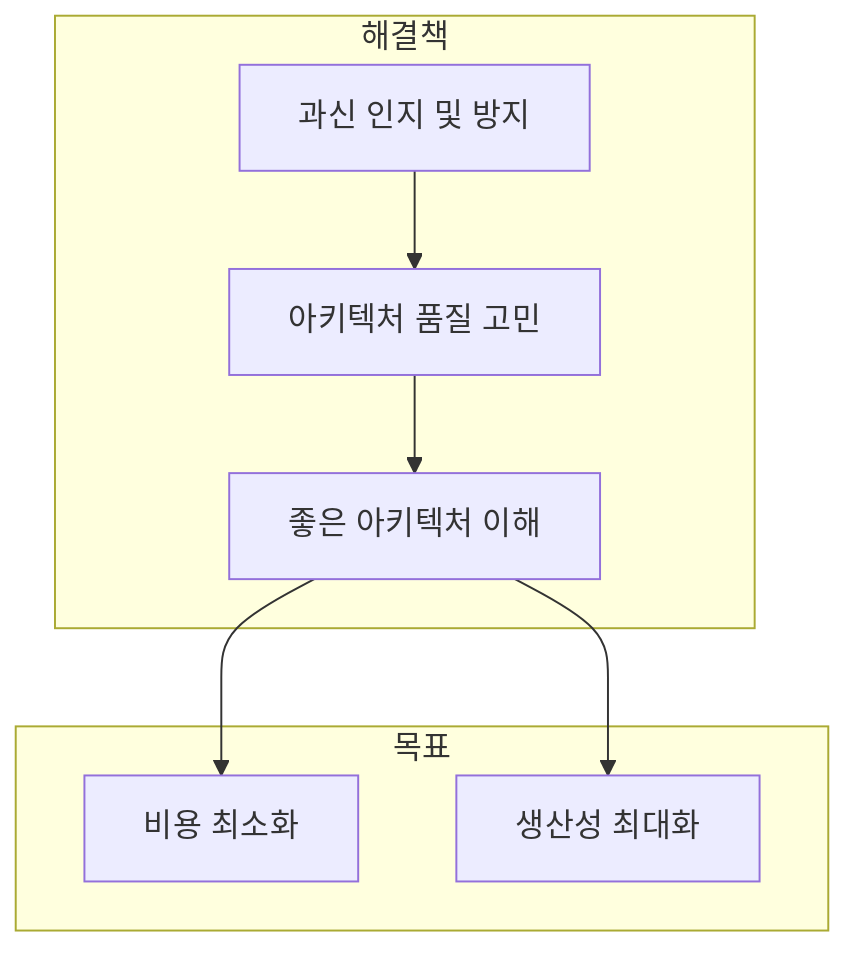

**설계(Design)와 아키텍처(Architecture) 사이에는 오랫동안 많은 혼란이 있었다.** 결론부터 얘기하면 **둘 사이에는 차이가 없다.**

## 설계 vs 아키텍처: 구분은 무의미하다

### 일반적인 인식



| 용어 | 일반적 인식 |
|------|-----------|
| 아키텍처 | 저수준의 세부사항과는 분리된 **고수준**의 무언가 |
| 설계 | **저수준**의 구조 또는 결정사항 |

### 마틴의 결론

> "하지만 아키텍트가 실제로 하는 일을 살펴보면 이러한 구분은 무의미하다."



**저수준의 세부사항과 고수준의 구조는 모두 소프트웨어 전체 설계의 구성요소다.** 이 둘은 단절 없이 이어진 직물과 같으며, 이를 통해 대상 시스템의 구조를 정의한다.

### 의사결정의 연속성

개별로는 존재할 수 없고, 실제로 이 둘을 구분 짓는 경계는 뚜렷하지 않다. **고수준에서 저수준으로 향하는 의사결정의 연속성**만이 있을 뿐이다.

```java
// 고수준 결정: 계층 구조
// - Presentation Layer
// - Business Layer  
// - Data Access Layer

// 저수준 결정: 구체적인 구현
public class OrderRepository {
    // 어떤 ORM을 사용할 것인가?
    // 쿼리는 어떻게 최적화할 것인가?
    // 캐시 전략은?
}

// 둘 다 "설계"이자 "아키텍처"
```

## 목표는 무엇인가?

그렇다면 이러한 의사결정의 목표는? 좋은 소프트웨어의 목표는?

> "소프트웨어 아키텍처의 목표는 필요한 시스템을 만들고 유지보수하는 데 투입되는 **인력을 최소화**하는 데 있다."
> — Robert C. Martin

### 설계 품질의 척도

설계 품질을 재는 척도는 고객의 요구를 만족시키는 데 드는 **비용을 재는 척도**와 다름이 없다.



| 설계 품질 | 비용 패턴 |
|----------|----------|
| 좋은 설계 | 비용이 낮고 시스템 수명 끝까지 낮게 유지 |
| 나쁜 설계 | 새로운 기능 출시할 때마다 비용 증가 |

## 사례 연구: 실제 회사의 데이터

마틴은 실제 회사의 데이터를 통해 나쁜 설계의 결과를 보여준다.

### 1. 엔지니어링 직원 수의 증가



이러한 추세를 보면 분명 **굉장한 성공**을 이뤄냈음을 가리키는 지표라고 여길 것이다.

### 2. 같은 기간의 생산성

하지만 같은 기간의 **생산성(코드 라인 수)**을 보면:



무언가가 명백히 **잘못되었다**. 매번 새로운 기능을 출시할 때마다 개발자의 수는 지속적으로 증가했지만, 코드 생산성은 마치 한 곳으로 **수렴**하는 것처럼 보인다.

### 3. 코드 라인당 비용

가장 두려운 그래프:

```mermaid
xychart-beta
    title "코드 라인당 비용"
    x-axis [R1, R2, R3, R4, R5, R6, R7, R8]
    y-axis "비용" 0 --> 100
    line [5, 10, 20, 30, 45, 60, 80, 95]
```

| 출시 | 비용 변화 |
|------|----------|
| 1차 → 8차 | **40배** 증가 |

이러한 방향으로는 지금 당장의 수익은 낼지 몰라도 결국 회사의 **성장을 멈추게** 하거나 **완전히 망하게** 만든다.

## 엉망진창이 되어 가는 신호

### 생산성 곡선



시스템을 급하게 만들거나, 결과물의 총량을 순전히 프로그래머 수만으로 결정하거나, 코드와 설계의 구조를 깔끔하게 만들려는 생각을 전혀 하지 않으면 **생산성이 0으로 수렴**한다.

### 개발자의 절망

개발자 입장에서 보면 이러한 현상은 큰 **절망감**을 안겨준다:

```java
// 개발자의 하루
public class DeveloperDay {
    private static final int HOURS_PER_DAY = 8;
    
    public void work() {
        int hoursOnNewFeature = 1;      // 새 기능 개발
        int hoursOnMess = 7;            // 엉망인 상황 대처
        
        // 노력의 가치가 보잘것없어짐
        double productivity = (double) hoursOnNewFeature / HOURS_PER_DAY;
        // productivity = 0.125 (12.5%)
    }
}
```

- 모두가 전력을 기울여 **열심히 일하고 있음**
- 하지만 **더 이상 발전이 없는 상황**
- 개발자의 노력은 기능 개발보다는 **엉망이 된 상황에 대처**하는 데 소모

## 경영자의 시각

경영자 입장에서 **월별 인건비** 추이:



| 출시 | 인건비 | 결과물 |
|------|--------|--------|
| 1차 | 수십만 달러 | 많은 기능 |
| 8차 | 2천만 달러 | 거의 없음 |

## 무엇이 잘못되었나?

### 흔해 빠진 거짓말 #1

> "코드는 나중에 정리하면 돼. 당장은 시장에 출시하는 게 먼저야!"



시장 출시가 먼저라는 생각을 하는 이유:
- 뒤에 여러 무리의 **경쟁자**가 뒤쫓고 있음
- 경쟁자보다 앞서 가려면 가능한 한 **빠르게 달려야** 함

### 흔해 빠진 거짓말 #2

> "지저분한 코드를 작성하면 단기간에는 빠르게 갈 수 있고, 장기적으로 볼 때만 생산성이 낮아진다."

```java
// 이 거짓말을 믿으면...
public class Overconfidence {
    
    // "지금은 빨리 가고, 나중에 정리하면 되지"
    void shortTermThinking() {
        writeMessyCode();
        // ... 시간이 지남 ...
        // "다음 기능이 기다리고 있어!"
        // ... 또 시간이 지남 ...
        // "이제 정리할 시간이... 없어."
    }
}
```

### 진실

> "엉망으로 만들면 깔끔하게 유지할 때보다 **항상 더 느리다**. 시간 척도를 어떻게 보든지 관계없이 말이다."



> **"빨리 가는 유일한 방법은 제대로 가는 것이다."**

## 재설계의 함정

개발자는 처음부터 다시 시작하여 전체 시스템을 **재설계**하는 것이 해답이라고 생각할지도 모른다.

```java
// "이번에는 다르게 할 거야!"
public class Redesign {
    
    // 하지만...
    void sameOverconfidence() {
        // 엉망으로 내몰았던 바로 그 과신이
        // 다시 시작하면 더 나은 코드를 만들 수 있다고 말함
    }
}
```

> "자신을 과신한다면 재설계하더라도 원래의 프로젝트와 똑같이 엉망으로 내몰린다."

## 결론

어떤 경우에도 개발 조직이 할 수 있는 최고의 선택지:



1. 조직에 스며든 **과신을 인지**하여 방지
2. 소프트웨어 아키텍처의 **품질을 심각하게 고민**
3. 좋은 소프트웨어 아키텍처가 **무엇인지 이해**

### 핵심 요약

| 항목 | 내용 |
|------|------|
| 설계 vs 아키텍처 | 차이 없음. 둘 다 동일 |
| 아키텍처의 목표 | 인력 최소화 |
| 설계 품질 척도 | 비용 |
| 좋은 설계 | 비용이 낮고 일정하게 유지 |
| 나쁜 설계 | 출시마다 비용 증가 |
| 빨리 가는 방법 | 제대로 가는 것 |

> "비용은 최소화하고 생산성은 최대화할 수 있는 설계와 아키텍처를 가진 시스템을 만들려면, 이러한 결과로 이끌어줄 시스템 아키텍처가 지닌 속성을 알고 있어야 한다."
