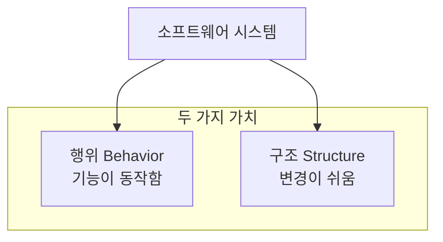
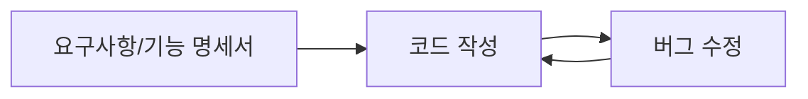
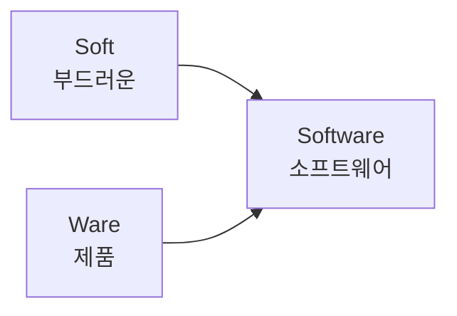
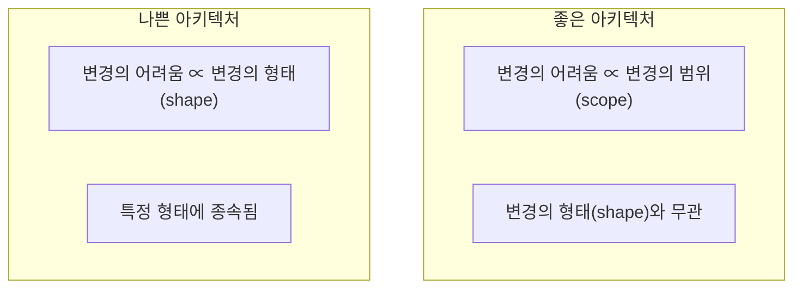
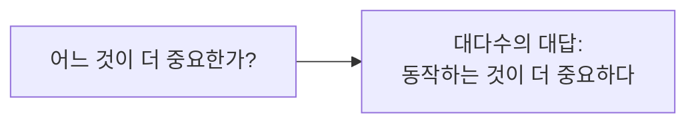
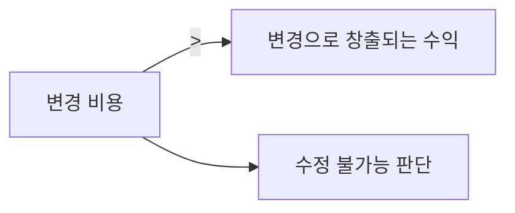
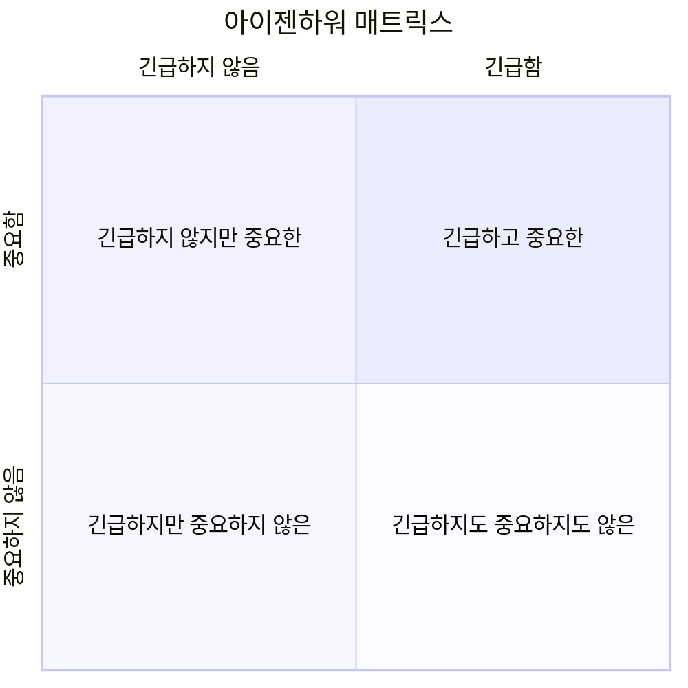
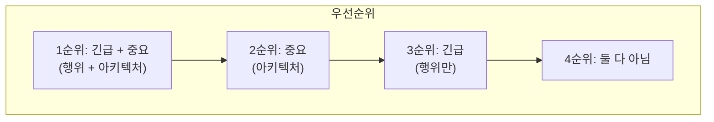
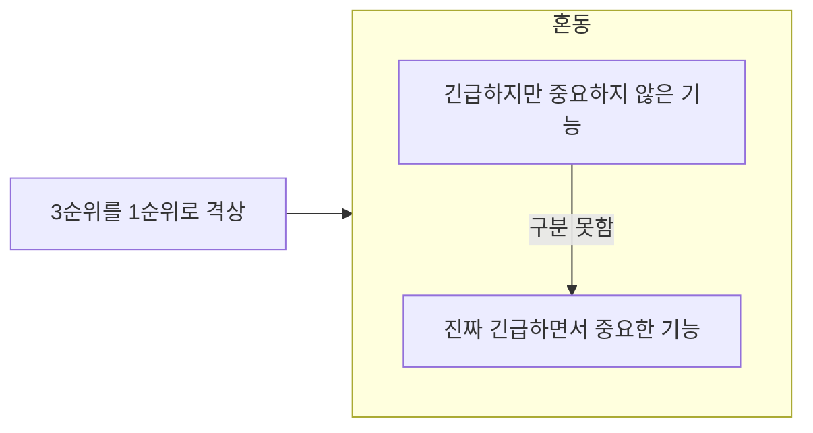
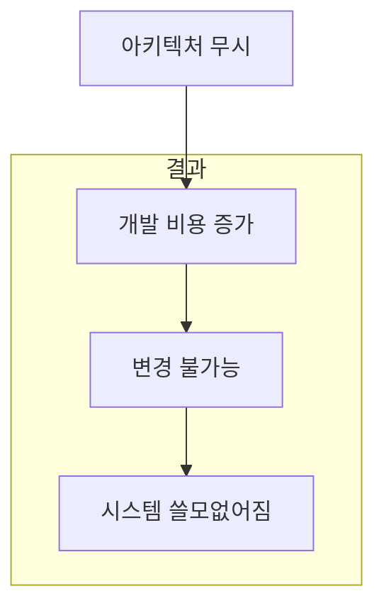

모든 소프트웨어 시스템은 이해관계자에게 서로 다른 **두 가지 가치**를 제공하는데, **행위(Behavior)**와 **구조(Structure)**가 바로 그것이다.

## 두 가지 가치



소프트웨어 개발자는 두 가치를 모두 반드시 **높게 유지해야 하는 책임**을 진다.

### 안타까운 현실

불행하게도 개발자는 **한 가지 가치에만 집중**하고 나머지 가치는 배제하곤 한다. 더 안타까운 일은 대체로 개발자가 **둘 중 덜 중요한 가치에 집중**하여 결국에는 소프트웨어 시스템이 쓸모없게 된다는 사실이다.

## 첫 번째 가치: 행위 (Behavior)

소프트웨어의 첫 번째 가치는 바로 **행위(Behavior)**다.

### 프로그래머의 일반적인 활동



프로그래머는:
- 기능 명세서나 요구사항 문서를 구체화할 수 있도록 돕는다
- 요구사항을 만족하도록 **코드를 작성**한다
- 요구사항을 위반하면, **문제를 고친다**

### 많은 프로그래머의 착각

```java
// 많은 프로그래머의 생각
public class MostProgrammers {
    
    // "내 직업은 이것이다"
    void myJob() {
        implementRequirements();  // 요구사항 구현
        fixBugs();                // 버그 수정
        // 끝!
    }
    
    // "이게 전부다"
    boolean isThisAllIHaveToDo() {
        return true;  // 슬픈 일이지만, 틀렸다
    }
}
```

> "많은 프로그래머가 이러한 활동이 자신이 해야 할 일의 전부라고 생각한다. 이들은 요구사항을 구현하고 버그를 수정하는 일이 자신의 직업이라고 믿는다. **슬픈 일이지만 그들은 틀렸다.**"

## 두 번째 가치: 구조 (Architecture)

소프트웨어의 두 번째 가치는 **'소프트웨어(Software)'**라는 단어와 관련이 있다.

### 소프트웨어의 어원



| 용어 | 의미 | 특징 |
|------|------|------|
| Software | 부드러운 제품 | 변경하기 **쉬움** |
| Hardware | 단단한 제품 | 변경하기 **어려움** |

### 소프트웨어의 본연의 목적

> "소프트웨어를 만든 이유는 기계의 행위를 **쉽게 변경**할 수 있도록 하기 위해서다."

소프트웨어가 가진 본연의 목적을 추구하려면 소프트웨어는 반드시 **부드러워야** 한다. 다시 말해 **변경하기 쉬워야** 한다.

### 변경의 어려움: 범위 vs 형태



이해관계자가 기능에 대한 생각을 바꾸면:
- ✅ **이상적**: 변경사항을 **간단하고 쉽게** 적용할 수 있어야 함
- ✅ **이상적**: 어려움은 변경되는 **범위(scope)**에 비례해야 함
- ❌ **현실**: 변경사항의 **형태(shape)**와 관련이 있음

### 사각형 마개와 동그란 구멍

```java
// 나쁜 아키텍처의 증상
public class SquarePegRoundHole {
    
    // 새로운 요청사항마다...
    void handleNewRequirement() {
        // 이전 변경보다 조금 더 힘들어짐
        // 왜? 시스템의 형태와 요구사항의 형태가 서로 맞지 않기 때문
        
        // 사각형 마개를 동그란 구멍에 밀어 넣는 느낌
        forceSquarePegIntoRoundHole();
    }
}
```

### 문제의 근원

**문제는 당연히 시스템의 아키텍처다.** 아키텍처가 특정 형태를 다른 형태보다 선호하면 할수록, 새로운 기능을 이 구조에 맞추는 게 더 힘들어진다.

> "따라서 아키텍처는 **형태에 독립적**이어야 하고, 그럴수록 더 실용적이다."

## 더 높은 가치: 기능 vs 아키텍처

**기능**인가 아니면 **아키텍처**인가? 둘 중 어느 것의 가치가 더 높은가?

### 대다수의 대답



대다수의 개발자와 업무관리자는 이렇게 답할 것이다:
> "소프트웨어 시스템이 **동작하는 것**이 더 중요하다."

### 논리적 반박: 양 극단의 사례

| 경우 | 특성 | 결과 |
|------|------|------|
| 경우 A | 완벽하게 동작하지만 **수정이 불가능** | 요구사항 변경 시 동작 안 함 → **쓸모없음** |
| 경우 B | 동작하지 않지만 **변경이 쉬움** | 동작하도록 만들 수 있음 → **계속 유용** |

```java
// 경우 A: 완벽하게 동작하지만 수정 불가
public final class PerfectButImmutable {
    // 이 클래스는 완벽하게 동작하지만...
    // 요구사항이 변경되면?
    // 동작하지 않게 되고, 고칠 수도 없다
    // 결론: 쓸모없다
}

// 경우 B: 동작하지 않지만 변경 쉬움
public class NotWorkingButFlexible {
    // 지금은 동작하지 않지만...
    // 쉽게 고칠 수 있다
    // 변경사항이 발생해도 여전히 동작하도록 유지보수 가능
    // 결론: 계속 유용하다
}
```

### 수정 불가능의 정의

수정이 **현실적으로 불가능**한 시스템은 존재하기 마련인데:



**변경에 드는 비용이 변경으로 창출되는 수익을 초과**하는 경우에는 수정이 불가능하다고 판단할 수 있다.

## 아이젠하워 매트릭스

**드와이트 D. 아이젠하워(Dwight D. Eisenhower)** 미국 대통령이 고안한 중요성과 긴급성에 관한 매트릭스:



### 핵심 통찰

> "긴급한 문제가 아주 중요한 문제일 경우는 드물고, 중요한 문제가 몹시 긴급한 경우는 거의 없다."

| 가치 | 긴급성 | 중요성 |
|------|--------|--------|
| 행위 (기능) | ✅ 긴급함 | ⚠️ 매번 높은 중요도는 아님 |
| 아키텍처 (구조) | ❌ 즉각적 긴급성 없음 | ✅ 항상 중요함 |

### 우선순위

최종적으로는 이들 네 가지 경우에 다음과 같이 우선순위를 매길 수 있다:

| 순위 | 유형 | 예시 |
|------|------|------|
| 1 | 긴급하고 중요한 | 보안 취약점 수정 + 아키텍처 개선 |
| 2 | 긴급하지 않지만 중요한 | 아키텍처 개선, 기술 부채 상환 |
| 3 | 긴급하지만 중요하지 않은 | 새 기능 빠른 출시 |
| 4 | 긴급하지도 중요하지도 않은 | 불필요한 최적화 |

### 아키텍처의 위치



**아키텍처, 즉 중요한 일은 가장 높은 두 순위**를 차지하고, 행위는 첫 번째와 세 번째에 위치한다는 점을 주목하자.

### 흔한 실수

업무 관리자와 개발자가 흔하게 저지르는 실수:



이러한 실패로 인해 시스템에서 **중요도가 높은 아키텍처를 무시**한 채 중요도가 떨어지는 기능을 선택하게 된다.

## 아키텍처를 위해 투쟁하라

```java
public class SoftwareDeveloper implements Stakeholder {
    
    @Override
    public void fight() {
        // 소프트웨어 개발자인 당신도 이해관계자임을 명심하라
        // 개발자인 우리도 소프트웨어를 안전하게 보호해야 할 책임이 있다
        protectArchitecture();
        fightForImportantThings();
    }
}
```

### 아키텍처 후순위의 결과

아키텍처가 후순위가 되면:
- 시스템을 개발하는 **비용이 더 많이** 든다
- 일부 또는 전체 시스템에 **변경을 가하는 일이 현실적으로 불가능**해진다



## 핵심 요약

| 항목 | 행위 (Behavior) | 구조 (Structure) |
|------|-----------------|------------------|
| 정의 | 기능이 동작함 | 변경이 쉬움 |
| 긴급성 | ✅ 높음 | ❌ 낮음 |
| 중요성 | ⚠️ 변동적 | ✅ 항상 높음 |
| 우선순위 | 1, 3순위 | 1, 2순위 |
| 무시 시 결과 | 기능 안 됨 | 변경 불가능 |

> "소프트웨어 개발자인 당신도 이해관계자임을 명심하라. 개발자인 우리도 소프트웨어를 안전하게 보호해야 할 책임이 있다."

| 결론 | 설명 |
|------|------|
| 두 가치 모두 중요 | 행위와 구조 둘 다 유지해야 함 |
| 아키텍처가 더 중요 | 장기적으로 구조가 더 큰 가치 |
| 개발자의 책임 | 아키텍처를 위해 투쟁해야 함 |
| 흔한 실수 회피 | 긴급한 것과 중요한 것 구분하기 |
