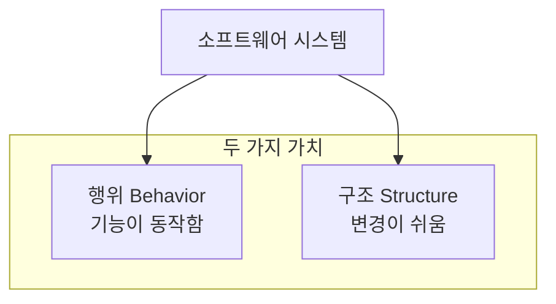
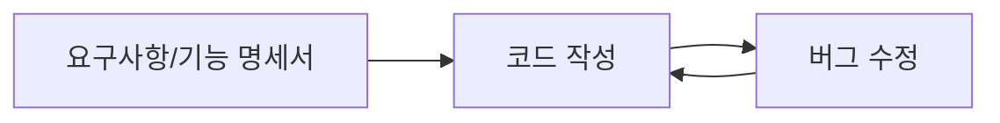
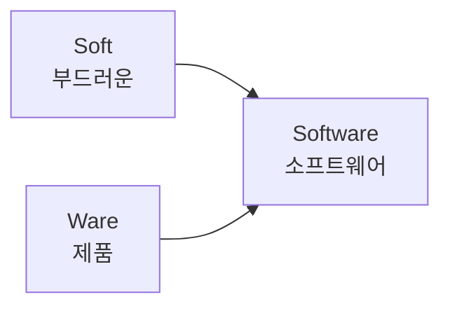
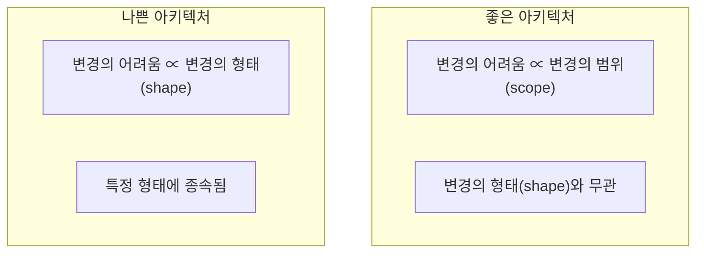
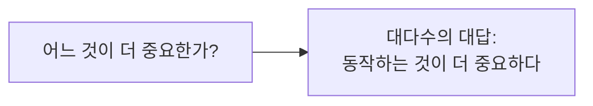
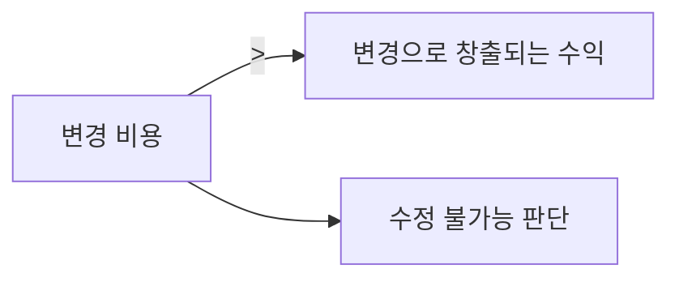
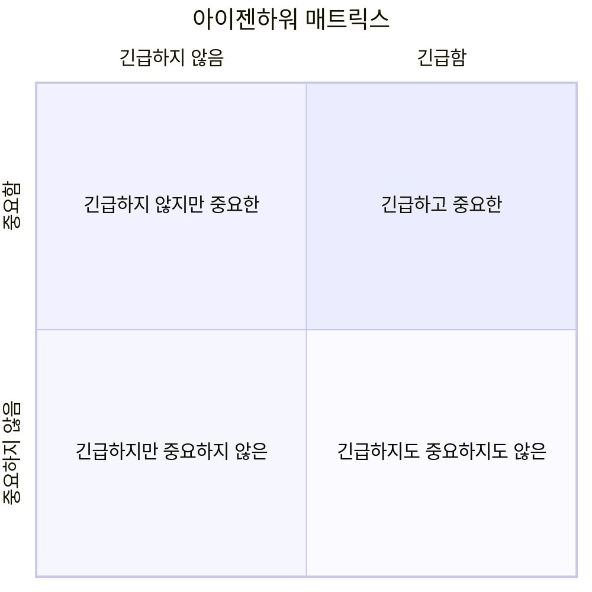
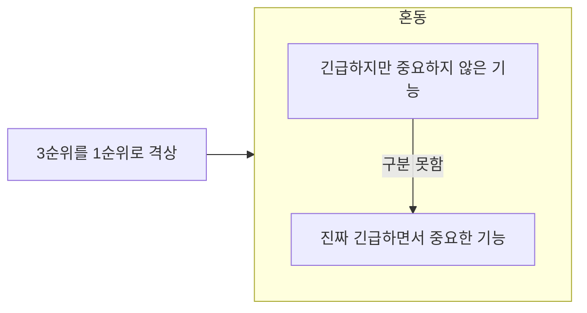
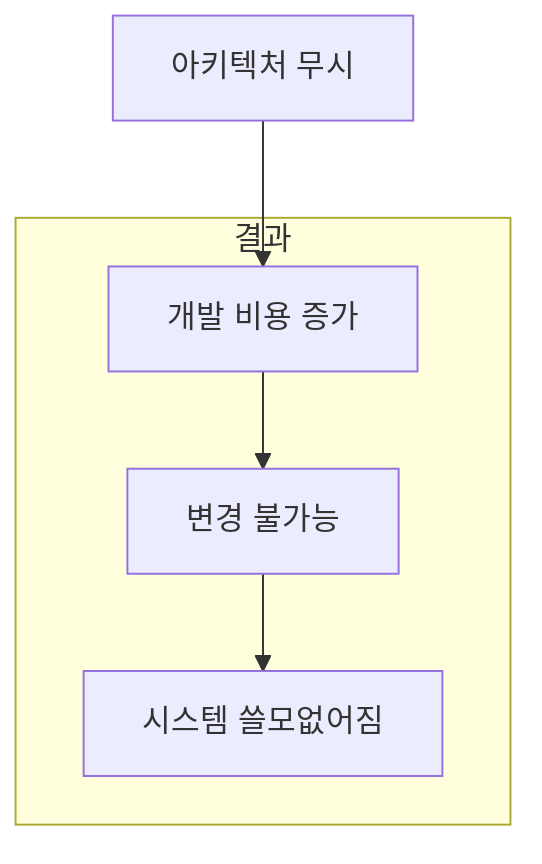

모든 소프트웨어 시스템은 이해관계자에게 서로 다른 **두 가지 가치**를 제공하는데, **행위(Behavior)**와 **구조(Structure)**가 바로 그것이다.

## 두 가지 가치


```mermaid
flowchart TB
    SOFTWARE[소프트웨어 시스템]
    
    subgraph Values [두 가지 가치]
        BEHAVIOR[행위 Behavior<br/>기능이 동작함]
        STRUCTURE[구조 Structure<br/>변경이 쉬움]
    end
    
    SOFTWARE --> BEHAVIOR
    SOFTWARE --> STRUCTURE
```

소프트웨어 개발자는 두 가치를 모두 반드시 **높게 유지해야 하는 책임**을 진다.

### 안타까운 현실

불행하게도 개발자는 **한 가지 가치에만 집중**하고 나머지 가치는 배제하곤 한다. 더 안타까운 일은 대체로 개발자가 **둘 중 덜 중요한 가치에 집중**하여 결국에는 소프트웨어 시스템이 쓸모없게 된다는 사실이다.

## 첫 번째 가치: 행위 (Behavior)

소프트웨어의 첫 번째 가치는 바로 **행위(Behavior)**다.

### 프로그래머의 일반적인 활동


```mermaid
flowchart LR
    REQ[요구사항/기능 명세서]
    CODE[코드 작성]
    BUG[버그 수정]
    
    REQ --> CODE --> BUG
    BUG --> CODE
```

프로그래머는:
- 기능 명세서나 요구사항 문서를 구체화할 수 있도록 돕는다
- 요구사항을 만족하도록 **코드를 작성**한다
- 요구사항을 위반하면, **문제를 고친다**

### 많은 프로그래머의 착각

```text
많은 프로그래머의 생각(의사코드):

1. 요구사항 명세서를 받는다
2. 명세서대로 코드를 작성한다
3. 요구사항을 위반하는 버그를 고친다
4. "내 직업은 이게 전부다" ← 이 결론이 틀렸다
```

마틴은 이렇게 지적한다: 많은 프로그래머가 이러한 활동이 자신이 해야 할 일의 전부라고 생각하며, 요구사항을 구현하고 버그를 수정하는 일이 자신의 직업이라고 믿는다. 슬픈 일이지만 그들은 틀렸다(Martin, *Clean Architecture*, 2017).

## 두 번째 가치: 구조 (Architecture)

소프트웨어의 두 번째 가치는 **'소프트웨어(Software)'**라는 단어와 관련이 있다.

### 소프트웨어의 어원


```mermaid
flowchart LR
    SOFT[Soft<br/>부드러운] 
    WARE[Ware<br/>제품]
    SOFTWARE[Software<br/>소프트웨어]
    
    SOFT --> SOFTWARE
    WARE --> SOFTWARE
```

| 용어 | 의미 | 특징 |
|------|------|------|
| Software | 부드러운 제품 | 변경하기 **쉬움** |
| Hardware | 단단한 제품 | 변경하기 **어려움** |

### 소프트웨어의 본연의 목적

마틴의 주장은 이렇다: 소프트웨어를 만든 이유는 기계의 행위를 **쉽게 변경**할 수 있도록 하기 위해서다(Martin, *Clean Architecture*, 2017). 소프트웨어가 가진 본연의 목적을 추구하려면 소프트웨어는 반드시 **부드러워야** 한다. 다시 말해 **변경하기 쉬워야** 한다.

### 변경의 어려움: 범위 vs 형태


```mermaid
flowchart TB
    subgraph Good [좋은 아키텍처]
        G1["변경의 어려움 ∝ 변경의 범위(scope)"]
        G2["변경의 형태(shape)와 무관"]
    end
    
    subgraph Bad [나쁜 아키텍처]
        B1["변경의 어려움 ∝ 변경의 형태(shape)"]
        B2["특정 형태에 종속됨"]
    end
```

이해관계자가 기능에 대한 생각을 바꾸면:
- ✅ **이상적**: 변경사항을 **간단하고 쉽게** 적용할 수 있어야 함
- ✅ **이상적**: 어려움은 변경되는 **범위(scope)**에 비례해야 함
- ❌ **현실**: 변경사항의 **형태(shape)**와 관련이 있음

### 사각형 마개와 동그란 구멍

아키텍처가 처음 정한 "형태"와 새 요구사항의 "형태"가 어긋나면, 요구사항을 억지로 기존 구조에 끼워 맞추는 코드가 쌓인다. 아래 예제는 컨트롤러 하나가 새 요구사항이 생길 때마다 메서드를 계속 늘려가는 전형적인 패턴을 보여준다.

```java
// 나쁜 아키텍처의 증상: MVC 컨트롤러 하나에 모든 신규 기능이 몰리는 경우
class OrderRequest {}

public class OrderController {
    // 원래 계획: 주문 생성만 처리
    public void createOrder(OrderRequest req) { /* ... */ }

    // 요구사항 1: 주문 생성 시 쿠폰 검증도 여기서 처리하라는 요청
    public void createOrderWithCoupon(OrderRequest req, String coupon) { /* ... */ }

    // 요구사항 2: 이제 재고 확인도 이 컨트롤러가 해야 한다는 요청
    public void createOrderWithCouponAndStock(OrderRequest req, String coupon) { /* ... */ }
    // 요구사항이 늘수록 새 메서드가 계속 곁가지로 붙는다 —
    // 컨트롤러의 "형태"가 애초에 이런 확장을 예상하지 못했기 때문이다.
}
```

### 문제의 근원

**문제는 당연히 시스템의 아키텍처다.** 아키텍처가 특정 형태를 다른 형태보다 선호하면 할수록, 새로운 기능을 이 구조에 맞추는 게 더 힘들어진다. 마틴은 따라서 아키텍처가 **형태에 독립적**이어야 하고, 그럴수록 더 실용적이라고 결론짓는다(Martin, *Clean Architecture*, 2017).

## 더 높은 가치: 기능 vs 아키텍처

**기능**인가 아니면 **아키텍처**인가? 둘 중 어느 것의 가치가 더 높은가?

### 대다수의 대답


```mermaid
flowchart LR
    Q["어느 것이 더 중요한가?"]
    A["대다수의 대답:<br/>동작하는 것이 더 중요하다"]
    
    Q --> A
```

대다수의 개발자와 업무관리자는 소프트웨어 시스템이 **동작하는 것**이 더 중요하다고 답할 것이다.

### 논리적 반박: 양 극단의 사례

| 경우 | 특성 | 결과 |
|------|------|------|
| 경우 A | 완벽하게 동작하지만 **수정이 불가능** | 요구사항 변경 시 동작 안 함 → **쓸모없음** |
| 경우 B | 동작하지 않지만 **변경이 쉬움** | 동작하도록 만들 수 있음 → **계속 유용** |

```text
경우 A: 완벽하게 동작하지만 수정 불가(의사코드)
- 모든 필드가 하드코딩된 단일 거대 클래스, 테스트도 문서도 없음
- 지금 당장은 요구사항을 100% 충족
- 요구사항이 바뀌는 순간 → 아무도 안전하게 고칠 수 없음 → 결론: 쓸모없어짐

경우 B: 동작하지 않지만 변경 쉬움(의사코드)
- 인터페이스와 책임이 명확히 분리된 골격 코드, 구현은 미완성
- 지금 당장은 요구사항을 충족하지 못함
- 변경 요청이 와도 어디를 고쳐야 할지 명확함 → 결론: 완성하면 계속 유용함
```

### 수정 불가능의 정의

수정이 **현실적으로 불가능**한 시스템은 존재하기 마련인데:


```mermaid
flowchart LR
    COST[변경 비용]
    REVENUE[변경으로 창출되는 수익]
    
    COST -->|">"| REVENUE
    RESULT[수정 불가능 판단]
    
    COST --> RESULT
```

**변경에 드는 비용이 변경으로 창출되는 수익을 초과**하는 경우에는 수정이 불가능하다고 판단할 수 있다.

## 아이젠하워 매트릭스

**드와이트 D. 아이젠하워(Dwight D. Eisenhower)**는 1954년 한 연설에서 "나에게는 두 가지 문제가 있다, 긴급한 것과 중요한 것이다"라는 취지의 말을 인용한 것으로 알려져 있다(본인이 만든 경구가 아니라, 이름이 알려지지 않은 한 대학 총장에게서 들었다고 밝혔다). 이 일화에서 후대에 도구화된 것이 오늘날의 아이젠하워 매트릭스다. 마틴은 이 틀을 빌려와 행위와 구조의 우선순위를 설명한다:


```mermaid
quadrantChart
    title 아이젠하워 매트릭스
    x-axis 긴급하지 않음 --> 긴급함
    y-axis 중요하지 않음 --> 중요함
    quadrant-1 긴급하고 중요한
    quadrant-2 긴급하지 않지만 중요한
    quadrant-3 긴급하지만 중요하지 않은
    quadrant-4 긴급하지도 중요하지도 않은
```

### 핵심 통찰

이 경구를 소프트웨어에 적용하면: 긴급한 문제가 아주 중요한 문제일 경우는 드물고, 중요한 문제가 몹시 긴급한 경우는 거의 없다.

| 가치 | 긴급성 | 중요성 |
|------|--------|--------|
| 행위 (기능) | ✅ 긴급함 | ⚠️ 매번 높은 중요도는 아님 |
| 아키텍처 (구조) | ❌ 즉각적 긴급성 없음 | ✅ 항상 중요함 |

### 우선순위

최종적으로는 이들 네 가지 경우에 다음과 같이 우선순위를 매길 수 있다:

| 순위 | 유형 | 예시 |
|------|------|------|
| 1 | 긴급하고 중요한 | 보안 취약점 수정 + 아키텍처 개선 |
| 2 | 긴급하지 않지만 중요한 | 아키텍처 개선, 기술 부채 상환 |
| 3 | 긴급하지만 중요하지 않은 | 새 기능 빠른 출시 |
| 4 | 긴급하지도 중요하지도 않은 | 불필요한 최적화 |

### 아키텍처의 위치

위 표를 유형이 아니라 **가치별로 다시 읽으면** 패턴이 드러난다. 아키텍처(중요함)는 1·2순위 두 자리를 모두 차지하는 반면, 행위(긴급함)는 1·3순위에 걸쳐 있다. 즉 아키텍처가 배제되는 경우는 4순위 하나뿐이지만, 행위가 배제되는 경우는 2·4순위 둘이다 — "아키텍처가 기능보다 중요하다"는 마틴의 주장은 이 비대칭에서 나온다.

### 흔한 실수

업무 관리자와 개발자가 흔하게 저지르는 실수:


```mermaid
flowchart LR
    WRONG["3순위를 1순위로 격상"]
    
    subgraph Confusion [혼동]
        A["긴급하지만 중요하지 않은 기능"]
        B["진짜 긴급하면서 중요한 기능"]
    end
    
    A -->|"구분 못함"| B
    WRONG --> Confusion
```

이러한 실패로 인해 시스템에서 **중요도가 높은 아키텍처를 무시**한 채 중요도가 떨어지는 기능을 선택하게 된다.

## 아키텍처를 위해 투쟁하라

개발자가 침묵하면 아키텍처 개선 요청은 기능 요청에 밀려 항상 후순위가 된다. 아래 예제는 개발자를 다른 이해관계자와 동등하게 "우려 사항을 제기할 권리와 의무가 있는 주체"로 모델링한 것이다.

```java
enum Priority { URGENT, IMPORTANT }

interface ArchitectureBoard {
    void submitConcern(String issue, Priority priority);
}

public interface Stakeholder {
    void raiseConcern(String issue, Priority priority);
}

// 소프트웨어 개발자도 이해관계자다 — 침묵하지 않고 목소리를 낸다
public class SoftwareDeveloper implements Stakeholder {
    private final ArchitectureBoard board;

    public SoftwareDeveloper(ArchitectureBoard board) {
        this.board = board;
    }

    @Override
    public void raiseConcern(String issue, Priority priority) {
        // 기능 요청과 동등한 자격으로 아키텍처 개선 요청을 백로그에 올린다
        board.submitConcern(issue, priority);
    }
}
```

### 아키텍처 후순위의 결과

아키텍처가 후순위가 되면:
- 시스템을 개발하는 **비용이 더 많이** 든다
- 일부 또는 전체 시스템에 **변경을 가하는 일이 현실적으로 불가능**해진다


```mermaid
flowchart TB
    IGNORE[아키텍처 무시]
    
    subgraph Results [결과]
        R1[개발 비용 증가]
        R2[변경 불가능]
        R3[시스템 쓸모없어짐]
    end
    
    IGNORE --> R1 --> R2 --> R3
```

## 핵심 요약

| 항목 | 행위 (Behavior) | 구조 (Structure) |
|------|-----------------|------------------|
| 정의 | 기능이 동작함 | 변경이 쉬움 |
| 긴급성 | ✅ 높음 | ❌ 낮음 |
| 중요성 | ⚠️ 변동적 | ✅ 항상 높음 |
| 우선순위 | 1, 3순위 | 1, 2순위 |
| 무시 시 결과 | 기능 안 됨 | 변경 불가능 |

마틴은 이렇게 당부한다: 소프트웨어 개발자인 당신도 이해관계자임을 명심하라. 개발자인 우리도 소프트웨어를 안전하게 보호해야 할 책임이 있다(Martin, *Clean Architecture*, 2017).

## 비판적 시각

이 장의 논증에는 한 가지 긴장이 있다. 마틴은 "아키텍처가 기능보다 중요하다"고 주장하지만, 동시에 "완벽하게 동작하지만 수정 불가능한 시스템은 쓸모없다"는 논증도 편다 — 즉 행위(동작함)가 최소 조건으로 전제된 뒤에야 구조의 우선순위 논증이 성립한다. 실무에서는 "아키텍처가 항상 기능보다 먼저"라는 구호가 스타트업 초기 단계처럼 시장 검증이 급한 상황에서는 오히려 해로울 수 있다는 반론도 있다 — 이 경우 "변경 가능한 최소 구조"와 "빠른 시장 검증" 사이의 균형이 관건이지, 구조의 절대 우위가 아니다.

## 학습 목표

이 장을 읽은 후 다음을 할 수 있어야 한다.

- 행위와 구조가 왜 둘 다 필요하며, 어느 하나만으로는 시스템이 쓸모없어지는지 사례로 설명할 수 있다.
- "변경의 어려움이 범위가 아니라 형태에 비례한다"는 나쁜 아키텍처의 증상을 코드로 식별할 수 있다.
- 아이젠하워 매트릭스를 이용해 행위(긴급)와 구조(중요) 작업의 우선순위를 판단할 수 있다.

## 판단 기준

이 장의 원칙을 "아키텍처가 항상 최우선"으로 단순화하지 않는 것이 중요하다. 실제로는 다음 세 가지를 함께 확인해 균형점을 찾는다.

- **되돌리기 비용**: 지금 이 기능을 구조 개선 없이 그냥 구현하면, 나중에 올바른 구조로 되돌리는 데 드는 비용이 얼마나 되는가? 되돌리기 쉬운 영역(예: 화면 문구 하나)은 빠르게 기능부터 만들어도 된다.
- **경계의 핵심성**: 이 코드가 시스템 전체가 의존하는 핵심 경계(예: 결제 처리, 도메인 모델)에 있는가, 아니면 주변부 기능인가? 핵심 경계일수록 구조 투자의 회수 기간이 짧다 — 이후 추가되는 모든 기능이 그 경계 위에 쌓이기 때문이다.
- **긴급성의 진위**: 지금 "긴급하다"고 느껴지는 요구가 실제로 마감이 있는 긴급 사안(1순위)인지, 아니면 "빨리 처리하고 싶다"는 압박이 긴급으로 착각되는 3순위 사안인지 구분한다. 흔한 실수 절에서 보듯, 이 구분에 실패하면 아키텍처 개선이 계속 뒤로 밀린다.

되돌리기 어려운 핵심 경계는 처음부터 구조에 투자하고, 되돌리기 쉬운 주변부는 기능을 먼저 만드는 것이 현실적인 절충안이다.

## 참고 자료

- Martin, R. C. (2017). *Clean Architecture: A Craftsman's Guide to Software Structure and Design*. Prentice Hall.

## 다음 장에서는

다음 장에서는 소프트웨어 아키텍처의 벽돌이 되는 **프로그래밍 패러다임**을 다룬다. 구조적 프로그래밍, 객체 지향, 함수형 프로그래밍이 각각 아키텍처에 어떤 제약을 가하는지 살펴본다.
