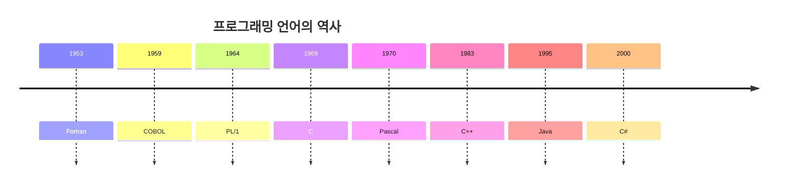
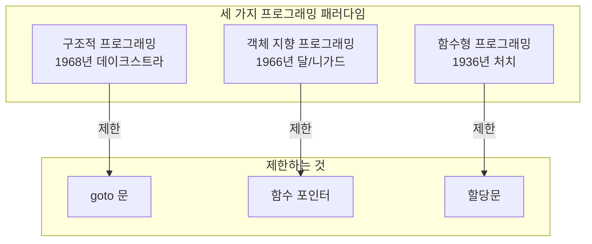
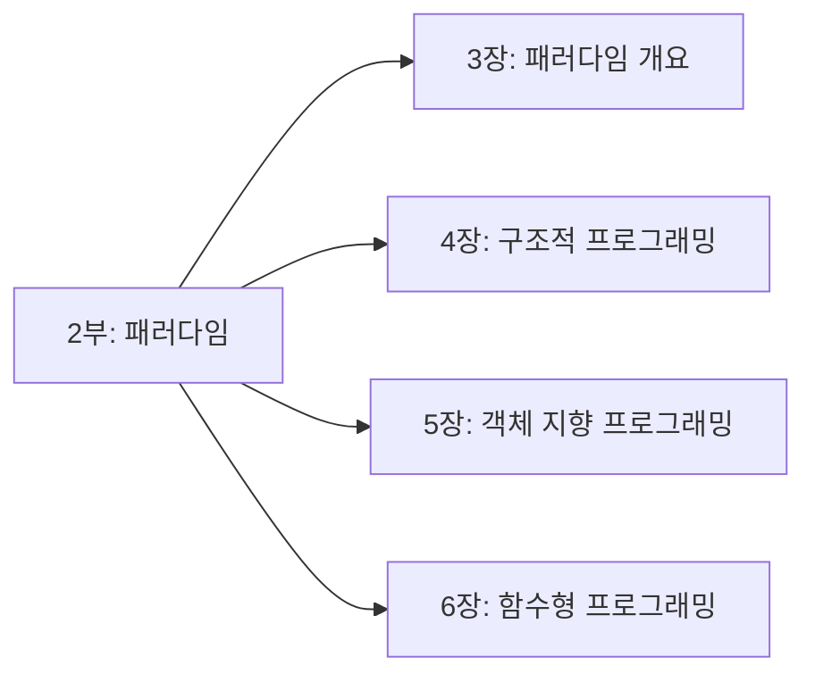

소프트웨어 아키텍처는 **코드(code)**로부터 시작한다. 따라서 아키텍처에 대한 논의도 코드가 최초로 작성된 시점부터, 우리가 코드를 통해 배운 내용을 살펴보는 데서 출발하고자 한다.

## 코드의 탄생: 1945년

1945년경에 앨런 튜링(Alan Turing)은 사람이 식별할 수 있는 형태의 실질적인 프로그램을 실제 컴퓨터에서 코드로 작성했다. 이들 프로그램은 반복문, 분기문, 할당문, 서브루틴(Subroutine), 스택(Stack) 등 우리에게 익숙한 구조를 사용했다. 그리고 **바이너리 언어**를 사용했다.

```
// 초기 컴퓨터의 바이너리 코드 예시 (개념적)
0001 0100 0010 0000  // LOAD R1, 32
0010 0100 0011 0000  // ADD R1, 48
0011 0100 0000 1000  // STORE R1, 8
```

## 프로그래밍 언어의 진화

이때 이후로 프로그래밍에는 수많은 혁신적인 변화가 이뤄졌다.

### 어셈블러의 등장 (1940년대 후반)

1940년대 후반 **어셈블러(Assembler)**가 처음으로 등장했다. 이 '언어'의 등장으로, 바이너리 코드로 프로그램을 작성해야 했던 프로그래머의 단조롭고 고된 일이 줄어들었다.

```asm
; 어셈블리 언어 예시
LOAD  R1, VALUE1
ADD   R1, VALUE2
STORE R1, RESULT
```

### 최초의 컴파일러: A-0 (1951년)

1951년 **그레이스 호퍼(Grace Hopper)**는 최초의 컴파일러인 **A-0**를 발명했다. 사실 '컴파일러(compiler)'라는 용어도 그레이스가 처음으로 만들었다.

### 고급 언어의 홍수

**포트란(Fortran)**은 1953년에 발명되었다. 이처럼 새로운 프로그래밍 언어는 쉴 틈 없이 홍수처럼 쏟아졌다.



| 연도 | 언어 | 특징 |
|------|------|------|
| 1953 | Fortran | 과학 계산용 최초의 고급 언어 |
| 1959 | COBOL | 비즈니스 처리용 |
| 1969 | C | 시스템 프로그래밍 |
| 1970 | Pascal | 교육용, 구조적 프로그래밍 |
| 1983 | C++ | 객체 지향 + C |
| 1995 | Java | 플랫폼 독립적 |

## 프로그래밍 패러다임의 혁명

또 다른, 아마도 더 중요한 혁신적인 변화가 **프로그래밍 패러다임(Paradigm)**에도 몰아쳤다.

### 패러다임이란?

> "패러다임이란 프로그래밍을 하는 방법으로, 대체로 언어에는 독립적이다."
> — Robert C. Martin

패러다임은 어떤 프로그래밍 구조를 사용할지, 그리고 언제 이 구조를 사용해야 하는지를 결정한다.

### 세 가지 패러다임

현재까지 이러한 패러다임에는 **세 가지 종류**가 있다:



| 패러다임 | 등장 시기 | 제한하는 것 | 아키텍처 적용 |
|----------|----------|-------------|---------------|
| 구조적 프로그래밍 | 1968년 | goto 문 | 모듈의 기반 알고리즘 |
| 객체 지향 프로그래밍 | 1966년 | 함수 포인터 | 경계를 넘나드는 다형성 |
| 함수형 프로그래밍 | 1936년 | 할당문 | 데이터 위치와 접근 규칙 |

## 패러다임과 아키텍처의 관계

각 패러다임은 아키텍처에 직접적인 영향을 미친다:

### 구조적 프로그래밍 → 알고리즘

```java
// 구조적 프로그래밍: 순차, 선택, 반복만 사용
public int calculateSum(int[] numbers) {
    int sum = 0;
    for (int number : numbers) {  // 반복
        if (number > 0) {          // 선택
            sum += number;         // 순차
        }
    }
    return sum;
}
```

### 객체 지향 프로그래밍 → 경계와 다형성

```java
// 다형성을 통한 경계 횡단
public interface Repository {
    void save(Entity entity);
}

public class MySqlRepository implements Repository {
    public void save(Entity entity) { /* MySQL 구현 */ }
}

public class MongoRepository implements Repository {
    public void save(Entity entity) { /* MongoDB 구현 */ }
}
```

### 함수형 프로그래밍 → 불변성과 데이터 흐름

```java
// 불변성: 데이터를 변경하지 않고 새로 생성
List<Integer> doubled = numbers.stream()
    .map(n -> n * 2)
    .collect(Collectors.toList());
```

## 이 파트에서 다룰 내용



| 장 | 제목 | 핵심 내용 |
|----|------|----------|
| 3장 | 패러다임 개요 | 세 패러다임의 부정적 규칙 |
| 4장 | 구조적 프로그래밍 | goto 문 제거와 증명 가능한 프로그램 |
| 5장 | 객체 지향 프로그래밍 | 다형성과 의존성 역전 |
| 6장 | 함수형 프로그래밍 | 불변성과 동시성 |

## 핵심 요약

> "아키텍처의 벽돌은 패러다임이다. 패러다임은 무엇을 해서는 안 되는지를 알려줌으로써, 우리가 더 나은 구조를 만들도록 이끈다."

| 항목 | 설명 |
|------|------|
| 코드의 시작 | 1945년 튜링의 바이너리 프로그램 |
| 패러다임의 수 | 딱 3가지 (앞으로도 추가 없음) |
| 패러다임의 본질 | 프로그래머에게서 무언가를 빼앗음 |
| 아키텍처와의 관계 | 모든 패러다임이 아키텍처에 영향 |

다음 장에서는 이 세 가지 패러다임을 더 자세히 살펴보고, 각 패러다임이 아키텍처에 어떤 영향을 미치는지 알아본다.
