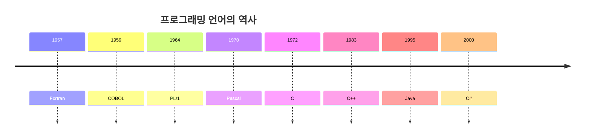
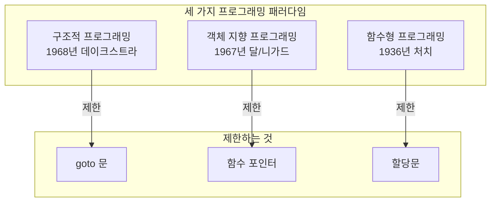
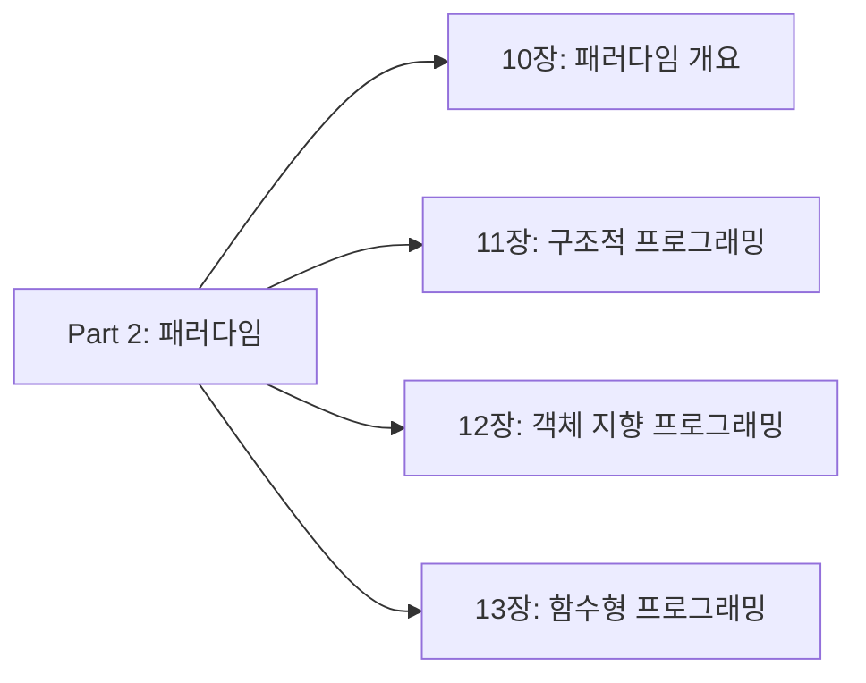

소프트웨어 아키텍처는 **코드(code)**로부터 시작한다. 따라서 아키텍처에 대한 논의도 코드가 최초로 작성된 시점부터, 우리가 코드를 통해 배운 내용을 살펴보는 데서 출발하고자 한다.

## 코드의 탄생: 1945~1950년

1945년 앨런 튜링(Alan Turing)은 영국 국립물리연구소(NPL)에서 ACE(Automatic Computing Engine)의 설계를 제안했다. 이 설계에는 반복문, 분기문, 할당문, 서브루틴(Subroutine), 스택(Stack) 등 오늘날에도 익숙한 구조가 이미 담겨 있었다. 실제로 사람이 식별할 수 있는 형태의 프로그램이 물리적 컴퓨터에서 실행된 것은 이보다 조금 뒤인 1948~1950년, 맨체스터의 실험 기계와 NPL의 Pilot ACE(튜링의 설계를 축소 구현한 기종)에서였다. 이 초기 프로그램들은 **바이너리 언어**로 작성되었다.

```text
// 초기 컴퓨터의 바이너리 코드 예시 (개념적)
0001 0100 0010 0000  // LOAD R1, 32
0010 0100 0011 0000  // ADD R1, 48
0011 0100 0000 1000  // STORE R1, 8
```

## 프로그래밍 언어의 진화

이때 이후로 프로그래밍에는 수많은 혁신적인 변화가 이뤄졌다.

### 어셈블러의 등장 (1940년대 후반)

1940년대 후반 **어셈블러(Assembler)**가 처음으로 등장했다. 이 '언어'의 등장으로, 바이너리 코드로 프로그램을 작성해야 했던 프로그래머의 단조롭고 고된 일이 줄어들었다.

```asm
; 어셈블리 언어 예시
LOAD  R1, VALUE1
ADD   R1, VALUE2
STORE R1, RESULT
```

### 최초의 컴파일러: A-0 (1951년)

1951~1952년 **그레이스 호퍼(Grace Hopper)**는 최초의 컴파일러로 널리 알려진 **A-0**를 완성했다. '컴파일러(compiler)'라는 용어도 그레이스가 만든 것으로 알려져 있다(다만 "최초의 컴파일러" 타이틀에는 정의에 따라 이견도 있다).

### 고급 언어의 홍수

**포트란(Fortran)**은 1954년 존 배커스(John Backus)가 이끄는 IBM 팀이 설계를 제안했고, 1957년 최초의 컴파일러가 출시되었다. 이처럼 새로운 프로그래밍 언어는 쉴 틈 없이 홍수처럼 쏟아졌다. 아래 연표는 그 흐름 중 이후 패러다임 논의와 직접 연결되는 언어들만 추려 정리한 것이다 — Fortran과 COBOL은 절차 지향의 초기 형태를, C는 구조적 프로그래밍의 정착을, C++·Java는 이후 살펴볼 객체 지향 패러다임의 주류화를 각각 대표한다.


```mermaid
timeline
    title 프로그래밍 언어의 역사
    1957 : Fortran
    1959 : COBOL
    1964 : PL/1
    1970 : Pascal
    1972 : C
    1983 : C++
    1995 : Java
    2000 : C#
```

| 연도 | 언어 | 특징 |
|------|------|------|
| 1957 | Fortran | 과학 계산용 최초의 고급 언어(설계는 1954년 시작) |
| 1959 | COBOL | 비즈니스 처리용 |
| 1970 | Pascal | 교육용, 구조적 프로그래밍 |
| 1972 | C | 시스템 프로그래밍(데니스 리치, Bell Labs) |
| 1983 | C++ | 객체 지향 + C |
| 1995 | Java | 플랫폼 독립적 |

## 프로그래밍 패러다임의 혁명

또 다른, 아마도 더 중요한 혁신적인 변화가 **프로그래밍 패러다임(Paradigm)**에도 몰아쳤다.

### 패러다임이란?

마틴은 패러다임을 이렇게 정의한다: 패러다임이란 프로그래밍을 하는 방법으로, 대체로 언어에는 독립적이다(Martin, *Clean Architecture*, 2017).

패러다임은 어떤 프로그래밍 구조를 사용할지, 그리고 언제 이 구조를 사용해야 하는지를 결정한다.

### 세 가지 패러다임

현재까지 이러한 패러다임에는 **세 가지 종류**가 있다:


```mermaid
flowchart TB
    subgraph Paradigms [세 가지 프로그래밍 패러다임]
        SP[구조적 프로그래밍<br/>1968년 데이크스트라]
        OOP[객체 지향 프로그래밍<br/>1967년 달/니가드]
        FP[함수형 프로그래밍<br/>1936년 처치]
    end
    
    subgraph Restrictions [제한하는 것]
        R1[goto 문]
        R2[함수 포인터]
        R3[할당문]
    end
    
    SP -->|제한| R1
    OOP -->|제한| R2
    FP -->|제한| R3
```

| 패러다임 | 등장 시기 | 제한하는 것 | 아키텍처 적용 |
|----------|----------|-------------|---------------|
| 구조적 프로그래밍 | 1968년 | goto 문 | 모듈의 기반 알고리즘 |
| 객체 지향 프로그래밍 | 1967년 | 함수 포인터 | 경계를 넘나드는 다형성 |
| 함수형 프로그래밍 | 1936년 | 할당문 | 데이터 위치와 접근 규칙 |

## 패러다임과 아키텍처의 관계

각 패러다임은 아키텍처에 직접적인 영향을 미친다:

### 구조적 프로그래밍 → 알고리즘

구조적 프로그래밍은 goto를 없애고 순차·선택·반복 세 가지 제어 구조만 허용함으로써, 함수 내부의 알고리즘을 증명 가능하고 예측 가능한 형태로 제한한다. 아래 코드는 이 세 구조만으로 로직을 표현한 예다.

```java
public class OrderTotals {
    // 구조적 프로그래밍: 순차, 선택, 반복만 사용
    public int calculateSum(int[] numbers) {
        int sum = 0;
        for (int number : numbers) {  // 반복
            if (number > 0) {          // 선택
                sum += number;         // 순차
            }
        }
        return sum;
    }
}
```

### 객체 지향 프로그래밍 → 경계와 다형성

OOP는 함수 포인터의 위험한 사용을 다형성이라는 안전한 형태로 제한한다. 이 다형성 덕분에 고수준 코드가 저수준 구현을 몰라도 되는 경계(포트/어댑터 패턴의 기반)를 그을 수 있다.

```java
// 다형성을 통한 경계 횡단 (Entity, JdbcTemplate, MongoTemplate은 각 프레임워크가 제공하는 타입)
public interface Repository {
    void save(Entity entity);
}

public class MySqlRepository implements Repository {
    private final JdbcTemplate jdbcTemplate;
    public MySqlRepository(JdbcTemplate jdbcTemplate) { this.jdbcTemplate = jdbcTemplate; }
    public void save(Entity entity) {
        jdbcTemplate.update("INSERT INTO entities VALUES (?)", entity.getId());
    }
}

public class MongoRepository implements Repository {
    private final MongoTemplate mongoTemplate;
    public MongoRepository(MongoTemplate mongoTemplate) { this.mongoTemplate = mongoTemplate; }
    public void save(Entity entity) {
        mongoTemplate.save(entity);
    }
}
```

### 함수형 프로그래밍 → 불변성과 데이터 흐름

FP는 할당문(변수 재대입)을 제한함으로써 데이터가 어디서 변경되는지 추적할 필요를 없앤다. 아래 코드는 원본 리스트를 변경하지 않고 새 리스트를 만들어내는 방식을 보여준다.

```java
// 불변성: 데이터를 변경하지 않고 새로 생성
List<Integer> numbers = List.of(1, 2, 3, 4, 5);
List<Integer> doubled = numbers.stream()
    .map(n -> n * 2)
    .collect(Collectors.toList());
// numbers는 그대로이고, doubled는 새로 생성된 리스트다
```

## 이 파트에서 다룰 내용


```mermaid
flowchart LR
    P2[Part 2: 패러다임] --> C10[10장: 패러다임 개요]
    P2 --> C11[11장: 구조적 프로그래밍]
    P2 --> C12[12장: 객체 지향 프로그래밍]
    P2 --> C13[13장: 함수형 프로그래밍]
```

이 시리즈에서는 원저 Part 2(패러다임)의 4개 챕터가 10~13장으로 이어진다.

| 장 | 제목 | 핵심 내용 |
|----|------|----------|
| 10장 | 패러다임 개요 | 세 패러다임의 부정적 규칙 |
| 11장 | 구조적 프로그래밍 | goto 문 제거와 증명 가능한 프로그램 |
| 12장 | 객체 지향 프로그래밍 | 다형성과 의존성 역전 |
| 13장 | 함수형 프로그래밍 | 불변성과 동시성 |

## 핵심 요약

마틴은 이렇게 요약한다: 아키텍처의 벽돌은 패러다임이다. 패러다임은 무엇을 해서는 안 되는지를 알려줌으로써, 우리가 더 나은 구조를 만들도록 이끈다(Martin, *Clean Architecture*, 2017).

| 항목 | 설명 |
|------|------|
| 코드의 시작 | 1945년 튜링의 ACE 설계, 1948~1950년 실제 실행 |
| 패러다임의 수 | 딱 3가지 (앞으로도 추가 없음) |
| 패러다임의 본질 | 프로그래머에게서 무언가를 빼앗음 |
| 아키텍처와의 관계 | 모든 패러다임이 아키텍처에 영향 |

## 비판적 시각

"패러다임은 정확히 3개뿐이며 앞으로도 늘지 않는다"는 마틴의 주장은 논쟁적이다. 이는 각 패러다임이 "무엇을 금지하는가"라는 기준으로 분류했을 때 성립하는 주장이며, 실제로 논리형 프로그래밍(Prolog)이나 액터 모델(Erlang) 등은 이 3분류에 깔끔하게 들어맞지 않는다는 반론도 있다. 또한 대부분의 현대 언어(Java, Python, TypeScript 등)는 세 패러다임의 요소를 함께 지원하는 다중 패러다임 언어이므로, "언어=패러다임"으로 단순화해 이해하지 않는 것이 중요하다.

## 판단 기준

세 패러다임을 "언제 적용할지" 고민할 때는, 이미 사용 중인 언어가 그 규율을 문법으로 강제하는지부터 확인하는 것이 실용적이다. 예를 들어 goto가 아예 없는 언어(Java, Python 등)에서는 구조적 프로그래밍 규율을 의식적으로 지킬 필요가 없지만, 다형성(OOP)이나 불변성(FP)은 언어가 지원하더라도 강제하지 않으므로 코드 리뷰나 아키텍처 경계 설계 시 의도적으로 적용 여부를 판단해야 한다. 레거시 코드를 검토할 때도 이 3구분("이 코드가 goto·함수포인터·할당문 중 무엇을 얼마나 규율하고 있는가")을 체크리스트로 쓰면 어떤 패러다임 원칙이 느슨한지 빠르게 진단할 수 있다.

## 학습 목표

이 장을 읽은 후 다음을 할 수 있어야 한다.

- 코드→어셈블러→컴파일러→고급 언어로 이어지는 발전이 왜 아키텍처 논의의 출발점이 되는지 설명할 수 있다.
- 세 가지 패러다임이 각각 무엇을 "금지"하는지, 그리고 그 금지가 왜 아키텍처에 영향을 주는지 설명할 수 있다.
- "패러다임은 정확히 3개"라는 주장의 한계를 예를 들어 설명할 수 있다.

## 참고 자료

- Martin, R. C. (2017). *Clean Architecture: A Craftsman's Guide to Software Structure and Design*. Prentice Hall.

다음 장에서는 이 세 가지 패러다임을 더 자세히 살펴보고, 각 패러다임이 아키텍처에 어떤 영향을 미치는지 알아본다.
