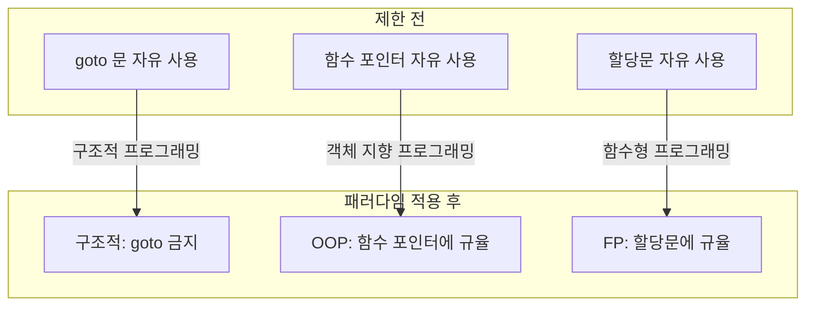
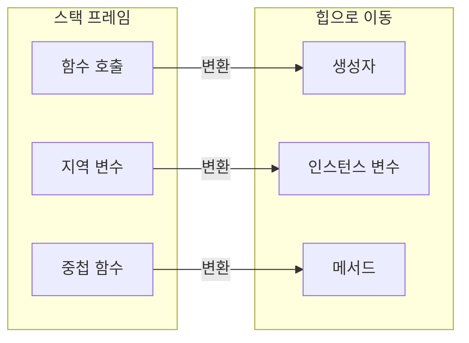
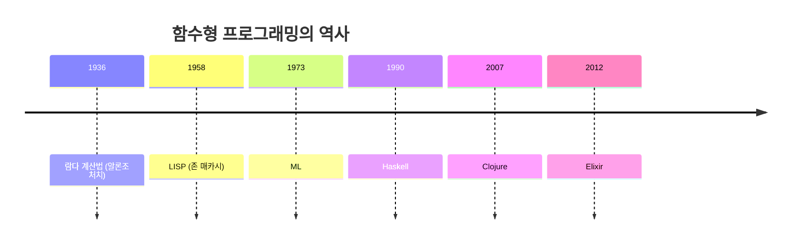
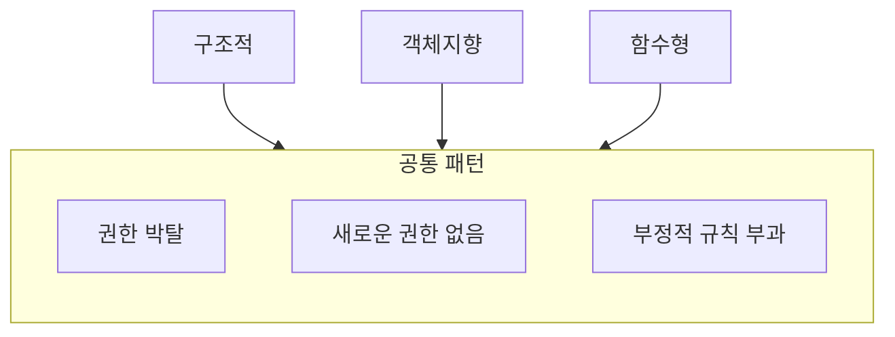
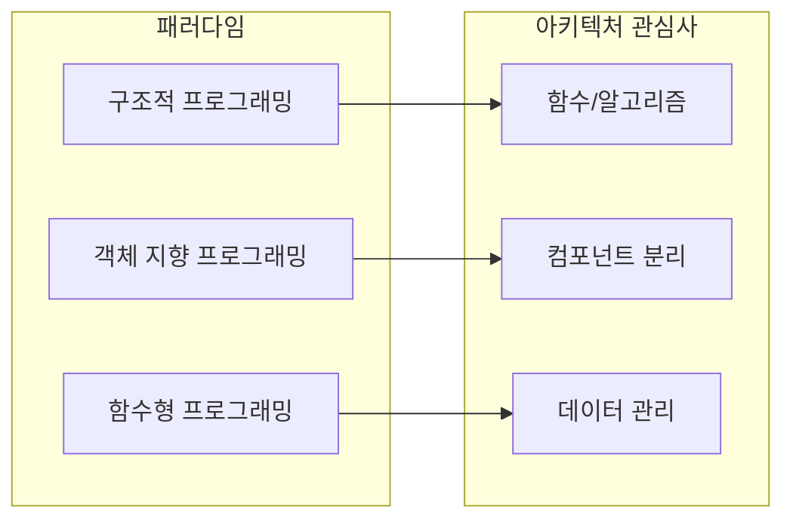

이번 장에서 살펴볼 3가지 패러다임은 **부정적인 의도**를 가지는 일종의 추가적인 규칙을 부과한다. 즉, 패러다임은 무엇을 해야 할지를 말하기보다는 **무엇을 해서는 안 되는지**를 말해준다.

## 패러다임의 본질: 빼앗는 것

> "세 가지 패러다임 각각은 우리에게서 goto문, 함수 포인터, 할당문을 앗아간다."
> — Robert C. Martin



우리에게서 가져갈 수 있는 게 더 남아 있는가? **아마 없을 것이다.** 따라서 프로그래밍 패러다임은 앞으로도 딱 **세 가지**밖에 없을 것이다.

## 구조적 프로그래밍 (Structured Programming)

### 역사

최초로 **적용된** 패러다임(하지만 최초로 만들어진 패러다임은 아닌)은 구조적 프로그래밍으로, **1968년 에츠허르 비버 데이크스트라(Edsger Wybe Dijkstra)**가 발견했다.

### 핵심 발견

데이크스트라는 무분별한 점프(**goto 문**)는 프로그램 구조에 해롭다는 사실을 제시했다. 이러한 점프들을 **if/then/else**와 **do/while/until**과 같이 더 익숙한 구조로 대체했다.

### goto 문의 문제점

```c
// goto를 사용한 스파게티 코드
START:
    read(input);
    if (input < 0) goto ERROR;
    if (input > 100) goto OVERFLOW;
    process(input);
    goto START;
ERROR:
    printf("Error!");
    goto END;
OVERFLOW:
    printf("Overflow!");
END:
    return;
```

```c
// 구조적 프로그래밍으로 개선
while (true) {
    int input = read();
    if (input < 0) {
        printf("Error!");
        break;
    } else if (input > 100) {
        printf("Overflow!");
        break;
    } else {
        process(input);
    }
}
```

### 패러다임 요약

> **구조적 프로그래밍은 제어흐름의 직접적인 전환에 대해 규칙을 부과한다.**

| 제한 대상 | 대안 |
|-----------|------|
| goto 문 | if/else, while, for |
| 무분별한 점프 | 구조화된 제어 흐름 |
| 스파게티 코드 | 순차, 선택, 반복 |

## 객체 지향 프로그래밍 (Object-Oriented Programming)

### 역사

두 번째로 도입된 패러다임은 구조적 프로그래밍보다 사실 **2년 앞선 1966년**, **올레 요한 달(Ole Johan Dahl)**과 **크리스텐 니가드(Kristen Nygaard)**에 의해 등장했다.

### 핵심 발견

이들 두 프로그래머는 ALGOL 언어의 **함수 호출 스택 프레임(Stack Frame)**을 **힙(Heap)**으로 옮기면, 함수 호출이 반환된 이후에도 함수에서 선언된 지역 변수가 오랫동안 유지될 수 있음을 발견했다.

### 클래스의 탄생



| 스택 프레임 요소 | 객체 지향 요소 |
|-----------------|---------------|
| 함수 | 생성자(Constructor) |
| 지역 변수 | 인스턴스 변수(Instance Variable) |
| 중첩 함수 | 메서드(Method) |

### 다형성의 등장

함수 포인터를 특정 규칙에 따라 사용하는 과정을 통해 필연적으로 **다형성(Polymorphism)**이 등장하게 되었다.

```java
// 다형성: 함수 포인터에 규율을 부과
interface Shape {
    double area();
}

class Circle implements Shape {
    private double radius;
    
    public double area() {
        return Math.PI * radius * radius;
    }
}

class Rectangle implements Shape {
    private double width, height;
    
    public double area() {
        return width * height;
    }
}

// 사용 측: 구체적인 타입을 몰라도 됨
void printArea(Shape shape) {
    System.out.println(shape.area());
}
```

### 패러다임 요약

> **객체 지향 프로그래밍은 제어흐름의 간접적인 전환에 대해 규칙을 부과한다.**

## 함수형 프로그래밍 (Functional Programming)

### 역사

세 번째 패러다임은 최근에 들어서야 겨우 도입되기 시작했지만, 세 패러다임 중 **가장 먼저 만들어졌다**. 사실 함수형 프로그래밍은 **컴퓨터 프로그래밍 자체보다 먼저** 등장했다.

### 람다 계산법의 탄생

**알론조 처치(Alonzo Church)**는 앨런 튜링도 똑같이 흥미를 느꼈던 어떤 수학적 문제를 해결하는 과정에서 **람다(Lambda) 계산법**을 발명했는데, 함수형 프로그래밍은 이러한 연구 결과에 직접적인 영향을 받아 만들어졌다.



### LISP와 불변성

**1958년에 존 매카시(John McCarthy)**가 만든 **LISP** 언어의 근간이 되는 개념이 바로 이 람다 계산법이다.

람다 계산법의 기초가 되는 개념은 **불변성(Immutability)**으로, 심볼(Symbol)의 값이 변경되지 않는다는 개념이다. 이는 함수형 언어에는 **할당문이 전혀 없다**는 뜻이기도 하다.

```java
// 명령형: 변수 값 변경
int sum = 0;
for (int i = 0; i < numbers.length; i++) {
    sum += numbers[i];  // 할당문 사용
}

// 함수형: 불변성 유지
int sum = Arrays.stream(numbers)
    .reduce(0, (a, b) -> a + b);  // 할당문 없음
```

### 제한적 가변성

사실 대다수의 함수형 언어가 변수 값을 변경할 수 있는 방법을 제공하기는 하지만, **굉장히 까다로운 조건** 아래에서만 가능하다.

```haskell
-- Haskell: 순수 함수형
-- 변수 값 변경 불가능
let x = 5 in x + 1  -- x는 여전히 5
```

### 패러다임 요약

> **함수형 프로그래밍은 할당문에 대해 규칙을 부과한다.**

## 생각할 거리

### 패러다임의 공통점

내가 이들 세 가지 프로그래밍 패러다임을 소개하면서 신중하게 설정한 **패턴**이 보일 것이다.



| 패러다임 | 빼앗는 것 | 아키텍처 적용 |
|----------|----------|---------------|
| 구조적 | goto 문 | 알고리즘 구조화 |
| 객체 지향 | 함수 포인터 | 다형성으로 경계 횡단 |
| 함수형 | 할당문 | 데이터 불변성 보장 |

### 왜 세 가지뿐인가?

- 이들 패러다임이 **1958년부터 1968년에 걸친 10년 동안** 모두 만들어졌다
- 이후로 **수십 년이 지났지만**, 새롭게 등장한 패러다임은 전혀 없다
- 우리에게서 가져갈 수 있는 것이 **더 이상 없기 때문**

## 패러다임과 아키텍처

패러다임의 역사로부터 얻을 수 있는 이러한 교훈은 아키텍처와 어떤 관계가 있는가? **모두 다 관계가 있다.**



| 패러다임 | 아키텍처 활용 |
|----------|--------------|
| 구조적 프로그래밍 | 모듈의 기반 알고리즘으로 사용 |
| 객체 지향 프로그래밍 | 아키텍처 경계를 넘나들기 위한 다형성 메커니즘 |
| 함수형 프로그래밍 | 데이터의 위치와 접근 방법에 대한 규칙 부과 |

## 결론

세 가지 패러다임과 아키텍처의 세 가지 큰 관심사(**함수, 컴포넌트 분리, 데이터 관리**)가 어떻게 서로 연관되는지에 주목하자.

> "패러다임은 우리에게 무언가를 빼앗음으로써, 더 나은 소프트웨어를 만들도록 이끈다."

| 핵심 요약 | 설명 |
|-----------|------|
| 패러다임의 수 | 3개 (앞으로도 추가 없음) |
| 공통 특성 | 부정적 규칙 부과 |
| 구조적 | goto 제거 → 순차/선택/반복 |
| 객체 지향 | 함수 포인터에 규율 → 다형성 |
| 함수형 | 할당문에 규율 → 불변성 |
| 아키텍처 관계 | 함수, 경계, 데이터에 각각 영향 |

다음 장에서는 각 패러다임을 더 자세히 살펴본다. 먼저 **구조적 프로그래밍**부터 시작한다.
