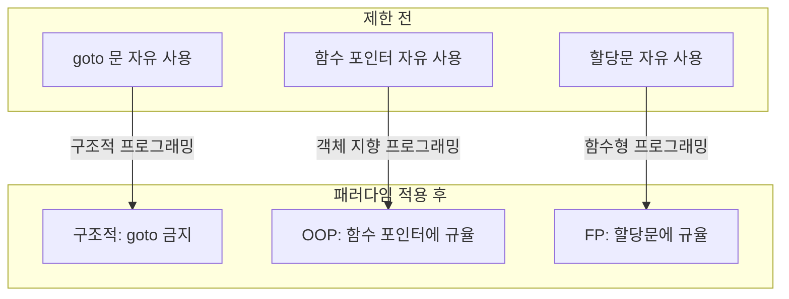
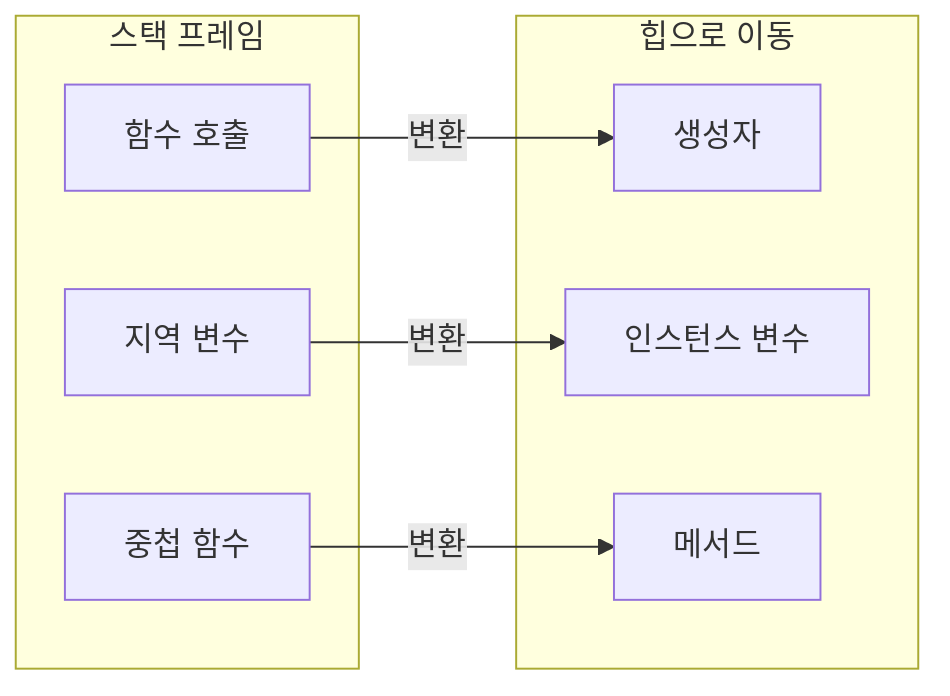
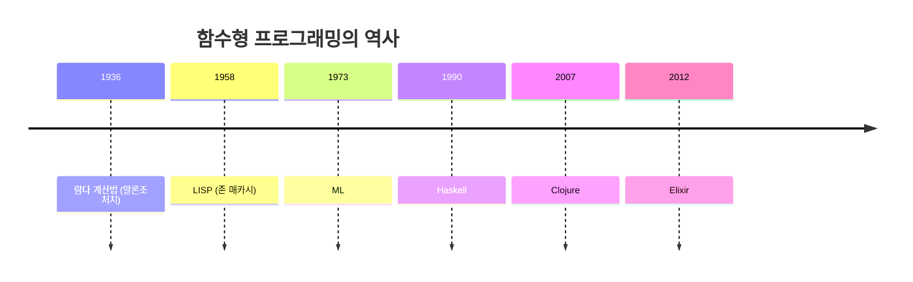
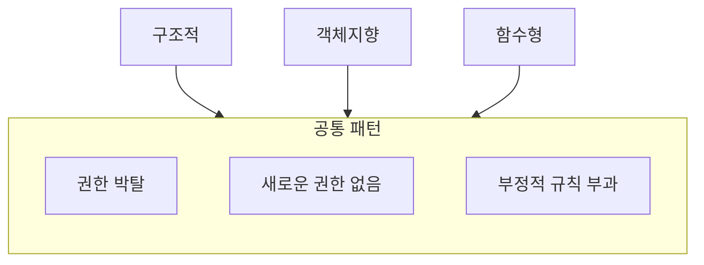
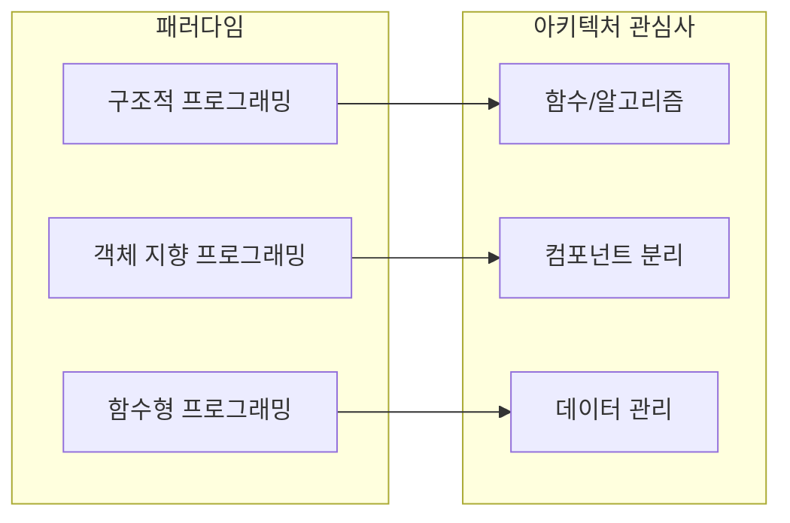

[09장: 프로그래밍 패러다임 서론](/post/clean-architecture/programming-paradigms-introduction/)에서 패러다임이라는 개념 자체를 소개했다. 이번 장에서는 그 개념을 세 가지 구체적인 패러다임으로 좁혀 살펴본다. 이번 장에서 살펴볼 3가지 패러다임은 **부정적인 의도**를 가지는 일종의 추가적인 규칙을 부과한다. 즉, 패러다임은 무엇을 해야 할지를 말하기보다는 **무엇을 해서는 안 되는지**를 말해준다.

## 패러다임의 본질: 빼앗는 것

마틴은 이렇게 요약한다: 세 가지 패러다임 각각은 우리에게서 goto문, 함수 포인터, 할당문을 앗아간다(Martin, *Clean Architecture*, 2017).


```mermaid
flowchart TB
    subgraph Before [제한 전]
        G[goto 문 자유 사용]
        F[함수 포인터 자유 사용]
        A[할당문 자유 사용]
    end
    
    subgraph After [패러다임 적용 후]
        SP[구조적: goto 금지]
        OOP[OOP: 함수 포인터에 규율]
        FP[FP: 할당문에 규율]
    end
    
    G -->|구조적 프로그래밍| SP
    F -->|객체 지향 프로그래밍| OOP
    A -->|함수형 프로그래밍| FP
```

우리에게서 가져갈 수 있는 게 더 남아 있는가? **아마 없을 것이다.** 따라서 프로그래밍 패러다임은 앞으로도 딱 **세 가지**밖에 없을 것이다.

## 구조적 프로그래밍 (Structured Programming)

### 역사

최초로 **적용된** 패러다임(하지만 최초로 만들어진 패러다임은 아닌)은 구조적 프로그래밍으로, **1968년 에츠허르 비버 데이크스트라(Edsger Wybe Dijkstra)**가 발견했다.

### 핵심 발견

데이크스트라는 무분별한 점프(**goto 문**)는 프로그램 구조에 해롭다는 사실을 제시했다. 이러한 점프들을 **if/then/else**와 **do/while/until**과 같이 더 익숙한 구조로 대체했다.

### goto 문의 문제점

```text
// goto를 사용한 스파게티 코드(의사코드)
START:
    read(input);
    if (input < 0) goto ERROR;
    if (input > 100) goto OVERFLOW;
    process(input);
    goto START;
ERROR:
    printf("Error!");
    goto END;
OVERFLOW:
    printf("Overflow!");
END:
    return;
```

```text
// 구조적 프로그래밍으로 개선(의사코드)
while (true) {
    int input = read();
    if (input < 0) {
        printf("Error!");
        break;
    } else if (input > 100) {
        printf("Overflow!");
        break;
    } else {
        process(input);
    }
}
```

### 패러다임 요약

> **구조적 프로그래밍은 제어흐름의 직접적인 전환에 대해 규칙을 부과한다.**

| 제한 대상 | 대안 |
|-----------|------|
| goto 문 | if/else, while, for |
| 무분별한 점프 | 구조화된 제어 흐름 |
| 스파게티 코드 | 순차, 선택, 반복 |

## 객체 지향 프로그래밍 (Object-Oriented Programming)

### 역사

두 번째로 도입된 패러다임은 구조적 프로그래밍보다 사실 조금 앞서, **올레 요한 달(Ole Johan Dahl)**과 **크리스텐 니가드(Kristen Nygaard)**가 1960년대 초부터 개발해 **1967년 Simula 67**로 발표하며 등장했다.

### 핵심 발견

이들 두 프로그래머는 ALGOL 언어의 **함수 호출 스택 프레임(Stack Frame)**을 **힙(Heap)**으로 옮기면, 함수 호출이 반환된 이후에도 함수에서 선언된 지역 변수가 오랫동안 유지될 수 있음을 발견했다.

### 클래스의 탄생


```mermaid
flowchart LR
    subgraph Before [스택 프레임]
        SF[함수 호출]
        LV[지역 변수]
        NF[중첩 함수]
    end
    
    subgraph After [힙으로 이동]
        CT[생성자]
        IV[인스턴스 변수]
        MT[메서드]
    end
    
    SF -->|변환| CT
    LV -->|변환| IV
    NF -->|변환| MT
```

| 스택 프레임 요소 | 객체 지향 요소 |
|-----------------|---------------|
| 함수 | 생성자(Constructor) |
| 지역 변수 | 인스턴스 변수(Instance Variable) |
| 중첩 함수 | 메서드(Method) |

### 다형성의 등장

함수 포인터를 특정 규칙에 따라 사용하는 과정을 통해 필연적으로 **다형성(Polymorphism)**이 등장하게 되었다.

```java
// 다형성: 함수 포인터에 규율을 부과
interface Shape {
    double area();
}

class Circle implements Shape {
    private double radius;
    
    public double area() {
        return Math.PI * radius * radius;
    }
}

class Rectangle implements Shape {
    private double width, height;
    
    public double area() {
        return width * height;
    }
}

// 사용 측: 구체적인 타입을 몰라도 됨
class ShapePrinter {
    void printArea(Shape shape) {
        System.out.println(shape.area());
    }
}
```

### 패러다임 요약

> **객체 지향 프로그래밍은 제어흐름의 간접적인 전환에 대해 규칙을 부과한다.**

## 함수형 프로그래밍 (Functional Programming)

### 역사

세 번째 패러다임은 최근에 들어서야 겨우 도입되기 시작했지만, 세 패러다임 중 **가장 먼저 만들어졌다**. 사실 함수형 프로그래밍은 **컴퓨터 프로그래밍 자체보다 먼저** 등장했다.

### 람다 계산법의 탄생

**알론조 처치(Alonzo Church)**는 앨런 튜링도 똑같이 흥미를 느꼈던 어떤 수학적 문제를 해결하는 과정에서 **람다(Lambda) 계산법**을 발명했는데, 함수형 프로그래밍은 이러한 연구 결과에 직접적인 영향을 받아 만들어졌다.


```mermaid
timeline
    title 함수형 프로그래밍의 역사
    1936 : 람다 계산법 (알론조 처치)
    1958 : LISP (존 매카시)
    1973 : ML
    1990 : Haskell
    2007 : Clojure
    2012 : Elixir
```

### LISP와 불변성

**1958년에 존 매카시(John McCarthy)**가 만든 **LISP** 언어의 근간이 되는 개념이 바로 이 람다 계산법이다.

람다 계산법의 기초가 되는 개념은 **불변성(Immutability)**으로, 심볼(Symbol)의 값이 변경되지 않는다는 개념이다. 이는 함수형 언어에는 **할당문이 전혀 없다**는 뜻이기도 하다.

```java
import java.util.Arrays;

class SumExample {
    static int[] numbers = {1, 2, 3, 4, 5};

    static int sumImperative() {
        // 명령형: 변수 값 변경
        int sum = 0;
        for (int i = 0; i < numbers.length; i++) {
            sum += numbers[i];  // 할당문 사용
        }
        return sum;
    }

    static int sumFunctional() {
        // 함수형: 불변성 유지
        return Arrays.stream(numbers)
            .reduce(0, (a, b) -> a + b);  // 할당문 없음
    }
}
```

### 제한적 가변성

사실 대다수의 함수형 언어가 변수 값을 변경할 수 있는 방법을 제공하기는 하지만, **굉장히 까다로운 조건** 아래에서만 가능하다.

```haskell
-- Haskell: 순수 함수형
-- 변수 값 변경 불가능
let x = 5 in x + 1  -- x는 여전히 5
```

### 패러다임 요약

> **함수형 프로그래밍은 할당문에 대해 규칙을 부과한다.**

## 흔한 오해

세 패러다임을 처음 배우면 흔히 두 가지를 오해한다. **"다형성을 지원하는 언어를 쓰면 자동으로 OOP 규율이 지켜진다"**는 오해가 흔한데, 실제로는 언어가 다형성을 지원하는 것과 팀이 실제로 인터페이스를 통해 경계를 분리하는 것은 별개다 — `instanceof` 분기로 타입을 매번 확인한다면 다형성이 있어도 OOP의 규율은 지켜지지 않는다. **"함수형 언어는 변수를 아예 쓸 수 없다"**는 것도 오해다. 위 Haskell 예제처럼 `let`으로 값을 이름에 바인딩하는 것은 가능하며, 금지되는 것은 그 이름이 가리키는 값을 나중에 **재할당**하는 것뿐이다.

## 생각할 거리

### 패러다임의 공통점

내가 이들 세 가지 프로그래밍 패러다임을 소개하면서 신중하게 설정한 **패턴**이 보일 것이다.


```mermaid
flowchart TB
    subgraph Pattern [공통 패턴]
        direction TB
        P1[권한 박탈]
        P2[새로운 권한 없음]
        P3[부정적 규칙 부과]
    end
    
    SP[구조적] --> Pattern
    OOP[객체지향] --> Pattern
    FP[함수형] --> Pattern
```

### 왜 세 가지뿐인가?

이 질문에 대한 마틴의 답은 역사적 관찰에 가깝다: 세 패러다임이 만들어진 시기와 이후의 공백이 "더는 빼앗을 것이 없다"는 주장의 근거다.

- 이들 패러다임이 **1958년부터 1968년에 걸친 10년 동안** 모두 만들어졌다
- 이후로 **수십 년이 지났지만**, 새롭게 등장한 패러다임은 전혀 없다
- 우리에게서 가져갈 수 있는 것이 **더 이상 없기 때문**

## 패러다임과 아키텍처

패러다임의 역사로부터 얻을 수 있는 이러한 교훈은 아키텍처와 어떤 관계가 있는가? **모두 다 관계가 있다.** 각 패러다임이 "빼앗는 것"은 곧 아키텍처가 다뤄야 할 세 가지 관심사(함수/알고리즘, 컴포넌트 분리, 데이터 관리)와 정확히 대응된다.


```mermaid
flowchart LR
    subgraph Paradigms [패러다임]
        SP[구조적 프로그래밍]
        OOP[객체 지향 프로그래밍]
        FP[함수형 프로그래밍]
    end
    
    subgraph Architecture [아키텍처 관심사]
        ALG[함수/알고리즘]
        COMP[컴포넌트 분리]
        DATA[데이터 관리]
    end
    
    SP --> ALG
    OOP --> COMP
    FP --> DATA
```

각 패러다임이 무엇을 제한하는지는 앞서 세 개의 "패러다임 요약" 인용에서 이미 확인했으므로, 여기서는 그 제한이 아키텍처에서 실제로 어떻게 쓰이는지만 짚는다.

| 패러다임 | 아키텍처 관심사 | 아키텍처 활용 |
|----------|----------------|--------------|
| 구조적 프로그래밍 | 함수/알고리즘 | 모듈의 기반 알고리즘으로 사용 |
| 객체 지향 프로그래밍 | 컴포넌트 분리 | 아키텍처 경계를 넘나들기 위한 다형성 메커니즘 |
| 함수형 프로그래밍 | 데이터 관리 | 데이터의 위치와 접근 방법에 대한 규칙 부과 |

## 결론

세 가지 패러다임과 아키텍처의 세 가지 큰 관심사(**함수, 컴포넌트 분리, 데이터 관리**)가 어떻게 서로 연관되는지에 주목하자. 마틴은 이렇게 요약한다: 패러다임은 우리에게서 무언가를 빼앗음으로써, 더 나은 소프트웨어를 만들도록 이끈다(Martin, *Clean Architecture*, 2017).

## 비판적 시각

"패러다임은 정확히 3개뿐"이라는 주장은 09장에서도 짚었듯 논쟁적이다. 이 주장이 성립하려면 "패러다임=제어 구조에 대한 부정적 제약"이라는 특정 정의를 받아들여야 하는데, 논리형 프로그래밍(Prolog)이나 액터 모델처럼 다른 축(연산 모델 자체)으로 분류되는 패러다임은 이 3분류 밖에 있다. 다만 "goto·함수 포인터·할당문"이라는 세 가지 위험 요소에 초점을 맞추면, 이 글의 분류가 아키텍처 논의에는 실용적인 단순화를 제공한다는 점은 부인하기 어렵다.

## 판단 기준

세 패러다임을 실무에 적용할 때는 "이 언어가 무엇을 지원하는가"가 아니라 "이 코드베이스에서 무엇이 실제로 규율되고 있는가"를 물어야 한다. 예를 들어 다형성을 지원하는 언어라도 팀이 매번 `instanceof` 분기로 타입을 확인한다면 OOP 규율이 실질적으로 지켜지지 않는 것이다. 코드 리뷰에서 이 3구분을 체크리스트로 쓰면(제어 흐름이 구조화됐는가/다형성으로 경계가 분리됐는가/불변성이 지켜지는가), 어떤 패러다임 원칙이 느슨한 부분인지 빠르게 짚을 수 있다.

## 학습 목표

이 장을 읽은 후 다음을 할 수 있어야 한다.

- 세 패러다임이 각각 언제, 누구에 의해 등장했는지 설명할 수 있다.
- 각 패러다임이 "빼앗는 것"과 그것이 아키텍처의 어느 관심사(함수/컴포넌트/데이터)에 대응하는지 짝지을 수 있다.
- "패러다임은 정확히 3개"라는 주장의 전제와 한계를 설명할 수 있다.

## 참고 자료

- Martin, R. C. (2017). *Clean Architecture: A Craftsman's Guide to Software Structure and Design*. Prentice Hall.

다음 장에서는 각 패러다임을 더 자세히 살펴본다. 먼저 **구조적 프로그래밍**부터 시작한다.
