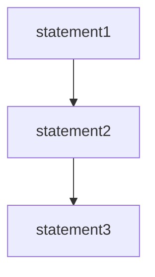
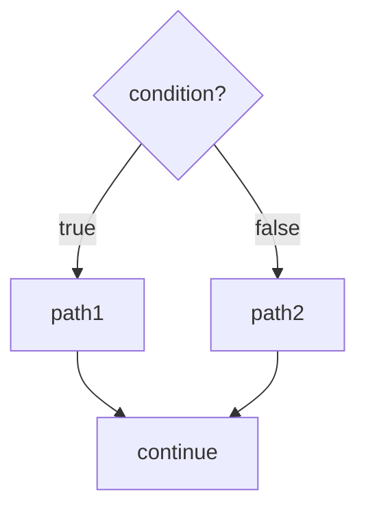
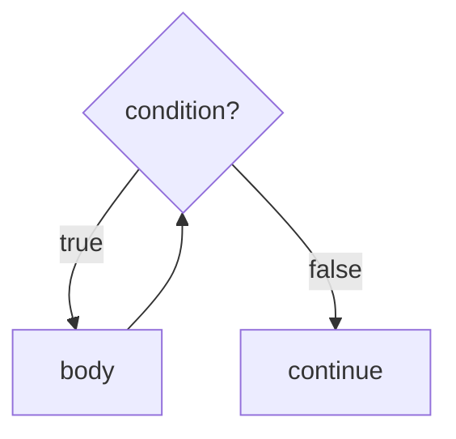
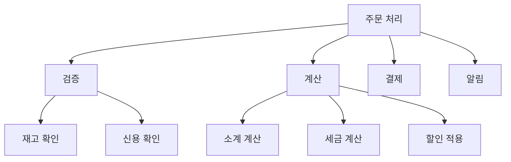
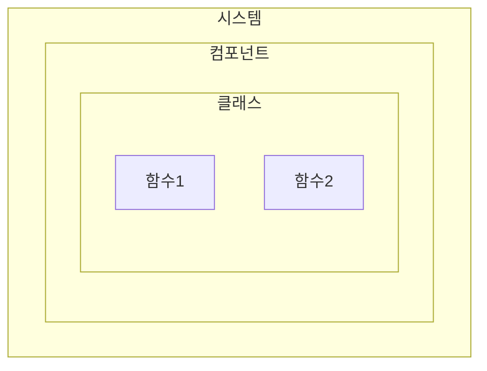

1968년, 에츠허르 비버 데이크스트라(Edsger Wybe Dijkstra)는 CACM(Communications of the ACM)에 보낸 편지에서 프로그래밍 역사상 가장 유명한 논쟁을 시작했다. "Go To Statement Considered Harmful"이라는 제목의 이 글은 구조적 프로그래밍의 시대를 열었다.

## 데이크스트라의 발견

### 프로그램 증명의 꿈

데이크스트라는 수학자이자 프로그래머였다. 그는 프로그램이 올바른지 **수학적으로 증명**할 수 있어야 한다고 믿었다. 수학에서 정리를 증명하듯이, 프로그램도 증명할 수 있어야 한다는 것이었다.

> "테스팅은 버그의 존재를 보여줄 수 있지만, 버그가 없음을 보여줄 수는 없다."
> — Edsger Dijkstra

그러나 그가 프로그램을 증명하려 시도하자, 심각한 문제에 부딪혔다. **goto 문**이 있는 프로그램은 증명하기가 극도로 어려웠다.

### goto 문의 문제

goto 문은 프로그램의 제어 흐름을 임의의 위치로 점프시킨다. 이로 인해:

1. **제어 흐름 추적 불가**: 프로그램이 어떻게 실행되는지 따라가기 어려움
2. **증명 불가능**: 수학적 귀납법을 적용하기 어려움
3. **디버깅 지옥**: 버그를 찾고 수정하기 어려움

```
// goto를 사용한 혼란스러운 코드
START:
    read input
    if input < 0 goto ERROR
    if input > 100 goto OVERFLOW
    process input
    goto START
ERROR:
    print "음수 입력"
    goto CLEANUP
OVERFLOW:
    print "오버플로우"
    goto CLEANUP
CLEANUP:
    close resources
    goto END
END:
    exit
```

이런 코드를 "스파게티 코드"라고 부른다. 제어 흐름이 스파게티 면처럼 복잡하게 얽혀있기 때문이다.

## 세 가지 제어 구조

데이크스트라와 그의 동료 Corrado Bohm, Giuseppe Jacopini는 중요한 사실을 발견했다. **모든 프로그램은 단 세 가지 구조만으로 표현할 수 있다:**

### 1. 순차 (Sequence)

명령문을 위에서 아래로 순서대로 실행한다.

```
statement1;
statement2;
statement3;
```



순차 구조에서 각 명령문은 앞의 명령문이 완료된 후에 실행된다. 증명: 각 명령문이 올바르면, 전체 순차도 올바르다.

### 2. 선택 (Selection)

조건에 따라 다른 경로를 실행한다.

```
if (condition) {
    path1;
} else {
    path2;
}
```



선택 구조에서 조건이 참이면 path1이, 거짓이면 path2가 실행된다. 증명: 조건이 참일 때 path1이 올바르고, 거짓일 때 path2가 올바르면, 전체 선택도 올바르다.

### 3. 반복 (Iteration)

조건이 참인 동안 반복 실행한다.

```
while (condition) {
    body;
}
```



반복 구조에서 조건이 참인 동안 body가 반복된다. 증명: 루프 불변식(loop invariant)을 사용하여 증명한다.

## Bohm-Jacopini 정리

1966년, Bohm과 Jacopini는 다음을 증명했다:

> **모든 프로그램은 순차, 선택, 반복만으로 작성할 수 있다.**

이것은 goto 문이 **불필요하다**는 것을 수학적으로 증명한 것이었다. goto 문 없이도 어떤 알고리즘이든 표현할 수 있다.

## "Go To Statement Considered Harmful"

데이크스트라의 1968년 편지는 프로그래밍 커뮤니티에 큰 파장을 일으켰다.

### 핵심 주장

1. **goto 문은 프로그램의 품질을 떨어뜨린다**
2. **goto 문을 제거하면 프로그램을 증명할 수 있다**
3. **순차, 선택, 반복만 사용해야 한다**

### 논쟁

모든 사람이 동의한 것은 아니었다. Donald Knuth는 "Structured Programming with go to Statements"라는 논문에서, goto 문이 때로는 유용할 수 있다고 주장했다. 그러나 전체적인 흐름은 데이크스트라의 편을 들었다.

결국 대부분의 현대 프로그래밍 언어에서:
- goto 문은 권장되지 않거나 (C, C++)
- 아예 제공되지 않는다 (Java, Python, JavaScript)

## 기능적 분해

구조적 프로그래밍이 가져온 또 다른 혁명은 **기능적 분해(Functional Decomposition)**다.

### 큰 문제를 작은 문제로

복잡한 프로그램을 작은 함수들로 나눈다. 각 함수는:
- 하나의 작업만 수행
- 입력을 받아 출력을 반환
- 순차, 선택, 반복만 사용

```
// 기능적 분해 예시
function processOrder(order) {
    validateOrder(order);
    calculateTotal(order);
    processPayment(order);
    sendConfirmation(order);
}

function validateOrder(order) {
    checkInventory(order.items);
    checkCustomerCredit(order.customer);
}
```

### 하향식 설계 (Top-Down Design)

1. 전체 문제를 정의
2. 큰 단위로 분해
3. 각 단위를 더 작은 단위로 분해
4. 더 이상 분해할 수 없을 때까지 반복



## 테스트와 증명

### 증명의 한계

데이크스트라의 꿈은 프로그램을 수학적으로 증명하는 것이었다. 그러나 현실에서 이것은 어렵다:

1. **복잡성**: 실제 프로그램은 너무 복잡
2. **비용**: 증명에 드는 시간과 노력이 막대
3. **변경**: 코드가 변경되면 증명도 다시 해야 함

### 테스트의 역할

데이크스트라는 유명한 말을 남겼다:

> "프로그램 테스팅은 버그가 **있음**을 보여줄 수 있지만, 버그가 **없음**을 보여줄 수는 없다."

그러나 과학도 마찬가지다. 칼 포퍼(Karl Popper)의 **반증 가능성(Falsifiability)** 개념에 따르면:
- 과학 이론은 **증명**할 수 없다
- 과학 이론은 **반증**할 수 있다
- 반증되지 않은 이론은 **잠정적으로 참**이다

### 소프트웨어의 과학적 방법

마틴은 소프트웨어 개발에 이 개념을 적용한다:

| 과학 | 소프트웨어 |
|------|-----------|
| 실험 | 테스트 |
| 반증 시도 | 버그 찾기 시도 |
| 반증 실패 | 테스트 통과 |
| 잠정적 참 | 충분히 테스트됨 |

**구조적 프로그래밍**은 프로그램을 증명 가능하게 만들지는 못했지만, **테스트 가능하게** 만들었다.

## 아키텍처와의 연결

구조적 프로그래밍이 Clean Architecture와 어떤 관계가 있을까?

### 모듈의 기반

아키텍처에서 각 모듈(컴포넌트, 클래스)의 **내부**는 구조적 프로그래밍을 따른다:
- 함수는 순차, 선택, 반복으로 구성
- 기능적 분해로 작은 함수들로 나눔
- 각 함수는 테스트 가능

### 분해의 원칙

기능적 분해의 원칙은 아키텍처 수준으로 확장된다:
- 시스템 → 컴포넌트 → 클래스 → 함수



### 테스트 가능성

구조적 프로그래밍 덕분에:
- 각 함수를 독립적으로 테스트 가능
- 테스트를 통해 프로그램의 올바름을 **반증 시도**
- 테스트 통과 시 **충분히 테스트되었다**고 판단

## 구조적 프로그래밍의 교훈

### 1. 제한이 힘이다

goto를 **제거**함으로써 프로그램이 더 좋아졌다. 패러다임은 프로그래머에게 **무엇을 하지 말아야 하는지**를 알려준다.

### 2. 증명보다 테스트

완벽한 증명은 불가능하지만, 충분한 테스트는 가능하다.

### 3. 분해의 힘

복잡한 문제를 작은 문제로 나누면 관리할 수 있다.

## 현대적 의미

오늘날 구조적 프로그래밍은 **당연한 것**이 되었다. 대부분의 개발자는 goto를 사용하지 않으며, if-else와 while을 자연스럽게 사용한다.

그러나 구조적 프로그래밍의 **정신**은 여전히 중요하다:
- 코드를 작은 단위로 분해하라
- 각 단위를 테스트 가능하게 만들어라
- 제어 흐름을 단순하게 유지하라

## 핵심 요약

| 항목 | 내용 |
|------|------|
| 발견자 | Edsger Dijkstra (1968) |
| 핵심 | goto 제거, 순차/선택/반복만 사용 |
| 목적 | 프로그램을 증명 가능/테스트 가능하게 |
| 방법 | 기능적 분해, 하향식 설계 |
| 교훈 | 제한이 힘이다 |

> **"구조적 프로그래밍은 제어흐름의 직접적인 전환에 대해 규칙을 부과한다."**
> — Robert C. Martin

## 다음 장에서는

다음 장에서는 **객체 지향 프로그래밍**을 다룬다. 구조적 프로그래밍이 제어 흐름을 제한했다면, 객체 지향 프로그래밍은 함수 포인터의 사용을 제한하여 **다형성**이라는 강력한 도구를 만들어냈다.
