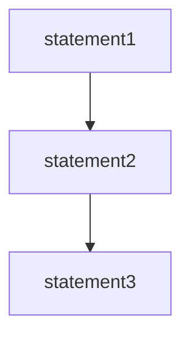
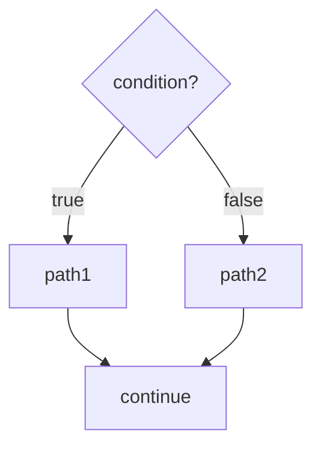
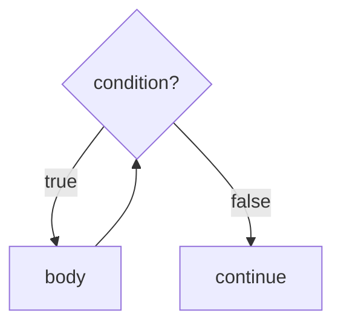
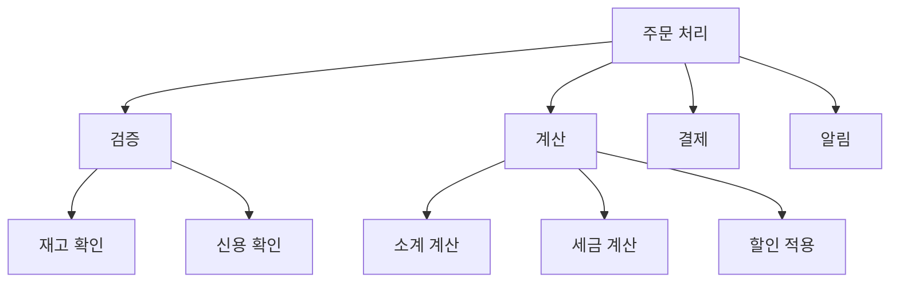
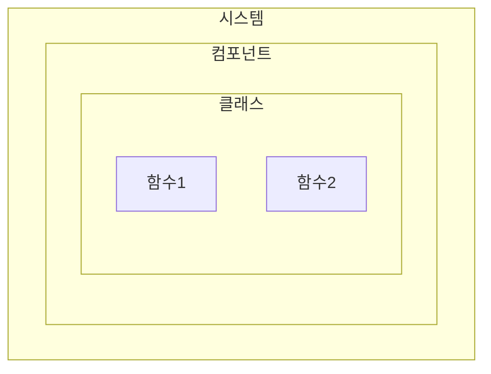

[10장: 세 가지 프로그래밍 패러다임](/post/clean-architecture/paradigm-overview-three-types/)에서 구조적·객체지향·함수형이라는 세 패러다임을 개괄했다. 이 장은 그중 첫 번째, 구조적 프로그래밍이 실제로 무엇을 금지했는지부터 살펴본다. 1968년, 에츠허르 비버 데이크스트라(Edsger Wybe Dijkstra)는 CACM(Communications of the ACM)에 보낸 편지에서 프로그래밍 역사상 가장 유명한 논쟁을 시작했다. "Go To Statement Considered Harmful"이라는 제목의 이 글은 구조적 프로그래밍의 시대를 열었다.

## 데이크스트라의 발견

### 프로그램 증명의 꿈

데이크스트라는 수학자이자 프로그래머였다. 그는 프로그램이 올바른지 **수학적으로 증명**할 수 있어야 한다고 믿었다. 수학에서 정리를 증명하듯이, 프로그램도 증명할 수 있어야 한다는 것이었다.

데이크스트라는 이렇게 남겼다: 테스팅은 버그의 존재를 보여줄 수 있지만, 버그가 없음을 보여줄 수는 없다(Dijkstra, "Notes on Structured Programming", EWD249, 1970년경).

그러나 그가 프로그램을 증명하려 시도하자, 심각한 문제에 부딪혔다. **goto 문**이 있는 프로그램은 증명하기가 극도로 어려웠다.

### goto 문의 문제

goto 문은 프로그램의 제어 흐름을 임의의 위치로 점프시킨다. 순차·선택·반복이라면 "지금 이 줄 앞에 있던 코드가 실행됐다"는 사실만으로 프로그램 상태를 추론할 수 있지만, goto는 프로그램의 어느 지점에서도 진입할 수 있어 그 전제 자체가 무너진다. 이는 세 가지 구체적인 문제로 이어진다:

1. **제어 흐름 추적 불가**: 프로그램이 어떻게 실행되는지 따라가기 어려움
2. **증명 불가능**: 수학적 귀납법을 적용하기 어려움
3. **디버깅 지옥**: 버그를 찾고 수정하기 어려움

```text
// goto를 사용한 혼란스러운 코드(의사코드)
START:
    read input
    if input < 0 goto ERROR
    if input > 100 goto OVERFLOW
    process input
    goto START
ERROR:
    print "음수 입력"
    goto CLEANUP
OVERFLOW:
    print "오버플로우"
    goto CLEANUP
CLEANUP:
    close resources
    goto END
END:
    exit
```

이런 코드를 "스파게티 코드"라고 부른다. 제어 흐름이 스파게티 면처럼 복잡하게 얽혀있기 때문이다.

## 세 가지 제어 구조

데이크스트라의 통찰과 별개로, 이탈리아의 코라도 뵘(Corrado Böhm)과 주세페 자코피니(Giuseppe Jacopini)는 독립적으로 중요한 사실을 증명했다. **모든 프로그램은 단 세 가지 구조만으로 표현할 수 있다:**

### 1. 순차 (Sequence)

명령문을 위에서 아래로 순서대로 실행한다.

```text
statement1;
statement2;
statement3;
```


```mermaid
flowchart TB
    A[statement1] --> B[statement2]
    B --> C[statement3]
```

순차 구조에서 각 명령문은 앞의 명령문이 완료된 후에 실행된다. 증명: 각 명령문이 올바르면, 전체 순차도 올바르다.

### 2. 선택 (Selection)

조건에 따라 다른 경로를 실행한다.

```text
if (condition) {
    path1;
} else {
    path2;
}
```


```mermaid
flowchart TB
    A{condition?}
    A -->|true| B[path1]
    A -->|false| C[path2]
    B --> D[continue]
    C --> D
```

선택 구조에서 조건이 참이면 path1이, 거짓이면 path2가 실행된다. 증명: 조건이 참일 때 path1이 올바르고, 거짓일 때 path2가 올바르면, 전체 선택도 올바르다.

### 3. 반복 (Iteration)

조건이 참인 동안 반복 실행한다.

```text
while (condition) {
    body;
}
```


```mermaid
flowchart TB
    A{condition?}
    A -->|true| B[body]
    B --> A
    A -->|false| C[continue]
```

반복 구조에서 조건이 참인 동안 body가 반복된다. 증명: 루프 불변식(loop invariant)을 사용하여 증명한다.

## Bohm-Jacopini 정리

1966년, Bohm과 Jacopini는 다음을 증명했다:

> **모든 프로그램은 순차, 선택, 반복만으로 작성할 수 있다.**

이것은 goto 문이 **불필요하다**는 것을 수학적으로 증명한 것이었다. goto 문 없이도 어떤 알고리즘이든 표현할 수 있다.

정리가 실제로 어떻게 적용되는지, 앞서 본 goto 의사코드를 순차·선택·반복만으로 다시 써 보면 알 수 있다. 핵심 기법은 **불린 플래그(boolean flag)**로 goto가 표현하던 "다음에 무엇을 할지"라는 상태를 변수에 담는 것이다.

```text
// Before: goto로 표현된 상태 전이
START:
    read input
    if input < 0 goto ERROR
    if input > 100 goto OVERFLOW
    process input
    goto START
ERROR:
    print "음수 입력"
    goto CLEANUP
OVERFLOW:
    print "오버플로우"
    goto CLEANUP
CLEANUP:
    close resources

// After: 반복문 + 상태 플래그로 동일한 로직 표현
running = true
while (running) {
    input = read()
    if (input < 0) {
        print "음수 입력"
        running = false
    } else if (input > 100) {
        print "오버플로우"
        running = false
    } else {
        process(input)
    }
}
close resources
```

`goto ERROR`·`goto OVERFLOW`가 가리키던 "종료 사유"는 `running` 플래그 하나로 표현되고, `goto START`가 하던 반복은 `while` 문이 대신한다. goto가 임의의 위치로 뛰어다니며 암묵적으로 표현하던 상태를, 변수라는 명시적인 형태로 끌어올린 것이 구조적 프로그래밍의 실제 메커니즘이다.

## "Go To Statement Considered Harmful"

데이크스트라의 1968년 편지는 프로그래밍 커뮤니티에 큰 파장을 일으켰다.

### 핵심 주장

편지의 논증은 앞서 살펴본 Böhm-Jacopini 정리를 실무 규범으로 전환한다: 증명 가능성이라는 이론적 성과를, "goto를 쓰지 마라"는 실천적 규칙으로 압축한 것이다.

1. **goto 문은 프로그램의 품질을 떨어뜨린다**
2. **goto 문을 제거하면 프로그램을 증명할 수 있다**
3. **순차, 선택, 반복만 사용해야 한다**

### 논쟁

모든 사람이 동의한 것은 아니었다. Donald Knuth는 "Structured Programming with go to Statements"라는 논문에서, goto 문이 때로는 유용할 수 있다고 주장했다. 그러나 전체적인 흐름은 데이크스트라의 편을 들었다.

결국 대부분의 현대 프로그래밍 언어에서:
- goto 문은 권장되지 않거나 (C, C++)
- 아예 제공되지 않는다 (Java, Python, JavaScript)

## 기능적 분해

구조적 프로그래밍이 가져온 또 다른 혁명은 **기능적 분해(Functional Decomposition)**다.

### 큰 문제를 작은 문제로

복잡한 프로그램을 작은 함수들로 나눈다. 각 함수는:
- 하나의 작업만 수행
- 입력을 받아 출력을 반환
- 순차, 선택, 반복만 사용

```javascript
// 기능적 분해 예시
function processOrder(order) {
    validateOrder(order);
    const total = calculateTotal(order);
    processPayment(order, total);
    sendConfirmation(order);
}

function validateOrder(order) {
    checkInventory(order.items);
    checkCustomerCredit(order.customer);
}

function checkInventory(items) {
    return items.every(item => item.stock > 0);
}

function checkCustomerCredit(customer) {
    return customer.creditLimit >= 0;
}

function calculateTotal(order) {
    const subtotal = calculateSubtotal(order);
    const tax = calculateTax(subtotal);
    return applyDiscount(subtotal + tax, order.customer);
}

function calculateSubtotal(order) {
    return order.items.reduce((sum, item) => sum + item.price * item.qty, 0);
}

function calculateTax(subtotal) {
    return subtotal * 0.1;
}

function applyDiscount(amount, customer) {
    return customer.isVip ? amount * 0.9 : amount;
}

function processPayment(order, total) {
    return order.paymentGateway.charge(order.customer, total);
}

function sendConfirmation(order) {
    return order.notifier.send(order.customer, `주문 ${order.id} 완료`);
}
```

### 하향식 설계 (Top-Down Design)

1. 전체 문제를 정의
2. 큰 단위로 분해
3. 각 단위를 더 작은 단위로 분해
4. 더 이상 분해할 수 없을 때까지 반복


```mermaid
flowchart TB
    A[주문 처리] --> B[검증]
    A --> C[계산]
    A --> D[결제]
    A --> E[알림]
    
    B --> B1[재고 확인]
    B --> B2[신용 확인]
    
    C --> C1[소계 계산]
    C --> C2[세금 계산]
    C --> C3[할인 적용]
```

## 테스트와 증명

### 증명의 한계

데이크스트라의 꿈은 프로그램을 수학적으로 증명하는 것이었다. 그러나 현실에서 이것은 어렵다:

1. **복잡성**: 실제 프로그램은 너무 복잡
2. **비용**: 증명에 드는 시간과 노력이 막대
3. **변경**: 코드가 변경되면 증명도 다시 해야 함

### 테스트의 역할

데이크스트라의 이 말은 프로그램 테스팅은 버그가 **있음**을 보여줄 수 있지만, 버그가 **없음**을 보여줄 수는 없다는 뜻이다. 그러나 과학도 마찬가지다. 칼 포퍼(Karl Popper)의 **반증 가능성(Falsifiability)** 개념에 따르면:
- 과학 이론은 **증명**할 수 없다
- 과학 이론은 **반증**할 수 있다
- 반증되지 않은 이론은 **잠정적으로 참**이다

### 소프트웨어의 과학적 방법

마틴은 소프트웨어 개발에 이 개념을 적용한다:

| 과학 | 소프트웨어 |
|------|-----------|
| 실험 | 테스트 |
| 반증 시도 | 버그 찾기 시도 |
| 반증 실패 | 테스트 통과 |
| 잠정적 참 | 충분히 테스트됨 |

**구조적 프로그래밍**은 프로그램을 증명 가능하게 만들지는 못했지만, **테스트 가능하게** 만들었다.

## 아키텍처와의 연결

구조적 프로그래밍이 Clean Architecture와 어떤 관계가 있을까?

### 모듈의 기반

아키텍처에서 각 모듈(컴포넌트, 클래스)의 **내부**는 구조적 프로그래밍을 따른다:
- 함수는 순차, 선택, 반복으로 구성
- 기능적 분해로 작은 함수들로 나눔
- 각 함수는 테스트 가능

### 분해의 원칙

기능적 분해의 원칙은 아키텍처 수준으로 확장된다:
- 시스템 → 컴포넌트 → 클래스 → 함수


```mermaid
flowchart TB
    subgraph System [시스템]
        subgraph Component [컴포넌트]
            subgraph Class [클래스]
                F1[함수1]
                F2[함수2]
            end
        end
    end
```

### 테스트 가능성

구조적 프로그래밍 덕분에:
- 각 함수를 독립적으로 테스트 가능
- 테스트를 통해 프로그램의 올바름을 **반증 시도**
- 테스트 통과 시 **충분히 테스트되었다**고 판단

## 구조적 프로그래밍의 교훈

오늘날 구조적 프로그래밍은 **당연한 것**이 되어 대부분의 개발자는 goto 없이 if-else와 while을 자연스럽게 쓴다. 하지만 그 정신 — goto를 제거함으로써 프로그램이 더 좋아졌다는 사실 — 은 세 가지 교훈으로 여전히 유효하다.

1. **제한이 힘이다**: 패러다임은 프로그래머에게 무엇을 하지 말아야 하는지 알려줌으로써 더 나은 구조를 강제한다.
2. **증명보다 테스트**: 완벽한 증명은 불가능하지만, 충분한 테스트는 가능하다.
3. **분해의 힘**: 복잡한 문제를 작은 문제로 나누면 관리할 수 있다.

마틴은 이를 이렇게 요약한다: 구조적 프로그래밍은 제어흐름의 직접적인 전환에 대해 규칙을 부과한다(Martin, *Clean Architecture*, 2017).

## 흔한 오해

세 가지 오해가 특히 흔하다. **"goto는 무조건, 어떤 경우에도 금지"**라는 오해와 달리 데이크스트라 본인도 무분별한 점프를 문제 삼았을 뿐, `goto cleanup;` 같은 지역적이고 예측 가능한 점프까지 금지한 것은 아니다. **"증명 가능하면 테스트가 필요 없다"**는 것도 오해다 — 오히려 이 장이 보여주듯 완벽한 증명은 현실적으로 불가능하기 때문에 테스트가 필요하다. **"구조적 프로그래밍은 옛날 이야기이고 아키텍처와 무관하다"**는 것도 오해다. 순차·선택·반복이라는 규율은 오늘날에도 모든 함수 내부 로직에 그대로 적용되며, 기능적 분해는 시스템→컴포넌트→클래스→함수로 이어지는 아키텍처 계층 구조의 원형이다.

## 판단 기준

"goto는 무조건 금지"라는 규칙을 문자 그대로 적용하기보다, 이 장이 실제로 증명한 것("순차·선택·반복만으로 모든 프로그램을 표현할 수 있다")과 그로부터 따라오는 실무 원칙("제어 흐름은 위에서 아래로 읽을 수 있어야 한다")을 구분해서 적용하는 것이 좋다. C의 `goto cleanup;` 관용구나 중첩 루프 탈출처럼, 지역적이고 예측 가능한 점프는 대부분의 스타일 가이드에서도 허용된다 — 문제는 goto 자체가 아니라 임의의 위치로 튀는 예측 불가능한 점프다.

## 학습 목표

이 장을 읽은 후 다음을 할 수 있어야 한다.

- 순차·선택·반복 세 가지 제어 구조만으로 모든 프로그램을 표현할 수 있다는 Böhm-Jacopini 정리의 의미를 설명할 수 있다.
- "증명 가능"과 "테스트 가능"의 차이, 그리고 반증 가능성 개념이 소프트웨어 테스트에 어떻게 적용되는지 설명할 수 있다.
- goto가 오늘날에도 정당화되는 제한적 경우(cleanup 관용구 등)와 데이크스트라가 비판한 무분별한 점프를 구분할 수 있다.

## 참고 자료

- Dijkstra, E. W. (1968). "Go To Statement Considered Harmful". *Communications of the ACM*, 11(3).
- Böhm, C., & Jacopini, G. (1966). "Flow diagrams, Turing machines and languages with only two formation rules". *Communications of the ACM*, 9(5).
- Martin, R. C. (2017). *Clean Architecture: A Craftsman's Guide to Software Structure and Design*. Prentice Hall.

## 다음 장에서는

다음 장에서는 **객체 지향 프로그래밍**을 다룬다. 구조적 프로그래밍이 제어 흐름을 제한했다면, 객체 지향 프로그래밍은 함수 포인터의 사용을 제한하여 **다형성**이라는 강력한 도구를 만들어냈다.
