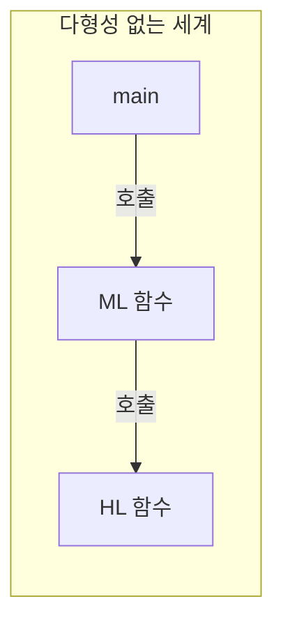
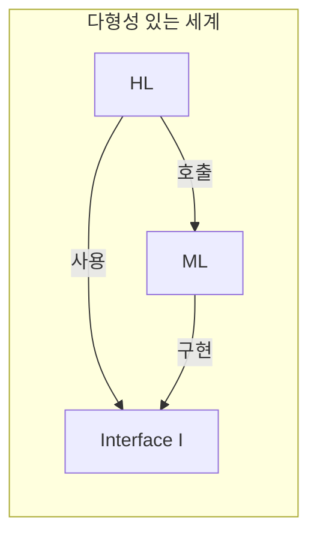
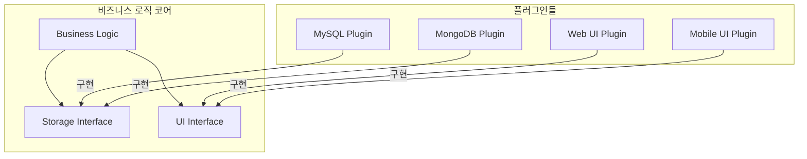
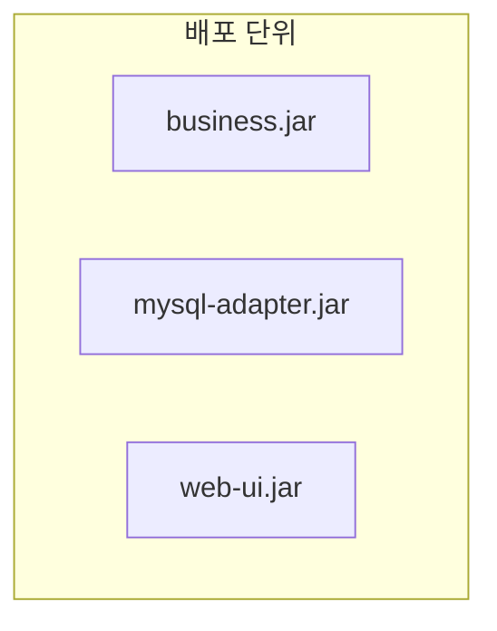
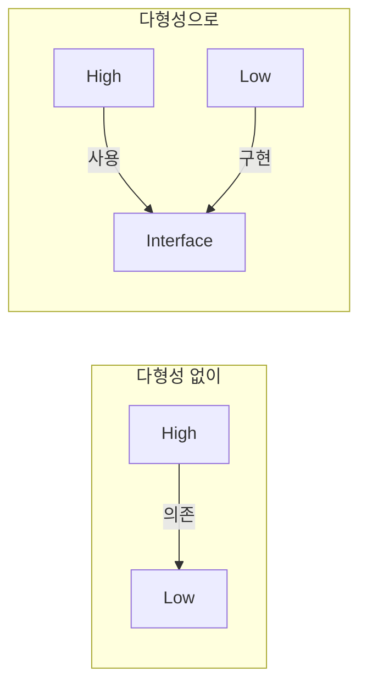

객체 지향 프로그래밍(OOP)은 1966년에 올레 요한 달(Ole Johan Dahl)과 크리스텐 니가드(Kristen Nygaard)가 Simula 67을 개발하면서 시작되었다. 이후 Smalltalk, C++, Java를 거치며 주류 패러다임이 되었다. 하지만 OOP가 아키텍처에 제공하는 진정한 가치는 무엇일까? 로버트 마틴은 그것이 **다형성을 통한 의존성 역전**이라고 말한다.

## 객체 지향의 세 기둥

OOP를 설명할 때 흔히 세 가지 특성을 언급한다:

1. 캡슐화 (Encapsulation)
2. 상속 (Inheritance)
3. 다형성 (Polymorphism)

그러나 마틴은 이 세 가지를 비판적으로 분석한다.

## 캡슐화: OOP의 독점물이 아니다

### 캡슐화란?

캡슐화는 데이터와 그 데이터를 조작하는 함수를 하나로 묶고, 외부에서 직접 접근하지 못하도록 숨기는 것이다.

```java
// Java의 캡슐화
public class Point {
    private double x;
    private double y;
    
    public double getX() { return x; }
    public double getY() { return y; }
    public void setX(double x) { this.x = x; }
    public void setY(double y) { this.y = y; }
}
```

### C 언어도 캡슐화할 수 있다

마틴은 지적한다: C 언어에서도 캡슐화는 가능했다.

```c
// point.h - 헤더 파일 (공개 인터페이스)
struct Point;  // 전방 선언만
struct Point* makePoint(double x, double y);
double distance(struct Point* p1, struct Point* p2);
```

```c
// point.c - 구현 파일 (숨겨진 구현)
#include "point.h"
#include <math.h>

struct Point {
    double x, y;  // 구현 세부사항
};

struct Point* makePoint(double x, double y) {
    struct Point* p = malloc(sizeof(struct Point));
    p->x = x;
    p->y = y;
    return p;
}

double distance(struct Point* p1, struct Point* p2) {
    double dx = p1->x - p2->x;
    double dy = p1->y - p2->y;
    return sqrt(dx*dx + dy*dy);
}
```

사용자는 `Point`의 내부 구조를 알 수 없다. 헤더 파일에는 전방 선언만 있고, 실제 구조체 정의는 구현 파일에 숨겨져 있다.

### OOP 언어의 약화된 캡슐화

오히려 C++과 Java에서 캡슐화가 **약화**되었다:

```java
// Java - 멤버 변수가 헤더(클래스 정의)에 노출됨
public class Point {
    private double x;  // private이지만 선언은 보임
    private double y;
    // ...
}
```

사용자는 `private`이라 접근할 수 없지만, **변수의 존재와 타입은 알 수 있다**. 이것은 C의 전방 선언보다 약한 캡슐화다.

> **결론**: 캡슐화는 OOP의 독점물이 아니며, OOP가 오히려 약화시켰다.

## 상속: OOP 이전에도 있었다

### 상속이란?

상속은 기존 데이터 구조에 새로운 필드와 메서드를 추가하여 확장하는 것이다.

```java
// Java의 상속
public class NamedPoint extends Point {
    private String name;
    
    public String getName() { return name; }
}
```

### C 언어의 상속 (?)

C에서도 비슷한 것이 가능했다:

```c
// C의 "상속"
struct Point {
    double x, y;
};

struct NamedPoint {
    double x, y;  // Point와 같은 구조
    char* name;
};

// NamedPoint*를 Point*로 사용 가능 (업캐스팅)
void someFunction(struct Point* p);

struct NamedPoint np;
someFunction((struct Point*)&np);  // 작동함!
```

이것은 진짜 상속은 아니지만, **비슷한 효과**를 낼 수 있었다.

> **결론**: 상속은 OOP가 **편리하게** 만들었지만, 완전히 새로운 것은 아니었다.

## 다형성: OOP의 진정한 힘

### 다형성이란?

다형성은 같은 인터페이스로 다른 구현을 호출할 수 있는 능력이다.

```java
// 다형성 예시
interface Shape {
    void draw();
}

class Circle implements Shape {
    public void draw() { /* 원 그리기 */ }
}

class Square implements Shape {
    public void draw() { /* 사각형 그리기 */ }
}

// 다형적 호출
void drawAll(Shape[] shapes) {
    for (Shape s : shapes) {
        s.draw();  // 어떤 도형이든 그릴 수 있음
    }
}
```

### 함수 포인터로도 가능했다

C에서 함수 포인터를 사용하면 다형성을 구현할 수 있었다:

```c
// C의 다형성 (함수 포인터)
typedef struct {
    void (*draw)(void* self);
} Shape;

typedef struct {
    Shape base;
    double radius;
} Circle;

void drawCircle(void* self) {
    Circle* c = (Circle*)self;
    // 원 그리기
}

void drawAll(Shape** shapes, int count) {
    for (int i = 0; i < count; i++) {
        shapes[i]->draw(shapes[i]);  // 다형적 호출
    }
}
```

### OOP가 다형성에 가져온 혁신

그렇다면 OOP가 가져온 것은 무엇인가?

> **OOP는 다형성을 안전하고 편리하게 만들었다.**

C의 함수 포인터는:
- 위험하다 (잘못된 타입 캐스팅)
- 복잡하다 (직접 vtable 관리)
- 실수하기 쉽다 (초기화 누락)

OOP 언어는:
- 타입 안전성 보장
- 컴파일러가 vtable 자동 생성
- 문법적으로 명확 (`interface`, `virtual`, `override`)

## 다형성의 진정한 힘: 의존성 역전

여기서 마틴은 핵심 통찰을 제시한다.

### 제어 흐름 vs 소스 코드 의존성

다형성이 없는 세계에서:



- **제어 흐름**: main → ML → HL
- **소스 코드 의존성**: main → ML → HL

제어 흐름과 소스 코드 의존성이 **같은 방향**이다.

### 다형성이 가져온 변화

다형성을 사용하면:



- **제어 흐름**: HL → ML (HL이 ML을 호출)
- **소스 코드 의존성**: ML → Interface ← HL

ML이 인터페이스를 **구현**하므로, 소스 코드 의존성은 HL → Interface ← ML

**제어 흐름과 소스 코드 의존성이 반대 방향이 될 수 있다!**

### 의존성 역전 (Dependency Inversion)

```java
// 전통적인 방식 - 고수준이 저수준에 의존
class Business {
    private MySQLDatabase db;  // 구체 타입에 의존
    
    void process() {
        db.query("...");
    }
}

// 의존성 역전 - 저수준이 고수준에 의존
interface Database {
    void query(String sql);
}

class Business {
    private Database db;  // 추상화에 의존
    
    void process() {
        db.query("...");
    }
}

class MySQLDatabase implements Database {
    // Database 인터페이스 구현 → Business에 의존
}
```

두 번째 방식에서:
- `Business`는 `Database` 인터페이스에 의존
- `MySQLDatabase`는 `Database` 인터페이스를 구현
- 결과적으로 `MySQLDatabase`가 `Business`의 요구사항에 맞춰야 함

**저수준 모듈(DB)이 고수준 모듈(Business)에 의존한다!**

## 플러그인 아키텍처

의존성 역전은 **플러그인 아키텍처**를 가능하게 한다.



비즈니스 로직 코어는:
- 인터페이스만 정의
- 어떤 DB가 사용되는지 모름
- 어떤 UI가 사용되는지 모름

플러그인들은:
- 인터페이스를 구현
- 코어에 의존
- 교체 가능

## 아키텍처에서의 OOP

### 독립적 배포

의존성이 역전되면, 각 컴포넌트를 **독립적으로 배포**할 수 있다.



- `business.jar`는 인터페이스만 포함
- `mysql-adapter.jar`와 `web-ui.jar`는 인터페이스 구현
- 어댑터만 교체하면 다른 DB/UI 사용 가능

### 독립적 개발

팀을 나눠서 독립적으로 개발할 수 있다:

- **코어 팀**: 비즈니스 로직과 인터페이스
- **DB 팀**: 저장소 어댑터
- **UI 팀**: 사용자 인터페이스

각 팀은 인터페이스만 지키면 독립적으로 작업 가능하다.

## OOP가 아키텍처에 주는 것

| 특성 | 아키텍처적 가치 |
|------|----------------|
| 캡슐화 | 모듈 경계 정의 (한정적) |
| 상속 | 코드 재사용 (한정적) |
| 다형성 | **의존성 역전**, 플러그인 아키텍처 |

> **"OOP란 다형성을 이용하여 전체 시스템의 모든 소스 코드 의존성에 대한 절대적인 제어 권한을 획득할 수 있는 능력이다."**
> — Robert C. Martin

## 핵심 요약

### 다형성의 힘



### OOP의 진정한 가치

1. **캡슐화**: OOP의 독점물 아님
2. **상속**: 편리해졌지만 새로운 것 아님
3. **다형성**: **의존성 방향을 제어**할 수 있게 함

> **"객체 지향 프로그래밍은 제어흐름의 간접적인 전환에 대해 규칙을 부과한다."**
> — Robert C. Martin

OOP는 함수 포인터를 직접 사용하는 것을 **금지**하고, 대신 **안전하고 편리한 다형성**을 제공한다. 이 제한 덕분에 아키텍트는 소스 코드 의존성을 완전히 제어할 수 있게 되었다.

## 다음 장에서는

다음 장에서는 **함수형 프로그래밍**을 다룬다. 함수형 프로그래밍은 **할당문**을 제한하여 **불변성**이라는 강력한 개념을 제공한다. 이것이 아키텍처에 어떤 의미를 가지는지 살펴본다.
