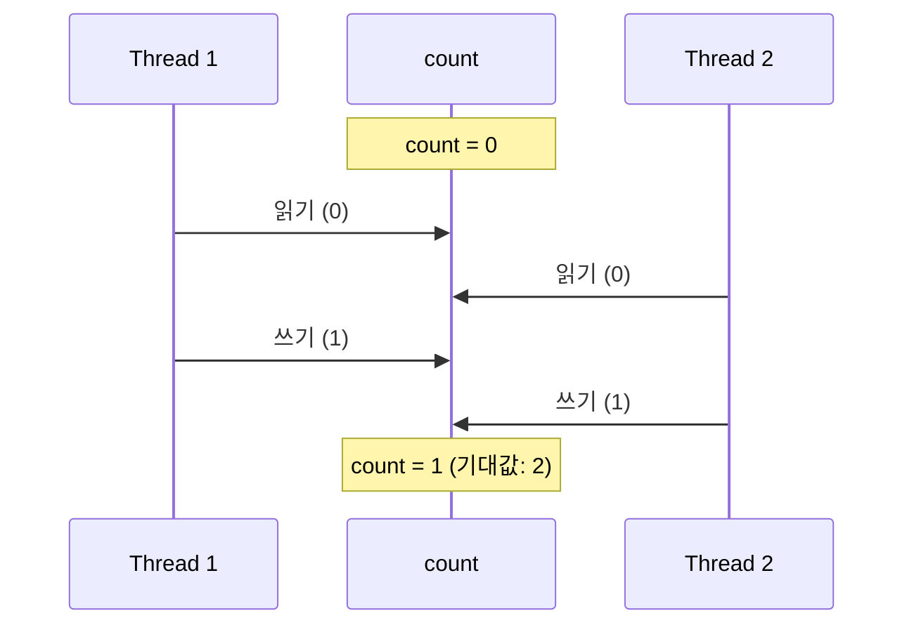
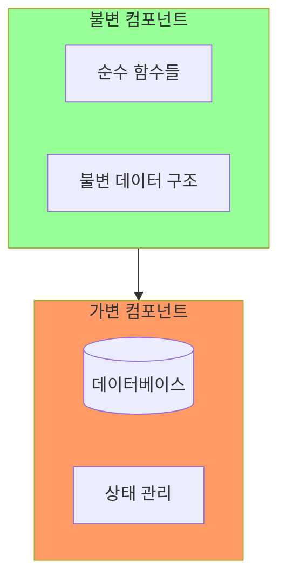
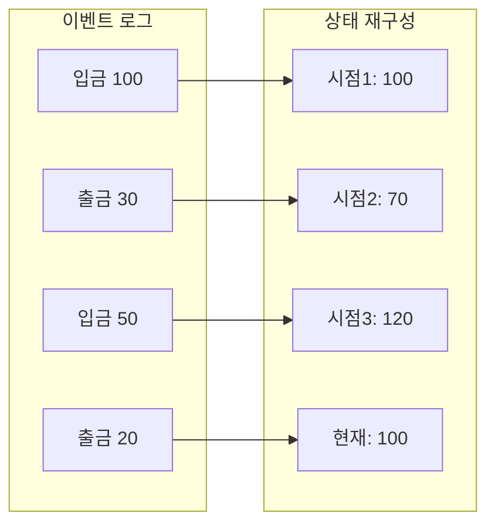
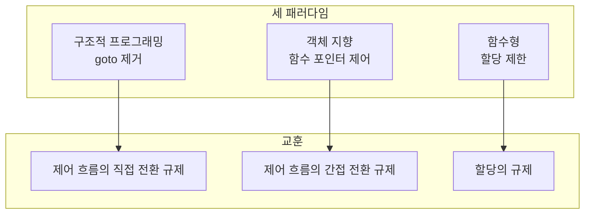
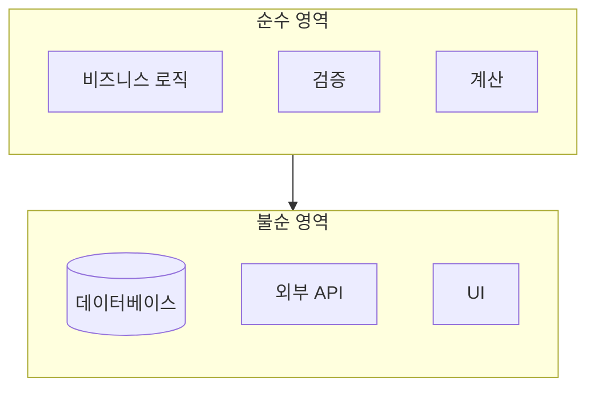

함수형 프로그래밍(FP)은 세 가지 패러다임 중 가장 오래되었지만, 가장 최근에 주목받기 시작했다. 1936년 알론조 처치(Alonzo Church)의 람다 계산법에서 시작된 이 패러다임은, **불변성(Immutability)**이라는 개념을 통해 현대 소프트웨어 아키텍처에 중요한 통찰을 제공한다.

## 람다 계산법과 함수형 프로그래밍의 기원

### 튜링 이전의 계산 이론

1936년, 앨런 튜링(Alan Turing)이 튜링 기계를 발표하기 전, 알론조 처치는 **람다 계산법(Lambda Calculus)**을 발명했다. 람다 계산법은 계산 가능성을 연구하기 위한 수학적 시스템이었다.

```
// 람다 계산법의 기본 형태
λx.x        // 항등 함수
λx.λy.x     // 첫 번째 인자를 반환
λf.λx.f(x)  // 함수를 한 번 적용
```

### LISP의 탄생

1958년, 존 매카시(John McCarthy)는 람다 계산법에 기반한 최초의 함수형 프로그래밍 언어 **LISP**를 개발했다.

```lisp
; LISP 코드 예시
(defun square (x) (* x x))
(defun sum-of-squares (x y) 
  (+ (square x) (square y)))
```

LISP는 현대까지 살아남아 Clojure, Racket 등의 형태로 사용되고 있다.

## 불변성: 함수형 프로그래밍의 핵심

### 함수형 언어에는 할당문이 없다

가장 엄격한 함수형 언어에서, **변수는 한 번 초기화되면 변경되지 않는다**.

```haskell
-- Haskell: 불변 변수
x = 5
-- x = 6  -- 오류! 재할당 불가
```

```java
// 명령형 프로그래밍: 가변 변수
int x = 5;
x = 6;  // OK: 재할당 가능
```

### 순수 함수 (Pure Function)

순수 함수는:
1. 같은 입력에 항상 같은 출력
2. 부수 효과(Side Effect)가 없음

```java
// 순수 함수
int add(int a, int b) {
    return a + b;  // 외부 상태 변경 없음
}

// 비순수 함수
int counter = 0;
int increment() {
    counter++;  // 외부 상태 변경 (부수 효과)
    return counter;
}
```

### 참조 투명성 (Referential Transparency)

순수 함수는 **참조 투명**하다. 함수 호출을 그 결과값으로 대체해도 프로그램의 의미가 변하지 않는다.

```java
// 참조 투명
int result = add(2, 3);  // 5
int result = 5;          // 동일한 의미

// 참조 불투명
int result = increment();  // 1
int result = 1;            // 동일하지 않음! (다음 호출은 2를 반환)
```

## 불변성이 해결하는 문제: 동시성

### 가변 상태의 저주

현대 소프트웨어의 가장 큰 문제 중 하나는 **동시성(Concurrency)**이다. 여러 스레드가 동시에 가변 상태에 접근하면:

```java
// 동시성 문제 예시
class Counter {
    private int count = 0;
    
    void increment() {
        count++;  // 위험! 원자적 연산이 아님
    }
}
```

`count++`는 실제로 세 단계로 이루어진다:
1. count 읽기
2. 1 더하기
3. count 쓰기

두 스레드가 동시에 실행하면:



이것이 **경쟁 조건(Race Condition)**이다.

### 전통적인 해결책: 락(Lock)

```java
class Counter {
    private int count = 0;
    private Object lock = new Object();
    
    void increment() {
        synchronized(lock) {  // 락 획득
            count++;
        }  // 락 해제
    }
}
```

그러나 락은:
- **데드락(Deadlock)** 위험
- **성능 저하**
- **복잡성 증가**

### 함수형 해결책: 불변성

**가변 상태가 없으면, 경쟁 조건도 없다.**

```java
// 불변 클래스
final class Counter {
    private final int count;
    
    public Counter(int count) {
        this.count = count;
    }
    
    public Counter increment() {
        return new Counter(count + 1);  // 새 객체 반환
    }
    
    public int getCount() {
        return count;
    }
}
```

여러 스레드가 동시에 `increment()`를 호출해도:
- 원본 객체는 변경되지 않음
- 각 스레드는 새 객체를 받음
- 락이 필요 없음

## 아키텍처에서의 불변성

### 완전한 불변성은 가능한가?

현실적으로, 모든 상태를 불변으로 만들기는 어렵다. 프로그램은 결국:
- 파일을 쓰고
- 데이터베이스를 업데이트하고
- 네트워크로 데이터를 전송한다

### 가변성의 분리 (Segregation of Mutability)

마틴은 **가변 컴포넌트와 불변 컴포넌트를 분리**할 것을 제안한다.



- **불변 컴포넌트**: 가능한 많이, 순수 함수로 구성
- **가변 컴포넌트**: 최소화, 격리

### 트랜잭션 메모리와 동시성

가변 상태가 필요한 곳에서는:
- **트랜잭션 메모리** 사용
- **적절한 락** 사용
- **원자적 연산** 사용

Clojure의 예:

```clojure
; Clojure의 원자적 상태 관리
(def counter (atom 0))
(swap! counter inc)  ; 원자적 증가
```

## 이벤트 소싱 (Event Sourcing)

### 상태 대신 이벤트 저장

전통적인 방식:
- 현재 상태만 저장
- 이전 상태는 사라짐

이벤트 소싱:
- 모든 변경을 이벤트로 저장
- 현재 상태는 이벤트들의 결과

```java
// 전통적인 방식
class Account {
    private BigDecimal balance;
    
    void deposit(BigDecimal amount) {
        balance = balance.add(amount);  // 상태 변경
    }
}

// 이벤트 소싱
class AccountEventStore {
    private List<Event> events = new ArrayList<>();
    
    void deposit(BigDecimal amount) {
        events.add(new DepositEvent(amount));  // 이벤트 추가
    }
    
    BigDecimal getBalance() {
        return events.stream()
            .reduce(BigDecimal.ZERO, this::applyEvent);  // 이벤트 재생
    }
}
```

### 이벤트 소싱의 장점



1. **완전한 이력**: 모든 변경 기록 보존
2. **시점 복원**: 어떤 시점의 상태든 재구성 가능
3. **감사 추적**: 누가, 언제, 무엇을 했는지 추적
4. **디버깅**: 버그 재현이 쉬움

### 저장 공간은?

"모든 이벤트를 저장하면 공간이 부족하지 않나?"

마틴은 답한다:
> "저장 공간은 빠르게 저렴해지고 있다. 더 이상 1960년대가 아니다."

필요하다면:
- 일정 시점까지의 **스냅샷** 저장
- 오래된 이벤트 **아카이브**
- **CQRS 패턴**으로 읽기/쓰기 분리

## 세 패러다임의 교훈



| 패러다임 | 제거하는 것 | 얻는 것 |
|----------|-----------|--------|
| 구조적 | goto | 증명/테스트 가능성 |
| 객체 지향 | 함수 포인터 남용 | 의존성 제어 |
| 함수형 | 할당 | 동시성 안전 |

> **"세 패러다임 모두 우리에게서 무언가를 빼앗는다. 권한을 부여하지 않는다."**
> — Robert C. Martin

## 아키텍처에 주는 교훈

### 1. 불변성을 최대화하라

```java
// 가능한 한 불변으로
public final class Order {
    private final OrderId id;
    private final List<OrderLine> lines;  // 불변 리스트
    
    public Order addLine(OrderLine line) {
        List<OrderLine> newLines = new ArrayList<>(lines);
        newLines.add(line);
        return new Order(id, Collections.unmodifiableList(newLines));
    }
}
```

### 2. 가변성을 격리하라



### 3. 이벤트 소싱을 고려하라

- 모든 시스템에 필요하진 않음
- 감사 추적이 중요한 도메인에 유용
- 이력과 복원이 필요한 경우 강력

## 핵심 요약

| 항목 | 내용 |
|------|------|
| 핵심 개념 | 불변성 (Immutability) |
| 제거하는 것 | 할당문 |
| 해결하는 문제 | 동시성, 경쟁 조건 |
| 아키텍처 적용 | 가변성 분리, 이벤트 소싱 |

> **"함수형 프로그래밍은 할당문에 대해 규칙을 부과한다."**
> — Robert C. Martin

## 패러다임을 마치며

세 가지 패러다임은 1958년부터 1968년 사이에 모두 발견되었다. 그 이후로 새로운 패러다임은 없다. 왜? 더 이상 빼앗을 것이 없기 때문이다.

- **구조적 프로그래밍**: 직접 제어 전환 제한
- **객체 지향**: 간접 제어 전환 제한
- **함수형**: 할당 제한

이 세 패러다임은 **아키텍처의 세 가지 큰 관심사**와 일치한다:

| 패러다임 | 아키텍처 관심사 |
|----------|----------------|
| 구조적 | 알고리즘 (함수의 내부) |
| 객체 지향 | 컴포넌트 분리 (의존성 관리) |
| 함수형 | 데이터 관리 (불변성) |

다음 파트에서는 이러한 패러다임 위에 구축되는 **설계 원칙(SOLID)**을 다룬다.
